This document describes how a file is extended by appending new storage space. The process chooses between appending a contiguous block or a regular cluster based on the file's mode, and updates the file system metadata accordingly.

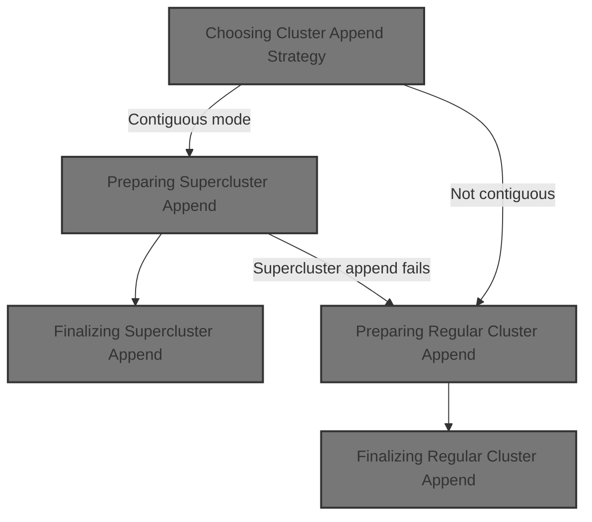

# Choosing Cluster Append Strategy

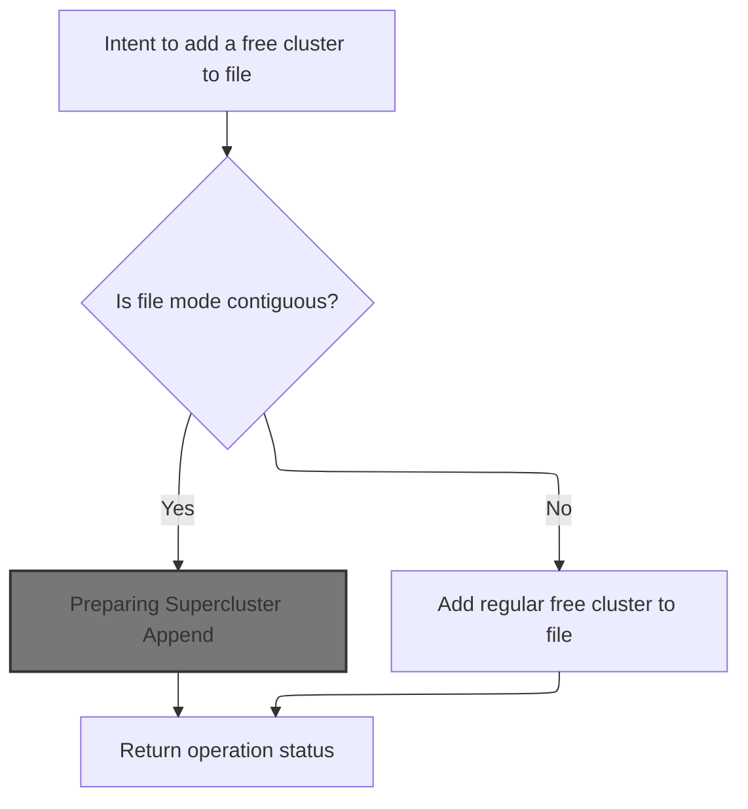

<SwmSnippet path="/src/main/io/asyncfatfs/asyncfatfs.c" line="1799">

---

In <SwmToken path="src/main/io/asyncfatfs/asyncfatfs.c" pos="1799:4:4" line-data="static afatfsOperationStatus_e afatfs_appendFreeCluster(afatfsFilePtr_t file)">`afatfs_appendFreeCluster`</SwmToken>, we start by checking if the file is in contiguous mode. If it is, we try to grab a supercluster from the freefile by calling <SwmToken path="src/main/io/asyncfatfs/asyncfatfs.c" pos="1806:5:5" line-data="        status = afatfs_appendSupercluster(file);">`afatfs_appendSupercluster`</SwmToken>. This lets us append a large chunk at once, which is faster and keeps the file layout contiguous. If not, we’ll handle regular clusters later.

```c
static afatfsOperationStatus_e afatfs_appendFreeCluster(afatfsFilePtr_t file)
{
    afatfsOperationStatus_e status;

#ifdef AFATFS_USE_FREEFILE
    if ((file->mode & AFATFS_FILE_MODE_CONTIGUOUS) != 0) {
        // Steal the first cluster from the beginning of the freefile if we can
        status = afatfs_appendSupercluster(file);
    } else
#endif
    {
```

---

</SwmSnippet>

## Preparing Supercluster Append

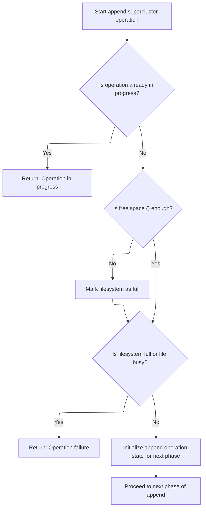

<SwmSnippet path="/src/main/io/asyncfatfs/asyncfatfs.c" line="1768">

---

<SwmToken path="src/main/io/asyncfatfs/asyncfatfs.c" pos="1768:4:4" line-data="static afatfsOperationStatus_e afatfs_appendSupercluster(afatfsFilePtr_t file)">`afatfs_appendSupercluster`</SwmToken> sets up the state for a multi-phase append operation. It checks for ongoing operations, makes sure there’s enough space, and initializes the operation state. Then it hands off to <SwmToken path="src/main/io/asyncfatfs/asyncfatfs.c" pos="1790:3:3" line-data="    return afatfs_appendSuperclusterContinue(file);">`afatfs_appendSuperclusterContinue`</SwmToken>, which actually runs the state machine to append the supercluster.

```c
static afatfsOperationStatus_e afatfs_appendSupercluster(afatfsFilePtr_t file)
{
    uint32_t superClusterSize = afatfs_superClusterSize();

    if (file->operation.operation == AFATFS_FILE_OPERATION_APPEND_SUPERCLUSTER) {
        return AFATFS_OPERATION_IN_PROGRESS;
    }

    if (afatfs.freeFile.logicalSize < superClusterSize) {
        afatfs.filesystemFull = true;
    }

    if (afatfs.filesystemFull || afatfs_fileIsBusy(file)) {
        return AFATFS_OPERATION_FAILURE;
    }

    afatfsAppendSupercluster_t *opState = &file->operation.state.appendSupercluster;

    file->operation.operation = AFATFS_FILE_OPERATION_APPEND_SUPERCLUSTER;
    opState->phase = AFATFS_APPEND_SUPERCLUSTER_PHASE_INIT;
    opState->previousCluster = file->cursorPreviousCluster;

    return afatfs_appendSuperclusterContinue(file);
}
```

---

</SwmSnippet>

## Supercluster Append State Machine

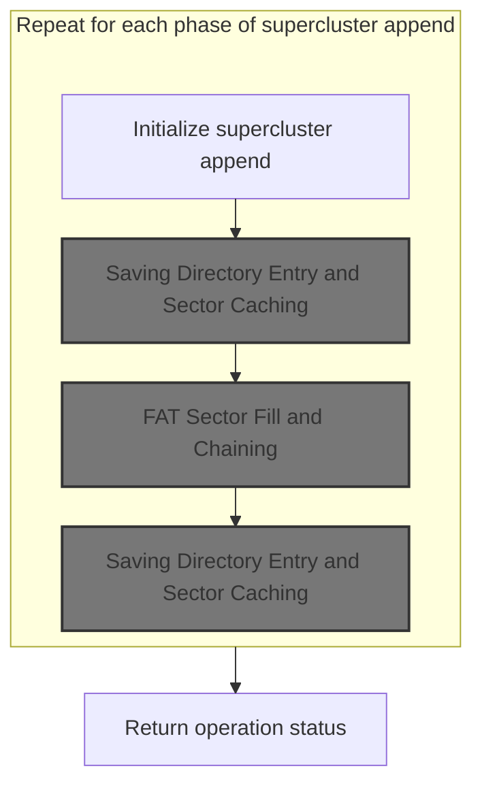

<SwmSnippet path="/src/main/io/asyncfatfs/asyncfatfs.c" line="1680">

---

In <SwmToken path="src/main/io/asyncfatfs/asyncfatfs.c" pos="1680:4:4" line-data="static afatfsOperationStatus_e afatfs_appendSuperclusterContinue(afatfsFile_t *file)">`afatfs_appendSuperclusterContinue`</SwmToken>, we kick off the state machine for appending a supercluster. We steal clusters from the freefile, update its metadata, and set up the FAT rewrite range. The next step is to save the freefile’s directory entry so we don’t risk <SwmToken path="src/main/io/asyncfatfs/asyncfatfs.c" pos="1726:37:39" line-data="            // First update the freefile&#39;s directory entry to remove the first supercluster so we don&#39;t risk cross-linking the file">`cross-linking`</SwmToken> before moving on to FAT updates.

```c
static afatfsOperationStatus_e afatfs_appendSuperclusterContinue(afatfsFile_t *file)
{
    afatfsAppendSupercluster_t *opState = &file->operation.state.appendSupercluster;

    afatfsOperationStatus_e status = AFATFS_OPERATION_FAILURE;

    doMore:
    switch (opState->phase) {
        case AFATFS_APPEND_SUPERCLUSTER_PHASE_INIT:
            // Our file steals the first cluster of the freefile

            // We can go ahead and write to that space before the FAT and directory are updated
            file->cursorCluster = afatfs.freeFile.firstCluster;
            file->physicalSize += afatfs_superClusterSize();

            /* Remove the first supercluster from the freefile
             *
             * Even if the freefile becomes empty, we still don't set its first cluster to zero. This is so that
             * afatfs_fileGetNextCluster() can tell where a contiguous file ends (at the start of the freefile).
             *
             * Note that normally the freefile can't become empty because it is allocated as a non-integer number
             * of superclusters to avoid precisely this situation.
             */
            afatfs.freeFile.firstCluster += afatfs_fatEntriesPerSector();
            afatfs.freeFile.logicalSize -= afatfs_superClusterSize();
            afatfs.freeFile.physicalSize -= afatfs_superClusterSize();

            // The new supercluster needs to have its clusters chained contiguously and marked with a terminator at the end
            opState->fatRewriteStartCluster = file->cursorCluster;
            opState->fatRewriteEndCluster = opState->fatRewriteStartCluster + afatfs_fatEntriesPerSector();

            if (opState->previousCluster == 0) {
                // This is the new first cluster in the file so we need to update the directory entry
                file->firstCluster = file->cursorCluster;
            } else {
                /*
                 * We also need to update the FAT of the supercluster that used to end the file so that it no longer
                 * terminates there
                 */
                opState->fatRewriteStartCluster -= afatfs_fatEntriesPerSector();
            }

            opState->phase = AFATFS_APPEND_SUPERCLUSTER_PHASE_UPDATE_FREEFILE_DIRECTORY;
            goto doMore;
        break;
        case AFATFS_APPEND_SUPERCLUSTER_PHASE_UPDATE_FREEFILE_DIRECTORY:
            // First update the freefile's directory entry to remove the first supercluster so we don't risk cross-linking the file
            status = afatfs_saveDirectoryEntry(&afatfs.freeFile, AFATFS_SAVE_DIRECTORY_NORMAL);

            if (status == AFATFS_OPERATION_SUCCESS) {
                opState->phase = AFATFS_APPEND_SUPERCLUSTER_PHASE_UPDATE_FAT;
                goto doMore;
            }
        break;
```

---

</SwmSnippet>

### Saving Directory Entry and Sector Caching

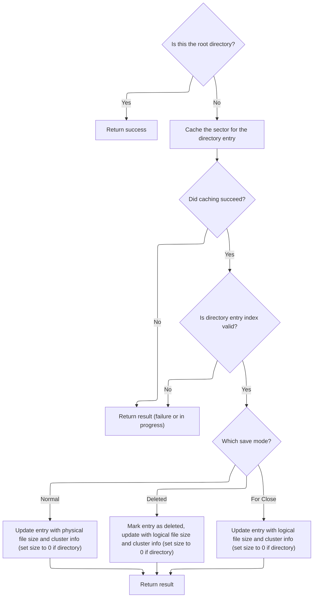

<SwmSnippet path="/src/main/io/asyncfatfs/asyncfatfs.c" line="1472">

---

In <SwmToken path="src/main/io/asyncfatfs/asyncfatfs.c" pos="1472:4:4" line-data="static afatfsOperationStatus_e afatfs_saveDirectoryEntry(afatfsFilePtr_t file, afatfsSaveDirectoryEntryMode_e mode)">`afatfs_saveDirectoryEntry`</SwmToken>, we check if the file is a root directory and bail out early if so. Otherwise, we cache the sector containing the directory entry for <SwmToken path="src/main/io/asyncfatfs/asyncfatfs.c" pos="2112:32:34" line-data=" *     AFATFS_OPERATION_IN_PROGRESS - The seek was queued and will complete later. Feel free to attempt read/write">`read/write`</SwmToken> access using <SwmToken path="src/main/io/asyncfatfs/asyncfatfs.c" pos="1481:5:5" line-data="    result = afatfs_cacheSector(file-&gt;directoryEntryPos.sectorNumberPhysical, &amp;sector, AFATFS_CACHE_READ | AFATFS_CACHE_WRITE, 0);">`afatfs_cacheSector`</SwmToken>. This lets us safely update the entry in memory before writing it back.

```c
static afatfsOperationStatus_e afatfs_saveDirectoryEntry(afatfsFilePtr_t file, afatfsSaveDirectoryEntryMode_e mode)
{
    uint8_t *sector;
    afatfsOperationStatus_e result;

    if (file->directoryEntryPos.sectorNumberPhysical == 0) {
        return AFATFS_OPERATION_SUCCESS; // Root directories don't have a directory entry
    }

    result = afatfs_cacheSector(file->directoryEntryPos.sectorNumberPhysical, &sector, AFATFS_CACHE_READ | AFATFS_CACHE_WRITE, 0);

#ifdef AFATFS_DEBUG_VERBOSE
```

---

</SwmSnippet>

<SwmSnippet path="/src/main/io/asyncfatfs/asyncfatfs.c" line="940">

---

<SwmToken path="src/main/io/asyncfatfs/asyncfatfs.c" pos="940:4:4" line-data="static afatfsOperationStatus_e afatfs_cacheSector(uint32_t physicalSectorIndex, uint8_t **buffer, uint8_t sectorFlags, uint32_t eraseCount)">`afatfs_cacheSector`</SwmToken> allocates a cache sector for the requested physical sector and manages its state. It blocks writes to the MBR, handles cache allocation failures by returning IN_PROGRESS, and uses a state machine to decide whether to read, write, or mark the sector dirty. It also supports <SwmToken path="src/main/io/asyncfatfs/asyncfatfs.c" pos="971:9:11" line-data="            // Don&#39;t bother pre-erasing for small block sequences">`pre-erasing`</SwmToken> for performance and uses flags to lock or retain cache sectors as needed.

```c
static afatfsOperationStatus_e afatfs_cacheSector(uint32_t physicalSectorIndex, uint8_t **buffer, uint8_t sectorFlags, uint32_t eraseCount)
{
    // We never write to the MBR, so any attempt to write there is an asyncfatfs bug
    if (!afatfs_assert((sectorFlags & AFATFS_CACHE_WRITE) == 0 || physicalSectorIndex != 0)) {
        return AFATFS_OPERATION_FAILURE;
    }

    int cacheSectorIndex = afatfs_allocateCacheSector(physicalSectorIndex);

    if (cacheSectorIndex == -1) {
        // We don't have enough free cache to service this request right now, try again later
        return AFATFS_OPERATION_IN_PROGRESS;
    }

    switch (afatfs.cacheDescriptor[cacheSectorIndex].state) {
        case AFATFS_CACHE_STATE_READING:
            return AFATFS_OPERATION_IN_PROGRESS;
        break;

        case AFATFS_CACHE_STATE_EMPTY:
            if ((sectorFlags & AFATFS_CACHE_READ) != 0) {
                if (sdcard_readBlock(physicalSectorIndex, afatfs_cacheSectorGetMemory(cacheSectorIndex), afatfs_sdcardReadComplete, 0)) {
                    afatfs.cacheDescriptor[cacheSectorIndex].state = AFATFS_CACHE_STATE_READING;
                }
                return AFATFS_OPERATION_IN_PROGRESS;
            }

            // We only get to decide these fields if we're the first ones to cache the sector:
            afatfs.cacheDescriptor[cacheSectorIndex].discardable = (sectorFlags & AFATFS_CACHE_DISCARDABLE) != 0 ? 1 : 0;

#ifdef AFATFS_MIN_MULTIPLE_BLOCK_WRITE_COUNT
            // Don't bother pre-erasing for small block sequences
            if (eraseCount < AFATFS_MIN_MULTIPLE_BLOCK_WRITE_COUNT) {
                eraseCount = 0;
            } else {
                eraseCount = MIN(eraseCount, (uint32_t)UINT16_MAX); // If caller asked for a longer chain of sectors we silently truncate that here
            }

            afatfs.cacheDescriptor[cacheSectorIndex].consecutiveEraseBlockCount = eraseCount;
#endif

            FALLTHROUGH;

        case AFATFS_CACHE_STATE_WRITING:
        case AFATFS_CACHE_STATE_IN_SYNC:
            if ((sectorFlags & AFATFS_CACHE_WRITE) != 0) {
                afatfs_cacheSectorMarkDirty(&afatfs.cacheDescriptor[cacheSectorIndex]);
            }
            FALLTHROUGH;

        case AFATFS_CACHE_STATE_DIRTY:
            if ((sectorFlags & AFATFS_CACHE_LOCK) != 0) {
                afatfs.cacheDescriptor[cacheSectorIndex].locked = 1;
            }
            if ((sectorFlags & AFATFS_CACHE_RETAIN) != 0) {
                afatfs.cacheDescriptor[cacheSectorIndex].retainCount++;
            }

            *buffer = afatfs_cacheSectorGetMemory(cacheSectorIndex);

            return AFATFS_OPERATION_SUCCESS;
        break;

        default:
            // Cache block in unknown state, should never happen
            afatfs_assert(false);
            return AFATFS_OPERATION_FAILURE;
    }
}
```

---

</SwmSnippet>

<SwmSnippet path="/src/main/io/asyncfatfs/asyncfatfs.c" line="1484">

---

Back in <SwmToken path="src/main/io/asyncfatfs/asyncfatfs.c" pos="1472:4:4" line-data="static afatfsOperationStatus_e afatfs_saveDirectoryEntry(afatfsFilePtr_t file, afatfsSaveDirectoryEntryMode_e mode)">`afatfs_saveDirectoryEntry`</SwmToken>, after caching the sector, we update the directory entry based on the save mode. For normal saves, we exaggerate the file size for reliability. Deleted mode marks the filename, and close mode writes the true logical size. Directories get size zero, and we split the cluster number for FAT entry format.

```c
    fprintf(stderr, "Saving directory entry to sector %u...\n", file->directoryEntryPos.sectorNumberPhysical);
#endif

    if (result == AFATFS_OPERATION_SUCCESS) {
        if (afatfs_assert(file->directoryEntryPos.entryIndex >= 0)) {
            fatDirectoryEntry_t *entry = (fatDirectoryEntry_t *) sector + file->directoryEntryPos.entryIndex;

            switch (mode) {
               case AFATFS_SAVE_DIRECTORY_NORMAL:
                   /* We exaggerate the length of the written file so that if power is lost, the end of the file will
                    * still be readable (though the very tail of the file will be uninitialized data).
                    *
                    * This way we can avoid updating the directory entry too many times during fwrites() on the file.
                    */
                   entry->fileSize = file->physicalSize;
               break;
               case AFATFS_SAVE_DIRECTORY_DELETED:
                   entry->filename[0] = FAT_DELETED_FILE_MARKER;
                   FALLTHROUGH;

               case AFATFS_SAVE_DIRECTORY_FOR_CLOSE:
                   // We write the true length of the file on close.
                   entry->fileSize = file->logicalSize;
            }

            // (sub)directories don't store a filesize in their directory entry:
            if (file->type == AFATFS_FILE_TYPE_DIRECTORY) {
                entry->fileSize = 0;
            }

            entry->firstClusterHigh = file->firstCluster >> 16;
            entry->firstClusterLow = file->firstCluster & 0xFFFF;
        } else {
            return AFATFS_OPERATION_FAILURE;
        }
    }

    return result;
}
```

---

</SwmSnippet>

### Updating FAT Chain for Supercluster

<SwmSnippet path="/src/main/io/asyncfatfs/asyncfatfs.c" line="1734">

---

Back in <SwmToken path="src/main/io/asyncfatfs/asyncfatfs.c" pos="1680:4:4" line-data="static afatfsOperationStatus_e afatfs_appendSuperclusterContinue(afatfsFile_t *file)">`afatfs_appendSuperclusterContinue`</SwmToken>, after updating the freefile’s directory entry, we move to updating the FAT. We call <SwmToken path="src/main/io/asyncfatfs/asyncfatfs.c" pos="1735:5:5" line-data="            status = afatfs_FATFillWithPattern(AFATFS_FAT_PATTERN_TERMINATED_CHAIN, &amp;opState-&gt;fatRewriteStartCluster, opState-&gt;fatRewriteEndCluster);">`afatfs_FATFillWithPattern`</SwmToken> to chain the new supercluster and mark its end with a terminator.

```c
        case AFATFS_APPEND_SUPERCLUSTER_PHASE_UPDATE_FAT:
            status = afatfs_FATFillWithPattern(AFATFS_FAT_PATTERN_TERMINATED_CHAIN, &opState->fatRewriteStartCluster, opState->fatRewriteEndCluster);

            if (status == AFATFS_OPERATION_SUCCESS) {
                opState->phase = AFATFS_APPEND_SUPERCLUSTER_PHASE_UPDATE_FILE_DIRECTORY;
                goto doMore;
            }
        break;
```

---

</SwmSnippet>

### FAT Sector Fill and Chaining

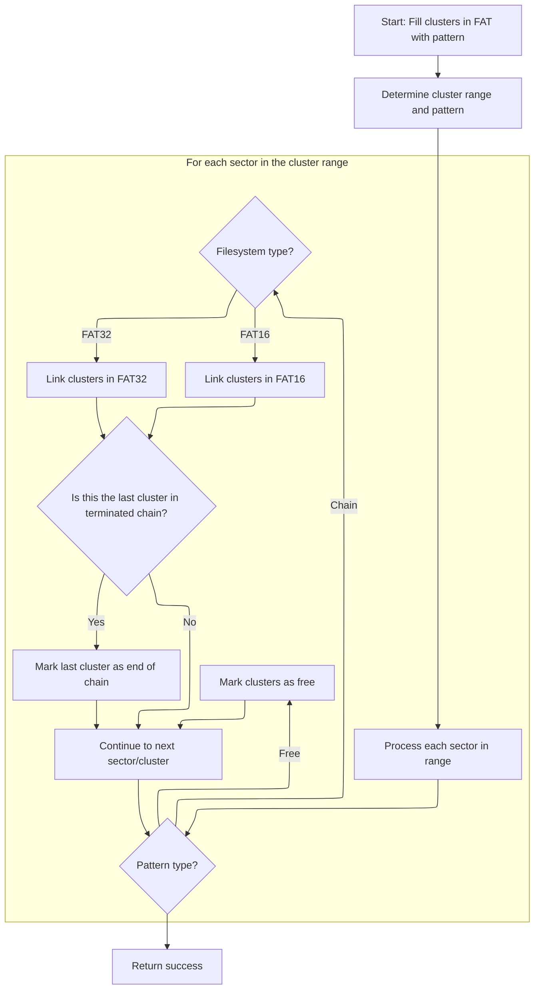

<SwmSnippet path="/src/main/io/asyncfatfs/asyncfatfs.c" line="1371">

---

In <SwmToken path="src/main/io/asyncfatfs/asyncfatfs.c" pos="1371:4:4" line-data="static afatfsOperationStatus_e afatfs_FATFillWithPattern(afatfsFATPattern_e pattern, uint32_t *startCluster, uint32_t endCluster)">`afatfs_FATFillWithPattern`</SwmToken>, we figure out where to start filling the FAT and how many sectors we’ll touch. We cache the relevant FAT sector before writing, so we can safely update cluster pointers in memory.

```c
static afatfsOperationStatus_e afatfs_FATFillWithPattern(afatfsFATPattern_e pattern, uint32_t *startCluster, uint32_t endCluster)
{
    afatfsFATSector_t sector;
    uint32_t fatSectorIndex, firstEntryIndex, fatPhysicalSector;
    uint8_t fatEntrySize;
    uint32_t nextCluster;
    afatfsOperationStatus_e result;
    uint32_t eraseSectorCount;

    // Find the position of the initial cluster to begin our fill
    afatfs_getFATPositionForCluster(*startCluster, &fatSectorIndex, &firstEntryIndex);

    fatPhysicalSector = afatfs_fatSectorToPhysical(0, fatSectorIndex);

    // How many consecutive FAT sectors will we be overwriting?
    eraseSectorCount = (endCluster - *startCluster + firstEntryIndex + afatfs_fatEntriesPerSector() - 1) / afatfs_fatEntriesPerSector();

    while (*startCluster < endCluster) {
        // The last entry we will fill inside this sector (exclusive):
        uint32_t lastEntryIndex = MIN(firstEntryIndex + (endCluster - *startCluster), afatfs_fatEntriesPerSector());

        uint8_t cacheFlags = AFATFS_CACHE_WRITE | AFATFS_CACHE_DISCARDABLE;

        if (firstEntryIndex > 0 || lastEntryIndex < afatfs_fatEntriesPerSector()) {
            // We're not overwriting the entire FAT sector so we must read the existing contents
            cacheFlags |= AFATFS_CACHE_READ;
        }

        result = afatfs_cacheSector(fatPhysicalSector, &sector.bytes, cacheFlags, eraseSectorCount);

        if (result != AFATFS_OPERATION_SUCCESS) {
            return result;
        }

#ifdef AFATFS_DEBUG_VERBOSE
```

---

</SwmSnippet>

<SwmSnippet path="/src/main/io/asyncfatfs/asyncfatfs.c" line="1406">

---

Back in <SwmToken path="src/main/io/asyncfatfs/asyncfatfs.c" pos="1371:4:4" line-data="static afatfsOperationStatus_e afatfs_FATFillWithPattern(afatfsFATPattern_e pattern, uint32_t *startCluster, uint32_t endCluster)">`afatfs_FATFillWithPattern`</SwmToken>, after caching the sector, we write the next cluster pointers for each entry. The logic branches for <SwmToken path="src/main/io/asyncfatfs/asyncfatfs.c" pos="22:9:9" line-data=" * This is a FAT16/FAT32 filesystem for SD cards which uses asynchronous operations: The caller need never wait">`FAT16`</SwmToken> and <SwmToken path="src/main/io/asyncfatfs/asyncfatfs.c" pos="22:11:11" line-data=" * This is a FAT16/FAT32 filesystem for SD cards which uses asynchronous operations: The caller need never wait">`FAT32`</SwmToken>, so we fill the right type of entry.

```c
        if (pattern == AFATFS_FAT_PATTERN_FREE) {
            fprintf(stderr, "Marking cluster %u to %u as free in FAT sector %u...\n", *startCluster, endCluster, fatPhysicalSector);
        } else {
            fprintf(stderr, "Writing FAT chain from cluster %u to %u in FAT sector %u...\n", *startCluster, endCluster, fatPhysicalSector);
        }
#endif

        switch (pattern) {
            case AFATFS_FAT_PATTERN_TERMINATED_CHAIN:
            case AFATFS_FAT_PATTERN_UNTERMINATED_CHAIN:
                nextCluster = *startCluster + 1;
                // Write all the "next cluster" pointers
                if (afatfs.filesystemType == FAT_FILESYSTEM_TYPE_FAT16) {
                    for (uint32_t i = firstEntryIndex; i < lastEntryIndex; i++, nextCluster++) {
                        sector.fat16[i] = nextCluster;
                    }
```

---

</SwmSnippet>

<SwmSnippet path="/src/main/io/asyncfatfs/asyncfatfs.c" line="1423">

---

Here we continue filling cluster pointers for <SwmToken path="src/main/io/asyncfatfs/asyncfatfs.c" pos="22:11:11" line-data=" * This is a FAT16/FAT32 filesystem for SD cards which uses asynchronous operations: The caller need never wait">`FAT32`</SwmToken>, just like we did for <SwmToken path="src/main/io/asyncfatfs/asyncfatfs.c" pos="22:9:9" line-data=" * This is a FAT16/FAT32 filesystem for SD cards which uses asynchronous operations: The caller need never wait">`FAT16`</SwmToken> above. This keeps the logic consistent for both FAT types.

```c
                    for (uint32_t i = firstEntryIndex; i < lastEntryIndex; i++, nextCluster++) {
                        sector.fat32[i] = nextCluster;
                    }
```

---

</SwmSnippet>

<SwmSnippet path="/src/main/io/asyncfatfs/asyncfatfs.c" line="1428">

---

Once all cluster pointers are filled, we mark the last one with a terminator if needed and return success.

```c
                *startCluster += lastEntryIndex - firstEntryIndex;

                if (pattern == AFATFS_FAT_PATTERN_TERMINATED_CHAIN && *startCluster == endCluster) {
                    // We completed the chain! Overwrite the last entry we wrote with the terminator for the end of the chain
                    if (afatfs.filesystemType == FAT_FILESYSTEM_TYPE_FAT16) {
                        sector.fat16[lastEntryIndex - 1] = 0xFFFF;
                    } else {
                        sector.fat32[lastEntryIndex - 1] = 0xFFFFFFFF;
                    }
                    break;
                }
            break;
            case AFATFS_FAT_PATTERN_FREE:
                fatEntrySize = afatfs.filesystemType == FAT_FILESYSTEM_TYPE_FAT16 ? sizeof(uint16_t) : sizeof(uint32_t);

                memset(sector.bytes + firstEntryIndex * fatEntrySize, 0, (lastEntryIndex - firstEntryIndex) * fatEntrySize);

                *startCluster += lastEntryIndex - firstEntryIndex;
            break;
        }

        fatPhysicalSector++;
        eraseSectorCount--;
        firstEntryIndex = 0;
    }

    return AFATFS_OPERATION_SUCCESS;
}
```

---

</SwmSnippet>

### Finalizing Supercluster Append

<SwmSnippet path="/src/main/io/asyncfatfs/asyncfatfs.c" line="1742">

---

Back in <SwmToken path="src/main/io/asyncfatfs/asyncfatfs.c" pos="1680:4:4" line-data="static afatfsOperationStatus_e afatfs_appendSuperclusterContinue(afatfsFile_t *file)">`afatfs_appendSuperclusterContinue`</SwmToken>, after updating the FAT, we update the file’s directory entry to reflect the new cluster chain and size. This keeps the file system metadata in sync.

```c
        case AFATFS_APPEND_SUPERCLUSTER_PHASE_UPDATE_FILE_DIRECTORY:
            // Update the fileSize/firstCluster in the directory entry for the file
            status = afatfs_saveDirectoryEntry(file, AFATFS_SAVE_DIRECTORY_NORMAL);
        break;
    }

```

---

</SwmSnippet>

<SwmSnippet path="/src/main/io/asyncfatfs/asyncfatfs.c" line="1748">

---

At the end of <SwmToken path="src/main/io/asyncfatfs/asyncfatfs.c" pos="1680:4:4" line-data="static afatfsOperationStatus_e afatfs_appendSuperclusterContinue(afatfsFile_t *file)">`afatfs_appendSuperclusterContinue`</SwmToken>, after updating the file’s directory entry, we reset the operation state to mark the append as finished. This assumes the file and <SwmToken path="src/main/io/asyncfatfs/asyncfatfs.c" pos="1263:6:6" line-data="        if (afatfs.freeFile.logicalSize &gt; 0 &amp;&amp; *cluster == afatfs.freeFile.firstCluster) {">`freeFile`</SwmToken> were set up correctly before starting.

```c
    if ((status == AFATFS_OPERATION_FAILURE || status == AFATFS_OPERATION_SUCCESS) && file->operation.operation == AFATFS_FILE_OPERATION_APPEND_SUPERCLUSTER) {
        file->operation.operation = AFATFS_FILE_OPERATION_NONE;
    }

    return status;
}
```

---

</SwmSnippet>

## Fallback to Regular Cluster Append

<SwmSnippet path="/src/main/io/asyncfatfs/asyncfatfs.c" line="1810">

---

Back in <SwmToken path="src/main/io/asyncfatfs/asyncfatfs.c" pos="1799:4:4" line-data="static afatfsOperationStatus_e afatfs_appendFreeCluster(afatfsFilePtr_t file)">`afatfs_appendFreeCluster`</SwmToken>, if we didn’t append a supercluster, we fall back to appending a regular free cluster by calling <SwmToken path="src/main/io/asyncfatfs/asyncfatfs.c" pos="1810:5:5" line-data="        status = afatfs_appendRegularFreeCluster(file);">`afatfs_appendRegularFreeCluster`</SwmToken>.

```c
        status = afatfs_appendRegularFreeCluster(file);
    }

    return status;
}
```

---

</SwmSnippet>

# Preparing Regular Cluster Append

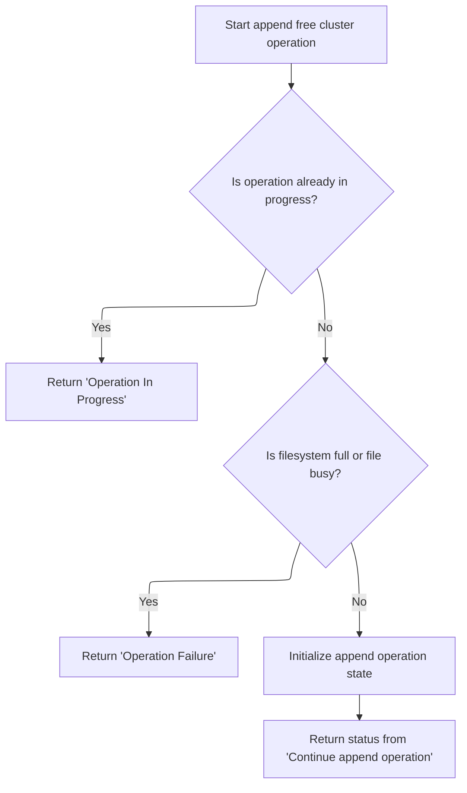

<SwmSnippet path="/src/main/io/asyncfatfs/asyncfatfs.c" line="1643">

---

<SwmToken path="src/main/io/asyncfatfs/asyncfatfs.c" pos="1643:4:4" line-data="static afatfsOperationStatus_e afatfs_appendRegularFreeCluster(afatfsFilePtr_t file)">`afatfs_appendRegularFreeCluster`</SwmToken> sets up the state for a regular cluster append and then calls <SwmToken path="src/main/io/asyncfatfs/asyncfatfs.c" pos="1656:3:3" line-data="    return afatfs_appendRegularFreeClusterContinue(file);">`afatfs_appendRegularFreeClusterContinue`</SwmToken> to run the state machine for the actual allocation.

```c
static afatfsOperationStatus_e afatfs_appendRegularFreeCluster(afatfsFilePtr_t file)
{
    if (file->operation.operation == AFATFS_FILE_OPERATION_APPEND_FREE_CLUSTER)
        return AFATFS_OPERATION_IN_PROGRESS;

    if (afatfs.filesystemFull || afatfs_fileIsBusy(file)) {
        return AFATFS_OPERATION_FAILURE;
    }

    file->operation.operation = AFATFS_FILE_OPERATION_APPEND_FREE_CLUSTER;

    afatfs_appendRegularFreeClusterInitOperationState(&file->operation.state.appendFreeCluster, file->cursorPreviousCluster);

    return afatfs_appendRegularFreeClusterContinue(file);
}
```

---

</SwmSnippet>

# Regular Cluster Append State Machine

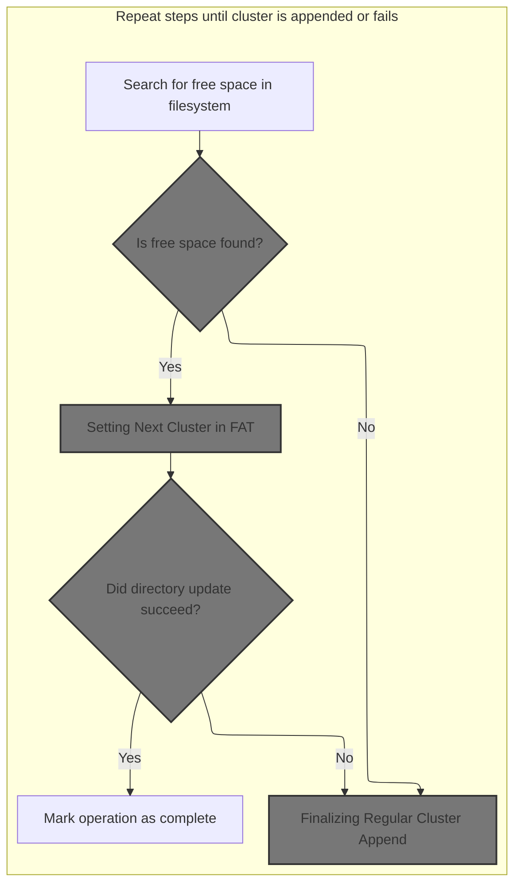

<SwmSnippet path="/src/main/io/asyncfatfs/asyncfatfs.c" line="1538">

---

In <SwmToken path="src/main/io/asyncfatfs/asyncfatfs.c" pos="1538:4:4" line-data="static afatfsOperationStatus_e afatfs_appendRegularFreeClusterContinue(afatfsFile_t *file)">`afatfs_appendRegularFreeClusterContinue`</SwmToken>, we start the state machine and immediately call <SwmToken path="src/main/io/asyncfatfs/asyncfatfs.c" pos="1547:4:4" line-data="            switch (afatfs_findClusterWithCondition(CLUSTER_SEARCH_FREE, &amp;opState-&gt;searchCluster, afatfs.numClusters + FAT_SMALLEST_LEGAL_CLUSTER_NUMBER)) {">`afatfs_findClusterWithCondition`</SwmToken> to locate a free cluster for appending.

```c
static afatfsOperationStatus_e afatfs_appendRegularFreeClusterContinue(afatfsFile_t *file)
{
    afatfsAppendFreeCluster_t *opState = &file->operation.state.appendFreeCluster;
    afatfsOperationStatus_e status;

    doMore:

    switch (opState->phase) {
        case AFATFS_APPEND_FREE_CLUSTER_PHASE_FIND_FREESPACE:
            switch (afatfs_findClusterWithCondition(CLUSTER_SEARCH_FREE, &opState->searchCluster, afatfs.numClusters + FAT_SMALLEST_LEGAL_CLUSTER_NUMBER)) {
```

---

</SwmSnippet>

## Searching for Free Cluster

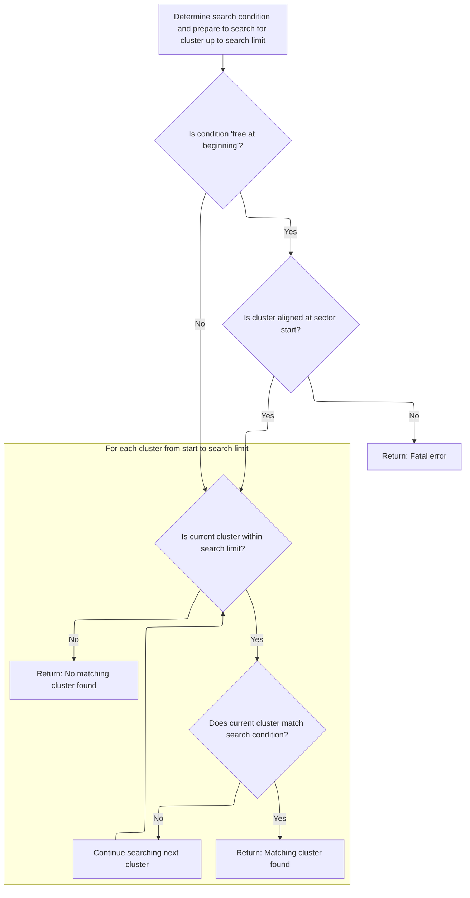

<SwmSnippet path="/src/main/io/asyncfatfs/asyncfatfs.c" line="1228">

---

In <SwmToken path="src/main/io/asyncfatfs/asyncfatfs.c" pos="1228:4:4" line-data="static afatfsFindClusterStatus_e afatfs_findClusterWithCondition(afatfsClusterSearchCondition_e condition, uint32_t *cluster, uint32_t searchLimit)">`afatfs_findClusterWithCondition`</SwmToken>, we set up the search for a free cluster, skipping the freefile range if needed and aligning the cluster pointer. We cache the FAT sector before checking entries to make sure we’re reading <SwmToken path="src/main/io/asyncfatfs/asyncfatfs.c" pos="2119:9:13" line-data="    // We need an up-to-date logical filesize so we can clamp seeks to the EOF">`up-to-date`</SwmToken> data.

```c
static afatfsFindClusterStatus_e afatfs_findClusterWithCondition(afatfsClusterSearchCondition_e condition, uint32_t *cluster, uint32_t searchLimit)
{
    afatfsFATSector_t sector;
    uint32_t fatSectorIndex, fatSectorEntryIndex;

    uint32_t fatEntriesPerSector = afatfs_fatEntriesPerSector();
    bool lookingForFree = condition == CLUSTER_SEARCH_FREE_AT_BEGINNING_OF_FAT_SECTOR || condition == CLUSTER_SEARCH_FREE;

    int jump;

    // Get the FAT entry which corresponds to this cluster so we can begin our search there
    afatfs_getFATPositionForCluster(*cluster, &fatSectorIndex, &fatSectorEntryIndex);

    switch (condition) {
        case CLUSTER_SEARCH_FREE_AT_BEGINNING_OF_FAT_SECTOR:
            jump = fatEntriesPerSector;

            // We're supposed to call this routine with the cluster properly aligned
            if (!afatfs_assert(fatSectorEntryIndex == 0)) {
                return AFATFS_FIND_CLUSTER_FATAL;
            }
        break;
        case CLUSTER_SEARCH_OCCUPIED:
        case CLUSTER_SEARCH_FREE:
            jump = 1;
        break;
        default:
            afatfs_assert(false);
            return AFATFS_FIND_CLUSTER_FATAL;
    }

    while (*cluster < searchLimit) {

#ifdef AFATFS_USE_FREEFILE
        // If we're looking inside the freefile, we won't find any free clusters! Skip it!
        if (afatfs.freeFile.logicalSize > 0 && *cluster == afatfs.freeFile.firstCluster) {
            *cluster += (afatfs.freeFile.logicalSize + afatfs_clusterSize() - 1) / afatfs_clusterSize();

            // Maintain alignment
            *cluster = roundUpTo(*cluster, jump);
            continue; // Go back to check that the new cluster number is within the volume
        }
#endif

        afatfsOperationStatus_e status = afatfs_cacheSector(afatfs_fatSectorToPhysical(0, fatSectorIndex), &sector.bytes, AFATFS_CACHE_READ | AFATFS_CACHE_DISCARDABLE, 0);

```

---

</SwmSnippet>

<SwmSnippet path="/src/main/io/asyncfatfs/asyncfatfs.c" line="1274">

---

Back in <SwmToken path="src/main/io/asyncfatfs/asyncfatfs.c" pos="1228:4:4" line-data="static afatfsFindClusterStatus_e afatfs_findClusterWithCondition(afatfsClusterSearchCondition_e condition, uint32_t *cluster, uint32_t searchLimit)">`afatfs_findClusterWithCondition`</SwmToken>, after caching the sector, we loop through entries, decode cluster numbers for <SwmToken path="src/main/io/asyncfatfs/asyncfatfs.c" pos="22:9:9" line-data=" * This is a FAT16/FAT32 filesystem for SD cards which uses asynchronous operations: The caller need never wait">`FAT16`</SwmToken> or <SwmToken path="src/main/io/asyncfatfs/asyncfatfs.c" pos="22:11:11" line-data=" * This is a FAT16/FAT32 filesystem for SD cards which uses asynchronous operations: The caller need never wait">`FAT32`</SwmToken>, and check if they match the search condition. We validate the cluster before returning success.

```c
        switch (status) {
            case AFATFS_OPERATION_SUCCESS:
                do {
                    uint32_t clusterNumber;

                    switch (afatfs.filesystemType) {
                        case FAT_FILESYSTEM_TYPE_FAT16:
                            clusterNumber = sector.fat16[fatSectorEntryIndex];
                        break;
                        case FAT_FILESYSTEM_TYPE_FAT32:
                            clusterNumber = fat32_decodeClusterNumber(sector.fat32[fatSectorEntryIndex]);
                        break;
                        default:
                            return AFATFS_FIND_CLUSTER_FATAL;
                    }

                    if (fat_isFreeSpace(clusterNumber) == lookingForFree) {
                        /*
                         * The final FAT sector may have fewer than fatEntriesPerSector entries in it, so we need to
                         * check the cluster number is valid here before we report a bogus success!
                         */
                        if (*cluster < searchLimit) {
                            return AFATFS_FIND_CLUSTER_FOUND;
                        } else {
                            *cluster = searchLimit;
                            return AFATFS_FIND_CLUSTER_NOT_FOUND;
                        }
                    }

                    (*cluster) += jump;
                    fatSectorEntryIndex += jump;
                } while (fatSectorEntryIndex < fatEntriesPerSector);
```

---

</SwmSnippet>

<SwmSnippet path="/src/main/io/asyncfatfs/asyncfatfs.c" line="1307">

---

Once the search is done in <SwmToken path="src/main/io/asyncfatfs/asyncfatfs.c" pos="1228:4:4" line-data="static afatfsFindClusterStatus_e afatfs_findClusterWithCondition(afatfsClusterSearchCondition_e condition, uint32_t *cluster, uint32_t searchLimit)">`afatfs_findClusterWithCondition`</SwmToken>, we return FOUND if a match was found, NOT_FOUND if we hit the limit, or FATAL/IN_PROGRESS for errors or async states.

```c
                // Move on to the next FAT sector
                fatSectorIndex++;
                fatSectorEntryIndex = 0;
            break;
            case AFATFS_OPERATION_FAILURE:
                return AFATFS_FIND_CLUSTER_FATAL;
            break;
            case AFATFS_OPERATION_IN_PROGRESS:
                return AFATFS_FIND_CLUSTER_IN_PROGRESS;
            break;
        }
    }

    // We looked at every available cluster and didn't find one matching the condition
    *cluster = searchLimit;
    return AFATFS_FIND_CLUSTER_NOT_FOUND;
}
```

---

</SwmSnippet>

## Allocating and Linking New Cluster

```mermaid
%%{init: {"flowchart": {"defaultRenderer": "elk"}} }%%
flowchart TD
    node1["Attempt to find a free cluster"]
    click node1 openCode "src/main/io/asyncfatfs/asyncfatfs.c:1548:1571"
    node1 --> node2{"Cluster found?"}
    click node2 openCode "src/main/io/asyncfatfs/asyncfatfs.c:1548:1571"
    node2 -->|"Yes"| node3["Allocate cluster, update file size"]
    click node3 openCode "src/main/io/asyncfatfs/asyncfatfs.c:1549:1553"
    node2 -->|"No or Fatal"| node8["Mark operation as failure"]
    click node8 openCode "src/main/io/asyncfatfs/asyncfatfs.c:1564:1567"
    node3 --> node4{"First cluster in file?"}
    click node4 openCode "src/main/io/asyncfatfs/asyncfatfs.c:1555:1558"
    node4 -->|"Yes"| node5["Set as first cluster"]
    click node5 openCode "src/main/io/asyncfatfs/asyncfatfs.c:1557:1558"
    node4 -->|"No"| node7["Update FAT to terminate new cluster"]
    node5 --> node7
    node7["Update FAT to terminate new cluster"]
    click node7 openCode "src/main/io/asyncfatfs/asyncfatfs.c:1574:1575"
    node7 --> node9{"FAT update success?"}
    click node9 openCode "src/main/io/asyncfatfs/asyncfatfs.c:1577:1585"
    node9 -->|"Yes"| node10{"Previous cluster exists?"}
    click node10 openCode "src/main/io/asyncfatfs/asyncfatfs.c:1578:1582"
    node10 -->|"Yes"| node11["Link previous cluster to new cluster"]
    click node11 openCode "src/main/io/asyncfatfs/asyncfatfs.c:1588:1594"
    node10 -->|"No"| node12["Update file directory"]
    click node12 openCode "src/main/io/asyncfatfs/asyncfatfs.c:1581:1582"
    node11 --> node12
    node9 -->|"No"| node8
classDef HeadingStyle fill:#777777,stroke:#333,stroke-width:2px;

%% Swimm:
%% %%{init: {"flowchart": {"defaultRenderer": "elk"}} }%%
%% flowchart TD
%%     node1["Attempt to find a free cluster"]
%%     click node1 openCode "<SwmPath>[src/…/asyncfatfs/asyncfatfs.c](src/main/io/asyncfatfs/asyncfatfs.c)</SwmPath>:1548:1571"
%%     node1 --> node2{"Cluster found?"}
%%     click node2 openCode "<SwmPath>[src/…/asyncfatfs/asyncfatfs.c](src/main/io/asyncfatfs/asyncfatfs.c)</SwmPath>:1548:1571"
%%     node2 -->|"Yes"| node3["Allocate cluster, update file size"]
%%     click node3 openCode "<SwmPath>[src/…/asyncfatfs/asyncfatfs.c](src/main/io/asyncfatfs/asyncfatfs.c)</SwmPath>:1549:1553"
%%     node2 -->|"No or Fatal"| node8["Mark operation as failure"]
%%     click node8 openCode "<SwmPath>[src/…/asyncfatfs/asyncfatfs.c](src/main/io/asyncfatfs/asyncfatfs.c)</SwmPath>:1564:1567"
%%     node3 --> node4{"First cluster in file?"}
%%     click node4 openCode "<SwmPath>[src/…/asyncfatfs/asyncfatfs.c](src/main/io/asyncfatfs/asyncfatfs.c)</SwmPath>:1555:1558"
%%     node4 -->|"Yes"| node5["Set as first cluster"]
%%     click node5 openCode "<SwmPath>[src/…/asyncfatfs/asyncfatfs.c](src/main/io/asyncfatfs/asyncfatfs.c)</SwmPath>:1557:1558"
%%     node4 -->|"No"| node7["Update FAT to terminate new cluster"]
%%     node5 --> node7
%%     node7["Update FAT to terminate new cluster"]
%%     click node7 openCode "<SwmPath>[src/…/asyncfatfs/asyncfatfs.c](src/main/io/asyncfatfs/asyncfatfs.c)</SwmPath>:1574:1575"
%%     node7 --> node9{"FAT update success?"}
%%     click node9 openCode "<SwmPath>[src/…/asyncfatfs/asyncfatfs.c](src/main/io/asyncfatfs/asyncfatfs.c)</SwmPath>:1577:1585"
%%     node9 -->|"Yes"| node10{"Previous cluster exists?"}
%%     click node10 openCode "<SwmPath>[src/…/asyncfatfs/asyncfatfs.c](src/main/io/asyncfatfs/asyncfatfs.c)</SwmPath>:1578:1582"
%%     node10 -->|"Yes"| node11["Link previous cluster to new cluster"]
%%     click node11 openCode "<SwmPath>[src/…/asyncfatfs/asyncfatfs.c](src/main/io/asyncfatfs/asyncfatfs.c)</SwmPath>:1588:1594"
%%     node10 -->|"No"| node12["Update file directory"]
%%     click node12 openCode "<SwmPath>[src/…/asyncfatfs/asyncfatfs.c](src/main/io/asyncfatfs/asyncfatfs.c)</SwmPath>:1581:1582"
%%     node11 --> node12
%%     node9 -->|"No"| node8
%% classDef HeadingStyle fill:#777777,stroke:#333,stroke-width:2px;
```

<SwmSnippet path="/src/main/io/asyncfatfs/asyncfatfs.c" line="1548">

---

Back in <SwmToken path="src/main/io/asyncfatfs/asyncfatfs.c" pos="1538:4:4" line-data="static afatfsOperationStatus_e afatfs_appendRegularFreeClusterContinue(afatfsFile_t *file)">`afatfs_appendRegularFreeClusterContinue`</SwmToken>, after finding a free cluster, we allocate it for the file and call <SwmToken path="src/main/io/asyncfatfs/asyncfatfs.c" pos="1575:5:5" line-data="            status = afatfs_FATSetNextCluster(opState-&gt;searchCluster, 0xFFFFFFFF);">`afatfs_FATSetNextCluster`</SwmToken> to terminate its chain or link it to the previous cluster.

```c
                case AFATFS_FIND_CLUSTER_FOUND:
                    afatfs.lastClusterAllocated = opState->searchCluster;

                    // Make the cluster available for us to write in
                    file->cursorCluster = opState->searchCluster;
                    file->physicalSize += afatfs_clusterSize();

                    if (opState->previousCluster == 0) {
                        // This is the new first cluster in the file
                        file->firstCluster = opState->searchCluster;
                    }

                    opState->phase = AFATFS_APPEND_FREE_CLUSTER_PHASE_UPDATE_FAT1;
                    goto doMore;
                break;
                case AFATFS_FIND_CLUSTER_FATAL:
                case AFATFS_FIND_CLUSTER_NOT_FOUND:
                    // We couldn't find an empty cluster to append to the file
                    opState->phase = AFATFS_APPEND_FREE_CLUSTER_PHASE_FAILURE;
                    goto doMore;
                break;
                case AFATFS_FIND_CLUSTER_IN_PROGRESS:
                break;
            }
        break;
        case AFATFS_APPEND_FREE_CLUSTER_PHASE_UPDATE_FAT1:
            // Terminate the new cluster
            status = afatfs_FATSetNextCluster(opState->searchCluster, 0xFFFFFFFF);

            if (status == AFATFS_OPERATION_SUCCESS) {
                if (opState->previousCluster) {
                    opState->phase = AFATFS_APPEND_FREE_CLUSTER_PHASE_UPDATE_FAT2;
                } else {
                    opState->phase = AFATFS_APPEND_FREE_CLUSTER_PHASE_UPDATE_FILE_DIRECTORY;
                }

                goto doMore;
            }
        break;
        case AFATFS_APPEND_FREE_CLUSTER_PHASE_UPDATE_FAT2:
            // Add the new cluster to the pre-existing chain
            status = afatfs_FATSetNextCluster(opState->previousCluster, opState->searchCluster);

            if (status == AFATFS_OPERATION_SUCCESS) {
                opState->phase = AFATFS_APPEND_FREE_CLUSTER_PHASE_UPDATE_FILE_DIRECTORY;
                goto doMore;
            }
        break;
```

---

</SwmSnippet>

## Setting Next Cluster in FAT

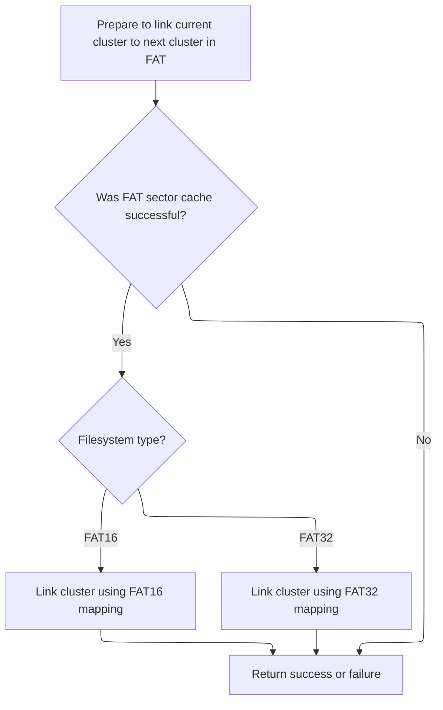

<SwmSnippet path="/src/main/io/asyncfatfs/asyncfatfs.c" line="1161">

---

In <SwmToken path="src/main/io/asyncfatfs/asyncfatfs.c" pos="1161:4:4" line-data="static afatfsOperationStatus_e afatfs_FATSetNextCluster(uint32_t startCluster, uint32_t nextCluster)">`afatfs_FATSetNextCluster`</SwmToken>, we cache the FAT sector for <SwmToken path="src/main/io/asyncfatfs/asyncfatfs.c" pos="2112:32:34" line-data=" *     AFATFS_OPERATION_IN_PROGRESS - The seek was queued and will complete later. Feel free to attempt read/write">`read/write`</SwmToken> so we can safely update the next cluster pointer for <SwmToken path="src/main/io/asyncfatfs/asyncfatfs.c" pos="22:9:9" line-data=" * This is a FAT16/FAT32 filesystem for SD cards which uses asynchronous operations: The caller need never wait">`FAT16`</SwmToken> or <SwmToken path="src/main/io/asyncfatfs/asyncfatfs.c" pos="22:11:11" line-data=" * This is a FAT16/FAT32 filesystem for SD cards which uses asynchronous operations: The caller need never wait">`FAT32`</SwmToken>.

```c
static afatfsOperationStatus_e afatfs_FATSetNextCluster(uint32_t startCluster, uint32_t nextCluster)
{
    afatfsFATSector_t sector;
    uint32_t fatSectorIndex, fatSectorEntryIndex, fatPhysicalSector;
    afatfsOperationStatus_e result;

#ifdef AFATFS_DEBUG
    afatfs_assert(startCluster >= FAT_SMALLEST_LEGAL_CLUSTER_NUMBER);
#endif

    afatfs_getFATPositionForCluster(startCluster, &fatSectorIndex, &fatSectorEntryIndex);

    fatPhysicalSector = afatfs_fatSectorToPhysical(0, fatSectorIndex);

    result = afatfs_cacheSector(fatPhysicalSector, &sector.bytes, AFATFS_CACHE_READ | AFATFS_CACHE_WRITE, 0);

```

---

</SwmSnippet>

<SwmSnippet path="/src/main/io/asyncfatfs/asyncfatfs.c" line="1177">

---

Back in <SwmToken path="src/main/io/asyncfatfs/asyncfatfs.c" pos="1161:4:4" line-data="static afatfsOperationStatus_e afatfs_FATSetNextCluster(uint32_t startCluster, uint32_t nextCluster)">`afatfs_FATSetNextCluster`</SwmToken>, after caching the sector, we update the FAT entry for <SwmToken path="src/main/io/asyncfatfs/asyncfatfs.c" pos="22:9:9" line-data=" * This is a FAT16/FAT32 filesystem for SD cards which uses asynchronous operations: The caller need never wait">`FAT16`</SwmToken> or <SwmToken path="src/main/io/asyncfatfs/asyncfatfs.c" pos="22:11:11" line-data=" * This is a FAT16/FAT32 filesystem for SD cards which uses asynchronous operations: The caller need never wait">`FAT32`</SwmToken> and return the result.

```c
    if (result == AFATFS_OPERATION_SUCCESS) {
        if (afatfs.filesystemType == FAT_FILESYSTEM_TYPE_FAT16) {
            sector.fat16[fatSectorEntryIndex] = nextCluster;
        } else {
            sector.fat32[fatSectorEntryIndex] = nextCluster;
        }
    }

    return result;
}
```

---

</SwmSnippet>

## Finalizing Regular Cluster Append

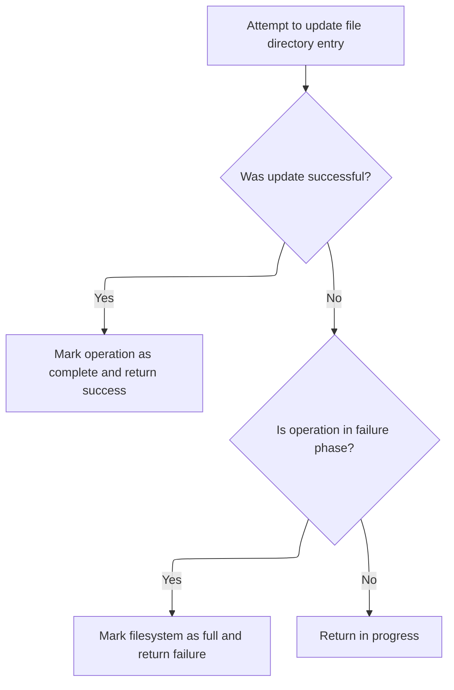

<SwmSnippet path="/src/main/io/asyncfatfs/asyncfatfs.c" line="1596">

---

Back in <SwmToken path="src/main/io/asyncfatfs/asyncfatfs.c" pos="1538:4:4" line-data="static afatfsOperationStatus_e afatfs_appendRegularFreeClusterContinue(afatfsFile_t *file)">`afatfs_appendRegularFreeClusterContinue`</SwmToken>, after updating the FAT, we update the file’s directory entry to reflect the new cluster chain and size.

```c
        case AFATFS_APPEND_FREE_CLUSTER_PHASE_UPDATE_FILE_DIRECTORY:
            if (afatfs_saveDirectoryEntry(file, AFATFS_SAVE_DIRECTORY_NORMAL) == AFATFS_OPERATION_SUCCESS) {
                opState->phase = AFATFS_APPEND_FREE_CLUSTER_PHASE_COMPLETE;
                goto doMore;
            }
        break;
```

---

</SwmSnippet>

<SwmSnippet path="/src/main/io/asyncfatfs/asyncfatfs.c" line="1602">

---

At the end of <SwmToken path="src/main/io/asyncfatfs/asyncfatfs.c" pos="1538:4:4" line-data="static afatfsOperationStatus_e afatfs_appendRegularFreeClusterContinue(afatfsFile_t *file)">`afatfs_appendRegularFreeClusterContinue`</SwmToken>, after updating the directory entry, we reset the operation state and return success or failure. If no clusters were found, we mark the filesystem as full.

```c
        case AFATFS_APPEND_FREE_CLUSTER_PHASE_COMPLETE:
            if (file->operation.operation == AFATFS_FILE_OPERATION_APPEND_FREE_CLUSTER) {
                file->operation.operation = AFATFS_FILE_OPERATION_NONE;
            }

            return AFATFS_OPERATION_SUCCESS;
        break;
        case AFATFS_APPEND_FREE_CLUSTER_PHASE_FAILURE:
            if (file->operation.operation == AFATFS_FILE_OPERATION_APPEND_FREE_CLUSTER) {
                file->operation.operation = AFATFS_FILE_OPERATION_NONE;
            }

            afatfs.filesystemFull = true;
            return AFATFS_OPERATION_FAILURE;
        break;
    }

    return AFATFS_OPERATION_IN_PROGRESS;
}
```

---

</SwmSnippet>

&nbsp;

*This is an auto-generated document by Swimm 🌊 and has not yet been verified by a human*

<SwmMeta version="3.0.0" repo-id="Z2l0aHViJTNBJTNBYy1iZXRhZmxpZ2h0JTNBJTNBcmljYXJkb2xvcGV6Zw==" repo-name="c-betaflight"><sup>Powered by [Swimm](https://app.swimm.io/)</sup></SwmMeta>
