This document describes how compass sensor data is processed, calibrated, and corrected for use in flight control. The flow receives raw sensor data and calibration state, manages calibration routines including user feedback and persistent storage, and outputs bias-corrected compass data for reliable heading information.

# Handling Compass Sensor Data and Calibration

<SwmSnippet path="/src/main/sensors/compass.c" line="423">

---

In <SwmToken path="src/main/sensors/compass.c" pos="423:2:2" line-data="uint32_t compassUpdate(timeUs_t currentTimeUs)">`compassUpdate`</SwmToken>, we start by checking if the sensor bus is busy or if new magnetometer data is available. If either check fails, the function returns early with a recommended retry interval. Only when new data is available does the function proceed to process sensor alignment, calibration, and debug output. This section sets up the timing and state for the rest of the update and calibration logic.

```c
uint32_t compassUpdate(timeUs_t currentTimeUs)
{
    static timeUs_t previousTaskTimeUs = 0;
    const timeDelta_t dTaskTimeUs = cmpTimeUs(currentTimeUs, previousTaskTimeUs);
    previousTaskTimeUs = currentTimeUs;
    DEBUG_SET(DEBUG_MAG_TASK_RATE, 6, dTaskTimeUs);

    bool checkBusBusy = busBusy(&magDev.dev, NULL);
    DEBUG_SET(DEBUG_MAG_TASK_RATE, 4, checkBusBusy);
    if (checkBusBusy) {
        // No action is taken, as the bus was busy.
        schedulerIgnoreTaskExecRate();
        return COMPASS_BUS_BUSY_INTERVAL_US; // come back in 500us, maybe the bus won't be busy then
    }

    bool checkReadState = !magDev.read(&magDev, magADCRaw);
    DEBUG_SET(DEBUG_MAG_TASK_RATE, 5, checkReadState);
    if (checkReadState) {
        // The compass reported no data available to be retrieved; it may use a state engine that has more than one read state
        schedulerIgnoreTaskExecRate();
        return COMPASS_RECHECK_INTERVAL_US; // come back in 1ms, maybe data will be available then
    }

    // if we get here, we have new data to parse
    for (int axis = 0; axis < XYZ_AXIS_COUNT; axis++) {
        mag.magADC.v[axis] = magADCRaw[axis];
    }
```

---

</SwmSnippet>

<SwmSnippet path="/src/main/sensors/compass.c" line="450">

---

After reading and aligning the sensor data, we check if calibration is active. If so, we use gyro data to detect movement. If movement is detected, we alert the user, reset calibration values, and start collecting calibration data. This section manages the calibration state and transitions based on user movement.

```c
    // If debug_mode is DEBUG_GPS_RESCUE_HEADING, we should update the magYaw value, after which isNewMagADCFlag will be set false
    mag.isNewMagADCFlag = true;

    if (magDev.magAlignment == ALIGN_CUSTOM) {
        alignSensorViaMatrix(&mag.magADC, &magDev.rotationMatrix);
    } else {
        alignSensorViaRotation(&mag.magADC, magDev.magAlignment);
    }

    // get stored cal/bias values
    flightDynamicsTrims_t *magZero = &compassConfigMutable()->magZero;

    // ** perform calibration, if initiated by switch or Configurator button **
    if (magCalProcessActive) {
        if (cmpTimeUs(magCalEndTime, currentTimeUs) > 0) {
                // compare squared norm of rotation rate to GYRO_NORM_SQUARED_MIN
            float gyroNormSquared = 0.0f;
            for (int axis = 0; axis < XYZ_AXIS_COUNT; axis++) {
                gyroNormSquared += sq(DEGREES_TO_RADIANS(gyroGetFilteredDownsampled(axis)));
            }
```

---

</SwmSnippet>

<SwmSnippet path="/src/main/sensors/compass.c" line="470">

---

Once movement is detected, we beep to notify the user, clear out old calibration biases, and mark calibration as started. This sets up the state for collecting new calibration data in the next steps.

```c
            if (!didMovementStart && gyroNormSquared > GYRO_NORM_SQUARED_MIN) {
                // movement has started
                beeper(BEEPER_READY_BEEP); // Beep to alert user to start moving the quad (does this work?)
                // zero the old cal/bias values
                for (int axis = 0; axis < XYZ_AXIS_COUNT; axis++) {
                    magZero->raw[axis] = 0;
                }
```

---

</SwmSnippet>

<SwmSnippet path="/src/main/sensors/compass.c" line="477">

---

After starting calibration, we keep the LED on and feed magnetometer data to the bias estimator while movement is ongoing. Once the calibration period ends, we move to finalizing calibration results.

```c
                didMovementStart = true;
                // the user has CALIBRATION_TIME_US from now to move the quad in all directions
                magCalEndTime = micros() + CALIBRATION_TIME_US;
            }
            // start acquiring mag data and computing new cal factors
            if (didMovementStart) {
                // LED will flash at task rate while calibrating, looks like 'ON' all the time.
                LED0_ON;
                compassBiasEstimatorApply(&compassBiasEstimator, &mag.magADC);
            }
        } else {
            // mag cal process is not complete until the new cal values are saved
            if (magCalProcessActive) {
                // if movement started, accept whatever cal/bias values are available at the end of the movement period
                if (didMovementStart) {
                    for (int axis = 0; axis < XYZ_AXIS_COUNT; axis++) {
                        magZero->raw[axis] = lrintf(compassBiasEstimator.b[axis]);
                    }
```

---

</SwmSnippet>

<SwmSnippet path="/src/main/sensors/compass.c" line="495">

---

After calibration ends, if movement was detected, we store the new calibration biases, beep for success, and call <SwmToken path="src/main/sensors/compass.c" pos="496:1:1" line-data="                    saveConfigAndNotify();">`saveConfigAndNotify`</SwmToken> to persist the new settings. If not, we beep for failure. This wraps up the calibration state and triggers config save logic in <SwmPath>[src/…/config/config.c](src/main/config/config.c)</SwmPath>.

```c
                    beeper(BEEPER_GYRO_CALIBRATED); // re-purpose gyro cal success beep
                    saveConfigAndNotify();
                } else {
                    // there was no movement, and no new calibration values were saved
                    beeper(BEEPER_ACC_CALIBRATION_FAIL); // calibration fail beep
                }
                // didMovementStart remains true until next run
                // signal that the calibration process is finalised, whether successful or not, by setting end time to zero
                magCalProcessActive = false;
            }
        }
    }

```

---

</SwmSnippet>

## Persisting Calibration Data

<SwmSnippet path="/src/main/config/config.c" line="735">

---

In <SwmToken path="src/main/config/config.c" pos="735:2:2" line-data="void saveConfigAndNotify(void)">`saveConfigAndNotify`</SwmToken>, we handle the EEPROM write and read, making sure the scheduler doesn't care about the delay.

```c
void saveConfigAndNotify(void)
{
    // The write to EEPROM will cause a big delay in the current task, so ignore
    schedulerIgnoreTaskExecTime();

    writeEEPROM();
    readEEPROM();
```

---

</SwmSnippet>

### Reloading Configuration from Storage

See <SwmLink doc-title="Loading and Applying Configuration Settings">[Loading and Applying Configuration Settings](/.swm/loading-and-applying-configuration-settings.5y3qoe8q.sw.md)</SwmLink>

### User Feedback After Saving Config

<SwmSnippet path="/src/main/config/config.c" line="742">

---

Back in <SwmToken path="src/main/sensors/compass.c" pos="496:1:1" line-data="                    saveConfigAndNotify();">`saveConfigAndNotify`</SwmToken>, after writing and reading the config, we trigger a confirmation beep so the user knows the save was successful.

```c
    beeperConfirmationBeeps(1);
}
```

---

</SwmSnippet>

## Applying Calibration Bias to Sensor Data

```mermaid
%%{init: {"flowchart": {"defaultRenderer": "elk"}} }%%
flowchart TD
    subgraph loop1["For each axis (X, Y, Z)"]
        node1["Remove calibration bias from compass data"]
        click node1 openCode "src/main/sensors/compass.c:509:511"
    end
    loop1 --> node2{"Debug mode?"}
    click node2 openCode "src/main/sensors/compass.c:513:514"
    node2 -->|"Calibration"| node3["Calibration debug info"]
    click node3 openCode "src/main/sensors/compass.c:514:532"
    node2 -->|"Task rate"| node4["Task rate debug info"]
    click node4 openCode "src/main/sensors/compass.c:534:544"
    node3 --> node5["Schedule next compass read"]
    node4 --> node5
    node2 -->|"Other"| node5
    node5["Schedule next compass read"]
    click node5 openCode "src/main/sensors/compass.c:547:548"
    node5 --> node6["Return next compass read interval"]
    click node6 openCode "src/main/sensors/compass.c:548:549"

classDef HeadingStyle fill:#777777,stroke:#333,stroke-width:2px;

%% Swimm:
%% %%{init: {"flowchart": {"defaultRenderer": "elk"}} }%%
%% flowchart TD
%%     subgraph loop1["For each axis (X, Y, Z)"]
%%         node1["Remove calibration bias from compass data"]
%%         click node1 openCode "<SwmPath>[src/…/sensors/compass.c](src/main/sensors/compass.c)</SwmPath>:509:511"
%%     end
%%     loop1 --> node2{"Debug mode?"}
%%     click node2 openCode "<SwmPath>[src/…/sensors/compass.c](src/main/sensors/compass.c)</SwmPath>:513:514"
%%     node2 -->|"Calibration"| node3["Calibration debug info"]
%%     click node3 openCode "<SwmPath>[src/…/sensors/compass.c](src/main/sensors/compass.c)</SwmPath>:514:532"
%%     node2 -->|"Task rate"| node4["Task rate debug info"]
%%     click node4 openCode "<SwmPath>[src/…/sensors/compass.c](src/main/sensors/compass.c)</SwmPath>:534:544"
%%     node3 --> node5["Schedule next compass read"]
%%     node4 --> node5
%%     node2 -->|"Other"| node5
%%     node5["Schedule next compass read"]
%%     click node5 openCode "<SwmPath>[src/…/sensors/compass.c](src/main/sensors/compass.c)</SwmPath>:547:548"
%%     node5 --> node6["Return next compass read interval"]
%%     click node6 openCode "<SwmPath>[src/…/sensors/compass.c](src/main/sensors/compass.c)</SwmPath>:548:549"
%% 
%% classDef HeadingStyle fill:#777777,stroke:#333,stroke-width:2px;
```



<SwmSnippet path="/src/main/sensors/compass.c" line="508">

---

Back in <SwmToken path="src/main/sensors/compass.c" pos="423:2:2" line-data="uint32_t compassUpdate(timeUs_t currentTimeUs)">`compassUpdate`</SwmToken>, after returning from <SwmToken path="src/main/sensors/compass.c" pos="496:1:1" line-data="                    saveConfigAndNotify();">`saveConfigAndNotify`</SwmToken>, we subtract the saved calibration bias from the raw sensor data so that all further calculations use the corrected values.

```c
    // remove saved cal/bias; this is zero while calibrating
    for (int axis = 0; axis < XYZ_AXIS_COUNT; axis++) {
        mag.magADC.v[axis] -= magZero->raw[axis];
    }
```

---

</SwmSnippet>

<SwmSnippet path="/src/main/sensors/compass.c" line="513">

---

After applying the bias, we output debug info for the corrected sensor data, the estimated bias, and calibration state variables. This helps with troubleshooting and monitoring calibration progress.

```c
    if (debugMode == DEBUG_MAG_CALIB) {
        for (int axis = 0; axis < XYZ_AXIS_COUNT; axis++) {
            // DEBUG 0-2: magADC.x, magADC.y, magADC.z
            DEBUG_SET(DEBUG_MAG_CALIB, axis, lrintf(mag.magADC.v[axis]));
            // DEBUG 4-6: estimated magnetometer bias, increases above zero when calibration starts
            DEBUG_SET(DEBUG_MAG_CALIB, axis + 4, lrintf(compassBiasEstimator.b[axis]));
        }
```

---

</SwmSnippet>

<SwmSnippet path="/src/main/sensors/compass.c" line="520">

---

Finally, we tell the scheduler when to run <SwmToken path="src/main/sensors/compass.c" pos="423:2:2" line-data="uint32_t compassUpdate(timeUs_t currentTimeUs)">`compassUpdate`</SwmToken> again, based on the configured interval. This keeps sensor polling and calibration timing consistent with system requirements.

```c
        // DEBUG 3: absolute vector length of magADC, should stay constant independent of the orientation of the quad
        DEBUG_SET(DEBUG_MAG_CALIB, 3, lrintf(vector3Norm(&mag.magADC)));
        // DEBUG 7: adaptive forgetting factor lambda, only while analysing cal data
        // after the transient phase it should converge to 2000
        // set dsiplayed lambda to zero unless calibrating, to indicate start and finish in Sensors tab
        float displayLambdaGain = 0.0f;
        if (magCalProcessActive && didMovementStart) {
            // map adaptive forgetting factor lambda from (lambda_min, 1.0f) -> (0, 2000)
            const float mapLambdaGain = 1.0f / (1.0f - compassBiasEstimator.lambda_min + 1.0e-6f) * 2.0e3f;
            displayLambdaGain = (compassBiasEstimator.lambda - compassBiasEstimator.lambda_min) * mapLambdaGain;
        }
        DEBUG_SET(DEBUG_MAG_CALIB, 7, lrintf(displayLambdaGain));
    }

    if (debugMode == DEBUG_MAG_TASK_RATE) {
        static timeUs_t previousTimeUs = 0;
        const timeDelta_t dataIntervalUs = cmpTimeUs(currentTimeUs, previousTimeUs); // time since last data received
        previousTimeUs = currentTimeUs;
        const uint16_t actualCompassDataRateHz = 1e6f / dataIntervalUs;
        timeDelta_t executeTimeUs = micros() - currentTimeUs;
        DEBUG_SET(DEBUG_MAG_TASK_RATE, 0, TASK_COMPASS_RATE_HZ);
        DEBUG_SET(DEBUG_MAG_TASK_RATE, 1, actualCompassDataRateHz);
        DEBUG_SET(DEBUG_MAG_TASK_RATE, 2, dataIntervalUs);
        DEBUG_SET(DEBUG_MAG_TASK_RATE, 3, executeTimeUs); // time in uS to complete the mag task
    }

    // don't do the next read check until compassReadIntervalUs has expired
    schedulerIgnoreTaskExecRate();
    return compassReadIntervalUs;
}
```

---

</SwmSnippet>

&nbsp;

*This is an auto-generated document by Swimm 🌊 and has not yet been verified by a human*

<SwmMeta version="3.0.0" repo-id="Z2l0aHViJTNBJTNBYy1iZXRhZmxpZ2h0JTNBJTNBcmljYXJkb2xvcGV6Zw==" repo-name="c-betaflight"><sup>Powered by [Swimm](https://app.swimm.io/)</sup></SwmMeta>
