This document outlines the process for detecting and preparing a compass module connected via an MPU925x sensor. The system checks for the sensor, verifies the compass, and finalizes setup, resulting in either enabling compass data for navigation or reporting its absence.

# Detecting and Preparing the Compass via MPU925x

```mermaid
%%{init: {"flowchart": {"defaultRenderer": "elk"}} }%%
flowchart TD
    node1["Start compass detection"] --> node2{"Is MPU925x device detected?"}
    click node1 openCode "src/main/drivers/compass/compass_mpu925x_ak8963.c:53:54"
    click node2 openCode "src/main/drivers/compass/compass_mpu925x_ak8963.c:57:59"
    node2 -->|"No"| node3["Compass not available"]
    click node3 openCode "src/main/drivers/compass/compass_mpu925x_ak8963.c:58:59"
    node2 -->|"Yes"| node4["Make AK8963 accessible via bypass mode"]
    click node4 openCode "src/main/drivers/compass/compass_mpu925x_ak8963.c:61:63"
    node4 --> node8["Set AK8963 I2C address"]
    click node8 openCode "src/main/drivers/compass/compass_mpu925x_ak8963.c:64:65"
    node8 --> node5{"Is AK8963 compass detected?"}
    click node5 openCode "src/main/drivers/compass/compass_mpu925x_ak8963.c:66:67"
    node5 -->|"No"| node6["Reset MPU925x and compass not available"]
    click node6 openCode "src/main/drivers/compass/compass_mpu925x_ak8963.c:68:70"
    node5 -->|"Yes"| node7["Compass available"]
    click node7 openCode "src/main/drivers/compass/compass_mpu925x_ak8963.c:72:73"

classDef HeadingStyle fill:#777777,stroke:#333,stroke-width:2px;

%% Swimm:
%% %%{init: {"flowchart": {"defaultRenderer": "elk"}} }%%
%% flowchart TD
%%     node1["Start compass detection"] --> node2{"Is MPU925x device detected?"}
%%     click node1 openCode "<SwmPath>[src/…/compass/compass_mpu925x_ak8963.c](src/main/drivers/compass/compass_mpu925x_ak8963.c)</SwmPath>:53:54"
%%     click node2 openCode "<SwmPath>[src/…/compass/compass_mpu925x_ak8963.c](src/main/drivers/compass/compass_mpu925x_ak8963.c)</SwmPath>:57:59"
%%     node2 -->|"No"| node3["Compass not available"]
%%     click node3 openCode "<SwmPath>[src/…/compass/compass_mpu925x_ak8963.c](src/main/drivers/compass/compass_mpu925x_ak8963.c)</SwmPath>:58:59"
%%     node2 -->|"Yes"| node4["Make <SwmToken path="src/main/drivers/compass/compass_ak8963.c" pos="452:29:29" line-data="    bool ack = ak8963ReadRegisterBuffer(dev, AK8963_MAG_REG_WIA, &amp;sig, 1);               // check for AK8963">`AK8963`</SwmToken> accessible via bypass mode"]
%%     click node4 openCode "<SwmPath>[src/…/compass/compass_mpu925x_ak8963.c](src/main/drivers/compass/compass_mpu925x_ak8963.c)</SwmPath>:61:63"
%%     node4 --> node8["Set <SwmToken path="src/main/drivers/compass/compass_ak8963.c" pos="452:29:29" line-data="    bool ack = ak8963ReadRegisterBuffer(dev, AK8963_MAG_REG_WIA, &amp;sig, 1);               // check for AK8963">`AK8963`</SwmToken> <SwmToken path="src/main/drivers/compass/compass_ak8963.c" pos="117:27:27" line-data="    ak8963SpiWriteRegisterDelay(dev, MPU_RA_I2C_SLV0_ADDR, slaveDev-&gt;busType_u.mpuSlave.address | READ_FLAG); // set I2C slave address for read">`I2C`</SwmToken> address"]
%%     click node8 openCode "<SwmPath>[src/…/compass/compass_mpu925x_ak8963.c](src/main/drivers/compass/compass_mpu925x_ak8963.c)</SwmPath>:64:65"
%%     node8 --> node5{"Is <SwmToken path="src/main/drivers/compass/compass_ak8963.c" pos="452:29:29" line-data="    bool ack = ak8963ReadRegisterBuffer(dev, AK8963_MAG_REG_WIA, &amp;sig, 1);               // check for AK8963">`AK8963`</SwmToken> compass detected?"}
%%     click node5 openCode "<SwmPath>[src/…/compass/compass_mpu925x_ak8963.c](src/main/drivers/compass/compass_mpu925x_ak8963.c)</SwmPath>:66:67"
%%     node5 -->|"No"| node6["Reset MPU925x and compass not available"]
%%     click node6 openCode "<SwmPath>[src/…/compass/compass_mpu925x_ak8963.c](src/main/drivers/compass/compass_mpu925x_ak8963.c)</SwmPath>:68:70"
%%     node5 -->|"Yes"| node7["Compass available"]
%%     click node7 openCode "<SwmPath>[src/…/compass/compass_mpu925x_ak8963.c](src/main/drivers/compass/compass_mpu925x_ak8963.c)</SwmPath>:72:73"
%% 
%% classDef HeadingStyle fill:#777777,stroke:#333,stroke-width:2px;
```



<SwmSnippet path="/src/main/drivers/compass/compass_mpu925x_ak8963.c" line="53">

---

<SwmToken path="src/main/drivers/compass/compass_mpu925x_ak8963.c" pos="53:2:2" line-data="bool mpu925Xak8963CompassDetect(magDev_t * mag)">`mpu925Xak8963CompassDetect`</SwmToken> sets up the external device, checks if the MPU925x is present, enables bypass mode to expose the <SwmToken path="src/main/drivers/compass/compass_ak8963.c" pos="452:29:29" line-data="    bool ack = ak8963ReadRegisterBuffer(dev, AK8963_MAG_REG_WIA, &amp;sig, 1);               // check for AK8963">`AK8963`</SwmToken> compass on the <SwmToken path="src/main/drivers/compass/compass_ak8963.c" pos="117:27:27" line-data="    ak8963SpiWriteRegisterDelay(dev, MPU_RA_I2C_SLV0_ADDR, slaveDev-&gt;busType_u.mpuSlave.address | READ_FLAG); // set I2C slave address for read">`I2C`</SwmToken> bus, and then updates the device address to target the compass. It then calls <SwmToken path="src/main/drivers/compass/compass_mpu925x_ak8963.c" pos="66:4:4" line-data="    if(!ak8963Detect(mag)) {">`ak8963Detect`</SwmToken> to actually probe and initialize the compass. If detection fails, it resets the MPU to clean up. Calling into <SwmPath>[src/…/compass/compass_ak8963.c](src/main/drivers/compass/compass_ak8963.c)</SwmPath> is necessary because that's where the logic for talking to and verifying the <SwmToken path="src/main/drivers/compass/compass_ak8963.c" pos="452:29:29" line-data="    bool ack = ak8963ReadRegisterBuffer(dev, AK8963_MAG_REG_WIA, &amp;sig, 1);               // check for AK8963">`AK8963`</SwmToken> lives.

```c
bool mpu925Xak8963CompassDetect(magDev_t * mag)
{
    extDevice_t *dev = &mag->dev;
    busDeviceRegister(dev);
    if (!mpu925xDeviceDetect(dev->bus->busType_u.mpuSlave.master)) {
        return false;
    }
    // set bypass mode on mpu9250
    busWriteRegister(dev->bus->busType_u.mpuSlave.master, MPU_RA_INT_PIN_CFG, 0x02);
    delay(150);
    // now we have ak8963 alike on the bus
    dev->busType_u.i2c.address = AK8963_MAG_I2C_ADDRESS;
    busDeviceRegister(dev);
    if(!ak8963Detect(mag)) {
        // if ak8963 is not detected, reset the MPU to disable bypass mode
        dev->busType_u.i2c.address = MPU925X_I2C_ADDRESS;
        busWriteRegister(dev, MPU_RA_PWR_MGMT_1, MPU9250_BIT_RESET);
        return false;
    } else {
        return true;
    }
}
```

---

</SwmSnippet>

# Probing and Verifying the <SwmToken path="src/main/drivers/compass/compass_ak8963.c" pos="452:29:29" line-data="    bool ack = ak8963ReadRegisterBuffer(dev, AK8963_MAG_REG_WIA, &amp;sig, 1);               // check for AK8963">`AK8963`</SwmToken> Compass

<SwmSnippet path="/src/main/drivers/compass/compass_ak8963.c" line="437">

---

In <SwmToken path="src/main/drivers/compass/compass_ak8963.c" pos="437:2:2" line-data="bool ak8963Detect(magDev_t *mag)">`ak8963Detect`</SwmToken>, we make sure the bus address is set, initialize the bus, reset the <SwmToken path="src/main/drivers/compass/compass_ak8963.c" pos="452:29:29" line-data="    bool ack = ak8963ReadRegisterBuffer(dev, AK8963_MAG_REG_WIA, &amp;sig, 1);               // check for AK8963">`AK8963`</SwmToken>, and then read its device ID to confirm it's present. This setup is needed before we can use the compass, and it hands off to the register read logic next to actually fetch the ID.

```c
bool ak8963Detect(magDev_t *mag)
{
    uint8_t sig = 0;

    extDevice_t *dev = &mag->dev;

    if ((dev->bus->busType == BUS_TYPE_I2C || dev->bus->busType == BUS_TYPE_MPU_SLAVE) && dev->busType_u.mpuSlave.address == 0) {
        dev->busType_u.mpuSlave.address = AK8963_MAG_I2C_ADDRESS;
    }

    ak8963BusInit(dev);

    ak8963WriteRegister(dev, AK8963_MAG_REG_CNTL2, CNTL2_SOFT_RESET);                    // reset MAG
    delay(4);

    bool ack = ak8963ReadRegisterBuffer(dev, AK8963_MAG_REG_WIA, &sig, 1);               // check for AK8963

```

---

</SwmSnippet>

## Reading Registers from the Compass (I2C/SPI Handling)

<SwmSnippet path="/src/main/drivers/compass/compass_ak8963.c" line="265">

---

<SwmToken path="src/main/drivers/compass/compass_ak8963.c" pos="265:4:4" line-data="static bool ak8963ReadRegisterBuffer(const extDevice_t *dev, uint8_t reg, uint8_t *buf, uint8_t len)">`ak8963ReadRegisterBuffer`</SwmToken> decides whether to use a special slave read function or a generic bus read, depending on the bus type and compile-time options. This lets the code handle different hardware setups without changing the call site. Next, if the slave path is chosen, it jumps into the dedicated slave read logic.

```c
static bool ak8963ReadRegisterBuffer(const extDevice_t *dev, uint8_t reg, uint8_t *buf, uint8_t len)
{
#if defined(USE_MAG_AK8963) && (defined(USE_GYRO_SPI_MPU6500) || defined(USE_GYRO_SPI_MPU9250))
    if (dev->bus->busType == BUS_TYPE_MPU_SLAVE) {
        return ak8963SlaveReadRegisterBuffer(dev, reg, buf, len);
    }
#endif
    return busReadRegisterBuffer(dev, reg, buf, len);
}
```

---

</SwmSnippet>

<SwmSnippet path="/src/main/drivers/compass/compass_ak8963.c" line="113">

---

<SwmToken path="src/main/drivers/compass/compass_ak8963.c" pos="113:4:4" line-data="static bool ak8963SlaveReadRegisterBuffer(const extDevice_t *slaveDev, uint8_t reg, uint8_t *buf, uint8_t len)">`ak8963SlaveReadRegisterBuffer`</SwmToken> sets up the MPU's SPI/I2C bridge to read from the compass, waits for the data to be ready, then disables interrupts to safely read the data buffer from the external sensor registers. It re-enables interrupts after the read to avoid data corruption.

```c
static bool ak8963SlaveReadRegisterBuffer(const extDevice_t *slaveDev, uint8_t reg, uint8_t *buf, uint8_t len)
{
    extDevice_t *dev = slaveDev->bus->busType_u.mpuSlave.master;

    ak8963SpiWriteRegisterDelay(dev, MPU_RA_I2C_SLV0_ADDR, slaveDev->busType_u.mpuSlave.address | READ_FLAG); // set I2C slave address for read
    ak8963SpiWriteRegisterDelay(dev, MPU_RA_I2C_SLV0_REG, reg);                             // set I2C slave register
    ak8963SpiWriteRegisterDelay(dev, MPU_RA_I2C_SLV0_CTRL, (len & 0x0F) | I2C_SLV0_EN);     // read number of bytes
    delay(4);
    __disable_irq();
    bool ack = spiReadRegMskBufRB(dev, MPU_RA_EXT_SENS_DATA_00, buf, len);            // read I2C
    __enable_irq();
    return ack;
}
```

---

</SwmSnippet>

## Finalizing Compass Detection and Setup

<SwmSnippet path="/src/main/drivers/compass/compass_ak8963.c" line="454">

---

We just got back from <SwmToken path="src/main/drivers/compass/compass_ak8963.c" pos="265:4:4" line-data="static bool ak8963ReadRegisterBuffer(const extDevice_t *dev, uint8_t reg, uint8_t *buf, uint8_t len)">`ak8963ReadRegisterBuffer`</SwmToken> in <SwmPath>[src/…/compass/compass_ak8963.c](src/main/drivers/compass/compass_ak8963.c)</SwmPath>. If the read succeeded and the device ID matches, we hook up the mag device to use the AK8963-specific init and read functions. If not, we clean up by deinitializing the bus. This step finalizes whether the compass is usable for the rest of the system.

```c
    if (ack && sig == AK8963_DEVICE_ID) // 0x48 / 01001000 / 'H'
    {
        mag->init = ak8963Init;
        mag->read = ak8963Read;

        return true;
    }

    ak8963BusDeInit(dev);

    return false;
}
```

---

</SwmSnippet>

&nbsp;

*This is an auto-generated document by Swimm 🌊 and has not yet been verified by a human*

<SwmMeta version="3.0.0" repo-id="Z2l0aHViJTNBJTNBYy1iZXRhZmxpZ2h0JTNBJTNBcmljYXJkb2xvcGV6Zw==" repo-name="c-betaflight"><sup>Powered by [Swimm](https://app.swimm.io/)</sup></SwmMeta>
