This document outlines the process of preparing the compass sensor for flight control. The flow covers hardware detection, configuration, alignment, calibration, and setting the read interval, resulting in a compass ready to provide accurate heading data.

# Starting Compass Initialization

<SwmSnippet path="/src/main/sensors/compass.c" line="365">

---

In <SwmToken path="src/main/sensors/compass.c" pos="365:2:2" line-data="bool compassInit(void)">`compassInit`</SwmToken>, we kick off the initialization by preparing to detect and configure the magnetometer. The function immediately calls <SwmToken path="src/main/sensors/compass.c" pos="371:5:5" line-data="    if (!compassDetect(&amp;magDev, &amp;alignment)) {">`compassDetect`</SwmToken>, which is necessary to probe the hardware, set up <SwmToken path="src/main/sensors/compass.c" pos="371:8:8" line-data="    if (!compassDetect(&amp;magDev, &amp;alignment)) {">`magDev`</SwmToken>, and figure out if a supported magnetometer is actually connected. If <SwmToken path="src/main/sensors/compass.c" pos="371:5:5" line-data="    if (!compassDetect(&amp;magDev, &amp;alignment)) {">`compassDetect`</SwmToken> fails, we bail out early since there's nothing to initialize. <SwmToken path="src/main/sensors/compass.c" pos="371:8:8" line-data="    if (!compassDetect(&amp;magDev, &amp;alignment)) {">`magDev`</SwmToken> and <SwmToken path="src/main/sensors/compass.c" pos="187:7:9" line-data="    magDev-&gt;magIntExtiTag = compassConfig()-&gt;interruptTag;">`compassConfig()`</SwmToken> are used as abstractions to encapsulate hardware and user config, and the function assumes they're valid and meaningful at this point.

```c
bool compassInit(void)
{
    // initialize and calibration. turn on led during mag calibration (calibration routine blinks it)

    sensor_align_e alignment;

    if (!compassDetect(&magDev, &alignment)) {
        return false;
    }

```

---

</SwmSnippet>

## Magnetometer Hardware Detection

<SwmSnippet path="/src/main/sensors/compass.c" line="176">

---

In <SwmToken path="src/main/sensors/compass.c" pos="176:4:4" line-data="static bool compassDetect(magDev_t *magDev, uint8_t *alignment)">`compassDetect`</SwmToken>, we set up the alignment, associate the bus, and configure the device based on user and hardware config. Then, we loop through supported magnetometer types, trying to detect each one in a specific order. Each detect function (like <SwmToken path="src/main/sensors/compass.c" pos="297:4:4" line-data="        if (ak8963Detect(magDev)) {">`ak8963Detect`</SwmToken>) is called to see if that hardware is present. This is necessary because boards can have different magnetometers, and we need to find the one that's actually connected. If none are found, we return false.

```c
static bool compassDetect(magDev_t *magDev, uint8_t *alignment)
{
    *alignment = MAG_ALIGN;

    magSensor_e magHardware = MAG_NONE;

    extDevice_t *dev = &magDev->dev;
    // Associate magnetometer bus with its device
    dev->bus = &magDev->bus;

#ifdef USE_MAG_DATA_READY_SIGNAL
    magDev->magIntExtiTag = compassConfig()->interruptTag;
#endif

    switch (compassConfig()->mag_busType) {
#ifdef USE_I2C
    case BUS_TYPE_I2C:
        i2cBusSetInstance(dev, compassConfig()->mag_i2c_device);
        dev->busType_u.i2c.address = compassConfig()->mag_i2c_address;
        break;
#endif

#ifdef USE_SPI
    case BUS_TYPE_SPI:
        {
            if (!spiSetBusInstance(dev, compassConfig()->mag_spi_device)) {
                return false;
            }

            dev->busType_u.spi.csnPin = IOGetByTag(compassConfig()->mag_spi_csn);
        }
        break;
#endif

#if defined(USE_MAG_AK8963) && (defined(USE_GYRO_SPI_MPU6500) || defined(USE_GYRO_SPI_MPU9250))
    case BUS_TYPE_MPU_SLAVE:
        {
            if (gyroMpuDetectionResult()->sensor == MPU_9250_SPI) {
                extDevice_t *masterDev = &gyroActiveDev()->dev;

                dev->busType_u.i2c.address = compassConfig()->mag_i2c_address;
                dev->bus->busType = BUS_TYPE_MPU_SLAVE;
                dev->bus->busType_u.mpuSlave.master = masterDev;
            } else {
                return false;
            }
        }
        break;
#endif

    default:
        return false;
    }

    switch (compassConfig()->mag_hardware) {
    case MAG_DEFAULT:
        FALLTHROUGH;

    case MAG_HMC5883:
#if defined(USE_MAG_HMC5883) || defined(USE_MAG_SPI_HMC5883)
        if (dev->bus->busType == BUS_TYPE_I2C) {
            dev->busType_u.i2c.address = compassConfig()->mag_i2c_address;
        }

        if (hmc5883lDetect(magDev)) {
            magHardware = MAG_HMC5883;
            break;
        }
#endif
        FALLTHROUGH;

    case MAG_LIS2MDL:
#if defined(USE_MAG_LIS2MDL)
        if (dev->bus->busType == BUS_TYPE_I2C) {
            dev->busType_u.i2c.address = compassConfig()->mag_i2c_address;
        }

        if (lis2mdlDetect(magDev)) {
            magHardware = MAG_LIS2MDL;
            break;
        }
#endif
        FALLTHROUGH;

    case MAG_LIS3MDL:
#if defined(USE_MAG_LIS3MDL)
        if (dev->bus->busType == BUS_TYPE_I2C) {
            dev->busType_u.i2c.address = compassConfig()->mag_i2c_address;
        }

        if (lis3mdlDetect(magDev)) {
            magHardware = MAG_LIS3MDL;
            break;
        }
#endif
        FALLTHROUGH;

    case MAG_AK8975:
#ifdef USE_MAG_AK8975
        if (dev->bus->busType == BUS_TYPE_I2C) {
            dev->busType_u.i2c.address = compassConfig()->mag_i2c_address;
        }

        if (ak8975Detect(magDev)) {
            magHardware = MAG_AK8975;
            break;
        }
#endif
        FALLTHROUGH;

    case MAG_AK8963:
#if defined(USE_MAG_AK8963) || defined(USE_MAG_SPI_AK8963)
        if (dev->bus->busType == BUS_TYPE_I2C) {
            dev->busType_u.i2c.address = compassConfig()->mag_i2c_address;
        }
        if (gyroMpuDetectionResult()->sensor == MPU_9250_SPI) {
            dev->bus->busType = BUS_TYPE_MPU_SLAVE;
            dev->busType_u.mpuSlave.address = compassConfig()->mag_i2c_address;
            dev->bus->busType_u.mpuSlave.master = &gyroActiveDev()->dev;
        }

        if (ak8963Detect(magDev)) {
            magHardware = MAG_AK8963;
            break;
        }
#endif
```

---

</SwmSnippet>

### <SwmToken path="src/main/sensors/compass.c" pos="335:27:27" line-data="    // MAG_MPU925X_AK8963 is an MPU925x configured as I2C passthrough to the built-in AK8963 magnetometer">`AK8963`</SwmToken> Magnetometer Detection

See <SwmLink doc-title="Magnetometer Detection and Initialization">[Magnetometer Detection and Initialization](/.swm/magnetometer-detection-and-initialization.xpxr6xwj.sw.md)</SwmLink>

### Finalizing Magnetometer Detection

```mermaid
%%{init: {"flowchart": {"defaultRenderer": "elk"}} }%%
flowchart TD
    node1["Start compass detection"]
    click node1 openCode "src/main/sensors/compass.c:302:304"
    node1 --> node2{"Is QMC5883 detected?"}
    click node2 openCode "src/main/sensors/compass.c:310:313"
    node2 -->|"Yes"| node5["Compass: QMC5883"]
    click node5 openCode "src/main/sensors/compass.c:311:312"
    node2 -->|"No"| node3{"Is IST8310 detected?"}
    click node3 openCode "src/main/sensors/compass.c:323:325"
    node3 -->|"Yes"| node6["Compass: IST8310"]
    click node6 openCode "src/main/sensors/compass.c:324:325"
    node3 -->|"No"| node4{"Override: MPU925X_AK8963?"}
    click node4 openCode "src/main/sensors/compass.c:338:344"
    node4 -->|"Yes"| node7{"Is MPU925X_AK8963 detected?"}
    click node7 openCode "src/main/sensors/compass.c:339:343"
    node7 -->|"Yes"| node8["Compass: MPU925X_AK8963"]
    click node8 openCode "src/main/sensors/compass.c:340:341"
    node7 -->|"No"| node9["Compass detection failed"]
    click node9 openCode "src/main/sensors/compass.c:342:343"
    node4 -->|"No"| node10["No compass detected"]
    click node10 openCode "src/main/sensors/compass.c:347:349"
    node5 --> node11["Enable compass features"]
    click node11 openCode "src/main/sensors/compass.c:351:353"
    node6 --> node11
    node8 --> node11
    node9 --> node12["Return failure"]
    click node12 openCode "src/main/sensors/compass.c:342:343"
    node10 --> node12
    node11 --> node13["Return success"]
    click node13 openCode "src/main/sensors/compass.c:353:354"
classDef HeadingStyle fill:#777777,stroke:#333,stroke-width:2px;

%% Swimm:
%% %%{init: {"flowchart": {"defaultRenderer": "elk"}} }%%
%% flowchart TD
%%     node1["Start compass detection"]
%%     click node1 openCode "<SwmPath>[src/…/sensors/compass.c](src/main/sensors/compass.c)</SwmPath>:302:304"
%%     node1 --> node2{"Is QMC5883 detected?"}
%%     click node2 openCode "<SwmPath>[src/…/sensors/compass.c](src/main/sensors/compass.c)</SwmPath>:310:313"
%%     node2 -->|"Yes"| node5["Compass: QMC5883"]
%%     click node5 openCode "<SwmPath>[src/…/sensors/compass.c](src/main/sensors/compass.c)</SwmPath>:311:312"
%%     node2 -->|"No"| node3{"Is IST8310 detected?"}
%%     click node3 openCode "<SwmPath>[src/…/sensors/compass.c](src/main/sensors/compass.c)</SwmPath>:323:325"
%%     node3 -->|"Yes"| node6["Compass: IST8310"]
%%     click node6 openCode "<SwmPath>[src/…/sensors/compass.c](src/main/sensors/compass.c)</SwmPath>:324:325"
%%     node3 -->|"No"| node4{"Override: MPU925X_AK8963?"}
%%     click node4 openCode "<SwmPath>[src/…/sensors/compass.c](src/main/sensors/compass.c)</SwmPath>:338:344"
%%     node4 -->|"Yes"| node7{"Is MPU925X_AK8963 detected?"}
%%     click node7 openCode "<SwmPath>[src/…/sensors/compass.c](src/main/sensors/compass.c)</SwmPath>:339:343"
%%     node7 -->|"Yes"| node8["Compass: MPU925X_AK8963"]
%%     click node8 openCode "<SwmPath>[src/…/sensors/compass.c](src/main/sensors/compass.c)</SwmPath>:340:341"
%%     node7 -->|"No"| node9["Compass detection failed"]
%%     click node9 openCode "<SwmPath>[src/…/sensors/compass.c](src/main/sensors/compass.c)</SwmPath>:342:343"
%%     node4 -->|"No"| node10["No compass detected"]
%%     click node10 openCode "<SwmPath>[src/…/sensors/compass.c](src/main/sensors/compass.c)</SwmPath>:347:349"
%%     node5 --> node11["Enable compass features"]
%%     click node11 openCode "<SwmPath>[src/…/sensors/compass.c](src/main/sensors/compass.c)</SwmPath>:351:353"
%%     node6 --> node11
%%     node8 --> node11
%%     node9 --> node12["Return failure"]
%%     click node12 openCode "<SwmPath>[src/…/sensors/compass.c](src/main/sensors/compass.c)</SwmPath>:342:343"
%%     node10 --> node12
%%     node11 --> node13["Return success"]
%%     click node13 openCode "<SwmPath>[src/…/sensors/compass.c](src/main/sensors/compass.c)</SwmPath>:353:354"
%% classDef HeadingStyle fill:#777777,stroke:#333,stroke-width:2px;
```



<SwmSnippet path="/src/main/sensors/compass.c" line="302">

---

Back in <SwmToken path="src/main/sensors/compass.c" pos="176:4:4" line-data="static bool compassDetect(magDev_t *magDev, uint8_t *alignment)">`compassDetect`</SwmToken>, after returning from <SwmToken path="src/main/sensors/compass.c" pos="297:4:4" line-data="        if (ak8963Detect(magDev)) {">`ak8963Detect`</SwmToken> (or any other detect function), we check if any supported magnetometer was found. If not, we keep trying the next type. Once a device is detected, we update <SwmToken path="src/main/sensors/compass.c" pos="351:1:1" line-data="    detectedSensors[SENSOR_INDEX_MAG] = magHardware;">`detectedSensors`</SwmToken> and call <SwmToken path="src/main/sensors/compass.c" pos="352:1:1" line-data="    sensorsSet(SENSOR_MAG);">`sensorsSet`</SwmToken> to mark the sensor as active. If nothing is found after all attempts, we return false. The function uses repository-specific constants and config to track and register the detected hardware.

```c
        FALLTHROUGH;

    case MAG_QMC5883:
#ifdef USE_MAG_QMC5883
        if (dev->bus->busType == BUS_TYPE_I2C) {
            dev->busType_u.i2c.address = compassConfig()->mag_i2c_address;
        }

        if (qmc5883Detect(magDev)) {
            magHardware = MAG_QMC5883;
            break;
        }
#endif
        FALLTHROUGH;

    case MAG_IST8310:
#ifdef USE_MAG_IST8310
        if (dev->bus->busType == BUS_TYPE_I2C) {
            dev->busType_u.i2c.address = compassConfig()->mag_i2c_address;
        }

        if (ist8310Detect(magDev)) {
            magHardware = MAG_IST8310;
            break;
        }
#endif
        FALLTHROUGH;

    case MAG_NONE:
        magHardware = MAG_NONE;
        break;
    }

    // MAG_MPU925X_AK8963 is an MPU925x configured as I2C passthrough to the built-in AK8963 magnetometer
    // Passthrough mode disables the gyro/acc part of the MPU, so we only want to detect this sensor if mag_hardware was explicitly set to MAG_MPU925X_AK8963
#ifdef USE_MAG_MPU925X_AK8963
    if (compassConfig()->mag_hardware == MAG_MPU925X_AK8963){
        if (mpu925Xak8963CompassDetect(magDev)) {
            magHardware = MAG_MPU925X_AK8963;
        } else {
            return false;
        }
    }
#endif

    if (magHardware == MAG_NONE) {
        return false;
    }

    detectedSensors[SENSOR_INDEX_MAG] = magHardware;
    sensorsSet(SENSOR_MAG);
    return true;
}
```

---

</SwmSnippet>

## Configuring and Finalizing Compass Setup

```mermaid
%%{init: {"flowchart": {"defaultRenderer": "elk"}} }%%
flowchart TD
    node1["Start compass initialization"] --> node2["Turn on status LED"]
    click node1 openCode "src/main/sensors/compass.c:375:375"
    click node2 openCode "src/main/sensors/compass.c:375:375"
    node2 --> node3["Initialize compass hardware"]
    click node3 openCode "src/main/sensors/compass.c:376:376"
    node3 --> node4["Turn off status LED"]
    click node4 openCode "src/main/sensors/compass.c:377:377"
    node4 --> node5["Set default alignment"]
    click node5 openCode "src/main/sensors/compass.c:379:379"
    node5 --> node6{"Custom alignment specified?"}
    click node6 openCode "src/main/sensors/compass.c:381:383"
    node6 -->|"Yes"| node7["Apply custom alignment"]
    click node7 openCode "src/main/sensors/compass.c:382:383"
    node6 -->|"No"| node8["Build rotation matrix"]
    node7 --> node8
    click node8 openCode "src/main/sensors/compass.c:385:385"
    node8 --> node9["Initialize bias estimator"]
    click node9 openCode "src/main/sensors/compass.c:387:387"
    node9 --> node10{"Compass has fixed ODR?"}
    click node10 openCode "src/main/sensors/compass.c:389:397"
    node10 -->|"Yes"| node11["Calculate read interval from ODR"]
    click node11 openCode "src/main/sensors/compass.c:392:393"
    node10 -->|"No"| node12["Set read interval to default rate"]
    click node12 openCode "src/main/sensors/compass.c:396:396"
    node11 --> node13["Compass initialization complete"]
    node12 --> node13
    click node13 openCode "src/main/sensors/compass.c:399:400"
classDef HeadingStyle fill:#777777,stroke:#333,stroke-width:2px;

%% Swimm:
%% %%{init: {"flowchart": {"defaultRenderer": "elk"}} }%%
%% flowchart TD
%%     node1["Start compass initialization"] --> node2["Turn on status LED"]
%%     click node1 openCode "<SwmPath>[src/…/sensors/compass.c](src/main/sensors/compass.c)</SwmPath>:375:375"
%%     click node2 openCode "<SwmPath>[src/…/sensors/compass.c](src/main/sensors/compass.c)</SwmPath>:375:375"
%%     node2 --> node3["Initialize compass hardware"]
%%     click node3 openCode "<SwmPath>[src/…/sensors/compass.c](src/main/sensors/compass.c)</SwmPath>:376:376"
%%     node3 --> node4["Turn off status LED"]
%%     click node4 openCode "<SwmPath>[src/…/sensors/compass.c](src/main/sensors/compass.c)</SwmPath>:377:377"
%%     node4 --> node5["Set default alignment"]
%%     click node5 openCode "<SwmPath>[src/…/sensors/compass.c](src/main/sensors/compass.c)</SwmPath>:379:379"
%%     node5 --> node6{"Custom alignment specified?"}
%%     click node6 openCode "<SwmPath>[src/…/sensors/compass.c](src/main/sensors/compass.c)</SwmPath>:381:383"
%%     node6 -->|"Yes"| node7["Apply custom alignment"]
%%     click node7 openCode "<SwmPath>[src/…/sensors/compass.c](src/main/sensors/compass.c)</SwmPath>:382:383"
%%     node6 -->|"No"| node8["Build rotation matrix"]
%%     node7 --> node8
%%     click node8 openCode "<SwmPath>[src/…/sensors/compass.c](src/main/sensors/compass.c)</SwmPath>:385:385"
%%     node8 --> node9["Initialize bias estimator"]
%%     click node9 openCode "<SwmPath>[src/…/sensors/compass.c](src/main/sensors/compass.c)</SwmPath>:387:387"
%%     node9 --> node10{"Compass has fixed ODR?"}
%%     click node10 openCode "<SwmPath>[src/…/sensors/compass.c](src/main/sensors/compass.c)</SwmPath>:389:397"
%%     node10 -->|"Yes"| node11["Calculate read interval from ODR"]
%%     click node11 openCode "<SwmPath>[src/…/sensors/compass.c](src/main/sensors/compass.c)</SwmPath>:392:393"
%%     node10 -->|"No"| node12["Set read interval to default rate"]
%%     click node12 openCode "<SwmPath>[src/…/sensors/compass.c](src/main/sensors/compass.c)</SwmPath>:396:396"
%%     node11 --> node13["Compass initialization complete"]
%%     node12 --> node13
%%     click node13 openCode "<SwmPath>[src/…/sensors/compass.c](src/main/sensors/compass.c)</SwmPath>:399:400"
%% classDef HeadingStyle fill:#777777,stroke:#333,stroke-width:2px;
```



<SwmSnippet path="/src/main/sensors/compass.c" line="375">

---

Back in <SwmToken path="src/main/sensors/compass.c" pos="365:2:2" line-data="bool compassInit(void)">`compassInit`</SwmToken>, after <SwmToken path="src/main/sensors/compass.c" pos="176:4:4" line-data="static bool compassDetect(magDev_t *magDev, uint8_t *alignment)">`compassDetect`</SwmToken> returns successfully, we initialize the hardware, set up alignment (overriding with user config if needed), build the rotation matrix, and set up the bias estimator. Then, we calculate how often to read the compass: if <SwmToken path="src/main/sensors/compass.c" pos="389:6:6" line-data="    if (magDev.magOdrHz) {">`magOdrHz`</SwmToken> is set, we use it to set the interval with some timing margins; otherwise, we fall back to a default rate. All the timing and calibration constants are specific to the firmware and not explained here.

```c
    LED1_ON;
    magDev.init(&magDev);
    LED1_OFF;

    magDev.magAlignment = alignment;

    if (compassConfig()->mag_alignment != ALIGN_DEFAULT) {
        magDev.magAlignment = compassConfig()->mag_alignment;
    }

    buildRotationMatrixFromAngles(&magDev.rotationMatrix, &compassConfig()->mag_customAlignment);

    compassBiasEstimatorInit(&compassBiasEstimator, LAMBDA_MIN, P0);

    if (magDev.magOdrHz) {
        // For Mags that send data at a fixed ODR, we wait some quiet period after a read before checking for new data
        // allow two re-check intervals, plus a margin for clock variations in mag vs FC
        uint16_t odrInterval = (1000 * 1000) / magDev.magOdrHz;
        compassReadIntervalUs =  odrInterval - (2 * COMPASS_RECHECK_INTERVAL_US) - (odrInterval / 20);
    } else {
        // Mags which have no specified ODR will be pinged at the compass task rate
        compassReadIntervalUs = TASK_PERIOD_HZ(TASK_COMPASS_RATE_HZ);
    }

    return true;
}
```

---

</SwmSnippet>

&nbsp;

*This is an auto-generated document by Swimm 🌊 and has not yet been verified by a human*

<SwmMeta version="3.0.0" repo-id="Z2l0aHViJTNBJTNBYy1iZXRhZmxpZ2h0JTNBJTNBcmljYXJkb2xvcGV6Zw==" repo-name="c-betaflight"><sup>Powered by [Swimm](https://app.swimm.io/)</sup></SwmMeta>
