This document outlines how camera control hardware is configured to generate PWM signals based on provided parameters, enabling the camera to receive precise control signals for its operation.

# Setting Up Camera PWM Output

```mermaid
%%{init: {"flowchart": {"defaultRenderer": "elk"}} }%%
flowchart TD
    node1["Start camera control hardware initialization"]
    click node1 openCode "src/platform/STM32/camera_control_stm32.c:37:40"
    node1 --> node2{"Should PWM output be inverted?"}
    click node2 openCode "src/platform/STM32/camera_control_stm32.c:37:40"
    node2 -->|"Yes"| node3["Initialize hardware with inverted PWM output"]
    click node3 openCode "src/platform/STM32/camera_control_stm32.c:37:40"
    node2 -->|"No"| node4["Initialize hardware with normal PWM output"]
    click node4 openCode "src/platform/STM32/camera_control_stm32.c:37:40"
    node3 --> node5["Camera control hardware ready for PWM signals"]
    click node5 openCode "src/platform/STM32/camera_control_stm32.c:37:40"
    node4 --> node5
classDef HeadingStyle fill:#777777,stroke:#333,stroke-width:2px;

%% Swimm:
%% %%{init: {"flowchart": {"defaultRenderer": "elk"}} }%%
%% flowchart TD
%%     node1["Start camera control hardware initialization"]
%%     click node1 openCode "<SwmPath>[src/…/STM32/camera_control_stm32.c](src/platform/STM32/camera_control_stm32.c)</SwmPath>:37:40"
%%     node1 --> node2{"Should PWM output be inverted?"}
%%     click node2 openCode "<SwmPath>[src/…/STM32/camera_control_stm32.c](src/platform/STM32/camera_control_stm32.c)</SwmPath>:37:40"
%%     node2 -->|"Yes"| node3["Initialize hardware with inverted PWM output"]
%%     click node3 openCode "<SwmPath>[src/…/STM32/camera_control_stm32.c](src/platform/STM32/camera_control_stm32.c)</SwmPath>:37:40"
%%     node2 -->|"No"| node4["Initialize hardware with normal PWM output"]
%%     click node4 openCode "<SwmPath>[src/…/STM32/camera_control_stm32.c](src/platform/STM32/camera_control_stm32.c)</SwmPath>:37:40"
%%     node3 --> node5["Camera control hardware ready for PWM signals"]
%%     click node5 openCode "<SwmPath>[src/…/STM32/camera_control_stm32.c](src/platform/STM32/camera_control_stm32.c)</SwmPath>:37:40"
%%     node4 --> node5
%% classDef HeadingStyle fill:#777777,stroke:#333,stroke-width:2px;
```



<SwmSnippet path="/src/platform/STM32/camera_control_stm32.c" line="37">

---

CameraControlHardwarePwmInit just kicks off the PWM setup for the camera by calling <SwmToken path="src/platform/STM32/camera_control_stm32.c" pos="39:1:1" line-data="    pwmOutConfig(channel, timerHardware, timerClock(timerHardware-&gt;tim), CAMERA_CONTROL_PWM_RESOLUTION, 0, inverted);">`pwmOutConfig`</SwmToken> with the right timer, channel, and inversion settings. It doesn't do any hardware work itself—just passes the details down. We need to call into <SwmToken path="src/platform/STM32/camera_control_stm32.c" pos="39:1:1" line-data="    pwmOutConfig(channel, timerHardware, timerClock(timerHardware-&gt;tim), CAMERA_CONTROL_PWM_RESOLUTION, 0, inverted);">`pwmOutConfig`</SwmToken> next because that's where the actual timer and PWM output configuration happens, including setting up the hardware registers or HAL driver calls.

```c
void cameraControlHardwarePwmInit(timerChannel_t *channel, const timerHardware_t *timerHardware, uint8_t inverted)
{
    pwmOutConfig(channel, timerHardware, timerClock(timerHardware->tim), CAMERA_CONTROL_PWM_RESOLUTION, 0, inverted);
}
```

---

</SwmSnippet>

<SwmSnippet path="/src/platform/STM32/pwm_output_hw.c" line="80">

---

PwmOutConfig handles all the hardware setup for PWM output. It abstracts the timer and channel details using <SwmToken path="src/platform/STM32/pwm_output_hw.c" pos="80:12:12" line-data="void pwmOutConfig(timerChannel_t *channel, const timerHardware_t *timerHardware, uint32_t hz, uint16_t period, uint16_t value, uint8_t inversion)">`timerHardware_t`</SwmToken> and <SwmToken path="src/platform/STM32/pwm_output_hw.c" pos="80:4:4" line-data="void pwmOutConfig(timerChannel_t *channel, const timerHardware_t *timerHardware, uint32_t hz, uint16_t period, uint16_t value, uint8_t inversion)">`timerChannel_t`</SwmToken>, checks if it should use the HAL driver or direct register access, configures the timer and output compare, starts the right PWM channel (including inversion and complementary output if needed), and finally links the channel struct to the hardware register. It always zeroes the duty cycle at the end to avoid spurious output.

```c
void pwmOutConfig(timerChannel_t *channel, const timerHardware_t *timerHardware, uint32_t hz, uint16_t period, uint16_t value, uint8_t inversion)
{
#if defined(USE_HAL_DRIVER)
    TIM_HandleTypeDef* Handle = timerFindTimerHandle(timerHardware->tim);
    if (Handle == NULL) return;
#endif

    configTimeBase(timerHardware->tim, period, hz);
    pwmOCConfig(timerHardware->tim,
        timerHardware->channel,
        value,
        inversion ? timerHardware->output ^ TIMER_OUTPUT_INVERTED : timerHardware->output
        );

#if defined(USE_HAL_DRIVER)
    if (timerHardware->output & TIMER_OUTPUT_N_CHANNEL)
        HAL_TIMEx_PWMN_Start(Handle, timerHardware->channel);
    else
        HAL_TIM_PWM_Start(Handle, timerHardware->channel);
    HAL_TIM_Base_Start(Handle);
#else
    TIM_CtrlPWMOutputs(timerHardware->tim, ENABLE);
    TIM_Cmd(timerHardware->tim, ENABLE);
#endif

    channel->ccr = timerChCCR(timerHardware);

    channel->tim = timerHardware->tim;

    *channel->ccr = 0;
}
```

---

</SwmSnippet>

&nbsp;

*This is an auto-generated document by Swimm 🌊 and has not yet been verified by a human*

<SwmMeta version="3.0.0" repo-id="Z2l0aHViJTNBJTNBYy1iZXRhZmxpZ2h0JTNBJTNBcmljYXJkb2xvcGV6Zw==" repo-name="c-betaflight"><sup>Powered by [Swimm](https://app.swimm.io/)</sup></SwmMeta>
