This document describes how a GPIO pin is configured for an alternate function and how the required peripheral clock is enabled. The process uses hardware abstractions to support different platforms, ensuring the pin is set up with the correct settings and is ready for use.

# Where is this flow used?

This flow is used multiple times in the codebase as represented in the following diagram:

(Note - these are only some of the entry points of this flow)

```mermaid
graph TD;
      350194b75f5a3c8f22398df366097ed368050ef4e9b137c17a965385b6b2a637(src/…/STM32/adc_stm32h7xx.c::adcInit) --> 13864e079a23af41aef3b8177dc871be7dbb64924883da6e7851494e5d42051a(src/…/STM32/io_stm32.c::IOConfigGPIO)

13864e079a23af41aef3b8177dc871be7dbb64924883da6e7851494e5d42051a(src/…/STM32/io_stm32.c::IOConfigGPIO) --> eccdf7ba297d9ac963b6331b4f3066add3c6e963b49e3383be4ad72bcf7964c0(src/…/STM32/io_stm32.c::IOConfigGPIOAF):::mainFlowStyle

6b76241be5f67e5b78dd59f30c273a99d4c3c7e2e3ea1270a16b38dc1271b662(src/…/STM32/adc_stm32g4xx.c::adcInit) --> 13864e079a23af41aef3b8177dc871be7dbb64924883da6e7851494e5d42051a(src/…/STM32/io_stm32.c::IOConfigGPIO)

0f11e75fcf838c5e690be77fed236e61aa55c87f193fcb1a0e997481342ad27f(src/…/STM32/bus_i2c_stm32f4xx.c::i2cWrite) --> b814fb24119099d8ca3b5d260bec600457b9450d7b9e8a59697ae3d43c49cefd(src/…/STM32/bus_i2c_stm32f4xx.c::i2cWriteBuffer)

0f11e75fcf838c5e690be77fed236e61aa55c87f193fcb1a0e997481342ad27f(src/…/STM32/bus_i2c_stm32f4xx.c::i2cWrite) --> 51db7909e21c0c4467a0297f849c92b4635390e1647266b3164435b3edbf4c36(src/…/STM32/bus_i2c_stm32f4xx.c::i2cWait)

b814fb24119099d8ca3b5d260bec600457b9450d7b9e8a59697ae3d43c49cefd(src/…/STM32/bus_i2c_stm32f4xx.c::i2cWriteBuffer) --> ca5cea039793189f3d791bf105ce9af14fcd64a57597204f91d800e723510d37(src/…/STM32/bus_i2c_stm32f4xx.c::i2cHandleHardwareFailure)

ca5cea039793189f3d791bf105ce9af14fcd64a57597204f91d800e723510d37(src/…/STM32/bus_i2c_stm32f4xx.c::i2cHandleHardwareFailure) --> 72e4d20b4e9f1a760ca8e490a444d1c358bc94a69b16629e8fe80a1201511f18(src/…/STM32/bus_i2c_stm32f4xx.c::i2cInit)

72e4d20b4e9f1a760ca8e490a444d1c358bc94a69b16629e8fe80a1201511f18(src/…/STM32/bus_i2c_stm32f4xx.c::i2cInit) --> eccdf7ba297d9ac963b6331b4f3066add3c6e963b49e3383be4ad72bcf7964c0(src/…/STM32/io_stm32.c::IOConfigGPIOAF):::mainFlowStyle

72e4d20b4e9f1a760ca8e490a444d1c358bc94a69b16629e8fe80a1201511f18(src/…/STM32/bus_i2c_stm32f4xx.c::i2cInit) --> 13864e079a23af41aef3b8177dc871be7dbb64924883da6e7851494e5d42051a(src/…/STM32/io_stm32.c::IOConfigGPIO)

51db7909e21c0c4467a0297f849c92b4635390e1647266b3164435b3edbf4c36(src/…/STM32/bus_i2c_stm32f4xx.c::i2cWait) --> ca5cea039793189f3d791bf105ce9af14fcd64a57597204f91d800e723510d37(src/…/STM32/bus_i2c_stm32f4xx.c::i2cHandleHardwareFailure)

51db7909e21c0c4467a0297f849c92b4635390e1647266b3164435b3edbf4c36(src/…/STM32/bus_i2c_stm32f4xx.c::i2cWait) --> 51db7909e21c0c4467a0297f849c92b4635390e1647266b3164435b3edbf4c36(src/…/STM32/bus_i2c_stm32f4xx.c::i2cWait)

4c54a34e4d4a49c6dbac292cba1ee720e2eaf60cc9e68d462774f8b6b6ca82f4(src/…/STM32/bus_i2c_stm32f4xx.c::i2cRead) --> 51db7909e21c0c4467a0297f849c92b4635390e1647266b3164435b3edbf4c36(src/…/STM32/bus_i2c_stm32f4xx.c::i2cWait)

4c54a34e4d4a49c6dbac292cba1ee720e2eaf60cc9e68d462774f8b6b6ca82f4(src/…/STM32/bus_i2c_stm32f4xx.c::i2cRead) --> 1e86472aa3db2952645ba8d32eefbe56a3380e287c89a2b7fc63c8c890af584c(src/…/STM32/bus_i2c_stm32f4xx.c::i2cReadBuffer)

1e86472aa3db2952645ba8d32eefbe56a3380e287c89a2b7fc63c8c890af584c(src/…/STM32/bus_i2c_stm32f4xx.c::i2cReadBuffer) --> ca5cea039793189f3d791bf105ce9af14fcd64a57597204f91d800e723510d37(src/…/STM32/bus_i2c_stm32f4xx.c::i2cHandleHardwareFailure)

78fd1200e4e3dfcfbb03b8e9fb7c057aa38c239a0ec571d47e8eb09a7c669649(src/…/STM32/adc_stm32f7xx.c::adcInit) --> 13864e079a23af41aef3b8177dc871be7dbb64924883da6e7851494e5d42051a(src/…/STM32/io_stm32.c::IOConfigGPIO)


classDef mainFlowStyle color:#000000,fill:#7CB9F4
classDef rootsStyle color:#000000,fill:#00FFF4
classDef Style1 color:#000000,fill:#00FFAA
classDef Style2 color:#000000,fill:#FFFF00
classDef Style3 color:#000000,fill:#AA7CB9

%% Swimm:
%% graph TD;
%%       350194b75f5a3c8f22398df366097ed368050ef4e9b137c17a965385b6b2a637(<SwmPath>[src/…/STM32/adc_stm32h7xx.c](src/platform/STM32/adc_stm32h7xx.c)</SwmPath>::adcInit) --> 13864e079a23af41aef3b8177dc871be7dbb64924883da6e7851494e5d42051a(<SwmPath>[src/…/STM32/io_stm32.c](src/platform/STM32/io_stm32.c)</SwmPath>::<SwmToken path="src/platform/STM32/io_stm32.c" pos="194:2:2" line-data="void IOConfigGPIO(IO_t io, ioConfig_t cfg)">`IOConfigGPIO`</SwmToken>)
%% 
%% 13864e079a23af41aef3b8177dc871be7dbb64924883da6e7851494e5d42051a(<SwmPath>[src/…/STM32/io_stm32.c](src/platform/STM32/io_stm32.c)</SwmPath>::<SwmToken path="src/platform/STM32/io_stm32.c" pos="194:2:2" line-data="void IOConfigGPIO(IO_t io, ioConfig_t cfg)">`IOConfigGPIO`</SwmToken>) --> eccdf7ba297d9ac963b6331b4f3066add3c6e963b49e3383be4ad72bcf7964c0(<SwmPath>[src/…/STM32/io_stm32.c](src/platform/STM32/io_stm32.c)</SwmPath>::<SwmToken path="src/platform/STM32/io_stm32.c" pos="199:2:2" line-data="void IOConfigGPIOAF(IO_t io, ioConfig_t cfg, uint8_t af)">`IOConfigGPIOAF`</SwmToken>):::mainFlowStyle
%% 
%% 6b76241be5f67e5b78dd59f30c273a99d4c3c7e2e3ea1270a16b38dc1271b662(<SwmPath>[src/…/STM32/adc_stm32g4xx.c](src/platform/STM32/adc_stm32g4xx.c)</SwmPath>::adcInit) --> 13864e079a23af41aef3b8177dc871be7dbb64924883da6e7851494e5d42051a(<SwmPath>[src/…/STM32/io_stm32.c](src/platform/STM32/io_stm32.c)</SwmPath>::<SwmToken path="src/platform/STM32/io_stm32.c" pos="194:2:2" line-data="void IOConfigGPIO(IO_t io, ioConfig_t cfg)">`IOConfigGPIO`</SwmToken>)
%% 
%% 0f11e75fcf838c5e690be77fed236e61aa55c87f193fcb1a0e997481342ad27f(<SwmPath>[src/…/STM32/bus_i2c_stm32f4xx.c](src/platform/STM32/bus_i2c_stm32f4xx.c)</SwmPath>::i2cWrite) --> b814fb24119099d8ca3b5d260bec600457b9450d7b9e8a59697ae3d43c49cefd(<SwmPath>[src/…/STM32/bus_i2c_stm32f4xx.c](src/platform/STM32/bus_i2c_stm32f4xx.c)</SwmPath>::i2cWriteBuffer)
%% 
%% 0f11e75fcf838c5e690be77fed236e61aa55c87f193fcb1a0e997481342ad27f(<SwmPath>[src/…/STM32/bus_i2c_stm32f4xx.c](src/platform/STM32/bus_i2c_stm32f4xx.c)</SwmPath>::i2cWrite) --> 51db7909e21c0c4467a0297f849c92b4635390e1647266b3164435b3edbf4c36(<SwmPath>[src/…/STM32/bus_i2c_stm32f4xx.c](src/platform/STM32/bus_i2c_stm32f4xx.c)</SwmPath>::i2cWait)
%% 
%% b814fb24119099d8ca3b5d260bec600457b9450d7b9e8a59697ae3d43c49cefd(<SwmPath>[src/…/STM32/bus_i2c_stm32f4xx.c](src/platform/STM32/bus_i2c_stm32f4xx.c)</SwmPath>::i2cWriteBuffer) --> ca5cea039793189f3d791bf105ce9af14fcd64a57597204f91d800e723510d37(<SwmPath>[src/…/STM32/bus_i2c_stm32f4xx.c](src/platform/STM32/bus_i2c_stm32f4xx.c)</SwmPath>::i2cHandleHardwareFailure)
%% 
%% ca5cea039793189f3d791bf105ce9af14fcd64a57597204f91d800e723510d37(<SwmPath>[src/…/STM32/bus_i2c_stm32f4xx.c](src/platform/STM32/bus_i2c_stm32f4xx.c)</SwmPath>::i2cHandleHardwareFailure) --> 72e4d20b4e9f1a760ca8e490a444d1c358bc94a69b16629e8fe80a1201511f18(<SwmPath>[src/…/STM32/bus_i2c_stm32f4xx.c](src/platform/STM32/bus_i2c_stm32f4xx.c)</SwmPath>::i2cInit)
%% 
%% 72e4d20b4e9f1a760ca8e490a444d1c358bc94a69b16629e8fe80a1201511f18(<SwmPath>[src/…/STM32/bus_i2c_stm32f4xx.c](src/platform/STM32/bus_i2c_stm32f4xx.c)</SwmPath>::i2cInit) --> eccdf7ba297d9ac963b6331b4f3066add3c6e963b49e3383be4ad72bcf7964c0(<SwmPath>[src/…/STM32/io_stm32.c](src/platform/STM32/io_stm32.c)</SwmPath>::<SwmToken path="src/platform/STM32/io_stm32.c" pos="199:2:2" line-data="void IOConfigGPIOAF(IO_t io, ioConfig_t cfg, uint8_t af)">`IOConfigGPIOAF`</SwmToken>):::mainFlowStyle
%% 
%% 72e4d20b4e9f1a760ca8e490a444d1c358bc94a69b16629e8fe80a1201511f18(<SwmPath>[src/…/STM32/bus_i2c_stm32f4xx.c](src/platform/STM32/bus_i2c_stm32f4xx.c)</SwmPath>::i2cInit) --> 13864e079a23af41aef3b8177dc871be7dbb64924883da6e7851494e5d42051a(<SwmPath>[src/…/STM32/io_stm32.c](src/platform/STM32/io_stm32.c)</SwmPath>::<SwmToken path="src/platform/STM32/io_stm32.c" pos="194:2:2" line-data="void IOConfigGPIO(IO_t io, ioConfig_t cfg)">`IOConfigGPIO`</SwmToken>)
%% 
%% 51db7909e21c0c4467a0297f849c92b4635390e1647266b3164435b3edbf4c36(<SwmPath>[src/…/STM32/bus_i2c_stm32f4xx.c](src/platform/STM32/bus_i2c_stm32f4xx.c)</SwmPath>::i2cWait) --> ca5cea039793189f3d791bf105ce9af14fcd64a57597204f91d800e723510d37(<SwmPath>[src/…/STM32/bus_i2c_stm32f4xx.c](src/platform/STM32/bus_i2c_stm32f4xx.c)</SwmPath>::i2cHandleHardwareFailure)
%% 
%% 51db7909e21c0c4467a0297f849c92b4635390e1647266b3164435b3edbf4c36(<SwmPath>[src/…/STM32/bus_i2c_stm32f4xx.c](src/platform/STM32/bus_i2c_stm32f4xx.c)</SwmPath>::i2cWait) --> 51db7909e21c0c4467a0297f849c92b4635390e1647266b3164435b3edbf4c36(<SwmPath>[src/…/STM32/bus_i2c_stm32f4xx.c](src/platform/STM32/bus_i2c_stm32f4xx.c)</SwmPath>::i2cWait)
%% 
%% 4c54a34e4d4a49c6dbac292cba1ee720e2eaf60cc9e68d462774f8b6b6ca82f4(<SwmPath>[src/…/STM32/bus_i2c_stm32f4xx.c](src/platform/STM32/bus_i2c_stm32f4xx.c)</SwmPath>::i2cRead) --> 51db7909e21c0c4467a0297f849c92b4635390e1647266b3164435b3edbf4c36(<SwmPath>[src/…/STM32/bus_i2c_stm32f4xx.c](src/platform/STM32/bus_i2c_stm32f4xx.c)</SwmPath>::i2cWait)
%% 
%% 4c54a34e4d4a49c6dbac292cba1ee720e2eaf60cc9e68d462774f8b6b6ca82f4(<SwmPath>[src/…/STM32/bus_i2c_stm32f4xx.c](src/platform/STM32/bus_i2c_stm32f4xx.c)</SwmPath>::i2cRead) --> 1e86472aa3db2952645ba8d32eefbe56a3380e287c89a2b7fc63c8c890af584c(<SwmPath>[src/…/STM32/bus_i2c_stm32f4xx.c](src/platform/STM32/bus_i2c_stm32f4xx.c)</SwmPath>::i2cReadBuffer)
%% 
%% 1e86472aa3db2952645ba8d32eefbe56a3380e287c89a2b7fc63c8c890af584c(<SwmPath>[src/…/STM32/bus_i2c_stm32f4xx.c](src/platform/STM32/bus_i2c_stm32f4xx.c)</SwmPath>::i2cReadBuffer) --> ca5cea039793189f3d791bf105ce9af14fcd64a57597204f91d800e723510d37(<SwmPath>[src/…/STM32/bus_i2c_stm32f4xx.c](src/platform/STM32/bus_i2c_stm32f4xx.c)</SwmPath>::i2cHandleHardwareFailure)
%% 
%% 78fd1200e4e3dfcfbb03b8e9fb7c057aa38c239a0ec571d47e8eb09a7c669649(<SwmPath>[src/…/STM32/adc_stm32f7xx.c](src/platform/STM32/adc_stm32f7xx.c)</SwmPath>::adcInit) --> 13864e079a23af41aef3b8177dc871be7dbb64924883da6e7851494e5d42051a(<SwmPath>[src/…/STM32/io_stm32.c](src/platform/STM32/io_stm32.c)</SwmPath>::<SwmToken path="src/platform/STM32/io_stm32.c" pos="194:2:2" line-data="void IOConfigGPIO(IO_t io, ioConfig_t cfg)">`IOConfigGPIO`</SwmToken>)
%% 
%% 
%% classDef mainFlowStyle color:#000000,fill:#7CB9F4
%% classDef rootsStyle color:#000000,fill:#00FFF4
%% classDef Style1 color:#000000,fill:#00FFAA
%% classDef Style2 color:#000000,fill:#FFFF00
%% classDef Style3 color:#000000,fill:#AA7CB9
```



# Configuring GPIO Alternate Function and Enabling Peripheral Clock

<SwmSnippet path="/src/platform/STM32/io_stm32.c" line="199">

---

In <SwmToken path="src/platform/STM32/io_stm32.c" pos="199:2:2" line-data="void IOConfigGPIOAF(IO_t io, ioConfig_t cfg, uint8_t af)">`IOConfigGPIOAF`</SwmToken>, we start by checking if the IO identifier is valid. If it is, we use repository-specific abstractions to map the IO to its port index and retrieve the corresponding RCC peripheral clock tag. This is needed because the next step is to enable the clock for that GPIO port, which is a hardware requirement before any pin configuration can happen. To get the port index, we call <SwmToken path="src/platform/STM32/io_stm32.c" pos="205:9:9" line-data="    rccPeriphTag_t rcc = ioPortDefs[IO_GPIOPortIdx(io)].rcc;">`IO_GPIOPortIdx`</SwmToken>(io) in <SwmPath>[src/…/PICO/io_pico.c](src/platform/PICO/io_pico.c)</SwmPath>, since the mapping logic is hardware-specific and abstracted out.

```c
void IOConfigGPIOAF(IO_t io, ioConfig_t cfg, uint8_t af)
{
    if (!io) {
        return;
    }

    rccPeriphTag_t rcc = ioPortDefs[IO_GPIOPortIdx(io)].rcc;
```

---

</SwmSnippet>

<SwmSnippet path="/src/platform/PICO/io_pico.c" line="172">

---

<SwmToken path="src/platform/PICO/io_pico.c" pos="172:2:2" line-data="int IO_GPIOPortIdx(IO_t io)">`IO_GPIOPortIdx`</SwmToken> just checks if the IO is valid. If it is, it returns 0, meaning all IOs are mapped to a single port. If not, it returns -1 to signal an error. This design assumes the hardware only has one GPIO port, which isn't obvious from the function signature.

```c
int IO_GPIOPortIdx(IO_t io)
{
    if (!io) {
        return -1;
    }
    return 0; // Single port
}
```

---

</SwmSnippet>

<SwmSnippet path="/src/platform/STM32/io_stm32.c" line="206">

---

Back in <SwmToken path="src/platform/STM32/io_stm32.c" pos="199:2:2" line-data="void IOConfigGPIOAF(IO_t io, ioConfig_t cfg, uint8_t af)">`IOConfigGPIOAF`</SwmToken>, after getting the port index from the PICO implementation, we use it to look up the RCC peripheral tag and call <SwmToken path="src/platform/STM32/io_stm32.c" pos="206:1:1" line-data="    RCC_ClockCmd(rcc, ENABLE);">`RCC_ClockCmd`</SwmToken> to enable the clock for that port. This is required before we can configure the pin, since the hardware ignores register writes if the clock isn't active.

```c
    RCC_ClockCmd(rcc, ENABLE);

```

---

</SwmSnippet>

<SwmSnippet path="/src/platform/STM32/rcc_stm32.c" line="24">

---

<SwmToken path="src/platform/STM32/rcc_stm32.c" pos="24:2:2" line-data="void RCC_ClockCmd(rccPeriphTag_t periphTag, FunctionalState NewState)">`RCC_ClockCmd`</SwmToken> decodes the peripheral tag to figure out which RCC bus and bit to touch. It uses macros to set or clear the enable bit in the right register, and conditional compilation to handle different MCU families and driver frameworks. This lets the same function work across multiple hardware variants without changing the interface.

```c
void RCC_ClockCmd(rccPeriphTag_t periphTag, FunctionalState NewState)
{
    int tag = periphTag >> 5;
    uint32_t mask = 1 << (periphTag & 0x1f);

#if defined(USE_HAL_DRIVER)

// Note on "suffix" macro parameter:
// ENR and RSTR naming conventions for buses with multiple registers per bus differs among MCU types.
// ST decided to use AxBn{L,H}ENR convention for H7 which can be handled with simple "ENR" (or "RSTR") contatenation,
// while use AxBnENR{1,2} convention for G4 which requires extra "suffix" to be concatenated.
// Here, we use "suffix" for all MCU types and leave it as empty where not applicable.

#define NOSUFFIX // Empty

#define __HAL_RCC_CLK_ENABLE(bus, suffix, enbit)   do {      \
        __IO uint32_t tmpreg;                                \
        SET_BIT(RCC->bus ## ENR ## suffix, enbit);           \
        /* Delay after an RCC peripheral clock enabling */   \
        tmpreg = READ_BIT(RCC->bus ## ENR ## suffix, enbit); \
        UNUSED(tmpreg);                                      \
    } while(0)

#define __HAL_RCC_CLK_DISABLE(bus, suffix, enbit) (RCC->bus ## ENR ## suffix &= ~(enbit))

#define __HAL_RCC_CLK(bus, suffix, enbit, newState) \
    if (newState == ENABLE) {                       \
        __HAL_RCC_CLK_ENABLE(bus, suffix, enbit);   \
    } else {                                        \
        __HAL_RCC_CLK_DISABLE(bus, suffix, enbit);  \
    }

    switch (tag) {
    case RCC_AHB1:
        __HAL_RCC_CLK(AHB1, NOSUFFIX, mask, NewState);
        break;

    case RCC_AHB2:
        __HAL_RCC_CLK(AHB2, NOSUFFIX, mask, NewState);
        break;

#if !(defined(STM32H7) || defined(STM32G4))
    case RCC_APB1:
        __HAL_RCC_CLK(APB1, NOSUFFIX, mask, NewState);
        break;
#endif

    case RCC_APB2:
        __HAL_RCC_CLK(APB2, NOSUFFIX, mask, NewState);
        break;

#ifdef STM32H7

    case RCC_AHB3:
        __HAL_RCC_CLK(AHB3, NOSUFFIX, mask, NewState);
        break;

    case RCC_AHB4:
        __HAL_RCC_CLK(AHB4, NOSUFFIX, mask, NewState);
        break;

    case RCC_APB1L:
        __HAL_RCC_CLK(APB1L, NOSUFFIX, mask, NewState);
        break;

    case RCC_APB1H:
        __HAL_RCC_CLK(APB1H, NOSUFFIX, mask, NewState);
        break;

    case RCC_APB3:
        __HAL_RCC_CLK(APB3, NOSUFFIX, mask, NewState);
        break;

    case RCC_APB4:
        __HAL_RCC_CLK(APB4, NOSUFFIX, mask, NewState);
        break;
#endif

#ifdef STM32G4

    case RCC_APB11:
        __HAL_RCC_CLK(APB1, 1, mask, NewState);
        break;

    case RCC_APB12:
        __HAL_RCC_CLK(APB1, 2, mask, NewState);
        break;

    case RCC_AHB3:
        __HAL_RCC_CLK(AHB3, NOSUFFIX, mask, NewState);
        break;

#endif
    }
#elif defined(USE_ATBSP_DRIVER)

#define NOSUFFIX // Empty

#define __AT_RCC_CLK_ENABLE(bus, suffix, enbit)   do {      \
        __IO uint32_t tmpreg;                               \
        SET_BIT(CRM->bus ## en ## suffix, enbit);           \
        /* Delay after an RCC peripheral clock enabling */  \
        tmpreg = READ_BIT(CRM->bus ## en ## suffix, enbit); \
        UNUSED(tmpreg);                                     \
    } while(0)

#define __AT_RCC_CLK_DISABLE(bus, suffix, enbit) (CRM->bus ## en ## suffix &= ~(enbit))

#define __AT_RCC_CLK(bus, suffix, enbit, newState) \
    if (newState == ENABLE) {                      \
        __AT_RCC_CLK_ENABLE(bus, suffix, enbit);   \
    } else {                                       \
        __AT_RCC_CLK_DISABLE(bus, suffix, enbit);  \
    }

    switch (tag) {
    case RCC_AHB1:
        __AT_RCC_CLK(ahb, 1, mask, NewState);
        break;
    case RCC_AHB2:
        __AT_RCC_CLK(ahb, 2, mask, NewState);
        break;
    case RCC_AHB3:
        __AT_RCC_CLK(ahb, 3, mask, NewState);
        break;
    case RCC_APB1:
        __AT_RCC_CLK(apb1, NOSUFFIX, mask, NewState);
        break;
    case RCC_APB2:
        __AT_RCC_CLK(apb2, NOSUFFIX, mask, NewState);
        break;
    }
#else
    switch (tag) {
    case RCC_APB2:
        RCC_APB2PeriphClockCmd(mask, NewState);
        break;
    case RCC_APB1:
        RCC_APB1PeriphClockCmd(mask, NewState);
        break;
#if defined(STM32F4)
    case RCC_AHB1:
        RCC_AHB1PeriphClockCmd(mask, NewState);
        break;
#endif
    }
#endif
}
```

---

</SwmSnippet>

<SwmSnippet path="/src/platform/STM32/io_stm32.c" line="208">

---

After enabling the clock, <SwmToken path="src/platform/STM32/io_stm32.c" pos="199:2:2" line-data="void IOConfigGPIOAF(IO_t io, ioConfig_t cfg, uint8_t af)">`IOConfigGPIOAF`</SwmToken> extracts the mode, speed, and pull settings from the cfg bitfield, sets up the <SwmToken path="src/platform/STM32/io_stm32.c" pos="208:1:1" line-data="    GPIO_InitTypeDef init = {">`GPIO_InitTypeDef`</SwmToken> struct with these values and the alternate function, and calls <SwmToken path="src/platform/STM32/io_stm32.c" pos="216:1:1" line-data="    HAL_GPIO_Init(IO_GPIO(io), &amp;init);">`HAL_GPIO_Init`</SwmToken> to apply the configuration. The IO abstractions are used to get the pin mask and port base address, keeping the code hardware-agnostic.

```c
    GPIO_InitTypeDef init = {
        .Pin = IO_Pin(io),
        .Mode = (cfg >> 0) & 0x13,
        .Speed = (cfg >> 2) & 0x03,
        .Pull = (cfg >> 5) & 0x03,
        .Alternate = af
    };

    HAL_GPIO_Init(IO_GPIO(io), &init);
}
```

---

</SwmSnippet>

&nbsp;

*This is an auto-generated document by Swimm 🌊 and has not yet been verified by a human*

<SwmMeta version="3.0.0" repo-id="Z2l0aHViJTNBJTNBYy1iZXRhZmxpZ2h0JTNBJTNBcmljYXJkb2xvcGV6Zw==" repo-name="c-betaflight"><sup>Powered by [Swimm](https://app.swimm.io/)</sup></SwmMeta>
