This document describes how motor outputs are configured for PWM signal generation based on supplied settings. The process adapts to different motor protocols and hardware, ensuring each motor is prepared for operation or reporting failure if resources are insufficient.

# Motor PWM Setup and Pin Configuration

```mermaid
%%{init: {"flowchart": {"defaultRenderer": "elk"}} }%%
flowchart TD
    node1["Start motor PWM device initialization"]
    click node1 openCode "src/platform/STM32/pwm_output_hw.c:175:176"
    node1 --> node2{"Which motor protocol?"}
    click node2 openCode "src/platform/STM32/pwm_output_hw.c:185:210"
    node2 -->|"ONESHOT125/ONESHOT42/MULTISHOT"| node3["Set protocol timing and update mode"]
    node2 -->|"BRUSHED/PWM"| node4["Set protocol timing, update mode, and idle pulse"]
    node3 --> node5
    node4 --> node5
    
    subgraph loop1["For each motor to configure (up to number of motors)"]
        node5["Allocate hardware resources for motor"]
        click node5 openCode "src/platform/STM32/pwm_output_hw.c:212:215"
        node5 --> node6{"Is timer hardware available?"}
        click node6 openCode "src/platform/STM32/pwm_output_hw.c:217:223"
        node6 -->|"No"| node7["Initialization failed"]
        click node7 openCode "src/platform/STM32/pwm_output_hw.c:219:223"
        node6 -->|"Yes"| node8["Configure motor output, set scaling, enable"]
        click node8 openCode "src/platform/STM32/pwm_output_hw.c:225:258"
        node8 --> node9{"Is timer already used by another motor?"}
        click node9 openCode "src/platform/STM32/pwm_output_hw.c:250:255"
        node9 -->|"Yes/No"| node10["Next motor"]
        click node10 openCode "src/platform/STM32/pwm_output_hw.c:258:259"
    end
    node10 -->|"All motors configured"| node11["Initialization successful"]
    click node11 openCode "src/platform/STM32/pwm_output_hw.c:261:262"
classDef HeadingStyle fill:#777777,stroke:#333,stroke-width:2px;

%% Swimm:
%% %%{init: {"flowchart": {"defaultRenderer": "elk"}} }%%
%% flowchart TD
%%     node1["Start motor PWM device initialization"]
%%     click node1 openCode "<SwmPath>[src/…/STM32/pwm_output_hw.c](src/platform/STM32/pwm_output_hw.c)</SwmPath>:175:176"
%%     node1 --> node2{"Which motor protocol?"}
%%     click node2 openCode "<SwmPath>[src/…/STM32/pwm_output_hw.c](src/platform/STM32/pwm_output_hw.c)</SwmPath>:185:210"
%%     node2 -->|"ONESHOT125/ONESHOT42/MULTISHOT"| node3["Set protocol timing and update mode"]
%%     node2 -->|"BRUSHED/PWM"| node4["Set protocol timing, update mode, and idle pulse"]
%%     node3 --> node5
%%     node4 --> node5
%%     
%%     subgraph loop1["For each motor to configure (up to number of motors)"]
%%         node5["Allocate hardware resources for motor"]
%%         click node5 openCode "<SwmPath>[src/…/STM32/pwm_output_hw.c](src/platform/STM32/pwm_output_hw.c)</SwmPath>:212:215"
%%         node5 --> node6{"Is timer hardware available?"}
%%         click node6 openCode "<SwmPath>[src/…/STM32/pwm_output_hw.c](src/platform/STM32/pwm_output_hw.c)</SwmPath>:217:223"
%%         node6 -->|"No"| node7["Initialization failed"]
%%         click node7 openCode "<SwmPath>[src/…/STM32/pwm_output_hw.c](src/platform/STM32/pwm_output_hw.c)</SwmPath>:219:223"
%%         node6 -->|"Yes"| node8["Configure motor output, set scaling, enable"]
%%         click node8 openCode "<SwmPath>[src/…/STM32/pwm_output_hw.c](src/platform/STM32/pwm_output_hw.c)</SwmPath>:225:258"
%%         node8 --> node9{"Is timer already used by another motor?"}
%%         click node9 openCode "<SwmPath>[src/…/STM32/pwm_output_hw.c](src/platform/STM32/pwm_output_hw.c)</SwmPath>:250:255"
%%         node9 -->|"Yes/No"| node10["Next motor"]
%%         click node10 openCode "<SwmPath>[src/…/STM32/pwm_output_hw.c](src/platform/STM32/pwm_output_hw.c)</SwmPath>:258:259"
%%     end
%%     node10 -->|"All motors configured"| node11["Initialization successful"]
%%     click node11 openCode "<SwmPath>[src/…/STM32/pwm_output_hw.c](src/platform/STM32/pwm_output_hw.c)</SwmPath>:261:262"
%% classDef HeadingStyle fill:#777777,stroke:#333,stroke-width:2px;
```



<SwmSnippet path="/src/platform/STM32/pwm_output_hw.c" line="175">

---

In <SwmToken path="src/platform/STM32/pwm_output_hw.c" pos="175:2:2" line-data="bool motorPwmDevInit(motorDevice_t *device, const motorDevConfig_t *motorConfig, uint16_t idlePulse)">`motorPwmDevInit`</SwmToken>, we start by clearing the motor state and setting up the device's <SwmToken path="src/platform/STM32/pwm_output_hw.c" pos="180:3:3" line-data="    device-&gt;vTable = &amp;motorPwmVTable;">`vTable`</SwmToken> and update mode. Then, we select timing parameters (<SwmToken path="src/platform/STM32/pwm_output_hw.c" pos="183:3:3" line-data="    float sMin = 0;">`sMin`</SwmToken>, <SwmToken path="src/platform/STM32/pwm_output_hw.c" pos="184:3:3" line-data="    float sLen = 0;">`sLen`</SwmToken>) based on the motor protocol, which directly affects how PWM signals are generated for each motor type. For each motor, we allocate a timer, reorder the output index, and prep the IO pin. The next step is to configure the pin for alternate function mode using <SwmToken path="src/platform/STM32/pwm_output_hw.c" pos="228:1:1" line-data="        IOConfigGPIOAF(pwmMotors[motorIndex].io, IOCFG_AF_PP, timerHardware-&gt;alternateFunction);">`IOConfigGPIOAF`</SwmToken>, which is needed to link the timer output to the physical pin for PWM generation.

```c
bool motorPwmDevInit(motorDevice_t *device, const motorDevConfig_t *motorConfig, uint16_t idlePulse)
{
    memset(pwmMotors, 0, sizeof(pwmMotors));

    pwmMotorCount = device->count;
    device->vTable = &motorPwmVTable;
    useContinuousUpdate = motorConfig->useContinuousUpdate;

    float sMin = 0;
    float sLen = 0;
    switch (motorConfig->motorProtocol) {
    default:
    case MOTOR_PROTOCOL_ONESHOT125:
        sMin = 125e-6f;
        sLen = 125e-6f;
        break;
    case MOTOR_PROTOCOL_ONESHOT42:
        sMin = 42e-6f;
        sLen = 42e-6f;
        break;
    case MOTOR_PROTOCOL_MULTISHOT:
        sMin = 5e-6f;
        sLen = 20e-6f;
        break;
    case MOTOR_PROTOCOL_BRUSHED:
        sMin = 0;
        useContinuousUpdate = true;
        idlePulse = 0;
        break;
    case MOTOR_PROTOCOL_PWM :
        sMin = 1e-3f;
        sLen = 1e-3f;
        useContinuousUpdate = true;
        idlePulse = 0;
        break;
    }

    for (int motorIndex = 0; motorIndex < MAX_SUPPORTED_MOTORS && motorIndex < pwmMotorCount; motorIndex++) {
        const unsigned reorderedMotorIndex = motorConfig->motorOutputReordering[motorIndex];
        const ioTag_t tag = motorConfig->ioTags[reorderedMotorIndex];
        const timerHardware_t *timerHardware = timerAllocate(tag, OWNER_MOTOR, RESOURCE_INDEX(reorderedMotorIndex));

        if (timerHardware == NULL) {
            /* not enough motors initialised for the mixer or a break in the motors */
            device->vTable = NULL;
            pwmMotorCount = 0;
            /* TODO: block arming and add reason system cannot arm */
            return false;
        }

        pwmMotors[motorIndex].io = IOGetByTag(tag);
        IOInit(pwmMotors[motorIndex].io, OWNER_MOTOR, RESOURCE_INDEX(reorderedMotorIndex));

        IOConfigGPIOAF(pwmMotors[motorIndex].io, IOCFG_AF_PP, timerHardware->alternateFunction);

```

---

</SwmSnippet>

<SwmSnippet path="/src/platform/STM32/io_stm32.c" line="199">

---

<SwmToken path="src/platform/STM32/io_stm32.c" pos="199:2:2" line-data="void IOConfigGPIOAF(IO_t io, ioConfig_t cfg, uint8_t af)">`IOConfigGPIOAF`</SwmToken> sets up the pin for alternate function output by mapping the abstract IO identifier to the hardware port and clock, then configuring the pin's mode, speed, and pull from a bitfield. This links the timer output to the physical pin for PWM, using repository-specific encoding for pin settings.

```c
void IOConfigGPIOAF(IO_t io, ioConfig_t cfg, uint8_t af)
{
    if (!io) {
        return;
    }

    rccPeriphTag_t rcc = ioPortDefs[IO_GPIOPortIdx(io)].rcc;
    RCC_ClockCmd(rcc, ENABLE);

    GPIO_InitTypeDef init = {
        .Pin = IO_Pin(io),
        .Mode = (cfg >> 0) & 0x13,
        .Speed = (cfg >> 2) & 0x03,
        .Pull = (cfg >> 5) & 0x03,
        .Alternate = af
    };

    HAL_GPIO_Init(IO_GPIO(io), &init);
}
```

---

</SwmSnippet>

<SwmSnippet path="/src/platform/STM32/pwm_output_hw.c" line="230">

---

Back in <SwmToken path="src/platform/STM32/pwm_output_hw.c" pos="175:2:2" line-data="bool motorPwmDevInit(motorDevice_t *device, const motorDevConfig_t *motorConfig, uint16_t idlePulse)">`motorPwmDevInit`</SwmToken> after configuring the pin, we calculate the PWM rate and timer parameters for each motor, set up the conversion from motor output to timer pulse width, and configure the timer channel. We also check if this motor is the first to use its timer and set <SwmToken path="src/platform/STM32/pwm_output_hw.c" pos="257:6:6" line-data="        pwmMotors[motorIndex].forceOverflow = !timerAlreadyUsed;">`forceOverflow`</SwmToken> if so, which is needed for PWM synchronization.

```c
        /* standard PWM outputs */
        // margin of safety is 4 periods when unsynced
        const unsigned pwmRateHz = useContinuousUpdate ? motorConfig->motorPwmRate : ceilf(1 / ((sMin + sLen) * 4));

        const uint32_t clock = timerClock(timerHardware->tim);
        /* used to find the desired timer frequency for max resolution */
        const unsigned prescaler = ((clock / pwmRateHz) + 0xffff) / 0x10000; /* rounding up */
        const uint32_t hz = clock / prescaler;
        const unsigned period = useContinuousUpdate ? hz / pwmRateHz : 0xffff;

        /*
            if brushed then it is the entire length of the period.
            TODO: this can be moved back to periodMin and periodLen
            once mixer outputs a 0..1 float value.
        */
        pwmMotors[motorIndex].pulseScale = ((motorConfig->motorProtocol == MOTOR_PROTOCOL_BRUSHED) ? period : (sLen * hz)) / 1000.0f;
        pwmMotors[motorIndex].pulseOffset = (sMin * hz) - (pwmMotors[motorIndex].pulseScale * 1000);

        pwmOutConfig(&pwmMotors[motorIndex].channel, timerHardware, hz, period, idlePulse, motorConfig->motorInversion);

        bool timerAlreadyUsed = false;
        for (int i = 0; i < motorIndex; i++) {
            if (pwmMotors[i].channel.tim == pwmMotors[motorIndex].channel.tim) {
                timerAlreadyUsed = true;
                break;
            }
        }
```

---

</SwmSnippet>

<SwmSnippet path="/src/platform/STM32/pwm_output_hw.c" line="257">

---

Finally, <SwmToken path="src/platform/STM32/pwm_output_hw.c" pos="175:2:2" line-data="bool motorPwmDevInit(motorDevice_t *device, const motorDevConfig_t *motorConfig, uint16_t idlePulse)">`motorPwmDevInit`</SwmToken> enables each motor channel and returns true if all motors were set up successfully. If any timer allocation failed earlier, it would have returned false at that point.

```c
        pwmMotors[motorIndex].forceOverflow = !timerAlreadyUsed;
        pwmMotors[motorIndex].enabled = true;
    }

    return true;
}
```

---

</SwmSnippet>

&nbsp;

*This is an auto-generated document by Swimm 🌊 and has not yet been verified by a human*

<SwmMeta version="3.0.0" repo-id="Z2l0aHViJTNBJTNBYy1iZXRhZmxpZ2h0JTNBJTNBcmljYXJkb2xvcGV6Zw==" repo-name="c-betaflight"><sup>Powered by [Swimm](https://app.swimm.io/)</sup></SwmMeta>
