This document describes how an SPI flash memory device is detected and prepared for use. The process receives configuration details, identifies the connected chip and its type, and sets it up for storage operations.

# SPI Flash Device Detection and Setup

<SwmSnippet path="/src/main/drivers/flash/flash.c" line="291">

---

In <SwmToken path="src/main/drivers/flash/flash.c" pos="291:4:4" line-data="static bool flashSpiInit(const flashConfig_t *flashConfig)">`flashSpiInit`</SwmToken>, we set up the SPI bus and chip select pin, then read the JEDEC ID to figure out what flash chip we're dealing with. Next, we call identification functions like <SwmToken path="src/main/drivers/flash/flash.c" pos="344:9:9" line-data="    if (!detected &amp;&amp; w25m_identify(&amp;flashDevice, jedecID)) {">`w25m_identify`</SwmToken> to match the chip and configure it for use. This step is needed because different chips have different requirements and capabilities.

```c
static bool flashSpiInit(const flashConfig_t *flashConfig)
{
    bool detected = false;
    // Read chip identification and send it to device detect
    dev = &devInstance;

    if (flashConfig->csTag) {
        dev->busType_u.spi.csnPin = IOGetByTag(flashConfig->csTag);
    } else {
        return false;
    }

    if (!IOIsFreeOrPreinit(dev->busType_u.spi.csnPin)) {
        return false;
    }

    if (!spiSetBusInstance(dev, flashConfig->spiDevice)) {
        return false;
    }

    // Set the callback argument when calling back to this driver for DMA completion
    dev->callbackArg = (uintptr_t)&flashDevice;

    IOInit(dev->busType_u.spi.csnPin, OWNER_FLASH_CS, 0);
    IOConfigGPIO(dev->busType_u.spi.csnPin, SPI_IO_CS_CFG);
    IOHi(dev->busType_u.spi.csnPin);

    //Maximum speed for standard READ command is 20mHz, other commands tolerate 25mHz
    spiSetClkDivisor(dev, spiCalculateDivider(FLASH_MAX_SPI_INIT_CLK));

    flashDevice.io.mode = FLASHIO_SPI;
    flashDevice.io.handle.dev = dev;

    delay(50); // short delay required after initialisation of SPI device instance.

    /*
     * Some newer chips require one dummy byte to be read; we can read
     * 4 bytes for these chips while retaining backward compatibility.
     */
    uint8_t readIdResponse[4] = { 0 };

    spiReadRegBuf(dev, FLASH_INSTRUCTION_RDID, readIdResponse, sizeof(readIdResponse));

    // Manufacturer, memory type, and capacity
    uint32_t jedecID = (readIdResponse[0] << 16) | (readIdResponse[1] << 8) | (readIdResponse[2]);

#ifdef USE_FLASH_M25P16
    if (m25p16_identify(&flashDevice, jedecID)) {
        detected = true;
    }
#endif

#if defined(USE_FLASH_W25M512) || defined(USE_FLASH_W25M)
    if (!detected && w25m_identify(&flashDevice, jedecID)) {
        detected = true;
    }
#endif

    if (!detected) {
        // Newer chips
        jedecID = (readIdResponse[1] << 16) | (readIdResponse[2] << 8) | (readIdResponse[3]);
    }

#ifdef USE_FLASH_W25N
    if (!detected && w25n_identify(&flashDevice, jedecID)) {
        detected = true;
    }
#endif

#ifdef USE_FLASH_W25M02G
    if (!detected && w25m_identify(&flashDevice, jedecID)) {
        detected = true;
    }
#endif

```

---

</SwmSnippet>

## Winbond Multi-Die Flash Identification

```mermaid
%%{init: {"flowchart": {"defaultRenderer": "elk"}} }%%
flowchart TD
  node1["Start device identification"]
  click node1 openCode "src/main/drivers/flash/flash_w25m.c:119:121"
  node1 --> node2{"Which JEDEC ID?"}
  click node2 openCode "src/main/drivers/flash/flash_w25m.c:121:154"
  node2 -->|"W25M512"| node3["Set as NOR flash"]
  node2 -->|"W25M02G"| node4["Set as NAND flash"]
  node2 -->|"Unknown"| node5["Mark device as invalid and return failure"]
  click node3 openCode "src/main/drivers/flash/flash_w25m.c:123:135"
  click node4 openCode "src/main/drivers/flash/flash_w25m.c:139:151"
  click node5 openCode "src/main/drivers/flash/flash_w25m.c:154:161"

  subgraph loop1["For each die (2 dies)"]
    node3 --> node6["Initialize die"]
    node4 --> node7["Initialize die"]
    click node6 openCode "src/main/drivers/flash/flash_w25m.c:127:132"
    click node7 openCode "src/main/drivers/flash/flash_w25m.c:143:148"
  end

  node6 --> node8["Set geometry fields and return success"]
  node7 --> node8
  click node8 openCode "src/main/drivers/flash/flash_w25m.c:163:171"
classDef HeadingStyle fill:#777777,stroke:#333,stroke-width:2px;

%% Swimm:
%% %%{init: {"flowchart": {"defaultRenderer": "elk"}} }%%
%% flowchart TD
%%   node1["Start device identification"]
%%   click node1 openCode "<SwmPath>[src/…/flash/flash_w25m.c](src/main/drivers/flash/flash_w25m.c)</SwmPath>:119:121"
%%   node1 --> node2{"Which JEDEC ID?"}
%%   click node2 openCode "<SwmPath>[src/…/flash/flash_w25m.c](src/main/drivers/flash/flash_w25m.c)</SwmPath>:121:154"
%%   node2 -->|"W25M512"| node3["Set as NOR flash"]
%%   node2 -->|"W25M02G"| node4["Set as NAND flash"]
%%   node2 -->|"Unknown"| node5["Mark device as invalid and return failure"]
%%   click node3 openCode "<SwmPath>[src/…/flash/flash_w25m.c](src/main/drivers/flash/flash_w25m.c)</SwmPath>:123:135"
%%   click node4 openCode "<SwmPath>[src/…/flash/flash_w25m.c](src/main/drivers/flash/flash_w25m.c)</SwmPath>:139:151"
%%   click node5 openCode "<SwmPath>[src/…/flash/flash_w25m.c](src/main/drivers/flash/flash_w25m.c)</SwmPath>:154:161"
%% 
%%   subgraph loop1["For each die (2 dies)"]
%%     node3 --> node6["Initialize die"]
%%     node4 --> node7["Initialize die"]
%%     click node6 openCode "<SwmPath>[src/…/flash/flash_w25m.c](src/main/drivers/flash/flash_w25m.c)</SwmPath>:127:132"
%%     click node7 openCode "<SwmPath>[src/…/flash/flash_w25m.c](src/main/drivers/flash/flash_w25m.c)</SwmPath>:143:148"
%%   end
%% 
%%   node6 --> node8["Set geometry fields and return success"]
%%   node7 --> node8
%%   click node8 openCode "<SwmPath>[src/…/flash/flash_w25m.c](src/main/drivers/flash/flash_w25m.c)</SwmPath>:163:171"
%% classDef HeadingStyle fill:#777777,stroke:#333,stroke-width:2px;
```



<SwmSnippet path="/src/main/drivers/flash/flash_w25m.c" line="118">

---

In <SwmToken path="src/main/drivers/flash/flash_w25m.c" pos="118:2:2" line-data="bool w25m_identify(flashDevice_t *fdevice, uint32_t jedecID)">`w25m_identify`</SwmToken>, we check the JEDEC ID to see if the chip is a supported Winbond multi-die device. If so, we loop through each die, select it, copy IO settings, and run sub-identification. This sets up the geometry and type for the whole device. Global variables track die info since the chip can have more than one die.

```c
bool w25m_identify(flashDevice_t *fdevice, uint32_t jedecID)
{

    switch (jedecID) {
#ifdef USE_FLASH_W25M512
    case JEDEC_ID_WINBOND_W25M512:
        // W25Q256 x 2
        dieCount = 2;

        for (int die = 0 ; die < dieCount ; die++) {
            w25m_dieSelect(fdevice->io.handle.dev, die);
            dieDevice[die].io.handle.dev = fdevice->io.handle.dev;
            dieDevice[die].io.mode = fdevice->io.mode;
            m25p16_identify(&dieDevice[die], JEDEC_ID_WINBOND_W25Q256);
        }
```

---

</SwmSnippet>

<SwmSnippet path="/src/main/drivers/flash/flash_w25m.c" line="134">

---

After looping through and identifying each die, we set the <SwmToken path="src/main/drivers/flash/flash_w25m.c" pos="134:5:5" line-data="        fdevice-&gt;geometry.flashType = FLASH_TYPE_NOR;">`flashType`</SwmToken> to indicate whether it's NOR or NAND. This tells the rest of the system how to handle the device. The break ends the case so we can aggregate geometry next.

```c
        fdevice->geometry.flashType = FLASH_TYPE_NOR;
        break;
#endif

#ifdef USE_FLASH_W25M02G
    case JEDEC_ID_WINBOND_W25M02G:
        // W25N01G x 2
        dieCount = 2;

        for (int die = 0 ; die < dieCount ; die++) {
            w25m_dieSelect(fdevice->io.handle.dev, die);
            dieDevice[die].io.handle.dev = fdevice->io.handle.dev;
            dieDevice[die].io.mode = fdevice->io.mode;
            w25n_identify(&dieDevice[die], JEDEC_ID_WINBOND_W25N01GV);
        }
```

---

</SwmSnippet>

<SwmSnippet path="/src/main/drivers/flash/flash_w25m.c" line="150">

---

After identifying all dies, we aggregate the geometry from the first die and multiply by <SwmToken path="src/main/drivers/flash/flash_w25m.c" pos="163:20:20" line-data="    fdevice-&gt;geometry.sectors = dieDevice[0].geometry.sectors * dieCount;">`dieCount`</SwmToken> to set up the overall device layout. If the device isn't recognized, we clear the geometry and return false. Otherwise, we set the <SwmToken path="src/main/drivers/flash/flash_w25m.c" pos="169:3:3" line-data="    fdevice-&gt;vTable = &amp;w25m_vTable;">`vTable`</SwmToken> and return true.

```c
        fdevice->geometry.flashType = FLASH_TYPE_NAND;
        break;
#endif

    default:
        // Not a valid W25M series device
        fdevice->geometry.sectors = 0;
        fdevice->geometry.pagesPerSector = 0;
        fdevice->geometry.sectorSize = 0;
        fdevice->geometry.totalSize = 0;
        return false;
    }

    fdevice->geometry.sectors = dieDevice[0].geometry.sectors * dieCount;
    fdevice->geometry.sectorSize = dieDevice[0].geometry.sectorSize;
    fdevice->geometry.pagesPerSector = dieDevice[0].geometry.pagesPerSector;
    fdevice->geometry.pageSize = dieDevice[0].geometry.pageSize;
    dieSize = dieDevice[0].geometry.totalSize;
    fdevice->geometry.totalSize = dieSize * dieCount;
    fdevice->vTable = &w25m_vTable;

    return true;
}
```

---

</SwmSnippet>

## Finalizing Flash Detection and Reporting

<SwmSnippet path="/src/main/drivers/flash/flash.c" line="366">

---

Back in <SwmToken path="src/main/drivers/flash/flash.c" pos="291:4:4" line-data="static bool flashSpiInit(const flashConfig_t *flashConfig)">`flashSpiInit`</SwmToken>, after returning from <SwmToken path="src/main/drivers/flash/flash.c" pos="344:9:9" line-data="    if (!detected &amp;&amp; w25m_identify(&amp;flashDevice, jedecID)) {">`w25m_identify`</SwmToken>, if the device was detected, we store the JEDEC ID and return success. If not, we pre-init the IO pin and return false to indicate no supported device was found.

```c
    if (detected) {
        flashDevice.geometry.jedecId = jedecID;
        return detected;
    }

    ioPreinitByTag(flashConfig->csTag, IOCFG_IPU, PREINIT_PIN_STATE_HIGH);
    return false;
}
```

---

</SwmSnippet>

&nbsp;

*This is an auto-generated document by Swimm 🌊 and has not yet been verified by a human*

<SwmMeta version="3.0.0" repo-id="Z2l0aHViJTNBJTNBYy1iZXRhZmxpZ2h0JTNBJTNBcmljYXJkb2xvcGV6Zw==" repo-name="c-betaflight"><sup>Powered by [Swimm](https://app.swimm.io/)</sup></SwmMeta>
