This document outlines how device readiness is verified and the display is updated to maintain accurate system information. The flow checks device status, reinitializes if necessary, and refreshes the display to ensure reliability and a consistent user experience.

# Device Detection and Initialization

```mermaid
%%{init: {"flowchart": {"defaultRenderer": "elk"}} }%%
flowchart TD
    node1["Check if device is detected"]
    click node1 openCode "src/main/io/displayport_max7456.c:172:172"
    node1 --> node2{"Is device detected?"}
    click node2 openCode "src/main/io/displayport_max7456.c:172:172"
    node2 -->|"Yes"| node3["Device is ready (return true)"]
    click node3 openCode "src/main/io/displayport_max7456.c:185:186"
    node2 -->|"No"| node4{"Rescan requested?"}
    click node4 openCode "src/main/io/displayport_max7456.c:173:175"
    node4 -->|"No"| node5["Device is not ready (return false)"]
    click node5 openCode "src/main/io/displayport_max7456.c:174:174"
    node4 -->|"Yes"| node6["Attempt to initialize device"]
    click node6 openCode "src/main/io/displayport_max7456.c:177:178"
    node6 --> node7{"Initialization successful?"}
    click node7 openCode "src/main/io/displayport_max7456.c:177:178"
    node7 -->|"No"| node5
    node7 -->|"Yes"| node8["Redraw display, device is ready (return true)"]
    click node8 openCode "src/main/io/displayport_max7456.c:181:186"
classDef HeadingStyle fill:#777777,stroke:#333,stroke-width:2px;

%% Swimm:
%% %%{init: {"flowchart": {"defaultRenderer": "elk"}} }%%
%% flowchart TD
%%     node1["Check if device is detected"]
%%     click node1 openCode "<SwmPath>[src/…/io/displayport_max7456.c](src/main/io/displayport_max7456.c)</SwmPath>:172:172"
%%     node1 --> node2{"Is device detected?"}
%%     click node2 openCode "<SwmPath>[src/…/io/displayport_max7456.c](src/main/io/displayport_max7456.c)</SwmPath>:172:172"
%%     node2 -->|"Yes"| node3["Device is ready (return true)"]
%%     click node3 openCode "<SwmPath>[src/…/io/displayport_max7456.c](src/main/io/displayport_max7456.c)</SwmPath>:185:186"
%%     node2 -->|"No"| node4{"Rescan requested?"}
%%     click node4 openCode "<SwmPath>[src/…/io/displayport_max7456.c](src/main/io/displayport_max7456.c)</SwmPath>:173:175"
%%     node4 -->|"No"| node5["Device is not ready (return false)"]
%%     click node5 openCode "<SwmPath>[src/…/io/displayport_max7456.c](src/main/io/displayport_max7456.c)</SwmPath>:174:174"
%%     node4 -->|"Yes"| node6["Attempt to initialize device"]
%%     click node6 openCode "<SwmPath>[src/…/io/displayport_max7456.c](src/main/io/displayport_max7456.c)</SwmPath>:177:178"
%%     node6 --> node7{"Initialization successful?"}
%%     click node7 openCode "<SwmPath>[src/…/io/displayport_max7456.c](src/main/io/displayport_max7456.c)</SwmPath>:177:178"
%%     node7 -->|"No"| node5
%%     node7 -->|"Yes"| node8["Redraw display, device is ready (return true)"]
%%     click node8 openCode "<SwmPath>[src/…/io/displayport_max7456.c](src/main/io/displayport_max7456.c)</SwmPath>:181:186"
%% classDef HeadingStyle fill:#777777,stroke:#333,stroke-width:2px;
```



<SwmSnippet path="/src/main/io/displayport_max7456.c" line="169">

---

CheckReady checks device status, optionally initializes it, and then refreshes the display using the global port if needed.

```c
static bool checkReady(displayPort_t *displayPort, bool rescan)
{
    UNUSED(displayPort);
    if (!max7456IsDeviceDetected()) {
        if (!rescan) {
            return false;
        } else {
            // Try to initialize the device
            if (max7456Init(max7456Config(), max7456VcdProfile, systemConfig()->cpu_overclock) != MAX7456_INIT_OK) {
                return false;
            }
            // At this point the device has been initialized and detected
            redraw(&max7456DisplayPort);
        }
    }

    return true;
}
```

---

</SwmSnippet>

# Conditional Display Refresh

<SwmSnippet path="/src/main/io/displayport_max7456.c" line="121">

---

Redraw checks if the system is disarmed and, if so, triggers a full display refresh via <SwmToken path="src/main/io/displayport_max7456.c" pos="126:1:1" line-data="        max7456RefreshAll();">`max7456RefreshAll`</SwmToken>. The <SwmToken path="src/main/io/displayport_max7456.c" pos="121:9:9" line-data="static void redraw(displayPort_t *displayPort)">`displayPort`</SwmToken> argument is ignored, so the refresh always targets the global device state. Next, <SwmToken path="src/main/io/displayport_max7456.c" pos="126:1:1" line-data="        max7456RefreshAll();">`max7456RefreshAll`</SwmToken> handles the actual update logic.

```c
static void redraw(displayPort_t *displayPort)
{
    UNUSED(displayPort);

    if (!ARMING_FLAG(ARMED)) {
        max7456RefreshAll();
    }
}
```

---

</SwmSnippet>

# Display Update and Device Health Check

<SwmSnippet path="/src/main/drivers/max7456.c" line="736">

---

Max7456RefreshAll first checks if the device needs reinitialization, then repeatedly calls <SwmToken path="src/main/drivers/max7456.c" pos="739:4:4" line-data="    while (max7456DrawScreen());">`max7456DrawScreen`</SwmToken> to update the display contents. This keeps the display in sync with the device state.

```c
void max7456RefreshAll(void)
{
    max7456ReInitIfRequired(true);
    while (max7456DrawScreen());
}
```

---

</SwmSnippet>

<SwmSnippet path="/src/main/drivers/max7456.c" line="556">

---

Max7456ReInitIfRequired manages device health by checking for stalls and video signal changes. It uses static variables for timing and debounce, and reinitializes the device if needed. This keeps the display working even if the video standard or device state changes unexpectedly.

```c
bool max7456ReInitIfRequired(bool forceStallCheck)
{
    static timeMs_t lastSigCheckMs = 0;
    static timeMs_t videoDetectTimeMs = 0;
    static uint16_t reInitCount = 0;
    static timeMs_t lastStallCheckMs = MAX7456_STALL_CHECK_INTERVAL_MS / 2; // offset so that it doesn't coincide with the signal check

    const timeMs_t nowMs = millis();

    bool stalled = false;
    if (forceStallCheck || (lastStallCheckMs + MAX7456_STALL_CHECK_INTERVAL_MS < nowMs)) {
        lastStallCheckMs = nowMs;

        // Write 0xff to conclude any current SPI transaction the MAX7456 is expecting
        spiWrite(dev, END_STRING);

        stalled = (spiReadRegMsk(dev, MAX7456ADD_VM0) != videoSignalReg);
    }

    if (stalled) {
        max7456ReInit();
    } else if ((videoSignalCfg == VIDEO_SYSTEM_AUTO)
              && ((nowMs - lastSigCheckMs) > MAX7456_SIGNAL_CHECK_INTERVAL_MS)) {

        // Write 0xff to conclude any current SPI transaction the MAX7456 is expecting
        spiWrite(dev, END_STRING);

        // Adjust output format based on the current input format.

        const uint8_t videoSense = spiReadRegMsk(dev, MAX7456ADD_STAT);

        DEBUG_SET(DEBUG_MAX7456_SIGNAL, DEBUG_MAX7456_SIGNAL_MODEREG, videoSignalReg & VIDEO_MODE_MASK);
        DEBUG_SET(DEBUG_MAX7456_SIGNAL, DEBUG_MAX7456_SIGNAL_SENSE, videoSense & 0x7);
        DEBUG_SET(DEBUG_MAX7456_SIGNAL, DEBUG_MAX7456_SIGNAL_ROWS, max7456GetRowsCount());

        if (videoSense & STAT_LOS) {
            videoDetectTimeMs = 0;
        } else {
            if ((VIN_IS_PAL(videoSense) && VIDEO_MODE_IS_NTSC(videoSignalReg))
              || (VIN_IS_NTSC_alt(videoSense) && VIDEO_MODE_IS_PAL(videoSignalReg))) {
                if (videoDetectTimeMs) {
                    if (millis() - videoDetectTimeMs > VIDEO_SIGNAL_DEBOUNCE_MS) {
                        max7456ReInit();
                        DEBUG_SET(DEBUG_MAX7456_SIGNAL, DEBUG_MAX7456_SIGNAL_REINIT, ++reInitCount);
                    }
                } else {
                    // Wait for signal to stabilize
                    videoDetectTimeMs = millis();
                }
            }
        }

        lastSigCheckMs = nowMs;
    }

    return stalled;
}
```

---

</SwmSnippet>

&nbsp;

*This is an auto-generated document by Swimm 🌊 and has not yet been verified by a human*

<SwmMeta version="3.0.0" repo-id="Z2l0aHViJTNBJTNBYy1iZXRhZmxpZ2h0JTNBJTNBcmljYXJkb2xvcGV6Zw==" repo-name="c-betaflight"><sup>Powered by [Swimm](https://app.swimm.io/)</sup></SwmMeta>
