This document describes how the system continuously monitors the display hardware, detects stalls or signal mismatches, and automatically recovers by re-initializing the hardware when needed. This ensures the display remains operational and ready for use.

# Detecting and Recovering from Display Driver Stalls

```mermaid
%%{init: {"flowchart": {"defaultRenderer": "elk"}} }%%
flowchart TD
    node1["Monitor display hardware status"]
    click node1 openCode "src/main/io/displayport_max7456.c:130:136"
    node1 --> node2{"Is re-initialization required?"}
    click node2 openCode "src/main/drivers/max7456.c:556:612"
    node2 -->|"Yes"| node3["Re-initialize display hardware"]
    click node3 openCode "src/main/drivers/max7456.c:576:599"
    node2 -->|"No"| node4["Continue normal operation"]
    click node4 openCode "src/main/drivers/max7456.c:611:612"
    node3 --> node5["Report hardware readiness"]
    node4 --> node5
    node5["Report hardware readiness"]
    click node5 openCode "src/main/io/displayport_max7456.c:135:136"
classDef HeadingStyle fill:#777777,stroke:#333,stroke-width:2px;

%% Swimm:
%% %%{init: {"flowchart": {"defaultRenderer": "elk"}} }%%
%% flowchart TD
%%     node1["Monitor display hardware status"]
%%     click node1 openCode "<SwmPath>[src/…/io/displayport_max7456.c](src/main/io/displayport_max7456.c)</SwmPath>:130:136"
%%     node1 --> node2{"Is re-initialization required?"}
%%     click node2 openCode "<SwmPath>[src/…/drivers/max7456.c](src/main/drivers/max7456.c)</SwmPath>:556:612"
%%     node2 -->|"Yes"| node3["Re-initialize display hardware"]
%%     click node3 openCode "<SwmPath>[src/…/drivers/max7456.c](src/main/drivers/max7456.c)</SwmPath>:576:599"
%%     node2 -->|"No"| node4["Continue normal operation"]
%%     click node4 openCode "<SwmPath>[src/…/drivers/max7456.c](src/main/drivers/max7456.c)</SwmPath>:611:612"
%%     node3 --> node5["Report hardware readiness"]
%%     node4 --> node5
%%     node5["Report hardware readiness"]
%%     click node5 openCode "<SwmPath>[src/…/io/displayport_max7456.c](src/main/io/displayport_max7456.c)</SwmPath>:135:136"
%% classDef HeadingStyle fill:#777777,stroke:#333,stroke-width:2px;
```



<SwmSnippet path="/src/main/io/displayport_max7456.c" line="130">

---

Heartbeat kicks off the monitoring by calling <SwmToken path="src/main/io/displayport_max7456.c" pos="135:3:3" line-data="    return max7456ReInitIfRequired(false);">`max7456ReInitIfRequired`</SwmToken>. This sets up a periodic check to see if the display driver is stalled or needs reinitialization. We call into the driver code next because that's where the actual detection and recovery logic lives.

```c
static int heartbeat(displayPort_t *displayPort)
{
    UNUSED(displayPort);

    // (Re)Initialize MAX7456 at startup or stall is detected.
    return max7456ReInitIfRequired(false);
}
```

---

</SwmSnippet>

<SwmSnippet path="/src/main/drivers/max7456.c" line="556">

---

Max7456ReInitIfRequired handles both stall detection and video signal format changes. It checks hardware registers at set intervals to see if the device is stuck or if the input format has changed. If a stall or a persistent format mismatch is found, it reinitializes the driver. Debounce logic is used to avoid reacting to short glitches.

```c
bool max7456ReInitIfRequired(bool forceStallCheck)
{
    static timeMs_t lastSigCheckMs = 0;
    static timeMs_t videoDetectTimeMs = 0;
    static uint16_t reInitCount = 0;
    static timeMs_t lastStallCheckMs = MAX7456_STALL_CHECK_INTERVAL_MS / 2; // offset so that it doesn't coincide with the signal check

    const timeMs_t nowMs = millis();

    bool stalled = false;
    if (forceStallCheck || (lastStallCheckMs + MAX7456_STALL_CHECK_INTERVAL_MS < nowMs)) {
        lastStallCheckMs = nowMs;

        // Write 0xff to conclude any current SPI transaction the MAX7456 is expecting
        spiWrite(dev, END_STRING);

        stalled = (spiReadRegMsk(dev, MAX7456ADD_VM0) != videoSignalReg);
    }

    if (stalled) {
        max7456ReInit();
    } else if ((videoSignalCfg == VIDEO_SYSTEM_AUTO)
              && ((nowMs - lastSigCheckMs) > MAX7456_SIGNAL_CHECK_INTERVAL_MS)) {

        // Write 0xff to conclude any current SPI transaction the MAX7456 is expecting
        spiWrite(dev, END_STRING);

        // Adjust output format based on the current input format.

        const uint8_t videoSense = spiReadRegMsk(dev, MAX7456ADD_STAT);

        DEBUG_SET(DEBUG_MAX7456_SIGNAL, DEBUG_MAX7456_SIGNAL_MODEREG, videoSignalReg & VIDEO_MODE_MASK);
        DEBUG_SET(DEBUG_MAX7456_SIGNAL, DEBUG_MAX7456_SIGNAL_SENSE, videoSense & 0x7);
        DEBUG_SET(DEBUG_MAX7456_SIGNAL, DEBUG_MAX7456_SIGNAL_ROWS, max7456GetRowsCount());

        if (videoSense & STAT_LOS) {
            videoDetectTimeMs = 0;
        } else {
            if ((VIN_IS_PAL(videoSense) && VIDEO_MODE_IS_NTSC(videoSignalReg))
              || (VIN_IS_NTSC_alt(videoSense) && VIDEO_MODE_IS_PAL(videoSignalReg))) {
                if (videoDetectTimeMs) {
                    if (millis() - videoDetectTimeMs > VIDEO_SIGNAL_DEBOUNCE_MS) {
                        max7456ReInit();
                        DEBUG_SET(DEBUG_MAX7456_SIGNAL, DEBUG_MAX7456_SIGNAL_REINIT, ++reInitCount);
                    }
                } else {
                    // Wait for signal to stabilize
                    videoDetectTimeMs = millis();
                }
            }
        }

        lastSigCheckMs = nowMs;
    }

    return stalled;
}
```

---

</SwmSnippet>

&nbsp;

*This is an auto-generated document by Swimm 🌊 and has not yet been verified by a human*

<SwmMeta version="3.0.0" repo-id="Z2l0aHViJTNBJTNBYy1iZXRhZmxpZ2h0JTNBJTNBcmljYXJkb2xvcGV6Zw==" repo-name="c-betaflight"><sup>Powered by [Swimm](https://app.swimm.io/)</sup></SwmMeta>
