This document outlines the process of enabling SD card functionality by configuring the SDMMC interface, GPIOs, and DMA support. The flow ensures the system can efficiently transfer data to and from the SD card.

# SDMMC and GPIO Setup

<SwmSnippet path="/src/platform/STM32/sdio_f7xx.c" line="1520">

---

In <SwmToken path="src/platform/STM32/sdio_f7xx.c" pos="1520:2:2" line-data="bool SD_Initialize_LL(DMA_Stream_TypeDef *dma)">`SD_Initialize_LL`</SwmToken>, we start by checking if the DMA stream is one of the two supported ones (<SwmToken path="src/platform/STM32/sdio_f7xx.c" pos="1523:10:10" line-data="    if (!(dma == DMA2_Stream3 || dma == DMA2_Stream6) || !dmaAllocate(dmaIdentifier, OWNER_SDCARD, 0)) {">`DMA2_Stream3`</SwmToken> or <SwmToken path="src/platform/STM32/sdio_f7xx.c" pos="1523:18:18" line-data="    if (!(dma == DMA2_Stream3 || dma == DMA2_Stream6) || !dmaAllocate(dmaIdentifier, OWNER_SDCARD, 0)) {">`DMA2_Stream6`</SwmToken>) and allocate it for SD card use. Then, we reset and enable the <SwmToken path="src/platform/STM32/sdio_f7xx.c" pos="1527:5:5" line-data="    // Reset SDMMC1 Module">`SDMMC1`</SwmToken> and <SwmToken path="src/platform/STM32/sdio_f7xx.c" pos="1536:5:5" line-data="    // Enable DMA2 clocks">`DMA2`</SwmToken> peripherals, set up the GPIO clocks, and initialize the <SwmToken path="src/platform/STM32/sdio_f7xx.c" pos="1527:5:5" line-data="    // Reset SDMMC1 Module">`SDMMC1`</SwmToken> data, command, and clock pins. The repository-specific functions (like <SwmToken path="src/platform/STM32/sdio_f7xx.c" pos="1544:9:9" line-data="    const IO_t d0 = IOGetByTag(IO_TAG(PC8));">`IOGetByTag`</SwmToken>, <SwmToken path="src/platform/STM32/sdio_f7xx.c" pos="1551:1:1" line-data="    IOInit(d0, OWNER_SDCARD, 0);">`IOInit`</SwmToken>, <SwmToken path="src/platform/STM32/sdio_f7xx.c" pos="1564:1:1" line-data="    IOConfigGPIOAF(d0, SDMMC_DATA, GPIO_AF12_SDMMC1);">`IOConfigGPIOAF`</SwmToken>) handle pin mapping and configuration in a way that's abstracted from the STM32 HAL, so you don't have to deal with raw registers. We call into <SwmPath>[src/…/STM32/io_stm32.c](src/platform/STM32/io_stm32.c)</SwmPath> next to actually configure the GPIO pins for alternate function mode, which is needed for <SwmToken path="src/platform/STM32/sdio_f7xx.c" pos="1527:5:5" line-data="    // Reset SDMMC1 Module">`SDMMC1`</SwmToken> to talk to the SD card.

```c
bool SD_Initialize_LL(DMA_Stream_TypeDef *dma)
{
    const dmaIdentifier_e dmaIdentifier = dmaGetIdentifier((dmaResource_t *)dmaStream);
    if (!(dma == DMA2_Stream3 || dma == DMA2_Stream6) || !dmaAllocate(dmaIdentifier, OWNER_SDCARD, 0)) {
        return false;
    }

    // Reset SDMMC1 Module
    RCC->APB2RSTR |=  RCC_APB2RSTR_SDMMC1RST;
    delay(1);
    RCC->APB2RSTR &= ~RCC_APB2RSTR_SDMMC1RST;
    delay(1);

    // Enable SDMMC1 clock
    RCC->APB2ENR |= RCC_APB2ENR_SDMMC1EN;

    // Enable DMA2 clocks
    RCC->AHB1ENR |= RCC_AHB1ENR_DMA2EN;

    //Configure Pins
    RCC->AHB1ENR |= RCC_AHB1ENR_GPIOCEN | RCC_AHB1ENR_GPIODEN;

    uint8_t is4BitWidth = sdioConfig()->use4BitWidth;

    const IO_t d0 = IOGetByTag(IO_TAG(PC8));
    const IO_t d1 = IOGetByTag(IO_TAG(PC9));
    const IO_t d2 = IOGetByTag(IO_TAG(PC10));
    const IO_t d3 = IOGetByTag(IO_TAG(PC11));
    const IO_t clk = IOGetByTag(IO_TAG(PC12));
    const IO_t cmd = IOGetByTag(IO_TAG(PD2));

    IOInit(d0, OWNER_SDCARD, 0);
    if (is4BitWidth) {
        IOInit(d1, OWNER_SDCARD, 0);
        IOInit(d2, OWNER_SDCARD, 0);
        IOInit(d3, OWNER_SDCARD, 0);
    }
    IOInit(clk, OWNER_SDCARD, 0);
    IOInit(cmd, OWNER_SDCARD, 0);

#define SDMMC_DATA       IO_CONFIG(GPIO_MODE_AF_PP, GPIO_SPEED_FREQ_VERY_HIGH, GPIO_NOPULL)
#define SDMMC_CMD        IO_CONFIG(GPIO_MODE_AF_PP, GPIO_SPEED_FREQ_VERY_HIGH, GPIO_NOPULL)
#define SDMMC_CLK        IO_CONFIG(GPIO_MODE_AF_PP, GPIO_SPEED_FREQ_VERY_HIGH, GPIO_NOPULL)

    IOConfigGPIOAF(d0, SDMMC_DATA, GPIO_AF12_SDMMC1);
    if(is4BitWidth) {
        IOConfigGPIOAF(d1, SDMMC_DATA, GPIO_AF12_SDMMC1);
        IOConfigGPIOAF(d2, SDMMC_DATA, GPIO_AF12_SDMMC1);
        IOConfigGPIOAF(d3, SDMMC_DATA, GPIO_AF12_SDMMC1);
    }
    IOConfigGPIOAF(clk, SDMMC_CLK, GPIO_AF12_SDMMC1);
    IOConfigGPIOAF(cmd, SDMMC_CMD, GPIO_AF12_SDMMC1);

```

---

</SwmSnippet>

<SwmSnippet path="/src/platform/STM32/io_stm32.c" line="199">

---

<SwmToken path="src/platform/STM32/io_stm32.c" pos="199:2:2" line-data="void IOConfigGPIOAF(IO_t io, ioConfig_t cfg, uint8_t af)">`IOConfigGPIOAF`</SwmToken> takes the IO identifier and config bitfield, figures out which GPIO port and pin to use, enables the peripheral clock, and sets up the pin for alternate function mode. The cfg parameter is a bitfield, so the function pulls out the mode, speed, and pull settings by shifting and masking. This lets the rest of the code just pass a single value for all the pin settings.

```c
void IOConfigGPIOAF(IO_t io, ioConfig_t cfg, uint8_t af)
{
    if (!io) {
        return;
    }

    rccPeriphTag_t rcc = ioPortDefs[IO_GPIOPortIdx(io)].rcc;
    RCC_ClockCmd(rcc, ENABLE);

    GPIO_InitTypeDef init = {
        .Pin = IO_Pin(io),
        .Mode = (cfg >> 0) & 0x13,
        .Speed = (cfg >> 2) & 0x03,
        .Pull = (cfg >> 5) & 0x03,
        .Alternate = af
    };

    HAL_GPIO_Init(IO_GPIO(io), &init);
}
```

---

</SwmSnippet>

<SwmSnippet path="/src/platform/STM32/sdio_f7xx.c" line="1573">

---

Back in <SwmToken path="src/platform/STM32/sdio_f7xx.c" pos="1520:2:2" line-data="bool SD_Initialize_LL(DMA_Stream_TypeDef *dma)">`SD_Initialize_LL`</SwmToken>, after setting up the GPIOs, we configure the NVIC for <SwmToken path="src/platform/STM32/sdio_f7xx.c" pos="1584:11:11" line-data="    dmaStream-&gt;PAR = (uint32_t)&amp;SDMMC1-&gt;FIFO;">`SDMMC1`</SwmToken> interrupts and set up the DMA stream registers for SD card transfers. We call <SwmToken path="src/platform/STM32/sdio_f7xx.c" pos="1596:1:1" line-data="    dmaEnable(dmaIdentifier);">`dmaEnable`</SwmToken> next to make sure the DMA controller's clock is actually enabled, otherwise the DMA hardware won't work.

```c
    uint32_t PriorityGroup = NVIC_GetPriorityGrouping();

    // NVIC configuration for SDIO interrupts
    NVIC_SetPriority(SDMMC1_IRQn, NVIC_EncodePriority(PriorityGroup, 1, 0));
    NVIC_EnableIRQ(SDMMC1_IRQn);

    dmaStream = dma;
    RCC->AHB1ENR |= RCC_AHB1ENR_DMA2EN;

    // Initialize DMA
    dmaStream->CR = 0; // Reset DMA Stream control register
    dmaStream->PAR = (uint32_t)&SDMMC1->FIFO;
    if (dmaStream == DMA2_Stream3) {
        DMA2->LIFCR = IFCR_CLEAR_MASK_STREAM3; // Clear all interrupt flags
    } else {
        DMA2->HIFCR = IFCR_CLEAR_MASK_STREAM6; // Clear all interrupt flags
    }
    dmaStream->CR = (DMA_CHANNEL_4 | DMA_SxCR_PFCTRL | // Prepare the DMA Stream configuration
        DMA_MINC_ENABLE | DMA_PDATAALIGN_WORD | // And write to DMA Stream CR register
        DMA_MDATAALIGN_WORD | DMA_PRIORITY_VERY_HIGH |
        DMA_MBURST_INC4 | DMA_PBURST_INC4 |
        DMA_MEMORY_TO_PERIPH);
    dmaStream->FCR  = (DMA_SxFCR_DMDIS | DMA_SxFCR_FTH); // Configuration FIFO control register
    dmaEnable(dmaIdentifier);
```

---

</SwmSnippet>

## DMA Controller Clock Enable

```mermaid
%%{init: {"flowchart": {"defaultRenderer": "elk"}} }%%
flowchart TD
  node1["Receive DMA identifier"] --> node2{"Which DMA controller?"}
  click node1 openCode "src/platform/STM32/dma_stm32g4xx.c:84:89"
  node2 -->|DMA1| node3["Enable DMA1 clock"]
  click node3 openCode "src/platform/STM32/dma_stm32g4xx.c:77:82"
  node2 -->|DMA2| node4["Enable DMA2 clock"]
  click node4 openCode "src/platform/STM32/dma_stm32g4xx.c:77:82"
  node3 --> node5["Enable DMAMUX hardware"]
  click node5 openCode "src/platform/STM32/dma_stm32g4xx.c:77:82"
  node4 --> node5
classDef HeadingStyle fill:#777777,stroke:#333,stroke-width:2px;

%% Swimm:
%% %%{init: {"flowchart": {"defaultRenderer": "elk"}} }%%
%% flowchart TD
%%   node1["Receive DMA identifier"] --> node2{"Which DMA controller?"}
%%   click node1 openCode "<SwmPath>[src/…/STM32/dma_stm32g4xx.c](src/platform/STM32/dma_stm32g4xx.c)</SwmPath>:84:89"
%%   node2 -->|<SwmToken path="src/platform/STM32/dma_stm32g4xx.c" pos="79:12:12" line-data="    RCC_ClockCmd(dmaDescriptors[index].dma == DMA1 ?  RCC_AHB1(DMA1) : RCC_AHB1(DMA2), ENABLE);">`DMA1`</SwmToken>| node3["Enable <SwmToken path="src/platform/STM32/dma_stm32g4xx.c" pos="79:12:12" line-data="    RCC_ClockCmd(dmaDescriptors[index].dma == DMA1 ?  RCC_AHB1(DMA1) : RCC_AHB1(DMA2), ENABLE);">`DMA1`</SwmToken> clock"]
%%   click node3 openCode "<SwmPath>[src/…/STM32/dma_stm32g4xx.c](src/platform/STM32/dma_stm32g4xx.c)</SwmPath>:77:82"
%%   node2 -->|<SwmToken path="src/platform/STM32/sdio_f7xx.c" pos="1536:5:5" line-data="    // Enable DMA2 clocks">`DMA2`</SwmToken>| node4["Enable <SwmToken path="src/platform/STM32/sdio_f7xx.c" pos="1536:5:5" line-data="    // Enable DMA2 clocks">`DMA2`</SwmToken> clock"]
%%   click node4 openCode "<SwmPath>[src/…/STM32/dma_stm32g4xx.c](src/platform/STM32/dma_stm32g4xx.c)</SwmPath>:77:82"
%%   node3 --> node5["Enable DMAMUX hardware"]
%%   click node5 openCode "<SwmPath>[src/…/STM32/dma_stm32g4xx.c](src/platform/STM32/dma_stm32g4xx.c)</SwmPath>:77:82"
%%   node4 --> node5
%% classDef HeadingStyle fill:#777777,stroke:#333,stroke-width:2px;
```



<SwmSnippet path="/src/platform/STM32/dma_stm32g4xx.c" line="84">

---

<SwmToken path="src/platform/STM32/dma_stm32g4xx.c" pos="84:2:2" line-data="void dmaEnable(dmaIdentifier_e identifier)">`dmaEnable`</SwmToken> just figures out which DMA controller to enable based on the identifier and calls <SwmToken path="src/platform/STM32/dma_stm32g4xx.c" pos="88:1:1" line-data="    enableDmaClock(index);">`enableDmaClock`</SwmToken>. This is needed so the DMA hardware is powered up and ready for use.

```c
void dmaEnable(dmaIdentifier_e identifier)
{
    const int index = DMA_IDENTIFIER_TO_INDEX(identifier);

    enableDmaClock(index);
}
```

---

</SwmSnippet>

<SwmSnippet path="/src/platform/STM32/dma_stm32g4xx.c" line="77">

---

<SwmToken path="src/platform/STM32/dma_stm32g4xx.c" pos="77:4:4" line-data="static void enableDmaClock(int index)">`enableDmaClock`</SwmToken> checks which DMA controller is needed (<SwmToken path="src/platform/STM32/dma_stm32g4xx.c" pos="79:12:12" line-data="    RCC_ClockCmd(dmaDescriptors[index].dma == DMA1 ?  RCC_AHB1(DMA1) : RCC_AHB1(DMA2), ENABLE);">`DMA1`</SwmToken> or <SwmToken path="src/platform/STM32/dma_stm32g4xx.c" pos="79:25:25" line-data="    RCC_ClockCmd(dmaDescriptors[index].dma == DMA1 ?  RCC_AHB1(DMA1) : RCC_AHB1(DMA2), ENABLE);">`DMA2`</SwmToken>) and enables its clock, then always enables <SwmToken path="src/platform/STM32/dma_stm32g4xx.c" pos="81:5:5" line-data="    RCC_ClockCmd(RCC_AHB1(DMAMUX1), ENABLE);">`DMAMUX1`</SwmToken> since <SwmToken path="src/platform/STM32/io_stm32.c" pos="66:5:5" line-data="#elif defined(STM32G4)">`STM32G4`</SwmToken> needs it for DMA routing. No validation is done on the index, so the caller has to get it right.

```c
static void enableDmaClock(int index)
{
    RCC_ClockCmd(dmaDescriptors[index].dma == DMA1 ?  RCC_AHB1(DMA1) : RCC_AHB1(DMA2), ENABLE);
    // G4 has an independent enable bit for DMAMUX
    RCC_ClockCmd(RCC_AHB1(DMAMUX1), ENABLE);
}
```

---

</SwmSnippet>

## DMA Interrupt Handler Setup

<SwmSnippet path="/src/platform/STM32/sdio_f7xx.c" line="1597">

---

Back in <SwmToken path="src/platform/STM32/sdio_f7xx.c" pos="1520:2:2" line-data="bool SD_Initialize_LL(DMA_Stream_TypeDef *dma)">`SD_Initialize_LL`</SwmToken>, after enabling the DMA controller, we set up the DMA interrupt handler for the specific stream (either Stream3 or Stream6). This is done with <SwmToken path="src/platform/STM32/sdio_f7xx.c" pos="1598:1:1" line-data="        dmaSetHandler(dmaIdentifier, SDMMC_DMA_ST3_IRQHandler, 1, 0);">`dmaSetHandler`</SwmToken>, which is a repo-specific abstraction for wiring up the right callback. We call into <SwmPath>[src/…/STM32/dma_stm32g4xx.c](src/platform/STM32/dma_stm32g4xx.c)</SwmPath> to actually register the handler and set up the NVIC.

```c
    if (dmaStream == DMA2_Stream3) {
        dmaSetHandler(dmaIdentifier, SDMMC_DMA_ST3_IRQHandler, 1, 0);
    } else {
        dmaSetHandler(dmaIdentifier, SDMMC_DMA_ST6_IRQHandler, 1, 0);
    }

    return true;
}
```

---

</SwmSnippet>

# DMA IRQ Registration

```mermaid
%%{init: {"flowchart": {"defaultRenderer": "elk"}} }%%
flowchart TD
    node1["Select DMA channel to configure (identifier)"] --> node2["Enable clock for selected DMA channel"]
    click node1 openCode "src/platform/STM32/dma_stm32g4xx.c:91:93"
    node2 --> node3["Register callback handler, priority, and user parameter for this channel"]
    click node2 openCode "src/platform/STM32/dma_stm32g4xx.c:95:95"
    node3 --> node4["Set interrupt priority for this channel"]
    click node3 openCode "src/platform/STM32/dma_stm32g4xx.c:96:97"
    node4 --> node5["Enable interrupt for this channel"]
    click node4 openCode "src/platform/STM32/dma_stm32g4xx.c:99:99"
    click node5 openCode "src/platform/STM32/dma_stm32g4xx.c:100:100"

classDef HeadingStyle fill:#777777,stroke:#333,stroke-width:2px;

%% Swimm:
%% %%{init: {"flowchart": {"defaultRenderer": "elk"}} }%%
%% flowchart TD
%%     node1["Select DMA channel to configure (identifier)"] --> node2["Enable clock for selected DMA channel"]
%%     click node1 openCode "<SwmPath>[src/…/STM32/dma_stm32g4xx.c](src/platform/STM32/dma_stm32g4xx.c)</SwmPath>:91:93"
%%     node2 --> node3["Register callback handler, priority, and user parameter for this channel"]
%%     click node2 openCode "<SwmPath>[src/…/STM32/dma_stm32g4xx.c](src/platform/STM32/dma_stm32g4xx.c)</SwmPath>:95:95"
%%     node3 --> node4["Set interrupt priority for this channel"]
%%     click node3 openCode "<SwmPath>[src/…/STM32/dma_stm32g4xx.c](src/platform/STM32/dma_stm32g4xx.c)</SwmPath>:96:97"
%%     node4 --> node5["Enable interrupt for this channel"]
%%     click node4 openCode "<SwmPath>[src/…/STM32/dma_stm32g4xx.c](src/platform/STM32/dma_stm32g4xx.c)</SwmPath>:99:99"
%%     click node5 openCode "<SwmPath>[src/…/STM32/dma_stm32g4xx.c](src/platform/STM32/dma_stm32g4xx.c)</SwmPath>:100:100"
%% 
%% classDef HeadingStyle fill:#777777,stroke:#333,stroke-width:2px;
```



<SwmSnippet path="/src/platform/STM32/dma_stm32g4xx.c" line="91">

---

In <SwmToken path="src/platform/STM32/dma_stm32g4xx.c" pos="91:2:2" line-data="void dmaSetHandler(dmaIdentifier_e identifier, dmaCallbackHandlerFuncPtr callback, uint32_t priority, uint32_t userParam)">`dmaSetHandler`</SwmToken>, we make sure the DMA controller clock is enabled (again, just in case), then get the right descriptor for the DMA stream. This is needed before we set up the interrupt handler and NVIC.

```c
void dmaSetHandler(dmaIdentifier_e identifier, dmaCallbackHandlerFuncPtr callback, uint32_t priority, uint32_t userParam)
{
    const int index = DMA_IDENTIFIER_TO_INDEX(identifier);

    enableDmaClock(index);
```

---

</SwmSnippet>

<SwmSnippet path="/src/platform/STM32/dma_stm32g4xx.c" line="96">

---

After returning from enabling the DMA clock in <SwmToken path="src/platform/STM32/sdio_f7xx.c" pos="1598:1:1" line-data="        dmaSetHandler(dmaIdentifier, SDMMC_DMA_ST3_IRQHandler, 1, 0);">`dmaSetHandler`</SwmToken>, we store the callback and user parameter in the descriptor, then set up the NVIC priority and enable the IRQ. This wires up the DMA interrupt so the handler gets called when needed.

```c
    dmaDescriptors[index].irqHandlerCallback = callback;
    dmaDescriptors[index].userParam = userParam;

    HAL_NVIC_SetPriority(dmaDescriptors[index].irqN, NVIC_PRIORITY_BASE(priority), NVIC_PRIORITY_SUB(priority));
    HAL_NVIC_EnableIRQ(dmaDescriptors[index].irqN);
}
```

---

</SwmSnippet>

&nbsp;

*This is an auto-generated document by Swimm 🌊 and has not yet been verified by a human*

<SwmMeta version="3.0.0" repo-id="Z2l0aHViJTNBJTNBYy1iZXRhZmxpZ2h0JTNBJTNBcmljYXJkb2xvcGV6Zw==" repo-name="c-betaflight"><sup>Powered by [Swimm](https://app.swimm.io/)</sup></SwmMeta>
