This document describes how users can export or review their flight controller configuration through CLI commands. Users can choose which sections to output, including all profiles and hardware settings. The system prepares the output, restores the original state after dumping, and supports troubleshooting, migration, and sharing of configurations.

# Where is this flow used?

This flow is used multiple times in the codebase as represented in the following diagram:

```mermaid
graph TD;
      ac696f8eb3a2676d424d052ef58f672907eb495255f639a351bb79f832df7635(src/…/cli/cli.c::cliDump) --> 477262cc8a7c8410ccbbd6345086712be03bd88f506ec28817cfc02a4e9dcca3(src/…/cli/cli.c::printConfig):::mainFlowStyle

69746f98c4e7980fa841892aa19dea4c1694e39bf7d769ee7f6172e0eecca4e0(src/…/cli/cli.c::cliDiff) --> 477262cc8a7c8410ccbbd6345086712be03bd88f506ec28817cfc02a4e9dcca3(src/…/cli/cli.c::printConfig):::mainFlowStyle


classDef mainFlowStyle color:#000000,fill:#7CB9F4
classDef rootsStyle color:#000000,fill:#00FFF4
classDef Style1 color:#000000,fill:#00FFAA
classDef Style2 color:#000000,fill:#FFFF00
classDef Style3 color:#000000,fill:#AA7CB9

%% Swimm:
%% graph TD;
%%       ac696f8eb3a2676d424d052ef58f672907eb495255f639a351bb79f832df7635(<SwmPath>[src/…/cli/cli.c](src/main/cli/cli.c)</SwmPath>::<SwmToken path="src/main/cli/cli.c" pos="6474:4:4" line-data="static void cliDump(const char *cmdName, char *cmdline)">`cliDump`</SwmToken>) --> 477262cc8a7c8410ccbbd6345086712be03bd88f506ec28817cfc02a4e9dcca3(<SwmPath>[src/…/cli/cli.c](src/main/cli/cli.c)</SwmPath>::<SwmToken path="src/main/cli/cli.c" pos="6270:4:4" line-data="static void printConfig(const char *cmdName, char *cmdline, bool doDiff)">`printConfig`</SwmToken>):::mainFlowStyle
%% 
%% 69746f98c4e7980fa841892aa19dea4c1694e39bf7d769ee7f6172e0eecca4e0(<SwmPath>[src/…/cli/cli.c](src/main/cli/cli.c)</SwmPath>::<SwmToken path="src/main/cli/cli.c" pos="6479:4:4" line-data="static void cliDiff(const char *cmdName, char *cmdline)">`cliDiff`</SwmToken>) --> 477262cc8a7c8410ccbbd6345086712be03bd88f506ec28817cfc02a4e9dcca3(<SwmPath>[src/…/cli/cli.c](src/main/cli/cli.c)</SwmPath>::<SwmToken path="src/main/cli/cli.c" pos="6270:4:4" line-data="static void printConfig(const char *cmdName, char *cmdline, bool doDiff)">`printConfig`</SwmToken>):::mainFlowStyle
%% 
%% 
%% classDef mainFlowStyle color:#000000,fill:#7CB9F4
%% classDef rootsStyle color:#000000,fill:#00FFF4
%% classDef Style1 color:#000000,fill:#00FFAA
%% classDef Style2 color:#000000,fill:#FFFF00
%% classDef Style3 color:#000000,fill:#AA7CB9
```



# Parsing CLI Options and Preparing Config Dump

<SwmSnippet path="/src/main/cli/cli.c" line="6270">

---

In <SwmToken path="src/main/cli/cli.c" pos="6270:4:4" line-data="static void printConfig(const char *cmdName, char *cmdline, bool doDiff)">`printConfig`</SwmToken>, we start by parsing the CLI command to set up the <SwmToken path="src/main/cli/cli.c" pos="6272:3:3" line-data="    dumpFlags_t dumpMask = DUMP_MASTER;">`dumpMask`</SwmToken>, which decides what config sections to print and how (e.g., master, profile, rates, hardware-only, all, with/without defaults, bare, etc). We back up and reset configs to avoid messing with the live state. If we're dumping all configs, we loop through all PID profiles and call <SwmToken path="src/main/cli/cli.c" pos="6419:1:1" line-data="                    cliDumpPidProfile(cmdName, pidProfileIndex, dumpMask);">`cliDumpPidProfile`</SwmToken> for each, so each profile's settings get printed. This is needed because each profile can have different PID settings, and we want a full dump.

```c
static void printConfig(const char *cmdName, char *cmdline, bool doDiff)
{
    dumpFlags_t dumpMask = DUMP_MASTER;
    char *options;
    if ((options = checkCommand(cmdline, "master"))) {
        dumpMask = DUMP_MASTER; // only
    } else if ((options = checkCommand(cmdline, "profile"))) {
        dumpMask = DUMP_PROFILE; // only
    } else if ((options = checkCommand(cmdline, "rates"))) {
        dumpMask = DUMP_RATES; // only
    } else if ((options = checkCommand(cmdline, "hardware"))) {
        dumpMask = DUMP_MASTER | HARDWARE_ONLY;   // Show only hardware related settings (useful to generate unified target configs).
    } else if ((options = checkCommand(cmdline, "all"))) {
        dumpMask = DUMP_ALL;   // all profiles and rates
    } else {
        options = cmdline;
    }

    if (doDiff) {
        dumpMask = dumpMask | DO_DIFF;
    }

    if (checkCommand(options, "defaults")) {
        dumpMask = dumpMask | SHOW_DEFAULTS;   // add default values as comments for changed values
    } else if (checkCommand(options, "bare")) {
        dumpMask = dumpMask | BARE;   // show the diff / dump without extra commands and board specific data
    }

    backupAndResetConfigs();

#ifdef USE_CLI_BATCH
    bool batchModeEnabled = false;
#endif
    if ((dumpMask & DUMP_MASTER) || (dumpMask & DUMP_ALL)) {
        cliPrintHashLine("version");
        printVersion(false);

        if (!(dumpMask & BARE)) {
#ifdef USE_CLI_BATCH
            cliPrintHashLine("start the command batch");
            cliPrintLine("batch start");
            batchModeEnabled = true;
#endif

            if ((dumpMask & (DUMP_ALL | DO_DIFF)) == (DUMP_ALL | DO_DIFF)) {
                cliPrintHashLine("reset configuration to default settings");
                cliPrintLine("defaults nosave");
            }
        }

#if defined(USE_BOARD_INFO)
        cliPrintLinefeed();
        printBoardName(dumpMask);
        printManufacturerId(dumpMask);
#endif

        if ((dumpMask & DUMP_ALL) && !(dumpMask & BARE)) {
            cliMcuId(cmdName, "");
#if defined(USE_SIGNATURE)
            cliSignature(cmdName, "");
#endif
        }

        if (!(dumpMask & HARDWARE_ONLY)) {
            printCraftName(dumpMask, &pilotConfig_Copy);
        }

#ifdef USE_RESOURCE_MGMT
        printResource(dumpMask, "resources");
#if defined(USE_TIMER_MGMT)
        printTimer(dumpMask, "timer");
#endif
#ifdef USE_DMA_SPEC
        printDmaopt(dumpMask, "dma");
#endif
#endif

        printFeature(dumpMask, featureConfig_Copy.enabledFeatures, featureConfig()->enabledFeatures, "feature");

        printSerial(dumpMask, &serialConfig_Copy, serialConfig(), "serial");

        if (!(dumpMask & HARDWARE_ONLY)) {
#ifndef USE_QUAD_MIXER_ONLY
            const char *mixerHeadingStr = "mixer";
            const bool equalsDefault = mixerConfig_Copy.mixerMode == mixerConfig()->mixerMode;
            mixerHeadingStr = cliPrintSectionHeading(dumpMask, !equalsDefault, mixerHeadingStr);
            const char *formatMixer = "mixer %s";
            cliDefaultPrintLinef(dumpMask, equalsDefault, formatMixer, mixerNames[mixerConfig()->mixerMode - 1]);
            cliDumpPrintLinef(dumpMask, equalsDefault, formatMixer, mixerNames[mixerConfig_Copy.mixerMode - 1]);

            cliDumpPrintLinef(dumpMask, customMotorMixer(0)->throttle == 0.0f, "\r\nmmix reset\r\n");

            printMotorMix(dumpMask, customMotorMixer_CopyArray, customMotorMixer(0), mixerHeadingStr);

#ifdef USE_SERVOS
            printServo(dumpMask, servoParams_CopyArray, servoParams(0), "servo");

            const char *servoMixHeadingStr = "servo mixer";
            if (!(dumpMask & DO_DIFF) || customServoMixers(0)->rate != 0) {
                cliPrintHashLine(servoMixHeadingStr);
                cliPrintLine("smix reset\r\n");
                servoMixHeadingStr = NULL;
            }
            printServoMix(dumpMask, customServoMixers_CopyArray, customServoMixers(0), servoMixHeadingStr);
#endif
#endif

#if defined(USE_BEEPER)
            printBeeper(dumpMask, beeperConfig_Copy.beeper_off_flags, beeperConfig()->beeper_off_flags, "beeper", BEEPER_ALLOWED_MODES, "beeper");

#if defined(USE_DSHOT)
            printBeeper(dumpMask, beeperConfig_Copy.dshotBeaconOffFlags, beeperConfig()->dshotBeaconOffFlags, "beacon", DSHOT_BEACON_ALLOWED_MODES, "beacon");
#endif
#endif // USE_BEEPER

            printMap(dumpMask, &rxConfig_Copy, rxConfig(), "map");

#ifdef USE_LED_STRIP_STATUS_MODE
            printLed(dumpMask, ledStripStatusModeConfig_Copy.ledConfigs, ledStripStatusModeConfig()->ledConfigs, "led");

            printColor(dumpMask, ledStripStatusModeConfig_Copy.colors, ledStripStatusModeConfig()->colors, "color");

            printModeColor(dumpMask, &ledStripStatusModeConfig_Copy, ledStripStatusModeConfig(), "mode_color");
#endif

            printAux(dumpMask, modeActivationConditions_CopyArray, modeActivationConditions(0), "aux");

            printAdjustmentRange(dumpMask, adjustmentRanges_CopyArray, adjustmentRanges(0), "adjrange");

            printRxRange(dumpMask, rxChannelRangeConfigs_CopyArray, rxChannelRangeConfigs(0), "rxrange");

#ifdef USE_VTX_TABLE
            printVtxTable(dumpMask, &vtxTableConfig_Copy, vtxTableConfig(), "vtxtable");
#endif

#ifdef USE_VTX_CONTROL
            printVtx(dumpMask, &vtxConfig_Copy, vtxConfig(), "vtx");
#endif

            printRxFailsafe(dumpMask, rxFailsafeChannelConfigs_CopyArray, rxFailsafeChannelConfigs(0), "rxfail");
        }

        if (dumpMask & HARDWARE_ONLY) {
            dumpAllValues(cmdName, HARDWARE_VALUE, dumpMask, "master");
        } else {
            dumpAllValues(cmdName, MASTER_VALUE, dumpMask, "master");

            if (dumpMask & DUMP_ALL) {
                for (uint32_t pidProfileIndex = 0; pidProfileIndex < PID_PROFILE_COUNT; pidProfileIndex++) {
                    cliDumpPidProfile(cmdName, pidProfileIndex, dumpMask);
                }

```

---

</SwmSnippet>

## Dumping a PID Profile

<SwmSnippet path="/src/main/cli/cli.c" line="4176">

---

In <SwmToken path="src/main/cli/cli.c" pos="4176:4:4" line-data="static void cliDumpPidProfile(const char *cmdName, uint8_t pidProfileIndex, dumpFlags_t dumpMask)">`cliDumpPidProfile`</SwmToken>, we make sure the right profile is selected and printed by calling <SwmToken path="src/main/cli/cli.c" pos="4186:1:1" line-data="    cliProfile(cmdName, &quot;&quot;);">`cliProfile`</SwmToken> before dumping its values.

```c
static void cliDumpPidProfile(const char *cmdName, uint8_t pidProfileIndex, dumpFlags_t dumpMask)
{
    if (pidProfileIndex >= PID_PROFILE_COUNT) {
        // Faulty values
        return;
    }

    pidProfileIndexToUse = pidProfileIndex;

    cliPrintLinefeed();
    cliProfile(cmdName, "");

```

---

</SwmSnippet>

### Selecting and Printing the Active PID Profile


<SwmSnippet path="/src/main/cli/cli.c" line="4144">

---

<SwmToken path="src/main/cli/cli.c" pos="4144:4:4" line-data="static void cliProfile(const char *cmdName, char *cmdline)">`cliProfile`</SwmToken> switches to the requested profile using <SwmToken path="src/main/cli/cli.c" pos="4152:1:1" line-data="            changePidProfile(i);">`changePidProfile`</SwmToken> and prints the active profile index.

```c
static void cliProfile(const char *cmdName, char *cmdline)
{
    if (isEmpty(cmdline)) {
        cliPrintLinef("profile %d", getPidProfileIndexToUse());
        return;
    } else {
        const int i = atoi(cmdline);
        if (i >= 0 && i < PID_PROFILE_COUNT) {
            changePidProfile(i);
            cliProfile(cmdName, "");
        } else {
            cliPrintErrorLinef(cmdName, "PROFILE OUTSIDE OF [0..%d]", PID_PROFILE_COUNT - 1);
        }
    }
}
```

---

</SwmSnippet>

<SwmSnippet path="/src/main/config/config.c" line="780">

---

<SwmToken path="src/main/config/config.c" pos="780:2:2" line-data="void changePidProfile(uint8_t pidProfileIndex)">`changePidProfile`</SwmToken> does more than just set the profile index. It tells the scheduler to ignore timing for this operation, updates the profile, reloads PID settings, reinitializes the PID controller, ESC endpoints, and mixer, and gives audible feedback with beeps. This keeps everything in sync after a profile switch.

```c
void changePidProfile(uint8_t pidProfileIndex)
{
    // The config switch will cause a big enough delay in the current task to upset the scheduler
    schedulerIgnoreTaskExecTime();

    if (pidProfileIndex < PID_PROFILE_COUNT) {
        systemConfigMutable()->pidProfileIndex = pidProfileIndex;
        loadPidProfile();

        pidInit(currentPidProfile);
        initEscEndpoints();
        mixerInitProfile();
    }

    beeperConfirmationBeeps(pidProfileIndex + 1);
}
```

---

</SwmSnippet>

### Dumping Profile Values and Cleanup

<SwmSnippet path="/src/main/cli/cli.c" line="4188">

---

Back in <SwmToken path="src/main/cli/cli.c" pos="6270:4:4" line-data="static void printConfig(const char *cmdName, char *cmdline, bool doDiff)">`printConfig`</SwmToken>, after dumping all PID profiles, we restore the original profile selection by setting the index and calling <SwmToken path="src/main/cli/cli.c" pos="4144:4:4" line-data="static void cliProfile(const char *cmdName, char *cmdline)">`cliProfile`</SwmToken>. This puts the system back to the user's previous profile.

```c
    char profileStr[10];
    tfp_sprintf(profileStr, "profile %d", pidProfileIndex);
    dumpAllValues(cmdName, PROFILE_VALUE, dumpMask, profileStr);

    pidProfileIndexToUse = CURRENT_PROFILE_INDEX;
}
```

---

</SwmSnippet>

## Restoring State and Dumping Rate Profiles


<SwmSnippet path="/src/main/cli/cli.c" line="6422">

---

This section checks <SwmToken path="src/main/cli/cli.c" pos="6424:6:6" line-data="                if (!(dumpMask &amp; BARE)) {">`dumpMask`</SwmToken> and, if we're not dumping everything, calls <SwmToken path="src/main/cli/cli.c" pos="4176:4:4" line-data="static void cliDumpPidProfile(const char *cmdName, uint8_t pidProfileIndex, dumpFlags_t dumpMask)">`cliDumpPidProfile`</SwmToken> and <SwmToken path="src/main/cli/cli.c" pos="6433:1:1" line-data="                    cliDumpRateProfile(cmdName, rateIndex, dumpMask);">`cliDumpRateProfile`</SwmToken> for the current profile and rate. This way, only the requested sections are printed, based on user input.

```c
                pidProfileIndexToUse = systemConfig_Copy.pidProfileIndex;

                if (!(dumpMask & BARE)) {
                    cliPrintHashLine("restore original profile selection");

                    cliProfile(cmdName, "");
                }

```

---

</SwmSnippet>

<SwmSnippet path="/src/main/cli/cli.c" line="6430">

---

At the end of <SwmToken path="src/main/cli/cli.c" pos="6270:4:4" line-data="static void printConfig(const char *cmdName, char *cmdline, bool doDiff)">`printConfig`</SwmToken>, after dumping everything, we close batch mode if it was used and restore the original configs. This keeps the system state clean and avoids side effects from the dump.

```c
                pidProfileIndexToUse = CURRENT_PROFILE_INDEX;

                for (uint32_t rateIndex = 0; rateIndex < CONTROL_RATE_PROFILE_COUNT; rateIndex++) {
                    cliDumpRateProfile(cmdName, rateIndex, dumpMask);
                }
```

---

</SwmSnippet>

<SwmSnippet path="/src/main/cli/cli.c" line="6436">

---

This section checks <SwmToken path="src/main/cli/cli.c" pos="6438:6:6" line-data="                if (!(dumpMask &amp; BARE)) {">`dumpMask`</SwmToken> and, if we're not dumping everything, calls <SwmToken path="src/main/cli/cli.c" pos="6452:1:1" line-data="                cliDumpPidProfile(cmdName, systemConfig_Copy.pidProfileIndex, dumpMask);">`cliDumpPidProfile`</SwmToken> and <SwmToken path="src/main/cli/cli.c" pos="6454:1:1" line-data="                cliDumpRateProfile(cmdName, systemConfig_Copy.activeRateProfile, dumpMask);">`cliDumpRateProfile`</SwmToken> for the current profile and rate. This way, only the requested sections are printed, based on user input.

```c
                rateProfileIndexToUse = systemConfig_Copy.activeRateProfile;

                if (!(dumpMask & BARE)) {
                    cliPrintHashLine("restore original rateprofile selection");

                    cliRateProfile(cmdName, "");

                    cliPrintHashLine("save configuration");
                    cliPrint("save");
#ifdef USE_CLI_BATCH
                    batchModeEnabled = false;
#endif
                }

                rateProfileIndexToUse = CURRENT_PROFILE_INDEX;
            } else {
                cliDumpPidProfile(cmdName, systemConfig_Copy.pidProfileIndex, dumpMask);

                cliDumpRateProfile(cmdName, systemConfig_Copy.activeRateProfile, dumpMask);
            }
        }
    } else if (dumpMask & DUMP_PROFILE) {
        cliDumpPidProfile(cmdName, systemConfig_Copy.pidProfileIndex, dumpMask);
    } else if (dumpMask & DUMP_RATES) {
        cliDumpRateProfile(cmdName, systemConfig_Copy.activeRateProfile, dumpMask);
    }

#ifdef USE_CLI_BATCH
```

---

</SwmSnippet>

<SwmSnippet path="/src/main/cli/cli.c" line="6464">

---

At the end of <SwmToken path="src/main/cli/cli.c" pos="6270:4:4" line-data="static void printConfig(const char *cmdName, char *cmdline, bool doDiff)">`printConfig`</SwmToken>, after dumping everything, we close batch mode if it was used and restore the original configs. This keeps the system state clean and avoids side effects from the dump.

```c
    if (batchModeEnabled) {
        cliPrintHashLine("end the command batch");
        cliPrintLine("batch end");
    }
#endif

    // restore configs from copies
    restoreConfigs(0);
}
```

---

</SwmSnippet>

&nbsp;

*This is an auto-generated document by Swimm 🌊 and has not yet been verified by a human*

<SwmMeta version="3.0.0" repo-id="Z2l0aHViJTNBJTNBYy1iZXRhZmxpZ2h0JTNBJTNBcmljYXJkb2xvcGV6Zw==" repo-name="c-betaflight"><sup>Powered by [Swimm](https://app.swimm.io/)</sup></SwmMeta>
