This document describes how a directory is extended to accommodate more files or subdirectories. The process starts with a request to extend the directory, allocates and initializes new storage, and updates the directory structure. The flow receives a request to extend a directory and outputs either a successfully extended directory or a failure notification.

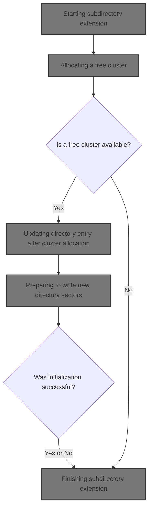

# Where is this flow used?

This flow is used multiple times in the codebase as represented in the following diagram:

```mermaid
graph TD;
      46064187bf92bc790217c5e2ce95488d2768fbbe3919156b2051c4a068ad57c8(src/…/asyncfatfs/asyncfatfs.c::afatfs_extendSubdirectory) --> aa735cec91ad8079ff1b8e2433f8f63e9303fda1c63ecc4df6300327511cb92f(src/…/asyncfatfs/asyncfatfs.c::afatfs_extendSubdirectoryContinue):::mainFlowStyle

2fb025d09714f3cd330eb281c3bf3db90a68ec23473574ddbd8b1b43e7c76464(src/…/asyncfatfs/asyncfatfs.c::afatfs_allocateDirectoryEntry) --> 46064187bf92bc790217c5e2ce95488d2768fbbe3919156b2051c4a068ad57c8(src/…/asyncfatfs/asyncfatfs.c::afatfs_extendSubdirectory)

7e7d0b2a579c0ad1f6ffab46feee330930a29bf6820a6ad94f61dceeb48c48ab(src/…/asyncfatfs/asyncfatfs.c::afatfs_createFileContinue) --> 2fb025d09714f3cd330eb281c3bf3db90a68ec23473574ddbd8b1b43e7c76464(src/…/asyncfatfs/asyncfatfs.c::afatfs_allocateDirectoryEntry)

6dd2d465b26b8f79fc298f2adc1a2e19b0dc1271a39ab534016692ea8030f494(src/…/asyncfatfs/asyncfatfs.c::afatfs_createFile) --> 7e7d0b2a579c0ad1f6ffab46feee330930a29bf6820a6ad94f61dceeb48c48ab(src/…/asyncfatfs/asyncfatfs.c::afatfs_createFileContinue)

cf06b7067c44483bb6f91d266b6453784baea5b14425b91423c62c2f95d61eda(src/…/asyncfatfs/asyncfatfs.c::afatfs_mkdir) --> 6dd2d465b26b8f79fc298f2adc1a2e19b0dc1271a39ab534016692ea8030f494(src/…/asyncfatfs/asyncfatfs.c::afatfs_createFile)

78408541875ffa1e96c99dcc0b64dd7702b5f57cdfad21f1c414f409fc21aa02(src/…/asyncfatfs/asyncfatfs.c::afatfs_fopen) --> 6dd2d465b26b8f79fc298f2adc1a2e19b0dc1271a39ab534016692ea8030f494(src/…/asyncfatfs/asyncfatfs.c::afatfs_createFile)

a5ba5974890bc1b3ae3f3b1984df722344dfa87a202f879ccce61afa8f1a29bc(src/…/asyncfatfs/asyncfatfs.c::afatfs_initContinue) --> 6dd2d465b26b8f79fc298f2adc1a2e19b0dc1271a39ab534016692ea8030f494(src/…/asyncfatfs/asyncfatfs.c::afatfs_createFile)

a5ba5974890bc1b3ae3f3b1984df722344dfa87a202f879ccce61afa8f1a29bc(src/…/asyncfatfs/asyncfatfs.c::afatfs_initContinue) --> c0c1f3c02d4256cdccc73a33334a541f535baae681d90e4442fd69199650a3ff(src/…/asyncfatfs/asyncfatfs.c::afatfs_fileOperationContinue)

80f7e7f5acd7c5a34ec0378238eaeb4cc9ac03df5b32d94b6e0ef4f08b642884(src/…/asyncfatfs/asyncfatfs.c::afatfs_poll) --> a5ba5974890bc1b3ae3f3b1984df722344dfa87a202f879ccce61afa8f1a29bc(src/…/asyncfatfs/asyncfatfs.c::afatfs_initContinue)

80f7e7f5acd7c5a34ec0378238eaeb4cc9ac03df5b32d94b6e0ef4f08b642884(src/…/asyncfatfs/asyncfatfs.c::afatfs_poll) --> 2628d5d307bea0b87e2cf57bcdb38b36d23cf394b099d3a4589194e603dd339f(src/…/asyncfatfs/asyncfatfs.c::afatfs_fileOperationsPoll)

dc366053c81e8b8954ec41bd478aca3e8c3482bea95799fd6d0068a0500622c8(src/…/asyncfatfs/asyncfatfs.c::afatfs_destroy) --> 80f7e7f5acd7c5a34ec0378238eaeb4cc9ac03df5b32d94b6e0ef4f08b642884(src/…/asyncfatfs/asyncfatfs.c::afatfs_poll)

c0c1f3c02d4256cdccc73a33334a541f535baae681d90e4442fd69199650a3ff(src/…/asyncfatfs/asyncfatfs.c::afatfs_fileOperationContinue) --> 7e7d0b2a579c0ad1f6ffab46feee330930a29bf6820a6ad94f61dceeb48c48ab(src/…/asyncfatfs/asyncfatfs.c::afatfs_createFileContinue)

c0c1f3c02d4256cdccc73a33334a541f535baae681d90e4442fd69199650a3ff(src/…/asyncfatfs/asyncfatfs.c::afatfs_fileOperationContinue) --> aa735cec91ad8079ff1b8e2433f8f63e9303fda1c63ecc4df6300327511cb92f(src/…/asyncfatfs/asyncfatfs.c::afatfs_extendSubdirectoryContinue):::mainFlowStyle

2628d5d307bea0b87e2cf57bcdb38b36d23cf394b099d3a4589194e603dd339f(src/…/asyncfatfs/asyncfatfs.c::afatfs_fileOperationsPoll) --> c0c1f3c02d4256cdccc73a33334a541f535baae681d90e4442fd69199650a3ff(src/…/asyncfatfs/asyncfatfs.c::afatfs_fileOperationContinue)


classDef mainFlowStyle color:#000000,fill:#7CB9F4
classDef rootsStyle color:#000000,fill:#00FFF4
classDef Style1 color:#000000,fill:#00FFAA
classDef Style2 color:#000000,fill:#FFFF00
classDef Style3 color:#000000,fill:#AA7CB9

%% Swimm:
%% graph TD;
%%       46064187bf92bc790217c5e2ce95488d2768fbbe3919156b2051c4a068ad57c8(<SwmPath>[src/…/asyncfatfs/asyncfatfs.c](src/main/io/asyncfatfs/asyncfatfs.c)</SwmPath>::<SwmToken path="src/main/io/asyncfatfs/asyncfatfs.c" pos="2334:4:4" line-data="static afatfsOperationStatus_e afatfs_extendSubdirectory(afatfsFile_t *directory, afatfsFilePtr_t parentDirectory, afatfsFileCallback_t callback)">`afatfs_extendSubdirectory`</SwmToken>) --> aa735cec91ad8079ff1b8e2433f8f63e9303fda1c63ecc4df6300327511cb92f(<SwmPath>[src/…/asyncfatfs/asyncfatfs.c](src/main/io/asyncfatfs/asyncfatfs.c)</SwmPath>::<SwmToken path="src/main/io/asyncfatfs/asyncfatfs.c" pos="2233:4:4" line-data="static afatfsOperationStatus_e afatfs_extendSubdirectoryContinue(afatfsFile_t *directory)">`afatfs_extendSubdirectoryContinue`</SwmToken>):::mainFlowStyle
%% 
%% 2fb025d09714f3cd330eb281c3bf3db90a68ec23473574ddbd8b1b43e7c76464(<SwmPath>[src/…/asyncfatfs/asyncfatfs.c](src/main/io/asyncfatfs/asyncfatfs.c)</SwmPath>::<SwmToken path="src/main/io/asyncfatfs/asyncfatfs.c" pos="2373:4:4" line-data="static afatfsOperationStatus_e afatfs_allocateDirectoryEntry(afatfsFilePtr_t directory, fatDirectoryEntry_t **dirEntry, afatfsFinder_t *finder)">`afatfs_allocateDirectoryEntry`</SwmToken>) --> 46064187bf92bc790217c5e2ce95488d2768fbbe3919156b2051c4a068ad57c8(<SwmPath>[src/…/asyncfatfs/asyncfatfs.c](src/main/io/asyncfatfs/asyncfatfs.c)</SwmPath>::<SwmToken path="src/main/io/asyncfatfs/asyncfatfs.c" pos="2334:4:4" line-data="static afatfsOperationStatus_e afatfs_extendSubdirectory(afatfsFile_t *directory, afatfsFilePtr_t parentDirectory, afatfsFileCallback_t callback)">`afatfs_extendSubdirectory`</SwmToken>)
%% 
%% 7e7d0b2a579c0ad1f6ffab46feee330930a29bf6820a6ad94f61dceeb48c48ab(<SwmPath>[src/…/asyncfatfs/asyncfatfs.c](src/main/io/asyncfatfs/asyncfatfs.c)</SwmPath>::<SwmToken path="src/main/io/asyncfatfs/asyncfatfs.c" pos="2582:4:4" line-data="static void afatfs_createFileContinue(afatfsFile_t *file)">`afatfs_createFileContinue`</SwmToken>) --> 2fb025d09714f3cd330eb281c3bf3db90a68ec23473574ddbd8b1b43e7c76464(<SwmPath>[src/…/asyncfatfs/asyncfatfs.c](src/main/io/asyncfatfs/asyncfatfs.c)</SwmPath>::<SwmToken path="src/main/io/asyncfatfs/asyncfatfs.c" pos="2373:4:4" line-data="static afatfsOperationStatus_e afatfs_allocateDirectoryEntry(afatfsFilePtr_t directory, fatDirectoryEntry_t **dirEntry, afatfsFinder_t *finder)">`afatfs_allocateDirectoryEntry`</SwmToken>)
%% 
%% 6dd2d465b26b8f79fc298f2adc1a2e19b0dc1271a39ab534016692ea8030f494(<SwmPath>[src/…/asyncfatfs/asyncfatfs.c](src/main/io/asyncfatfs/asyncfatfs.c)</SwmPath>::<SwmToken path="src/main/io/asyncfatfs/asyncfatfs.c" pos="2824:4:4" line-data="static afatfsFilePtr_t afatfs_createFile(afatfsFilePtr_t file, const char *name, uint8_t attrib, uint8_t fileMode,">`afatfs_createFile`</SwmToken>) --> 7e7d0b2a579c0ad1f6ffab46feee330930a29bf6820a6ad94f61dceeb48c48ab(<SwmPath>[src/…/asyncfatfs/asyncfatfs.c](src/main/io/asyncfatfs/asyncfatfs.c)</SwmPath>::<SwmToken path="src/main/io/asyncfatfs/asyncfatfs.c" pos="2582:4:4" line-data="static void afatfs_createFileContinue(afatfsFile_t *file)">`afatfs_createFileContinue`</SwmToken>)
%% 
%% cf06b7067c44483bb6f91d266b6453784baea5b14425b91423c62c2f95d61eda(<SwmPath>[src/…/asyncfatfs/asyncfatfs.c](src/main/io/asyncfatfs/asyncfatfs.c)</SwmPath>::<SwmToken path="src/main/io/asyncfatfs/asyncfatfs.c" pos="2946:2:2" line-data="bool afatfs_mkdir(const char *filename, afatfsFileCallback_t callback)">`afatfs_mkdir`</SwmToken>) --> 6dd2d465b26b8f79fc298f2adc1a2e19b0dc1271a39ab534016692ea8030f494(<SwmPath>[src/…/asyncfatfs/asyncfatfs.c](src/main/io/asyncfatfs/asyncfatfs.c)</SwmPath>::<SwmToken path="src/main/io/asyncfatfs/asyncfatfs.c" pos="2824:4:4" line-data="static afatfsFilePtr_t afatfs_createFile(afatfsFilePtr_t file, const char *name, uint8_t attrib, uint8_t fileMode,">`afatfs_createFile`</SwmToken>)
%% 
%% 78408541875ffa1e96c99dcc0b64dd7702b5f57cdfad21f1c414f409fc21aa02(<SwmPath>[src/…/asyncfatfs/asyncfatfs.c](src/main/io/asyncfatfs/asyncfatfs.c)</SwmPath>::<SwmToken path="src/main/io/asyncfatfs/asyncfatfs.c" pos="3027:2:2" line-data="bool afatfs_fopen(const char *filename, const char *mode, afatfsFileCallback_t complete)">`afatfs_fopen`</SwmToken>) --> 6dd2d465b26b8f79fc298f2adc1a2e19b0dc1271a39ab534016692ea8030f494(<SwmPath>[src/…/asyncfatfs/asyncfatfs.c](src/main/io/asyncfatfs/asyncfatfs.c)</SwmPath>::<SwmToken path="src/main/io/asyncfatfs/asyncfatfs.c" pos="2824:4:4" line-data="static afatfsFilePtr_t afatfs_createFile(afatfsFilePtr_t file, const char *name, uint8_t attrib, uint8_t fileMode,">`afatfs_createFile`</SwmToken>)
%% 
%% a5ba5974890bc1b3ae3f3b1984df722344dfa87a202f879ccce61afa8f1a29bc(<SwmPath>[src/…/asyncfatfs/asyncfatfs.c](src/main/io/asyncfatfs/asyncfatfs.c)</SwmPath>::<SwmToken path="src/main/io/asyncfatfs/asyncfatfs.c" pos="3434:4:4" line-data="static void afatfs_initContinue(void)">`afatfs_initContinue`</SwmToken>) --> 6dd2d465b26b8f79fc298f2adc1a2e19b0dc1271a39ab534016692ea8030f494(<SwmPath>[src/…/asyncfatfs/asyncfatfs.c](src/main/io/asyncfatfs/asyncfatfs.c)</SwmPath>::<SwmToken path="src/main/io/asyncfatfs/asyncfatfs.c" pos="2824:4:4" line-data="static afatfsFilePtr_t afatfs_createFile(afatfsFilePtr_t file, const char *name, uint8_t attrib, uint8_t fileMode,">`afatfs_createFile`</SwmToken>)
%% 
%% a5ba5974890bc1b3ae3f3b1984df722344dfa87a202f879ccce61afa8f1a29bc(<SwmPath>[src/…/asyncfatfs/asyncfatfs.c](src/main/io/asyncfatfs/asyncfatfs.c)</SwmPath>::<SwmToken path="src/main/io/asyncfatfs/asyncfatfs.c" pos="3434:4:4" line-data="static void afatfs_initContinue(void)">`afatfs_initContinue`</SwmToken>) --> c0c1f3c02d4256cdccc73a33334a541f535baae681d90e4442fd69199650a3ff(<SwmPath>[src/…/asyncfatfs/asyncfatfs.c](src/main/io/asyncfatfs/asyncfatfs.c)</SwmPath>::<SwmToken path="src/main/io/asyncfatfs/asyncfatfs.c" pos="522:4:4" line-data="static void afatfs_fileOperationContinue(afatfsFile_t *file);">`afatfs_fileOperationContinue`</SwmToken>)
%% 
%% 80f7e7f5acd7c5a34ec0378238eaeb4cc9ac03df5b32d94b6e0ef4f08b642884(<SwmPath>[src/…/asyncfatfs/asyncfatfs.c](src/main/io/asyncfatfs/asyncfatfs.c)</SwmPath>::<SwmToken path="src/main/io/asyncfatfs/asyncfatfs.c" pos="3564:2:2" line-data="void afatfs_poll(void)">`afatfs_poll`</SwmToken>) --> a5ba5974890bc1b3ae3f3b1984df722344dfa87a202f879ccce61afa8f1a29bc(<SwmPath>[src/…/asyncfatfs/asyncfatfs.c](src/main/io/asyncfatfs/asyncfatfs.c)</SwmPath>::<SwmToken path="src/main/io/asyncfatfs/asyncfatfs.c" pos="3434:4:4" line-data="static void afatfs_initContinue(void)">`afatfs_initContinue`</SwmToken>)
%% 
%% 80f7e7f5acd7c5a34ec0378238eaeb4cc9ac03df5b32d94b6e0ef4f08b642884(<SwmPath>[src/…/asyncfatfs/asyncfatfs.c](src/main/io/asyncfatfs/asyncfatfs.c)</SwmPath>::<SwmToken path="src/main/io/asyncfatfs/asyncfatfs.c" pos="3564:2:2" line-data="void afatfs_poll(void)">`afatfs_poll`</SwmToken>) --> 2628d5d307bea0b87e2cf57bcdb38b36d23cf394b099d3a4589194e603dd339f(<SwmPath>[src/…/asyncfatfs/asyncfatfs.c](src/main/io/asyncfatfs/asyncfatfs.c)</SwmPath>::<SwmToken path="src/main/io/asyncfatfs/asyncfatfs.c" pos="3284:4:4" line-data="static void afatfs_fileOperationsPoll(void)">`afatfs_fileOperationsPoll`</SwmToken>)
%% 
%% dc366053c81e8b8954ec41bd478aca3e8c3482bea95799fd6d0068a0500622c8(<SwmPath>[src/…/asyncfatfs/asyncfatfs.c](src/main/io/asyncfatfs/asyncfatfs.c)</SwmPath>::<SwmToken path="src/main/io/asyncfatfs/asyncfatfs.c" pos="3656:2:2" line-data="bool afatfs_destroy(bool dirty)">`afatfs_destroy`</SwmToken>) --> 80f7e7f5acd7c5a34ec0378238eaeb4cc9ac03df5b32d94b6e0ef4f08b642884(<SwmPath>[src/…/asyncfatfs/asyncfatfs.c](src/main/io/asyncfatfs/asyncfatfs.c)</SwmPath>::<SwmToken path="src/main/io/asyncfatfs/asyncfatfs.c" pos="3564:2:2" line-data="void afatfs_poll(void)">`afatfs_poll`</SwmToken>)
%% 
%% c0c1f3c02d4256cdccc73a33334a541f535baae681d90e4442fd69199650a3ff(<SwmPath>[src/…/asyncfatfs/asyncfatfs.c](src/main/io/asyncfatfs/asyncfatfs.c)</SwmPath>::<SwmToken path="src/main/io/asyncfatfs/asyncfatfs.c" pos="522:4:4" line-data="static void afatfs_fileOperationContinue(afatfsFile_t *file);">`afatfs_fileOperationContinue`</SwmToken>) --> 7e7d0b2a579c0ad1f6ffab46feee330930a29bf6820a6ad94f61dceeb48c48ab(<SwmPath>[src/…/asyncfatfs/asyncfatfs.c](src/main/io/asyncfatfs/asyncfatfs.c)</SwmPath>::<SwmToken path="src/main/io/asyncfatfs/asyncfatfs.c" pos="2582:4:4" line-data="static void afatfs_createFileContinue(afatfsFile_t *file)">`afatfs_createFileContinue`</SwmToken>)
%% 
%% c0c1f3c02d4256cdccc73a33334a541f535baae681d90e4442fd69199650a3ff(<SwmPath>[src/…/asyncfatfs/asyncfatfs.c](src/main/io/asyncfatfs/asyncfatfs.c)</SwmPath>::<SwmToken path="src/main/io/asyncfatfs/asyncfatfs.c" pos="522:4:4" line-data="static void afatfs_fileOperationContinue(afatfsFile_t *file);">`afatfs_fileOperationContinue`</SwmToken>) --> aa735cec91ad8079ff1b8e2433f8f63e9303fda1c63ecc4df6300327511cb92f(<SwmPath>[src/…/asyncfatfs/asyncfatfs.c](src/main/io/asyncfatfs/asyncfatfs.c)</SwmPath>::<SwmToken path="src/main/io/asyncfatfs/asyncfatfs.c" pos="2233:4:4" line-data="static afatfsOperationStatus_e afatfs_extendSubdirectoryContinue(afatfsFile_t *directory)">`afatfs_extendSubdirectoryContinue`</SwmToken>):::mainFlowStyle
%% 
%% 2628d5d307bea0b87e2cf57bcdb38b36d23cf394b099d3a4589194e603dd339f(<SwmPath>[src/…/asyncfatfs/asyncfatfs.c](src/main/io/asyncfatfs/asyncfatfs.c)</SwmPath>::<SwmToken path="src/main/io/asyncfatfs/asyncfatfs.c" pos="3284:4:4" line-data="static void afatfs_fileOperationsPoll(void)">`afatfs_fileOperationsPoll`</SwmToken>) --> c0c1f3c02d4256cdccc73a33334a541f535baae681d90e4442fd69199650a3ff(<SwmPath>[src/…/asyncfatfs/asyncfatfs.c](src/main/io/asyncfatfs/asyncfatfs.c)</SwmPath>::<SwmToken path="src/main/io/asyncfatfs/asyncfatfs.c" pos="522:4:4" line-data="static void afatfs_fileOperationContinue(afatfsFile_t *file);">`afatfs_fileOperationContinue`</SwmToken>)
%% 
%% 
%% classDef mainFlowStyle color:#000000,fill:#7CB9F4
%% classDef rootsStyle color:#000000,fill:#00FFF4
%% classDef Style1 color:#000000,fill:#00FFAA
%% classDef Style2 color:#000000,fill:#FFFF00
%% classDef Style3 color:#000000,fill:#AA7CB9
```

# Starting subdirectory extension

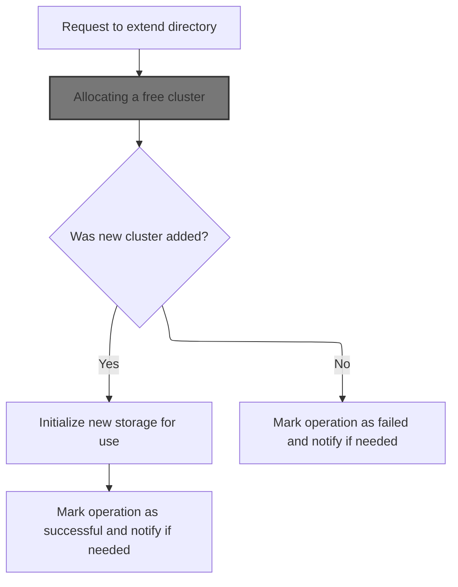

<SwmSnippet path="/src/main/io/asyncfatfs/asyncfatfs.c" line="2233">

---

In <SwmToken path="src/main/io/asyncfatfs/asyncfatfs.c" pos="2233:4:4" line-data="static afatfsOperationStatus_e afatfs_extendSubdirectoryContinue(afatfsFile_t *directory)">`afatfs_extendSubdirectoryContinue`</SwmToken>, we kick off the extension process by checking the current phase. If we're at the ADD_FREE_CLUSTER phase, we call <SwmToken path="src/main/io/asyncfatfs/asyncfatfs.c" pos="2244:5:5" line-data="            status = afatfs_appendRegularFreeClusterContinue(directory);">`afatfs_appendRegularFreeClusterContinue`</SwmToken> to allocate a new cluster for the subdirectory. This is needed before we can write new sectors to the directory, so the next step depends on its result.

```c
static afatfsOperationStatus_e afatfs_extendSubdirectoryContinue(afatfsFile_t *directory)
{
    afatfsExtendSubdirectory_t *opState = &directory->operation.state.extendSubdirectory;
    afatfsOperationStatus_e status;
    uint8_t *sectorBuffer;
    uint32_t clusterNumber, physicalSector;
    uint16_t sectorInCluster;

    doMore:
    switch (opState->phase) {
        case AFATFS_EXTEND_SUBDIRECTORY_PHASE_ADD_FREE_CLUSTER:
            status = afatfs_appendRegularFreeClusterContinue(directory);

            if (status == AFATFS_OPERATION_SUCCESS) {
                opState->phase = AFATFS_EXTEND_SUBDIRECTORY_PHASE_WRITE_SECTORS;
                goto doMore;
            } else if (status == AFATFS_OPERATION_FAILURE) {
                opState->phase = AFATFS_EXTEND_SUBDIRECTORY_PHASE_FAILURE;
                goto doMore;
            }
        break;
```

---

</SwmSnippet>

## Allocating a free cluster

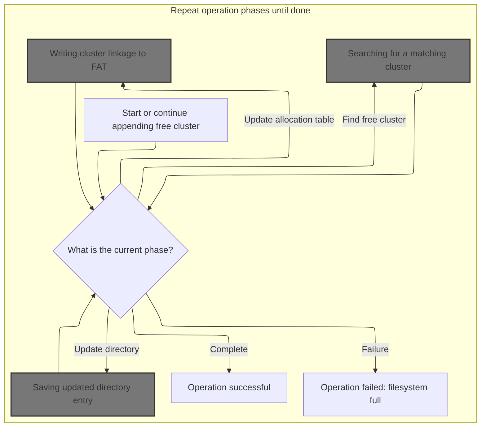

<SwmSnippet path="/src/main/io/asyncfatfs/asyncfatfs.c" line="1538">

---

In <SwmToken path="src/main/io/asyncfatfs/asyncfatfs.c" pos="1538:4:4" line-data="static afatfsOperationStatus_e afatfs_appendRegularFreeClusterContinue(afatfsFile_t *file)">`afatfs_appendRegularFreeClusterContinue`</SwmToken>, we start by checking the phase. If we're looking for free space, we call <SwmToken path="src/main/io/asyncfatfs/asyncfatfs.c" pos="1547:4:4" line-data="            switch (afatfs_findClusterWithCondition(CLUSTER_SEARCH_FREE, &amp;opState-&gt;searchCluster, afatfs.numClusters + FAT_SMALLEST_LEGAL_CLUSTER_NUMBER)) {">`afatfs_findClusterWithCondition`</SwmToken> to scan the FAT for a free cluster. This is necessary before we can allocate and link a new cluster to the file.

```c
static afatfsOperationStatus_e afatfs_appendRegularFreeClusterContinue(afatfsFile_t *file)
{
    afatfsAppendFreeCluster_t *opState = &file->operation.state.appendFreeCluster;
    afatfsOperationStatus_e status;

    doMore:

    switch (opState->phase) {
        case AFATFS_APPEND_FREE_CLUSTER_PHASE_FIND_FREESPACE:
            switch (afatfs_findClusterWithCondition(CLUSTER_SEARCH_FREE, &opState->searchCluster, afatfs.numClusters + FAT_SMALLEST_LEGAL_CLUSTER_NUMBER)) {
```

---

</SwmSnippet>

### Searching for a matching cluster

```mermaid
%%{init: {"flowchart": {"defaultRenderer": "elk"}} }%%
flowchart TD
    node1["Begin search for cluster matching condition"]
    click node1 openCode "src/main/io/asyncfatfs/asyncfatfs.c:1228:1240"
    node1 --> node2{"What is the search condition?"}
    click node2 openCode "src/main/io/asyncfatfs/asyncfatfs.c:1241:1257"
    node2 --> node3["Set up search parameters"]
    click node3 openCode "src/main/io/asyncfatfs/asyncfatfs.c:1233:1257"
    node3 --> node4["Start cluster iteration"]
    click node4 openCode "src/main/io/asyncfatfs/asyncfatfs.c:1259:1318"
    subgraph loop1["For each cluster until search limit"]
        node4 --> node5{"Is cluster in freefile area?"}
        click node5 openCode "src/main/io/asyncfatfs/asyncfatfs.c:1262:1269"
        node5 -->|"Yes"| node6["Skip clusters in freefile"]
        click node6 openCode "src/main/io/asyncfatfs/asyncfatfs.c:1264:1268"
        node6 -->|"After skipping"| node5
        node5 -->|"No"| node7["Check cluster status"]
        click node7 openCode "src/main/io/asyncfatfs/asyncfatfs.c:1272:1305"
        node7 --> node8{"Does cluster match condition?"}
        click node8 openCode "src/main/io/asyncfatfs/asyncfatfs.c:1290:1301"
        node8 -->|"Yes"| node9{"Is cluster within search limit?"}
        click node9 openCode "src/main/io/asyncfatfs/asyncfatfs.c:1295:1299"
        node9 -->|"Yes"| node10["Return cluster found"]
        click node10 openCode "src/main/io/asyncfatfs/asyncfatfs.c:1296:1297"
        node9 -->|"No"| node11["Return not found"]
        click node11 openCode "src/main/io/asyncfatfs/asyncfatfs.c:1298:1300"
        node8 -->|"No"| node12["Move to next cluster"]
        click node12 openCode "src/main/io/asyncfatfs/asyncfatfs.c:1303:1305"
        node12 --> node5
    end
    node4 -->|"No matching cluster found"| node13["Return not found"]
    click node13 openCode "src/main/io/asyncfatfs/asyncfatfs.c:1320:1323"
classDef HeadingStyle fill:#777777,stroke:#333,stroke-width:2px;

%% Swimm:
%% %%{init: {"flowchart": {"defaultRenderer": "elk"}} }%%
%% flowchart TD
%%     node1["Begin search for cluster matching condition"]
%%     click node1 openCode "<SwmPath>[src/…/asyncfatfs/asyncfatfs.c](src/main/io/asyncfatfs/asyncfatfs.c)</SwmPath>:1228:1240"
%%     node1 --> node2{"What is the search condition?"}
%%     click node2 openCode "<SwmPath>[src/…/asyncfatfs/asyncfatfs.c](src/main/io/asyncfatfs/asyncfatfs.c)</SwmPath>:1241:1257"
%%     node2 --> node3["Set up search parameters"]
%%     click node3 openCode "<SwmPath>[src/…/asyncfatfs/asyncfatfs.c](src/main/io/asyncfatfs/asyncfatfs.c)</SwmPath>:1233:1257"
%%     node3 --> node4["Start cluster iteration"]
%%     click node4 openCode "<SwmPath>[src/…/asyncfatfs/asyncfatfs.c](src/main/io/asyncfatfs/asyncfatfs.c)</SwmPath>:1259:1318"
%%     subgraph loop1["For each cluster until search limit"]
%%         node4 --> node5{"Is cluster in freefile area?"}
%%         click node5 openCode "<SwmPath>[src/…/asyncfatfs/asyncfatfs.c](src/main/io/asyncfatfs/asyncfatfs.c)</SwmPath>:1262:1269"
%%         node5 -->|"Yes"| node6["Skip clusters in freefile"]
%%         click node6 openCode "<SwmPath>[src/…/asyncfatfs/asyncfatfs.c](src/main/io/asyncfatfs/asyncfatfs.c)</SwmPath>:1264:1268"
%%         node6 -->|"After skipping"| node5
%%         node5 -->|"No"| node7["Check cluster status"]
%%         click node7 openCode "<SwmPath>[src/…/asyncfatfs/asyncfatfs.c](src/main/io/asyncfatfs/asyncfatfs.c)</SwmPath>:1272:1305"
%%         node7 --> node8{"Does cluster match condition?"}
%%         click node8 openCode "<SwmPath>[src/…/asyncfatfs/asyncfatfs.c](src/main/io/asyncfatfs/asyncfatfs.c)</SwmPath>:1290:1301"
%%         node8 -->|"Yes"| node9{"Is cluster within search limit?"}
%%         click node9 openCode "<SwmPath>[src/…/asyncfatfs/asyncfatfs.c](src/main/io/asyncfatfs/asyncfatfs.c)</SwmPath>:1295:1299"
%%         node9 -->|"Yes"| node10["Return cluster found"]
%%         click node10 openCode "<SwmPath>[src/…/asyncfatfs/asyncfatfs.c](src/main/io/asyncfatfs/asyncfatfs.c)</SwmPath>:1296:1297"
%%         node9 -->|"No"| node11["Return not found"]
%%         click node11 openCode "<SwmPath>[src/…/asyncfatfs/asyncfatfs.c](src/main/io/asyncfatfs/asyncfatfs.c)</SwmPath>:1298:1300"
%%         node8 -->|"No"| node12["Move to next cluster"]
%%         click node12 openCode "<SwmPath>[src/…/asyncfatfs/asyncfatfs.c](src/main/io/asyncfatfs/asyncfatfs.c)</SwmPath>:1303:1305"
%%         node12 --> node5
%%     end
%%     node4 -->|"No matching cluster found"| node13["Return not found"]
%%     click node13 openCode "<SwmPath>[src/…/asyncfatfs/asyncfatfs.c](src/main/io/asyncfatfs/asyncfatfs.c)</SwmPath>:1320:1323"
%% classDef HeadingStyle fill:#777777,stroke:#333,stroke-width:2px;
```

<SwmSnippet path="/src/main/io/asyncfatfs/asyncfatfs.c" line="1228">

---

In <SwmToken path="src/main/io/asyncfatfs/asyncfatfs.c" pos="1228:4:4" line-data="static afatfsFindClusterStatus_e afatfs_findClusterWithCondition(afatfsClusterSearchCondition_e condition, uint32_t *cluster, uint32_t searchLimit)">`afatfs_findClusterWithCondition`</SwmToken>, we set up the search for a cluster matching the given condition (free or occupied). We handle alignment and skip the <SwmToken path="src/main/io/asyncfatfs/asyncfatfs.c" pos="1263:6:6" line-data="        if (afatfs.freeFile.logicalSize &gt; 0 &amp;&amp; *cluster == afatfs.freeFile.firstCluster) {">`freeFile`</SwmToken> area if needed. Before checking cluster entries, we call <SwmToken path="src/main/io/asyncfatfs/asyncfatfs.c" pos="1272:7:7" line-data="        afatfsOperationStatus_e status = afatfs_cacheSector(afatfs_fatSectorToPhysical(0, fatSectorIndex), &amp;sector.bytes, AFATFS_CACHE_READ | AFATFS_CACHE_DISCARDABLE, 0);">`afatfs_cacheSector`</SwmToken> to load the FAT sector into memory, since the FAT is stored on disk.

```c
static afatfsFindClusterStatus_e afatfs_findClusterWithCondition(afatfsClusterSearchCondition_e condition, uint32_t *cluster, uint32_t searchLimit)
{
    afatfsFATSector_t sector;
    uint32_t fatSectorIndex, fatSectorEntryIndex;

    uint32_t fatEntriesPerSector = afatfs_fatEntriesPerSector();
    bool lookingForFree = condition == CLUSTER_SEARCH_FREE_AT_BEGINNING_OF_FAT_SECTOR || condition == CLUSTER_SEARCH_FREE;

    int jump;

    // Get the FAT entry which corresponds to this cluster so we can begin our search there
    afatfs_getFATPositionForCluster(*cluster, &fatSectorIndex, &fatSectorEntryIndex);

    switch (condition) {
        case CLUSTER_SEARCH_FREE_AT_BEGINNING_OF_FAT_SECTOR:
            jump = fatEntriesPerSector;

            // We're supposed to call this routine with the cluster properly aligned
            if (!afatfs_assert(fatSectorEntryIndex == 0)) {
                return AFATFS_FIND_CLUSTER_FATAL;
            }
        break;
        case CLUSTER_SEARCH_OCCUPIED:
        case CLUSTER_SEARCH_FREE:
            jump = 1;
        break;
        default:
            afatfs_assert(false);
            return AFATFS_FIND_CLUSTER_FATAL;
    }

    while (*cluster < searchLimit) {

#ifdef AFATFS_USE_FREEFILE
        // If we're looking inside the freefile, we won't find any free clusters! Skip it!
        if (afatfs.freeFile.logicalSize > 0 && *cluster == afatfs.freeFile.firstCluster) {
            *cluster += (afatfs.freeFile.logicalSize + afatfs_clusterSize() - 1) / afatfs_clusterSize();

            // Maintain alignment
            *cluster = roundUpTo(*cluster, jump);
            continue; // Go back to check that the new cluster number is within the volume
        }
#endif

        afatfsOperationStatus_e status = afatfs_cacheSector(afatfs_fatSectorToPhysical(0, fatSectorIndex), &sector.bytes, AFATFS_CACHE_READ | AFATFS_CACHE_DISCARDABLE, 0);

```

---

</SwmSnippet>

<SwmSnippet path="/src/main/io/asyncfatfs/asyncfatfs.c" line="940">

---

<SwmToken path="src/main/io/asyncfatfs/asyncfatfs.c" pos="940:4:4" line-data="static afatfsOperationStatus_e afatfs_cacheSector(uint32_t physicalSectorIndex, uint8_t **buffer, uint8_t sectorFlags, uint32_t eraseCount)">`afatfs_cacheSector`</SwmToken> manages reading and writing FAT sectors in memory. It blocks writes to sector 0 (MBR), allocates cache, and handles cache states: starts async reads if needed, marks sectors dirty for writes, and manages locking/retaining. If cache is full or a read is in progress, it returns IN_PROGRESS so the caller can retry later.

```c
static afatfsOperationStatus_e afatfs_cacheSector(uint32_t physicalSectorIndex, uint8_t **buffer, uint8_t sectorFlags, uint32_t eraseCount)
{
    // We never write to the MBR, so any attempt to write there is an asyncfatfs bug
    if (!afatfs_assert((sectorFlags & AFATFS_CACHE_WRITE) == 0 || physicalSectorIndex != 0)) {
        return AFATFS_OPERATION_FAILURE;
    }

    int cacheSectorIndex = afatfs_allocateCacheSector(physicalSectorIndex);

    if (cacheSectorIndex == -1) {
        // We don't have enough free cache to service this request right now, try again later
        return AFATFS_OPERATION_IN_PROGRESS;
    }

    switch (afatfs.cacheDescriptor[cacheSectorIndex].state) {
        case AFATFS_CACHE_STATE_READING:
            return AFATFS_OPERATION_IN_PROGRESS;
        break;

        case AFATFS_CACHE_STATE_EMPTY:
            if ((sectorFlags & AFATFS_CACHE_READ) != 0) {
                if (sdcard_readBlock(physicalSectorIndex, afatfs_cacheSectorGetMemory(cacheSectorIndex), afatfs_sdcardReadComplete, 0)) {
                    afatfs.cacheDescriptor[cacheSectorIndex].state = AFATFS_CACHE_STATE_READING;
                }
                return AFATFS_OPERATION_IN_PROGRESS;
            }

            // We only get to decide these fields if we're the first ones to cache the sector:
            afatfs.cacheDescriptor[cacheSectorIndex].discardable = (sectorFlags & AFATFS_CACHE_DISCARDABLE) != 0 ? 1 : 0;

#ifdef AFATFS_MIN_MULTIPLE_BLOCK_WRITE_COUNT
            // Don't bother pre-erasing for small block sequences
            if (eraseCount < AFATFS_MIN_MULTIPLE_BLOCK_WRITE_COUNT) {
                eraseCount = 0;
            } else {
                eraseCount = MIN(eraseCount, (uint32_t)UINT16_MAX); // If caller asked for a longer chain of sectors we silently truncate that here
            }

            afatfs.cacheDescriptor[cacheSectorIndex].consecutiveEraseBlockCount = eraseCount;
#endif

            FALLTHROUGH;

        case AFATFS_CACHE_STATE_WRITING:
        case AFATFS_CACHE_STATE_IN_SYNC:
            if ((sectorFlags & AFATFS_CACHE_WRITE) != 0) {
                afatfs_cacheSectorMarkDirty(&afatfs.cacheDescriptor[cacheSectorIndex]);
            }
            FALLTHROUGH;

        case AFATFS_CACHE_STATE_DIRTY:
            if ((sectorFlags & AFATFS_CACHE_LOCK) != 0) {
                afatfs.cacheDescriptor[cacheSectorIndex].locked = 1;
            }
            if ((sectorFlags & AFATFS_CACHE_RETAIN) != 0) {
                afatfs.cacheDescriptor[cacheSectorIndex].retainCount++;
            }

            *buffer = afatfs_cacheSectorGetMemory(cacheSectorIndex);

            return AFATFS_OPERATION_SUCCESS;
        break;

        default:
            // Cache block in unknown state, should never happen
            afatfs_assert(false);
            return AFATFS_OPERATION_FAILURE;
    }
}
```

---

</SwmSnippet>

<SwmSnippet path="/src/main/io/asyncfatfs/asyncfatfs.c" line="1274">

---

Back in <SwmToken path="src/main/io/asyncfatfs/asyncfatfs.c" pos="1228:4:4" line-data="static afatfsFindClusterStatus_e afatfs_findClusterWithCondition(afatfsClusterSearchCondition_e condition, uint32_t *cluster, uint32_t searchLimit)">`afatfs_findClusterWithCondition`</SwmToken>, after caching the FAT sector, we check the status. If successful, we scan the sector's entries for a cluster matching our condition. If not, we either retry (IN_PROGRESS) or abort (FAILURE).

```c
        switch (status) {
            case AFATFS_OPERATION_SUCCESS:
                do {
                    uint32_t clusterNumber;

                    switch (afatfs.filesystemType) {
                        case FAT_FILESYSTEM_TYPE_FAT16:
                            clusterNumber = sector.fat16[fatSectorEntryIndex];
                        break;
                        case FAT_FILESYSTEM_TYPE_FAT32:
                            clusterNumber = fat32_decodeClusterNumber(sector.fat32[fatSectorEntryIndex]);
                        break;
                        default:
                            return AFATFS_FIND_CLUSTER_FATAL;
                    }

                    if (fat_isFreeSpace(clusterNumber) == lookingForFree) {
                        /*
                         * The final FAT sector may have fewer than fatEntriesPerSector entries in it, so we need to
                         * check the cluster number is valid here before we report a bogus success!
                         */
                        if (*cluster < searchLimit) {
                            return AFATFS_FIND_CLUSTER_FOUND;
                        } else {
                            *cluster = searchLimit;
                            return AFATFS_FIND_CLUSTER_NOT_FOUND;
                        }
                    }

                    (*cluster) += jump;
                    fatSectorEntryIndex += jump;
                } while (fatSectorEntryIndex < fatEntriesPerSector);
```

---

</SwmSnippet>

<SwmSnippet path="/src/main/io/asyncfatfs/asyncfatfs.c" line="1307">

---

After scanning all relevant FAT sectors and entries, <SwmToken path="src/main/io/asyncfatfs/asyncfatfs.c" pos="1228:4:4" line-data="static afatfsFindClusterStatus_e afatfs_findClusterWithCondition(afatfsClusterSearchCondition_e condition, uint32_t *cluster, uint32_t searchLimit)">`afatfs_findClusterWithCondition`</SwmToken> returns FOUND if a matching cluster is located, NOT_FOUND if the search limit is reached, FATAL on error, or IN_PROGRESS if waiting on cache. It also skips the <SwmToken path="src/main/io/asyncfatfs/asyncfatfs.c" pos="1263:6:6" line-data="        if (afatfs.freeFile.logicalSize &gt; 0 &amp;&amp; *cluster == afatfs.freeFile.firstCluster) {">`freeFile`</SwmToken> area to avoid false positives.

```c
                // Move on to the next FAT sector
                fatSectorIndex++;
                fatSectorEntryIndex = 0;
            break;
            case AFATFS_OPERATION_FAILURE:
                return AFATFS_FIND_CLUSTER_FATAL;
            break;
            case AFATFS_OPERATION_IN_PROGRESS:
                return AFATFS_FIND_CLUSTER_IN_PROGRESS;
            break;
        }
    }

    // We looked at every available cluster and didn't find one matching the condition
    *cluster = searchLimit;
    return AFATFS_FIND_CLUSTER_NOT_FOUND;
}
```

---

</SwmSnippet>

### Linking and updating cluster allocation

```mermaid
%%{init: {"flowchart": {"defaultRenderer": "elk"}} }%%
flowchart TD
    node1["Start append free cluster process"] --> node2{"Was a free cluster found?"}
    click node1 openCode "src/main/io/asyncfatfs/asyncfatfs.c:1548:1548"
    node2 -->|"Found"| node3["Update file with new cluster"]
    click node2 openCode "src/main/io/asyncfatfs/asyncfatfs.c:1548:1562"
    node2 -->|"Not found or fatal"| node4["Mark operation as failure"]
    click node4 openCode "src/main/io/asyncfatfs/asyncfatfs.c:1563:1567"
    node3 --> node5{"Is this the first cluster in the file?"}
    click node3 openCode "src/main/io/asyncfatfs/asyncfatfs.c:1555:1558"
    node5 -->|"Yes"| node6["Set file's first cluster"]
    click node6 openCode "src/main/io/asyncfatfs/asyncfatfs.c:1557:1558"
    node5 -->|"No"| node8["Update FAT to terminate new cluster"]
    click node8 openCode "src/main/io/asyncfatfs/asyncfatfs.c:1574:1575"
    node6 --> node8
    node8 --> node9{"Did FAT update succeed?"}
    click node9 openCode "src/main/io/asyncfatfs/asyncfatfs.c:1577:1585"
    node9 -->|"Yes"| node10{"Is there a previous cluster?"}
    click node10 openCode "src/main/io/asyncfatfs/asyncfatfs.c:1578:1582"
    node10 -->|"Yes"| node11["Update FAT to link previous cluster to new cluster"]
    click node11 openCode "src/main/io/asyncfatfs/asyncfatfs.c:1589:1594"
    node10 -->|"No"| node12["Update file directory"]
    click node12 openCode "src/main/io/asyncfatfs/asyncfatfs.c:1581:1582"
    node11 --> node12
    node9 -->|"No"| node13["End process"]
    click node13 openCode "src/main/io/asyncfatfs/asyncfatfs.c:1586:1586"
    node4 --> node13

classDef HeadingStyle fill:#777777,stroke:#333,stroke-width:2px;

%% Swimm:
%% %%{init: {"flowchart": {"defaultRenderer": "elk"}} }%%
%% flowchart TD
%%     node1["Start append free cluster process"] --> node2{"Was a free cluster found?"}
%%     click node1 openCode "<SwmPath>[src/…/asyncfatfs/asyncfatfs.c](src/main/io/asyncfatfs/asyncfatfs.c)</SwmPath>:1548:1548"
%%     node2 -->|"Found"| node3["Update file with new cluster"]
%%     click node2 openCode "<SwmPath>[src/…/asyncfatfs/asyncfatfs.c](src/main/io/asyncfatfs/asyncfatfs.c)</SwmPath>:1548:1562"
%%     node2 -->|"Not found or fatal"| node4["Mark operation as failure"]
%%     click node4 openCode "<SwmPath>[src/…/asyncfatfs/asyncfatfs.c](src/main/io/asyncfatfs/asyncfatfs.c)</SwmPath>:1563:1567"
%%     node3 --> node5{"Is this the first cluster in the file?"}
%%     click node3 openCode "<SwmPath>[src/…/asyncfatfs/asyncfatfs.c](src/main/io/asyncfatfs/asyncfatfs.c)</SwmPath>:1555:1558"
%%     node5 -->|"Yes"| node6["Set file's first cluster"]
%%     click node6 openCode "<SwmPath>[src/…/asyncfatfs/asyncfatfs.c](src/main/io/asyncfatfs/asyncfatfs.c)</SwmPath>:1557:1558"
%%     node5 -->|"No"| node8["Update FAT to terminate new cluster"]
%%     click node8 openCode "<SwmPath>[src/…/asyncfatfs/asyncfatfs.c](src/main/io/asyncfatfs/asyncfatfs.c)</SwmPath>:1574:1575"
%%     node6 --> node8
%%     node8 --> node9{"Did FAT update succeed?"}
%%     click node9 openCode "<SwmPath>[src/…/asyncfatfs/asyncfatfs.c](src/main/io/asyncfatfs/asyncfatfs.c)</SwmPath>:1577:1585"
%%     node9 -->|"Yes"| node10{"Is there a previous cluster?"}
%%     click node10 openCode "<SwmPath>[src/…/asyncfatfs/asyncfatfs.c](src/main/io/asyncfatfs/asyncfatfs.c)</SwmPath>:1578:1582"
%%     node10 -->|"Yes"| node11["Update FAT to link previous cluster to new cluster"]
%%     click node11 openCode "<SwmPath>[src/…/asyncfatfs/asyncfatfs.c](src/main/io/asyncfatfs/asyncfatfs.c)</SwmPath>:1589:1594"
%%     node10 -->|"No"| node12["Update file directory"]
%%     click node12 openCode "<SwmPath>[src/…/asyncfatfs/asyncfatfs.c](src/main/io/asyncfatfs/asyncfatfs.c)</SwmPath>:1581:1582"
%%     node11 --> node12
%%     node9 -->|"No"| node13["End process"]
%%     click node13 openCode "<SwmPath>[src/…/asyncfatfs/asyncfatfs.c](src/main/io/asyncfatfs/asyncfatfs.c)</SwmPath>:1586:1586"
%%     node4 --> node13
%% 
%% classDef HeadingStyle fill:#777777,stroke:#333,stroke-width:2px;
```

<SwmSnippet path="/src/main/io/asyncfatfs/asyncfatfs.c" line="1548">

---

Back in <SwmToken path="src/main/io/asyncfatfs/asyncfatfs.c" pos="1538:4:4" line-data="static afatfsOperationStatus_e afatfs_appendRegularFreeClusterContinue(afatfsFile_t *file)">`afatfs_appendRegularFreeClusterContinue`</SwmToken>, after finding a free cluster, we update file pointers and size, then call <SwmToken path="src/main/io/asyncfatfs/asyncfatfs.c" pos="1575:5:5" line-data="            status = afatfs_FATSetNextCluster(opState-&gt;searchCluster, 0xFFFFFFFF);">`afatfs_FATSetNextCluster`</SwmToken> to mark the new cluster as the end of the chain or link it to the previous cluster. This sets up the FAT structure for the new allocation.

```c
                case AFATFS_FIND_CLUSTER_FOUND:
                    afatfs.lastClusterAllocated = opState->searchCluster;

                    // Make the cluster available for us to write in
                    file->cursorCluster = opState->searchCluster;
                    file->physicalSize += afatfs_clusterSize();

                    if (opState->previousCluster == 0) {
                        // This is the new first cluster in the file
                        file->firstCluster = opState->searchCluster;
                    }

                    opState->phase = AFATFS_APPEND_FREE_CLUSTER_PHASE_UPDATE_FAT1;
                    goto doMore;
                break;
                case AFATFS_FIND_CLUSTER_FATAL:
                case AFATFS_FIND_CLUSTER_NOT_FOUND:
                    // We couldn't find an empty cluster to append to the file
                    opState->phase = AFATFS_APPEND_FREE_CLUSTER_PHASE_FAILURE;
                    goto doMore;
                break;
                case AFATFS_FIND_CLUSTER_IN_PROGRESS:
                break;
            }
        break;
        case AFATFS_APPEND_FREE_CLUSTER_PHASE_UPDATE_FAT1:
            // Terminate the new cluster
            status = afatfs_FATSetNextCluster(opState->searchCluster, 0xFFFFFFFF);

            if (status == AFATFS_OPERATION_SUCCESS) {
                if (opState->previousCluster) {
                    opState->phase = AFATFS_APPEND_FREE_CLUSTER_PHASE_UPDATE_FAT2;
                } else {
                    opState->phase = AFATFS_APPEND_FREE_CLUSTER_PHASE_UPDATE_FILE_DIRECTORY;
                }

                goto doMore;
            }
        break;
        case AFATFS_APPEND_FREE_CLUSTER_PHASE_UPDATE_FAT2:
            // Add the new cluster to the pre-existing chain
            status = afatfs_FATSetNextCluster(opState->previousCluster, opState->searchCluster);

            if (status == AFATFS_OPERATION_SUCCESS) {
                opState->phase = AFATFS_APPEND_FREE_CLUSTER_PHASE_UPDATE_FILE_DIRECTORY;
                goto doMore;
            }
        break;
```

---

</SwmSnippet>

### Writing cluster linkage to FAT

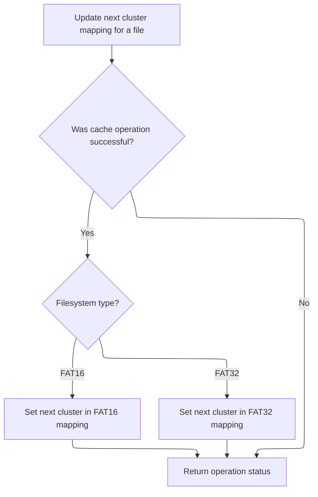

<SwmSnippet path="/src/main/io/asyncfatfs/asyncfatfs.c" line="1161">

---

In <SwmToken path="src/main/io/asyncfatfs/asyncfatfs.c" pos="1161:4:4" line-data="static afatfsOperationStatus_e afatfs_FATSetNextCluster(uint32_t startCluster, uint32_t nextCluster)">`afatfs_FATSetNextCluster`</SwmToken>, we figure out where in the FAT the cluster linkage needs to be written, then call <SwmToken path="src/main/io/asyncfatfs/asyncfatfs.c" pos="1175:5:5" line-data="    result = afatfs_cacheSector(fatPhysicalSector, &amp;sector.bytes, AFATFS_CACHE_READ | AFATFS_CACHE_WRITE, 0);">`afatfs_cacheSector`</SwmToken> to load the sector into memory so we can update it. This is required before modifying the FAT entry.

```c
static afatfsOperationStatus_e afatfs_FATSetNextCluster(uint32_t startCluster, uint32_t nextCluster)
{
    afatfsFATSector_t sector;
    uint32_t fatSectorIndex, fatSectorEntryIndex, fatPhysicalSector;
    afatfsOperationStatus_e result;

#ifdef AFATFS_DEBUG
    afatfs_assert(startCluster >= FAT_SMALLEST_LEGAL_CLUSTER_NUMBER);
#endif

    afatfs_getFATPositionForCluster(startCluster, &fatSectorIndex, &fatSectorEntryIndex);

    fatPhysicalSector = afatfs_fatSectorToPhysical(0, fatSectorIndex);

    result = afatfs_cacheSector(fatPhysicalSector, &sector.bytes, AFATFS_CACHE_READ | AFATFS_CACHE_WRITE, 0);

```

---

</SwmSnippet>

<SwmSnippet path="/src/main/io/asyncfatfs/asyncfatfs.c" line="1177">

---

Back in <SwmToken path="src/main/io/asyncfatfs/asyncfatfs.c" pos="1161:4:4" line-data="static afatfsOperationStatus_e afatfs_FATSetNextCluster(uint32_t startCluster, uint32_t nextCluster)">`afatfs_FATSetNextCluster`</SwmToken>, after caching the sector, we update the FAT entry for the cluster using the right format for <SwmToken path="src/main/io/asyncfatfs/asyncfatfs.c" pos="1974:3:3" line-data="    // FAT16 root directories are made up of contiguous sectors rather than clusters">`FAT16`</SwmToken> or <SwmToken path="src/main/io/asyncfatfs/asyncfatfs.c" pos="22:11:11" line-data=" * This is a FAT16/FAT32 filesystem for SD cards which uses asynchronous operations: The caller need never wait">`FAT32`</SwmToken>. The function then returns the cache operation result.

```c
    if (result == AFATFS_OPERATION_SUCCESS) {
        if (afatfs.filesystemType == FAT_FILESYSTEM_TYPE_FAT16) {
            sector.fat16[fatSectorEntryIndex] = nextCluster;
        } else {
            sector.fat32[fatSectorEntryIndex] = nextCluster;
        }
    }

    return result;
}
```

---

</SwmSnippet>

### Updating directory entry after cluster allocation

<SwmSnippet path="/src/main/io/asyncfatfs/asyncfatfs.c" line="1596">

---

Back in <SwmToken path="src/main/io/asyncfatfs/asyncfatfs.c" pos="1538:4:4" line-data="static afatfsOperationStatus_e afatfs_appendRegularFreeClusterContinue(afatfsFile_t *file)">`afatfs_appendRegularFreeClusterContinue`</SwmToken>, after updating the FAT, we call <SwmToken path="src/main/io/asyncfatfs/asyncfatfs.c" pos="1597:4:4" line-data="            if (afatfs_saveDirectoryEntry(file, AFATFS_SAVE_DIRECTORY_NORMAL) == AFATFS_OPERATION_SUCCESS) {">`afatfs_saveDirectoryEntry`</SwmToken> to update the file's directory entry with the new size and cluster info. This keeps the directory in sync with the file's actual allocation.

```c
        case AFATFS_APPEND_FREE_CLUSTER_PHASE_UPDATE_FILE_DIRECTORY:
            if (afatfs_saveDirectoryEntry(file, AFATFS_SAVE_DIRECTORY_NORMAL) == AFATFS_OPERATION_SUCCESS) {
                opState->phase = AFATFS_APPEND_FREE_CLUSTER_PHASE_COMPLETE;
                goto doMore;
            }
        break;
```

---

</SwmSnippet>

### Saving updated directory entry

```mermaid
%%{init: {"flowchart": {"defaultRenderer": "elk"}} }%%
flowchart TD
    node1{"Is file a root directory?"}
    click node1 openCode "src/main/io/asyncfatfs/asyncfatfs.c:1477:1479"
    node1 -->|"Yes"| node2["Return success"]
    click node2 openCode "src/main/io/asyncfatfs/asyncfatfs.c:1478:1479"
    node1 -->|"No"| node3{"Was sector cached for writing?"}
    click node3 openCode "src/main/io/asyncfatfs/asyncfatfs.c:1481:1487"
    node3 -->|"No"| node14["Return cache result"]
    click node14 openCode "src/main/io/asyncfatfs/asyncfatfs.c:1521:1522"
    node3 -->|"Yes"| node5{"Is directory entry index valid?"}
    click node5 openCode "src/main/io/asyncfatfs/asyncfatfs.c:1488:1518"
    node5 -->|"No"| node6["Return failure"]
    click node6 openCode "src/main/io/asyncfatfs/asyncfatfs.c:1517:1518"
    node5 -->|"Yes"| node7{"Which save mode?"}
    click node7 openCode "src/main/io/asyncfatfs/asyncfatfs.c:1491:1507"
    node7 -->|"Normal"| node8["Set file size to physical size"]
    click node8 openCode "src/main/io/asyncfatfs/asyncfatfs.c:1492:1499"
    node7 -->|"Deleted"| node9["Mark file as deleted"]
    click node9 openCode "src/main/io/asyncfatfs/asyncfatfs.c:1500:1502"
    node9 --> node10["Set file size to logical size"]
    click node10 openCode "src/main/io/asyncfatfs/asyncfatfs.c:1504:1506"
    node7 -->|"For Close"| node10
    node8 --> node11{"Is file a directory?"}
    node10 --> node11
    click node11 openCode "src/main/io/asyncfatfs/asyncfatfs.c:1509:1512"
    node11 -->|"Yes"| node12["Set file size to zero"]
    click node12 openCode "src/main/io/asyncfatfs/asyncfatfs.c:1511:1512"
    node11 -->|"No"| node13["Set cluster info"]
    click node13 openCode "src/main/io/asyncfatfs/asyncfatfs.c:1514:1515"
    node12 --> node13
    node13 --> node14
classDef HeadingStyle fill:#777777,stroke:#333,stroke-width:2px;

%% Swimm:
%% %%{init: {"flowchart": {"defaultRenderer": "elk"}} }%%
%% flowchart TD
%%     node1{"Is file a root directory?"}
%%     click node1 openCode "<SwmPath>[src/…/asyncfatfs/asyncfatfs.c](src/main/io/asyncfatfs/asyncfatfs.c)</SwmPath>:1477:1479"
%%     node1 -->|"Yes"| node2["Return success"]
%%     click node2 openCode "<SwmPath>[src/…/asyncfatfs/asyncfatfs.c](src/main/io/asyncfatfs/asyncfatfs.c)</SwmPath>:1478:1479"
%%     node1 -->|"No"| node3{"Was sector cached for writing?"}
%%     click node3 openCode "<SwmPath>[src/…/asyncfatfs/asyncfatfs.c](src/main/io/asyncfatfs/asyncfatfs.c)</SwmPath>:1481:1487"
%%     node3 -->|"No"| node14["Return cache result"]
%%     click node14 openCode "<SwmPath>[src/…/asyncfatfs/asyncfatfs.c](src/main/io/asyncfatfs/asyncfatfs.c)</SwmPath>:1521:1522"
%%     node3 -->|"Yes"| node5{"Is directory entry index valid?"}
%%     click node5 openCode "<SwmPath>[src/…/asyncfatfs/asyncfatfs.c](src/main/io/asyncfatfs/asyncfatfs.c)</SwmPath>:1488:1518"
%%     node5 -->|"No"| node6["Return failure"]
%%     click node6 openCode "<SwmPath>[src/…/asyncfatfs/asyncfatfs.c](src/main/io/asyncfatfs/asyncfatfs.c)</SwmPath>:1517:1518"
%%     node5 -->|"Yes"| node7{"Which save mode?"}
%%     click node7 openCode "<SwmPath>[src/…/asyncfatfs/asyncfatfs.c](src/main/io/asyncfatfs/asyncfatfs.c)</SwmPath>:1491:1507"
%%     node7 -->|"Normal"| node8["Set file size to physical size"]
%%     click node8 openCode "<SwmPath>[src/…/asyncfatfs/asyncfatfs.c](src/main/io/asyncfatfs/asyncfatfs.c)</SwmPath>:1492:1499"
%%     node7 -->|"Deleted"| node9["Mark file as deleted"]
%%     click node9 openCode "<SwmPath>[src/…/asyncfatfs/asyncfatfs.c](src/main/io/asyncfatfs/asyncfatfs.c)</SwmPath>:1500:1502"
%%     node9 --> node10["Set file size to logical size"]
%%     click node10 openCode "<SwmPath>[src/…/asyncfatfs/asyncfatfs.c](src/main/io/asyncfatfs/asyncfatfs.c)</SwmPath>:1504:1506"
%%     node7 -->|"For Close"| node10
%%     node8 --> node11{"Is file a directory?"}
%%     node10 --> node11
%%     click node11 openCode "<SwmPath>[src/…/asyncfatfs/asyncfatfs.c](src/main/io/asyncfatfs/asyncfatfs.c)</SwmPath>:1509:1512"
%%     node11 -->|"Yes"| node12["Set file size to zero"]
%%     click node12 openCode "<SwmPath>[src/…/asyncfatfs/asyncfatfs.c](src/main/io/asyncfatfs/asyncfatfs.c)</SwmPath>:1511:1512"
%%     node11 -->|"No"| node13["Set cluster info"]
%%     click node13 openCode "<SwmPath>[src/…/asyncfatfs/asyncfatfs.c](src/main/io/asyncfatfs/asyncfatfs.c)</SwmPath>:1514:1515"
%%     node12 --> node13
%%     node13 --> node14
%% classDef HeadingStyle fill:#777777,stroke:#333,stroke-width:2px;
```

<SwmSnippet path="/src/main/io/asyncfatfs/asyncfatfs.c" line="1472">

---

In <SwmToken path="src/main/io/asyncfatfs/asyncfatfs.c" pos="1472:4:4" line-data="static afatfsOperationStatus_e afatfs_saveDirectoryEntry(afatfsFilePtr_t file, afatfsSaveDirectoryEntryMode_e mode)">`afatfs_saveDirectoryEntry`</SwmToken>, if the file is a root directory (sector number zero), we skip saving and return success. Otherwise, we call <SwmToken path="src/main/io/asyncfatfs/asyncfatfs.c" pos="1481:5:5" line-data="    result = afatfs_cacheSector(file-&gt;directoryEntryPos.sectorNumberPhysical, &amp;sector, AFATFS_CACHE_READ | AFATFS_CACHE_WRITE, 0);">`afatfs_cacheSector`</SwmToken> to load the directory sector before updating the entry.

```c
static afatfsOperationStatus_e afatfs_saveDirectoryEntry(afatfsFilePtr_t file, afatfsSaveDirectoryEntryMode_e mode)
{
    uint8_t *sector;
    afatfsOperationStatus_e result;

    if (file->directoryEntryPos.sectorNumberPhysical == 0) {
        return AFATFS_OPERATION_SUCCESS; // Root directories don't have a directory entry
    }

    result = afatfs_cacheSector(file->directoryEntryPos.sectorNumberPhysical, &sector, AFATFS_CACHE_READ | AFATFS_CACHE_WRITE, 0);

#ifdef AFATFS_DEBUG_VERBOSE
```

---

</SwmSnippet>

<SwmSnippet path="/src/main/io/asyncfatfs/asyncfatfs.c" line="1484">

---

Back in <SwmToken path="src/main/io/asyncfatfs/asyncfatfs.c" pos="1472:4:4" line-data="static afatfsOperationStatus_e afatfs_saveDirectoryEntry(afatfsFilePtr_t file, afatfsSaveDirectoryEntryMode_e mode)">`afatfs_saveDirectoryEntry`</SwmToken>, after caching the sector, we update the directory entry: exaggerate file size for normal saves, use logical size for close/deleted, set size to zero for directories, and split the first cluster number into high/low parts. This keeps the entry consistent with the file's state and allocation.

```c
    fprintf(stderr, "Saving directory entry to sector %u...\n", file->directoryEntryPos.sectorNumberPhysical);
#endif

    if (result == AFATFS_OPERATION_SUCCESS) {
        if (afatfs_assert(file->directoryEntryPos.entryIndex >= 0)) {
            fatDirectoryEntry_t *entry = (fatDirectoryEntry_t *) sector + file->directoryEntryPos.entryIndex;

            switch (mode) {
               case AFATFS_SAVE_DIRECTORY_NORMAL:
                   /* We exaggerate the length of the written file so that if power is lost, the end of the file will
                    * still be readable (though the very tail of the file will be uninitialized data).
                    *
                    * This way we can avoid updating the directory entry too many times during fwrites() on the file.
                    */
                   entry->fileSize = file->physicalSize;
               break;
               case AFATFS_SAVE_DIRECTORY_DELETED:
                   entry->filename[0] = FAT_DELETED_FILE_MARKER;
                   FALLTHROUGH;

               case AFATFS_SAVE_DIRECTORY_FOR_CLOSE:
                   // We write the true length of the file on close.
                   entry->fileSize = file->logicalSize;
            }

            // (sub)directories don't store a filesize in their directory entry:
            if (file->type == AFATFS_FILE_TYPE_DIRECTORY) {
                entry->fileSize = 0;
            }

            entry->firstClusterHigh = file->firstCluster >> 16;
            entry->firstClusterLow = file->firstCluster & 0xFFFF;
        } else {
            return AFATFS_OPERATION_FAILURE;
        }
    }

    return result;
}
```

---

</SwmSnippet>

### Finalizing cluster append operation

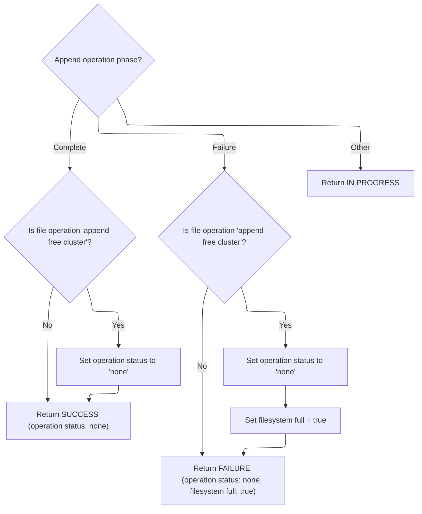

<SwmSnippet path="/src/main/io/asyncfatfs/asyncfatfs.c" line="1602">

---

Back in <SwmToken path="src/main/io/asyncfatfs/asyncfatfs.c" pos="1538:4:4" line-data="static afatfsOperationStatus_e afatfs_appendRegularFreeClusterContinue(afatfsFile_t *file)">`afatfs_appendRegularFreeClusterContinue`</SwmToken>, after saving the directory entry, we reset the operation field and return SUCCESS if the cluster was appended, or FAILURE if the filesystem is full.

```c
        case AFATFS_APPEND_FREE_CLUSTER_PHASE_COMPLETE:
            if (file->operation.operation == AFATFS_FILE_OPERATION_APPEND_FREE_CLUSTER) {
                file->operation.operation = AFATFS_FILE_OPERATION_NONE;
            }

            return AFATFS_OPERATION_SUCCESS;
        break;
        case AFATFS_APPEND_FREE_CLUSTER_PHASE_FAILURE:
            if (file->operation.operation == AFATFS_FILE_OPERATION_APPEND_FREE_CLUSTER) {
                file->operation.operation = AFATFS_FILE_OPERATION_NONE;
            }

            afatfs.filesystemFull = true;
            return AFATFS_OPERATION_FAILURE;
        break;
    }

    return AFATFS_OPERATION_IN_PROGRESS;
}
```

---

</SwmSnippet>

## Preparing to write new directory sectors

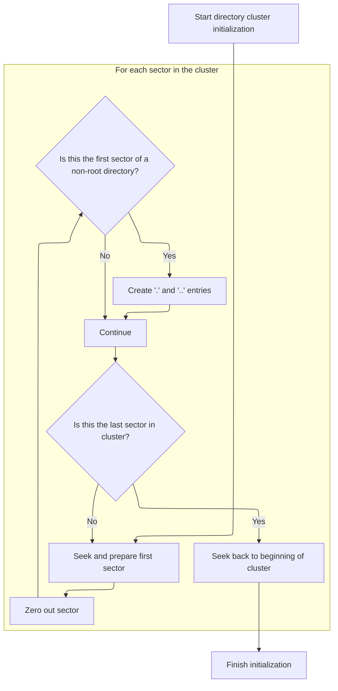

<SwmSnippet path="/src/main/io/asyncfatfs/asyncfatfs.c" line="2254">

---

Back in <SwmToken path="src/main/io/asyncfatfs/asyncfatfs.c" pos="2233:4:4" line-data="static afatfsOperationStatus_e afatfs_extendSubdirectoryContinue(afatfsFile_t *directory)">`afatfs_extendSubdirectoryContinue`</SwmToken>, after allocating the cluster, we zero out each sector in the new cluster and set up '.' and '..' entries if needed. We loop through all sectors, moving the cursor as we go.

```c
        case AFATFS_EXTEND_SUBDIRECTORY_PHASE_WRITE_SECTORS:
            // Now, zero out that cluster
            afatfs_fileGetCursorClusterAndSector(directory, &clusterNumber, &sectorInCluster);
            physicalSector = afatfs_fileGetCursorPhysicalSector(directory);

            while (1) {
                status = afatfs_cacheSector(physicalSector, &sectorBuffer, AFATFS_CACHE_WRITE, 0);

                if (status != AFATFS_OPERATION_SUCCESS) {
                    return status;
                }

                memset(sectorBuffer, 0, AFATFS_SECTOR_SIZE);

                // If this is the first sector of a non-root directory, create the "." and ".." entries
                if (directory->directoryEntryPos.sectorNumberPhysical != 0 && directory->cursorOffset == 0) {
                    fatDirectoryEntry_t *dirEntries = (fatDirectoryEntry_t *) sectorBuffer;

                    memset(dirEntries[0].filename, ' ', sizeof(dirEntries[0].filename));
                    dirEntries[0].filename[0] = '.';
                    dirEntries[0].firstClusterHigh = directory->firstCluster >> 16;
                    dirEntries[0].firstClusterLow = directory->firstCluster & 0xFFFF;
                    dirEntries[0].attrib = FAT_FILE_ATTRIBUTE_DIRECTORY;

                    memset(dirEntries[1].filename, ' ', sizeof(dirEntries[1].filename));
                    dirEntries[1].filename[0] = '.';
                    dirEntries[1].filename[1] = '.';
                    dirEntries[1].firstClusterHigh = opState->parentDirectoryCluster >> 16;
                    dirEntries[1].firstClusterLow = opState->parentDirectoryCluster & 0xFFFF;
                    dirEntries[1].attrib = FAT_FILE_ATTRIBUTE_DIRECTORY;
                }

                if (sectorInCluster < afatfs.sectorsPerCluster - 1) {
                    // Move to next sector
                    afatfs_assert(afatfs_fseekAtomic(directory, AFATFS_SECTOR_SIZE));
                    sectorInCluster++;
                    physicalSector++;
                } else {
                    break;
                }
            }
```

---

</SwmSnippet>

<SwmSnippet path="/src/main/io/asyncfatfs/asyncfatfs.c" line="2296">

---

After zeroing out the cluster, we call <SwmToken path="src/main/io/asyncfatfs/asyncfatfs.c" pos="2297:3:3" line-data="            afatfs_assert(afatfs_fseekAtomic(directory, -(AFATFS_SECTOR_SIZE * ((int32_t)afatfs.sectorsPerCluster - 1))));">`afatfs_fseekAtomic`</SwmToken> to reset the cursor to the start of the cluster. This sets up the directory for future operations and updates the phase to SUCCESS.

```c
            // Seek back to the beginning of the cluster
            afatfs_assert(afatfs_fseekAtomic(directory, -(AFATFS_SECTOR_SIZE * ((int32_t)afatfs.sectorsPerCluster - 1))));
            opState->phase = AFATFS_EXTEND_SUBDIRECTORY_PHASE_SUCCESS;
            goto doMore;
        break;
```

---

</SwmSnippet>

## Seeking within file or directory

<SwmSnippet path="/src/main/io/asyncfatfs/asyncfatfs.c" line="1960">

---

In <SwmToken path="src/main/io/asyncfatfs/asyncfatfs.c" pos="1960:4:4" line-data="static bool afatfs_fseekAtomic(afatfsFilePtr_t file, int32_t offset)">`afatfs_fseekAtomic`</SwmToken>, we check if the seek stays within the current sector or crosses boundaries. If it crosses a cluster boundary, we call <SwmToken path="src/main/io/asyncfatfs/asyncfatfs.c" pos="1995:5:5" line-data="        status = afatfs_fileGetNextCluster(file, file-&gt;cursorCluster, &amp;nextCluster);">`afatfs_fileGetNextCluster`</SwmToken> to get the next cluster and update the cursor. This keeps file navigation consistent across clusters.

```c
static bool afatfs_fseekAtomic(afatfsFilePtr_t file, int32_t offset)
{
    // Seeks within a sector
    uint32_t newSectorOffset = offset + file->cursorOffset % AFATFS_SECTOR_SIZE;

    // i.e. newSectorOffset is non-negative and smaller than AFATFS_SECTOR_SIZE, we're staying within the same sector
    if (newSectorOffset < AFATFS_SECTOR_SIZE) {
        file->cursorOffset += offset;
        return true;
    }

    // We're seeking outside the sector so unlock it if we were holding it
    afatfs_fileUnlockCacheSector(file);

    // FAT16 root directories are made up of contiguous sectors rather than clusters
    if (file->type == AFATFS_FILE_TYPE_FAT16_ROOT_DIRECTORY) {
        file->cursorOffset += offset;

        return true;
    }

    uint32_t clusterSizeBytes = afatfs_clusterSize();
    uint32_t offsetInCluster = afatfs_byteIndexInCluster(file->cursorOffset);
    uint32_t newOffsetInCluster = offsetInCluster + offset;

    afatfsOperationStatus_e status;

    if (offset > (int32_t) clusterSizeBytes || offset < -(int32_t) offsetInCluster) {
        return false;
    }

    // Are we seeking outside the cluster? If so we'll need to find out the next cluster number
    if (newOffsetInCluster >= clusterSizeBytes) {
        uint32_t nextCluster;

        status = afatfs_fileGetNextCluster(file, file->cursorCluster, &nextCluster);

```

---

</SwmSnippet>

### Determining next cluster in chain

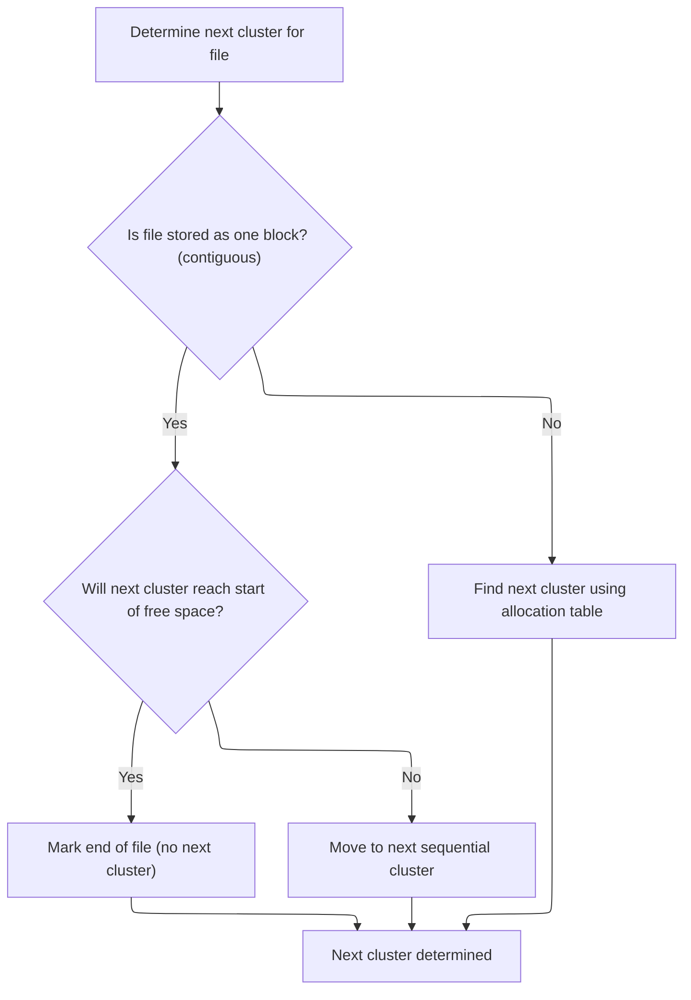

<SwmSnippet path="/src/main/io/asyncfatfs/asyncfatfs.c" line="1332">

---

<SwmToken path="src/main/io/asyncfatfs/asyncfatfs.c" pos="1332:4:4" line-data="static afatfsOperationStatus_e afatfs_fileGetNextCluster(afatfsFilePtr_t file, uint32_t currentCluster, uint32_t *nextCluster)">`afatfs_fileGetNextCluster`</SwmToken> checks if the file is contiguous and, if so, increments the cluster unless it would hit the <SwmToken path="src/main/io/asyncfatfs/asyncfatfs.c" pos="1338:9:9" line-data="        uint32_t freeFileStart = afatfs.freeFile.firstCluster;">`freeFile`</SwmToken> area. Otherwise, it calls <SwmToken path="src/main/io/asyncfatfs/asyncfatfs.c" pos="1353:3:3" line-data="        return afatfs_FATGetNextCluster(0, currentCluster, nextCluster);">`afatfs_FATGetNextCluster`</SwmToken> to follow the FAT chain. This keeps cluster navigation correct for both contiguous and <SwmToken path="src/main/io/asyncfatfs/asyncfatfs.c" pos="3020:45:47" line-data=" * ws   If the file is already non-empty or freefile support is not compiled in then it will fall back to non-contiguous">`non-contiguous`</SwmToken> files.

```c
static afatfsOperationStatus_e afatfs_fileGetNextCluster(afatfsFilePtr_t file, uint32_t currentCluster, uint32_t *nextCluster)
{
#ifndef AFATFS_USE_FREEFILE
    (void) file;
#else
    if ((file->mode & AFATFS_FILE_MODE_CONTIGUOUS) != 0) {
        uint32_t freeFileStart = afatfs.freeFile.firstCluster;

        afatfs_assert(currentCluster + 1 <= freeFileStart);

        // Would the next cluster lie outside the allocated file? (i.e. beyond the end of the file into the start of the freefile)
        if (currentCluster + 1 == freeFileStart) {
            *nextCluster = 0;
        } else {
            *nextCluster = currentCluster + 1;
        }

        return AFATFS_OPERATION_SUCCESS;
    } else
#endif
    {
        return afatfs_FATGetNextCluster(0, currentCluster, nextCluster);
    }
}
```

---

</SwmSnippet>

### Reading next cluster from FAT

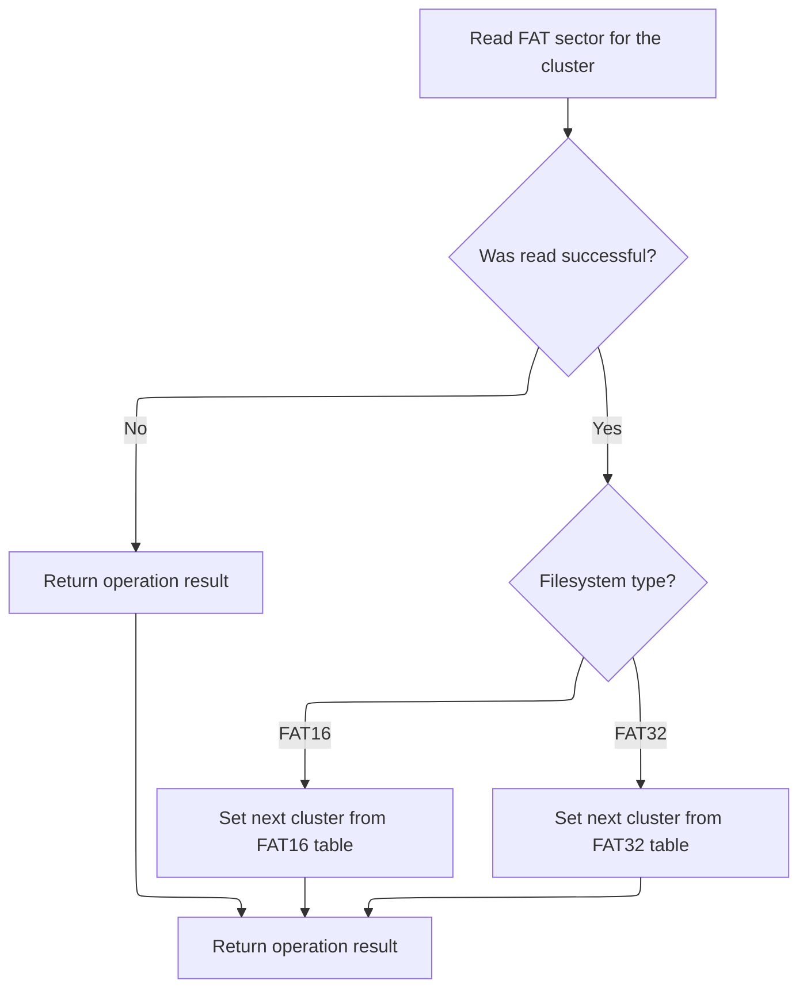

<SwmSnippet path="/src/main/io/asyncfatfs/asyncfatfs.c" line="1133">

---

In <SwmToken path="src/main/io/asyncfatfs/asyncfatfs.c" pos="1133:4:4" line-data="static afatfsOperationStatus_e afatfs_FATGetNextCluster(int fatIndex, uint32_t cluster, uint32_t *nextCluster)">`afatfs_FATGetNextCluster`</SwmToken>, we figure out where the next cluster info is stored in the FAT, then call <SwmToken path="src/main/io/asyncfatfs/asyncfatfs.c" pos="1140:7:7" line-data="    afatfsOperationStatus_e result = afatfs_cacheSector(afatfs_fatSectorToPhysical(fatIndex, fatSectorIndex), &amp;sector.bytes, AFATFS_CACHE_READ, 0);">`afatfs_cacheSector`</SwmToken> to load the sector into memory so we can read the entry.

```c
static afatfsOperationStatus_e afatfs_FATGetNextCluster(int fatIndex, uint32_t cluster, uint32_t *nextCluster)
{
    uint32_t fatSectorIndex, fatSectorEntryIndex;
    afatfsFATSector_t sector;

    afatfs_getFATPositionForCluster(cluster, &fatSectorIndex, &fatSectorEntryIndex);

    afatfsOperationStatus_e result = afatfs_cacheSector(afatfs_fatSectorToPhysical(fatIndex, fatSectorIndex), &sector.bytes, AFATFS_CACHE_READ, 0);

```

---

</SwmSnippet>

<SwmSnippet path="/src/main/io/asyncfatfs/asyncfatfs.c" line="1142">

---

Back in <SwmToken path="src/main/io/asyncfatfs/asyncfatfs.c" pos="1133:4:4" line-data="static afatfsOperationStatus_e afatfs_FATGetNextCluster(int fatIndex, uint32_t cluster, uint32_t *nextCluster)">`afatfs_FATGetNextCluster`</SwmToken>, after caching the sector, we read the next cluster value from the FAT entry, using the right format for <SwmToken path="src/main/io/asyncfatfs/asyncfatfs.c" pos="1974:3:3" line-data="    // FAT16 root directories are made up of contiguous sectors rather than clusters">`FAT16`</SwmToken> or <SwmToken path="src/main/io/asyncfatfs/asyncfatfs.c" pos="22:11:11" line-data=" * This is a FAT16/FAT32 filesystem for SD cards which uses asynchronous operations: The caller need never wait">`FAT32`</SwmToken>. The function then returns the cache operation result.

```c
    if (result == AFATFS_OPERATION_SUCCESS) {
        if (afatfs.filesystemType == FAT_FILESYSTEM_TYPE_FAT16) {
            *nextCluster = sector.fat16[fatSectorEntryIndex];
        } else {
            *nextCluster = fat32_decodeClusterNumber(sector.fat32[fatSectorEntryIndex]);
        }
    }

    return result;
}
```

---

</SwmSnippet>

### Completing seek across clusters

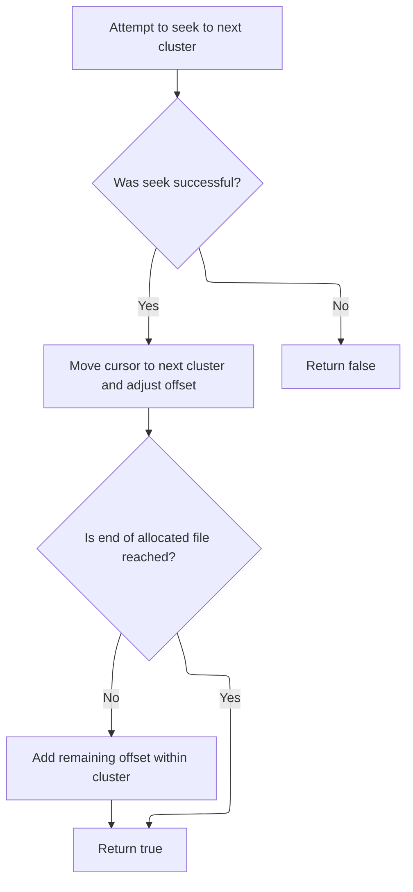

<SwmSnippet path="/src/main/io/asyncfatfs/asyncfatfs.c" line="1997">

---

Back in <SwmToken path="src/main/io/asyncfatfs/asyncfatfs.c" pos="1960:4:4" line-data="static bool afatfs_fseekAtomic(afatfsFilePtr_t file, int32_t offset)">`afatfs_fseekAtomic`</SwmToken>, after getting the next cluster, we move the cursor to the start of the new cluster and adjust the offset. If there's more to seek, we add the remaining offset unless we're at the end of the file.

```c
        if (status == AFATFS_OPERATION_SUCCESS) {
            // Seek to the beginning of the next cluster
            uint32_t bytesToSeek = clusterSizeBytes - offsetInCluster;

            file->cursorPreviousCluster = file->cursorCluster;
            file->cursorCluster = nextCluster;
            file->cursorOffset += bytesToSeek;

            offset -= bytesToSeek;
        } else {
            // Try again later
            return false;
        }
    }

    // If we didn't already hit the end of the file, add any remaining offset needed inside the cluster
    if (!afatfs_isEndOfAllocatedFile(file)) {
        file->cursorOffset += offset;
    }

    return true;
}
```

---

</SwmSnippet>

## Finishing subdirectory extension

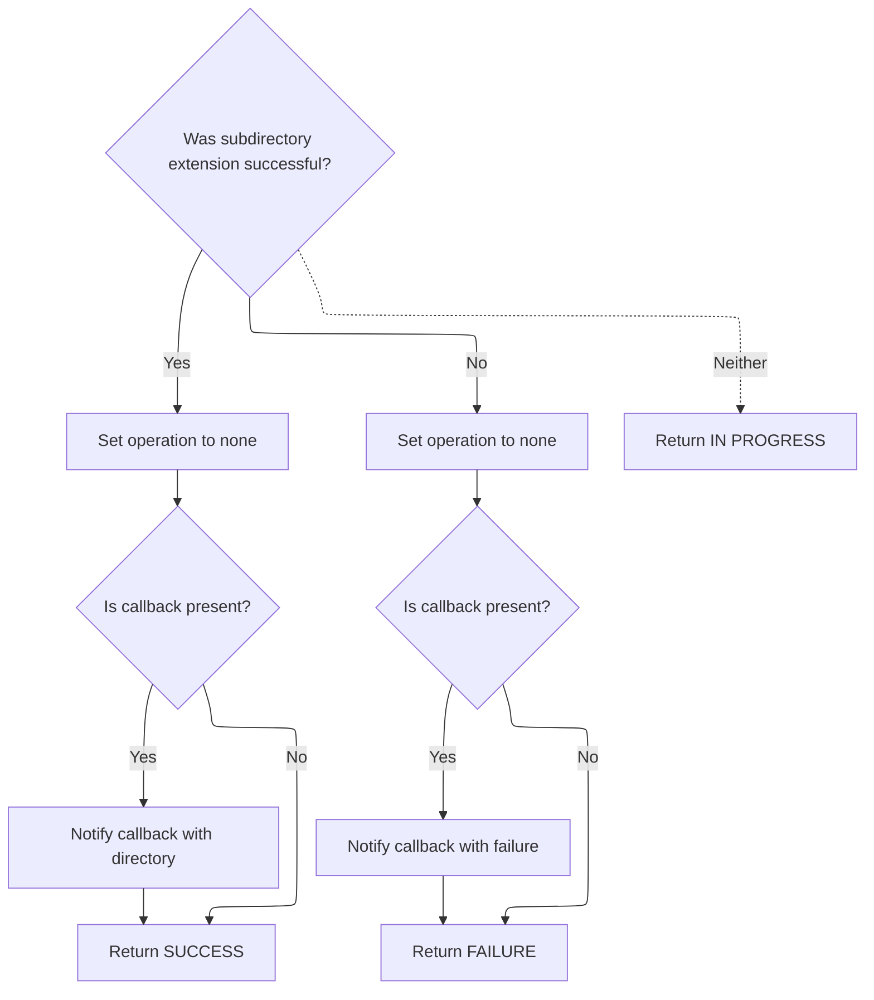

<SwmSnippet path="/src/main/io/asyncfatfs/asyncfatfs.c" line="2301">

---

Back in <SwmToken path="src/main/io/asyncfatfs/asyncfatfs.c" pos="2233:4:4" line-data="static afatfsOperationStatus_e afatfs_extendSubdirectoryContinue(afatfsFile_t *directory)">`afatfs_extendSubdirectoryContinue`</SwmToken>, after seeking to the start of the cluster, we reset the operation field and call the callback to signal completion or failure. The function then returns SUCCESS or FAILURE as appropriate.

```c
        case AFATFS_EXTEND_SUBDIRECTORY_PHASE_SUCCESS:
            directory->operation.operation = AFATFS_FILE_OPERATION_NONE;

            if (opState->callback) {
                opState->callback(directory);
            }

            return AFATFS_OPERATION_SUCCESS;
        break;
        case AFATFS_EXTEND_SUBDIRECTORY_PHASE_FAILURE:
            directory->operation.operation = AFATFS_FILE_OPERATION_NONE;

            if (opState->callback) {
                opState->callback(NULL);
            }
            return AFATFS_OPERATION_FAILURE;
        break;
    }

    return AFATFS_OPERATION_IN_PROGRESS;
}
```

---

</SwmSnippet>

&nbsp;

*This is an auto-generated document by Swimm 🌊 and has not yet been verified by a human*

<SwmMeta version="3.0.0" repo-id="Z2l0aHViJTNBJTNBYy1iZXRhZmxpZ2h0JTNBJTNBcmljYXJkb2xvcGV6Zw==" repo-name="c-betaflight"><sup>Powered by [Swimm](https://app.swimm.io/)</sup></SwmMeta>
