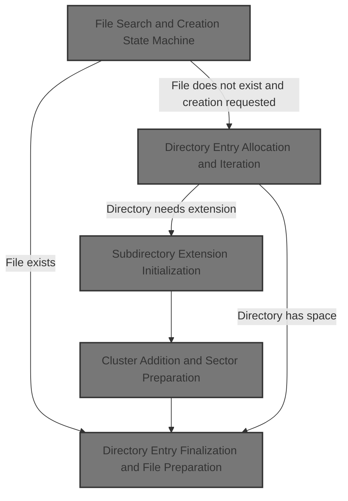
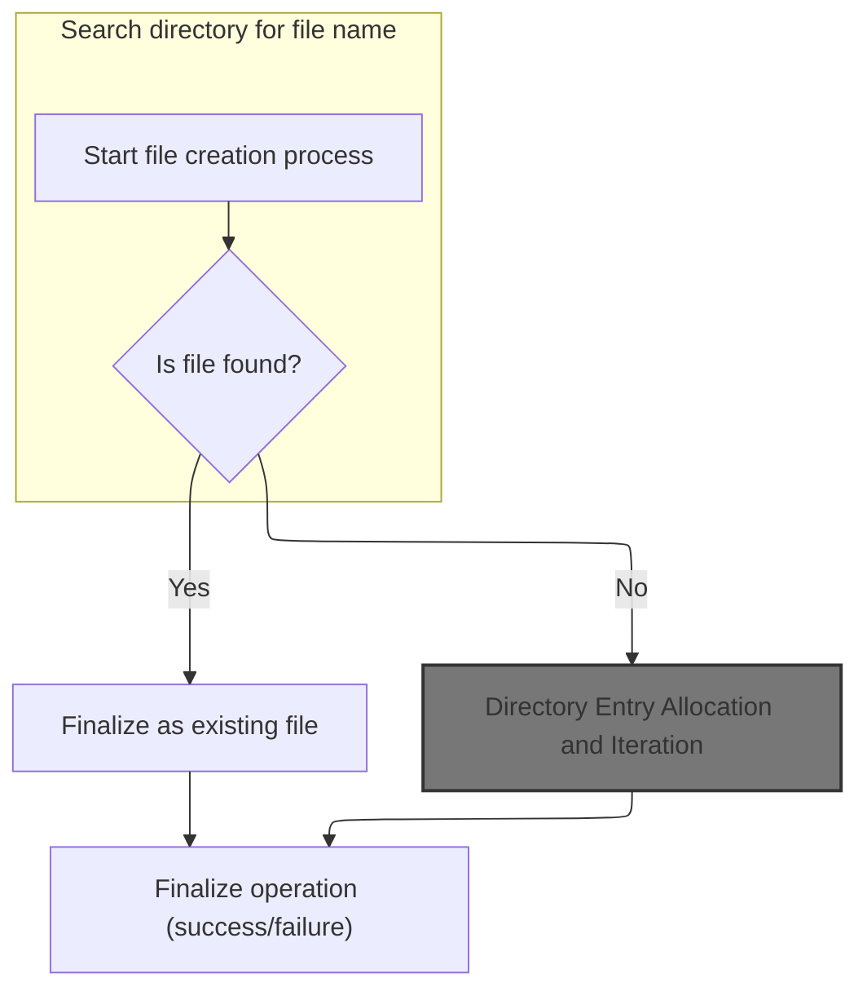
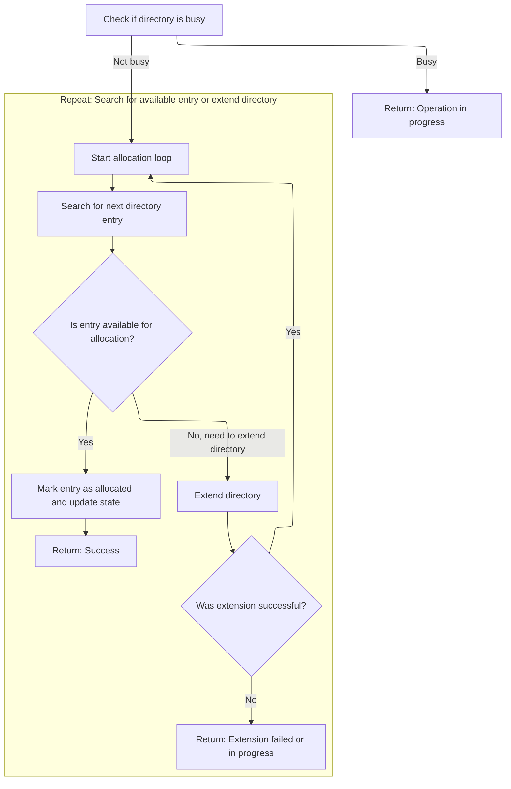
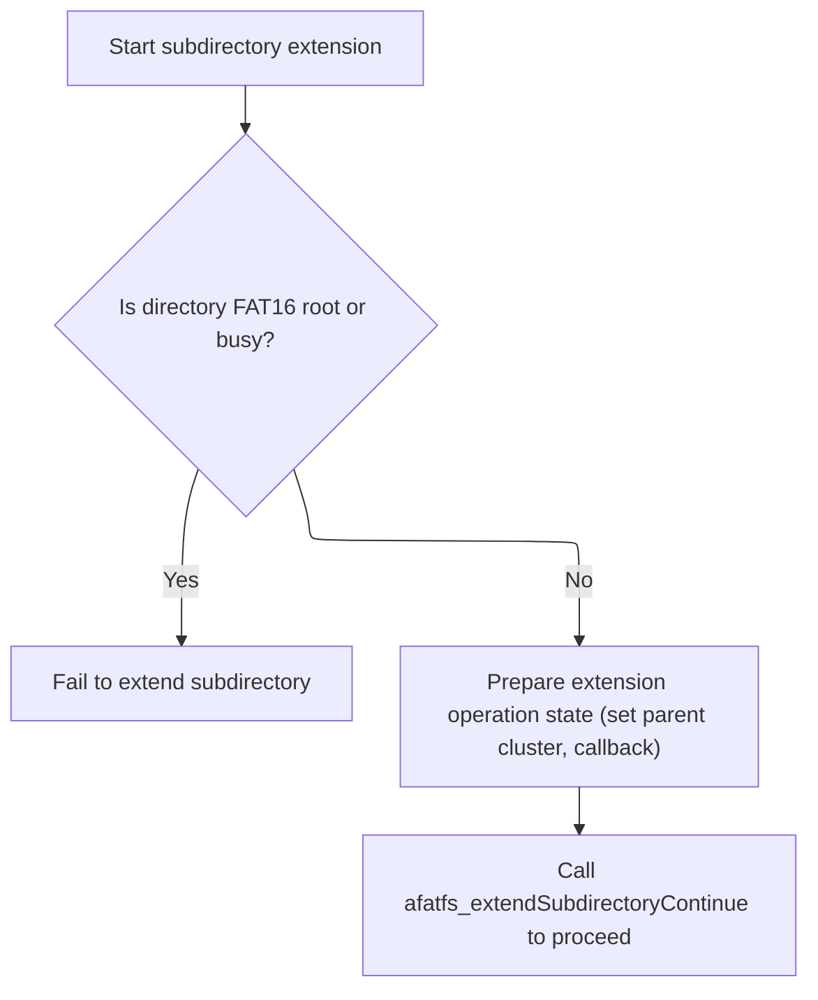

This document describes how the system handles requests to create or open files. The process involves searching for the file, allocating space if it does not exist, extending the directory if needed, and preparing the file for use. Input is a request to create or open a file; output is a file ready for operations.



# Where is this flow used?

This flow is used multiple times in the codebase as represented in the following diagram:

```mermaid
graph TD;
      6dd2d465b26b8f79fc298f2adc1a2e19b0dc1271a39ab534016692ea8030f494(src/…/asyncfatfs/asyncfatfs.c::afatfs_createFile) --> 7e7d0b2a579c0ad1f6ffab46feee330930a29bf6820a6ad94f61dceeb48c48ab(src/…/asyncfatfs/asyncfatfs.c::afatfs_createFileContinue):::mainFlowStyle

cf06b7067c44483bb6f91d266b6453784baea5b14425b91423c62c2f95d61eda(src/…/asyncfatfs/asyncfatfs.c::afatfs_mkdir) --> 6dd2d465b26b8f79fc298f2adc1a2e19b0dc1271a39ab534016692ea8030f494(src/…/asyncfatfs/asyncfatfs.c::afatfs_createFile)

78408541875ffa1e96c99dcc0b64dd7702b5f57cdfad21f1c414f409fc21aa02(src/…/asyncfatfs/asyncfatfs.c::afatfs_fopen) --> 6dd2d465b26b8f79fc298f2adc1a2e19b0dc1271a39ab534016692ea8030f494(src/…/asyncfatfs/asyncfatfs.c::afatfs_createFile)

a5ba5974890bc1b3ae3f3b1984df722344dfa87a202f879ccce61afa8f1a29bc(src/…/asyncfatfs/asyncfatfs.c::afatfs_initContinue) --> 6dd2d465b26b8f79fc298f2adc1a2e19b0dc1271a39ab534016692ea8030f494(src/…/asyncfatfs/asyncfatfs.c::afatfs_createFile)

a5ba5974890bc1b3ae3f3b1984df722344dfa87a202f879ccce61afa8f1a29bc(src/…/asyncfatfs/asyncfatfs.c::afatfs_initContinue) --> c0c1f3c02d4256cdccc73a33334a541f535baae681d90e4442fd69199650a3ff(src/…/asyncfatfs/asyncfatfs.c::afatfs_fileOperationContinue)

80f7e7f5acd7c5a34ec0378238eaeb4cc9ac03df5b32d94b6e0ef4f08b642884(src/…/asyncfatfs/asyncfatfs.c::afatfs_poll) --> a5ba5974890bc1b3ae3f3b1984df722344dfa87a202f879ccce61afa8f1a29bc(src/…/asyncfatfs/asyncfatfs.c::afatfs_initContinue)

80f7e7f5acd7c5a34ec0378238eaeb4cc9ac03df5b32d94b6e0ef4f08b642884(src/…/asyncfatfs/asyncfatfs.c::afatfs_poll) --> 2628d5d307bea0b87e2cf57bcdb38b36d23cf394b099d3a4589194e603dd339f(src/…/asyncfatfs/asyncfatfs.c::afatfs_fileOperationsPoll)

dc366053c81e8b8954ec41bd478aca3e8c3482bea95799fd6d0068a0500622c8(src/…/asyncfatfs/asyncfatfs.c::afatfs_destroy) --> 80f7e7f5acd7c5a34ec0378238eaeb4cc9ac03df5b32d94b6e0ef4f08b642884(src/…/asyncfatfs/asyncfatfs.c::afatfs_poll)

c0c1f3c02d4256cdccc73a33334a541f535baae681d90e4442fd69199650a3ff(src/…/asyncfatfs/asyncfatfs.c::afatfs_fileOperationContinue) --> 7e7d0b2a579c0ad1f6ffab46feee330930a29bf6820a6ad94f61dceeb48c48ab(src/…/asyncfatfs/asyncfatfs.c::afatfs_createFileContinue):::mainFlowStyle

2628d5d307bea0b87e2cf57bcdb38b36d23cf394b099d3a4589194e603dd339f(src/…/asyncfatfs/asyncfatfs.c::afatfs_fileOperationsPoll) --> c0c1f3c02d4256cdccc73a33334a541f535baae681d90e4442fd69199650a3ff(src/…/asyncfatfs/asyncfatfs.c::afatfs_fileOperationContinue)


classDef mainFlowStyle color:#000000,fill:#7CB9F4
classDef rootsStyle color:#000000,fill:#00FFF4
classDef Style1 color:#000000,fill:#00FFAA
classDef Style2 color:#000000,fill:#FFFF00
classDef Style3 color:#000000,fill:#AA7CB9

%% Swimm:
%% graph TD;
%%       6dd2d465b26b8f79fc298f2adc1a2e19b0dc1271a39ab534016692ea8030f494(<SwmPath>[src/…/asyncfatfs/asyncfatfs.c](src/main/io/asyncfatfs/asyncfatfs.c)</SwmPath>::<SwmToken path="src/main/io/asyncfatfs/asyncfatfs.c" pos="2824:4:4" line-data="static afatfsFilePtr_t afatfs_createFile(afatfsFilePtr_t file, const char *name, uint8_t attrib, uint8_t fileMode,">`afatfs_createFile`</SwmToken>) --> 7e7d0b2a579c0ad1f6ffab46feee330930a29bf6820a6ad94f61dceeb48c48ab(<SwmPath>[src/…/asyncfatfs/asyncfatfs.c](src/main/io/asyncfatfs/asyncfatfs.c)</SwmPath>::<SwmToken path="src/main/io/asyncfatfs/asyncfatfs.c" pos="2582:4:4" line-data="static void afatfs_createFileContinue(afatfsFile_t *file)">`afatfs_createFileContinue`</SwmToken>):::mainFlowStyle
%% 
%% cf06b7067c44483bb6f91d266b6453784baea5b14425b91423c62c2f95d61eda(<SwmPath>[src/…/asyncfatfs/asyncfatfs.c](src/main/io/asyncfatfs/asyncfatfs.c)</SwmPath>::<SwmToken path="src/main/io/asyncfatfs/asyncfatfs.c" pos="2946:2:2" line-data="bool afatfs_mkdir(const char *filename, afatfsFileCallback_t callback)">`afatfs_mkdir`</SwmToken>) --> 6dd2d465b26b8f79fc298f2adc1a2e19b0dc1271a39ab534016692ea8030f494(<SwmPath>[src/…/asyncfatfs/asyncfatfs.c](src/main/io/asyncfatfs/asyncfatfs.c)</SwmPath>::<SwmToken path="src/main/io/asyncfatfs/asyncfatfs.c" pos="2824:4:4" line-data="static afatfsFilePtr_t afatfs_createFile(afatfsFilePtr_t file, const char *name, uint8_t attrib, uint8_t fileMode,">`afatfs_createFile`</SwmToken>)
%% 
%% 78408541875ffa1e96c99dcc0b64dd7702b5f57cdfad21f1c414f409fc21aa02(<SwmPath>[src/…/asyncfatfs/asyncfatfs.c](src/main/io/asyncfatfs/asyncfatfs.c)</SwmPath>::<SwmToken path="src/main/io/asyncfatfs/asyncfatfs.c" pos="3027:2:2" line-data="bool afatfs_fopen(const char *filename, const char *mode, afatfsFileCallback_t complete)">`afatfs_fopen`</SwmToken>) --> 6dd2d465b26b8f79fc298f2adc1a2e19b0dc1271a39ab534016692ea8030f494(<SwmPath>[src/…/asyncfatfs/asyncfatfs.c](src/main/io/asyncfatfs/asyncfatfs.c)</SwmPath>::<SwmToken path="src/main/io/asyncfatfs/asyncfatfs.c" pos="2824:4:4" line-data="static afatfsFilePtr_t afatfs_createFile(afatfsFilePtr_t file, const char *name, uint8_t attrib, uint8_t fileMode,">`afatfs_createFile`</SwmToken>)
%% 
%% a5ba5974890bc1b3ae3f3b1984df722344dfa87a202f879ccce61afa8f1a29bc(<SwmPath>[src/…/asyncfatfs/asyncfatfs.c](src/main/io/asyncfatfs/asyncfatfs.c)</SwmPath>::<SwmToken path="src/main/io/asyncfatfs/asyncfatfs.c" pos="3434:4:4" line-data="static void afatfs_initContinue(void)">`afatfs_initContinue`</SwmToken>) --> 6dd2d465b26b8f79fc298f2adc1a2e19b0dc1271a39ab534016692ea8030f494(<SwmPath>[src/…/asyncfatfs/asyncfatfs.c](src/main/io/asyncfatfs/asyncfatfs.c)</SwmPath>::<SwmToken path="src/main/io/asyncfatfs/asyncfatfs.c" pos="2824:4:4" line-data="static afatfsFilePtr_t afatfs_createFile(afatfsFilePtr_t file, const char *name, uint8_t attrib, uint8_t fileMode,">`afatfs_createFile`</SwmToken>)
%% 
%% a5ba5974890bc1b3ae3f3b1984df722344dfa87a202f879ccce61afa8f1a29bc(<SwmPath>[src/…/asyncfatfs/asyncfatfs.c](src/main/io/asyncfatfs/asyncfatfs.c)</SwmPath>::<SwmToken path="src/main/io/asyncfatfs/asyncfatfs.c" pos="3434:4:4" line-data="static void afatfs_initContinue(void)">`afatfs_initContinue`</SwmToken>) --> c0c1f3c02d4256cdccc73a33334a541f535baae681d90e4442fd69199650a3ff(<SwmPath>[src/…/asyncfatfs/asyncfatfs.c](src/main/io/asyncfatfs/asyncfatfs.c)</SwmPath>::<SwmToken path="src/main/io/asyncfatfs/asyncfatfs.c" pos="522:4:4" line-data="static void afatfs_fileOperationContinue(afatfsFile_t *file);">`afatfs_fileOperationContinue`</SwmToken>)
%% 
%% 80f7e7f5acd7c5a34ec0378238eaeb4cc9ac03df5b32d94b6e0ef4f08b642884(<SwmPath>[src/…/asyncfatfs/asyncfatfs.c](src/main/io/asyncfatfs/asyncfatfs.c)</SwmPath>::<SwmToken path="src/main/io/asyncfatfs/asyncfatfs.c" pos="3564:2:2" line-data="void afatfs_poll(void)">`afatfs_poll`</SwmToken>) --> a5ba5974890bc1b3ae3f3b1984df722344dfa87a202f879ccce61afa8f1a29bc(<SwmPath>[src/…/asyncfatfs/asyncfatfs.c](src/main/io/asyncfatfs/asyncfatfs.c)</SwmPath>::<SwmToken path="src/main/io/asyncfatfs/asyncfatfs.c" pos="3434:4:4" line-data="static void afatfs_initContinue(void)">`afatfs_initContinue`</SwmToken>)
%% 
%% 80f7e7f5acd7c5a34ec0378238eaeb4cc9ac03df5b32d94b6e0ef4f08b642884(<SwmPath>[src/…/asyncfatfs/asyncfatfs.c](src/main/io/asyncfatfs/asyncfatfs.c)</SwmPath>::<SwmToken path="src/main/io/asyncfatfs/asyncfatfs.c" pos="3564:2:2" line-data="void afatfs_poll(void)">`afatfs_poll`</SwmToken>) --> 2628d5d307bea0b87e2cf57bcdb38b36d23cf394b099d3a4589194e603dd339f(<SwmPath>[src/…/asyncfatfs/asyncfatfs.c](src/main/io/asyncfatfs/asyncfatfs.c)</SwmPath>::<SwmToken path="src/main/io/asyncfatfs/asyncfatfs.c" pos="3284:4:4" line-data="static void afatfs_fileOperationsPoll(void)">`afatfs_fileOperationsPoll`</SwmToken>)
%% 
%% dc366053c81e8b8954ec41bd478aca3e8c3482bea95799fd6d0068a0500622c8(<SwmPath>[src/…/asyncfatfs/asyncfatfs.c](src/main/io/asyncfatfs/asyncfatfs.c)</SwmPath>::<SwmToken path="src/main/io/asyncfatfs/asyncfatfs.c" pos="3656:2:2" line-data="bool afatfs_destroy(bool dirty)">`afatfs_destroy`</SwmToken>) --> 80f7e7f5acd7c5a34ec0378238eaeb4cc9ac03df5b32d94b6e0ef4f08b642884(<SwmPath>[src/…/asyncfatfs/asyncfatfs.c](src/main/io/asyncfatfs/asyncfatfs.c)</SwmPath>::<SwmToken path="src/main/io/asyncfatfs/asyncfatfs.c" pos="3564:2:2" line-data="void afatfs_poll(void)">`afatfs_poll`</SwmToken>)
%% 
%% c0c1f3c02d4256cdccc73a33334a541f535baae681d90e4442fd69199650a3ff(<SwmPath>[src/…/asyncfatfs/asyncfatfs.c](src/main/io/asyncfatfs/asyncfatfs.c)</SwmPath>::<SwmToken path="src/main/io/asyncfatfs/asyncfatfs.c" pos="522:4:4" line-data="static void afatfs_fileOperationContinue(afatfsFile_t *file);">`afatfs_fileOperationContinue`</SwmToken>) --> 7e7d0b2a579c0ad1f6ffab46feee330930a29bf6820a6ad94f61dceeb48c48ab(<SwmPath>[src/…/asyncfatfs/asyncfatfs.c](src/main/io/asyncfatfs/asyncfatfs.c)</SwmPath>::<SwmToken path="src/main/io/asyncfatfs/asyncfatfs.c" pos="2582:4:4" line-data="static void afatfs_createFileContinue(afatfsFile_t *file)">`afatfs_createFileContinue`</SwmToken>):::mainFlowStyle
%% 
%% 2628d5d307bea0b87e2cf57bcdb38b36d23cf394b099d3a4589194e603dd339f(<SwmPath>[src/…/asyncfatfs/asyncfatfs.c](src/main/io/asyncfatfs/asyncfatfs.c)</SwmPath>::<SwmToken path="src/main/io/asyncfatfs/asyncfatfs.c" pos="3284:4:4" line-data="static void afatfs_fileOperationsPoll(void)">`afatfs_fileOperationsPoll`</SwmToken>) --> c0c1f3c02d4256cdccc73a33334a541f535baae681d90e4442fd69199650a3ff(<SwmPath>[src/…/asyncfatfs/asyncfatfs.c](src/main/io/asyncfatfs/asyncfatfs.c)</SwmPath>::<SwmToken path="src/main/io/asyncfatfs/asyncfatfs.c" pos="522:4:4" line-data="static void afatfs_fileOperationContinue(afatfsFile_t *file);">`afatfs_fileOperationContinue`</SwmToken>)
%% 
%% 
%% classDef mainFlowStyle color:#000000,fill:#7CB9F4
%% classDef rootsStyle color:#000000,fill:#00FFF4
%% classDef Style1 color:#000000,fill:#00FFAA
%% classDef Style2 color:#000000,fill:#FFFF00
%% classDef Style3 color:#000000,fill:#AA7CB9
```



# File Search and Creation State Machine



<SwmSnippet path="/src/main/io/asyncfatfs/asyncfatfs.c" line="2582">

---

In <SwmToken path="src/main/io/asyncfatfs/asyncfatfs.c" pos="2582:4:4" line-data="static void afatfs_createFileContinue(afatfsFile_t *file)">`afatfs_createFileContinue`</SwmToken> we're kicking off the state machine for file creation/open. The switch on <SwmToken path="src/main/io/asyncfatfs/asyncfatfs.c" pos="2584:4:4" line-data="    afatfsCreateFile_t *opState = &amp;file-&gt;operation.state.createFile;">`opState`</SwmToken>->phase lets us step through searching for the file, deciding if we need to create it, allocating a directory entry, and finalizing. The goto loop means we can keep moving through phases without returning, which is handy for async or multi-step ops. The logic here is about scanning directory entries, matching filenames, and prepping for creation if needed. All the FAT-specific constants, types, and helper functions are used to keep this flow tight and repository-specific. Assumes the file pointer and its state are already set up right.

```c
static void afatfs_createFileContinue(afatfsFile_t *file)
{
    afatfsCreateFile_t *opState = &file->operation.state.createFile;
    fatDirectoryEntry_t *entry;
    afatfsOperationStatus_e status;

    doMore:

    switch (opState->phase) {
        case AFATFS_CREATEFILE_PHASE_INITIAL:
            afatfs_findFirst(&afatfs.currentDirectory, &file->directoryEntryPos);
            opState->phase = AFATFS_CREATEFILE_PHASE_FIND_FILE;
            goto doMore;
        break;
        case AFATFS_CREATEFILE_PHASE_FIND_FILE:
            do {
                status = afatfs_findNext(&afatfs.currentDirectory, &file->directoryEntryPos, &entry);

                switch (status) {
                    case AFATFS_OPERATION_SUCCESS:
                        // Is this the last entry in the directory?
                        if (entry == NULL || fat_isDirectoryEntryTerminator(entry)) {
                            afatfs_findLast(&afatfs.currentDirectory);

                            if ((file->mode & AFATFS_FILE_MODE_CREATE) != 0) {
                                // The file didn't already exist, so we can create it. Allocate a new directory entry
                                afatfs_findFirst(&afatfs.currentDirectory, &file->directoryEntryPos);

                                opState->phase = AFATFS_CREATEFILE_PHASE_CREATE_NEW_FILE;
                                goto doMore;
                            } else {
                                // File not found.

                                opState->phase = AFATFS_CREATEFILE_PHASE_FAILURE;
                                goto doMore;
                            }
                        } else if (entry->attrib & FAT_FILE_ATTRIBUTE_VOLUME_ID) {
                            break;
                        } else if (strncmp(entry->filename, (char*) opState->filename, FAT_FILENAME_LENGTH) == 0) {
                            // We found a file or directory with this name!

                            // Do not open file as dir or dir as file
                            if (((entry->attrib ^ file->attrib) & FAT_FILE_ATTRIBUTE_DIRECTORY) != 0) {
                                afatfs_findLast(&afatfs.currentDirectory);
                                opState->phase = AFATFS_CREATEFILE_PHASE_FAILURE;
                                goto doMore;
                            }

                            afatfs_fileLoadDirectoryEntry(file, entry);

                            afatfs_findLast(&afatfs.currentDirectory);

                            opState->phase = AFATFS_CREATEFILE_PHASE_SUCCESS;
                            goto doMore;
                        } // Else this entry doesn't match, fall through and continue the search
                    break;
                    case AFATFS_OPERATION_FAILURE:
                        afatfs_findLast(&afatfs.currentDirectory);
                        opState->phase = AFATFS_CREATEFILE_PHASE_FAILURE;
                        goto doMore;
                    break;
                    case AFATFS_OPERATION_IN_PROGRESS:
                        ;
                }
            } while (status == AFATFS_OPERATION_SUCCESS);
```

---

</SwmSnippet>

<SwmSnippet path="/src/main/io/asyncfatfs/asyncfatfs.c" line="2648">

---

After confirming the file doesn't exist and we're supposed to create it, we hit the CREATE_NEW_FILE phase and call <SwmToken path="src/main/io/asyncfatfs/asyncfatfs.c" pos="2649:5:5" line-data="            status = afatfs_allocateDirectoryEntry(&amp;afatfs.currentDirectory, &amp;entry, &amp;file-&gt;directoryEntryPos);">`afatfs_allocateDirectoryEntry`</SwmToken> to grab a slot for the new file's metadata in the directory.

```c
        case AFATFS_CREATEFILE_PHASE_CREATE_NEW_FILE:
            status = afatfs_allocateDirectoryEntry(&afatfs.currentDirectory, &entry, &file->directoryEntryPos);

```

---

</SwmSnippet>

## Directory Entry Allocation and Iteration



<SwmSnippet path="/src/main/io/asyncfatfs/asyncfatfs.c" line="2373">

---

In <SwmToken path="src/main/io/asyncfatfs/asyncfatfs.c" pos="2373:4:4" line-data="static afatfsOperationStatus_e afatfs_allocateDirectoryEntry(afatfsFilePtr_t directory, fatDirectoryEntry_t **dirEntry, afatfsFinder_t *finder)">`afatfs_allocateDirectoryEntry`</SwmToken> we're looping through directory entries using <SwmToken path="src/main/io/asyncfatfs/asyncfatfs.c" pos="2381:9:9" line-data="    while ((result = afatfs_findNext(directory, finder, dirEntry)) == AFATFS_OPERATION_SUCCESS) {">`afatfs_findNext`</SwmToken> to look for a free slot or terminator. If we can't find one, we'll need to extend the directory.

```c
static afatfsOperationStatus_e afatfs_allocateDirectoryEntry(afatfsFilePtr_t directory, fatDirectoryEntry_t **dirEntry, afatfsFinder_t *finder)
{
    afatfsOperationStatus_e result;

    if (afatfs_fileIsBusy(directory)) {
        return AFATFS_OPERATION_IN_PROGRESS;
    }

    while ((result = afatfs_findNext(directory, finder, dirEntry)) == AFATFS_OPERATION_SUCCESS) {
```

---

</SwmSnippet>

<SwmSnippet path="/src/main/io/asyncfatfs/asyncfatfs.c" line="2181">

---

Afatfs_findNext walks through directory entries, handling sector boundaries by seeking to the next sector when needed. It uses the finder struct to track position and can return IN_PROGRESS if data isn't ready, or signal end-of-directory when no more entries are found.

```c
afatfsOperationStatus_e afatfs_findNext(afatfsFilePtr_t directory, afatfsFinder_t *finder, fatDirectoryEntry_t **dirEntry)
{
    uint8_t *sector;

    if (finder->entryIndex == AFATFS_FILES_PER_DIRECTORY_SECTOR - 1) {
        if (afatfs_fseekAtomic(directory, AFATFS_SECTOR_SIZE)) {
            finder->entryIndex = -1;
            // Fall through to read the first entry of that new sector
        } else {
            return AFATFS_OPERATION_IN_PROGRESS;
        }
    }

    sector = afatfs_fileRetainCursorSectorForRead(directory);

    if (sector) {
        finder->entryIndex++;

        *dirEntry = (fatDirectoryEntry_t*) sector + finder->entryIndex;

        finder->sectorNumberPhysical = afatfs_fileGetCursorPhysicalSector(directory);

        return AFATFS_OPERATION_SUCCESS;
    } else {
        if (afatfs_isEndOfAllocatedFile(directory)) {
            *dirEntry = NULL;

            return AFATFS_OPERATION_SUCCESS;
        }

        return AFATFS_OPERATION_IN_PROGRESS;
    }
}
```

---

</SwmSnippet>

<SwmSnippet path="/src/main/io/asyncfatfs/asyncfatfs.c" line="2382">

---

After <SwmToken path="src/main/io/asyncfatfs/asyncfatfs.c" pos="2181:2:2" line-data="afatfsOperationStatus_e afatfs_findNext(afatfsFilePtr_t directory, afatfsFinder_t *finder, fatDirectoryEntry_t **dirEntry)">`afatfs_findNext`</SwmToken>, if we find an empty or terminator entry, we mark the sector dirty and succeed. If not, <SwmToken path="src/main/io/asyncfatfs/asyncfatfs.c" pos="2373:4:4" line-data="static afatfsOperationStatus_e afatfs_allocateDirectoryEntry(afatfsFilePtr_t directory, fatDirectoryEntry_t **dirEntry, afatfsFinder_t *finder)">`afatfs_allocateDirectoryEntry`</SwmToken> calls <SwmToken path="src/main/io/asyncfatfs/asyncfatfs.c" pos="2391:5:5" line-data="            result = afatfs_extendSubdirectory(directory, NULL, NULL);">`afatfs_extendSubdirectory`</SwmToken> to add a cluster and make room for more entries, then loops back to keep searching.

```c
        if (*dirEntry) {
            if (fat_isDirectoryEntryEmpty(*dirEntry) || fat_isDirectoryEntryTerminator(*dirEntry)) {
                afatfs_cacheSectorMarkDirty(afatfs_getCacheDescriptorForBuffer((uint8_t*) *dirEntry));

                afatfs_findLast(directory);
                return AFATFS_OPERATION_SUCCESS;
            }
        } else {
            // Need to extend directory size by adding a cluster
            result = afatfs_extendSubdirectory(directory, NULL, NULL);

            if (result == AFATFS_OPERATION_SUCCESS) {
                // Continue the search in the newly-extended directory
                continue;
            } else {
                // The status (in progress or failure) of extending the directory becomes our status
                break;
            }
        }
    }

    return result;
}
```

---

</SwmSnippet>

## Subdirectory Extension Initialization



<SwmSnippet path="/src/main/io/asyncfatfs/asyncfatfs.c" line="2334">

---

Afatfs_extendSubdirectory sets up the state for extending a subdirectory, skips <SwmToken path="src/main/io/asyncfatfs/asyncfatfs.c" pos="2336:3:3" line-data="    // FAT16 root directories cannot be extended">`FAT16`</SwmToken> roots, and initializes the cluster append operation. Then it hands off to <SwmToken path="src/main/io/asyncfatfs/asyncfatfs.c" pos="2355:3:3" line-data="    return afatfs_extendSubdirectoryContinue(directory);">`afatfs_extendSubdirectoryContinue`</SwmToken> to actually run the extension process.

```c
static afatfsOperationStatus_e afatfs_extendSubdirectory(afatfsFile_t *directory, afatfsFilePtr_t parentDirectory, afatfsFileCallback_t callback)
{
    // FAT16 root directories cannot be extended
    if (directory->type == AFATFS_FILE_TYPE_FAT16_ROOT_DIRECTORY || afatfs_fileIsBusy(directory)) {
        return AFATFS_OPERATION_FAILURE;
    }

    /*
     * We'll assume that we're never asked to append the first cluster of a root directory, since any
     * reasonably-formatted volume should have a root!
     */
    afatfsExtendSubdirectory_t *opState = &directory->operation.state.extendSubdirectory;

    directory->operation.operation = AFATFS_FILE_OPERATION_EXTEND_SUBDIRECTORY;

    opState->phase = AFATFS_EXTEND_SUBDIRECTORY_PHASE_INITIAL;
    opState->parentDirectoryCluster = parentDirectory ? parentDirectory->firstCluster : 0;
    opState->callback = callback;

    afatfs_appendRegularFreeClusterInitOperationState(&opState->appendFreeCluster, directory->cursorPreviousCluster);

    return afatfs_extendSubdirectoryContinue(directory);
}
```

---

</SwmSnippet>

## Cluster Addition and Sector Preparation

```mermaid
%%{init: {"flowchart": {"defaultRenderer": "elk"}} }%%
flowchart TD
    node1["Start directory expansion"] --> node2{"Add free cluster to directory"}
    click node1 openCode "src/main/io/asyncfatfs/asyncfatfs.c:2233:2243"
    click node2 openCode "src/main/io/asyncfatfs/asyncfatfs.c:2243:2253"
    node2 -->|"Success"| node3["Initialize new cluster sectors"]
    node2 -->|"Failure"| node7["Mark operation as failed"]
    click node3 openCode "src/main/io/asyncfatfs/asyncfatfs.c:2254:2294"
    click node7 openCode "src/main/io/asyncfatfs/asyncfatfs.c:2310:2317"
    
    subgraph loop1["For each sector in new cluster"]
        node3 --> node4["Zero out sector"]
        click node4 openCode "src/main/io/asyncfatfs/asyncfatfs.c:2266:2267"
        node4 --> node5{"Is first sector of non-root directory?"}
        click node5 openCode "src/main/io/asyncfatfs/asyncfatfs.c:2269:2284"
        node5 -->|"Yes"| node6["Create '.' and '..' entries"]
        click node6 openCode "src/main/io/asyncfatfs/asyncfatfs.c:2272:2284"
        node5 -->|"No"| node8["Next sector or exit"]
        node6 --> node8
        node8 --> node3
    end
    node3 --> node9["Seek to beginning of cluster"]
    click node9 openCode "src/main/io/asyncfatfs/asyncfatfs.c:2296:2297"
    node9 --> node10["Mark operation as complete"]
    click node10 openCode "src/main/io/asyncfatfs/asyncfatfs.c:2298:2302"
    node10 --> node11{"Callback exists?"}
    click node11 openCode "src/main/io/asyncfatfs/asyncfatfs.c:2304:2306"
    node11 -->|"Yes"| node12["Invoke success callback"]
    click node12 openCode "src/main/io/asyncfatfs/asyncfatfs.c:2305:2306"
    node11 -->|"No"| node13["Return success status"]
    node12 --> node13["Return success status"]
    click node13 openCode "src/main/io/asyncfatfs/asyncfatfs.c:2308:2308"
    node7 --> node14{"Callback exists?"}
    click node14 openCode "src/main/io/asyncfatfs/asyncfatfs.c:2313:2315"
    node14 -->|"Yes"| node15["Invoke failure callback"]
    click node15 openCode "src/main/io/asyncfatfs/asyncfatfs.c:2314:2315"
    node14 -->|"No"| node16["Return failure status"]
    node15 --> node16["Return failure status"]
    click node16 openCode "src/main/io/asyncfatfs/asyncfatfs.c:2316:2316"

classDef HeadingStyle fill:#777777,stroke:#333,stroke-width:2px;

%% Swimm:
%% %%{init: {"flowchart": {"defaultRenderer": "elk"}} }%%
%% flowchart TD
%%     node1["Start directory expansion"] --> node2{"Add free cluster to directory"}
%%     click node1 openCode "<SwmPath>[src/…/asyncfatfs/asyncfatfs.c](src/main/io/asyncfatfs/asyncfatfs.c)</SwmPath>:2233:2243"
%%     click node2 openCode "<SwmPath>[src/…/asyncfatfs/asyncfatfs.c](src/main/io/asyncfatfs/asyncfatfs.c)</SwmPath>:2243:2253"
%%     node2 -->|"Success"| node3["Initialize new cluster sectors"]
%%     node2 -->|"Failure"| node7["Mark operation as failed"]
%%     click node3 openCode "<SwmPath>[src/…/asyncfatfs/asyncfatfs.c](src/main/io/asyncfatfs/asyncfatfs.c)</SwmPath>:2254:2294"
%%     click node7 openCode "<SwmPath>[src/…/asyncfatfs/asyncfatfs.c](src/main/io/asyncfatfs/asyncfatfs.c)</SwmPath>:2310:2317"
%%     
%%     subgraph loop1["For each sector in new cluster"]
%%         node3 --> node4["Zero out sector"]
%%         click node4 openCode "<SwmPath>[src/…/asyncfatfs/asyncfatfs.c](src/main/io/asyncfatfs/asyncfatfs.c)</SwmPath>:2266:2267"
%%         node4 --> node5{"Is first sector of <SwmToken path="src/main/io/asyncfatfs/asyncfatfs.c" pos="2268:19:21" line-data="                // If this is the first sector of a non-root directory, create the &quot;.&quot; and &quot;..&quot; entries">`non-root`</SwmToken> directory?"}
%%         click node5 openCode "<SwmPath>[src/…/asyncfatfs/asyncfatfs.c](src/main/io/asyncfatfs/asyncfatfs.c)</SwmPath>:2269:2284"
%%         node5 -->|"Yes"| node6["Create '.' and '..' entries"]
%%         click node6 openCode "<SwmPath>[src/…/asyncfatfs/asyncfatfs.c](src/main/io/asyncfatfs/asyncfatfs.c)</SwmPath>:2272:2284"
%%         node5 -->|"No"| node8["Next sector or exit"]
%%         node6 --> node8
%%         node8 --> node3
%%     end
%%     node3 --> node9["Seek to beginning of cluster"]
%%     click node9 openCode "<SwmPath>[src/…/asyncfatfs/asyncfatfs.c](src/main/io/asyncfatfs/asyncfatfs.c)</SwmPath>:2296:2297"
%%     node9 --> node10["Mark operation as complete"]
%%     click node10 openCode "<SwmPath>[src/…/asyncfatfs/asyncfatfs.c](src/main/io/asyncfatfs/asyncfatfs.c)</SwmPath>:2298:2302"
%%     node10 --> node11{"Callback exists?"}
%%     click node11 openCode "<SwmPath>[src/…/asyncfatfs/asyncfatfs.c](src/main/io/asyncfatfs/asyncfatfs.c)</SwmPath>:2304:2306"
%%     node11 -->|"Yes"| node12["Invoke success callback"]
%%     click node12 openCode "<SwmPath>[src/…/asyncfatfs/asyncfatfs.c](src/main/io/asyncfatfs/asyncfatfs.c)</SwmPath>:2305:2306"
%%     node11 -->|"No"| node13["Return success status"]
%%     node12 --> node13["Return success status"]
%%     click node13 openCode "<SwmPath>[src/…/asyncfatfs/asyncfatfs.c](src/main/io/asyncfatfs/asyncfatfs.c)</SwmPath>:2308:2308"
%%     node7 --> node14{"Callback exists?"}
%%     click node14 openCode "<SwmPath>[src/…/asyncfatfs/asyncfatfs.c](src/main/io/asyncfatfs/asyncfatfs.c)</SwmPath>:2313:2315"
%%     node14 -->|"Yes"| node15["Invoke failure callback"]
%%     click node15 openCode "<SwmPath>[src/…/asyncfatfs/asyncfatfs.c](src/main/io/asyncfatfs/asyncfatfs.c)</SwmPath>:2314:2315"
%%     node14 -->|"No"| node16["Return failure status"]
%%     node15 --> node16["Return failure status"]
%%     click node16 openCode "<SwmPath>[src/…/asyncfatfs/asyncfatfs.c](src/main/io/asyncfatfs/asyncfatfs.c)</SwmPath>:2316:2316"
%% 
%% classDef HeadingStyle fill:#777777,stroke:#333,stroke-width:2px;
```



<SwmSnippet path="/src/main/io/asyncfatfs/asyncfatfs.c" line="2233">

---

In <SwmToken path="src/main/io/asyncfatfs/asyncfatfs.c" pos="2233:4:4" line-data="static afatfsOperationStatus_e afatfs_extendSubdirectoryContinue(afatfsFile_t *directory)">`afatfs_extendSubdirectoryContinue`</SwmToken> we start the state machine for adding a cluster to the directory. The first phase calls <SwmToken path="src/main/io/asyncfatfs/asyncfatfs.c" pos="2244:5:5" line-data="            status = afatfs_appendRegularFreeClusterContinue(directory);">`afatfs_appendRegularFreeClusterContinue`</SwmToken> to actually append the cluster, and we loop until it's done or fails.

```c
static afatfsOperationStatus_e afatfs_extendSubdirectoryContinue(afatfsFile_t *directory)
{
    afatfsExtendSubdirectory_t *opState = &directory->operation.state.extendSubdirectory;
    afatfsOperationStatus_e status;
    uint8_t *sectorBuffer;
    uint32_t clusterNumber, physicalSector;
    uint16_t sectorInCluster;

    doMore:
    switch (opState->phase) {
        case AFATFS_EXTEND_SUBDIRECTORY_PHASE_ADD_FREE_CLUSTER:
            status = afatfs_appendRegularFreeClusterContinue(directory);

            if (status == AFATFS_OPERATION_SUCCESS) {
                opState->phase = AFATFS_EXTEND_SUBDIRECTORY_PHASE_WRITE_SECTORS;
                goto doMore;
            } else if (status == AFATFS_OPERATION_FAILURE) {
                opState->phase = AFATFS_EXTEND_SUBDIRECTORY_PHASE_FAILURE;
                goto doMore;
            }
        break;
```

---

</SwmSnippet>

<SwmSnippet path="/src/main/io/asyncfatfs/asyncfatfs.c" line="1538">

---

Afatfs_appendRegularFreeClusterContinue runs a state machine to find a free cluster, update FAT entries, and save the directory entry. It loops through phases for each step, using <SwmToken path="src/main/io/asyncfatfs/asyncfatfs.c" pos="1575:12:12" line-data="            status = afatfs_FATSetNextCluster(opState-&gt;searchCluster, 0xFFFFFFFF);">`0xFFFFFFFF`</SwmToken> to mark the end of the cluster chain, and handles failure if no space is found.

```c
static afatfsOperationStatus_e afatfs_appendRegularFreeClusterContinue(afatfsFile_t *file)
{
    afatfsAppendFreeCluster_t *opState = &file->operation.state.appendFreeCluster;
    afatfsOperationStatus_e status;

    doMore:

    switch (opState->phase) {
        case AFATFS_APPEND_FREE_CLUSTER_PHASE_FIND_FREESPACE:
            switch (afatfs_findClusterWithCondition(CLUSTER_SEARCH_FREE, &opState->searchCluster, afatfs.numClusters + FAT_SMALLEST_LEGAL_CLUSTER_NUMBER)) {
                case AFATFS_FIND_CLUSTER_FOUND:
                    afatfs.lastClusterAllocated = opState->searchCluster;

                    // Make the cluster available for us to write in
                    file->cursorCluster = opState->searchCluster;
                    file->physicalSize += afatfs_clusterSize();

                    if (opState->previousCluster == 0) {
                        // This is the new first cluster in the file
                        file->firstCluster = opState->searchCluster;
                    }

                    opState->phase = AFATFS_APPEND_FREE_CLUSTER_PHASE_UPDATE_FAT1;
                    goto doMore;
                break;
                case AFATFS_FIND_CLUSTER_FATAL:
                case AFATFS_FIND_CLUSTER_NOT_FOUND:
                    // We couldn't find an empty cluster to append to the file
                    opState->phase = AFATFS_APPEND_FREE_CLUSTER_PHASE_FAILURE;
                    goto doMore;
                break;
                case AFATFS_FIND_CLUSTER_IN_PROGRESS:
                break;
            }
        break;
        case AFATFS_APPEND_FREE_CLUSTER_PHASE_UPDATE_FAT1:
            // Terminate the new cluster
            status = afatfs_FATSetNextCluster(opState->searchCluster, 0xFFFFFFFF);

            if (status == AFATFS_OPERATION_SUCCESS) {
                if (opState->previousCluster) {
                    opState->phase = AFATFS_APPEND_FREE_CLUSTER_PHASE_UPDATE_FAT2;
                } else {
                    opState->phase = AFATFS_APPEND_FREE_CLUSTER_PHASE_UPDATE_FILE_DIRECTORY;
                }

                goto doMore;
            }
        break;
        case AFATFS_APPEND_FREE_CLUSTER_PHASE_UPDATE_FAT2:
            // Add the new cluster to the pre-existing chain
            status = afatfs_FATSetNextCluster(opState->previousCluster, opState->searchCluster);

            if (status == AFATFS_OPERATION_SUCCESS) {
                opState->phase = AFATFS_APPEND_FREE_CLUSTER_PHASE_UPDATE_FILE_DIRECTORY;
                goto doMore;
            }
        break;
        case AFATFS_APPEND_FREE_CLUSTER_PHASE_UPDATE_FILE_DIRECTORY:
            if (afatfs_saveDirectoryEntry(file, AFATFS_SAVE_DIRECTORY_NORMAL) == AFATFS_OPERATION_SUCCESS) {
                opState->phase = AFATFS_APPEND_FREE_CLUSTER_PHASE_COMPLETE;
                goto doMore;
            }
        break;
        case AFATFS_APPEND_FREE_CLUSTER_PHASE_COMPLETE:
            if (file->operation.operation == AFATFS_FILE_OPERATION_APPEND_FREE_CLUSTER) {
                file->operation.operation = AFATFS_FILE_OPERATION_NONE;
            }

            return AFATFS_OPERATION_SUCCESS;
        break;
        case AFATFS_APPEND_FREE_CLUSTER_PHASE_FAILURE:
            if (file->operation.operation == AFATFS_FILE_OPERATION_APPEND_FREE_CLUSTER) {
                file->operation.operation = AFATFS_FILE_OPERATION_NONE;
            }

            afatfs.filesystemFull = true;
            return AFATFS_OPERATION_FAILURE;
        break;
    }

    return AFATFS_OPERATION_IN_PROGRESS;
}
```

---

</SwmSnippet>

<SwmSnippet path="/src/main/io/asyncfatfs/asyncfatfs.c" line="2254">

---

After <SwmToken path="src/main/io/asyncfatfs/asyncfatfs.c" pos="1538:4:4" line-data="static afatfsOperationStatus_e afatfs_appendRegularFreeClusterContinue(afatfsFile_t *file)">`afatfs_appendRegularFreeClusterContinue`</SwmToken> finishes, <SwmToken path="src/main/io/asyncfatfs/asyncfatfs.c" pos="2233:4:4" line-data="static afatfsOperationStatus_e afatfs_extendSubdirectoryContinue(afatfsFile_t *directory)">`afatfs_extendSubdirectoryContinue`</SwmToken> zeros out each sector in the new cluster. For the first sector, it sets up '.' and '..' entries so the directory structure is valid per FAT rules.

```c
        case AFATFS_EXTEND_SUBDIRECTORY_PHASE_WRITE_SECTORS:
            // Now, zero out that cluster
            afatfs_fileGetCursorClusterAndSector(directory, &clusterNumber, &sectorInCluster);
            physicalSector = afatfs_fileGetCursorPhysicalSector(directory);

            while (1) {
                status = afatfs_cacheSector(physicalSector, &sectorBuffer, AFATFS_CACHE_WRITE, 0);

                if (status != AFATFS_OPERATION_SUCCESS) {
                    return status;
                }

                memset(sectorBuffer, 0, AFATFS_SECTOR_SIZE);

                // If this is the first sector of a non-root directory, create the "." and ".." entries
                if (directory->directoryEntryPos.sectorNumberPhysical != 0 && directory->cursorOffset == 0) {
                    fatDirectoryEntry_t *dirEntries = (fatDirectoryEntry_t *) sectorBuffer;

                    memset(dirEntries[0].filename, ' ', sizeof(dirEntries[0].filename));
                    dirEntries[0].filename[0] = '.';
                    dirEntries[0].firstClusterHigh = directory->firstCluster >> 16;
                    dirEntries[0].firstClusterLow = directory->firstCluster & 0xFFFF;
                    dirEntries[0].attrib = FAT_FILE_ATTRIBUTE_DIRECTORY;

                    memset(dirEntries[1].filename, ' ', sizeof(dirEntries[1].filename));
                    dirEntries[1].filename[0] = '.';
                    dirEntries[1].filename[1] = '.';
                    dirEntries[1].firstClusterHigh = opState->parentDirectoryCluster >> 16;
                    dirEntries[1].firstClusterLow = opState->parentDirectoryCluster & 0xFFFF;
                    dirEntries[1].attrib = FAT_FILE_ATTRIBUTE_DIRECTORY;
                }

                if (sectorInCluster < afatfs.sectorsPerCluster - 1) {
                    // Move to next sector
                    afatfs_assert(afatfs_fseekAtomic(directory, AFATFS_SECTOR_SIZE));
                    sectorInCluster++;
                    physicalSector++;
                } else {
                    break;
                }
            }
```

---

</SwmSnippet>

<SwmSnippet path="/src/main/io/asyncfatfs/asyncfatfs.c" line="2296">

---

Afatfs_extendSubdirectoryContinue returns SUCCESS when the extension and sector prep are done, FAILURE if something went wrong, or IN_PROGRESS if it's still working. If a callback is set, it's called with the result.

```c
            // Seek back to the beginning of the cluster
            afatfs_assert(afatfs_fseekAtomic(directory, -(AFATFS_SECTOR_SIZE * ((int32_t)afatfs.sectorsPerCluster - 1))));
            opState->phase = AFATFS_EXTEND_SUBDIRECTORY_PHASE_SUCCESS;
            goto doMore;
        break;
        case AFATFS_EXTEND_SUBDIRECTORY_PHASE_SUCCESS:
            directory->operation.operation = AFATFS_FILE_OPERATION_NONE;

            if (opState->callback) {
                opState->callback(directory);
            }

            return AFATFS_OPERATION_SUCCESS;
        break;
        case AFATFS_EXTEND_SUBDIRECTORY_PHASE_FAILURE:
            directory->operation.operation = AFATFS_FILE_OPERATION_NONE;

            if (opState->callback) {
                opState->callback(NULL);
            }
            return AFATFS_OPERATION_FAILURE;
        break;
    }

    return AFATFS_OPERATION_IN_PROGRESS;
}
```

---

</SwmSnippet>

## Directory Entry Finalization and File Preparation

```mermaid
%%{init: {"flowchart": {"defaultRenderer": "elk"}} }%%
flowchart TD
  node1{"Was file creation successful?"}
  click node1 openCode "src/main/io/asyncfatfs/asyncfatfs.c:2651:2687"
  node1 -->|"Success"| node2["Prepare directory entry and timestamps"]
  click node2 openCode "src/main/io/asyncfatfs/asyncfatfs.c:2652:2682"
  node1 -->|"Failure"| node8["Mark file creation as failed"]
  click node8 openCode "src/main/io/asyncfatfs/asyncfatfs.c:2684:2687"
  node2 --> node3{"Should directory entry be retained in cache?"}
  click node3 openCode "src/main/io/asyncfatfs/asyncfatfs.c:2690:2708"
  node3 -->|"Yes"| node4["Retain directory entry in cache"]
  click node4 openCode "src/main/io/asyncfatfs/asyncfatfs.c:2695:2708"
  node3 -->|"No"| node5["Proceed"]
  click node5 openCode "src/main/io/asyncfatfs/asyncfatfs.c:2709:2744"
  node4 --> node5
  node5 --> node6["Set file position to start"]
  click node6 openCode "src/main/io/asyncfatfs/asyncfatfs.c:2710:2711"
  node6 --> node7{"Is file empty?"}
  click node7 openCode "src/main/io/asyncfatfs/asyncfatfs.c:2713:2744"
  node7 -->|"Yes"| node9["Handle empty file modes"]
  click node9 openCode "src/main/io/asyncfatfs/asyncfatfs.c:2715:2723"
  node7 -->|"No"| node10{"Is append or write mode?"}
  click node10 openCode "src/main/io/asyncfatfs/asyncfatfs.c:2729:2743"
  node10 -->|"Append"| node11["Seek to end of file"]
  click node11 openCode "src/main/io/asyncfatfs/asyncfatfs.c:2732:2734"
  node10 -->|"Write"| node12["Truncate file"]
  click node12 openCode "src/main/io/asyncfatfs/asyncfatfs.c:2741:2742"
  node10 -->|"Other"| node13["Proceed"]
  click node13 openCode "src/main/io/asyncfatfs/asyncfatfs.c:2744:2744"
  node9 --> node14["Finalize and callback"]
  click node14 openCode "src/main/io/asyncfatfs/asyncfatfs.c:2746:2747"
  node11 --> node14
  node12 --> node14
  node13 --> node14
  node8 --> node15["Callback with failure"]
  click node15 openCode "src/main/io/asyncfatfs/asyncfatfs.c:2750:2751"
  node14 --> node16["Callback with success"]
  click node16 openCode "src/main/io/asyncfatfs/asyncfatfs.c:2747:2748"
classDef HeadingStyle fill:#777777,stroke:#333,stroke-width:2px;

%% Swimm:
%% %%{init: {"flowchart": {"defaultRenderer": "elk"}} }%%
%% flowchart TD
%%   node1{"Was file creation successful?"}
%%   click node1 openCode "<SwmPath>[src/…/asyncfatfs/asyncfatfs.c](src/main/io/asyncfatfs/asyncfatfs.c)</SwmPath>:2651:2687"
%%   node1 -->|"Success"| node2["Prepare directory entry and timestamps"]
%%   click node2 openCode "<SwmPath>[src/…/asyncfatfs/asyncfatfs.c](src/main/io/asyncfatfs/asyncfatfs.c)</SwmPath>:2652:2682"
%%   node1 -->|"Failure"| node8["Mark file creation as failed"]
%%   click node8 openCode "<SwmPath>[src/…/asyncfatfs/asyncfatfs.c](src/main/io/asyncfatfs/asyncfatfs.c)</SwmPath>:2684:2687"
%%   node2 --> node3{"Should directory entry be retained in cache?"}
%%   click node3 openCode "<SwmPath>[src/…/asyncfatfs/asyncfatfs.c](src/main/io/asyncfatfs/asyncfatfs.c)</SwmPath>:2690:2708"
%%   node3 -->|"Yes"| node4["Retain directory entry in cache"]
%%   click node4 openCode "<SwmPath>[src/…/asyncfatfs/asyncfatfs.c](src/main/io/asyncfatfs/asyncfatfs.c)</SwmPath>:2695:2708"
%%   node3 -->|"No"| node5["Proceed"]
%%   click node5 openCode "<SwmPath>[src/…/asyncfatfs/asyncfatfs.c](src/main/io/asyncfatfs/asyncfatfs.c)</SwmPath>:2709:2744"
%%   node4 --> node5
%%   node5 --> node6["Set file position to start"]
%%   click node6 openCode "<SwmPath>[src/…/asyncfatfs/asyncfatfs.c](src/main/io/asyncfatfs/asyncfatfs.c)</SwmPath>:2710:2711"
%%   node6 --> node7{"Is file empty?"}
%%   click node7 openCode "<SwmPath>[src/…/asyncfatfs/asyncfatfs.c](src/main/io/asyncfatfs/asyncfatfs.c)</SwmPath>:2713:2744"
%%   node7 -->|"Yes"| node9["Handle empty file modes"]
%%   click node9 openCode "<SwmPath>[src/…/asyncfatfs/asyncfatfs.c](src/main/io/asyncfatfs/asyncfatfs.c)</SwmPath>:2715:2723"
%%   node7 -->|"No"| node10{"Is append or write mode?"}
%%   click node10 openCode "<SwmPath>[src/…/asyncfatfs/asyncfatfs.c](src/main/io/asyncfatfs/asyncfatfs.c)</SwmPath>:2729:2743"
%%   node10 -->|"Append"| node11["Seek to end of file"]
%%   click node11 openCode "<SwmPath>[src/…/asyncfatfs/asyncfatfs.c](src/main/io/asyncfatfs/asyncfatfs.c)</SwmPath>:2732:2734"
%%   node10 -->|"Write"| node12["Truncate file"]
%%   click node12 openCode "<SwmPath>[src/…/asyncfatfs/asyncfatfs.c](src/main/io/asyncfatfs/asyncfatfs.c)</SwmPath>:2741:2742"
%%   node10 -->|"Other"| node13["Proceed"]
%%   click node13 openCode "<SwmPath>[src/…/asyncfatfs/asyncfatfs.c](src/main/io/asyncfatfs/asyncfatfs.c)</SwmPath>:2744:2744"
%%   node9 --> node14["Finalize and callback"]
%%   click node14 openCode "<SwmPath>[src/…/asyncfatfs/asyncfatfs.c](src/main/io/asyncfatfs/asyncfatfs.c)</SwmPath>:2746:2747"
%%   node11 --> node14
%%   node12 --> node14
%%   node13 --> node14
%%   node8 --> node15["Callback with failure"]
%%   click node15 openCode "<SwmPath>[src/…/asyncfatfs/asyncfatfs.c](src/main/io/asyncfatfs/asyncfatfs.c)</SwmPath>:2750:2751"
%%   node14 --> node16["Callback with success"]
%%   click node16 openCode "<SwmPath>[src/…/asyncfatfs/asyncfatfs.c](src/main/io/asyncfatfs/asyncfatfs.c)</SwmPath>:2747:2748"
%% classDef HeadingStyle fill:#777777,stroke:#333,stroke-width:2px;
```



<SwmSnippet path="/src/main/io/asyncfatfs/asyncfatfs.c" line="2651">

---

After <SwmToken path="src/main/io/asyncfatfs/asyncfatfs.c" pos="2373:4:4" line-data="static afatfsOperationStatus_e afatfs_allocateDirectoryEntry(afatfsFilePtr_t directory, fatDirectoryEntry_t **dirEntry, afatfsFinder_t *finder)">`afatfs_allocateDirectoryEntry`</SwmToken> returns, <SwmToken path="src/main/io/asyncfatfs/asyncfatfs.c" pos="2582:4:4" line-data="static void afatfs_createFileContinue(afatfsFile_t *file)">`afatfs_createFileContinue`</SwmToken> sets up the directory entry with filename, attributes, and timestamps (using RTC if available). Then it handles file modes like retaining the directory, locking for contiguous allocation, seeking to end for append, or truncating for write. Finally, it calls the callback with the file or NULL on failure.

```c
            if (status == AFATFS_OPERATION_SUCCESS) {
                memset(entry, 0, sizeof(*entry));

                memcpy(entry->filename, opState->filename, FAT_FILENAME_LENGTH);
                entry->attrib = file->attrib;

                uint16_t fileDate = AFATFS_DEFAULT_FILE_DATE;
                uint16_t fileTime = AFATFS_DEFAULT_FILE_TIME;

                #ifdef USE_RTC_TIME
                // rtcGetDateTime will fill dt with 0000-01-01T00:00:00
                // when time is not known.
                dateTime_t dt, local_dt;
                rtcGetDateTime(&dt);
                if (dt.year != 0) {
                    // By tradition, FAT filesystem timestamps use local time.
                    dateTimeUTCToLocal(&dt, &local_dt);
                    fileDate = FAT_MAKE_DATE(local_dt.year, local_dt.month, local_dt.day);
                    fileTime = FAT_MAKE_TIME(local_dt.hours, local_dt.minutes, local_dt.seconds);
                }
                #endif

                entry->creationDate = fileDate;
                entry->creationTime = fileTime;
                entry->lastWriteDate = fileDate;
                entry->lastWriteTime = fileTime;

#ifdef AFATFS_DEBUG_VERBOSE
                fprintf(stderr, "Adding directory entry for %.*s to sector %u\n", FAT_FILENAME_LENGTH, opState->filename, file->directoryEntryPos.sectorNumberPhysical);
#endif

                opState->phase = AFATFS_CREATEFILE_PHASE_SUCCESS;
                goto doMore;
            } else if (status == AFATFS_OPERATION_FAILURE) {
                opState->phase = AFATFS_CREATEFILE_PHASE_FAILURE;
                goto doMore;
            }
        break;
        case AFATFS_CREATEFILE_PHASE_SUCCESS:
            if ((file->mode & AFATFS_FILE_MODE_RETAIN_DIRECTORY) != 0) {
                /*
                 * For this high performance file type, we require the directory entry for the file to be retained
                 * in the cache at all times.
                 */
                uint8_t *directorySector;

                status = afatfs_cacheSector(
                    file->directoryEntryPos.sectorNumberPhysical,
                    &directorySector,
                    AFATFS_CACHE_READ | AFATFS_CACHE_RETAIN,
                    0
                );

                if (status != AFATFS_OPERATION_SUCCESS) {
                    // Retry next time
                    break;
                }
            }

            afatfs_fseek(file, 0, AFATFS_SEEK_SET);

            // Is file empty?
            if (file->cursorCluster == 0) {
#ifdef AFATFS_USE_FREEFILE
                if ((file->mode & AFATFS_FILE_MODE_CONTIGUOUS) != 0) {
                    if (afatfs_fileIsBusy(&afatfs.freeFile)) {
                        // Someone else's using the freefile, come back later.
                        break;
                    } else {
                        // Lock the freefile for our exclusive access
                        afatfs.freeFile.operation.operation = AFATFS_FILE_OPERATION_LOCKED;
                    }
                }
#endif
            } else {
                // We can't guarantee that the existing file contents are contiguous
                file->mode &= ~AFATFS_FILE_MODE_CONTIGUOUS;

                // Seek to the end of the file if it is in append mode
                if ((file->mode & AFATFS_FILE_MODE_APPEND) != 0) {
                    // This replaces our open file operation
                    file->operation.operation = AFATFS_FILE_OPERATION_NONE;
                    afatfs_fseekInternal(file, file->logicalSize, opState->callback);
                    break;
                }

                // If we're only writing (not reading) the file must be truncated
                if (file->mode == (AFATFS_FILE_MODE_CREATE | AFATFS_FILE_MODE_WRITE)) {
                    // This replaces our open file operation
                    file->operation.operation = AFATFS_FILE_OPERATION_NONE;
                    afatfs_ftruncate(file, opState->callback);
                    break;
                }
            }

            file->operation.operation = AFATFS_FILE_OPERATION_NONE;
            opState->callback(file);
        break;
        case AFATFS_CREATEFILE_PHASE_FAILURE:
            file->type = AFATFS_FILE_TYPE_NONE;
            opState->callback(NULL);
        break;
    }
}
```

---

</SwmSnippet>

&nbsp;

*This is an auto-generated document by Swimm 🌊 and has not yet been verified by a human*

<SwmMeta version="3.0.0" repo-id="Z2l0aHViJTNBJTNBYy1iZXRhZmxpZ2h0JTNBJTNBcmljYXJkb2xvcGV6Zw==" repo-name="c-betaflight"><sup>Powered by [Swimm](https://app.swimm.io/)</sup></SwmMeta>
