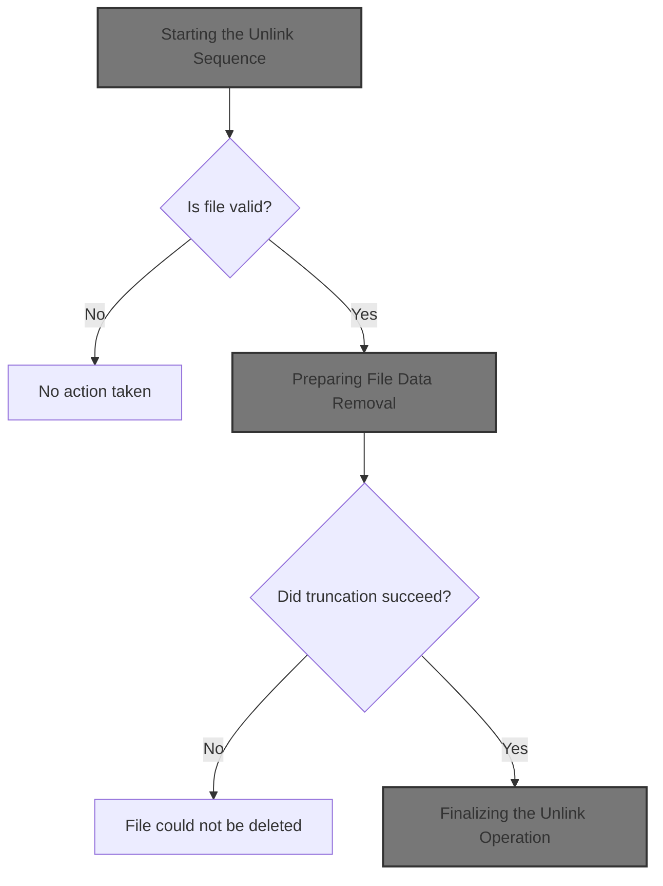

This document outlines the process for deleting a file from the filesystem. When a request to remove a file is received, the system checks if the file exists and is valid. If so, it clears the file's data and completes the deletion, ensuring that storage space is freed and the file is no longer accessible.



# Starting the Unlink Sequence

```mermaid
%%{init: {"flowchart": {"defaultRenderer": "elk"}} }%%
flowchart TD
  node1["Check if file is valid and exists"]
  click node1 openCode "src/main/io/asyncfatfs/asyncfatfs.c:2786:2790"
  node1 --> node2{"Is file valid?"}
  click node2 openCode "src/main/io/asyncfatfs/asyncfatfs.c:2790:2792"
  node2 -->|"No"| node5["No action needed, file already absent"]
  click node5 openCode "src/main/io/asyncfatfs/asyncfatfs.c:2791:2792"
  node2 -->|"Yes"| node3["Preparing File Data Removal"]
  
  node3 --> node4{"Did truncation succeed?"}
  click node4 openCode "src/main/io/asyncfatfs/asyncfatfs.c:2800:2801"
  node4 -->|"No"| node6["Cannot delete file"]
  click node6 openCode "src/main/io/asyncfatfs/asyncfatfs.c:2801:2801"
  node4 -->|"Yes"| node7["Finalizing the Unlink Operation"]
  
classDef HeadingStyle fill:#777777,stroke:#333,stroke-width:2px;
click node3 goToHeading "Preparing File Data Removal"
node3:::HeadingStyle
click node7 goToHeading "Finalizing the Unlink Operation"
node7:::HeadingStyle

%% Swimm:
%% %%{init: {"flowchart": {"defaultRenderer": "elk"}} }%%
%% flowchart TD
%%   node1["Check if file is valid and exists"]
%%   click node1 openCode "<SwmPath>[src/…/asyncfatfs/asyncfatfs.c](src/main/io/asyncfatfs/asyncfatfs.c)</SwmPath>:2786:2790"
%%   node1 --> node2{"Is file valid?"}
%%   click node2 openCode "<SwmPath>[src/…/asyncfatfs/asyncfatfs.c](src/main/io/asyncfatfs/asyncfatfs.c)</SwmPath>:2790:2792"
%%   node2 -->|"No"| node5["No action needed, file already absent"]
%%   click node5 openCode "<SwmPath>[src/…/asyncfatfs/asyncfatfs.c](src/main/io/asyncfatfs/asyncfatfs.c)</SwmPath>:2791:2792"
%%   node2 -->|"Yes"| node3["Preparing File Data Removal"]
%%   
%%   node3 --> node4{"Did truncation succeed?"}
%%   click node4 openCode "<SwmPath>[src/…/asyncfatfs/asyncfatfs.c](src/main/io/asyncfatfs/asyncfatfs.c)</SwmPath>:2800:2801"
%%   node4 -->|"No"| node6["Cannot delete file"]
%%   click node6 openCode "<SwmPath>[src/…/asyncfatfs/asyncfatfs.c](src/main/io/asyncfatfs/asyncfatfs.c)</SwmPath>:2801:2801"
%%   node4 -->|"Yes"| node7["Finalizing the Unlink Operation"]
%%   
%% classDef HeadingStyle fill:#777777,stroke:#333,stroke-width:2px;
%% click node3 goToHeading "Preparing File Data Removal"
%% node3:::HeadingStyle
%% click node7 goToHeading "Finalizing the Unlink Operation"
%% node7:::HeadingStyle
```



<SwmSnippet path="/src/main/io/asyncfatfs/asyncfatfs.c" line="2786">

---

In <SwmToken path="src/main/io/asyncfatfs/asyncfatfs.c" pos="2786:2:2" line-data="bool afatfs_funlink(afatfsFilePtr_t file, afatfsCallback_t callback)">`afatfs_funlink`</SwmToken>, we kick off the unlink process by checking if the file pointer is valid and not already unused. If it's good, we start by truncating the file, which clears out its data. This is the first step in a sequence: truncate, mark as deleted, then close. Truncation is done first to make sure no data is left hanging before we actually remove the file entry. If truncation can't start, we bail out early. The function also sets up the operation state for the rest of the unlink steps, which will run asynchronously.

```c
bool afatfs_funlink(afatfsFilePtr_t file, afatfsCallback_t callback)
{
    afatfsUnlinkFile_t *opState = &file->operation.state.unlinkFile;

    if (!file || file->type == AFATFS_FILE_TYPE_NONE) {
        return true;
    }

    /*
     * Internally an unlink is implemented by first doing a ftruncate(), marking the directory entry as deleted,
     * then doing a fclose() operation.
     */

    // Start the sub-operation of truncating the file
    if (!afatfs_ftruncate(file, NULL))
        return false;

```

---

</SwmSnippet>

## Preparing File Data Removal

```mermaid
%%{init: {"flowchart": {"defaultRenderer": "elk"}} }%%
flowchart TD
    node1["Start file truncation"] --> node2{"Is file busy?"}
    click node1 openCode "src/main/io/asyncfatfs/asyncfatfs.c:2536:2539"
    node2 -->|"Yes"| node3["Abort: Cannot truncate busy file"]
    click node2 openCode "src/main/io/asyncfatfs/asyncfatfs.c:2539:2540"
    click node3 openCode "src/main/io/asyncfatfs/asyncfatfs.c:2540:2541"
    node2 -->|"No"| node4["Set up truncation operation and callback"]
    click node4 openCode "src/main/io/asyncfatfs/asyncfatfs.c:2542:2546"
    node4 --> node5{"Is file contiguous?"}
    click node5 openCode "src/main/io/asyncfatfs/asyncfatfs.c:2551:2555"
    node5 -->|"Yes"| node6["Set end cluster to free file's first cluster"]
    click node6 openCode "src/main/io/asyncfatfs/asyncfatfs.c:2553:2554"
    node5 -->|"No"| node7["Set end cluster to zero"]
    click node7 openCode "src/main/io/asyncfatfs/asyncfatfs.c:2558:2559"
    node6 --> node8["Reset file's cluster and size to zero"]
    node7 --> node8
    click node8 openCode "src/main/io/asyncfatfs/asyncfatfs.c:2561:2564"
    node8 --> node9["Seek to beginning of file"]
    click node9 openCode "src/main/io/asyncfatfs/asyncfatfs.c:2566:2567"
    node9 --> node10["Truncation operation initiated"]
    click node10 openCode "src/main/io/asyncfatfs/asyncfatfs.c:2568:2569"
classDef HeadingStyle fill:#777777,stroke:#333,stroke-width:2px;

%% Swimm:
%% %%{init: {"flowchart": {"defaultRenderer": "elk"}} }%%
%% flowchart TD
%%     node1["Start file truncation"] --> node2{"Is file busy?"}
%%     click node1 openCode "<SwmPath>[src/…/asyncfatfs/asyncfatfs.c](src/main/io/asyncfatfs/asyncfatfs.c)</SwmPath>:2536:2539"
%%     node2 -->|"Yes"| node3["Abort: Cannot truncate busy file"]
%%     click node2 openCode "<SwmPath>[src/…/asyncfatfs/asyncfatfs.c](src/main/io/asyncfatfs/asyncfatfs.c)</SwmPath>:2539:2540"
%%     click node3 openCode "<SwmPath>[src/…/asyncfatfs/asyncfatfs.c](src/main/io/asyncfatfs/asyncfatfs.c)</SwmPath>:2540:2541"
%%     node2 -->|"No"| node4["Set up truncation operation and callback"]
%%     click node4 openCode "<SwmPath>[src/…/asyncfatfs/asyncfatfs.c](src/main/io/asyncfatfs/asyncfatfs.c)</SwmPath>:2542:2546"
%%     node4 --> node5{"Is file contiguous?"}
%%     click node5 openCode "<SwmPath>[src/…/asyncfatfs/asyncfatfs.c](src/main/io/asyncfatfs/asyncfatfs.c)</SwmPath>:2551:2555"
%%     node5 -->|"Yes"| node6["Set end cluster to free file's first cluster"]
%%     click node6 openCode "<SwmPath>[src/…/asyncfatfs/asyncfatfs.c](src/main/io/asyncfatfs/asyncfatfs.c)</SwmPath>:2553:2554"
%%     node5 -->|"No"| node7["Set end cluster to zero"]
%%     click node7 openCode "<SwmPath>[src/…/asyncfatfs/asyncfatfs.c](src/main/io/asyncfatfs/asyncfatfs.c)</SwmPath>:2558:2559"
%%     node6 --> node8["Reset file's cluster and size to zero"]
%%     node7 --> node8
%%     click node8 openCode "<SwmPath>[src/…/asyncfatfs/asyncfatfs.c](src/main/io/asyncfatfs/asyncfatfs.c)</SwmPath>:2561:2564"
%%     node8 --> node9["Seek to beginning of file"]
%%     click node9 openCode "<SwmPath>[src/…/asyncfatfs/asyncfatfs.c](src/main/io/asyncfatfs/asyncfatfs.c)</SwmPath>:2566:2567"
%%     node9 --> node10["Truncation operation initiated"]
%%     click node10 openCode "<SwmPath>[src/…/asyncfatfs/asyncfatfs.c](src/main/io/asyncfatfs/asyncfatfs.c)</SwmPath>:2568:2569"
%% classDef HeadingStyle fill:#777777,stroke:#333,stroke-width:2px;
```



<SwmSnippet path="/src/main/io/asyncfatfs/asyncfatfs.c" line="2535">

---

<SwmToken path="src/main/io/asyncfatfs/asyncfatfs.c" pos="2535:2:2" line-data="bool afatfs_ftruncate(afatfsFilePtr_t file, afatfsFileCallback_t callback)">`afatfs_ftruncate`</SwmToken> handles wiping out the file's cluster chain and resets its size fields. Right after, it calls <SwmToken path="src/main/io/asyncfatfs/asyncfatfs.c" pos="2566:1:1" line-data="    afatfs_fseek(file, 0, AFATFS_SEEK_SET);">`afatfs_fseek`</SwmToken> to move the file cursor to the start, making sure the file structure is ready for whatever comes next. This keeps the internal state consistent after the file is logically emptied.

```c
bool afatfs_ftruncate(afatfsFilePtr_t file, afatfsFileCallback_t callback)
{
    afatfsTruncateFile_t *opState;

    if (afatfs_fileIsBusy(file))
        return false;

    file->operation.operation = AFATFS_FILE_OPERATION_TRUNCATE;

    opState = &file->operation.state.truncateFile;
    opState->callback = callback;
    opState->phase = AFATFS_TRUNCATE_FILE_INITIAL;
    opState->startCluster = file->firstCluster;
    opState->currentCluster = opState->startCluster;

#ifdef AFATFS_USE_FREEFILE
    if ((file->mode & AFATFS_FILE_MODE_CONTIGUOUS) != 0) {
        // The file is contiguous and ends where the freefile begins
        opState->endCluster = afatfs.freeFile.firstCluster;
    } else
#endif
    {
        // The range of clusters to delete is not contiguous, so follow it as a linked-list instead
        opState->endCluster = 0;
    }

    // We'll drop the cluster chain from the directory entry immediately
    file->firstCluster = 0;
    file->logicalSize = 0;
    file->physicalSize = 0;

    afatfs_fseek(file, 0, AFATFS_SEEK_SET);

    return true;
}
```

---

</SwmSnippet>

## Resetting File Cursor

```mermaid
%%{init: {"flowchart": {"defaultRenderer": "elk"}} }%%
flowchart TD
  node1["Ensure file size is up to date"]
  click node1 openCode "src/main/io/asyncfatfs/asyncfatfs.c:2120:2120"
  node1 --> node2{"Reference point for seek?"}
  click node2 openCode "src/main/io/asyncfatfs/asyncfatfs.c:2122:2145"
  node2 -->|"Current position"| node3{"Offset is positive?"}
  click node3 openCode "src/main/io/asyncfatfs/asyncfatfs.c:2124:2127"
  node3 -->|"Yes"| node4["Move cursor forward, clamp to file end"]
  click node4 openCode "src/main/io/asyncfatfs/asyncfatfs.c:2126:2126"
  node3 -->|"No"| node5["Convert to seek from start (adjust offset)"]
  click node5 openCode "src/main/io/asyncfatfs/asyncfatfs.c:2130:2131"
  node2 -->|"End of file"| node6{"Already at desired position?"}
  click node6 openCode "src/main/io/asyncfatfs/asyncfatfs.c:2135:2137"
  node6 -->|"Yes"| node12["Return success"]
  click node12 openCode "src/main/io/asyncfatfs/asyncfatfs.c:2136:2137"
  node6 -->|"No"| node7["Convert to seek from start (adjust offset)"]
  click node7 openCode "src/main/io/asyncfatfs/asyncfatfs.c:2140:2141"
  node2 -->|"Start of file"| node8["Seek from start"]
  click node8 openCode "src/main/io/asyncfatfs/asyncfatfs.c:2144:2144"
  node5 --> node9["Unlock cache and reset cursor to file start"]
  click node9 openCode "src/main/io/asyncfatfs/asyncfatfs.c:2148:2152"
  node7 --> node9
  node8 --> node9
  node9 --> node10["Move cursor forward by offset, clamp to file end"]
  click node10 openCode "src/main/io/asyncfatfs/asyncfatfs.c:2155:2155"
  node4 --> node11["Return result"]
  click node11 openCode "src/main/io/asyncfatfs/asyncfatfs.c:2126:2126"
  node10 --> node11
  node12 --> node11
classDef HeadingStyle fill:#777777,stroke:#333,stroke-width:2px;

%% Swimm:
%% %%{init: {"flowchart": {"defaultRenderer": "elk"}} }%%
%% flowchart TD
%%   node1["Ensure file size is up to date"]
%%   click node1 openCode "<SwmPath>[src/…/asyncfatfs/asyncfatfs.c](src/main/io/asyncfatfs/asyncfatfs.c)</SwmPath>:2120:2120"
%%   node1 --> node2{"Reference point for seek?"}
%%   click node2 openCode "<SwmPath>[src/…/asyncfatfs/asyncfatfs.c](src/main/io/asyncfatfs/asyncfatfs.c)</SwmPath>:2122:2145"
%%   node2 -->|"Current position"| node3{"Offset is positive?"}
%%   click node3 openCode "<SwmPath>[src/…/asyncfatfs/asyncfatfs.c](src/main/io/asyncfatfs/asyncfatfs.c)</SwmPath>:2124:2127"
%%   node3 -->|"Yes"| node4["Move cursor forward, clamp to file end"]
%%   click node4 openCode "<SwmPath>[src/…/asyncfatfs/asyncfatfs.c](src/main/io/asyncfatfs/asyncfatfs.c)</SwmPath>:2126:2126"
%%   node3 -->|"No"| node5["Convert to seek from start (adjust offset)"]
%%   click node5 openCode "<SwmPath>[src/…/asyncfatfs/asyncfatfs.c](src/main/io/asyncfatfs/asyncfatfs.c)</SwmPath>:2130:2131"
%%   node2 -->|"End of file"| node6{"Already at desired position?"}
%%   click node6 openCode "<SwmPath>[src/…/asyncfatfs/asyncfatfs.c](src/main/io/asyncfatfs/asyncfatfs.c)</SwmPath>:2135:2137"
%%   node6 -->|"Yes"| node12["Return success"]
%%   click node12 openCode "<SwmPath>[src/…/asyncfatfs/asyncfatfs.c](src/main/io/asyncfatfs/asyncfatfs.c)</SwmPath>:2136:2137"
%%   node6 -->|"No"| node7["Convert to seek from start (adjust offset)"]
%%   click node7 openCode "<SwmPath>[src/…/asyncfatfs/asyncfatfs.c](src/main/io/asyncfatfs/asyncfatfs.c)</SwmPath>:2140:2141"
%%   node2 -->|"Start of file"| node8["Seek from start"]
%%   click node8 openCode "<SwmPath>[src/…/asyncfatfs/asyncfatfs.c](src/main/io/asyncfatfs/asyncfatfs.c)</SwmPath>:2144:2144"
%%   node5 --> node9["Unlock cache and reset cursor to file start"]
%%   click node9 openCode "<SwmPath>[src/…/asyncfatfs/asyncfatfs.c](src/main/io/asyncfatfs/asyncfatfs.c)</SwmPath>:2148:2152"
%%   node7 --> node9
%%   node8 --> node9
%%   node9 --> node10["Move cursor forward by offset, clamp to file end"]
%%   click node10 openCode "<SwmPath>[src/…/asyncfatfs/asyncfatfs.c](src/main/io/asyncfatfs/asyncfatfs.c)</SwmPath>:2155:2155"
%%   node4 --> node11["Return result"]
%%   click node11 openCode "<SwmPath>[src/…/asyncfatfs/asyncfatfs.c](src/main/io/asyncfatfs/asyncfatfs.c)</SwmPath>:2126:2126"
%%   node10 --> node11
%%   node12 --> node11
%% classDef HeadingStyle fill:#777777,stroke:#333,stroke-width:2px;
```



<SwmSnippet path="/src/main/io/asyncfatfs/asyncfatfs.c" line="2117">

---

<SwmToken path="src/main/io/asyncfatfs/asyncfatfs.c" pos="2117:2:2" line-data="afatfsOperationStatus_e afatfs_fseek(afatfsFilePtr_t file, int32_t offset, afatfsSeek_e whence)">`afatfs_fseek`</SwmToken> clamps and normalizes the seek, resets the cursor, and hands off to <SwmToken path="src/main/io/asyncfatfs/asyncfatfs.c" pos="2126:3:3" line-data="                return afatfs_fseekInternal(file, MIN(file-&gt;cursorOffset + offset, file-&gt;logicalSize), NULL);">`afatfs_fseekInternal`</SwmToken> to do the actual move.

```c
afatfsOperationStatus_e afatfs_fseek(afatfsFilePtr_t file, int32_t offset, afatfsSeek_e whence)
{
    // We need an up-to-date logical filesize so we can clamp seeks to the EOF
    afatfs_fileUpdateFilesize(file);

    switch (whence) {
        case AFATFS_SEEK_CUR:
            if (offset >= 0) {
                // Only forwards seeks are supported by this routine:
                return afatfs_fseekInternal(file, MIN(file->cursorOffset + offset, file->logicalSize), NULL);
            }

            // Convert a backwards relative seek into a SEEK_SET. TODO considerable room for improvement if within the same cluster
            offset += file->cursorOffset;
        break;

        case AFATFS_SEEK_END:
            // Are we already at the right position?
            if (file->logicalSize + offset == file->cursorOffset) {
                return AFATFS_OPERATION_SUCCESS;
            }

            // Convert into a SEEK_SET
            offset += file->logicalSize;
        break;

        case AFATFS_SEEK_SET:
        break;
    }

    // Now we have a SEEK_SET with a positive offset. Begin by seeking to the start of the file
    afatfs_fileUnlockCacheSector(file);

    file->cursorPreviousCluster = 0;
    file->cursorCluster = file->firstCluster;
    file->cursorOffset = 0;

    // Then seek forwards by the offset
    return afatfs_fseekInternal(file, MIN((uint32_t) offset, file->logicalSize), NULL);
}
```

---

</SwmSnippet>

## Executing the Seek Operation

```mermaid
%%{init: {"flowchart": {"defaultRenderer": "elk"}} }%%
flowchart TD
    node1{"Can file pointer be moved instantly?"}
    
    node1 -->|"Yes"| node2["Move pointer and report success"]
    click node2 openCode "src/main/io/asyncfatfs/asyncfatfs.c:2084:2088"
    node1 -->|"No"| node3{"Is file busy?"}
    click node3 openCode "src/main/io/asyncfatfs/asyncfatfs.c:2091:2091"
    node3 -->|"Yes"| node4["Report failure"]
    click node4 openCode "src/main/io/asyncfatfs/asyncfatfs.c:2092:2093"
    node3 -->|"No"| node5["Queue seek operation and report in progress"]
    click node5 openCode "src/main/io/asyncfatfs/asyncfatfs.c:2095:2101"

classDef HeadingStyle fill:#777777,stroke:#333,stroke-width:2px;
click node1 goToHeading "Fast-Path Seek Attempt"
node1:::HeadingStyle

%% Swimm:
%% %%{init: {"flowchart": {"defaultRenderer": "elk"}} }%%
%% flowchart TD
%%     node1{"Can file pointer be moved instantly?"}
%%     
%%     node1 -->|"Yes"| node2["Move pointer and report success"]
%%     click node2 openCode "<SwmPath>[src/…/asyncfatfs/asyncfatfs.c](src/main/io/asyncfatfs/asyncfatfs.c)</SwmPath>:2084:2088"
%%     node1 -->|"No"| node3{"Is file busy?"}
%%     click node3 openCode "<SwmPath>[src/…/asyncfatfs/asyncfatfs.c](src/main/io/asyncfatfs/asyncfatfs.c)</SwmPath>:2091:2091"
%%     node3 -->|"Yes"| node4["Report failure"]
%%     click node4 openCode "<SwmPath>[src/…/asyncfatfs/asyncfatfs.c](src/main/io/asyncfatfs/asyncfatfs.c)</SwmPath>:2092:2093"
%%     node3 -->|"No"| node5["Queue seek operation and report in progress"]
%%     click node5 openCode "<SwmPath>[src/…/asyncfatfs/asyncfatfs.c](src/main/io/asyncfatfs/asyncfatfs.c)</SwmPath>:2095:2101"
%% 
%% classDef HeadingStyle fill:#777777,stroke:#333,stroke-width:2px;
%% click node1 goToHeading "Fast-Path Seek Attempt"
%% node1:::HeadingStyle
```



<SwmSnippet path="/src/main/io/asyncfatfs/asyncfatfs.c" line="2080">

---

In <SwmToken path="src/main/io/asyncfatfs/asyncfatfs.c" pos="2080:4:4" line-data="static afatfsOperationStatus_e afatfs_fseekInternal(afatfsFilePtr_t file, uint32_t offset, afatfsFileCallback_t callback)">`afatfs_fseekInternal`</SwmToken>, we first try to do the seek instantly with <SwmToken path="src/main/io/asyncfatfs/asyncfatfs.c" pos="2083:4:4" line-data="    if (afatfs_fseekAtomic(file, offset)) {">`afatfs_fseekAtomic`</SwmToken>. If that works, we're done right away. If not, we fall back to queuing the operation for async handling.

```c
static afatfsOperationStatus_e afatfs_fseekInternal(afatfsFilePtr_t file, uint32_t offset, afatfsFileCallback_t callback)
{
    // See if we can seek without queuing an operation
    if (afatfs_fseekAtomic(file, offset)) {
```

---

</SwmSnippet>

### Fast-Path Seek Attempt

See <SwmLink doc-title="Seeking Within Files on FAT Storage">[Seeking Within Files on FAT Storage](/.swm/seeking-within-files-on-fat-storage.2vuzja6t.sw.md)</SwmLink>

### Handling Seek Completion or Queuing

```mermaid
%%{init: {"flowchart": {"defaultRenderer": "elk"}} }%%
flowchart TD
    node1{"Can operation proceed immediately?"}
    click node1 openCode "src/main/io/asyncfatfs/asyncfatfs.c:2084:2084"
    node1 -->|"Yes"| node2{"Is callback provided?"}
    click node2 openCode "src/main/io/asyncfatfs/asyncfatfs.c:2084:2085"
    node2 -->|"Yes"| node3["Call callback"]
    click node3 openCode "src/main/io/asyncfatfs/asyncfatfs.c:2085:2085"
    node2 -->|"No"| node4["Return SUCCESS"]
    click node4 openCode "src/main/io/asyncfatfs/asyncfatfs.c:2088:2088"
    node3 --> node4
    node1 -->|"No"| node5{"Is file busy?"}
    click node5 openCode "src/main/io/asyncfatfs/asyncfatfs.c:2091:2091"
    node5 -->|"Yes"| node6["Return FAILURE"]
    click node6 openCode "src/main/io/asyncfatfs/asyncfatfs.c:2092:2092"
    node5 -->|"No"| node7["Queue seek operation"]
    click node7 openCode "src/main/io/asyncfatfs/asyncfatfs.c:2095:2100"
    node7 --> node8["Return IN PROGRESS"]
    click node8 openCode "src/main/io/asyncfatfs/asyncfatfs.c:2101:2101"
classDef HeadingStyle fill:#777777,stroke:#333,stroke-width:2px;

%% Swimm:
%% %%{init: {"flowchart": {"defaultRenderer": "elk"}} }%%
%% flowchart TD
%%     node1{"Can operation proceed immediately?"}
%%     click node1 openCode "<SwmPath>[src/…/asyncfatfs/asyncfatfs.c](src/main/io/asyncfatfs/asyncfatfs.c)</SwmPath>:2084:2084"
%%     node1 -->|"Yes"| node2{"Is callback provided?"}
%%     click node2 openCode "<SwmPath>[src/…/asyncfatfs/asyncfatfs.c](src/main/io/asyncfatfs/asyncfatfs.c)</SwmPath>:2084:2085"
%%     node2 -->|"Yes"| node3["Call callback"]
%%     click node3 openCode "<SwmPath>[src/…/asyncfatfs/asyncfatfs.c](src/main/io/asyncfatfs/asyncfatfs.c)</SwmPath>:2085:2085"
%%     node2 -->|"No"| node4["Return SUCCESS"]
%%     click node4 openCode "<SwmPath>[src/…/asyncfatfs/asyncfatfs.c](src/main/io/asyncfatfs/asyncfatfs.c)</SwmPath>:2088:2088"
%%     node3 --> node4
%%     node1 -->|"No"| node5{"Is file busy?"}
%%     click node5 openCode "<SwmPath>[src/…/asyncfatfs/asyncfatfs.c](src/main/io/asyncfatfs/asyncfatfs.c)</SwmPath>:2091:2091"
%%     node5 -->|"Yes"| node6["Return FAILURE"]
%%     click node6 openCode "<SwmPath>[src/…/asyncfatfs/asyncfatfs.c](src/main/io/asyncfatfs/asyncfatfs.c)</SwmPath>:2092:2092"
%%     node5 -->|"No"| node7["Queue seek operation"]
%%     click node7 openCode "<SwmPath>[src/…/asyncfatfs/asyncfatfs.c](src/main/io/asyncfatfs/asyncfatfs.c)</SwmPath>:2095:2100"
%%     node7 --> node8["Return IN PROGRESS"]
%%     click node8 openCode "<SwmPath>[src/…/asyncfatfs/asyncfatfs.c](src/main/io/asyncfatfs/asyncfatfs.c)</SwmPath>:2101:2101"
%% classDef HeadingStyle fill:#777777,stroke:#333,stroke-width:2px;
```



<SwmSnippet path="/src/main/io/asyncfatfs/asyncfatfs.c" line="2084">

---

After returning from <SwmToken path="src/main/io/asyncfatfs/asyncfatfs.c" pos="2083:4:4" line-data="    if (afatfs_fseekAtomic(file, offset)) {">`afatfs_fseekAtomic`</SwmToken>, if the seek was handled, we call the callback (if set) and return success. If not, <SwmToken path="src/main/io/asyncfatfs/asyncfatfs.c" pos="2080:4:4" line-data="static afatfsOperationStatus_e afatfs_fseekInternal(afatfsFilePtr_t file, uint32_t offset, afatfsFileCallback_t callback)">`afatfs_fseekInternal`</SwmToken> sets up the async operation state and returns IN_PROGRESS, letting the caller know the seek will finish later.

```c
        if (callback) {
            callback(file);
        }

        return AFATFS_OPERATION_SUCCESS;
    } else {
        // Our operation must queue
        if (afatfs_fileIsBusy(file)) {
            return AFATFS_OPERATION_FAILURE;
        }

        afatfsSeek_t *opState = &file->operation.state.seek;

        file->operation.operation = AFATFS_FILE_OPERATION_SEEK;
        opState->callback = callback;
        opState->seekOffset = offset;

        return AFATFS_OPERATION_IN_PROGRESS;
    }
}
```

---

</SwmSnippet>

## Finalizing the Unlink Operation

<SwmSnippet path="/src/main/io/asyncfatfs/asyncfatfs.c" line="2803">

---

After returning from <SwmToken path="src/main/io/asyncfatfs/asyncfatfs.c" pos="2535:2:2" line-data="bool afatfs_ftruncate(afatfsFilePtr_t file, afatfsFileCallback_t callback)">`afatfs_ftruncate`</SwmToken>, <SwmToken path="src/main/io/asyncfatfs/asyncfatfs.c" pos="2786:2:2" line-data="bool afatfs_funlink(afatfsFilePtr_t file, afatfsCallback_t callback)">`afatfs_funlink`</SwmToken> sets up its own callback and marks the operation as UNLINK. This keeps the unlink callback from firing too early and makes sure the rest of the unlink steps (delete entry, close file) are tracked and completed before signaling done.

```c
    /*
     * The unlink operation has its own private callback field so that the truncate suboperation doesn't end up
     * calling back early when it completes:
     */
    opState->callback = callback;

    file->operation.operation = AFATFS_FILE_OPERATION_UNLINK;

    return true;
}
```

---

</SwmSnippet>

&nbsp;

*This is an auto-generated document by Swimm 🌊 and has not yet been verified by a human*

<SwmMeta version="3.0.0" repo-id="Z2l0aHViJTNBJTNBYy1iZXRhZmxpZ2h0JTNBJTNBcmljYXJkb2xvcGV6Zw==" repo-name="c-betaflight"><sup>Powered by [Swimm](https://app.swimm.io/)</sup></SwmMeta>
