This document explains how the filesystem is initialized and prepared for use. The process validates the storage layout, creates special files for free space management and logging, and finalizes the setup so the filesystem can support normal file operations.

# Filesystem Initialization State Machine

```mermaid
%%{init: {"flowchart": {"defaultRenderer": "elk"}} }%%
flowchart TD
    subgraph loop1["Repeat initialization steps until filesystem is ready"]
        node1["Begin or continue initialization phase"]
        click node1 openCode "src/main/io/asyncfatfs/asyncfatfs.c:3434:3444"
        node1 --> node2{"Is phase: Read MBR?"}
        click node2 openCode "src/main/io/asyncfatfs/asyncfatfs.c:3445:3455"
        node2 -->|"Yes"| node3{"Is MBR valid?"}
        click node3 openCode "src/main/io/asyncfatfs/asyncfatfs.c:3446:3450"
        node3 -->|"Yes"| node1
        node3 -->|"No"| node6["Set error: Bad MBR"]
        click node6 openCode "src/main/io/asyncfatfs/asyncfatfs.c:3451:3453"
        node2 -->|"No"| node4{"Is phase: Create system file?"}
        
        node4 -->|"Yes"| node5["File Creation Entry Point"]
        
        node5 --> node1
        node4 -->|"No"| node1
    end
    node1 --> node7["Free File FAT and Directory Entry Finalization"]
    
classDef HeadingStyle fill:#777777,stroke:#333,stroke-width:2px;
click node4 goToHeading "Free File Creation Progression"
node4:::HeadingStyle
click node5 goToHeading "File Creation Entry Point"
node5:::HeadingStyle
click node7 goToHeading "Free File FAT and Directory Entry Finalization"
node7:::HeadingStyle

%% Swimm:
%% %%{init: {"flowchart": {"defaultRenderer": "elk"}} }%%
%% flowchart TD
%%     subgraph loop1["Repeat initialization steps until filesystem is ready"]
%%         node1["Begin or continue initialization phase"]
%%         click node1 openCode "<SwmPath>[src/…/asyncfatfs/asyncfatfs.c](src/main/io/asyncfatfs/asyncfatfs.c)</SwmPath>:3434:3444"
%%         node1 --> node2{"Is phase: Read MBR?"}
%%         click node2 openCode "<SwmPath>[src/…/asyncfatfs/asyncfatfs.c](src/main/io/asyncfatfs/asyncfatfs.c)</SwmPath>:3445:3455"
%%         node2 -->|"Yes"| node3{"Is MBR valid?"}
%%         click node3 openCode "<SwmPath>[src/…/asyncfatfs/asyncfatfs.c](src/main/io/asyncfatfs/asyncfatfs.c)</SwmPath>:3446:3450"
%%         node3 -->|"Yes"| node1
%%         node3 -->|"No"| node6["Set error: Bad MBR"]
%%         click node6 openCode "<SwmPath>[src/…/asyncfatfs/asyncfatfs.c](src/main/io/asyncfatfs/asyncfatfs.c)</SwmPath>:3451:3453"
%%         node2 -->|"No"| node4{"Is phase: Create system file?"}
%%         
%%         node4 -->|"Yes"| node5["File Creation Entry Point"]
%%         
%%         node5 --> node1
%%         node4 -->|"No"| node1
%%     end
%%     node1 --> node7["Free File FAT and Directory Entry Finalization"]
%%     
%% classDef HeadingStyle fill:#777777,stroke:#333,stroke-width:2px;
%% click node4 goToHeading "Free File Creation Progression"
%% node4:::HeadingStyle
%% click node5 goToHeading "File Creation Entry Point"
%% node5:::HeadingStyle
%% click node7 goToHeading "Free File FAT and Directory Entry Finalization"
%% node7:::HeadingStyle
```



<SwmSnippet path="/src/main/io/asyncfatfs/asyncfatfs.c" line="3434">

---

In <SwmToken path="src/main/io/asyncfatfs/asyncfatfs.c" pos="3434:4:4" line-data="static void afatfs_initContinue(void)">`afatfs_initContinue`</SwmToken>, we step through each init phase, and when it's time to handle free space, we call <SwmToken path="src/main/io/asyncfatfs/asyncfatfs.c" pos="3474:1:1" line-data="            afatfs_createFile(&amp;afatfs.freeFile, AFATFS_FREESPACE_FILENAME, FAT_FILE_ATTRIBUTE_SYSTEM | FAT_FILE_ATTRIBUTE_READ_ONLY,">`afatfs_createFile`</SwmToken> to set up the free file so the FS can manage free blocks efficiently.

```c
static void afatfs_initContinue(void)
{
#ifdef AFATFS_USE_FREEFILE
    afatfsOperationStatus_e status;
#endif

    uint8_t *sector;

    doMore:

    switch (afatfs.initPhase) {
        case AFATFS_INITIALIZATION_READ_MBR:
            if (afatfs_cacheSector(0, &sector, AFATFS_CACHE_READ | AFATFS_CACHE_DISCARDABLE, 0) == AFATFS_OPERATION_SUCCESS) {
                if (afatfs_parseMBR(sector)) {
                    afatfs.initPhase = AFATFS_INITIALIZATION_READ_VOLUME_ID;
                    goto doMore;
                } else {
                    afatfs.lastError = AFATFS_ERROR_BAD_MBR;
                    afatfs.filesystemState = AFATFS_FILESYSTEM_STATE_FATAL;
                }
            }
        break;
        case AFATFS_INITIALIZATION_READ_VOLUME_ID:
            if (afatfs_cacheSector(afatfs.partitionStartSector, &sector, AFATFS_CACHE_READ | AFATFS_CACHE_DISCARDABLE, 0) == AFATFS_OPERATION_SUCCESS) {
                if (afatfs_parseVolumeID(sector)) {
                    // Open the root directory
                    afatfs_chdir(NULL);

                    afatfs.initPhase++;
                } else {
                    afatfs.lastError = AFATFS_ERROR_BAD_FILESYSTEM_HEADER;
                    afatfs.filesystemState = AFATFS_FILESYSTEM_STATE_FATAL;
                }
            }
        break;

#ifdef AFATFS_USE_FREEFILE
        case AFATFS_INITIALIZATION_FREEFILE_CREATE:
            afatfs.initPhase = AFATFS_INITIALIZATION_FREEFILE_CREATING;

            afatfs_createFile(&afatfs.freeFile, AFATFS_FREESPACE_FILENAME, FAT_FILE_ATTRIBUTE_SYSTEM | FAT_FILE_ATTRIBUTE_READ_ONLY,
                AFATFS_FILE_MODE_CREATE | AFATFS_FILE_MODE_RETAIN_DIRECTORY, afatfs_freeFileCreated);
        break;
```

---

</SwmSnippet>

## File Creation Entry Point

```mermaid
%%{init: {"flowchart": {"defaultRenderer": "elk"}} }%%
flowchart TD
  node1["Begin file or directory creation"] --> node2{"Is name '.' (current directory)?"}
  click node1 openCode "src/main/io/asyncfatfs/asyncfatfs.c:2826:2829"
  node2 -->|"Yes"| node3["Copy directory properties to new entry"]
  click node2 openCode "src/main/io/asyncfatfs/asyncfatfs.c:2836:2842"
  click node3 openCode "src/main/io/asyncfatfs/asyncfatfs.c:2836:2842"
  node2 -->|"No"| node4["Convert name to filesystem format"]
  click node4 openCode "src/main/io/asyncfatfs/asyncfatfs.c:2843:2844"
  node4 --> node5{"Is entry a directory?"}
  click node5 openCode "src/main/io/asyncfatfs/asyncfatfs.c:2846:2850"
  node5 -->|"Yes"| node6["Set entry type to directory"]
  click node6 openCode "src/main/io/asyncfatfs/asyncfatfs.c:2847:2848"
  node5 -->|"No"| node7["Set entry type to normal file"]
  click node7 openCode "src/main/io/asyncfatfs/asyncfatfs.c:2849:2850"
  node3 --> node8["Prepare for next creation step"]
  node6 --> node8
  node7 --> node8
  click node8 openCode "src/main/io/asyncfatfs/asyncfatfs.c:2853:2860"
  node8 --> node9["Continue file creation"]
  click node9 openCode "src/main/io/asyncfatfs/asyncfatfs.c:2862:2862"
  node9 --> node10["Return file handle"]
  click node10 openCode "src/main/io/asyncfatfs/asyncfatfs.c:2864:2865"

classDef HeadingStyle fill:#777777,stroke:#333,stroke-width:2px;

%% Swimm:
%% %%{init: {"flowchart": {"defaultRenderer": "elk"}} }%%
%% flowchart TD
%%   node1["Begin file or directory creation"] --> node2{"Is name '.' (current directory)?"}
%%   click node1 openCode "<SwmPath>[src/…/asyncfatfs/asyncfatfs.c](src/main/io/asyncfatfs/asyncfatfs.c)</SwmPath>:2826:2829"
%%   node2 -->|"Yes"| node3["Copy directory properties to new entry"]
%%   click node2 openCode "<SwmPath>[src/…/asyncfatfs/asyncfatfs.c](src/main/io/asyncfatfs/asyncfatfs.c)</SwmPath>:2836:2842"
%%   click node3 openCode "<SwmPath>[src/…/asyncfatfs/asyncfatfs.c](src/main/io/asyncfatfs/asyncfatfs.c)</SwmPath>:2836:2842"
%%   node2 -->|"No"| node4["Convert name to filesystem format"]
%%   click node4 openCode "<SwmPath>[src/…/asyncfatfs/asyncfatfs.c](src/main/io/asyncfatfs/asyncfatfs.c)</SwmPath>:2843:2844"
%%   node4 --> node5{"Is entry a directory?"}
%%   click node5 openCode "<SwmPath>[src/…/asyncfatfs/asyncfatfs.c](src/main/io/asyncfatfs/asyncfatfs.c)</SwmPath>:2846:2850"
%%   node5 -->|"Yes"| node6["Set entry type to directory"]
%%   click node6 openCode "<SwmPath>[src/…/asyncfatfs/asyncfatfs.c](src/main/io/asyncfatfs/asyncfatfs.c)</SwmPath>:2847:2848"
%%   node5 -->|"No"| node7["Set entry type to normal file"]
%%   click node7 openCode "<SwmPath>[src/…/asyncfatfs/asyncfatfs.c](src/main/io/asyncfatfs/asyncfatfs.c)</SwmPath>:2849:2850"
%%   node3 --> node8["Prepare for next creation step"]
%%   node6 --> node8
%%   node7 --> node8
%%   click node8 openCode "<SwmPath>[src/…/asyncfatfs/asyncfatfs.c](src/main/io/asyncfatfs/asyncfatfs.c)</SwmPath>:2853:2860"
%%   node8 --> node9["Continue file creation"]
%%   click node9 openCode "<SwmPath>[src/…/asyncfatfs/asyncfatfs.c](src/main/io/asyncfatfs/asyncfatfs.c)</SwmPath>:2862:2862"
%%   node9 --> node10["Return file handle"]
%%   click node10 openCode "<SwmPath>[src/…/asyncfatfs/asyncfatfs.c](src/main/io/asyncfatfs/asyncfatfs.c)</SwmPath>:2864:2865"
%% 
%% classDef HeadingStyle fill:#777777,stroke:#333,stroke-width:2px;
```



<SwmSnippet path="/src/main/io/asyncfatfs/asyncfatfs.c" line="2824">

---

<SwmToken path="src/main/io/asyncfatfs/asyncfatfs.c" pos="2824:4:4" line-data="static afatfsFilePtr_t afatfs_createFile(afatfsFilePtr_t file, const char *name, uint8_t attrib, uint8_t fileMode,">`afatfs_createFile`</SwmToken> sets up the file struct for creation, handling the "." case by just copying the current directory's info. For other names, it converts the filename to FAT format, sets attributes, and determines if it's a file or directory. It then sets the operation phase and immediately calls <SwmToken path="src/main/io/asyncfatfs/asyncfatfs.c" pos="2862:1:1" line-data="    afatfs_createFileContinue(file);">`afatfs_createFileContinue`</SwmToken> to actually do the work, since the creation process might need multiple steps.

```c
static afatfsFilePtr_t afatfs_createFile(afatfsFilePtr_t file, const char *name, uint8_t attrib, uint8_t fileMode,
        afatfsFileCallback_t callback)
{
    afatfsCreateFile_t *opState = &file->operation.state.createFile;

    afatfs_initFileHandle(file);

    // Queue the operation to finish the file creation
    file->operation.operation = AFATFS_FILE_OPERATION_CREATE_FILE;

    file->mode = fileMode;

    if (strcmp(name, ".") == 0) {
        file->firstCluster = afatfs.currentDirectory.firstCluster;
        file->physicalSize = afatfs.currentDirectory.physicalSize;
        file->logicalSize = afatfs.currentDirectory.logicalSize;
        file->attrib = afatfs.currentDirectory.attrib;
        file->type = afatfs.currentDirectory.type;
    } else {
        fat_convertFilenameToFATStyle(name, opState->filename);
        file->attrib = attrib;

        if ((attrib & FAT_FILE_ATTRIBUTE_DIRECTORY) != 0) {
            file->type = AFATFS_FILE_TYPE_DIRECTORY;
        } else {
            file->type = AFATFS_FILE_TYPE_NORMAL;
        }
    }

    opState->callback = callback;

    if (strcmp(name, ".") == 0) {
        // Since we already have the directory entry details, we can skip straight to the final operations requried
        opState->phase = AFATFS_CREATEFILE_PHASE_SUCCESS;
    } else {
        opState->phase = AFATFS_CREATEFILE_PHASE_INITIAL;
    }

    afatfs_createFileContinue(file);

    return file;
}
```

---

</SwmSnippet>

## File Creation State Machine

```mermaid
%%{init: {"flowchart": {"defaultRenderer": "elk"}} }%%
flowchart TD
    node1["Begin file creation"] --> node2["Start directory search"]
    click node1 openCode "src/main/io/asyncfatfs/asyncfatfs.c:2582:2590"
    click node2 openCode "src/main/io/asyncfatfs/asyncfatfs.c:2591:2596"
    
    subgraph loop1["While searching directory entries"]
        node2 --> node3{"Is there a matching file?"}
        click node3 openCode "src/main/io/asyncfatfs/asyncfatfs.c:2597:2636"
        node3 -->|"Yes"| node4{"Is file type compatible?"}
        click node4 openCode "src/main/io/asyncfatfs/asyncfatfs.c:2624:2628"
        node4 -->|"Yes"| node5["Finalize file open"]
        click node5 openCode "src/main/io/asyncfatfs/asyncfatfs.c:2630:2635"
        node4 -->|"No"| node6["Fail operation: Type mismatch"]
        click node6 openCode "src/main/io/asyncfatfs/asyncfatfs.c:2625:2628"
        node3 -->|"No"| node7{"End of directory reached?"}
        click node7 openCode "src/main/io/asyncfatfs/asyncfatfs.c:2603:2618"
        node7 -->|"Yes"| node8{"Create new file requested?"}
        click node8 openCode "src/main/io/asyncfatfs/asyncfatfs.c:2606:2612"
        node8 -->|"Yes"| node9["Allocate new directory entry and set attributes"]
        click node9 openCode "src/main/io/asyncfatfs/asyncfatfs.c:2648:2683"
        node9 --> node10{"Allocation successful?"}
        click node10 openCode "src/main/io/asyncfatfs/asyncfatfs.c:2651:2687"
        node10 -->|"Yes"| node5
        node10 -->|"No"| node6
        node8 -->|"No"| node6
        node7 -->|"No"| node2
    end
    node5 --> node11{"File mode: Append or Write?"}
    click node11 openCode "src/main/io/asyncfatfs/asyncfatfs.c:2730:2743"
    node11 -->|"Append"| node12["Seek to end of file"]
    click node12 openCode "src/main/io/asyncfatfs/asyncfatfs.c:2732:2734"
    node11 -->|"Write"| node13["Truncate file"]
    click node13 openCode "src/main/io/asyncfatfs/asyncfatfs.c:2738:2742"
    node11 -->|"Other"| node14["Complete operation"]
    click node14 openCode "src/main/io/asyncfatfs/asyncfatfs.c:2746:2747"
    node12 --> node14
    node13 --> node14
    node14 --> node15["Invoke success callback"]
    click node15 openCode "src/main/io/asyncfatfs/asyncfatfs.c:2747:2748"
    node6 --> node16["Invoke failure callback"]
    click node16 openCode "src/main/io/asyncfatfs/asyncfatfs.c:2750:2752"

classDef HeadingStyle fill:#777777,stroke:#333,stroke-width:2px;

%% Swimm:
%% %%{init: {"flowchart": {"defaultRenderer": "elk"}} }%%
%% flowchart TD
%%     node1["Begin file creation"] --> node2["Start directory search"]
%%     click node1 openCode "<SwmPath>[src/…/asyncfatfs/asyncfatfs.c](src/main/io/asyncfatfs/asyncfatfs.c)</SwmPath>:2582:2590"
%%     click node2 openCode "<SwmPath>[src/…/asyncfatfs/asyncfatfs.c](src/main/io/asyncfatfs/asyncfatfs.c)</SwmPath>:2591:2596"
%%     
%%     subgraph loop1["While searching directory entries"]
%%         node2 --> node3{"Is there a matching file?"}
%%         click node3 openCode "<SwmPath>[src/…/asyncfatfs/asyncfatfs.c](src/main/io/asyncfatfs/asyncfatfs.c)</SwmPath>:2597:2636"
%%         node3 -->|"Yes"| node4{"Is file type compatible?"}
%%         click node4 openCode "<SwmPath>[src/…/asyncfatfs/asyncfatfs.c](src/main/io/asyncfatfs/asyncfatfs.c)</SwmPath>:2624:2628"
%%         node4 -->|"Yes"| node5["Finalize file open"]
%%         click node5 openCode "<SwmPath>[src/…/asyncfatfs/asyncfatfs.c](src/main/io/asyncfatfs/asyncfatfs.c)</SwmPath>:2630:2635"
%%         node4 -->|"No"| node6["Fail operation: Type mismatch"]
%%         click node6 openCode "<SwmPath>[src/…/asyncfatfs/asyncfatfs.c](src/main/io/asyncfatfs/asyncfatfs.c)</SwmPath>:2625:2628"
%%         node3 -->|"No"| node7{"End of directory reached?"}
%%         click node7 openCode "<SwmPath>[src/…/asyncfatfs/asyncfatfs.c](src/main/io/asyncfatfs/asyncfatfs.c)</SwmPath>:2603:2618"
%%         node7 -->|"Yes"| node8{"Create new file requested?"}
%%         click node8 openCode "<SwmPath>[src/…/asyncfatfs/asyncfatfs.c](src/main/io/asyncfatfs/asyncfatfs.c)</SwmPath>:2606:2612"
%%         node8 -->|"Yes"| node9["Allocate new directory entry and set attributes"]
%%         click node9 openCode "<SwmPath>[src/…/asyncfatfs/asyncfatfs.c](src/main/io/asyncfatfs/asyncfatfs.c)</SwmPath>:2648:2683"
%%         node9 --> node10{"Allocation successful?"}
%%         click node10 openCode "<SwmPath>[src/…/asyncfatfs/asyncfatfs.c](src/main/io/asyncfatfs/asyncfatfs.c)</SwmPath>:2651:2687"
%%         node10 -->|"Yes"| node5
%%         node10 -->|"No"| node6
%%         node8 -->|"No"| node6
%%         node7 -->|"No"| node2
%%     end
%%     node5 --> node11{"File mode: Append or Write?"}
%%     click node11 openCode "<SwmPath>[src/…/asyncfatfs/asyncfatfs.c](src/main/io/asyncfatfs/asyncfatfs.c)</SwmPath>:2730:2743"
%%     node11 -->|"Append"| node12["Seek to end of file"]
%%     click node12 openCode "<SwmPath>[src/…/asyncfatfs/asyncfatfs.c](src/main/io/asyncfatfs/asyncfatfs.c)</SwmPath>:2732:2734"
%%     node11 -->|"Write"| node13["Truncate file"]
%%     click node13 openCode "<SwmPath>[src/…/asyncfatfs/asyncfatfs.c](src/main/io/asyncfatfs/asyncfatfs.c)</SwmPath>:2738:2742"
%%     node11 -->|"Other"| node14["Complete operation"]
%%     click node14 openCode "<SwmPath>[src/…/asyncfatfs/asyncfatfs.c](src/main/io/asyncfatfs/asyncfatfs.c)</SwmPath>:2746:2747"
%%     node12 --> node14
%%     node13 --> node14
%%     node14 --> node15["Invoke success callback"]
%%     click node15 openCode "<SwmPath>[src/…/asyncfatfs/asyncfatfs.c](src/main/io/asyncfatfs/asyncfatfs.c)</SwmPath>:2747:2748"
%%     node6 --> node16["Invoke failure callback"]
%%     click node16 openCode "<SwmPath>[src/…/asyncfatfs/asyncfatfs.c](src/main/io/asyncfatfs/asyncfatfs.c)</SwmPath>:2750:2752"
%% 
%% classDef HeadingStyle fill:#777777,stroke:#333,stroke-width:2px;
```



<SwmSnippet path="/src/main/io/asyncfatfs/asyncfatfs.c" line="2582">

---

In <SwmToken path="src/main/io/asyncfatfs/asyncfatfs.c" pos="2582:4:4" line-data="static void afatfs_createFileContinue(afatfsFile_t *file)">`afatfs_createFileContinue`</SwmToken>, we run a state machine for file creation. It starts by searching for the file in the directory. If found, it loads the entry; if not, and creation is allowed, it allocates a new entry. If neither, it fails. The state machine lets us handle all these cases and async steps cleanly.

```c
static void afatfs_createFileContinue(afatfsFile_t *file)
{
    afatfsCreateFile_t *opState = &file->operation.state.createFile;
    fatDirectoryEntry_t *entry;
    afatfsOperationStatus_e status;

    doMore:

    switch (opState->phase) {
        case AFATFS_CREATEFILE_PHASE_INITIAL:
            afatfs_findFirst(&afatfs.currentDirectory, &file->directoryEntryPos);
            opState->phase = AFATFS_CREATEFILE_PHASE_FIND_FILE;
            goto doMore;
        break;
        case AFATFS_CREATEFILE_PHASE_FIND_FILE:
            do {
                status = afatfs_findNext(&afatfs.currentDirectory, &file->directoryEntryPos, &entry);

                switch (status) {
                    case AFATFS_OPERATION_SUCCESS:
                        // Is this the last entry in the directory?
                        if (entry == NULL || fat_isDirectoryEntryTerminator(entry)) {
                            afatfs_findLast(&afatfs.currentDirectory);

                            if ((file->mode & AFATFS_FILE_MODE_CREATE) != 0) {
                                // The file didn't already exist, so we can create it. Allocate a new directory entry
                                afatfs_findFirst(&afatfs.currentDirectory, &file->directoryEntryPos);

                                opState->phase = AFATFS_CREATEFILE_PHASE_CREATE_NEW_FILE;
                                goto doMore;
                            } else {
                                // File not found.

                                opState->phase = AFATFS_CREATEFILE_PHASE_FAILURE;
                                goto doMore;
                            }
                        } else if (entry->attrib & FAT_FILE_ATTRIBUTE_VOLUME_ID) {
                            break;
                        } else if (strncmp(entry->filename, (char*) opState->filename, FAT_FILENAME_LENGTH) == 0) {
                            // We found a file or directory with this name!

                            // Do not open file as dir or dir as file
                            if (((entry->attrib ^ file->attrib) & FAT_FILE_ATTRIBUTE_DIRECTORY) != 0) {
                                afatfs_findLast(&afatfs.currentDirectory);
                                opState->phase = AFATFS_CREATEFILE_PHASE_FAILURE;
                                goto doMore;
                            }

                            afatfs_fileLoadDirectoryEntry(file, entry);

                            afatfs_findLast(&afatfs.currentDirectory);

                            opState->phase = AFATFS_CREATEFILE_PHASE_SUCCESS;
                            goto doMore;
                        } // Else this entry doesn't match, fall through and continue the search
                    break;
                    case AFATFS_OPERATION_FAILURE:
                        afatfs_findLast(&afatfs.currentDirectory);
                        opState->phase = AFATFS_CREATEFILE_PHASE_FAILURE;
                        goto doMore;
                    break;
                    case AFATFS_OPERATION_IN_PROGRESS:
                        ;
                }
            } while (status == AFATFS_OPERATION_SUCCESS);
```

---

</SwmSnippet>

<SwmSnippet path="/src/main/io/asyncfatfs/asyncfatfs.c" line="2648">

---

After creating or opening the file, <SwmToken path="src/main/io/asyncfatfs/asyncfatfs.c" pos="2582:4:4" line-data="static void afatfs_createFileContinue(afatfsFile_t *file)">`afatfs_createFileContinue`</SwmToken> handles any special file modes (like caching the dir entry, locking the free file, seeking for append, or truncating for write). It then calls the callback to finish up, or signals failure if something went wrong.

```c
        case AFATFS_CREATEFILE_PHASE_CREATE_NEW_FILE:
            status = afatfs_allocateDirectoryEntry(&afatfs.currentDirectory, &entry, &file->directoryEntryPos);

            if (status == AFATFS_OPERATION_SUCCESS) {
                memset(entry, 0, sizeof(*entry));

                memcpy(entry->filename, opState->filename, FAT_FILENAME_LENGTH);
                entry->attrib = file->attrib;

                uint16_t fileDate = AFATFS_DEFAULT_FILE_DATE;
                uint16_t fileTime = AFATFS_DEFAULT_FILE_TIME;

                #ifdef USE_RTC_TIME
                // rtcGetDateTime will fill dt with 0000-01-01T00:00:00
                // when time is not known.
                dateTime_t dt, local_dt;
                rtcGetDateTime(&dt);
                if (dt.year != 0) {
                    // By tradition, FAT filesystem timestamps use local time.
                    dateTimeUTCToLocal(&dt, &local_dt);
                    fileDate = FAT_MAKE_DATE(local_dt.year, local_dt.month, local_dt.day);
                    fileTime = FAT_MAKE_TIME(local_dt.hours, local_dt.minutes, local_dt.seconds);
                }
                #endif

                entry->creationDate = fileDate;
                entry->creationTime = fileTime;
                entry->lastWriteDate = fileDate;
                entry->lastWriteTime = fileTime;

#ifdef AFATFS_DEBUG_VERBOSE
                fprintf(stderr, "Adding directory entry for %.*s to sector %u\n", FAT_FILENAME_LENGTH, opState->filename, file->directoryEntryPos.sectorNumberPhysical);
#endif

                opState->phase = AFATFS_CREATEFILE_PHASE_SUCCESS;
                goto doMore;
            } else if (status == AFATFS_OPERATION_FAILURE) {
                opState->phase = AFATFS_CREATEFILE_PHASE_FAILURE;
                goto doMore;
            }
        break;
        case AFATFS_CREATEFILE_PHASE_SUCCESS:
            if ((file->mode & AFATFS_FILE_MODE_RETAIN_DIRECTORY) != 0) {
                /*
                 * For this high performance file type, we require the directory entry for the file to be retained
                 * in the cache at all times.
                 */
                uint8_t *directorySector;

                status = afatfs_cacheSector(
                    file->directoryEntryPos.sectorNumberPhysical,
                    &directorySector,
                    AFATFS_CACHE_READ | AFATFS_CACHE_RETAIN,
                    0
                );

                if (status != AFATFS_OPERATION_SUCCESS) {
                    // Retry next time
                    break;
                }
            }

            afatfs_fseek(file, 0, AFATFS_SEEK_SET);

            // Is file empty?
            if (file->cursorCluster == 0) {
#ifdef AFATFS_USE_FREEFILE
                if ((file->mode & AFATFS_FILE_MODE_CONTIGUOUS) != 0) {
                    if (afatfs_fileIsBusy(&afatfs.freeFile)) {
                        // Someone else's using the freefile, come back later.
                        break;
                    } else {
                        // Lock the freefile for our exclusive access
                        afatfs.freeFile.operation.operation = AFATFS_FILE_OPERATION_LOCKED;
                    }
                }
#endif
            } else {
                // We can't guarantee that the existing file contents are contiguous
                file->mode &= ~AFATFS_FILE_MODE_CONTIGUOUS;

                // Seek to the end of the file if it is in append mode
                if ((file->mode & AFATFS_FILE_MODE_APPEND) != 0) {
                    // This replaces our open file operation
                    file->operation.operation = AFATFS_FILE_OPERATION_NONE;
                    afatfs_fseekInternal(file, file->logicalSize, opState->callback);
                    break;
                }

                // If we're only writing (not reading) the file must be truncated
                if (file->mode == (AFATFS_FILE_MODE_CREATE | AFATFS_FILE_MODE_WRITE)) {
                    // This replaces our open file operation
                    file->operation.operation = AFATFS_FILE_OPERATION_NONE;
                    afatfs_ftruncate(file, opState->callback);
                    break;
                }
            }

            file->operation.operation = AFATFS_FILE_OPERATION_NONE;
            opState->callback(file);
        break;
        case AFATFS_CREATEFILE_PHASE_FAILURE:
            file->type = AFATFS_FILE_TYPE_NONE;
            opState->callback(NULL);
        break;
    }
}
```

---

</SwmSnippet>

## Free File Creation Progression

<SwmSnippet path="/src/main/io/asyncfatfs/asyncfatfs.c" line="3477">

---

Back in <SwmToken path="src/main/io/asyncfatfs/asyncfatfs.c" pos="3434:4:4" line-data="static void afatfs_initContinue(void)">`afatfs_initContinue`</SwmToken>, after setting up the free file with <SwmToken path="src/main/io/asyncfatfs/asyncfatfs.c" pos="2824:4:4" line-data="static afatfsFilePtr_t afatfs_createFile(afatfsFilePtr_t file, const char *name, uint8_t attrib, uint8_t fileMode,">`afatfs_createFile`</SwmToken>, we immediately call <SwmToken path="src/main/io/asyncfatfs/asyncfatfs.c" pos="3478:1:1" line-data="            afatfs_fileOperationContinue(&amp;afatfs.freeFile);">`afatfs_fileOperationContinue`</SwmToken> to actually process the file operation. This is needed because the creation is staged and may require multiple steps to finish.

```c
        case AFATFS_INITIALIZATION_FREEFILE_CREATING:
            afatfs_fileOperationContinue(&afatfs.freeFile);
        break;
```

---

</SwmSnippet>

## File Operation Dispatcher

```mermaid
%%{init: {"flowchart": {"defaultRenderer": "elk"}} }%%
flowchart TD
    node1{"Is file type valid?"}
    click node1 openCode "src/main/io/asyncfatfs/asyncfatfs.c:3242:3243"
    node1 -->|"No"| node2["No further action"]
    click node2 openCode "src/main/io/asyncfatfs/asyncfatfs.c:3243:3243"
    node1 -->|"Yes"| node3{"What is the pending file operation?"}
    click node3 openCode "src/main/io/asyncfatfs/asyncfatfs.c:3245:3278"
    node3 -->|"Create file"| node4["Continue file creation"]
    click node4 openCode "src/main/io/asyncfatfs/asyncfatfs.c:3247:3247"
    node3 -->|"Seek"| node5["Continue seek operation"]
    click node5 openCode "src/main/io/asyncfatfs/asyncfatfs.c:3250:3250"
    node3 -->|"Close"| node6["Continue close operation"]
    click node6 openCode "src/main/io/asyncfatfs/asyncfatfs.c:3253:3253"
    node3 -->|"Unlink"| node7["Continue unlink operation"]
    click node7 openCode "src/main/io/asyncfatfs/asyncfatfs.c:3256:3256"
    node3 -->|"Truncate"| node8["Continue truncate operation"]
    click node8 openCode "src/main/io/asyncfatfs/asyncfatfs.c:3259:3259"
    node3 -->|"Append supercluster (if enabled)"| node9["Continue append supercluster"]
    click node9 openCode "src/main/io/asyncfatfs/asyncfatfs.c:3263:3263"
    node3 -->|"Append free cluster"| node10["Continue append free cluster"]
    click node10 openCode "src/main/io/asyncfatfs/asyncfatfs.c:3270:3270"
    node3 -->|"Extend subdirectory"| node11["Continue extend subdirectory"]
    click node11 openCode "src/main/io/asyncfatfs/asyncfatfs.c:3273:3273"
    node3 -->|"None/Locked"| node12["No further action"]
    click node12 openCode "src/main/io/asyncfatfs/asyncfatfs.c:3266:3267"

classDef HeadingStyle fill:#777777,stroke:#333,stroke-width:2px;

%% Swimm:
%% %%{init: {"flowchart": {"defaultRenderer": "elk"}} }%%
%% flowchart TD
%%     node1{"Is file type valid?"}
%%     click node1 openCode "<SwmPath>[src/…/asyncfatfs/asyncfatfs.c](src/main/io/asyncfatfs/asyncfatfs.c)</SwmPath>:3242:3243"
%%     node1 -->|"No"| node2["No further action"]
%%     click node2 openCode "<SwmPath>[src/…/asyncfatfs/asyncfatfs.c](src/main/io/asyncfatfs/asyncfatfs.c)</SwmPath>:3243:3243"
%%     node1 -->|"Yes"| node3{"What is the pending file operation?"}
%%     click node3 openCode "<SwmPath>[src/…/asyncfatfs/asyncfatfs.c](src/main/io/asyncfatfs/asyncfatfs.c)</SwmPath>:3245:3278"
%%     node3 -->|"Create file"| node4["Continue file creation"]
%%     click node4 openCode "<SwmPath>[src/…/asyncfatfs/asyncfatfs.c](src/main/io/asyncfatfs/asyncfatfs.c)</SwmPath>:3247:3247"
%%     node3 -->|"Seek"| node5["Continue seek operation"]
%%     click node5 openCode "<SwmPath>[src/…/asyncfatfs/asyncfatfs.c](src/main/io/asyncfatfs/asyncfatfs.c)</SwmPath>:3250:3250"
%%     node3 -->|"Close"| node6["Continue close operation"]
%%     click node6 openCode "<SwmPath>[src/…/asyncfatfs/asyncfatfs.c](src/main/io/asyncfatfs/asyncfatfs.c)</SwmPath>:3253:3253"
%%     node3 -->|"Unlink"| node7["Continue unlink operation"]
%%     click node7 openCode "<SwmPath>[src/…/asyncfatfs/asyncfatfs.c](src/main/io/asyncfatfs/asyncfatfs.c)</SwmPath>:3256:3256"
%%     node3 -->|"Truncate"| node8["Continue truncate operation"]
%%     click node8 openCode "<SwmPath>[src/…/asyncfatfs/asyncfatfs.c](src/main/io/asyncfatfs/asyncfatfs.c)</SwmPath>:3259:3259"
%%     node3 -->|"Append supercluster (if enabled)"| node9["Continue append supercluster"]
%%     click node9 openCode "<SwmPath>[src/…/asyncfatfs/asyncfatfs.c](src/main/io/asyncfatfs/asyncfatfs.c)</SwmPath>:3263:3263"
%%     node3 -->|"Append free cluster"| node10["Continue append free cluster"]
%%     click node10 openCode "<SwmPath>[src/…/asyncfatfs/asyncfatfs.c](src/main/io/asyncfatfs/asyncfatfs.c)</SwmPath>:3270:3270"
%%     node3 -->|"Extend subdirectory"| node11["Continue extend subdirectory"]
%%     click node11 openCode "<SwmPath>[src/…/asyncfatfs/asyncfatfs.c](src/main/io/asyncfatfs/asyncfatfs.c)</SwmPath>:3273:3273"
%%     node3 -->|"None/Locked"| node12["No further action"]
%%     click node12 openCode "<SwmPath>[src/…/asyncfatfs/asyncfatfs.c](src/main/io/asyncfatfs/asyncfatfs.c)</SwmPath>:3266:3267"
%% 
%% classDef HeadingStyle fill:#777777,stroke:#333,stroke-width:2px;
```



<SwmSnippet path="/src/main/io/asyncfatfs/asyncfatfs.c" line="3240">

---

In <SwmToken path="src/main/io/asyncfatfs/asyncfatfs.c" pos="3240:4:4" line-data="static void afatfs_fileOperationContinue(afatfsFile_t *file)">`afatfs_fileOperationContinue`</SwmToken>, we check the file's current operation and dispatch to the right handler. If we're creating a file, we call <SwmToken path="src/main/io/asyncfatfs/asyncfatfs.c" pos="3247:1:1" line-data="            afatfs_createFileContinue(file);">`afatfs_createFileContinue`</SwmToken> to keep the creation process moving.

```c
static void afatfs_fileOperationContinue(afatfsFile_t *file)
{
    if (file->type == AFATFS_FILE_TYPE_NONE)
        return;

    switch (file->operation.operation) {
        case AFATFS_FILE_OPERATION_CREATE_FILE:
            afatfs_createFileContinue(file);
        break;
```

---

</SwmSnippet>

<SwmSnippet path="/src/main/io/asyncfatfs/asyncfatfs.c" line="3249">

---

After <SwmToken path="src/main/io/asyncfatfs/asyncfatfs.c" pos="2582:4:4" line-data="static void afatfs_createFileContinue(afatfsFile_t *file)">`afatfs_createFileContinue`</SwmToken> runs, <SwmToken path="src/main/io/asyncfatfs/asyncfatfs.c" pos="3240:4:4" line-data="static void afatfs_fileOperationContinue(afatfsFile_t *file)">`afatfs_fileOperationContinue`</SwmToken> just checks for other possible operations (like seek, close, etc.) and returns. No extra logic for create file here.

```c
        case AFATFS_FILE_OPERATION_SEEK:
            afatfs_fseekInternalContinue(file);
        break;
        case AFATFS_FILE_OPERATION_CLOSE:
            afatfs_fcloseContinue(file);
        break;
        case AFATFS_FILE_OPERATION_UNLINK:
             afatfs_funlinkContinue(file);
        break;
        case AFATFS_FILE_OPERATION_TRUNCATE:
            afatfs_ftruncateContinue(file, false);
        break;
#ifdef AFATFS_USE_FREEFILE
        case AFATFS_FILE_OPERATION_APPEND_SUPERCLUSTER:
            afatfs_appendSuperclusterContinue(file);
        break;
        case AFATFS_FILE_OPERATION_LOCKED:
            ;
        break;
#endif
        case AFATFS_FILE_OPERATION_APPEND_FREE_CLUSTER:
            afatfs_appendRegularFreeClusterContinue(file);
        break;
        case AFATFS_FILE_OPERATION_EXTEND_SUBDIRECTORY:
            afatfs_extendSubdirectoryContinue(file);
        break;
        case AFATFS_FILE_OPERATION_NONE:
            ;
        break;
    }
}
```

---

</SwmSnippet>

## Free File FAT and Directory Entry Finalization

```mermaid
%%{init: {"flowchart": {"defaultRenderer": "elk"}} }%%
flowchart TD
    node1["Begin filesystem initialization"] --> node2{"Is usable free space found?"}
    click node1 openCode "src/main/io/asyncfatfs/asyncfatfs.c:3480:3481"
    node2 -->|"Yes"| node3{"Is there enough space for a non-empty freefile?"}
    click node2 openCode "src/main/io/asyncfatfs/asyncfatfs.c:3481:3485"
    node2 -->|"No"| node6["Save freefile directory entry"]
    click node6 openCode "src/main/io/asyncfatfs/asyncfatfs.c:3483:3492"
    node3 -->|"Yes"| node4["Prepare freefile and update allocation"]
    click node4 openCode "src/main/io/asyncfatfs/asyncfatfs.c:3493:3511"
    node3 -->|"No"| node6
    node4 --> node5{"Was allocation update successful?"}
    click node5 openCode "src/main/io/asyncfatfs/asyncfatfs.c:3518:3520"
    node5 -->|"Yes"| node6
    node5 -->|"No"| node7["Mark filesystem as fatal error"]
    click node7 openCode "src/main/io/asyncfatfs/asyncfatfs.c:3525:3527"
    node6 --> node8{"Was directory entry saved?"}
    click node8 openCode "src/main/io/asyncfatfs/asyncfatfs.c:3530:3532"
    node8 -->|"Yes"| node9{"Is introspective logging enabled?"}
    click node9 openCode "src/main/io/asyncfatfs/asyncfatfs.c:3542:3543"
    node8 -->|"No"| node7
    node9 -->|"Yes"| node10["Create introspective log file"]
    click node10 openCode "src/main/io/asyncfatfs/asyncfatfs.c:3544:3547"
    node9 -->|"No"| node11["Mark filesystem as ready"]
    click node11 openCode "src/main/io/asyncfatfs/asyncfatfs.c:3555:3556"
    node10 -->|"Log file created"| node12["Continue log file operations"]
    click node12 openCode "src/main/io/asyncfatfs/asyncfatfs.c:3550:3551"
    node12 --> node11
    node11["Filesystem ready"]
classDef HeadingStyle fill:#777777,stroke:#333,stroke-width:2px;

%% Swimm:
%% %%{init: {"flowchart": {"defaultRenderer": "elk"}} }%%
%% flowchart TD
%%     node1["Begin filesystem initialization"] --> node2{"Is usable free space found?"}
%%     click node1 openCode "<SwmPath>[src/…/asyncfatfs/asyncfatfs.c](src/main/io/asyncfatfs/asyncfatfs.c)</SwmPath>:3480:3481"
%%     node2 -->|"Yes"| node3{"Is there enough space for a <SwmToken path="src/main/io/asyncfatfs/asyncfatfs.c" pos="1898:31:33" line-data="        // Are we at the start of an empty file or the end of a non-empty file? If so we need to add a cluster">`non-empty`</SwmToken> freefile?"}
%%     click node2 openCode "<SwmPath>[src/…/asyncfatfs/asyncfatfs.c](src/main/io/asyncfatfs/asyncfatfs.c)</SwmPath>:3481:3485"
%%     node2 -->|"No"| node6["Save freefile directory entry"]
%%     click node6 openCode "<SwmPath>[src/…/asyncfatfs/asyncfatfs.c](src/main/io/asyncfatfs/asyncfatfs.c)</SwmPath>:3483:3492"
%%     node3 -->|"Yes"| node4["Prepare freefile and update allocation"]
%%     click node4 openCode "<SwmPath>[src/…/asyncfatfs/asyncfatfs.c](src/main/io/asyncfatfs/asyncfatfs.c)</SwmPath>:3493:3511"
%%     node3 -->|"No"| node6
%%     node4 --> node5{"Was allocation update successful?"}
%%     click node5 openCode "<SwmPath>[src/…/asyncfatfs/asyncfatfs.c](src/main/io/asyncfatfs/asyncfatfs.c)</SwmPath>:3518:3520"
%%     node5 -->|"Yes"| node6
%%     node5 -->|"No"| node7["Mark filesystem as fatal error"]
%%     click node7 openCode "<SwmPath>[src/…/asyncfatfs/asyncfatfs.c](src/main/io/asyncfatfs/asyncfatfs.c)</SwmPath>:3525:3527"
%%     node6 --> node8{"Was directory entry saved?"}
%%     click node8 openCode "<SwmPath>[src/…/asyncfatfs/asyncfatfs.c](src/main/io/asyncfatfs/asyncfatfs.c)</SwmPath>:3530:3532"
%%     node8 -->|"Yes"| node9{"Is introspective logging enabled?"}
%%     click node9 openCode "<SwmPath>[src/…/asyncfatfs/asyncfatfs.c](src/main/io/asyncfatfs/asyncfatfs.c)</SwmPath>:3542:3543"
%%     node8 -->|"No"| node7
%%     node9 -->|"Yes"| node10["Create introspective log file"]
%%     click node10 openCode "<SwmPath>[src/…/asyncfatfs/asyncfatfs.c](src/main/io/asyncfatfs/asyncfatfs.c)</SwmPath>:3544:3547"
%%     node9 -->|"No"| node11["Mark filesystem as ready"]
%%     click node11 openCode "<SwmPath>[src/…/asyncfatfs/asyncfatfs.c](src/main/io/asyncfatfs/asyncfatfs.c)</SwmPath>:3555:3556"
%%     node10 -->|"Log file created"| node12["Continue log file operations"]
%%     click node12 openCode "<SwmPath>[src/…/asyncfatfs/asyncfatfs.c](src/main/io/asyncfatfs/asyncfatfs.c)</SwmPath>:3550:3551"
%%     node12 --> node11
%%     node11["Filesystem ready"]
%% classDef HeadingStyle fill:#777777,stroke:#333,stroke-width:2px;
```



<SwmSnippet path="/src/main/io/asyncfatfs/asyncfatfs.c" line="3480">

---

Back in <SwmToken path="src/main/io/asyncfatfs/asyncfatfs.c" pos="3434:4:4" line-data="static void afatfs_initContinue(void)">`afatfs_initContinue`</SwmToken>, after finishing the free file operation, we search for the largest free block, adjust its size, and set up the FAT chain. Once that's done, we move on to creating the introspective log file by calling <SwmToken path="src/main/io/asyncfatfs/asyncfatfs.c" pos="3546:1:1" line-data="            afatfs_createFile(&amp;afatfs.introSpecLog, AFATFS_INTROSPEC_LOG_FILENAME, FAT_FILE_ATTRIBUTE_ARCHIVE,">`afatfs_createFile`</SwmToken> again, prepping for the next special file needed by the FS.

```c
        case AFATFS_INITIALIZATION_FREEFILE_FAT_SEARCH:
            if (afatfs_findLargestContiguousFreeBlockContinue() == AFATFS_OPERATION_SUCCESS) {
                // If the freefile ends up being empty then we only have to save its directory entry:
                afatfs.initPhase = AFATFS_INITIALIZATION_FREEFILE_SAVE_DIR_ENTRY;

                if (afatfs.initState.freeSpaceSearch.bestGapLength > AFATFS_FREEFILE_LEAVE_CLUSTERS + 1) {
                    afatfs.initState.freeSpaceSearch.bestGapLength -= AFATFS_FREEFILE_LEAVE_CLUSTERS;

                    /* So that the freefile never becomes empty, we want it to occupy a non-integer number of
                     * superclusters. So its size mod the number of clusters in a supercluster should be 1.
                     */
                    afatfs.initState.freeSpaceSearch.bestGapLength = ((afatfs.initState.freeSpaceSearch.bestGapLength - 1) & ~(afatfs_fatEntriesPerSector() - 1)) + 1;

                    // Anything useful left over?
                    if (afatfs.initState.freeSpaceSearch.bestGapLength > afatfs_fatEntriesPerSector()) {
                        uint32_t startCluster = afatfs.initState.freeSpaceSearch.bestGapStart;
                        // Points 1-beyond the final cluster of the freefile:
                        uint32_t endCluster = afatfs.initState.freeSpaceSearch.bestGapStart + afatfs.initState.freeSpaceSearch.bestGapLength;

                        afatfs_assert(endCluster < afatfs.numClusters + FAT_SMALLEST_LEGAL_CLUSTER_NUMBER);

                        afatfs.initState.freeSpaceFAT.startCluster = startCluster;
                        afatfs.initState.freeSpaceFAT.endCluster = endCluster;

                        afatfs.freeFile.firstCluster = startCluster;

                        afatfs.freeFile.logicalSize = afatfs.initState.freeSpaceSearch.bestGapLength * afatfs_clusterSize();
                        afatfs.freeFile.physicalSize = afatfs.freeFile.logicalSize;

                        // We can write the FAT table for the freefile now
                        afatfs.initPhase = AFATFS_INITIALIZATION_FREEFILE_UPDATE_FAT;
                    } // Else the freefile's FAT chain and filesize remains the default (empty)
                }

                goto doMore;
            }
        break;
        case AFATFS_INITIALIZATION_FREEFILE_UPDATE_FAT:
            status = afatfs_FATFillWithPattern(AFATFS_FAT_PATTERN_TERMINATED_CHAIN, &afatfs.initState.freeSpaceFAT.startCluster, afatfs.initState.freeSpaceFAT.endCluster);

            if (status == AFATFS_OPERATION_SUCCESS) {
                afatfs.initPhase = AFATFS_INITIALIZATION_FREEFILE_SAVE_DIR_ENTRY;

                goto doMore;
            } else if (status == AFATFS_OPERATION_FAILURE) {
                afatfs.lastError = AFATFS_ERROR_GENERIC;
                afatfs.filesystemState = AFATFS_FILESYSTEM_STATE_FATAL;
            }
        break;
        case AFATFS_INITIALIZATION_FREEFILE_SAVE_DIR_ENTRY:
            status = afatfs_saveDirectoryEntry(&afatfs.freeFile, AFATFS_SAVE_DIRECTORY_NORMAL);

            if (status == AFATFS_OPERATION_SUCCESS) {
                afatfs.initPhase++;
                goto doMore;
            } else if (status == AFATFS_OPERATION_FAILURE) {
                afatfs.lastError = AFATFS_ERROR_GENERIC;
                afatfs.filesystemState = AFATFS_FILESYSTEM_STATE_FATAL;
            }
        break;
#endif

#ifdef AFATFS_USE_INTROSPECTIVE_LOGGING
        case AFATFS_INITIALIZATION_INTROSPEC_LOG_CREATE:
            afatfs.initPhase = AFATFS_INITIALIZATION_INTROSPEC_LOG_CREATING;

            afatfs_createFile(&afatfs.introSpecLog, AFATFS_INTROSPEC_LOG_FILENAME, FAT_FILE_ATTRIBUTE_ARCHIVE,
                AFATFS_FILE_MODE_CREATE | AFATFS_FILE_MODE_APPEND, afatfs_introspecLogCreated);
        break;
```

---

</SwmSnippet>

<SwmSnippet path="/src/main/io/asyncfatfs/asyncfatfs.c" line="3549">

---

After creating the introspective log in <SwmToken path="src/main/io/asyncfatfs/asyncfatfs.c" pos="3434:4:4" line-data="static void afatfs_initContinue(void)">`afatfs_initContinue`</SwmToken>, we call <SwmToken path="src/main/io/asyncfatfs/asyncfatfs.c" pos="3550:1:1" line-data="            afatfs_fileOperationContinue(&amp;afatfs.introSpecLog);">`afatfs_fileOperationContinue`</SwmToken> to finish the staged creation. Once all phases are done, we set the FS state to READY. The state machine and goto keep the flow tight and linear.

```c
        case AFATFS_INITIALIZATION_INTROSPEC_LOG_CREATING:
            afatfs_fileOperationContinue(&afatfs.introSpecLog);
        break;
#endif

        case AFATFS_INITIALIZATION_DONE:
            afatfs.filesystemState = AFATFS_FILESYSTEM_STATE_READY;
        break;
    }
}
```

---

</SwmSnippet>

&nbsp;

*This is an auto-generated document by Swimm 🌊 and has not yet been verified by a human*

<SwmMeta version="3.0.0" repo-id="Z2l0aHViJTNBJTNBYy1iZXRhZmxpZ2h0JTNBJTNBcmljYXJkb2xvcGV6Zw==" repo-name="c-betaflight"><sup>Powered by [Swimm](https://app.swimm.io/)</sup></SwmMeta>
