This document describes the process of shutting down the filesystem in the flight controller, ensuring all files are closed, the cache is flushed, and the filesystem is reset. The input is the current filesystem state, and the output is a fully closed and reset filesystem.

# Starting Filesystem Teardown

<SwmSnippet path="/src/main/io/asyncfatfs/asyncfatfs.c" line="3656">

---

After closing files, we poll to finish pending operations, flush the cache, and check if anything's still open before continuing.

```c
bool afatfs_destroy(bool dirty)
{
    // Only attempt detailed cleanup if the filesystem is in reasonable looking state
    if (!dirty && afatfs.filesystemState == AFATFS_FILESYSTEM_STATE_READY) {
        int openFileCount = 0;

        for (int i = 0; i < AFATFS_MAX_OPEN_FILES; i++) {
            if (afatfs.openFiles[i].type != AFATFS_FILE_TYPE_NONE) {
                afatfs_fclose(&afatfs.openFiles[i], NULL);
                // The close operation might not finish right away, so count this file as still open for now
                openFileCount++;
            }
        }
```

---

</SwmSnippet>

<SwmSnippet path="/src/main/io/asyncfatfs/asyncfatfs.c" line="3671">

---

After closing files, we poll to finish pending operations, flush the cache, and check if anything's still open before continuing.

```c
        if (afatfs.introSpecLog.type != AFATFS_FILE_TYPE_NONE) {
            afatfs_fclose(&afatfs.introSpecLog, NULL);
            openFileCount++;
        }
#endif

#ifdef AFATFS_USE_FREEFILE
        if (afatfs.freeFile.type != AFATFS_FILE_TYPE_NONE) {
            afatfs_fclose(&afatfs.freeFile, NULL);
            openFileCount++;
        }
#endif

        if (afatfs.currentDirectory.type != AFATFS_FILE_TYPE_NONE) {
            afatfs_fclose(&afatfs.currentDirectory, NULL);
            openFileCount++;
        }

        afatfs_poll();

        if (!afatfs_flush()) {
            return false;
        }

        if (afatfs.cacheFlushInProgress) {
            return false;
        }

        if (openFileCount > 0) {
            return false;
        }

#ifdef AFATFS_DEBUG
```

---

</SwmSnippet>

## Processing Pending Filesystem Actions

<SwmSnippet path="/src/main/io/asyncfatfs/asyncfatfs.c" line="3564">

---

In <SwmToken path="src/main/io/asyncfatfs/asyncfatfs.c" pos="3564:2:2" line-data="void afatfs_poll(void)">`afatfs_poll`</SwmToken>, we check if the SD card is present and ready. If so, we flush any pending writes and, if the filesystem is still initializing, we call <SwmToken path="src/main/io/asyncfatfs/asyncfatfs.c" pos="3572:1:1" line-data="                afatfs_initContinue();">`afatfs_initContinue`</SwmToken> to keep the setup moving.

```c
void afatfs_poll(void)
{
    // Only attempt to continue FS operations if the card is present & ready, otherwise we would just be wasting time
    if (sdcard_poll()) {
        afatfs_flush();

        switch (afatfs.filesystemState) {
            case AFATFS_FILESYSTEM_STATE_INITIALIZATION:
                afatfs_initContinue();
            break;
```

---

</SwmSnippet>

### Continuing Filesystem Initialization

See <SwmLink doc-title="Filesystem Initialization Flow">[Filesystem Initialization Flow](/.swm/filesystem-initialization-flow.p4nhmmot.sw.md)</SwmLink>

### Polling for File Operations

```mermaid
%%{init: {"flowchart": {"defaultRenderer": "elk"}} }%%
flowchart TD
    node1{"Is filesystem READY?"}
    click node1 openCode "src/main/io/asyncfatfs/asyncfatfs.c:3574:3579"
    node1 -->|"Yes"| node2["Progress current directory operation"]
    click node2 openCode "src/main/io/asyncfatfs/asyncfatfs.c:3286:3287"
    node2 --> node3{"Is introspective logging enabled?"}
    click node3 openCode "src/main/io/asyncfatfs/asyncfatfs.c:3288:3290"
    node3 -->|"Yes"| node4["Progress introspective logging operation"]
    click node4 openCode "src/main/io/asyncfatfs/asyncfatfs.c:3289:3290"
    node4 --> node5["Progress open files"]
    node3 -->|"No"| node5["Progress open files"]
    subgraph loop1["For each open file (up to max)"]
        node5 --> node6["Continue file operation"]
        click node6 openCode "src/main/io/asyncfatfs/asyncfatfs.c:3292:3294"
    end
    node1 -->|"No"| node7["Wait for READY state"]
    click node7 openCode "src/main/io/asyncfatfs/asyncfatfs.c:3577:3579"

classDef HeadingStyle fill:#777777,stroke:#333,stroke-width:2px;

%% Swimm:
%% %%{init: {"flowchart": {"defaultRenderer": "elk"}} }%%
%% flowchart TD
%%     node1{"Is filesystem READY?"}
%%     click node1 openCode "<SwmPath>[src/…/asyncfatfs/asyncfatfs.c](src/main/io/asyncfatfs/asyncfatfs.c)</SwmPath>:3574:3579"
%%     node1 -->|"Yes"| node2["Progress current directory operation"]
%%     click node2 openCode "<SwmPath>[src/…/asyncfatfs/asyncfatfs.c](src/main/io/asyncfatfs/asyncfatfs.c)</SwmPath>:3286:3287"
%%     node2 --> node3{"Is introspective logging enabled?"}
%%     click node3 openCode "<SwmPath>[src/…/asyncfatfs/asyncfatfs.c](src/main/io/asyncfatfs/asyncfatfs.c)</SwmPath>:3288:3290"
%%     node3 -->|"Yes"| node4["Progress introspective logging operation"]
%%     click node4 openCode "<SwmPath>[src/…/asyncfatfs/asyncfatfs.c](src/main/io/asyncfatfs/asyncfatfs.c)</SwmPath>:3289:3290"
%%     node4 --> node5["Progress open files"]
%%     node3 -->|"No"| node5["Progress open files"]
%%     subgraph loop1["For each open file (up to max)"]
%%         node5 --> node6["Continue file operation"]
%%         click node6 openCode "<SwmPath>[src/…/asyncfatfs/asyncfatfs.c](src/main/io/asyncfatfs/asyncfatfs.c)</SwmPath>:3292:3294"
%%     end
%%     node1 -->|"No"| node7["Wait for READY state"]
%%     click node7 openCode "<SwmPath>[src/…/asyncfatfs/asyncfatfs.c](src/main/io/asyncfatfs/asyncfatfs.c)</SwmPath>:3577:3579"
%% 
%% classDef HeadingStyle fill:#777777,stroke:#333,stroke-width:2px;
```



<SwmSnippet path="/src/main/io/asyncfatfs/asyncfatfs.c" line="3574">

---

Back in <SwmToken path="src/main/io/asyncfatfs/asyncfatfs.c" pos="3564:2:2" line-data="void afatfs_poll(void)">`afatfs_poll`</SwmToken>, after finishing initialization, we check if the filesystem is ready. If so, we call <SwmToken path="src/main/io/asyncfatfs/asyncfatfs.c" pos="3575:1:1" line-data="                afatfs_fileOperationsPoll();">`afatfs_fileOperationsPoll`</SwmToken> to handle any queued file operations.

```c
            case AFATFS_FILESYSTEM_STATE_READY:
                afatfs_fileOperationsPoll();
            break;
            default:
                ;
        }
    }
}
```

---

</SwmSnippet>

<SwmSnippet path="/src/main/io/asyncfatfs/asyncfatfs.c" line="3284">

---

<SwmToken path="src/main/io/asyncfatfs/asyncfatfs.c" pos="3284:4:4" line-data="static void afatfs_fileOperationsPoll(void)">`afatfs_fileOperationsPoll`</SwmToken> calls <SwmToken path="src/main/io/asyncfatfs/asyncfatfs.c" pos="3286:1:1" line-data="    afatfs_fileOperationContinue(&amp;afatfs.currentDirectory);">`afatfs_fileOperationContinue`</SwmToken> for the current directory, special log files, and every open file. This makes sure all pending file operations get a chance to run.

```c
static void afatfs_fileOperationsPoll(void)
{
    afatfs_fileOperationContinue(&afatfs.currentDirectory);

#ifdef AFATFS_USE_INTROSPECTIVE_LOGGING
    afatfs_fileOperationContinue(&afatfs.introSpecLog);
#endif

    for (int i = 0; i < AFATFS_MAX_OPEN_FILES; i++) {
        afatfs_fileOperationContinue(&afatfs.openFiles[i]);
    }
}
```

---

</SwmSnippet>

## Verifying Cache State After Teardown

```mermaid
%%{init: {"flowchart": {"defaultRenderer": "elk"}} }%%
flowchart TD
    subgraph loop1["For each cache sector"]
        node1{"Is sector clean (not dirty)?"}
        click node1 openCode "src/main/io/asyncfatfs/asyncfatfs.c:3707:3709"
        node1 -->|"Yes"| node2["Continue"]
        node1 -->|"No"| node4["Assert: Problem detected"]
        click node4 openCode "src/main/io/asyncfatfs/asyncfatfs.c:3708:3709"
    end
    node2 --> node3["Reset file system state"]
    click node3 openCode "src/main/io/asyncfatfs/asyncfatfs.c:3714:3715"
    node3 --> node5["Return success"]
    click node5 openCode "src/main/io/asyncfatfs/asyncfatfs.c:3716:3717"

classDef HeadingStyle fill:#777777,stroke:#333,stroke-width:2px;

%% Swimm:
%% %%{init: {"flowchart": {"defaultRenderer": "elk"}} }%%
%% flowchart TD
%%     subgraph loop1["For each cache sector"]
%%         node1{"Is sector clean (not dirty)?"}
%%         click node1 openCode "<SwmPath>[src/…/asyncfatfs/asyncfatfs.c](src/main/io/asyncfatfs/asyncfatfs.c)</SwmPath>:3707:3709"
%%         node1 -->|"Yes"| node2["Continue"]
%%         node1 -->|"No"| node4["Assert: Problem detected"]
%%         click node4 openCode "<SwmPath>[src/…/asyncfatfs/asyncfatfs.c](src/main/io/asyncfatfs/asyncfatfs.c)</SwmPath>:3708:3709"
%%     end
%%     node2 --> node3["Reset file system state"]
%%     click node3 openCode "<SwmPath>[src/…/asyncfatfs/asyncfatfs.c](src/main/io/asyncfatfs/asyncfatfs.c)</SwmPath>:3714:3715"
%%     node3 --> node5["Return success"]
%%     click node5 openCode "<SwmPath>[src/…/asyncfatfs/asyncfatfs.c](src/main/io/asyncfatfs/asyncfatfs.c)</SwmPath>:3716:3717"
%% 
%% classDef HeadingStyle fill:#777777,stroke:#333,stroke-width:2px;
```



<SwmSnippet path="/src/main/io/asyncfatfs/asyncfatfs.c" line="3704">

---

Back in <SwmToken path="src/main/io/asyncfatfs/asyncfatfs.c" pos="3656:2:2" line-data="bool afatfs_destroy(bool dirty)">`afatfs_destroy`</SwmToken> after polling, we check that all cache sectors are clean. This confirms that closing files and flushing worked and nothing is left unwritten.

```c
        /* All sector locks should have been released by closing the files, so the subsequent flush should have written
         * all dirty pages to disk. If not, something's wrong:
         */
        for (int i = 0; i < AFATFS_NUM_CACHE_SECTORS; i++) {
            afatfs_assert(afatfs.cacheDescriptor[i].state != AFATFS_CACHE_STATE_DIRTY);
        }
```

---

</SwmSnippet>

<SwmSnippet path="/src/main/io/asyncfatfs/asyncfatfs.c" line="3713">

---

Finally, we clear the afatfs structure and return true, marking the filesystem as fully torn down and reset.

```c
    // Clear the afatfs so it's as if we never ran
    memset(&afatfs, 0, sizeof(afatfs));

    return true;
}
```

---

</SwmSnippet>

&nbsp;

*This is an auto-generated document by Swimm 🌊 and has not yet been verified by a human*

<SwmMeta version="3.0.0" repo-id="Z2l0aHViJTNBJTNBYy1iZXRhZmxpZ2h0JTNBJTNBcmljYXJkb2xvcGV6Zw==" repo-name="c-betaflight"><sup>Powered by [Swimm](https://app.swimm.io/)</sup></SwmMeta>
