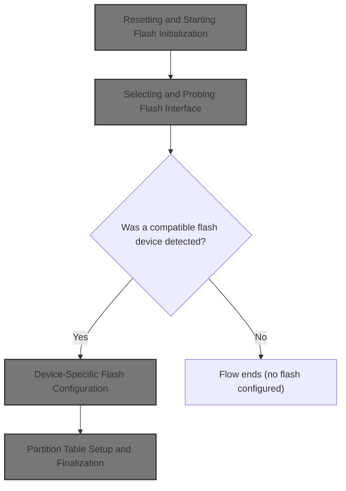

This document describes how the system prepares flash memory for use during hardware initialization. The process clears previous flash state, detects a compatible flash chip using available interfaces, configures the device, and sets up the partition table. The flow receives flash configuration and hardware state as input, and outputs a ready-to-use flash memory setup.



# Resetting and Starting Flash Initialization

<SwmSnippet path="/src/main/drivers/flash/flash.c" line="636">

---

In <SwmToken path="src/main/drivers/flash/flash.c" pos="636:2:2" line-data="bool flashInit(const flashConfig_t *flashConfig)">`flashInit`</SwmToken>, we start by clearing out the global <SwmToken path="src/main/drivers/flash/flash.c" pos="638:4:4" line-data="    memset(&amp;flashPartitionTable, 0x00, sizeof(flashPartitionTable));">`flashPartitionTable`</SwmToken> and resetting <SwmToken path="src/main/drivers/flash/flash.c" pos="639:1:1" line-data="    flashPartitions = 0;">`flashPartitions`</SwmToken> to zero, making sure any previous state is wiped. This sets up a clean slate for flash memory management. Next, we call <SwmToken path="src/main/drivers/flash/flash.c" pos="641:7:7" line-data="    bool haveFlash = flashDeviceInit(flashConfig);">`flashDeviceInit`</SwmToken> to actually probe and initialize the hardware, which is necessary before we can do anything meaningful with the flash. The globals are used so that all flash operations work off the same state, which is typical for embedded systems.

```c
bool flashInit(const flashConfig_t *flashConfig)
{
    memset(&flashPartitionTable, 0x00, sizeof(flashPartitionTable));
    flashPartitions = 0;

    bool haveFlash = flashDeviceInit(flashConfig);

```

---

</SwmSnippet>

## Selecting and Probing Flash Interface

```mermaid
%%{init: {"flowchart": {"defaultRenderer": "elk"}} }%%
flowchart TD
    node1["Start flash device initialization"]
    click node1 openCode "src/main/drivers/flash/flash.c:381:384"
    node1 --> node2{"Is SPI available?"}
    click node2 openCode "src/main/drivers/flash/flash.c:390:392"
    node2 -->|"Yes"| node3["SPI Flash Detection"]
    
    node2 -->|"No"| node4{"Is QuadSPI available?"}
    click node4 openCode "src/main/drivers/flash/flash.c:398:399"
    node4 -->|"Yes"| node5["QuadSPI Flash Detection and Identification"]
    
    node4 -->|"No"| node6{"Is OctoSPI available?"}
    click node6 openCode "src/main/drivers/flash/flash.c:405:406"
    node6 -->|"Yes"| node7["OctoSPI Flash Detection and Identification"]
    
    node6 -->|"No"| node8["No flash initialized"]
    node3 --> node9{"Was initialization successful?"}
    node5 --> node9
    node7 --> node9
    node8 --> node10["Return failure"]
    node9 -->|"Yes"| node11["Configure flash device"]
    click node11 openCode "src/main/drivers/flash/flash.c:411:421"
    node9 -->|"No"| node10["Return failure"]
    click node10 openCode "src/main/drivers/flash/flash.c:423:424"
classDef HeadingStyle fill:#777777,stroke:#333,stroke-width:2px;
click node3 goToHeading "SPI Flash Detection"
node3:::HeadingStyle
click node5 goToHeading "QuadSPI Flash Detection and Identification"
node5:::HeadingStyle
click node7 goToHeading "OctoSPI Flash Detection and Identification"
node7:::HeadingStyle

%% Swimm:
%% %%{init: {"flowchart": {"defaultRenderer": "elk"}} }%%
%% flowchart TD
%%     node1["Start flash device initialization"]
%%     click node1 openCode "<SwmPath>[src/…/flash/flash.c](src/main/drivers/flash/flash.c)</SwmPath>:381:384"
%%     node1 --> node2{"Is SPI available?"}
%%     click node2 openCode "<SwmPath>[src/…/flash/flash.c](src/main/drivers/flash/flash.c)</SwmPath>:390:392"
%%     node2 -->|"Yes"| node3["SPI Flash Detection"]
%%     
%%     node2 -->|"No"| node4{"Is QuadSPI available?"}
%%     click node4 openCode "<SwmPath>[src/…/flash/flash.c](src/main/drivers/flash/flash.c)</SwmPath>:398:399"
%%     node4 -->|"Yes"| node5["QuadSPI Flash Detection and Identification"]
%%     
%%     node4 -->|"No"| node6{"Is OctoSPI available?"}
%%     click node6 openCode "<SwmPath>[src/…/flash/flash.c](src/main/drivers/flash/flash.c)</SwmPath>:405:406"
%%     node6 -->|"Yes"| node7["OctoSPI Flash Detection and Identification"]
%%     
%%     node6 -->|"No"| node8["No flash initialized"]
%%     node3 --> node9{"Was initialization successful?"}
%%     node5 --> node9
%%     node7 --> node9
%%     node8 --> node10["Return failure"]
%%     node9 -->|"Yes"| node11["Configure flash device"]
%%     click node11 openCode "<SwmPath>[src/…/flash/flash.c](src/main/drivers/flash/flash.c)</SwmPath>:411:421"
%%     node9 -->|"No"| node10["Return failure"]
%%     click node10 openCode "<SwmPath>[src/…/flash/flash.c](src/main/drivers/flash/flash.c)</SwmPath>:423:424"
%% classDef HeadingStyle fill:#777777,stroke:#333,stroke-width:2px;
%% click node3 goToHeading "SPI Flash Detection"
%% node3:::HeadingStyle
%% click node5 goToHeading "QuadSPI Flash Detection and Identification"
%% node5:::HeadingStyle
%% click node7 goToHeading "OctoSPI Flash Detection and Identification"
%% node7:::HeadingStyle
```



<SwmSnippet path="/src/main/drivers/flash/flash.c" line="381">

---

In <SwmToken path="src/main/drivers/flash/flash.c" pos="381:4:4" line-data="static bool flashDeviceInit(const flashConfig_t *flashConfig)">`flashDeviceInit`</SwmToken>, we check which flash interface types are enabled at compile time and whether the config for each is valid. If SPI is enabled and the config is good, we call <SwmToken path="src/main/drivers/flash/flash.c" pos="393:5:5" line-data="        haveFlash = flashSpiInit(flashConfig);">`flashSpiInit`</SwmToken> to try and bring up the device over SPI. This is the first step in probing the hardware, and if it fails, we move on to other interfaces.

```c
static bool flashDeviceInit(const flashConfig_t *flashConfig)
{
    bool haveFlash = false;

#if !defined(USE_FLASH_SPI) && !defined(USE_FLASH_QUADSPI) && !defined(USE_FLASH_OCTOSPI)
    UNUSED(flashConfig);
#endif

#ifdef USE_FLASH_SPI
    bool useSpi = (SPI_CFG_TO_DEV(flashConfig->spiDevice) != SPIINVALID);

    if (useSpi) {
        haveFlash = flashSpiInit(flashConfig);
    }
#endif

#ifdef USE_FLASH_QUADSPI
```

---

</SwmSnippet>

### SPI Flash Detection

See <SwmLink doc-title="Detecting and Configuring SPI Flash Memory">[Detecting and Configuring SPI Flash Memory](/.swm/detecting-and-configuring-spi-flash-memory.3y0gv1x9.sw.md)</SwmLink>

### Fallback to QuadSPI

<SwmSnippet path="/src/main/drivers/flash/flash.c" line="398">

---

Back in <SwmToken path="src/main/drivers/flash/flash.c" pos="381:4:4" line-data="static bool flashDeviceInit(const flashConfig_t *flashConfig)">`flashDeviceInit`</SwmToken>, after trying SPI, we check if QuadSPI is available and configured. If so, we call <SwmToken path="src/main/drivers/flash/flash.c" pos="400:5:5" line-data="        haveFlash = flashQuadSpiInit(flashConfig);">`flashQuadSpiInit`</SwmToken> to see if we can bring up the flash device using that interface. This is just moving down the list of supported hardware options.

```c
    bool useQuadSpi = (QUADSPI_CFG_TO_DEV(flashConfig->quadSpiDevice) != QUADSPIINVALID);
    if (useQuadSpi) {
        haveFlash = flashQuadSpiInit(flashConfig);
    }
#endif

#ifdef USE_FLASH_OCTOSPI
```

---

</SwmSnippet>

### QuadSPI Flash Detection and Identification

```mermaid
%%{init: {"flowchart": {"defaultRenderer": "elk"}} }%%
flowchart TD
    node1["Start flash chip initialization"]
    click node1 openCode "src/main/drivers/flash/flash.c:192:201"
    node1 --> node2{"Is Quad SPI bus set up?"}
    click node2 openCode "src/main/drivers/flash/flash.c:202:204"
    node2 -->|"No"| nodeEnd["Return not detected"]
    click nodeEnd openCode "src/main/drivers/flash/flash.c:204:204"
    node2 -->|"Yes"| node3{"Is chip select pin provided?"}
    click node3 openCode "src/main/drivers/flash/flash.c:209:213"
    node3 -->|"No"| nodeEnd
    node3 -->|"Yes"| node4["Initialize chip select pin"]
    click node4 openCode "src/main/drivers/flash/flash.c:215:217"
    node4 --> node5["Prepare for detection"]
    click node5 openCode "src/main/drivers/flash/flash.c:219:221"
    node5 --> loop1

    subgraph loop1["For each communication mode (1-line, 4-line)"]
        node5a["Attempt to read chip ID"]
        click node5a openCode "src/main/drivers/flash/flash.c:222:246"
        node5a --> loop2
        subgraph loop2["For each offset in chip ID response"]
            node5b{"Is supported chip detected?"}
            click node5b openCode "src/main/drivers/flash/flash.c:248:279"
            node5b -->|"Yes"| node6["Store chip ID and mark as detected"]
            click node6 openCode "src/main/drivers/flash/flash.c:280:281"
            node5b -->|"No"| node5c["Continue"]
            click node5c openCode "src/main/drivers/flash/flash.c:282:282"
        end
        loop2 --> node5d{"Detected?"}
        click node5d openCode "src/main/drivers/flash/flash.c:279:284"
        node5d -->|"Yes"| node7["Exit loop"]
        click node7 openCode "src/main/drivers/flash/flash.c:284:284"
        node5d -->|"No"| node5e["Try next communication mode"]
        click node5e openCode "src/main/drivers/flash/flash.c:283:283"
    end
    loop1 --> node8{"Was chip detected?"}
    click node8 openCode "src/main/drivers/flash/flash.c:286:286"
    node8 -->|"Yes"| node9["Return detected"]
    click node9 openCode "src/main/drivers/flash/flash.c:286:287"
    node8 -->|"No"| nodeEnd
classDef HeadingStyle fill:#777777,stroke:#333,stroke-width:2px;

%% Swimm:
%% %%{init: {"flowchart": {"defaultRenderer": "elk"}} }%%
%% flowchart TD
%%     node1["Start flash chip initialization"]
%%     click node1 openCode "<SwmPath>[src/…/flash/flash.c](src/main/drivers/flash/flash.c)</SwmPath>:192:201"
%%     node1 --> node2{"Is Quad SPI bus set up?"}
%%     click node2 openCode "<SwmPath>[src/…/flash/flash.c](src/main/drivers/flash/flash.c)</SwmPath>:202:204"
%%     node2 -->|"No"| nodeEnd["Return not detected"]
%%     click nodeEnd openCode "<SwmPath>[src/…/flash/flash.c](src/main/drivers/flash/flash.c)</SwmPath>:204:204"
%%     node2 -->|"Yes"| node3{"Is chip select pin provided?"}
%%     click node3 openCode "<SwmPath>[src/…/flash/flash.c](src/main/drivers/flash/flash.c)</SwmPath>:209:213"
%%     node3 -->|"No"| nodeEnd
%%     node3 -->|"Yes"| node4["Initialize chip select pin"]
%%     click node4 openCode "<SwmPath>[src/…/flash/flash.c](src/main/drivers/flash/flash.c)</SwmPath>:215:217"
%%     node4 --> node5["Prepare for detection"]
%%     click node5 openCode "<SwmPath>[src/…/flash/flash.c](src/main/drivers/flash/flash.c)</SwmPath>:219:221"
%%     node5 --> loop1
%% 
%%     subgraph loop1["For each communication mode (1-line, 4-line)"]
%%         node5a["Attempt to read chip ID"]
%%         click node5a openCode "<SwmPath>[src/…/flash/flash.c](src/main/drivers/flash/flash.c)</SwmPath>:222:246"
%%         node5a --> loop2
%%         subgraph loop2["For each offset in chip ID response"]
%%             node5b{"Is supported chip detected?"}
%%             click node5b openCode "<SwmPath>[src/…/flash/flash.c](src/main/drivers/flash/flash.c)</SwmPath>:248:279"
%%             node5b -->|"Yes"| node6["Store chip ID and mark as detected"]
%%             click node6 openCode "<SwmPath>[src/…/flash/flash.c](src/main/drivers/flash/flash.c)</SwmPath>:280:281"
%%             node5b -->|"No"| node5c["Continue"]
%%             click node5c openCode "<SwmPath>[src/…/flash/flash.c](src/main/drivers/flash/flash.c)</SwmPath>:282:282"
%%         end
%%         loop2 --> node5d{"Detected?"}
%%         click node5d openCode "<SwmPath>[src/…/flash/flash.c](src/main/drivers/flash/flash.c)</SwmPath>:279:284"
%%         node5d -->|"Yes"| node7["Exit loop"]
%%         click node7 openCode "<SwmPath>[src/…/flash/flash.c](src/main/drivers/flash/flash.c)</SwmPath>:284:284"
%%         node5d -->|"No"| node5e["Try next communication mode"]
%%         click node5e openCode "<SwmPath>[src/…/flash/flash.c](src/main/drivers/flash/flash.c)</SwmPath>:283:283"
%%     end
%%     loop1 --> node8{"Was chip detected?"}
%%     click node8 openCode "<SwmPath>[src/…/flash/flash.c](src/main/drivers/flash/flash.c)</SwmPath>:286:286"
%%     node8 -->|"Yes"| node9["Return detected"]
%%     click node9 openCode "<SwmPath>[src/…/flash/flash.c](src/main/drivers/flash/flash.c)</SwmPath>:286:287"
%%     node8 -->|"No"| nodeEnd
%% classDef HeadingStyle fill:#777777,stroke:#333,stroke-width:2px;
```



<SwmSnippet path="/src/main/drivers/flash/flash.c" line="192">

---

In <SwmToken path="src/main/drivers/flash/flash.c" pos="192:4:4" line-data="static bool flashQuadSpiInit(const flashConfig_t *flashConfig)">`flashQuadSpiInit`</SwmToken>, we set up the QuadSPI bus and chip select, then try to read the JEDEC ID using both 1-line and 4-line modes. For each mode, we try to identify the chip using device-specific functions (like <SwmToken path="src/main/drivers/flash/flash.c" pos="254:9:9" line-data="                if (!detected &amp;&amp; w25q128fv_identify(&amp;flashDevice, jedecID)) {">`w25q128fv_identify`</SwmToken>). If we find a match, we store the JEDEC ID. The next step is to call into device-specific code (like in <SwmPath>[src/…/flash/flash_w25m.c](src/main/drivers/flash/flash_w25m.c)</SwmPath>) to finish identification and setup.

```c
static bool flashQuadSpiInit(const flashConfig_t *flashConfig)
{
    bool detected = false;

    enum { TRY_1LINE = 0, TRY_4LINE, BAIL};
    int phase = TRY_1LINE;

    dev = &devInstance;

    // Set up the QSPI bus device
    if (!quadSpiSetBusInstance(dev, flashConfig->quadSpiDevice)) {
        return false;
    }

    // Set the callback argument when calling back to this driver for DMA completion
    dev->callbackArg = (uint32_t)&flashDevice;

    if (flashConfig->csTag) {
        dev->busType_u.spi.csnPin = IOGetByTag(flashConfig->csTag);
    } else {
        return false;
    }

    IOInit(dev->busType_u.spi.csnPin, OWNER_FLASH_CS, 0);
    IOConfigGPIO(dev->busType_u.spi.csnPin, SPI_IO_CS_CFG);
    IOHi(dev->busType_u.spi.csnPin);

    flashDevice.io.mode = FLASHIO_QUADSPI;
    flashDevice.io.handle.dev = dev;

    do {
        quadSpiSetDivisor(dev, QUADSPI_CLOCK_INITIALISATION);

        // 3 bytes for what we need, but some IC's need 8 dummy cycles after the instruction, so read 4 and make two attempts to
        // assemble the chip id from the response.
        uint8_t readIdResponse[4];

        bool status = false;
        switch (phase) {
        case TRY_1LINE:
            status = quadSpiReceive1LINE(dev, FLASH_INSTRUCTION_RDID, 0, readIdResponse, 4);
            break;
        case TRY_4LINE:
            status = quadSpiReceive4LINES(dev, FLASH_INSTRUCTION_RDID, 2, readIdResponse, 3);
            break;
        default:
            break;
        }

        if (!status) {
            phase++;
            continue;
        }

        quadSpiSetDivisor(dev, QUADSPI_CLOCK_ULTRAFAST);

        for (uint8_t offset = 0; offset <= 1 && !detected; offset++) {

            uint32_t jedecID = (readIdResponse[offset + 0] << 16) | (readIdResponse[offset + 1] << 8) | (readIdResponse[offset + 2]);

            if (offset == 0) {
#if defined(USE_FLASH_W25Q128FV)
                if (!detected && w25q128fv_identify(&flashDevice, jedecID)) {
                    detected = true;
                }
#endif

#ifdef USE_FLASH_M25P16
                if (!detected && m25p16_identify(&flashDevice, jedecID)) {
                    detected = true;
                }
#endif
            }

            if (offset == 1) {
#if defined(USE_FLASH_W25N01G)
                if (!detected && w25n_identify(&flashDevice, jedecID)) {
                    detected = true;
                }
#endif
#if defined(USE_FLASH_W25M02G)
                if (!detected && w25m_identify(&flashDevice, jedecID)) {
                    detected = true;
                }
#endif
            }

            if (detected) {
                flashDevice.geometry.jedecId = jedecID;
            }
        }
```

---

</SwmSnippet>

<SwmSnippet path="/src/main/drivers/flash/flash.c" line="283">

---

After calling the device-specific identification code (like in <SwmPath>[src/…/flash/flash_w25m.c](src/main/drivers/flash/flash_w25m.c)</SwmPath>), <SwmToken path="src/main/drivers/flash/flash.c" pos="192:4:4" line-data="static bool flashQuadSpiInit(const flashConfig_t *flashConfig)">`flashQuadSpiInit`</SwmToken> checks if a device was detected. If not, it bumps the phase and tries the next mode. If nothing works, it exits and returns whether detection succeeded.

```c
        phase++;
    } while (phase != BAIL && !detected);

    return detected;
}
```

---

</SwmSnippet>

### Fallback to OctoSPI

<SwmSnippet path="/src/main/drivers/flash/flash.c" line="405">

---

Back in <SwmToken path="src/main/drivers/flash/flash.c" pos="381:4:4" line-data="static bool flashDeviceInit(const flashConfig_t *flashConfig)">`flashDeviceInit`</SwmToken>, if QuadSPI didn't work, we check if OctoSPI is supported and configured. If so, we call <SwmToken path="src/main/drivers/flash/flash.c" pos="407:5:5" line-data="        haveFlash = flashOctoSpiInit(flashConfig);">`flashOctoSpiInit`</SwmToken> to try initializing the flash device using that interface. This is just continuing down the list of possible hardware options.

```c
    bool useOctoSpi = (OCTOSPI_CFG_TO_DEV(flashConfig->octoSpiDevice) != OCTOSPIINVALID);
    if (useOctoSpi) {
        haveFlash = flashOctoSpiInit(flashConfig);
    }
#endif

```

---

</SwmSnippet>

### OctoSPI Flash Detection and Identification

```mermaid
%%{init: {"flowchart": {"defaultRenderer": "elk"}} }%%
flowchart TD
  node1["Check if memory-mapped mode is enabled on boot"]
  click node1 openCode "src/main/drivers/flash/flash.c:94:97"
  node1 --> node2{"Is memory-mapped mode enabled on boot?"}
  click node2 openCode "src/main/drivers/flash/flash.c:100:102"
  node2 -->|"No"| node3["Exit: Initialization not supported"]
  click node3 openCode "src/main/drivers/flash/flash.c:101:102"
  node2 -->|"Yes"| node4["Prepare OctoSPI interface and disable memory-mapped mode if needed"]
  click node4 openCode "src/main/drivers/flash/flash.c:105:112"
  node4 --> node5["Attempt to detect compatible flash chip"]
  click node5 openCode "src/main/drivers/flash/flash.c:114:181"
  subgraph loop1["Try each communication mode and chip ID offset"]
    node5 --> node6{"Is compatible flash chip detected?"}
    click node6 openCode "src/main/drivers/flash/flash.c:149:179"
    node6 -->|"No"| node7{"Are there more modes/offsets to try?"}
    click node7 openCode "src/main/drivers/flash/flash.c:127:181"
    node7 -->|"Yes"| node5
    node7 -->|"No"| node8["Detection failed"]
    click node8 openCode "src/main/drivers/flash/flash.c:180:181"
    node6 -->|"Yes"| node9["Detection successful"]
    click node9 openCode "src/main/drivers/flash/flash.c:157:158"
  end
  node8 --> node10{"Was memory-mapped mode enabled on boot?"}
  node9 --> node10
  click node10 openCode "src/main/drivers/flash/flash.c:183:185"
  node10 -->|"Yes"| node11["Re-enable memory-mapped mode"]
  click node11 openCode "src/main/drivers/flash/flash.c:184:185"
  node10 -->|"No"| node12["Skip re-enabling"]
  node11 --> node13["Return detection result"]
  click node13 openCode "src/main/drivers/flash/flash.c:186:186"
  node12 --> node13
  node3 --> node13
classDef HeadingStyle fill:#777777,stroke:#333,stroke-width:2px;

%% Swimm:
%% %%{init: {"flowchart": {"defaultRenderer": "elk"}} }%%
%% flowchart TD
%%   node1["Check if <SwmToken path="src/main/drivers/flash/flash.c" pos="120:7:9" line-data="        // for the memory-mapped use-case, we rely on the bootloader to have already selected the correct speed for the flash chip.">`memory-mapped`</SwmToken> mode is enabled on boot"]
%%   click node1 openCode "<SwmPath>[src/…/flash/flash.c](src/main/drivers/flash/flash.c)</SwmPath>:94:97"
%%   node1 --> node2{"Is <SwmToken path="src/main/drivers/flash/flash.c" pos="120:7:9" line-data="        // for the memory-mapped use-case, we rely on the bootloader to have already selected the correct speed for the flash chip.">`memory-mapped`</SwmToken> mode enabled on boot?"}
%%   click node2 openCode "<SwmPath>[src/…/flash/flash.c](src/main/drivers/flash/flash.c)</SwmPath>:100:102"
%%   node2 -->|"No"| node3["Exit: Initialization not supported"]
%%   click node3 openCode "<SwmPath>[src/…/flash/flash.c](src/main/drivers/flash/flash.c)</SwmPath>:101:102"
%%   node2 -->|"Yes"| node4["Prepare OctoSPI interface and disable <SwmToken path="src/main/drivers/flash/flash.c" pos="120:7:9" line-data="        // for the memory-mapped use-case, we rely on the bootloader to have already selected the correct speed for the flash chip.">`memory-mapped`</SwmToken> mode if needed"]
%%   click node4 openCode "<SwmPath>[src/…/flash/flash.c](src/main/drivers/flash/flash.c)</SwmPath>:105:112"
%%   node4 --> node5["Attempt to detect compatible flash chip"]
%%   click node5 openCode "<SwmPath>[src/…/flash/flash.c](src/main/drivers/flash/flash.c)</SwmPath>:114:181"
%%   subgraph loop1["Try each communication mode and chip ID offset"]
%%     node5 --> node6{"Is compatible flash chip detected?"}
%%     click node6 openCode "<SwmPath>[src/…/flash/flash.c](src/main/drivers/flash/flash.c)</SwmPath>:149:179"
%%     node6 -->|"No"| node7{"Are there more modes/offsets to try?"}
%%     click node7 openCode "<SwmPath>[src/…/flash/flash.c](src/main/drivers/flash/flash.c)</SwmPath>:127:181"
%%     node7 -->|"Yes"| node5
%%     node7 -->|"No"| node8["Detection failed"]
%%     click node8 openCode "<SwmPath>[src/…/flash/flash.c](src/main/drivers/flash/flash.c)</SwmPath>:180:181"
%%     node6 -->|"Yes"| node9["Detection successful"]
%%     click node9 openCode "<SwmPath>[src/…/flash/flash.c](src/main/drivers/flash/flash.c)</SwmPath>:157:158"
%%   end
%%   node8 --> node10{"Was <SwmToken path="src/main/drivers/flash/flash.c" pos="120:7:9" line-data="        // for the memory-mapped use-case, we rely on the bootloader to have already selected the correct speed for the flash chip.">`memory-mapped`</SwmToken> mode enabled on boot?"}
%%   node9 --> node10
%%   click node10 openCode "<SwmPath>[src/…/flash/flash.c](src/main/drivers/flash/flash.c)</SwmPath>:183:185"
%%   node10 -->|"Yes"| node11["Re-enable <SwmToken path="src/main/drivers/flash/flash.c" pos="120:7:9" line-data="        // for the memory-mapped use-case, we rely on the bootloader to have already selected the correct speed for the flash chip.">`memory-mapped`</SwmToken> mode"]
%%   click node11 openCode "<SwmPath>[src/…/flash/flash.c](src/main/drivers/flash/flash.c)</SwmPath>:184:185"
%%   node10 -->|"No"| node12["Skip re-enabling"]
%%   node11 --> node13["Return detection result"]
%%   click node13 openCode "<SwmPath>[src/…/flash/flash.c](src/main/drivers/flash/flash.c)</SwmPath>:186:186"
%%   node12 --> node13
%%   node3 --> node13
%% classDef HeadingStyle fill:#777777,stroke:#333,stroke-width:2px;
```



<SwmSnippet path="/src/main/drivers/flash/flash.c" line="85">

---

In <SwmToken path="src/main/drivers/flash/flash.c" pos="85:6:6" line-data="MMFLASH_CODE_NOINLINE static bool flashOctoSpiInit(const flashConfig_t *flashConfig)">`flashOctoSpiInit`</SwmToken>, we check if memory mapped mode is enabled and disable it if necessary. Then we try to read the chip ID using both 1-line and 4-line modes, looping through phases until we either detect a supported chip or run out of options. For each attempt, we call device-specific identify functions (like in <SwmPath>[src/…/flash/flash_w25m.c](src/main/drivers/flash/flash_w25m.c)</SwmPath>) to see if we recognize the chip.

```c
MMFLASH_CODE_NOINLINE static bool flashOctoSpiInit(const flashConfig_t *flashConfig)
{
    bool detected = false;

    enum {
        TRY_1LINE = 0, TRY_4LINE, BAIL
    } phase = TRY_1LINE;

#ifdef USE_FLASH_MEMORY_MAPPED
    bool memoryMappedModeEnabledOnBoot = isMemoryMappedModeEnabledOnBoot();
#else
    bool memoryMappedModeEnabledOnBoot = false;
#endif

#ifndef USE_OCTOSPI_EXPERIMENTAL
    if (!memoryMappedModeEnabledOnBoot) {
        return false; // Not supported yet, enable USE_OCTOSPI_EXPERIMENTAL and test/update implementation as required.
    }
#endif

    OCTOSPI_TypeDef *instance = octoSpiInstanceByDevice(OCTOSPI_CFG_TO_DEV(flashConfig->octoSpiDevice));

    flashDevice.io.handle.octoSpi = instance;
    flashDevice.io.mode = FLASHIO_OCTOSPI;

    if (memoryMappedModeEnabledOnBoot) {
        flashMemoryMappedModeDisable();
    }

    do {
#ifdef USE_OCTOSPI_EXPERIMENTAL
        if (!memoryMappedMode) {
            octoSpiSetDivisor(instance, OCTOSPI_CLOCK_INITIALISATION);
        }
#endif
        // for the memory-mapped use-case, we rely on the bootloader to have already selected the correct speed for the flash chip.

        // 3 bytes for what we need, but some IC's need 8 dummy cycles after the instruction, so read 4 and make two attempts to
        // assemble the chip id from the response.
        uint8_t readIdResponse[4];

        bool status = false;
        switch (phase) {
        case TRY_1LINE:
            status = octoSpiReceive1LINE(instance, FLASH_INSTRUCTION_RDID, 0, readIdResponse, 4);
            break;
        case TRY_4LINE:
            status = octoSpiReceive4LINES(instance, FLASH_INSTRUCTION_RDID, 2, readIdResponse, 3);
            break;
        default:
            break;
        }

        if (!status) {
            phase++;
            continue;
        }

#ifdef USE_OCTOSPI_EXPERIMENTAL
        if (!memoryMappedModeEnabledOnBoot) {
            octoSpiSetDivisor(instance, OCTOSPI_CLOCK_ULTRAFAST);
        }
#endif

        for (uint8_t offset = 0; offset <= 1 && !detected; offset++) {
#if defined(USE_FLASH_W25N01G) || defined(USE_FLASH_W25N02K) || defined(USE_FLASH_W25Q128FV) || defined(USE_FLASH_W25M02G)
            uint32_t jedecID = (readIdResponse[offset + 0] << 16) | (readIdResponse[offset + 1] << 8) | (readIdResponse[offset + 2]);
#endif

            if (offset == 0) {
#if defined(USE_FLASH_W25Q128FV)
                if (!detected && w25q128fv_identify(&flashDevice, jedecID)) {
                    detected = true;
                }
#endif
            }

            if (offset == 1) {
#ifdef USE_OCTOSPI_EXPERIMENTAL
                if (!memoryMappedModeEnabledOnBoot) {
                    // These flash chips DO NOT support memory mapped mode; suitable flash read commands must be available.
#if defined(USE_FLASH_W25N01G) || defined(USE_FLASH_W25N02K)
                    if (!detected && w25n_identify(&flashDevice, jedecID)) {
                        detected = true;
                    }
#endif
#if defined(USE_FLASH_W25M02G)
                    if (!detected && w25m_identify(&flashDevice, jedecID)) {
                        detected = true;
                    }
#endif
                }
#endif
            }
        }
        phase++;
    } while (phase != BAIL && !detected);

```

---

</SwmSnippet>

<SwmSnippet path="/src/main/drivers/flash/flash.c" line="183">

---

After the device-specific checks (like in <SwmPath>[src/…/flash/flash_w25m.c](src/main/drivers/flash/flash_w25m.c)</SwmPath>), <SwmToken path="src/main/drivers/flash/flash.c" pos="85:6:6" line-data="MMFLASH_CODE_NOINLINE static bool flashOctoSpiInit(const flashConfig_t *flashConfig)">`flashOctoSpiInit`</SwmToken> re-enables memory mapped mode if it was on at boot, then returns whether a supported chip was detected. This keeps the system state consistent for later use.

```c
    if (memoryMappedModeEnabledOnBoot) {
        flashMemoryMappedModeEnable();
    }
    return detected;

}
```

---

</SwmSnippet>

### Device-Specific Flash Configuration

```mermaid
%%{init: {"flowchart": {"defaultRenderer": "elk"}} }%%
flowchart TD
    node1{"Is flash device present and configurable?"}
    click node1 openCode "src/main/drivers/flash/flash.c:411:412"
    node1 -->|"Yes"| node2{"Is memory-mapped mode enabled on boot?"}
    click node2 openCode "src/main/drivers/flash/flash.c:415:417"
    node2 -->|"Yes"| node3["Configure flash device for memory-mapped mode"]
    click node3 openCode "src/main/drivers/flash/flash.c:416:417"
    node2 -->|"No"| node4["Configure flash device for default mode"]
    click node4 openCode "src/main/drivers/flash/flash.c:420:420"
    node1 -->|"No"| node5["Do not configure flash device"]
    click node5 openCode "src/main/drivers/flash/flash.c:423:423"
    node3 --> node6["Return flash device presence"]
    click node6 openCode "src/main/drivers/flash/flash.c:423:424"
    node4 --> node6
    node5 --> node6
classDef HeadingStyle fill:#777777,stroke:#333,stroke-width:2px;

%% Swimm:
%% %%{init: {"flowchart": {"defaultRenderer": "elk"}} }%%
%% flowchart TD
%%     node1{"Is flash device present and configurable?"}
%%     click node1 openCode "<SwmPath>[src/…/flash/flash.c](src/main/drivers/flash/flash.c)</SwmPath>:411:412"
%%     node1 -->|"Yes"| node2{"Is <SwmToken path="src/main/drivers/flash/flash.c" pos="120:7:9" line-data="        // for the memory-mapped use-case, we rely on the bootloader to have already selected the correct speed for the flash chip.">`memory-mapped`</SwmToken> mode enabled on boot?"}
%%     click node2 openCode "<SwmPath>[src/…/flash/flash.c](src/main/drivers/flash/flash.c)</SwmPath>:415:417"
%%     node2 -->|"Yes"| node3["Configure flash device for <SwmToken path="src/main/drivers/flash/flash.c" pos="120:7:9" line-data="        // for the memory-mapped use-case, we rely on the bootloader to have already selected the correct speed for the flash chip.">`memory-mapped`</SwmToken> mode"]
%%     click node3 openCode "<SwmPath>[src/…/flash/flash.c](src/main/drivers/flash/flash.c)</SwmPath>:416:417"
%%     node2 -->|"No"| node4["Configure flash device for default mode"]
%%     click node4 openCode "<SwmPath>[src/…/flash/flash.c](src/main/drivers/flash/flash.c)</SwmPath>:420:420"
%%     node1 -->|"No"| node5["Do not configure flash device"]
%%     click node5 openCode "<SwmPath>[src/…/flash/flash.c](src/main/drivers/flash/flash.c)</SwmPath>:423:423"
%%     node3 --> node6["Return flash device presence"]
%%     click node6 openCode "<SwmPath>[src/…/flash/flash.c](src/main/drivers/flash/flash.c)</SwmPath>:423:424"
%%     node4 --> node6
%%     node5 --> node6
%% classDef HeadingStyle fill:#777777,stroke:#333,stroke-width:2px;
```



<SwmSnippet path="/src/main/drivers/flash/flash.c" line="411">

---

After returning from <SwmToken path="src/main/drivers/flash/flash.c" pos="85:6:6" line-data="MMFLASH_CODE_NOINLINE static bool flashOctoSpiInit(const flashConfig_t *flashConfig)">`flashOctoSpiInit`</SwmToken>, <SwmToken path="src/main/drivers/flash/flash.c" pos="381:4:4" line-data="static bool flashDeviceInit(const flashConfig_t *flashConfig)">`flashDeviceInit`</SwmToken> checks if a flash device was found and if it has a configure method. If so, it sets up configuration flags (like memory mapped mode) and calls the device's configure function. This lets us handle device-specific setup without cluttering the main logic.

```c
    if (haveFlash && flashDevice.vTable->configure) {
        uint32_t configurationFlags = 0;

#ifdef USE_FLASH_MEMORY_MAPPED
        if (isMemoryMappedModeEnabledOnBoot()) {
            configurationFlags |= FLASH_CF_SYSTEM_IS_MEMORY_MAPPED;
        }
#endif

        flashDevice.vTable->configure(&flashDevice, configurationFlags);
    }

    return haveFlash;
}
```

---

</SwmSnippet>

## Partition Table Setup and Finalization

<SwmSnippet path="/src/main/drivers/flash/flash.c" line="643">

---

After returning from <SwmToken path="src/main/drivers/flash/flash.c" pos="381:4:4" line-data="static bool flashDeviceInit(const flashConfig_t *flashConfig)">`flashDeviceInit`</SwmToken>, <SwmToken path="src/main/drivers/flash/flash.c" pos="636:2:2" line-data="bool flashInit(const flashConfig_t *flashConfig)">`flashInit`</SwmToken> calls <SwmToken path="src/main/drivers/flash/flash.c" pos="643:1:1" line-data="    flashConfigurePartitions();">`flashConfigurePartitions`</SwmToken> to set up the partition table based on the detected device. Finally, it returns whether initialization succeeded. Partitioning is only done after we know the hardware is ready.

```c
    flashConfigurePartitions();

    return haveFlash;
}
```

---

</SwmSnippet>

&nbsp;

*This is an auto-generated document by Swimm 🌊 and has not yet been verified by a human*

<SwmMeta version="3.0.0" repo-id="Z2l0aHViJTNBJTNBYy1iZXRhZmxpZ2h0JTNBJTNBcmljYXJkb2xvcGV6Zw==" repo-name="c-betaflight"><sup>Powered by [Swimm](https://app.swimm.io/)</sup></SwmMeta>
