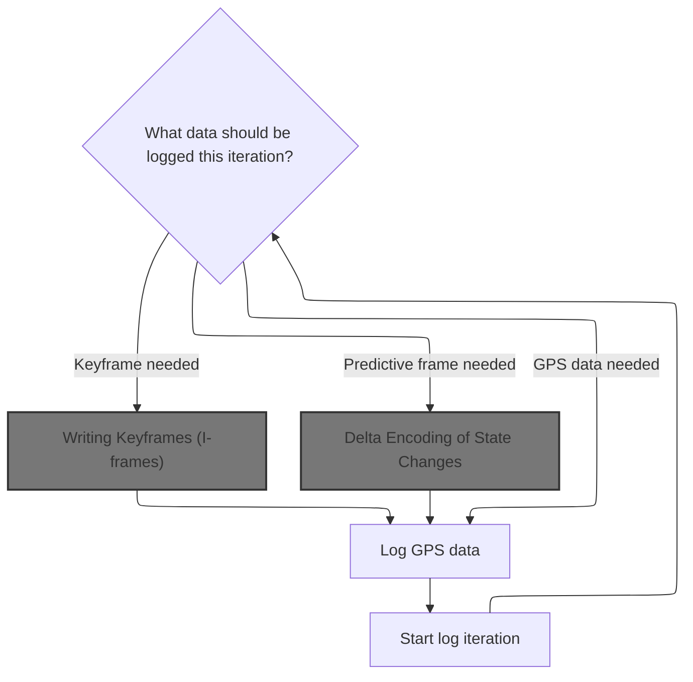
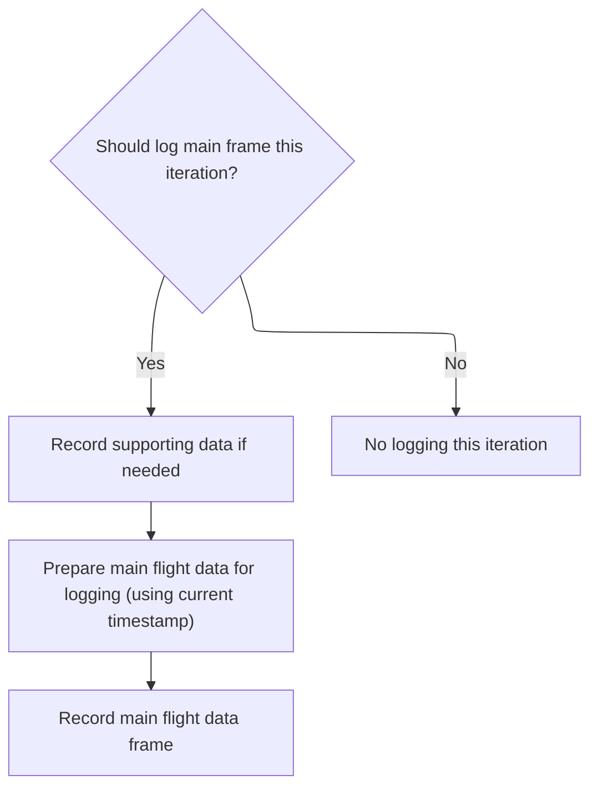
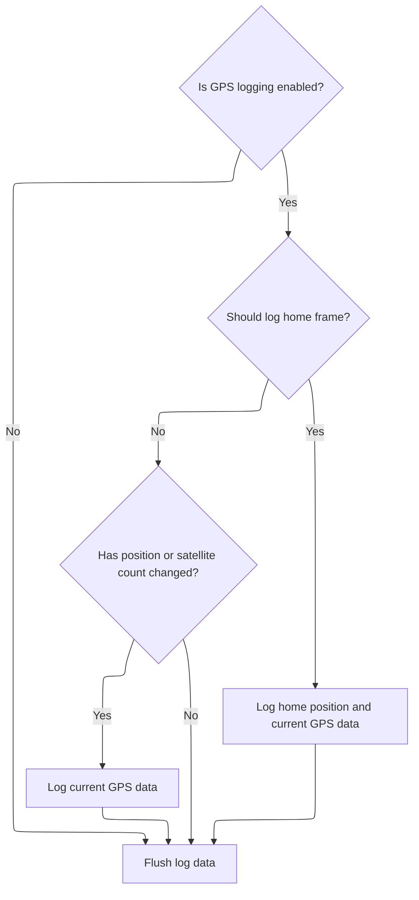
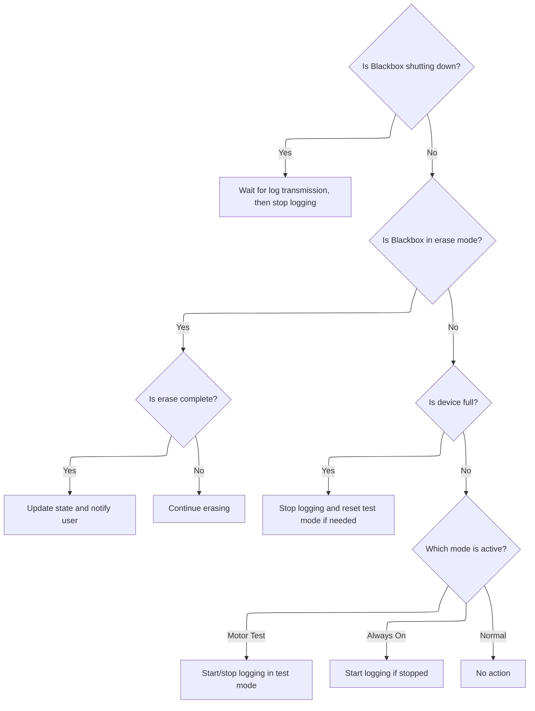

```mermaid
%%{init: {"flowchart": {"defaultRenderer": "elk"}} }%%
flowchart TD
    node1["Start intraframe logging"]
    click node1 openCode "src/main/blackbox/blackbox.c:655:659"
    node1 --> nodeA["Log frame type, iteration, and time"]
    click nodeA openCode "src/main/blackbox/blackbox.c:659:663"
    nodeA --> node2{"Log PID data?"}
    click node2 openCode "src/main/blackbox/blackbox.c:664:675"
    node2 -->|"Yes"| node3["Log PID P, I, F terms"]
    click node3 openCode "src/main/blackbox/blackbox.c:665:675"
    node3 --> node4
    subgraph loop1["For each axis"]
        node4{"Is PID D nonzero?"}
        click node4 openCode "src/main/blackbox/blackbox.c:669:673"
        node4 -->|"Yes"| node5["Log PID D term"]
        click node5 openCode "src/main/blackbox/blackbox.c:671:672"
        node4 -->|"No"| node6["Skip PID D term"]
    end
    node3 --> node7{"Log wing S term?"}
    click node7 openCode "src/main/blackbox/blackbox.c:677:682"
    subgraph loop2["For each axis"]
        node7 -->|"Yes"| node8["Log wing S term"]
        click node8 openCode "src/main/blackbox/blackbox.c:680:681"
        node7 -->|"No"| node9["Skip wing S term"]
    end
    node3 --> node10{"Log RC commands?"}
    click node10 openCode "src/main/blackbox/blackbox.c:686:695"
    node10 -->|"Yes"| node11["Log RC commands and throttle"]
    click node11 openCode "src/main/blackbox/blackbox.c:688:694"
    node10 -->|"No"| node12{"Log setpoints?"}
    click node12 openCode "src/main/blackbox/blackbox.c:697:700"
    node11 --> node12
    node12 -->|"Yes"| node13["Log setpoints"]
    click node13 openCode "src/main/blackbox/blackbox.c:699:700"
    node12 -->|"No"| node14{"Log battery voltage?"}
    click node14 openCode "src/main/blackbox/blackbox.c:702:710"
    node13 --> node14
    node14 -->|"Yes"| node15["Log battery voltage"]
    click node15 openCode "src/main/blackbox/blackbox.c:709:710"
    node14 -->|"No"| node16{"Log amperage?"}
    click node16 openCode "src/main/blackbox/blackbox.c:712:715"
    node15 --> node16
    node16 -->|"Yes"| node17["Log amperage"]
    click node17 openCode "src/main/blackbox/blackbox.c:714:715"
    node16 -->|"No"| node18{"Log magnetometer data?"}
    click node18 openCode "src/main/blackbox/blackbox.c:718:720"
    node17 --> node18
    node18 -->|"Yes"| node19["Log magnetometer data"]
    click node19 openCode "src/main/blackbox/blackbox.c:719:720"
    node18 -->|"No"| node20{"Log barometer data?"}
    click node20 openCode "src/main/blackbox/blackbox.c:724:726"
    node19 --> node20
    node20 -->|"Yes"| node21["Log barometer data"]
    click node21 openCode "src/main/blackbox/blackbox.c:725:726"
    node20 -->|"No"| node22{"Log rangefinder data?"}
    click node22 openCode "src/main/blackbox/blackbox.c:730:732"
    node21 --> node22
    node22 -->|"Yes"| node23["Log rangefinder data"]
    click node23 openCode "src/main/blackbox/blackbox.c:731:732"
    node22 -->|"No"| node24{"Log RSSI?"}
    click node24 openCode "src/main/blackbox/blackbox.c:735:737"
    node23 --> node24
    node24 -->|"Yes"| node25["Log RSSI"]
    click node25 openCode "src/main/blackbox/blackbox.c:736:737"
    node24 -->|"No"| node26{"Log gyro data?"}
    click node26 openCode "src/main/blackbox/blackbox.c:739:741"
    node25 --> node26
    node26 -->|"Yes"| node27["Log gyro data"]
    click node27 openCode "src/main/blackbox/blackbox.c:740:741"
    node26 -->|"No"| node28{"Log unfilt gyro data?"}
    click node28 openCode "src/main/blackbox/blackbox.c:743:745"
    node27 --> node28
    node28 -->|"Yes"| node29["Log unfilt gyro data"]
    click node29 openCode "src/main/blackbox/blackbox.c:744:745"
    node28 -->|"No"| node30{"Log accelerometer data?"}
    click node30 openCode "src/main/blackbox/blackbox.c:748:750"
    node29 --> node30
    node30 -->|"Yes"| node31["Log accelerometer data"]
    click node31 openCode "src/main/blackbox/blackbox.c:749:750"
    node30 -->|"No"| node32{"Log attitude data?"}
    click node32 openCode "src/main/blackbox/blackbox.c:752:754"
    node31 --> node32
    node32 -->|"Yes"| node33["Log attitude data"]
    click node33 openCode "src/main/blackbox/blackbox.c:753:754"
    node32 -->|"No"| node34{"Log debug log?"}
    click node34 openCode "src/main/blackbox/blackbox.c:757:759"
    node33 --> node34
    node34 -->|"Yes"| node35["Log debug log"]
    click node35 openCode "src/main/blackbox/blackbox.c:758:759"
    node34 -->|"No"| node36{"Log motor outputs?"}
    click node36 openCode "src/main/blackbox/blackbox.c:761:769"
    node35 --> node36
    node36 -->|"Yes"| node37["Log motor outputs"]
    click node37 openCode "src/main/blackbox/blackbox.c:763:769"
    subgraph loop3["For each motor"]
        node37 --> node38["Log motor output difference"]
        click node38 openCode "src/main/blackbox/blackbox.c:768:769"
    end
    node36 -->|"No"| node39{"Log servo outputs?"}
    click node39 openCode "src/main/blackbox/blackbox.c:773:779"
    node37 --> node39
    node39 -->|"Yes"| node40["Log servo outputs"]
    click node40 openCode "src/main/blackbox/blackbox.c:776:779"
    subgraph loop4["For each servo"]
        node40 --> node41["Log servo output difference"]
        click node41 openCode "src/main/blackbox/blackbox.c:776:779"
    end
    node39 -->|"No"| node42{"Log RPM telemetry?"}
    click node42 openCode "src/main/blackbox/blackbox.c:784:790"
    node40 --> node42
    node42 -->|"Yes"| node43["Log RPM telemetry"]
    click node43 openCode "src/main/blackbox/blackbox.c:787:790"
    subgraph loop5["For each motor"]
        node43 --> node44["Log RPM value"]
        click node44 openCode "src/main/blackbox/blackbox.c:788:790"
    end
    node42 -->|"No"| node45["Rotate history buffers"]
    click node45 openCode "src/main/blackbox/blackbox.c:794:801"
    node45 --> node46["Mark frame as logged"]
    click node46 openCode "src/main/blackbox/blackbox.c:803:804"
classDef HeadingStyle fill:#777777,stroke:#333,stroke-width:2px;

%% Swimm:
%% %%{init: {"flowchart": {"defaultRenderer": "elk"}} }%%
%% flowchart TD
%%     node1["Start intraframe logging"]
%%     click node1 openCode "<SwmPath>[src/…/blackbox/blackbox.c](src/main/blackbox/blackbox.c)</SwmPath>:655:659"
%%     node1 --> nodeA["Log frame type, iteration, and time"]
%%     click nodeA openCode "<SwmPath>[src/…/blackbox/blackbox.c](src/main/blackbox/blackbox.c)</SwmPath>:659:663"
%%     nodeA --> node2{"Log PID data?"}
%%     click node2 openCode "<SwmPath>[src/…/blackbox/blackbox.c](src/main/blackbox/blackbox.c)</SwmPath>:664:675"
%%     node2 -->|"Yes"| node3["Log PID P, I, F terms"]
%%     click node3 openCode "<SwmPath>[src/…/blackbox/blackbox.c](src/main/blackbox/blackbox.c)</SwmPath>:665:675"
%%     node3 --> node4
%%     subgraph loop1["For each axis"]
%%         node4{"Is PID D nonzero?"}
%%         click node4 openCode "<SwmPath>[src/…/blackbox/blackbox.c](src/main/blackbox/blackbox.c)</SwmPath>:669:673"
%%         node4 -->|"Yes"| node5["Log PID D term"]
%%         click node5 openCode "<SwmPath>[src/…/blackbox/blackbox.c](src/main/blackbox/blackbox.c)</SwmPath>:671:672"
%%         node4 -->|"No"| node6["Skip PID D term"]
%%     end
%%     node3 --> node7{"Log wing S term?"}
%%     click node7 openCode "<SwmPath>[src/…/blackbox/blackbox.c](src/main/blackbox/blackbox.c)</SwmPath>:677:682"
%%     subgraph loop2["For each axis"]
%%         node7 -->|"Yes"| node8["Log wing S term"]
%%         click node8 openCode "<SwmPath>[src/…/blackbox/blackbox.c](src/main/blackbox/blackbox.c)</SwmPath>:680:681"
%%         node7 -->|"No"| node9["Skip wing S term"]
%%     end
%%     node3 --> node10{"Log RC commands?"}
%%     click node10 openCode "<SwmPath>[src/…/blackbox/blackbox.c](src/main/blackbox/blackbox.c)</SwmPath>:686:695"
%%     node10 -->|"Yes"| node11["Log RC commands and throttle"]
%%     click node11 openCode "<SwmPath>[src/…/blackbox/blackbox.c](src/main/blackbox/blackbox.c)</SwmPath>:688:694"
%%     node10 -->|"No"| node12{"Log setpoints?"}
%%     click node12 openCode "<SwmPath>[src/…/blackbox/blackbox.c](src/main/blackbox/blackbox.c)</SwmPath>:697:700"
%%     node11 --> node12
%%     node12 -->|"Yes"| node13["Log setpoints"]
%%     click node13 openCode "<SwmPath>[src/…/blackbox/blackbox.c](src/main/blackbox/blackbox.c)</SwmPath>:699:700"
%%     node12 -->|"No"| node14{"Log battery voltage?"}
%%     click node14 openCode "<SwmPath>[src/…/blackbox/blackbox.c](src/main/blackbox/blackbox.c)</SwmPath>:702:710"
%%     node13 --> node14
%%     node14 -->|"Yes"| node15["Log battery voltage"]
%%     click node15 openCode "<SwmPath>[src/…/blackbox/blackbox.c](src/main/blackbox/blackbox.c)</SwmPath>:709:710"
%%     node14 -->|"No"| node16{"Log amperage?"}
%%     click node16 openCode "<SwmPath>[src/…/blackbox/blackbox.c](src/main/blackbox/blackbox.c)</SwmPath>:712:715"
%%     node15 --> node16
%%     node16 -->|"Yes"| node17["Log amperage"]
%%     click node17 openCode "<SwmPath>[src/…/blackbox/blackbox.c](src/main/blackbox/blackbox.c)</SwmPath>:714:715"
%%     node16 -->|"No"| node18{"Log magnetometer data?"}
%%     click node18 openCode "<SwmPath>[src/…/blackbox/blackbox.c](src/main/blackbox/blackbox.c)</SwmPath>:718:720"
%%     node17 --> node18
%%     node18 -->|"Yes"| node19["Log magnetometer data"]
%%     click node19 openCode "<SwmPath>[src/…/blackbox/blackbox.c](src/main/blackbox/blackbox.c)</SwmPath>:719:720"
%%     node18 -->|"No"| node20{"Log barometer data?"}
%%     click node20 openCode "<SwmPath>[src/…/blackbox/blackbox.c](src/main/blackbox/blackbox.c)</SwmPath>:724:726"
%%     node19 --> node20
%%     node20 -->|"Yes"| node21["Log barometer data"]
%%     click node21 openCode "<SwmPath>[src/…/blackbox/blackbox.c](src/main/blackbox/blackbox.c)</SwmPath>:725:726"
%%     node20 -->|"No"| node22{"Log rangefinder data?"}
%%     click node22 openCode "<SwmPath>[src/…/blackbox/blackbox.c](src/main/blackbox/blackbox.c)</SwmPath>:730:732"
%%     node21 --> node22
%%     node22 -->|"Yes"| node23["Log rangefinder data"]
%%     click node23 openCode "<SwmPath>[src/…/blackbox/blackbox.c](src/main/blackbox/blackbox.c)</SwmPath>:731:732"
%%     node22 -->|"No"| node24{"Log RSSI?"}
%%     click node24 openCode "<SwmPath>[src/…/blackbox/blackbox.c](src/main/blackbox/blackbox.c)</SwmPath>:735:737"
%%     node23 --> node24
%%     node24 -->|"Yes"| node25["Log RSSI"]
%%     click node25 openCode "<SwmPath>[src/…/blackbox/blackbox.c](src/main/blackbox/blackbox.c)</SwmPath>:736:737"
%%     node24 -->|"No"| node26{"Log gyro data?"}
%%     click node26 openCode "<SwmPath>[src/…/blackbox/blackbox.c](src/main/blackbox/blackbox.c)</SwmPath>:739:741"
%%     node25 --> node26
%%     node26 -->|"Yes"| node27["Log gyro data"]
%%     click node27 openCode "<SwmPath>[src/…/blackbox/blackbox.c](src/main/blackbox/blackbox.c)</SwmPath>:740:741"
%%     node26 -->|"No"| node28{"Log unfilt gyro data?"}
%%     click node28 openCode "<SwmPath>[src/…/blackbox/blackbox.c](src/main/blackbox/blackbox.c)</SwmPath>:743:745"
%%     node27 --> node28
%%     node28 -->|"Yes"| node29["Log unfilt gyro data"]
%%     click node29 openCode "<SwmPath>[src/…/blackbox/blackbox.c](src/main/blackbox/blackbox.c)</SwmPath>:744:745"
%%     node28 -->|"No"| node30{"Log accelerometer data?"}
%%     click node30 openCode "<SwmPath>[src/…/blackbox/blackbox.c](src/main/blackbox/blackbox.c)</SwmPath>:748:750"
%%     node29 --> node30
%%     node30 -->|"Yes"| node31["Log accelerometer data"]
%%     click node31 openCode "<SwmPath>[src/…/blackbox/blackbox.c](src/main/blackbox/blackbox.c)</SwmPath>:749:750"
%%     node30 -->|"No"| node32{"Log attitude data?"}
%%     click node32 openCode "<SwmPath>[src/…/blackbox/blackbox.c](src/main/blackbox/blackbox.c)</SwmPath>:752:754"
%%     node31 --> node32
%%     node32 -->|"Yes"| node33["Log attitude data"]
%%     click node33 openCode "<SwmPath>[src/…/blackbox/blackbox.c](src/main/blackbox/blackbox.c)</SwmPath>:753:754"
%%     node32 -->|"No"| node34{"Log debug log?"}
%%     click node34 openCode "<SwmPath>[src/…/blackbox/blackbox.c](src/main/blackbox/blackbox.c)</SwmPath>:757:759"
%%     node33 --> node34
%%     node34 -->|"Yes"| node35["Log debug log"]
%%     click node35 openCode "<SwmPath>[src/…/blackbox/blackbox.c](src/main/blackbox/blackbox.c)</SwmPath>:758:759"
%%     node34 -->|"No"| node36{"Log motor outputs?"}
%%     click node36 openCode "<SwmPath>[src/…/blackbox/blackbox.c](src/main/blackbox/blackbox.c)</SwmPath>:761:769"
%%     node35 --> node36
%%     node36 -->|"Yes"| node37["Log motor outputs"]
%%     click node37 openCode "<SwmPath>[src/…/blackbox/blackbox.c](src/main/blackbox/blackbox.c)</SwmPath>:763:769"
%%     subgraph loop3["For each motor"]
%%         node37 --> node38["Log motor output difference"]
%%         click node38 openCode "<SwmPath>[src/…/blackbox/blackbox.c](src/main/blackbox/blackbox.c)</SwmPath>:768:769"
%%     end
%%     node36 -->|"No"| node39{"Log servo outputs?"}
%%     click node39 openCode "<SwmPath>[src/…/blackbox/blackbox.c](src/main/blackbox/blackbox.c)</SwmPath>:773:779"
%%     node37 --> node39
%%     node39 -->|"Yes"| node40["Log servo outputs"]
%%     click node40 openCode "<SwmPath>[src/…/blackbox/blackbox.c](src/main/blackbox/blackbox.c)</SwmPath>:776:779"
%%     subgraph loop4["For each servo"]
%%         node40 --> node41["Log servo output difference"]
%%         click node41 openCode "<SwmPath>[src/…/blackbox/blackbox.c](src/main/blackbox/blackbox.c)</SwmPath>:776:779"
%%     end
%%     node39 -->|"No"| node42{"Log RPM telemetry?"}
%%     click node42 openCode "<SwmPath>[src/…/blackbox/blackbox.c](src/main/blackbox/blackbox.c)</SwmPath>:784:790"
%%     node40 --> node42
%%     node42 -->|"Yes"| node43["Log RPM telemetry"]
%%     click node43 openCode "<SwmPath>[src/…/blackbox/blackbox.c](src/main/blackbox/blackbox.c)</SwmPath>:787:790"
%%     subgraph loop5["For each motor"]
%%         node43 --> node44["Log RPM value"]
%%         click node44 openCode "<SwmPath>[src/…/blackbox/blackbox.c](src/main/blackbox/blackbox.c)</SwmPath>:788:790"
%%     end
%%     node42 -->|"No"| node45["Rotate history buffers"]
%%     click node45 openCode "<SwmPath>[src/…/blackbox/blackbox.c](src/main/blackbox/blackbox.c)</SwmPath>:794:801"
%%     node45 --> node46["Mark frame as logged"]
%%     click node46 openCode "<SwmPath>[src/…/blackbox/blackbox.c](src/main/blackbox/blackbox.c)</SwmPath>:803:804"
%% classDef HeadingStyle fill:#777777,stroke:#333,stroke-width:2px;
```

This document outlines the lifecycle of flight data logging, adapting to flight controller state, user modes, and storage conditions. It ensures that keyframes, delta frames, and GPS data are captured efficiently and reliably for post-flight analysis.

# State Machine for Blackbox Logging

<SwmSnippet path="/src/main/blackbox/blackbox.c" line="2059">

---

In <SwmToken path="src/main/blackbox/blackbox.c" pos="2059:2:2" line-data="void blackboxUpdate(timeUs_t currentTimeUs)">`blackboxUpdate`</SwmToken>, we kick off the state machine for blackbox logging. The switch-case on <SwmToken path="src/main/blackbox/blackbox.c" pos="2063:4:4" line-data="    switch (blackboxState) {">`blackboxState`</SwmToken> handles everything: starting logging when armed, prepping log files, sending headers in timed chunks, flushing caches, pausing/resuming, and shutting down. Macros and flags like <SwmToken path="src/main/blackbox/blackbox.c" pos="2065:4:7" line-data="        if (ARMING_FLAG(ARMED)) {">`ARMING_FLAG(ARMED)`</SwmToken> and <SwmToken path="src/main/blackbox/blackbox.c" pos="2038:6:6" line-data="        if (featureIsEnabled(FEATURE_GPS) &amp;&amp; isFieldEnabled(FIELD_SELECT(GPS))) {">`FEATURE_GPS`</SwmToken> drive transitions and actions, so the flow adapts to hardware state and config. Buffer management and timing checks prevent overflows and keep the main loop responsive.

```c
void blackboxUpdate(timeUs_t currentTimeUs)
{
    static blackboxState_e cacheFlushNextState;

    switch (blackboxState) {
    case BLACKBOX_STATE_STOPPED:
        if (ARMING_FLAG(ARMED)) {
            blackboxOpen();
            blackboxStart();
        }
#ifdef USE_FLASHFS
        if (IS_RC_MODE_ACTIVE(BOXBLACKBOXERASE)) {
            blackboxSetState(BLACKBOX_STATE_START_ERASE);
        }
#endif
        break;
    case BLACKBOX_STATE_PREPARE_LOG_FILE:
        if (blackboxDeviceBeginLog()) {
            blackboxSetState(BLACKBOX_STATE_SEND_HEADER);
        }
        break;
    case BLACKBOX_STATE_SEND_HEADER:
        blackboxReplenishHeaderBudget();
        //On entry of this state, xmitState.headerIndex is 0 and startTime is intialised

        /*
         * Once the UART has had time to init, transmit the header in chunks so we don't overflow its transmit
         * buffer, overflow the OpenLog's buffer, or keep the main loop busy for too long.
         */
        if (millis() > xmitState.u.startTime + 100) {
            if (blackboxDeviceReserveBufferSpace(BLACKBOX_TARGET_HEADER_BUDGET_PER_ITERATION) == BLACKBOX_RESERVE_SUCCESS) {
                for (int i = 0; i < BLACKBOX_TARGET_HEADER_BUDGET_PER_ITERATION && blackboxHeader[xmitState.headerIndex] != '\0'; i++, xmitState.headerIndex++) {
                    blackboxWrite(blackboxHeader[xmitState.headerIndex]);
                    blackboxHeaderBudget--;
                }
```

---

</SwmSnippet>

<SwmSnippet path="/src/main/blackbox/blackbox.c" line="2094">

---

After sending headers in chunks, we log a resume event with <SwmToken path="src/main/blackbox/blackbox.c" pos="2170:1:1" line-data="            blackboxLogEvent(FLIGHT_LOG_EVENT_LOGGING_RESUME, (flightLogEventData_t *) &amp;resume);">`blackboxLogEvent`</SwmToken> when coming out of pause, so the log stays consistent for downstream decoding.

```c
                if (blackboxHeader[xmitState.headerIndex] == '\0') {
                    blackboxSetState(BLACKBOX_STATE_SEND_MAIN_FIELD_HEADER);
                }
            }
        }
        break;
    case BLACKBOX_STATE_SEND_MAIN_FIELD_HEADER:
        blackboxReplenishHeaderBudget();
        //On entry of this state, xmitState.headerIndex is 0 and xmitState.u.fieldIndex is -1
        if (!sendFieldDefinition('I', 'P', blackboxMainFields, blackboxMainFields + 1, ARRAYLEN(blackboxMainFields),
                &blackboxMainFields[0].condition, &blackboxMainFields[1].condition)) {
#ifdef USE_GPS
            if (featureIsEnabled(FEATURE_GPS) && isFieldEnabled(FIELD_SELECT(GPS))) {
                blackboxSetState(BLACKBOX_STATE_SEND_GPS_H_HEADER);
            } else
#endif
                blackboxSetState(BLACKBOX_STATE_SEND_SLOW_HEADER);
        }
        break;
#ifdef USE_GPS
    case BLACKBOX_STATE_SEND_GPS_H_HEADER:
        blackboxReplenishHeaderBudget();
        //On entry of this state, xmitState.headerIndex is 0 and xmitState.u.fieldIndex is -1
        if (!sendFieldDefinition('H', 0, blackboxGpsHFields, blackboxGpsHFields + 1, ARRAYLEN(blackboxGpsHFields),
                NULL, NULL) && isFieldEnabled(FIELD_SELECT(GPS))) {
            blackboxSetState(BLACKBOX_STATE_SEND_GPS_G_HEADER);
        }
        break;
    case BLACKBOX_STATE_SEND_GPS_G_HEADER:
        blackboxReplenishHeaderBudget();
        //On entry of this state, xmitState.headerIndex is 0 and xmitState.u.fieldIndex is -1
        if (!sendFieldDefinition('G', 0, blackboxGpsGFields, blackboxGpsGFields + 1, ARRAYLEN(blackboxGpsGFields),
                &blackboxGpsGFields[0].condition, &blackboxGpsGFields[1].condition) && isFieldEnabled(FIELD_SELECT(GPS))) {
            blackboxSetState(BLACKBOX_STATE_SEND_SLOW_HEADER);
        }
        break;
#endif
    case BLACKBOX_STATE_SEND_SLOW_HEADER:
        blackboxReplenishHeaderBudget();
        //On entry of this state, xmitState.headerIndex is 0 and xmitState.u.fieldIndex is -1
        if (!sendFieldDefinition('S', 0, blackboxSlowFields, blackboxSlowFields + 1, ARRAYLEN(blackboxSlowFields),
                NULL, NULL)) {
            cacheFlushNextState = BLACKBOX_STATE_SEND_SYSINFO;
            blackboxSetState(BLACKBOX_STATE_CACHE_FLUSH);
        }
        break;
    case BLACKBOX_STATE_SEND_SYSINFO:
        blackboxReplenishHeaderBudget();
        //On entry of this state, xmitState.headerIndex is 0

        //Keep writing chunks of the system info headers until it returns true to signal completion
        if (blackboxWriteSysinfo()) {
            /*
             * Wait for header buffers to drain completely before data logging begins to ensure reliable header delivery
             * (overflowing circular buffers causes all data to be discarded, so the first few logged iterations
             * could wipe out the end of the header if we weren't careful)
             */
            cacheFlushNextState = BLACKBOX_STATE_RUNNING;
            blackboxSetState(BLACKBOX_STATE_CACHE_FLUSH);
        }
        break;
    case BLACKBOX_STATE_CACHE_FLUSH:
        // Flush the cache and wait until all possible entries have been written to the media
        if (blackboxDeviceFlushForceComplete()) {
            blackboxSetState(cacheFlushNextState);
        }
        break;
    case BLACKBOX_STATE_PAUSED:
        // Only allow resume to occur during an I-frame iteration, so that we have an "I" base to work from
        if (IS_RC_MODE_ACTIVE(BOXBLACKBOX) && blackboxShouldLogIFrame()) {
            // Write a log entry so the decoder is aware that our large time/iteration skip is intended
            flightLogEvent_loggingResume_t resume;

            resume.logIteration = blackboxIteration;
            resume.currentTime = currentTimeUs;

            blackboxLogEvent(FLIGHT_LOG_EVENT_LOGGING_RESUME, (flightLogEventData_t *) &resume);
```

---

</SwmSnippet>

<SwmSnippet path="/src/main/blackbox/blackbox.c" line="1893">

---

<SwmToken path="src/main/blackbox/blackbox.c" pos="1893:2:2" line-data="void blackboxLogEvent(FlightLogEvent event, flightLogEventData_t *data)">`blackboxLogEvent`</SwmToken> writes event frames only if logging is active (RUNNING or PAUSED). It starts each event with a shared header, then serializes event-specific data using a switch. Special handling for inflight adjustments lets us encode float or int values as needed. The caller is responsible for passing the right union member for the event type.

```c
void blackboxLogEvent(FlightLogEvent event, flightLogEventData_t *data)
{
    // Only allow events to be logged after headers have been written
    if (!(blackboxState == BLACKBOX_STATE_RUNNING || blackboxState == BLACKBOX_STATE_PAUSED)) {
        return;
    }

    //Shared header for event frames
    blackboxWrite('E');
    blackboxWrite(event);

    //Now serialize the data for this specific frame type
    switch (event) {
    case FLIGHT_LOG_EVENT_SYNC_BEEP:
        blackboxWriteUnsignedVB(data->syncBeep.time);
        break;
    case FLIGHT_LOG_EVENT_FLIGHTMODE: // New flightmode flags write
        blackboxWriteUnsignedVB(data->flightMode.flags);
        blackboxWriteUnsignedVB(data->flightMode.lastFlags);
        break;
    case FLIGHT_LOG_EVENT_DISARM:
        blackboxWriteUnsignedVB(data->disarm.reason);
        break;
    case FLIGHT_LOG_EVENT_INFLIGHT_ADJUSTMENT:
        if (data->inflightAdjustment.floatFlag) {
            blackboxWrite(data->inflightAdjustment.adjustmentFunction + FLIGHT_LOG_EVENT_INFLIGHT_ADJUSTMENT_FUNCTION_FLOAT_VALUE_FLAG);
            blackboxWriteFloat(data->inflightAdjustment.newFloatValue);
        } else {
            blackboxWrite(data->inflightAdjustment.adjustmentFunction);
            blackboxWriteSignedVB(data->inflightAdjustment.newValue);
        }
        break;
    case FLIGHT_LOG_EVENT_LOGGING_RESUME:
        blackboxWriteUnsignedVB(data->loggingResume.logIteration);
        blackboxWriteUnsignedVB(data->loggingResume.currentTime);
        break;
    case FLIGHT_LOG_EVENT_LOG_END:
        blackboxWriteString("End of log");
        blackboxWrite(0);
        break;
    default:
        break;
    }
}
```

---

</SwmSnippet>

<SwmSnippet path="/src/main/blackbox/blackbox.c" line="2171">

---

We just returned from <SwmToken path="src/main/blackbox/blackbox.c" pos="1893:2:2" line-data="void blackboxLogEvent(FlightLogEvent event, flightLogEventData_t *data)">`blackboxLogEvent`</SwmToken> after logging the resume event. Next, in <SwmToken path="src/main/blackbox/blackbox.c" pos="2059:2:2" line-data="void blackboxUpdate(timeUs_t currentTimeUs)">`blackboxUpdate`</SwmToken>, we call <SwmToken path="src/main/blackbox/blackbox.c" pos="2173:1:1" line-data="            blackboxLogIteration(currentTimeUs);">`blackboxLogIteration`</SwmToken> to actually log the next frame of flight data. This keeps the log continuous and up-to-date after a pause or resume.

```c
            blackboxSetState(BLACKBOX_STATE_RUNNING);

            blackboxLogIteration(currentTimeUs);
        }
        // Keep the logging timers ticking so our log iteration continues to advance
        blackboxAdvanceIterationTimers();
        break;
    case BLACKBOX_STATE_RUNNING:
        // On entry to this state, blackboxIteration, blackboxPFrameIndex and blackboxIFrameIndex are reset to 0
        // Prevent the Pausing of the log on the mode switch if in Motor Test Mode
        if (blackboxModeActivationConditionPresent && !IS_RC_MODE_ACTIVE(BOXBLACKBOX) && !startedLoggingInTestMode) {
            blackboxSetState(BLACKBOX_STATE_PAUSED);
        } else {
            blackboxLogIteration(currentTimeUs);
        }
        blackboxAdvanceIterationTimers();
        break;
```

---

</SwmSnippet>

## Logging Data Frames per Iteration



<SwmSnippet path="/src/main/blackbox/blackbox.c" line="2009">

---

In <SwmToken path="src/main/blackbox/blackbox.c" pos="2009:4:4" line-data="STATIC_UNIT_TESTED void blackboxLogIteration(timeUs_t currentTimeUs)">`blackboxLogIteration`</SwmToken>, we check if it's time for an <SwmToken path="src/main/blackbox/blackbox.c" pos="2162:17:19" line-data="        // Only allow resume to occur during an I-frame iteration, so that we have an &quot;I&quot; base to work from">`I-frame`</SwmToken> (keyframe) using repo-specific helpers. If so, and we're only logging <SwmToken path="src/main/blackbox/blackbox.c" pos="450:11:13" line-data=" * We store voltages in I-frames relative to this, which was the voltage when the blackbox was activated.">`I-frames`</SwmToken>, we write a slow frame if needed, load the main state, and call <SwmToken path="src/main/blackbox/blackbox.c" pos="2022:1:1" line-data="        writeIntraframe();">`writeIntraframe`</SwmToken> to log the keyframe. This keeps the log resync-friendly and modular.

```c
STATIC_UNIT_TESTED void blackboxLogIteration(timeUs_t currentTimeUs)
{
    // Write a keyframe every blackboxIInterval frames so we can resynchronise upon missing frames
    if (blackboxShouldLogIFrame()) {
        /*
         * Don't log a slow frame if the slow data didn't change ("I" frames are already large enough without adding
         * an additional item to write at the same time). Unless we're *only* logging "I" frames, then we have no choice.
         */
        if (blackboxIsOnlyLoggingIntraframes()) {
            writeSlowFrameIfNeeded();
        }

        loadMainState(currentTimeUs);
        writeIntraframe();
    } else {
        blackboxCheckAndLogArmingBeep();
        blackboxCheckAndLogFlightMode(); // Check for FlightMode status change event

```

---

</SwmSnippet>

### Writing Keyframes (<SwmToken path="src/main/blackbox/blackbox.c" pos="450:11:13" line-data=" * We store voltages in I-frames relative to this, which was the voltage when the blackbox was activated.">`I-frames`</SwmToken>)



<SwmSnippet path="/src/main/blackbox/blackbox.c" line="655">

---

In <SwmToken path="src/main/blackbox/blackbox.c" pos="655:4:4" line-data="static void writeIntraframe(void)">`writeIntraframe`</SwmToken>, we start writing an <SwmToken path="src/main/blackbox/blackbox.c" pos="2162:17:19" line-data="        // Only allow resume to occur during an I-frame iteration, so that we have an &quot;I&quot; base to work from">`I-frame`</SwmToken> by outputting the frame type and iteration/time. Then, we conditionally write telemetry fields like PID terms, RC commands, setpoints, battery voltage, and more, only if their conditions are met. This keeps the frame compact and relevant.

```c
static void writeIntraframe(void)
{
    blackboxMainState_t *blackboxCurrent = blackboxHistory[0];

    blackboxWrite('I');

    blackboxWriteUnsignedVB(blackboxIteration);
    blackboxWriteUnsignedVB(blackboxCurrent->time);

    if (testBlackboxCondition(CONDITION(PID))) {
        blackboxWriteSignedVBArray(blackboxCurrent->axisPID_P, XYZ_AXIS_COUNT);
        blackboxWriteSignedVBArray(blackboxCurrent->axisPID_I, XYZ_AXIS_COUNT);

        // Don't bother writing the current D term if the corresponding PID setting is zero
        for (int x = 0; x < XYZ_AXIS_COUNT; x++) {
            if (testBlackboxCondition(CONDITION(NONZERO_PID_D_0) + x)) {
                blackboxWriteSignedVB(blackboxCurrent->axisPID_D[x]);
            }
        }
```

---

</SwmSnippet>

<SwmSnippet path="/src/main/blackbox/blackbox.c" line="675">

---

After PID terms, we write PID F and wing S terms if enabled.

```c
        blackboxWriteSignedVBArray(blackboxCurrent->axisPID_F, XYZ_AXIS_COUNT);

#ifdef USE_WING
        for (int x = 0; x < XYZ_AXIS_COUNT; x++) {
            if (testBlackboxCondition(CONDITION(NONZERO_WING_S_0) + x)) {
                blackboxWriteSignedVB(blackboxCurrent->axisPID_S[x]);
            }
        }
```

---

</SwmSnippet>

<SwmSnippet path="/src/main/blackbox/blackbox.c" line="686">

---

After handling sensor and telemetry fields, we write motor outputs. The first motor's value is offset by a baseline, and the rest are written as differences from the first. This prediction-based encoding shrinks the data size.

```c
    if (testBlackboxCondition(CONDITION(RC_COMMANDS))) {
        // Write roll, pitch and yaw first:
        blackboxWriteSigned16VBArray(blackboxCurrent->rcCommand, 3);

        /*
         * Write the throttle separately from the rest of the RC data as it's unsigned.
         * Throttle lies in range [PWM_RANGE_MIN..PWM_RANGE_MAX]:
         */
        blackboxWriteUnsignedVB(blackboxCurrent->rcCommand[THROTTLE]);
    }

    if (testBlackboxCondition(CONDITION(SETPOINT))) {
        // Write setpoint roll, pitch, yaw, and throttle
        blackboxWriteSigned16VBArray(blackboxCurrent->setpoint, 4);
    }

    if (testBlackboxCondition(CONDITION(VBAT))) {
        /*
         * Our voltage is expected to decrease over the course of the flight, so store our difference from
         * the reference:
         *
         * Write 14 bits even if the number is negative (which would otherwise result in 32 bits)
         */
        blackboxWriteUnsignedVB((vbatReference - blackboxCurrent->vbatLatest) & 0x3FFF);
    }

    if (testBlackboxCondition(CONDITION(AMPERAGE_ADC))) {
        // 12bit value directly from ADC
        blackboxWriteSignedVB(blackboxCurrent->amperageLatest);
    }

#ifdef USE_MAG
    if (testBlackboxCondition(CONDITION(MAG))) {
        blackboxWriteSigned16VBArray(blackboxCurrent->magADC, XYZ_AXIS_COUNT);
    }
#endif

#ifdef USE_BARO
    if (testBlackboxCondition(CONDITION(BARO))) {
        blackboxWriteSignedVB(blackboxCurrent->baroAlt);
    }
#endif

#ifdef USE_RANGEFINDER
    if (testBlackboxCondition(CONDITION(RANGEFINDER))) {
        blackboxWriteSignedVB(blackboxCurrent->surfaceRaw);
    }
#endif

    if (testBlackboxCondition(CONDITION(RSSI))) {
        blackboxWriteUnsignedVB(blackboxCurrent->rssi);
    }

    if (testBlackboxCondition(CONDITION(GYRO))) {
        blackboxWriteSigned16VBArray(blackboxCurrent->gyroADC, XYZ_AXIS_COUNT);
    }

    if (testBlackboxCondition(CONDITION(GYROUNFILT))) {
        blackboxWriteSigned16VBArray(blackboxCurrent->gyroUnfilt, XYZ_AXIS_COUNT);
    }

#ifdef USE_ACC
    if (testBlackboxCondition(CONDITION(ACC))) {
        blackboxWriteSigned16VBArray(blackboxCurrent->accADC, XYZ_AXIS_COUNT);
    }

    if (testBlackboxCondition(CONDITION(ATTITUDE))) {
        blackboxWriteSigned16VBArray(blackboxCurrent->imuAttitudeQuaternion3, XYZ_AXIS_COUNT);
    }
#endif

    if (testBlackboxCondition(CONDITION(DEBUG_LOG))) {
        blackboxWriteSigned16VBArray(blackboxCurrent->debug, DEBUG16_VALUE_COUNT);
    }

    if (isFieldEnabled(FIELD_SELECT(MOTOR))) {
        //Motors can be below minimum output when disarmed, but that doesn't happen much
        blackboxWriteUnsignedVB(blackboxCurrent->motor[0] - getMotorOutputLow());

        //Motors tend to be similar to each other so use the first motor's value as a predictor of the others
        const int motorCount = getMotorCount();
        for (int x = 1; x < motorCount; x++) {
            blackboxWriteSignedVB(blackboxCurrent->motor[x] - blackboxCurrent->motor[0]);
        }
```

---

</SwmSnippet>

<SwmSnippet path="/src/main/blackbox/blackbox.c" line="773">

---

Servo outputs are normalized and encoded efficiently after motor outputs.

```c
    if (testBlackboxCondition(CONDITION(SERVOS))) {
        int32_t out[ARRAYLEN(servo)];
        for (unsigned x = 0; x < ARRAYLEN(servo); ++x) {
            out[x] = blackboxCurrent->servo[x] - 1500;
        }
```

---

</SwmSnippet>

<SwmSnippet path="/src/main/blackbox/blackbox.c" line="779">

---

After servo outputs, if RPM telemetry is enabled, we loop through motors and write RPM values for those with telemetry, using repo macros and constants to control what gets logged.

```c
        blackboxWriteTag8_8SVB(out, ARRAYLEN(out));
    }
#endif

#ifdef USE_DSHOT_TELEMETRY
    if (isFieldEnabled(FIELD_SELECT(RPM))) {
        const int motorCount = getMotorCount();
        for (int x = 0; x < motorCount; x++) {
            if (testBlackboxCondition(CONDITION(MOTOR_1_HAS_RPM) + x)) {
                blackboxWriteUnsignedVB(blackboxCurrent->erpm[x]);
            }
        }
```

---

</SwmSnippet>

<SwmSnippet path="/src/main/blackbox/blackbox.c" line="794">

---

History buffers are rotated at the end to prep for the next frame and keep deltas accurate.

```c
    //Rotate our history buffers:

    //The current state becomes the new "before" state
    blackboxHistory[1] = blackboxHistory[0];
    //And since we have no other history, we also use it for the "before, before" state
    blackboxHistory[2] = blackboxHistory[0];
    //And advance the current state over to a blank space ready to be filled
    blackboxHistory[0] = ((blackboxHistory[0] - blackboxHistoryRing + 1) % 3) + blackboxHistoryRing;

    blackboxLoggedAnyFrames = true;
}
```

---

</SwmSnippet>

### Writing Interframes (<SwmToken path="src/main/blackbox/blackbox.c" pos="217:19:21" line-data="    /* rcCommands are encoded together as a group in P-frames: */">`P-frames`</SwmToken>) and GPS Frames



<SwmSnippet path="/src/main/blackbox/blackbox.c" line="2027">

---

After <SwmToken path="src/main/blackbox/blackbox.c" pos="2162:17:19" line-data="        // Only allow resume to occur during an I-frame iteration, so that we have an &quot;I&quot; base to work from">`I-frame`</SwmToken>, <SwmToken path="src/main/blackbox/blackbox.c" pos="2009:4:4" line-data="STATIC_UNIT_TESTED void blackboxLogIteration(timeUs_t currentTimeUs)">`blackboxLogIteration`</SwmToken> calls <SwmToken path="src/main/blackbox/blackbox.c" pos="2035:1:1" line-data="            writeInterframe();">`writeInterframe`</SwmToken> for <SwmToken path="src/main/blackbox/blackbox.c" pos="217:19:21" line-data="    /* rcCommands are encoded together as a group in P-frames: */">`P-frames`</SwmToken> to log state changes.

```c
        if (blackboxShouldLogPFrame()) {
            /*
             * We assume that slow frames are only interesting in that they aid the interpretation of the main data stream.
             * So only log slow frames during loop iterations where we log a main frame.
             */
            writeSlowFrameIfNeeded();

            loadMainState(currentTimeUs);
            writeInterframe();
        }
#ifdef USE_GPS
```

---

</SwmSnippet>

### Delta Encoding of State Changes

```mermaid
%%{init: {"flowchart": {"defaultRenderer": "elk"}} }%%
flowchart TD
    node1["Start interframe logging"]
    click node1 openCode "src/main/blackbox/blackbox.c:820:825"
    node1 --> node2{"Should log PID data?"}
    click node2 openCode "src/main/blackbox/blackbox.c:838:858"
    subgraph loop1["For each axis"]
        node2 -->|"Yes"| node3{"Is PID D nonzero?"}
        click node3 openCode "src/main/blackbox/blackbox.c:853:857"
        node3 -->|"Yes"| node4["Log PID D change"]
        click node4 openCode "src/main/blackbox/blackbox.c:855:856"
        node3 -->|"No"| node5
        node4 --> node5
        node5["Log PID P, I, F, S changes"]
        click node5 openCode "src/main/blackbox/blackbox.c:839:866"
    end
    node2 -->|"No"| node6
    loop1 --> node6
    node6{"Should log RC commands/setpoints?"}
    click node6 openCode "src/main/blackbox/blackbox.c:880:885"
    subgraph loop2["For each RC/setpoint channel"]
        node6 -->|"Yes"| node7["Log RC/setpoint change"]
        click node7 openCode "src/main/blackbox/blackbox.c:881:885"
    end
    node6 -->|"No"| node8
    loop2 --> node8
    node8{"Should log optional sensor fields?"}
    click node8 openCode "src/main/blackbox/blackbox.c:890:922"
    subgraph loop3["For each sensor field"]
        node8 -->|"Yes"| node9["Log sensor change"]
        click node9 openCode "src/main/blackbox/blackbox.c:891:920"
    end
    node8 -->|"No"| node10
    loop3 --> node10
    node10{"Should log actuator outputs?"}
    click node10 openCode "src/main/blackbox/blackbox.c:946:969"
    subgraph loop4["For each actuator"]
        node10 -->|"Yes"| node11["Log actuator change"]
        click node11 openCode "src/main/blackbox/blackbox.c:947:969"
    end
    node10 -->|"No"| node12["Rotate history buffers"]
    click node12 openCode "src/main/blackbox/blackbox.c:973:978"
    loop4 --> node12
classDef HeadingStyle fill:#777777,stroke:#333,stroke-width:2px;

%% Swimm:
%% %%{init: {"flowchart": {"defaultRenderer": "elk"}} }%%
%% flowchart TD
%%     node1["Start interframe logging"]
%%     click node1 openCode "<SwmPath>[src/…/blackbox/blackbox.c](src/main/blackbox/blackbox.c)</SwmPath>:820:825"
%%     node1 --> node2{"Should log PID data?"}
%%     click node2 openCode "<SwmPath>[src/…/blackbox/blackbox.c](src/main/blackbox/blackbox.c)</SwmPath>:838:858"
%%     subgraph loop1["For each axis"]
%%         node2 -->|"Yes"| node3{"Is PID D nonzero?"}
%%         click node3 openCode "<SwmPath>[src/…/blackbox/blackbox.c](src/main/blackbox/blackbox.c)</SwmPath>:853:857"
%%         node3 -->|"Yes"| node4["Log PID D change"]
%%         click node4 openCode "<SwmPath>[src/…/blackbox/blackbox.c](src/main/blackbox/blackbox.c)</SwmPath>:855:856"
%%         node3 -->|"No"| node5
%%         node4 --> node5
%%         node5["Log PID P, I, F, S changes"]
%%         click node5 openCode "<SwmPath>[src/…/blackbox/blackbox.c](src/main/blackbox/blackbox.c)</SwmPath>:839:866"
%%     end
%%     node2 -->|"No"| node6
%%     loop1 --> node6
%%     node6{"Should log RC commands/setpoints?"}
%%     click node6 openCode "<SwmPath>[src/…/blackbox/blackbox.c](src/main/blackbox/blackbox.c)</SwmPath>:880:885"
%%     subgraph loop2["For each RC/setpoint channel"]
%%         node6 -->|"Yes"| node7["Log RC/setpoint change"]
%%         click node7 openCode "<SwmPath>[src/…/blackbox/blackbox.c](src/main/blackbox/blackbox.c)</SwmPath>:881:885"
%%     end
%%     node6 -->|"No"| node8
%%     loop2 --> node8
%%     node8{"Should log optional sensor fields?"}
%%     click node8 openCode "<SwmPath>[src/…/blackbox/blackbox.c](src/main/blackbox/blackbox.c)</SwmPath>:890:922"
%%     subgraph loop3["For each sensor field"]
%%         node8 -->|"Yes"| node9["Log sensor change"]
%%         click node9 openCode "<SwmPath>[src/…/blackbox/blackbox.c](src/main/blackbox/blackbox.c)</SwmPath>:891:920"
%%     end
%%     node8 -->|"No"| node10
%%     loop3 --> node10
%%     node10{"Should log actuator outputs?"}
%%     click node10 openCode "<SwmPath>[src/…/blackbox/blackbox.c](src/main/blackbox/blackbox.c)</SwmPath>:946:969"
%%     subgraph loop4["For each actuator"]
%%         node10 -->|"Yes"| node11["Log actuator change"]
%%         click node11 openCode "<SwmPath>[src/…/blackbox/blackbox.c](src/main/blackbox/blackbox.c)</SwmPath>:947:969"
%%     end
%%     node10 -->|"No"| node12["Rotate history buffers"]
%%     click node12 openCode "<SwmPath>[src/…/blackbox/blackbox.c](src/main/blackbox/blackbox.c)</SwmPath>:973:978"
%%     loop4 --> node12
%% classDef HeadingStyle fill:#777777,stroke:#333,stroke-width:2px;
```



<SwmSnippet path="/src/main/blackbox/blackbox.c" line="820">

---

<SwmToken path="src/main/blackbox/blackbox.c" pos="820:4:4" line-data="static void writeInterframe(void)">`writeInterframe`</SwmToken> writes a <SwmToken path="src/main/blackbox/blackbox.c" pos="197:15:17" line-data="    /* Time advances pretty steadily so the P-frame prediction is a straight line */">`P-frame`</SwmToken> header and delta-encoded telemetry fields for efficient logging.

```c
static void writeInterframe(void)
{
    blackboxMainState_t *blackboxCurrent = blackboxHistory[0];
    blackboxMainState_t *blackboxLast = blackboxHistory[1];

    blackboxWrite('P');

    //No need to store iteration count since its delta is always 1

    /*
     * Since the difference between the difference between successive times will be nearly zero (due to consistent
     * looptime spacing), use second-order differences.
     */
    blackboxWriteSignedVB((int32_t) (blackboxHistory[0]->time - 2 * blackboxHistory[1]->time + blackboxHistory[2]->time));

    int32_t deltas[8];
    int32_t setpointDeltas[4];

    if (testBlackboxCondition(CONDITION(PID))) {
        arraySubInt32(deltas, blackboxCurrent->axisPID_P, blackboxLast->axisPID_P, XYZ_AXIS_COUNT);
        blackboxWriteSignedVBArray(deltas, XYZ_AXIS_COUNT);

        /*
         * The PID I field changes very slowly, most of the time +-2, so use an encoding
         * that can pack all three fields into one byte in that situation.
         */
        arraySubInt32(deltas, blackboxCurrent->axisPID_I, blackboxLast->axisPID_I, XYZ_AXIS_COUNT);
        blackboxWriteTag2_3S32(deltas);

        /*
         * The PID D term is frequently set to zero for yaw, which makes the result from the calculation
         * always zero. So don't bother recording D results when PID D terms are zero.
         */
        for (int x = 0; x < XYZ_AXIS_COUNT; x++) {
            if (testBlackboxCondition(FLIGHT_LOG_FIELD_CONDITION_NONZERO_PID_D_0 + x)) {
                blackboxWriteSignedVB(blackboxCurrent->axisPID_D[x] - blackboxLast->axisPID_D[x]);
            }
        }
```

---

</SwmSnippet>

<SwmSnippet path="/src/main/blackbox/blackbox.c" line="859">

---

After PID deltas, we handle PID F and wing S terms, again using deltas and condition checks to keep the frame lean.

```c
        arraySubInt32(deltas, blackboxCurrent->axisPID_F, blackboxLast->axisPID_F, XYZ_AXIS_COUNT);
        blackboxWriteSignedVBArray(deltas, XYZ_AXIS_COUNT);

#ifdef USE_WING
        for (int x = 0; x < XYZ_AXIS_COUNT; x++) {
            if (testBlackboxCondition(CONDITION(NONZERO_WING_S_0) + x)) {
                blackboxWriteSignedVB(blackboxCurrent->axisPID_S[x] - blackboxLast->axisPID_S[x]);
            }
        }
```

---

</SwmSnippet>

<SwmSnippet path="/src/main/blackbox/blackbox.c" line="871">

---

RC and setpoint deltas are calculated for compact encoding.

```c
    /*
     * RC tends to stay the same or fairly small for many frames at a time, so use an encoding that
     * can pack multiple values per byte:
     */
    for (int x = 0; x < 4; x++) {
        deltas[x] = blackboxCurrent->rcCommand[x] - blackboxLast->rcCommand[x];
        setpointDeltas[x] = blackboxCurrent->setpoint[x] - blackboxLast->setpoint[x];
    }
```

---

</SwmSnippet>

<SwmSnippet path="/src/main/blackbox/blackbox.c" line="880">

---

After prepping deltas, we write RC and setpoint deltas if enabled, then start collecting optional sensor field deltas for further encoding.

```c
    if (testBlackboxCondition(CONDITION(RC_COMMANDS))) {
        blackboxWriteTag8_4S16(deltas);
    }
    if (testBlackboxCondition(CONDITION(SETPOINT))) {
        blackboxWriteTag8_4S16(setpointDeltas);
    }

    //Check for sensors that are updated periodically (so deltas are normally zero)
    int optionalFieldCount = 0;

    if (testBlackboxCondition(CONDITION(VBAT))) {
        deltas[optionalFieldCount++] = (int32_t) blackboxCurrent->vbatLatest - blackboxLast->vbatLatest;
    }

    if (testBlackboxCondition(CONDITION(AMPERAGE_ADC))) {
        deltas[optionalFieldCount++] = blackboxCurrent->amperageLatest - blackboxLast->amperageLatest;
    }

#ifdef USE_MAG
    if (testBlackboxCondition(CONDITION(MAG))) {
        for (int x = 0; x < XYZ_AXIS_COUNT; x++) {
            deltas[optionalFieldCount++] = blackboxCurrent->magADC[x] - blackboxLast->magADC[x];
        }
```

---

</SwmSnippet>

<SwmSnippet path="/src/main/blackbox/blackbox.c" line="907">

---

After optional sensor deltas, we encode them in a compact array, then use average predictors for noisy fields like gyro, acc, motors, and debug values.

```c
    if (testBlackboxCondition(CONDITION(BARO))) {
        deltas[optionalFieldCount++] = blackboxCurrent->baroAlt - blackboxLast->baroAlt;
    }
#endif

#ifdef USE_RANGEFINDER
    if (testBlackboxCondition(CONDITION(RANGEFINDER))) {
        deltas[optionalFieldCount++] = blackboxCurrent->surfaceRaw - blackboxLast->surfaceRaw;
    }
#endif

    if (testBlackboxCondition(CONDITION(RSSI))) {
        deltas[optionalFieldCount++] = (int32_t) blackboxCurrent->rssi - blackboxLast->rssi;
    }

    blackboxWriteTag8_8SVB(deltas, optionalFieldCount);

    //Since gyros, accs and motors are noisy, base their predictions on the average of the history:
    if (testBlackboxCondition(CONDITION(GYRO))) {
        blackboxWriteMainStateArrayUsingAveragePredictor(offsetof(blackboxMainState_t, gyroADC),   XYZ_AXIS_COUNT);
    }
    if (testBlackboxCondition(CONDITION(GYROUNFILT))) {
        blackboxWriteMainStateArrayUsingAveragePredictor(offsetof(blackboxMainState_t, gyroUnfilt),   XYZ_AXIS_COUNT);
    }

#ifdef USE_ACC
    if (testBlackboxCondition(CONDITION(ACC))) {
        blackboxWriteMainStateArrayUsingAveragePredictor(offsetof(blackboxMainState_t, accADC), XYZ_AXIS_COUNT);
    }

    if (testBlackboxCondition(CONDITION(ATTITUDE))) {
        blackboxWriteMainStateArrayUsingAveragePredictor(offsetof(blackboxMainState_t, imuAttitudeQuaternion3), XYZ_AXIS_COUNT);
    }
#endif

    if (testBlackboxCondition(CONDITION(DEBUG_LOG))) {
        blackboxWriteMainStateArrayUsingAveragePredictor(offsetof(blackboxMainState_t, debug), DEBUG16_VALUE_COUNT);
    }

    if (isFieldEnabled(FIELD_SELECT(MOTOR))) {
        blackboxWriteMainStateArrayUsingAveragePredictor(offsetof(blackboxMainState_t, motor),     getMotorCount());
    }

#ifdef USE_SERVOS
    if (testBlackboxCondition(CONDITION(SERVOS))) {
        STATIC_ASSERT(ARRAYLEN(servo) <= 8, "TAG8_8SVB supports at most 8 values");
        int32_t out[ARRAYLEN(servo)];
        for (unsigned x = 0; x < ARRAYLEN(servo); ++x) {
            out[x] = blackboxCurrent->servo[x] - blackboxLast->servo[x];
        }
```

---

</SwmSnippet>

<SwmSnippet path="/src/main/blackbox/blackbox.c" line="958">

---

Servo and RPM telemetry deltas are encoded after other fields.

```c
        blackboxWriteTag8_8SVB(out, ARRAYLEN(out));
    }
#endif

#ifdef USE_DSHOT_TELEMETRY
    if (isFieldEnabled(FIELD_SELECT(RPM))) {
        const int motorCount = getMotorCount();
        for (int x = 0; x < motorCount; x++) {
            if (testBlackboxCondition(CONDITION(MOTOR_1_HAS_RPM) + x)) {
                blackboxWriteSignedVB(blackboxCurrent->erpm[x] - blackboxLast->erpm[x]);
            }
        }
```

---

</SwmSnippet>

<SwmSnippet path="/src/main/blackbox/blackbox.c" line="973">

---

History buffers are rotated at the end to keep deltas correct for the next frame.

```c
    //Rotate our history buffers
    blackboxHistory[2] = blackboxHistory[1];
    blackboxHistory[1] = blackboxHistory[0];
    blackboxHistory[0] = ((blackboxHistory[0] - blackboxHistoryRing + 1) % 3) + blackboxHistoryRing;

    blackboxLoggedAnyFrames = true;
}
```

---

</SwmSnippet>

### GPS Frame Logging and Buffer Flushing



<SwmSnippet path="/src/main/blackbox/blackbox.c" line="2038">

---

After <SwmToken path="src/main/blackbox/blackbox.c" pos="197:15:17" line-data="    /* Time advances pretty steadily so the P-frame prediction is a straight line */">`P-frame`</SwmToken> and GPS frame logging, the device buffer is flushed every iteration for consistent performance.

```c
        if (featureIsEnabled(FEATURE_GPS) && isFieldEnabled(FIELD_SELECT(GPS))) {
            if (blackboxShouldLogGpsHomeFrame()) {
                writeGPSHomeFrame();
                writeGPSFrame(currentTimeUs);
            } else if (gpsSol.numSat != gpsHistory.GPS_numSat
                       || gpsSol.llh.lat != gpsHistory.GPS_coord.lat
                       || gpsSol.llh.lon != gpsHistory.GPS_coord.lon) {
                //We could check for velocity changes as well but I doubt it changes independent of position
                writeGPSFrame(currentTimeUs);
            }
        }
#endif
    }

    //Flush every iteration so that our runtime variance is minimized
    blackboxDeviceFlush();
}
```

---

</SwmSnippet>

## Final State Handling and Device Full Logic



<SwmSnippet path="/src/main/blackbox/blackbox.c" line="2188">

---

After returning from <SwmToken path="src/main/blackbox/blackbox.c" pos="2009:4:4" line-data="STATIC_UNIT_TESTED void blackboxLogIteration(timeUs_t currentTimeUs)">`blackboxLogIteration`</SwmToken>, <SwmToken path="src/main/blackbox/blackbox.c" pos="2059:2:2" line-data="void blackboxUpdate(timeUs_t currentTimeUs)">`blackboxUpdate`</SwmToken> wraps up by handling shutdown, erase, and device full logic. It checks if the device is full and stops logging if needed, or manages test/always-on modes based on config and hardware state. This keeps the state machine robust and responsive to device and mode changes.

```c
    case BLACKBOX_STATE_SHUTTING_DOWN:
        //On entry of this state, startTime is set
        /*
         * Wait for the log we've transmitted to make its way to the logger before we release the serial port,
         * since releasing the port clears the Tx buffer.
         *
         * Don't wait longer than it could possibly take if something funky happens.
         */
        if (blackboxDeviceEndLog(blackboxLoggedAnyFrames) && (millis() > xmitState.u.startTime + BLACKBOX_SHUTDOWN_TIMEOUT_MILLIS || blackboxDeviceFlushForce())) {
            blackboxDeviceClose();
            blackboxSetState(BLACKBOX_STATE_STOPPED);
        }
        break;
#ifdef USE_FLASHFS
    case BLACKBOX_STATE_START_ERASE:
        blackboxEraseAll();
        blackboxSetState(BLACKBOX_STATE_ERASING);
        beeper(BEEPER_BLACKBOX_ERASE);
        break;
    case BLACKBOX_STATE_ERASING:
        if (isBlackboxErased()) {
            //Done erasing
            blackboxSetState(BLACKBOX_STATE_ERASED);
            beeper(BEEPER_BLACKBOX_ERASE);
        }
        break;
    case BLACKBOX_STATE_ERASED:
        if (!IS_RC_MODE_ACTIVE(BOXBLACKBOXERASE)) {
            blackboxSetState(BLACKBOX_STATE_STOPPED);
        }
    break;
#endif
    default:
        break;
    }

    // Did we run out of room on the device? Stop!
    if (isBlackboxDeviceFull()) {
#ifdef USE_FLASHFS
        if (blackboxState != BLACKBOX_STATE_ERASING
            && blackboxState != BLACKBOX_STATE_START_ERASE
            && blackboxState != BLACKBOX_STATE_ERASED)
#endif
        {
            blackboxSetState(BLACKBOX_STATE_STOPPED);
            // ensure we reset the test mode flag if we stop due to full memory card
            if (startedLoggingInTestMode) {
                startedLoggingInTestMode = false;
            }
        }
    } else { // Only log in test mode if there is room!
        switch (blackboxConfig()->mode) {
        case BLACKBOX_MODE_MOTOR_TEST:
            // Handle Motor Test Mode
            if (inMotorTestMode()) {
                if (blackboxState==BLACKBOX_STATE_STOPPED) {
                    startInTestMode();
                }
            } else {
                if (blackboxState!=BLACKBOX_STATE_STOPPED) {
                    stopInTestMode();
                }
            }

            break;
        case BLACKBOX_MODE_ALWAYS_ON:
            if (blackboxState==BLACKBOX_STATE_STOPPED) {
                startInTestMode();
            }

            break;
        case BLACKBOX_MODE_NORMAL:
        default:

            break;
        }
    }
}
```

---

</SwmSnippet>

&nbsp;

*This is an auto-generated document by Swimm 🌊 and has not yet been verified by a human*

<SwmMeta version="3.0.0" repo-id="Z2l0aHViJTNBJTNBYy1iZXRhZmxpZ2h0JTNBJTNBcmljYXJkb2xvcGV6Zw==" repo-name="c-betaflight"><sup>Powered by [Swimm](https://app.swimm.io/)</sup></SwmMeta>
