```mermaid
%%{init: {"flowchart": {"defaultRenderer": "elk"}} }%%
flowchart TD
    node1["Check if packet transmission/reception finished"]
    click node1 openCode "src/main/rx/a7105_flysky.c:427:444"
    node1 -->|"Finished"| node2{"Packet type?"}
    click node2 openCode "src/main/rx/a7105_flysky.c:430:443"
    node2 -->|"TX complete"| node3{"Is receiver bound?"}
    node3 -->|"Yes"| node4["Switch channel"]
    click node4 openCode "src/main/rx/a7105_flysky.c:432:433"
    node4 --> node5["Set RX mode"]
    click node5 openCode "src/main/rx/a7105_flysky.c:434:434"
    node3 -->|"No"| node5
    node2 -->|"RX complete"| node6{"Protocol type?"}
    node6 -->|"FlySky 2A"| node7["Process 2A data"]
    click node7 openCode "src/main/rx/a7105_flysky.c:437:437"
    node6 -->|"Standard"| node8["Process standard data"]
    click node8 openCode "src/main/rx/a7105_flysky.c:439:439"
    node7 --> node10
    node8 --> node10
    node2 -->|"Error"| node5
    node5 --> node10
    node10{"Is it time to transmit?"}
    click node10 openCode "src/main/rx/a7105_flysky.c:446:449"
    node10 -->|"Yes"| node11["Transmit packet and clear waitTx"]
    click node11 openCode "src/main/rx/a7105_flysky.c:447:448"
    node10 -->|"No"| node12["Continue"]
    node11 --> node12
    node12 --> node13{"Is bind requested?"}
    click node13 openCode "src/main/rx/a7105_flysky.c:451:457"
    node13 -->|"Yes"| node14["Reset binding state and set channel for binding"]
    click node14 openCode "src/main/rx/a7105_flysky.c:452:457"
    node14 --> node15{"Is receiver bound?"}
    node13 -->|"No"| node15
    node15 -->|"Yes"| node16["Check RX loss, update LED"]
    click node16 openCode "src/main/rx/a7105_flysky.c:460:461"
    node15 -->|"No"| node17{"Binding timeout expired and conditions met?"}
    click node17 openCode "src/main/rx/a7105_flysky.c:463:469"
    node17 -->|"Yes"| node18["Complete binding, store settings"]
    click node18 openCode "src/main/rx/a7105_flysky.c:464:468"
    node17 -->|"No"| node19["Update LED for binding"]
    click node19 openCode "src/main/rx/a7105_flysky.c:470:470"
    node16 --> node20["Return result"]
    node18 --> node20
    node19 --> node20
classDef HeadingStyle fill:#777777,stroke:#333,stroke-width:2px;

%% Swimm:
%% %%{init: {"flowchart": {"defaultRenderer": "elk"}} }%%
%% flowchart TD
%%     node1["Check if packet transmission/reception finished"]
%%     click node1 openCode "<SwmPath>[src/…/rx/a7105_flysky.c](src/main/rx/a7105_flysky.c)</SwmPath>:427:444"
%%     node1 -->|"Finished"| node2{"Packet type?"}
%%     click node2 openCode "<SwmPath>[src/…/rx/a7105_flysky.c](src/main/rx/a7105_flysky.c)</SwmPath>:430:443"
%%     node2 -->|"TX complete"| node3{"Is receiver bound?"}
%%     node3 -->|"Yes"| node4["Switch channel"]
%%     click node4 openCode "<SwmPath>[src/…/rx/a7105_flysky.c](src/main/rx/a7105_flysky.c)</SwmPath>:432:433"
%%     node4 --> node5["Set RX mode"]
%%     click node5 openCode "<SwmPath>[src/…/rx/a7105_flysky.c](src/main/rx/a7105_flysky.c)</SwmPath>:434:434"
%%     node3 -->|"No"| node5
%%     node2 -->|"RX complete"| node6{"Protocol type?"}
%%     node6 -->|"<SwmToken path="src/main/rx/a7105_flysky.c" pos="55:4:4" line-data="#error &quot;FlySky AFHDS protocol support 8 channel max&quot;">`FlySky`</SwmToken> <SwmToken path="src/main/rx/a7105_flysky.c" pos="59:8:8" line-data="#error &quot;FlySky AFHDS 2A protocol support 14 channel max&quot;">`2A`</SwmToken>"| node7["Process <SwmToken path="src/main/rx/a7105_flysky.c" pos="59:8:8" line-data="#error &quot;FlySky AFHDS 2A protocol support 14 channel max&quot;">`2A`</SwmToken> data"]
%%     click node7 openCode "<SwmPath>[src/…/rx/a7105_flysky.c](src/main/rx/a7105_flysky.c)</SwmPath>:437:437"
%%     node6 -->|"Standard"| node8["Process standard data"]
%%     click node8 openCode "<SwmPath>[src/…/rx/a7105_flysky.c](src/main/rx/a7105_flysky.c)</SwmPath>:439:439"
%%     node7 --> node10
%%     node8 --> node10
%%     node2 -->|"Error"| node5
%%     node5 --> node10
%%     node10{"Is it time to transmit?"}
%%     click node10 openCode "<SwmPath>[src/…/rx/a7105_flysky.c](src/main/rx/a7105_flysky.c)</SwmPath>:446:449"
%%     node10 -->|"Yes"| node11["Transmit packet and clear <SwmToken path="src/main/rx/a7105_flysky.c" pos="277:1:1" line-data="                    waitTx = true;">`waitTx`</SwmToken>"]
%%     click node11 openCode "<SwmPath>[src/…/rx/a7105_flysky.c](src/main/rx/a7105_flysky.c)</SwmPath>:447:448"
%%     node10 -->|"No"| node12["Continue"]
%%     node11 --> node12
%%     node12 --> node13{"Is bind requested?"}
%%     click node13 openCode "<SwmPath>[src/…/rx/a7105_flysky.c](src/main/rx/a7105_flysky.c)</SwmPath>:451:457"
%%     node13 -->|"Yes"| node14["Reset binding state and set channel for binding"]
%%     click node14 openCode "<SwmPath>[src/…/rx/a7105_flysky.c](src/main/rx/a7105_flysky.c)</SwmPath>:452:457"
%%     node14 --> node15{"Is receiver bound?"}
%%     node13 -->|"No"| node15
%%     node15 -->|"Yes"| node16["Check RX loss, update LED"]
%%     click node16 openCode "<SwmPath>[src/…/rx/a7105_flysky.c](src/main/rx/a7105_flysky.c)</SwmPath>:460:461"
%%     node15 -->|"No"| node17{"Binding timeout expired and conditions met?"}
%%     click node17 openCode "<SwmPath>[src/…/rx/a7105_flysky.c](src/main/rx/a7105_flysky.c)</SwmPath>:463:469"
%%     node17 -->|"Yes"| node18["Complete binding, store settings"]
%%     click node18 openCode "<SwmPath>[src/…/rx/a7105_flysky.c](src/main/rx/a7105_flysky.c)</SwmPath>:464:468"
%%     node17 -->|"No"| node19["Update LED for binding"]
%%     click node19 openCode "<SwmPath>[src/…/rx/a7105_flysky.c](src/main/rx/a7105_flysky.c)</SwmPath>:470:470"
%%     node16 --> node20["Return result"]
%%     node18 --> node20
%%     node19 --> node20
%% classDef HeadingStyle fill:#777777,stroke:#333,stroke-width:2px;
```

This document outlines how <SwmToken path="src/main/rx/a7105_flysky.c" pos="55:4:4" line-data="#error &quot;FlySky AFHDS protocol support 8 channel max&quot;">`FlySky`</SwmToken> radio events are processed, covering both control data handling and receiver binding. The flow receives radio packets, processes them based on protocol, manages binding, and saves configuration changes to EEPROM when binding is completed.

# Handling <SwmToken path="src/main/rx/a7105_flysky.c" pos="55:4:4" line-data="#error &quot;FlySky AFHDS protocol support 8 channel max&quot;">`FlySky`</SwmToken> Radio Events and Packet Processing



<SwmSnippet path="/src/main/rx/a7105_flysky.c" line="422">

---

In <SwmToken path="src/main/rx/a7105_flysky.c" pos="422:2:2" line-data="rx_spi_received_e flySkyDataReceived(uint8_t *payload)">`flySkyDataReceived`</SwmToken>, we start by checking if the radio has finished a TX or RX operation. If TX is complete and we're bound, we hop to the next channel; otherwise, we just switch to RX mode. If RX is complete and CRC passes, we call <SwmToken path="src/main/rx/a7105_flysky.c" pos="437:5:5" line-data="                result = flySky2AReadAndProcess(payload, timeStamp);">`flySky2AReadAndProcess`</SwmToken> (or <SwmToken path="src/main/rx/a7105_flysky.c" pos="439:5:5" line-data="                result = flySkyReadAndProcess(payload, timeStamp);">`flySkyReadAndProcess`</SwmToken>) to handle the received packet. This call is necessary because it processes the actual payload and updates state based on protocol-specific logic. The function relies on global state for timing and protocol decisions.

```c
rx_spi_received_e flySkyDataReceived(uint8_t *payload)
{
    rx_spi_received_e result = RX_SPI_RECEIVED_NONE;
    uint32_t timeStamp;

    if (A7105RxTxFinished(&timeStamp)) {
        uint8_t modeReg = A7105ReadReg(A7105_00_MODE);

        if (((modeReg & A7105_MODE_TRSR) != 0) && ((modeReg & A7105_MODE_TRER) == 0)) { // TX complete
            if (bound) {
                A7105WriteReg(A7105_0F_CHANNEL, getNextChannel(1));
            }
            A7105Strobe(A7105_RX);
        } else if ((modeReg & (A7105_MODE_CRCF|A7105_MODE_TRER)) == 0) { // RX complete, CRC pass
            if (protocol == RX_SPI_A7105_FLYSKY_2A) {
                result = flySky2AReadAndProcess(payload, timeStamp);
            } else {
                result = flySkyReadAndProcess(payload, timeStamp);
            }
        } else {
            A7105Strobe(A7105_RX);
        }
    }

```

---

</SwmSnippet>

<SwmSnippet path="/src/main/rx/a7105_flysky.c" line="250">

---

<SwmToken path="src/main/rx/a7105_flysky.c" pos="250:4:4" line-data="static rx_spi_received_e flySky2AReadAndProcess(uint8_t *payload, const uint32_t timeStamp)">`flySky2AReadAndProcess`</SwmToken> reads a packet from the radio FIFO, figures out the packet type, and processes it accordingly. For RC data, it copies channel data and handles telemetry. For binding packets, it updates the channel map and IDs, erases the channel map in the packet, and prepares a response. Timing and state flags are updated for telemetry and channel hopping. The packet size depends on whether we're bound or not.

```c
static rx_spi_received_e flySky2AReadAndProcess(uint8_t *payload, const uint32_t timeStamp)
{
    rx_spi_received_e result = RX_SPI_RECEIVED_NONE;
    uint8_t packet[FLYSKY_2A_PAYLOAD_SIZE];

    uint8_t bytesToRead = (bound) ? (9 + 2*FLYSKY_2A_CHANNEL_COUNT) : (11 + FLYSKY_FREQUENCY_COUNT);
    A7105ReadFIFO(packet, bytesToRead);

    switch (packet[0]) {
    case FLYSKY_2A_PACKET_RC_DATA:
    case FLYSKY_2A_PACKET_FS_SETTINGS: // failsafe settings
    case FLYSKY_2A_PACKET_SETTINGS: // receiver settings
        if (isValidPacket(packet)) {
            checkRSSI();
            resetTimeout(timeStamp);

            const flySky2ARcDataPkt_t *rcPacket = (const flySky2ARcDataPkt_t*) packet;

            if (rcPacket->type == FLYSKY_2A_PACKET_RC_DATA) {
                if (payload) {
                    memcpy(payload, rcPacket->data, 2*FLYSKY_2A_CHANNEL_COUNT);
                }

                if (sendTelemetry) {
                    buildAndWriteTelemetry(packet);
                    sendTelemetry = false;
                    timeTxRequest = timeStamp;
                    waitTx = true;
                }

                result = RX_SPI_RECEIVED_DATA;
            }

            if (!waitTx) {
                A7105WriteReg(A7105_0F_CHANNEL, getNextChannel(1));
            }
        }
        break;

    case FLYSKY_2A_PACKET_BIND1:
    case FLYSKY_2A_PACKET_BIND2:
        if (!bound) {
            resetTimeout(timeStamp);

            flySky2ABindPkt_t *bindPacket = (flySky2ABindPkt_t*) packet;

            if (bindPacket->rfChannelMap[0] != 0xFF) {
                memcpy(rfChannelMap, bindPacket->rfChannelMap, FLYSKY_FREQUENCY_COUNT); // get TX channels
            }

            txId = bindPacket->txId;
            bindPacket->rxId = rxId;
            memset(bindPacket->rfChannelMap, 0xFF, 26); // erase channelMap and 10 bytes after it

            timeTxRequest = timeLastBind = timeStamp;
            waitTx = true;

            A7105WriteFIFO(packet, FLYSKY_2A_PAYLOAD_SIZE);
        }
        break;

    default:
        break;
    }

    if (!waitTx) {
        A7105Strobe(A7105_RX);
    }
    return result;
}
```

---

</SwmSnippet>

<SwmSnippet path="/src/main/rx/a7105_flysky.c" line="446">

---

After returning from <SwmToken path="src/main/rx/a7105_flysky.c" pos="250:4:4" line-data="static rx_spi_received_e flySky2AReadAndProcess(uint8_t *payload, const uint32_t timeStamp)">`flySky2AReadAndProcess`</SwmToken>, the rest of <SwmToken path="src/main/rx/a7105_flysky.c" pos="422:2:2" line-data="rx_spi_received_e flySkyDataReceived(uint8_t *payload)">`flySkyDataReceived`</SwmToken> handles TX timing, binding requests, and finalizes binding. When binding completes, it updates the config with the transmitter ID and channel map, then calls <SwmToken path="src/main/rx/a7105_flysky.c" pos="468:1:1" line-data="            writeEEPROM();">`writeEEPROM`</SwmToken> to persist these settings. This step is needed to save the binding info for future sessions.

```c
    if (waitTx && (micros() - timeTxRequest) > TX_DELAY) {
        A7105Strobe(A7105_TX);
        waitTx = false;
    }

    if (rxSpiCheckBindRequested(true)) {
        bound = false;
        txId = 0;
        memset(rfChannelMap, 0, FLYSKY_FREQUENCY_COUNT);
        uint8_t bindChannel = (protocol == RX_SPI_A7105_FLYSKY_2A) ? flySky2ABindChannels[0] : 0;
        A7105WriteReg(A7105_0F_CHANNEL, bindChannel);
    }

    if (bound) {
        checkTimeout();
        rxSpiLedBlinkRxLoss(result);
    } else {
        if ((micros() - timeLastBind) > BIND_TIMEOUT && rfChannelMap[0] != 0 && txId != 0) {
            result = RX_SPI_RECEIVED_BIND;
            bound = true;
            flySkyConfigMutable()->txId = txId; // store TXID
            memcpy (flySkyConfigMutable()->rfChannelMap, rfChannelMap, FLYSKY_FREQUENCY_COUNT);// store channel map
            writeEEPROM();
        }
        rxSpiLedBlinkBind();
    }

    return result;
}
```

---

</SwmSnippet>

# Preparing and Initiating EEPROM Write

<SwmSnippet path="/src/main/config/config.c" line="708">

---

<SwmToken path="src/main/config/config.c" pos="708:2:2" line-data="void writeEEPROM(void)">`writeEEPROM`</SwmToken> stops the SPI receiver if required, updates config state, and kicks off the EEPROM write by calling <SwmToken path="src/main/config/config.c" pos="715:1:1" line-data="    writeUnmodifiedConfigToEEPROM();">`writeUnmodifiedConfigToEEPROM`</SwmToken>.

```c
void writeEEPROM(void)
{
#ifdef USE_RX_SPI
    rxSpiStop(); // some rx spi protocols use hardware timer, which needs to be stopped before writing to eeprom
#endif
    systemConfigMutable()->configurationState = CONFIGURATION_STATE_CONFIGURED;

    writeUnmodifiedConfigToEEPROM();
}
```

---

</SwmSnippet>

# Validating and Safeguarding Config Before EEPROM Write

<SwmSnippet path="/src/main/config/config.c" line="696">

---

In <SwmToken path="src/main/config/config.c" pos="696:2:2" line-data="void writeUnmodifiedConfigToEEPROM(void)">`writeUnmodifiedConfigToEEPROM`</SwmToken>, we validate and fix the config, suspend RX signal to avoid interference, set the write-in-progress flag, and call <SwmToken path="src/main/config/config.c" pos="702:1:1" line-data="    writeConfigToEEPROM();">`writeConfigToEEPROM`</SwmToken> to do the actual write. This sequence keeps the config safe and the system stable during EEPROM operations.

```c
void writeUnmodifiedConfigToEEPROM(void)
{
    validateAndFixConfig();

    suspendRxSignal();
    eepromWriteInProgress = true;
    writeConfigToEEPROM();
```

---

</SwmSnippet>

## Robust EEPROM Write with Validation and Retry

```mermaid
%%{init: {"flowchart": {"defaultRenderer": "elk"}} }%%
flowchart TD
    node1["Start saving configuration"] --> loop1
    click node1 openCode "src/main/config/config_eeprom.c:505:508"
    subgraph loop1["Up to 3 attempts to save configuration"]
        node2["Attempt to write and validate configuration"]
        click node2 openCode "src/main/config/config_eeprom.c:509:521"
        node2 --> node3{"Was write and validation successful?"}
        click node3 openCode "src/main/config/config_eeprom.c:510:521"
        node3 -->|"Yes"| node4["Configuration saved"]
        click node4 openCode "src/main/config/config_eeprom.c:511:525"
        node3 -->|"No"| node2
    end
    loop1 --> node5{"Was configuration saved?"}
    click node5 openCode "src/main/config/config_eeprom.c:524:526"
    node5 -->|"Yes"| node6["Done"]
    click node6 openCode "src/main/config/config_eeprom.c:525:526"
    node5 -->|"No"| node7["Handle failure"]
    click node7 openCode "src/main/config/config_eeprom.c:528:530"

classDef HeadingStyle fill:#777777,stroke:#333,stroke-width:2px;

%% Swimm:
%% %%{init: {"flowchart": {"defaultRenderer": "elk"}} }%%
%% flowchart TD
%%     node1["Start saving configuration"] --> loop1
%%     click node1 openCode "<SwmPath>[src/…/config/config_eeprom.c](src/main/config/config_eeprom.c)</SwmPath>:505:508"
%%     subgraph loop1["Up to 3 attempts to save configuration"]
%%         node2["Attempt to write and validate configuration"]
%%         click node2 openCode "<SwmPath>[src/…/config/config_eeprom.c](src/main/config/config_eeprom.c)</SwmPath>:509:521"
%%         node2 --> node3{"Was write and validation successful?"}
%%         click node3 openCode "<SwmPath>[src/…/config/config_eeprom.c](src/main/config/config_eeprom.c)</SwmPath>:510:521"
%%         node3 -->|"Yes"| node4["Configuration saved"]
%%         click node4 openCode "<SwmPath>[src/…/config/config_eeprom.c](src/main/config/config_eeprom.c)</SwmPath>:511:525"
%%         node3 -->|"No"| node2
%%     end
%%     loop1 --> node5{"Was configuration saved?"}
%%     click node5 openCode "<SwmPath>[src/…/config/config_eeprom.c](src/main/config/config_eeprom.c)</SwmPath>:524:526"
%%     node5 -->|"Yes"| node6["Done"]
%%     click node6 openCode "<SwmPath>[src/…/config/config_eeprom.c](src/main/config/config_eeprom.c)</SwmPath>:525:526"
%%     node5 -->|"No"| node7["Handle failure"]
%%     click node7 openCode "<SwmPath>[src/…/config/config_eeprom.c](src/main/config/config_eeprom.c)</SwmPath>:528:530"
%% 
%% classDef HeadingStyle fill:#777777,stroke:#333,stroke-width:2px;
```



<SwmSnippet path="/src/main/config/config_eeprom.c" line="505">

---

In <SwmToken path="src/main/config/config_eeprom.c" pos="505:2:2" line-data="void writeConfigToEEPROM(void)">`writeConfigToEEPROM`</SwmToken>, we retry the EEPROM write up to three times, validating each attempt for version and structure.

```c
void writeConfigToEEPROM(void)
{
    bool success = false;
    // write it
    for (int attempt = 0; attempt < 3 && !success; attempt++) {
        if (writeSettingsToEEPROM() && isEEPROMVersionValid() && isEEPROMStructureValid()) {
```

---

</SwmSnippet>

<SwmSnippet path="/src/main/config/config_eeprom.c" line="445">

---

<SwmToken path="src/main/config/config_eeprom.c" pos="445:4:4" line-data="static bool writeSettingsToEEPROM(void)">`writeSettingsToEEPROM`</SwmToken> checks for config changes using hashes, writes blocks with metadata, adds a footer and CRC, and only writes if something changed.

```c
static bool writeSettingsToEEPROM(void)
{
    bool dirtyConfig = !isEEPROMVersionValid() || !isEEPROMStructureValid();

    configHeader_t header = {
        .eepromConfigVersion =  EEPROM_CONF_VERSION,
        .magic_be =             0xBE,
    };

    PG_FOREACH(reg) {
        if (*reg->fnv_hash != fnv_update(FNV_OFFSET_BASIS, reg->address, pgSize(reg))) {
            dirtyConfig = true;
        }
    }

    // Only write the config if it has changed
    if (dirtyConfig) {
        config_streamer_t streamer;
        config_streamer_init(&streamer);

        config_streamer_start(&streamer, (uintptr_t)&__config_start, (const uint8_t*)&__config_end - (const uint8_t*)&__config_start);

        config_streamer_write(&streamer, (uint8_t *)&header, sizeof(header));
        uint16_t crc = CRC_START_VALUE;
        crc = crc16_ccitt_update(crc, (uint8_t *)&header, sizeof(header));
        PG_FOREACH(reg) {
            const uint16_t regSize = pgSize(reg);
            configRecord_t record = {
                .size = sizeof(configRecord_t) + regSize,
                .pgn = pgN(reg),
                .version = pgVersion(reg),
                .flags = 0,
            };

            record.flags |= CR_CLASSICATION_SYSTEM;
            config_streamer_write(&streamer, (uint8_t *)&record, sizeof(record));
            crc = crc16_ccitt_update(crc, (uint8_t *)&record, sizeof(record));
            config_streamer_write(&streamer, reg->address, regSize);
            crc = crc16_ccitt_update(crc, reg->address, regSize);
        }

        configFooter_t footer = {
            .terminator = 0,
        };

        config_streamer_write(&streamer, (uint8_t *)&footer, sizeof(footer));
        crc = crc16_ccitt_update(crc, (uint8_t *)&footer, sizeof(footer));

        // include inverted CRC in big endian format in the CRC
        const uint16_t invertedBigEndianCrc = ~(((crc & 0xFF) << 8) | (crc >> 8));
        config_streamer_write(&streamer, (uint8_t *)&invertedBigEndianCrc, sizeof(crc));

        config_streamer_flush(&streamer);

        return (config_streamer_finish(&streamer) == 0);
    } else {
        return true;
    }
}
```

---

</SwmSnippet>

<SwmSnippet path="/src/main/config/config_eeprom.c" line="511">

---

After returning from <SwmToken path="src/main/config/config.c" pos="702:1:1" line-data="    writeConfigToEEPROM();">`writeConfigToEEPROM`</SwmToken>, if the write was successful, we may copy the EEPROM data back to RAM depending on config flags. If all attempts fail, we call <SwmToken path="src/main/config/config_eeprom.c" pos="529:1:1" line-data="    failureMode(FAILURE_CONFIG_STORE_FAILURE);">`failureMode`</SwmToken> to handle the error and prevent running with bad config.

```c
            success = true;

#if defined(CONFIG_IN_EXTERNAL_FLASH) || defined(CONFIG_IN_MEMORY_MAPPED_FLASH)
            // copy it back from flash to the in-memory buffer.
            success = loadEEPROMFromExternalFlash();
#endif
#ifdef CONFIG_IN_SDCARD
            // copy it back from flash to the in-memory buffer.
            success = loadEEPROMFromSDCard();
#endif
        }
    }

    if (success) {
        return;
    }

    // Flash write failed - just die now
    failureMode(FAILURE_CONFIG_STORE_FAILURE);
}
```

---

</SwmSnippet>

## Finalizing Config Write and Restoring System State

<SwmSnippet path="/src/main/config/config.c" line="703">

---

After returning from <SwmToken path="src/main/config/config.c" pos="702:1:1" line-data="    writeConfigToEEPROM();">`writeConfigToEEPROM`</SwmToken>, we clear the write-in-progress flag, resume RX signal, and mark the config as clean. This wraps up the EEPROM write and restores normal system operation.

```c
    eepromWriteInProgress = false;
    resumeRxSignal();
    configIsDirty = false;
}
```

---

</SwmSnippet>

&nbsp;

*This is an auto-generated document by Swimm 🌊 and has not yet been verified by a human*

<SwmMeta version="3.0.0" repo-id="Z2l0aHViJTNBJTNBYy1iZXRhZmxpZ2h0JTNBJTNBcmljYXJkb2xvcGV6Zw==" repo-name="c-betaflight"><sup>Powered by [Swimm](https://app.swimm.io/)</sup></SwmMeta>
