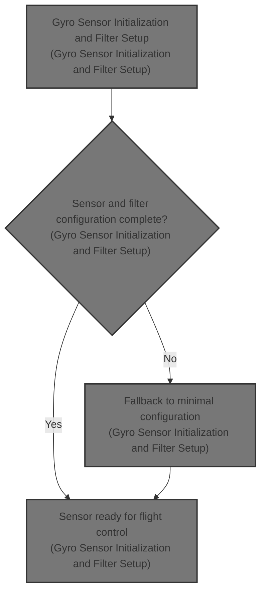

This document outlines the process of preparing the gyro sensor for flight control by performing all necessary initialization and configuration steps. The sensor is enabled, configured for the correct range and output rate, and digital filtering features are set up according to hardware capabilities, ensuring accurate motion data for stabilization and control.



# Gyro Sensor Initialization and Filter Setup

```mermaid
%%{init: {"flowchart": {"defaultRenderer": "elk"}} }%%
flowchart TD
    node1["Begin sensor initialization"] --> node2["Initialize gyro and set SPI speed"]
    click node1 openCode "src/main/drivers/accgyro/accgyro_spi_icm456xx.c:403:406"
    click node2 openCode "src/main/drivers/accgyro/accgyro_spi_icm456xx.c:407:409"
    node2 --> node3["Enable accelerometer and gyroscope"]
    click node3 openCode "src/main/drivers/accgyro/accgyro_spi_icm456xx.c:414:416"
    node3 --> node4{"Sensor type detected?"}
    click node4 openCode "src/main/drivers/accgyro/accgyro_spi_icm456xx.c:418:426"
    node4 -->|"ICM_45686_SPI or ICM_45605_SPI"| node5["Configure accelerometer: 16g, 1.6kHz"]
    click node5 openCode "src/main/drivers/accgyro/accgyro_spi_icm456xx.c:421:423"
    node4 -->|"Other"| node7["Skip accelerometer config"]
    click node7 openCode "src/main/drivers/accgyro/accgyro_spi_icm456xx.c:424:426"
    node5 --> node8["Enable Anti-Alias Filter and Interpolator"]
    node7 --> node8
    click node8 openCode "src/main/drivers/accgyro/accgyro_spi_icm456xx.c:429:432"
    node8 --> node9{"AAF/Interpolator enabled?"}
    click node9 openCode "src/main/drivers/accgyro/accgyro_spi_icm456xx.c:429:432"
    node9 -->|"Yes"| node10["Configure Gyro LPF"]
    click node10 openCode "src/main/drivers/accgyro/accgyro_spi_icm456xx.c:434:438"
    node9 -->|"No"| node11["Disable AAF/Interpolator"]
    click node11 openCode "src/main/drivers/accgyro/accgyro_spi_icm456xx.c:431:432"
    node11 --> node10
    node10 --> node12{"LPF configured?"}
    click node12 openCode "src/main/drivers/accgyro/accgyro_spi_icm456xx.c:435:438"
    node12 -->|"Yes"| node13["Set gyro scale: 2000DPS, rate: 6400Hz"]
    click node13 openCode "src/main/drivers/accgyro/accgyro_spi_icm456xx.c:444:448"
    node12 -->|"No"| node14["Set LPF to bypass (Reduced filtering)"]
    click node14 openCode "src/main/drivers/accgyro/accgyro_spi_icm456xx.c:437:438"
    node14 --> node13
    node13 --> node15["Configure interrupts and DMA"]
    click node15 openCode "src/main/drivers/accgyro/accgyro_spi_icm456xx.c:454:463"
    node15 --> node16["Initialization complete"]
    click node16 openCode "src/main/drivers/accgyro/accgyro_spi_icm456xx.c:464:464"
classDef HeadingStyle fill:#777777,stroke:#333,stroke-width:2px;

%% Swimm:
%% %%{init: {"flowchart": {"defaultRenderer": "elk"}} }%%
%% flowchart TD
%%     node1["Begin sensor initialization"] --> node2["Initialize gyro and set SPI speed"]
%%     click node1 openCode "<SwmPath>[src/…/accgyro/accgyro_spi_icm456xx.c](src/main/drivers/accgyro/accgyro_spi_icm456xx.c)</SwmPath>:403:406"
%%     click node2 openCode "<SwmPath>[src/…/accgyro/accgyro_spi_icm456xx.c](src/main/drivers/accgyro/accgyro_spi_icm456xx.c)</SwmPath>:407:409"
%%     node2 --> node3["Enable accelerometer and gyroscope"]
%%     click node3 openCode "<SwmPath>[src/…/accgyro/accgyro_spi_icm456xx.c](src/main/drivers/accgyro/accgyro_spi_icm456xx.c)</SwmPath>:414:416"
%%     node3 --> node4{"Sensor type detected?"}
%%     click node4 openCode "<SwmPath>[src/…/accgyro/accgyro_spi_icm456xx.c](src/main/drivers/accgyro/accgyro_spi_icm456xx.c)</SwmPath>:418:426"
%%     node4 -->|"<SwmToken path="src/main/drivers/accgyro/accgyro_spi_icm456xx.c" pos="419:3:3" line-data="    case ICM_45686_SPI:">`ICM_45686_SPI`</SwmToken> or <SwmToken path="src/main/drivers/accgyro/accgyro_spi_icm456xx.c" pos="420:3:3" line-data="    case ICM_45605_SPI:">`ICM_45605_SPI`</SwmToken>"| node5["Configure accelerometer: <SwmToken path="src/main/drivers/accgyro/accgyro_spi_icm456xx.c" pos="417:14:14" line-data="    // Configure accelerometer full-scale range (16g mode)">`16g`</SwmToken>, 1.6kHz"]
%%     click node5 openCode "<SwmPath>[src/…/accgyro/accgyro_spi_icm456xx.c](src/main/drivers/accgyro/accgyro_spi_icm456xx.c)</SwmPath>:421:423"
%%     node4 -->|"Other"| node7["Skip accelerometer config"]
%%     click node7 openCode "<SwmPath>[src/…/accgyro/accgyro_spi_icm456xx.c](src/main/drivers/accgyro/accgyro_spi_icm456xx.c)</SwmPath>:424:426"
%%     node5 --> node8["Enable <SwmToken path="src/main/drivers/accgyro/accgyro_spi_icm456xx.c" pos="428:5:7" line-data="    // Enable Anti-Alias (AAF) Filter and Interpolator for Gyro (Section 7.2 of datasheet)">`Anti-Alias`</SwmToken> Filter and Interpolator"]
%%     node7 --> node8
%%     click node8 openCode "<SwmPath>[src/…/accgyro/accgyro_spi_icm456xx.c](src/main/drivers/accgyro/accgyro_spi_icm456xx.c)</SwmPath>:429:432"
%%     node8 --> node9{"<SwmToken path="src/main/drivers/accgyro/accgyro_spi_icm456xx.c" pos="430:3:5" line-data="        // AAF/Interpolator initialization failed, fallback to disabled state">`AAF/Interpolator`</SwmToken> enabled?"}
%%     click node9 openCode "<SwmPath>[src/…/accgyro/accgyro_spi_icm456xx.c](src/main/drivers/accgyro/accgyro_spi_icm456xx.c)</SwmPath>:429:432"
%%     node9 -->|"Yes"| node10["Configure Gyro LPF"]
%%     click node10 openCode "<SwmPath>[src/…/accgyro/accgyro_spi_icm456xx.c](src/main/drivers/accgyro/accgyro_spi_icm456xx.c)</SwmPath>:434:438"
%%     node9 -->|"No"| node11["Disable <SwmToken path="src/main/drivers/accgyro/accgyro_spi_icm456xx.c" pos="430:3:5" line-data="        // AAF/Interpolator initialization failed, fallback to disabled state">`AAF/Interpolator`</SwmToken>"]
%%     click node11 openCode "<SwmPath>[src/…/accgyro/accgyro_spi_icm456xx.c](src/main/drivers/accgyro/accgyro_spi_icm456xx.c)</SwmPath>:431:432"
%%     node11 --> node10
%%     node10 --> node12{"LPF configured?"}
%%     click node12 openCode "<SwmPath>[src/…/accgyro/accgyro_spi_icm456xx.c](src/main/drivers/accgyro/accgyro_spi_icm456xx.c)</SwmPath>:435:438"
%%     node12 -->|"Yes"| node13["Set gyro scale: 2000DPS, rate: 6400Hz"]
%%     click node13 openCode "<SwmPath>[src/…/accgyro/accgyro_spi_icm456xx.c](src/main/drivers/accgyro/accgyro_spi_icm456xx.c)</SwmPath>:444:448"
%%     node12 -->|"No"| node14["Set LPF to bypass (Reduced filtering)"]
%%     click node14 openCode "<SwmPath>[src/…/accgyro/accgyro_spi_icm456xx.c](src/main/drivers/accgyro/accgyro_spi_icm456xx.c)</SwmPath>:437:438"
%%     node14 --> node13
%%     node13 --> node15["Configure interrupts and DMA"]
%%     click node15 openCode "<SwmPath>[src/…/accgyro/accgyro_spi_icm456xx.c](src/main/drivers/accgyro/accgyro_spi_icm456xx.c)</SwmPath>:454:463"
%%     node15 --> node16["Initialization complete"]
%%     click node16 openCode "<SwmPath>[src/…/accgyro/accgyro_spi_icm456xx.c](src/main/drivers/accgyro/accgyro_spi_icm456xx.c)</SwmPath>:464:464"
%% classDef HeadingStyle fill:#777777,stroke:#333,stroke-width:2px;
```



<SwmSnippet path="/src/main/drivers/accgyro/accgyro_spi_icm456xx.c" line="403">

---

In <SwmToken path="src/main/drivers/accgyro/accgyro_spi_icm456xx.c" pos="403:2:2" line-data="void icm456xxGyroInit(gyroDev_t *gyro)">`icm456xxGyroInit`</SwmToken> we set up the SPI clock, initialize the base gyro, enable both the accelerometer and gyro, and wait for them to stabilize. We then configure the accelerometer's range and output rate based on the detected sensor. Next, we try to enable the <SwmToken path="src/main/drivers/accgyro/accgyro_spi_icm456xx.c" pos="428:5:7" line-data="    // Enable Anti-Alias (AAF) Filter and Interpolator for Gyro (Section 7.2 of datasheet)">`Anti-Alias`</SwmToken> Filter and Interpolator for the gyro. If that fails, we disable them to keep the gyro functional. Calling <SwmToken path="src/main/drivers/accgyro/accgyro_spi_icm456xx.c" pos="429:5:5" line-data="    if (!icm456xx_enableAAFandInterpolator(dev, ICM456XX_GYRO_SRC_CTRL_IREG_ADDR, true, true)) {">`icm456xx_enableAAFandInterpolator`</SwmToken> here is about setting up the gyro's digital filtering and interpolation features as early as possible, so the rest of the config can assume the right filter state.

```c
void icm456xxGyroInit(gyroDev_t *gyro)
{
    const extDevice_t *dev = &gyro->dev;

    spiSetClkDivisor(dev, spiCalculateDivider(ICM456XX_MAX_SPI_CLK_HZ));

    mpuGyroInit(gyro);

    // ICM-45686 does not use bank switching (register 0x75 is reserved)
    // Enable both accelerometer and gyroscope sensors

    icm456xx_enableSensors(dev, true);
    delay(ICM456XX_SENSOR_ENABLE_DELAY_MS); // Allow sensors to power on and stabilize

    // Configure accelerometer full-scale range (16g mode)
    switch (gyro->mpuDetectionResult.sensor) {
    case ICM_45686_SPI:
    case ICM_45605_SPI:
        spiWriteReg(dev, ICM456XX_ACCEL_CONFIG0, ICM456XX_ACCEL_FS_SEL_16G | ICM456XX_ACCEL_ODR_1K6_LN);
        delay(ICM456XX_ACCEL_STARTUP_TIME_MS); // Per datasheet Table 9-6: 10ms minimum startup time
        break;
    default:
        break;
    }

    // Enable Anti-Alias (AAF) Filter and Interpolator for Gyro (Section 7.2 of datasheet)
    if (!icm456xx_enableAAFandInterpolator(dev, ICM456XX_GYRO_SRC_CTRL_IREG_ADDR, true, true)) {
        // AAF/Interpolator initialization failed, fallback to disabled state
        icm456xx_enableAAFandInterpolator(dev, ICM456XX_GYRO_SRC_CTRL_IREG_ADDR, false, false);
    }

```

---

</SwmSnippet>

<SwmSnippet path="/src/main/drivers/accgyro/accgyro_spi_icm456xx.c" line="342">

---

<SwmToken path="src/main/drivers/accgyro/accgyro_spi_icm456xx.c" pos="342:4:4" line-data="static bool icm456xx_enableAAFandInterpolator(const extDevice_t *dev, uint16_t reg, bool enableAAF, bool enableInterp)">`icm456xx_enableAAFandInterpolator`</SwmToken> builds a bitmask from the <SwmToken path="src/main/drivers/accgyro/accgyro_spi_icm456xx.c" pos="342:21:21" line-data="static bool icm456xx_enableAAFandInterpolator(const extDevice_t *dev, uint16_t reg, bool enableAAF, bool enableInterp)">`enableAAF`</SwmToken> and <SwmToken path="src/main/drivers/accgyro/accgyro_spi_icm456xx.c" pos="342:26:26" line-data="static bool icm456xx_enableAAFandInterpolator(const extDevice_t *dev, uint16_t reg, bool enableAAF, bool enableInterp)">`enableInterp`</SwmToken> flags using bitwise OR, then writes that to the device register. This toggles the AAF and Interpolator features on or off in one go, as required by the hardware.

```c
static bool icm456xx_enableAAFandInterpolator(const extDevice_t *dev, uint16_t reg, bool enableAAF, bool enableInterp)
{
    const uint8_t value = (enableAAF ? ICM456XX_SRC_CTRL_AAF_ENABLE_BIT : 0)
                        | (enableInterp ? ICM456XX_SRC_CTRL_INTERP_ENABLE_BIT : 0);
    return icm456xx_write_ireg(dev, reg, value);
}
```

---

</SwmSnippet>

<SwmSnippet path="/src/main/drivers/accgyro/accgyro_spi_icm456xx.c" line="434">

---

Back in <SwmToken path="src/main/drivers/accgyro/accgyro_spi_icm456xx.c" pos="403:2:2" line-data="void icm456xxGyroInit(gyroDev_t *gyro)">`icm456xxGyroInit`</SwmToken>, after handling the <SwmToken path="src/main/drivers/accgyro/accgyro_spi_icm456xx.c" pos="430:3:5" line-data="        // AAF/Interpolator initialization failed, fallback to disabled state">`AAF/Interpolator`</SwmToken>, we set up the gyro's low pass filter (LPF) by calling <SwmToken path="src/main/drivers/accgyro/accgyro_spi_icm456xx.c" pos="435:5:5" line-data="    if (!icm456xx_configureLPF(dev, ICM456XX_GYRO_UI_LPF_CFG_IREG_ADDR, getGyroLpfConfig(gyroConfig()-&gt;gyro_hardware_lpf))) {">`icm456xx_configureLPF`</SwmToken>. If that fails, we bypass the LPF so the gyro keeps working, just without that filter. This keeps the sensor usable even if the filter config doesn't stick.

```c
    // Set the Gyro UI LPF bandwidth cut-off (Section 7.3 of datasheet)
    if (!icm456xx_configureLPF(dev, ICM456XX_GYRO_UI_LPF_CFG_IREG_ADDR, getGyroLpfConfig(gyroConfig()->gyro_hardware_lpf))) {
        // If LPF configuration fails, fallback to BYPASS
        icm456xx_configureLPF(dev, ICM456XX_GYRO_UI_LPF_CFG_IREG_ADDR, ICM456XX_GYRO_UI_LPFBW_BYPASS);
    }

```

---

</SwmSnippet>

<SwmSnippet path="/src/main/drivers/accgyro/accgyro_spi_icm456xx.c" line="349">

---

<SwmToken path="src/main/drivers/accgyro/accgyro_spi_icm456xx.c" pos="349:4:4" line-data="static bool icm456xx_configureLPF(const extDevice_t *dev, uint16_t reg, uint8_t lpfDiv)">`icm456xx_configureLPF`</SwmToken> checks that the LPF divider value is in range, masks it to 3 bits, and writes it to the device register. This sets the gyro's low pass filter bandwidth as expected by the hardware.

```c
static bool icm456xx_configureLPF(const extDevice_t *dev, uint16_t reg, uint8_t lpfDiv)
{
    if (lpfDiv > 0x07) {
        return false;
    }

    return icm456xx_write_ireg(dev, reg, lpfDiv & 0x07);
}
```

---

</SwmSnippet>

<SwmSnippet path="/src/main/drivers/accgyro/accgyro_spi_icm456xx.c" line="440">

---

After <SwmToken path="src/main/drivers/accgyro/accgyro_spi_icm456xx.c" pos="349:4:4" line-data="static bool icm456xx_configureLPF(const extDevice_t *dev, uint16_t reg, uint8_t lpfDiv)">`icm456xx_configureLPF`</SwmToken>, <SwmToken path="src/main/drivers/accgyro/accgyro_spi_icm456xx.c" pos="403:2:2" line-data="void icm456xxGyroInit(gyroDev_t *gyro)">`icm456xxGyroInit`</SwmToken> finishes by setting the gyro's scale, sample rate, interrupt config, and DMA register addresses for efficient data reads.

```c
    switch (gyro->mpuDetectionResult.sensor) {
    case ICM_45686_SPI:
    case ICM_45605_SPI:
    default:
        gyro->scale = GYRO_SCALE_2000DPS;
        gyro->gyroRateKHz = GYRO_RATE_6400_Hz;
        gyro->gyroSampleRateHz = 6400;
        spiWriteReg(dev, ICM456XX_GYRO_CONFIG0, ICM456XX_GYRO_FS_SEL_2000DPS | ICM456XX_GYRO_ODR_6K4_LN);
        delay(ICM456XX_GYRO_STARTUP_TIME_MS); // Per datasheet Table 9-6: 35ms minimum startup time
        break;
    }

    gyro->gyroShortPeriod = clockMicrosToCycles(HZ_TO_US(gyro->gyroSampleRateHz));

    spiWriteReg(dev, ICM456XX_INT1_CONFIG2, ICM456XX_INT1_MODE_PULSED | ICM456XX_INT1_DRIVE_CIRCUIT_PP |
                                            ICM456XX_INT1_POLARITY_ACTIVE_HIGH);

    spiWriteReg(dev, ICM456XX_INT1_CONFIG0, ICM456XX_INT1_STATUS_EN_DRDY);

    // Set up register addresses for combined DMA reads
    // ICM456xx data is contiguous: accel at 0x00, gyro at 0x06
    gyro->accDataReg = ICM456XX_ACCEL_DATA_X1_UI;  // 0x00
    gyro->gyroDataReg = ICM456XX_GYRO_DATA_X1_UI;  // 0x06
    gyro->gyroDmaMaxDuration = 0;  // Data ready interrupt ensures timely reads
}
```

---

</SwmSnippet>

&nbsp;

*This is an auto-generated document by Swimm 🌊 and has not yet been verified by a human*

<SwmMeta version="3.0.0" repo-id="Z2l0aHViJTNBJTNBYy1iZXRhZmxpZ2h0JTNBJTNBcmljYXJkb2xvcGV6Zw==" repo-name="c-betaflight"><sup>Powered by [Swimm](https://app.swimm.io/)</sup></SwmMeta>
