```mermaid
%%{init: {"flowchart": {"defaultRenderer": "elk"}} }%%
flowchart TD
  node1["Detect I2C error"]
  click node1 openCode "src/platform/STM32/bus_i2c_stm32f4xx.c:297:299"
  node1 --> node2{"Was an I2C error detected?"}
  click node2 openCode "src/platform/STM32/bus_i2c_stm32f4xx.c:299:300"
  node2 -->|"Yes"| node3["Mark device as errored"]
  click node3 openCode "src/platform/STM32/bus_i2c_stm32f4xx.c:300:300"
  node3 --> node4{"Is error arbitration lost?"}
  click node4 openCode "src/platform/STM32/bus_i2c_stm32f4xx.c:306:307"
  node4 -->|"Yes"| node12["Clear error flags and reset busy state"]
  click node12 openCode "src/platform/STM32/bus_i2c_stm32f4xx.c:319:321"
  node4 -->|"No"| node5{"Is bus sending START?"}
  click node5 openCode "src/platform/STM32/bus_i2c_stm32f4xx.c:307:308"
  subgraph loop1["Wait for START to finish"]
    node5 -->|"Yes"| node6["Wait until START clears"]
    click node6 openCode "src/platform/STM32/bus_i2c_stm32f4xx.c:308:309"
    node6 --> node7["Send STOP to finalize transaction"]
    click node7 openCode "src/platform/STM32/bus_i2c_stm32f4xx.c:309:310"
    node7 --> node8["Wait until STOP clears"]
    click node8 openCode "src/platform/STM32/bus_i2c_stm32f4xx.c:310:311"
    node8 --> node9["Reset I2C hardware"]
    click node9 openCode "src/platform/STM32/bus_i2c_stm32f4xx.c:311:312"
    node9 --> node12
  end
  node5 -->|"No"| node10["Send STOP to free bus"]
  click node10 openCode "src/platform/STM32/bus_i2c_stm32f4xx.c:314:315"
  node10 --> node11["Disable interrupts while bus inactive"]
  click node11 openCode "src/platform/STM32/bus_i2c_stm32f4xx.c:315:316"
  node11 --> node12
  node2 -->|"No"| node12
  click node12 openCode "src/platform/STM32/bus_i2c_stm32f4xx.c:319:321"
classDef HeadingStyle fill:#777777,stroke:#333,stroke-width:2px;

%% Swimm:
%% %%{init: {"flowchart": {"defaultRenderer": "elk"}} }%%
%% flowchart TD
%%   node1["Detect <SwmToken path="src/platform/STM32/bus_i2c_stm32f4xx.c" pos="493:3:3" line-data="    // I2C ER Interrupt">`I2C`</SwmToken> error"]
%%   click node1 openCode "<SwmPath>[src/…/STM32/bus_i2c_stm32f4xx.c](src/platform/STM32/bus_i2c_stm32f4xx.c)</SwmPath>:297:299"
%%   node1 --> node2{"Was an <SwmToken path="src/platform/STM32/bus_i2c_stm32f4xx.c" pos="493:3:3" line-data="    // I2C ER Interrupt">`I2C`</SwmToken> error detected?"}
%%   click node2 openCode "<SwmPath>[src/…/STM32/bus_i2c_stm32f4xx.c](src/platform/STM32/bus_i2c_stm32f4xx.c)</SwmPath>:299:300"
%%   node2 -->|"Yes"| node3["Mark device as errored"]
%%   click node3 openCode "<SwmPath>[src/…/STM32/bus_i2c_stm32f4xx.c](src/platform/STM32/bus_i2c_stm32f4xx.c)</SwmPath>:300:300"
%%   node3 --> node4{"Is error arbitration lost?"}
%%   click node4 openCode "<SwmPath>[src/…/STM32/bus_i2c_stm32f4xx.c](src/platform/STM32/bus_i2c_stm32f4xx.c)</SwmPath>:306:307"
%%   node4 -->|"Yes"| node12["Clear error flags and reset busy state"]
%%   click node12 openCode "<SwmPath>[src/…/STM32/bus_i2c_stm32f4xx.c](src/platform/STM32/bus_i2c_stm32f4xx.c)</SwmPath>:319:321"
%%   node4 -->|"No"| node5{"Is bus sending START?"}
%%   click node5 openCode "<SwmPath>[src/…/STM32/bus_i2c_stm32f4xx.c](src/platform/STM32/bus_i2c_stm32f4xx.c)</SwmPath>:307:308"
%%   subgraph loop1["Wait for START to finish"]
%%     node5 -->|"Yes"| node6["Wait until START clears"]
%%     click node6 openCode "<SwmPath>[src/…/STM32/bus_i2c_stm32f4xx.c](src/platform/STM32/bus_i2c_stm32f4xx.c)</SwmPath>:308:309"
%%     node6 --> node7["Send STOP to finalize transaction"]
%%     click node7 openCode "<SwmPath>[src/…/STM32/bus_i2c_stm32f4xx.c](src/platform/STM32/bus_i2c_stm32f4xx.c)</SwmPath>:309:310"
%%     node7 --> node8["Wait until STOP clears"]
%%     click node8 openCode "<SwmPath>[src/…/STM32/bus_i2c_stm32f4xx.c](src/platform/STM32/bus_i2c_stm32f4xx.c)</SwmPath>:310:311"
%%     node8 --> node9["Reset <SwmToken path="src/platform/STM32/bus_i2c_stm32f4xx.c" pos="493:3:3" line-data="    // I2C ER Interrupt">`I2C`</SwmToken> hardware"]
%%     click node9 openCode "<SwmPath>[src/…/STM32/bus_i2c_stm32f4xx.c](src/platform/STM32/bus_i2c_stm32f4xx.c)</SwmPath>:311:312"
%%     node9 --> node12
%%   end
%%   node5 -->|"No"| node10["Send STOP to free bus"]
%%   click node10 openCode "<SwmPath>[src/…/STM32/bus_i2c_stm32f4xx.c](src/platform/STM32/bus_i2c_stm32f4xx.c)</SwmPath>:314:315"
%%   node10 --> node11["Disable interrupts while bus inactive"]
%%   click node11 openCode "<SwmPath>[src/…/STM32/bus_i2c_stm32f4xx.c](src/platform/STM32/bus_i2c_stm32f4xx.c)</SwmPath>:315:316"
%%   node11 --> node12
%%   node2 -->|"No"| node12
%%   click node12 openCode "<SwmPath>[src/…/STM32/bus_i2c_stm32f4xx.c](src/platform/STM32/bus_i2c_stm32f4xx.c)</SwmPath>:319:321"
%% classDef HeadingStyle fill:#777777,stroke:#333,stroke-width:2px;
```

This document explains how error interrupts from the <SwmToken path="src/platform/STM32/bus_i2c_stm32f4xx.c" pos="97:6:6" line-data="        .reg = I2C3,">`I2C3`</SwmToken> bus are handled to maintain reliable communication. When an error occurs, the system automatically detects the issue and initiates a recovery process, ensuring the <SwmToken path="src/platform/STM32/bus_i2c_stm32f4xx.c" pos="97:6:6" line-data="        .reg = I2C3,">`I2C3`</SwmToken> bus is restored for continued operation.

# Handling <SwmToken path="src/platform/STM32/bus_i2c_stm32f4xx.c" pos="97:6:6" line-data="        .reg = I2C3,">`I2C3`</SwmToken> Error Interrupts

<SwmSnippet path="/src/platform/STM32/bus_i2c_stm32f4xx.c" line="150">

---

<SwmToken path="src/platform/STM32/bus_i2c_stm32f4xx.c" pos="150:2:2" line-data="void I2C3_ER_IRQHandler(void)">`I2C3_ER_IRQHandler`</SwmToken> kicks off the error handling flow for <SwmToken path="src/platform/STM32/bus_i2c_stm32f4xx.c" pos="97:6:6" line-data="        .reg = I2C3,">`I2C3`</SwmToken> by calling <SwmToken path="src/platform/STM32/bus_i2c_stm32f4xx.c" pos="152:1:1" line-data="    i2c_er_handler(I2CDEV_3);">`i2c_er_handler`</SwmToken> with the <SwmToken path="src/platform/STM32/bus_i2c_stm32f4xx.c" pos="152:3:3" line-data="    i2c_er_handler(I2CDEV_3);">`I2CDEV_3`</SwmToken> identifier. This keeps the IRQ handler lean and lets the shared handler deal with the specifics, so we don't duplicate logic for each <SwmToken path="src/platform/STM32/bus_i2c_stm32f4xx.c" pos="493:3:3" line-data="    // I2C ER Interrupt">`I2C`</SwmToken> device.

```c
void I2C3_ER_IRQHandler(void)
{
    i2c_er_handler(I2CDEV_3);
}
```

---

</SwmSnippet>

# Processing and Recovering from <SwmToken path="src/platform/STM32/bus_i2c_stm32f4xx.c" pos="493:3:3" line-data="    // I2C ER Interrupt">`I2C`</SwmToken> Errors



<SwmSnippet path="/src/platform/STM32/bus_i2c_stm32f4xx.c" line="290">

---

In <SwmToken path="src/platform/STM32/bus_i2c_stm32f4xx.c" pos="290:4:4" line-data="static void i2c_er_handler(i2cDevice_e device)">`i2c_er_handler`</SwmToken>, we check the <SwmToken path="src/platform/STM32/bus_i2c_stm32f4xx.c" pos="493:3:3" line-data="    // I2C ER Interrupt">`I2C`</SwmToken> status register for error flags and mark the device as errored if needed. For bus errors, arbitration loss, or acknowledge failures, we try to recover by disabling interrupts, clearing ADDR, and sending STOP. If the peripheral is stuck sending START, we wait it out, send STOP, and then call <SwmToken path="src/platform/STM32/bus_i2c_stm32f4xx.c" pos="311:1:1" line-data="                i2cInit(device);                                                // reset and configure the hardware">`i2cInit`</SwmToken> to reset the hardware so it doesn't stay locked up.

```c
static void i2c_er_handler(i2cDevice_e device)
{
    I2C_TypeDef *I2Cx = i2cDevice[device].hardware->reg;

    i2cState_t *state = &i2cDevice[device].state;

    // Read the I2C1 status register
    volatile uint32_t SR1Register = I2Cx->SR1;

    if (SR1Register & (I2C_SR1_BERR | I2C_SR1_ARLO | I2C_SR1_AF | I2C_SR1_OVR)) // an error
        state->error = true;

    // If AF, BERR or ARLO, abandon the current job and commence new if there are jobs
    if (SR1Register & (I2C_SR1_BERR | I2C_SR1_ARLO | I2C_SR1_AF)) {
        (void)I2Cx->SR2;                                                        // read second status register to clear ADDR if it is set (note that BTF will not be set after a NACK)
        I2C_ITConfig(I2Cx, I2C_IT_BUF, DISABLE);                                // disable the RXNE/TXE interrupt - prevent the ISR tailchaining onto the ER (hopefully)
        if (!(SR1Register & I2C_SR1_ARLO) && !(I2Cx->CR1 & I2C_CR1_STOP)) {     // if we dont have an ARLO error, ensure sending of a stop
            if (I2Cx->CR1 & I2C_CR1_START) {                                    // We are currently trying to send a start, this is very bad as start, stop will hang the peripheral
                while (I2Cx->CR1 & I2C_CR1_START) {; }                         // wait for any start to finish sending
                I2C_GenerateSTOP(I2Cx, ENABLE);                                 // send stop to finalise bus transaction
                while (I2Cx->CR1 & I2C_CR1_STOP) {; }                          // wait for stop to finish sending
                i2cInit(device);                                                // reset and configure the hardware
            }
            else {
                I2C_GenerateSTOP(I2Cx, ENABLE);                                 // stop to free up the bus
                I2C_ITConfig(I2Cx, I2C_IT_EVT | I2C_IT_ERR, DISABLE);           // Disable EVT and ERR interrupts while bus inactive
            }
        }
    }
```

---

</SwmSnippet>

<SwmSnippet path="/src/platform/STM32/bus_i2c_stm32f4xx.c" line="437">

---

I2cInit resets and configures the <SwmToken path="src/platform/STM32/bus_i2c_stm32f4xx.c" pos="493:3:3" line-data="    // I2C ER Interrupt">`I2C`</SwmToken> peripheral using repo-specific abstractions for devices and pins. It makes sure the pins are owned, enables the clock, disables interrupts, and calls <SwmToken path="src/platform/STM32/bus_i2c_stm32f4xx.c" pos="466:1:1" line-data="    i2cUnstick(scl, sda);">`i2cUnstick`</SwmToken> to free up the bus if it's stuck. GPIO configuration is hardware-dependent, and finally, it sets up the peripheral and NVIC interrupts for both error and event handling.

```c
void i2cInit(i2cDevice_e device)
{
    if (device == I2CINVALID)
        return;

    i2cDevice_t *pDev = &i2cDevice[device];
    const i2cHardware_t *hw = pDev->hardware;
    const IO_t scl = pDev->scl;
    const IO_t sda = pDev->sda;

    if (!hw || IOGetOwner(scl) || IOGetOwner(sda)) {
        return;
    }

    I2C_TypeDef *I2Cx = hw->reg;

    memset(&pDev->state, 0, sizeof(pDev->state));

    NVIC_InitTypeDef nvic;
    I2C_InitTypeDef i2cInit;

    IOInit(scl, OWNER_I2C_SCL, RESOURCE_INDEX(device));
    IOInit(sda, OWNER_I2C_SDA, RESOURCE_INDEX(device));

    // Enable RCC
    RCC_ClockCmd(hw->rcc, ENABLE);

    I2C_ITConfig(I2Cx, I2C_IT_EVT | I2C_IT_ERR, DISABLE);

    i2cUnstick(scl, sda);

    // Init pins
#ifdef STM32F4
    IOConfigGPIOAF(scl, pDev->pullUp ? IOCFG_I2C_PU : IOCFG_I2C, pDev->sclAF);
    IOConfigGPIOAF(sda, pDev->pullUp ? IOCFG_I2C_PU : IOCFG_I2C, pDev->sdaAF);
#else
    IOConfigGPIO(scl, IOCFG_I2C);
    IOConfigGPIO(sda, IOCFG_I2C);
#endif

    I2C_DeInit(I2Cx);
    I2C_StructInit(&i2cInit);

    I2C_ITConfig(I2Cx, I2C_IT_EVT | I2C_IT_ERR, DISABLE);               // Disable EVT and ERR interrupts - they are enabled by the first request
    i2cInit.I2C_Mode = I2C_Mode_I2C;
    i2cInit.I2C_DutyCycle = I2C_DutyCycle_2;
    i2cInit.I2C_OwnAddress1 = 0;
    i2cInit.I2C_Ack = I2C_Ack_Enable;
    i2cInit.I2C_AcknowledgedAddress = I2C_AcknowledgedAddress_7bit;
    i2cInit.I2C_ClockSpeed = pDev->clockSpeed * 1000;

    I2C_Cmd(I2Cx, ENABLE);
    I2C_Init(I2Cx, &i2cInit);

    I2C_StretchClockCmd(I2Cx, ENABLE);

    // I2C ER Interrupt
    nvic.NVIC_IRQChannel = hw->er_irq;
    nvic.NVIC_IRQChannelPreemptionPriority = NVIC_PRIORITY_BASE(NVIC_PRIO_I2C_ER);
    nvic.NVIC_IRQChannelSubPriority = NVIC_PRIORITY_SUB(NVIC_PRIO_I2C_ER);
    nvic.NVIC_IRQChannelCmd = ENABLE;
    NVIC_Init(&nvic);

    // I2C EV Interrupt
    nvic.NVIC_IRQChannel = hw->ev_irq;
    nvic.NVIC_IRQChannelPreemptionPriority = NVIC_PRIORITY_BASE(NVIC_PRIO_I2C_EV);
    nvic.NVIC_IRQChannelSubPriority = NVIC_PRIORITY_SUB(NVIC_PRIO_I2C_EV);
    NVIC_Init(&nvic);
}
```

---

</SwmSnippet>

<SwmSnippet path="/src/platform/STM32/bus_i2c_stm32f4xx.c" line="319">

---

Back in <SwmToken path="src/platform/STM32/bus_i2c_stm32f4xx.c" pos="152:1:1" line-data="    i2c_er_handler(I2CDEV_3);">`i2c_er_handler`</SwmToken> after returning from <SwmToken path="src/platform/STM32/bus_i2c_stm32f4xx.c" pos="311:1:1" line-data="                i2cInit(device);                                                // reset and configure the hardware">`i2cInit`</SwmToken>, we clear all error flags in <SwmToken path="src/platform/STM32/bus_i2c_stm32f4xx.c" pos="319:3:3" line-data="    I2Cx-&gt;SR1 &amp;= ~(I2C_SR1_BERR | I2C_SR1_ARLO | I2C_SR1_AF | I2C_SR1_OVR);     // reset all the error bits to clear the interrupt">`SR1`</SwmToken> and reset the busy state. This wraps up the error handling and makes sure the peripheral is ready for whatever comes next.

```c
    I2Cx->SR1 &= ~(I2C_SR1_BERR | I2C_SR1_ARLO | I2C_SR1_AF | I2C_SR1_OVR);     // reset all the error bits to clear the interrupt
    state->busy = 0;
}
```

---

</SwmSnippet>

&nbsp;

*This is an auto-generated document by Swimm 🌊 and has not yet been verified by a human*

<SwmMeta version="3.0.0" repo-id="Z2l0aHViJTNBJTNBYy1iZXRhZmxpZ2h0JTNBJTNBcmljYXJkb2xvcGV6Zw==" repo-name="c-betaflight"><sup>Powered by [Swimm](https://app.swimm.io/)</sup></SwmMeta>
