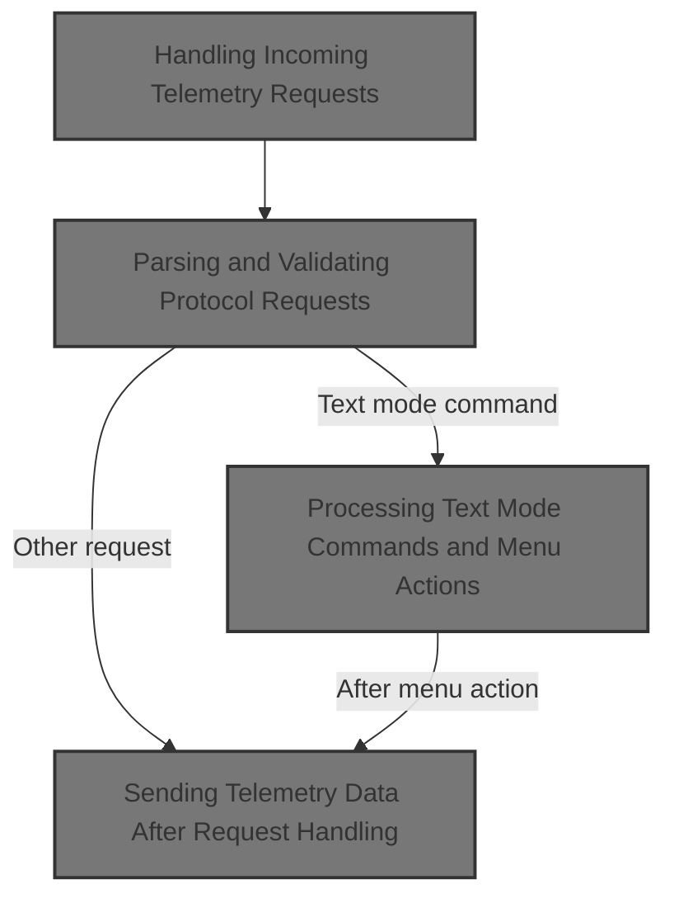

This document outlines how telemetry requests from a connected device are processed to provide telemetry data or handle menu interactions. The flow enables users to receive real-time information and interact with configuration menus through their device.



# Handling Incoming Telemetry Requests

<SwmSnippet path="/src/main/telemetry/hott.c" line="679">

---

In <SwmToken path="src/main/telemetry/hott.c" pos="679:2:2" line-data="void handleHoTTTelemetry(timeUs_t currentTimeUs)">`handleHoTTTelemetry`</SwmToken>, we first check if telemetry is enabled, then prepare messages if it's time, and finally check for incoming <SwmToken path="src/main/telemetry/hott.c" pos="613:15:15" line-data="     * FIXME the first byte of the HoTT request frame is ONLY either 0x80 (binary mode) or 0x7F (text mode).">`HoTT`</SwmToken> requests. Calling <SwmToken path="src/main/telemetry/hott.c" pos="693:1:1" line-data="        hottCheckSerialData(currentTimeUs);">`hottCheckSerialData`</SwmToken> next lets us process any new protocol requests from the serial buffer, which is necessary before we can respond or send telemetry data.

```c
void handleHoTTTelemetry(timeUs_t currentTimeUs)
{
    static timeUs_t serialTimer;

    if (!hottTelemetryEnabled) {
        return;
    }

    if (shouldPrepareHoTTMessages(currentTimeUs)) {
        hottPrepareMessages();
        lastMessagesPreparedAt = currentTimeUs;
    }

    if (shouldCheckForHoTTRequest()) {
        hottCheckSerialData(currentTimeUs);
    }

    if (!hottMsg)
        return;

    if (hottIsSending) {
        if (currentTimeUs - serialTimer < txDelayUs) {
            return;
        }
    }
```

---

</SwmSnippet>

## Parsing and Validating Protocol Requests

```mermaid
%%{init: {"flowchart": {"defaultRenderer": "elk"}} }%%
flowchart TD
    node1["Check for incoming telemetry request"]
    click node1 openCode "src/main/telemetry/hott.c:579:580"
    node1 --> node2{"Enough bytes in buffer? (bytesWaiting > 1)"}
    click node2 openCode "src/main/telemetry/hott.c:583:585"
    node2 -->|"No"| nodeEnd["Stop processing"]
    click nodeEnd openCode "src/main/telemetry/hott.c:586:587"
    node2 -->|"Yes"| node3{"Exactly 2 bytes? (bytesWaiting == 2)"}
    click node3 openCode "src/main/telemetry/hott.c:589:593"
    node3 -->|"No"| nodeFlush["Flush buffer and reset state, wait for next request"]
    click nodeFlush openCode "src/main/telemetry/hott.c:590:592"
    nodeFlush --> nodeEnd
    node3 -->|"Yes"| node4{"Looking for new request?"}
    click node4 openCode "src/main/telemetry/hott.c:595:599"
    node4 -->|"Yes"| nodeSetTime["Record time, wait for next part"]
    click nodeSetTime openCode "src/main/telemetry/hott.c:596:598"
    nodeSetTime --> nodeEnd
    node4 -->|"No"| node5{"Enough time passed?"}
    click node5 openCode "src/main/telemetry/hott.c:600:604"
    node5 -->|"No"| nodeEnd
    node5 -->|"Yes"| node6{"Request type: Binary/No-sensor/Text/Other"}
    click node6 openCode "src/main/telemetry/hott.c:611:625"
    node6 -->|"Binary/No-sensor"| node7["Process binary mode request"]
    click node7 openCode "src/main/telemetry/hott.c:619:619"
    node7 --> nodeEnd
    node6 -->|"Text mode (if enabled)"| node8["Process text mode request"]
    click node8 openCode "src/main/telemetry/hott.c:623:623"
    node8 --> nodeEnd
    node6 -->|"Other"| nodeEnd
classDef HeadingStyle fill:#777777,stroke:#333,stroke-width:2px;

%% Swimm:
%% %%{init: {"flowchart": {"defaultRenderer": "elk"}} }%%
%% flowchart TD
%%     node1["Check for incoming telemetry request"]
%%     click node1 openCode "<SwmPath>[src/…/telemetry/hott.c](src/main/telemetry/hott.c)</SwmPath>:579:580"
%%     node1 --> node2{"Enough bytes in buffer? (<SwmToken path="src/main/telemetry/hott.c" pos="583:5:5" line-data="    const uint8_t bytesWaiting = serialRxBytesWaiting(hottPort);">`bytesWaiting`</SwmToken> > 1)"}
%%     click node2 openCode "<SwmPath>[src/…/telemetry/hott.c](src/main/telemetry/hott.c)</SwmPath>:583:585"
%%     node2 -->|"No"| nodeEnd["Stop processing"]
%%     click nodeEnd openCode "<SwmPath>[src/…/telemetry/hott.c](src/main/telemetry/hott.c)</SwmPath>:586:587"
%%     node2 -->|"Yes"| node3{"Exactly 2 bytes? (<SwmToken path="src/main/telemetry/hott.c" pos="583:5:5" line-data="    const uint8_t bytesWaiting = serialRxBytesWaiting(hottPort);">`bytesWaiting`</SwmToken> == 2)"}
%%     click node3 openCode "<SwmPath>[src/…/telemetry/hott.c](src/main/telemetry/hott.c)</SwmPath>:589:593"
%%     node3 -->|"No"| nodeFlush["Flush buffer and reset state, wait for next request"]
%%     click nodeFlush openCode "<SwmPath>[src/…/telemetry/hott.c](src/main/telemetry/hott.c)</SwmPath>:590:592"
%%     nodeFlush --> nodeEnd
%%     node3 -->|"Yes"| node4{"Looking for new request?"}
%%     click node4 openCode "<SwmPath>[src/…/telemetry/hott.c](src/main/telemetry/hott.c)</SwmPath>:595:599"
%%     node4 -->|"Yes"| nodeSetTime["Record time, wait for next part"]
%%     click nodeSetTime openCode "<SwmPath>[src/…/telemetry/hott.c](src/main/telemetry/hott.c)</SwmPath>:596:598"
%%     nodeSetTime --> nodeEnd
%%     node4 -->|"No"| node5{"Enough time passed?"}
%%     click node5 openCode "<SwmPath>[src/…/telemetry/hott.c](src/main/telemetry/hott.c)</SwmPath>:600:604"
%%     node5 -->|"No"| nodeEnd
%%     node5 -->|"Yes"| node6{"Request type: Binary/No-sensor/Text/Other"}
%%     click node6 openCode "<SwmPath>[src/…/telemetry/hott.c](src/main/telemetry/hott.c)</SwmPath>:611:625"
%%     node6 -->|"Binary/No-sensor"| node7["Process binary mode request"]
%%     click node7 openCode "<SwmPath>[src/…/telemetry/hott.c](src/main/telemetry/hott.c)</SwmPath>:619:619"
%%     node7 --> nodeEnd
%%     node6 -->|"Text mode (if enabled)"| node8["Process text mode request"]
%%     click node8 openCode "<SwmPath>[src/…/telemetry/hott.c](src/main/telemetry/hott.c)</SwmPath>:623:623"
%%     node8 --> nodeEnd
%%     node6 -->|"Other"| nodeEnd
%% classDef HeadingStyle fill:#777777,stroke:#333,stroke-width:2px;
```



<SwmSnippet path="/src/main/telemetry/hott.c" line="579">

---

<SwmToken path="src/main/telemetry/hott.c" pos="579:4:4" line-data="static void hottCheckSerialData(uint32_t currentMicros)">`hottCheckSerialData`</SwmToken> checks for valid protocol requests and, if it's a text mode request, passes control to <SwmToken path="src/main/telemetry/hott.c" pos="623:1:1" line-data="        processHottTextModeRequest(address);">`processHottTextModeRequest`</SwmToken> for further handling.

```c
static void hottCheckSerialData(uint32_t currentMicros)
{
    static bool lookingForRequest = true;

    const uint8_t bytesWaiting = serialRxBytesWaiting(hottPort);

    if (bytesWaiting <= 1) {
        return;
    }

    if (bytesWaiting != 2) {
        flushHottRxBuffer();
        lookingForRequest = true;
        return;
    }

    if (lookingForRequest) {
        lastHoTTRequestCheckAt = currentMicros;
        lookingForRequest = false;
        return;
    } else {
        bool enoughTimePassed = currentMicros - lastHoTTRequestCheckAt >= rxSchedule;

        if (!enoughTimePassed) {
            return;
        }
        lookingForRequest = true;
    }

    const uint8_t requestId = serialRead(hottPort);
    const uint8_t address = serialRead(hottPort);

    if ((requestId == 0) || (requestId == HOTT_BINARY_MODE_REQUEST_ID) || (address == HOTT_TELEMETRY_NO_SENSOR_ID)) {
    /*
     * FIXME the first byte of the HoTT request frame is ONLY either 0x80 (binary mode) or 0x7F (text mode).
     * The binary mode is read as 0x00 (error reading the upper bit) while the text mode is correctly decoded.
     * The (requestId == 0) test is a workaround for detecting the binary mode with no ambiguity as there is only
     * one other valid value (0x7F) for text mode.
     * The error reading for the upper bit should nevertheless be fixed
     */
        processBinaryModeRequest(address);
    }
#if defined(USE_HOTT_TEXTMODE) && defined(USE_CMS)
    else if (requestId == HOTTV4_TEXT_MODE_REQUEST_ID) {
        processHottTextModeRequest(address);
    }
#endif
}
```

---

</SwmSnippet>

## Processing Text Mode Commands and Menu Actions

```mermaid
%%{init: {"flowchart": {"defaultRenderer": "elk"}} }%%
flowchart TD
  node1["Receive telemetry text mode request"] --> node2{"Is text mode alive?"}
  click node1 openCode "src/main/telemetry/hott.c:506:507"
  node2 -->|"No"| node3["Start text mode"]
  click node2 openCode "src/main/telemetry/hott.c:510:513"
  node2 -->|"Yes"| node4{"Is command for EAM sensor text mode?"}
  node3 --> node4
  click node3 openCode "src/main/telemetry/hott.c:511:513"
  node4 -->|"No"| nodeEnd["Do nothing"]
  click node4 openCode "src/main/telemetry/hott.c:515:517"
  node4 -->|"Yes"| node5["Process ESC field and CMS menu logic"]
  click node5 openCode "src/main/telemetry/hott.c:519:528"
  node5 --> node6["Handle key input and send telemetry response"]
  click node6 openCode "src/main/telemetry/hott.c:530:531"
  node6 --> nodeEnd["Done"]
classDef HeadingStyle fill:#777777,stroke:#333,stroke-width:2px;

%% Swimm:
%% %%{init: {"flowchart": {"defaultRenderer": "elk"}} }%%
%% flowchart TD
%%   node1["Receive telemetry text mode request"] --> node2{"Is text mode alive?"}
%%   click node1 openCode "<SwmPath>[src/…/telemetry/hott.c](src/main/telemetry/hott.c)</SwmPath>:506:507"
%%   node2 -->|"No"| node3["Start text mode"]
%%   click node2 openCode "<SwmPath>[src/…/telemetry/hott.c](src/main/telemetry/hott.c)</SwmPath>:510:513"
%%   node2 -->|"Yes"| node4{"Is command for EAM sensor text mode?"}
%%   node3 --> node4
%%   click node3 openCode "<SwmPath>[src/…/telemetry/hott.c](src/main/telemetry/hott.c)</SwmPath>:511:513"
%%   node4 -->|"No"| nodeEnd["Do nothing"]
%%   click node4 openCode "<SwmPath>[src/…/telemetry/hott.c](src/main/telemetry/hott.c)</SwmPath>:515:517"
%%   node4 -->|"Yes"| node5["Process ESC field and CMS menu logic"]
%%   click node5 openCode "<SwmPath>[src/…/telemetry/hott.c](src/main/telemetry/hott.c)</SwmPath>:519:528"
%%   node5 --> node6["Handle key input and send telemetry response"]
%%   click node6 openCode "<SwmPath>[src/…/telemetry/hott.c](src/main/telemetry/hott.c)</SwmPath>:530:531"
%%   node6 --> nodeEnd["Done"]
%% classDef HeadingStyle fill:#777777,stroke:#333,stroke-width:2px;
```



<SwmSnippet path="/src/main/telemetry/hott.c" line="506">

---

In <SwmToken path="src/main/telemetry/hott.c" pos="506:4:4" line-data="static void processHottTextModeRequest(const uint8_t cmd)">`processHottTextModeRequest`</SwmToken>, we check if text mode is active, validate the command, and manage escape sequence state with a static flag. If the command is valid, we either open the CMS or set up for the escape sequence, then call <SwmToken path="src/main/telemetry/hott.c" pos="530:1:1" line-data="    hottSetCmsKey(cmd &amp; 0x0f, hottTextModeMessage.esc == HOTT_TEXTMODE_ESC);">`hottSetCmsKey`</SwmToken> to map the command to a menu action. This call is needed to translate protocol button presses into CMS actions.

```c
static void processHottTextModeRequest(const uint8_t cmd)
{
    static bool setEscBack = false;

    if (!textmodeIsAlive) {
        hottTextmodeStart();
        textmodeIsAlive = true;
    }

    if ((cmd & 0xF0) != HOTT_EAM_SENSOR_TEXT_ID) {
        return;
    }

    if (setEscBack) {
        hottTextModeMessage.esc = HOTT_EAM_SENSOR_TEXT_ID;
        setEscBack = false;
    }

    if (hottTextModeMessage.esc != HOTT_TEXTMODE_ESC) {
        hottCmsOpen();
    } else {
        setEscBack = true;
    }

    hottSetCmsKey(cmd & 0x0f, hottTextModeMessage.esc == HOTT_TEXTMODE_ESC);
```

---

</SwmSnippet>

<SwmSnippet path="/src/main/io/displayport_hott.c" line="159">

---

<SwmToken path="src/main/io/displayport_hott.c" pos="159:2:2" line-data="void hottSetCmsKey(uint8_t hottKey, bool keepCmsOpen)">`hottSetCmsKey`</SwmToken> translates protocol button presses into CMS actions, handling menu state and reopening as needed.

```c
void hottSetCmsKey(uint8_t hottKey, bool keepCmsOpen)
{
    switch (hottKey) {
        case HOTTV4_BUTTON_DEC:
            cmsSetExternKey(CMS_KEY_UP);
            break;
        case HOTTV4_BUTTON_INC:
            cmsSetExternKey(CMS_KEY_DOWN);
            break;
        case HOTTV4_BUTTON_SET:
            if (cmsInMenu) {
                cmsMenuExit(pCurrentDisplay, (void*)CMS_EXIT_SAVE);
            }
            cmsSetExternKey(CMS_KEY_NONE);
            break;
        case HOTTV4_BUTTON_NEXT:
            cmsSetExternKey(CMS_KEY_RIGHT);
            break;
        case HOTTV4_BUTTON_PREV:
            cmsSetExternKey(CMS_KEY_LEFT);
            if (keepCmsOpen) { // Make sure CMS is open until textmode is closed.
                cmsMenuOpen();
            }
            break;
         default:
            cmsSetExternKey(CMS_KEY_NONE);
            break;
        }
}
```

---

</SwmSnippet>

<SwmSnippet path="/src/main/telemetry/hott.c" line="531">

---

After handling the menu action, <SwmToken path="src/main/telemetry/hott.c" pos="506:4:4" line-data="static void processHottTextModeRequest(const uint8_t cmd)">`processHottTextModeRequest`</SwmToken> sends the updated message as the protocol response.

```c
    hottSendResponse((uint8_t *)&hottTextModeMessage, sizeof(hottTextModeMessage));
}
```

---

</SwmSnippet>

## Sending Telemetry Data After Request Handling

<SwmSnippet path="/src/main/telemetry/hott.c" line="704">

---

After checking for protocol requests, <SwmToken path="src/main/telemetry/hott.c" pos="679:2:2" line-data="void handleHoTTTelemetry(timeUs_t currentTimeUs)">`handleHoTTTelemetry`</SwmToken> sends telemetry data if needed.

```c
    hottSendTelemetryData();
    serialTimer = currentTimeUs;
}
```

---

</SwmSnippet>

&nbsp;

*This is an auto-generated document by Swimm 🌊 and has not yet been verified by a human*

<SwmMeta version="3.0.0" repo-id="Z2l0aHViJTNBJTNBYy1iZXRhZmxpZ2h0JTNBJTNBcmljYXJkb2xvcGV6Zw==" repo-name="c-betaflight"><sup>Powered by [Swimm](https://app.swimm.io/)</sup></SwmMeta>
