This document describes how the hardware platform is prepared for operation after power-on or reset. The process ensures that memory, storage, and system timing are configured to meet firmware requirements, resulting in a platform ready for reliable firmware operation.

# Board Startup and Hardware Configuration

```mermaid
%%{init: {"flowchart": {"defaultRenderer": "elk"}} }%%
flowchart TD
    node1["Start system initialization"]
    click node1 openCode "src/platform/AT32/system_at32f43x.c:163:195"
    node1 --> node2{"Is SRAM configuration correct?"}
    click node2 openCode "src/platform/AT32/system_at32f43x.c:86:96"
    node2 -->|"Yes"| node3["Initialize persistent storage"]
    click node3 openCode "src/platform/AT32/system_at32f43x.c:167:167"
    node2 -->|"No"| node4["Reset system with correct SRAM configuration"]
    click node4 openCode "src/platform/AT32/system_at32f43x.c:91:94"
    node4 --> node3
    node3 --> node5["Check for bootloader request"]
    click node5 openCode "src/platform/AT32/system_at32f43x.c:169:169"
    node5 --> node6["Configure system clock (288MHz, USB 48MHz)"]
    click node6 openCode "src/platform/AT32/startup/at32f435_437_clock.c:47:117"
    node6 --> node7["Set interrupt priorities"]
    click node7 openCode "src/platform/AT32/system_at32f43x.c:174:174"
    node7 --> node8["Set interrupt vector table (base address)"]
    click node8 openCode "src/platform/AT32/system_at32f43x.c:182:182"
    node8 --> node9["Disable unused peripheral clocks"]
    click node9 openCode "src/platform/AT32/system_at32f43x.c:184:184"
    node9 --> node10["Enable GPIO power-saving and noise reduction"]
    click node10 openCode "src/platform/AT32/system_at32f43x.c:188:188"
    node10 --> node11["Initialize cycle counter"]
    click node11 openCode "src/platform/AT32/system_at32f43x.c:191:191"
    node11 --> node12["Configure system tick timer"]
    click node12 openCode "src/platform/AT32/system_at32f43x.c:194:194"

classDef HeadingStyle fill:#777777,stroke:#333,stroke-width:2px;

%% Swimm:
%% %%{init: {"flowchart": {"defaultRenderer": "elk"}} }%%
%% flowchart TD
%%     node1["Start system initialization"]
%%     click node1 openCode "<SwmPath>[src/…/AT32/system_at32f43x.c](src/platform/AT32/system_at32f43x.c)</SwmPath>:163:195"
%%     node1 --> node2{"Is SRAM configuration correct?"}
%%     click node2 openCode "<SwmPath>[src/…/AT32/system_at32f43x.c](src/platform/AT32/system_at32f43x.c)</SwmPath>:86:96"
%%     node2 -->|"Yes"| node3["Initialize persistent storage"]
%%     click node3 openCode "<SwmPath>[src/…/AT32/system_at32f43x.c](src/platform/AT32/system_at32f43x.c)</SwmPath>:167:167"
%%     node2 -->|"No"| node4["Reset system with correct SRAM configuration"]
%%     click node4 openCode "<SwmPath>[src/…/AT32/system_at32f43x.c](src/platform/AT32/system_at32f43x.c)</SwmPath>:91:94"
%%     node4 --> node3
%%     node3 --> node5["Check for bootloader request"]
%%     click node5 openCode "<SwmPath>[src/…/AT32/system_at32f43x.c](src/platform/AT32/system_at32f43x.c)</SwmPath>:169:169"
%%     node5 --> node6["Configure system clock (288MHz, USB 48MHz)"]
%%     click node6 openCode "<SwmPath>[src/…/startup/at32f435_437_clock.c](src/platform/AT32/startup/at32f435_437_clock.c)</SwmPath>:47:117"
%%     node6 --> node7["Set interrupt priorities"]
%%     click node7 openCode "<SwmPath>[src/…/AT32/system_at32f43x.c](src/platform/AT32/system_at32f43x.c)</SwmPath>:174:174"
%%     node7 --> node8["Set interrupt vector table (base address)"]
%%     click node8 openCode "<SwmPath>[src/…/AT32/system_at32f43x.c](src/platform/AT32/system_at32f43x.c)</SwmPath>:182:182"
%%     node8 --> node9["Disable unused peripheral clocks"]
%%     click node9 openCode "<SwmPath>[src/…/AT32/system_at32f43x.c](src/platform/AT32/system_at32f43x.c)</SwmPath>:184:184"
%%     node9 --> node10["Enable GPIO power-saving and noise reduction"]
%%     click node10 openCode "<SwmPath>[src/…/AT32/system_at32f43x.c](src/platform/AT32/system_at32f43x.c)</SwmPath>:188:188"
%%     node10 --> node11["Initialize cycle counter"]
%%     click node11 openCode "<SwmPath>[src/…/AT32/system_at32f43x.c](src/platform/AT32/system_at32f43x.c)</SwmPath>:191:191"
%%     node11 --> node12["Configure system tick timer"]
%%     click node12 openCode "<SwmPath>[src/…/AT32/system_at32f43x.c](src/platform/AT32/system_at32f43x.c)</SwmPath>:194:194"
%% 
%% classDef HeadingStyle fill:#777777,stroke:#333,stroke-width:2px;
```



<SwmSnippet path="/src/platform/AT32/system_at32f43x.c" line="163">

---

In <SwmToken path="src/platform/AT32/system_at32f43x.c" pos="163:2:2" line-data="void systemInit(void)">`systemInit`</SwmToken>, this is where the board startup sequence begins. We immediately call <SwmToken path="src/platform/AT32/system_at32f43x.c" pos="165:1:1" line-data="    init_sram_config();">`init_sram_config`</SwmToken> to make sure the SRAM hardware is set up correctly before touching anything else. If the config is off, the rest of the initialization could fail or behave unpredictably, so we lock this down first.

```c
void systemInit(void)
{
    init_sram_config();

```

---

</SwmSnippet>

<SwmSnippet path="/src/platform/AT32/system_at32f43x.c" line="86">

---

<SwmToken path="src/platform/AT32/system_at32f43x.c" pos="86:4:4" line-data="static void init_sram_config(void)">`init_sram_config`</SwmToken> checks if the current SRAM config matches what we want. If not, it unlocks flash, erases user system data, writes the new config, and resets the system so the new settings are applied. This is a typical embedded pattern to guarantee hardware state matches firmware expectations.

```c
static void init_sram_config(void)
{
    // Make sure the SRAM config is correct
    const flash_usd_eopb0_type sram_cfg = get_sram_config();
    if (((USD->eopb0) & USD_EOPB0_SRAM_CONFIG_MASK) != sram_cfg) {
        flash_unlock();
        flash_user_system_data_erase();
        flash_eopb0_config(sram_cfg);
        systemReset();
    }
}
```

---

</SwmSnippet>

<SwmSnippet path="/src/platform/AT32/system_at32f43x.c" line="167">

---

Back in <SwmToken path="src/platform/AT32/system_at32f43x.c" pos="163:2:2" line-data="void systemInit(void)">`systemInit`</SwmToken>, after making sure SRAM is set, we initialize persistent objects and check for bootloader requests. Then we call <SwmToken path="src/platform/AT32/system_at32f43x.c" pos="171:1:1" line-data="    system_clock_config();//config system clock to 288mhz usb 48mhz">`system_clock_config`</SwmToken> to set up the main clocks for the CPU and peripherals. This is needed so everything runs at the right speed, especially USB and timing-critical stuff.

```c
    persistentObjectInit();

    checkForBootLoaderRequest();

    system_clock_config();//config system clock to 288mhz usb 48mhz

```

---

</SwmSnippet>

<SwmSnippet path="/src/platform/AT32/startup/at32f435_437_clock.c" line="47">

---

<SwmToken path="src/platform/AT32/startup/at32f435_437_clock.c" pos="47:2:2" line-data="void system_clock_config(void)">`system_clock_config`</SwmToken> sets up all the main clocks: it enables power and flash settings, waits for external and internal oscillators to stabilize, configures the PLL for the target frequency, switches the system clock, sets up USB clock dividers, and finally updates the global clock variable so the rest of the firmware knows the actual CPU speed. The hardware constants and sequence are specific to this chip.

```c
void system_clock_config(void)
{
  /* enable pwc periph clock */
  crm_periph_clock_enable(CRM_PWC_PERIPH_CLOCK, TRUE);

  /* config ldo voltage */
  pwc_ldo_output_voltage_set(PWC_LDO_OUTPUT_1V3);

  /* set the flash clock divider */
  flash_clock_divider_set(FLASH_CLOCK_DIV_3);

  /* reset crm */
  crm_reset();

  /* enable hext */
  crm_clock_source_enable(CRM_CLOCK_SOURCE_HEXT, TRUE);

   /* wait till hext is ready */
  while(crm_hext_stable_wait() == ERROR)
  {
  }

  /* enable hick */
  crm_clock_source_enable(CRM_CLOCK_SOURCE_HICK, TRUE);

   /* wait till hick is ready */
  while(crm_flag_get(CRM_HICK_STABLE_FLAG) != SET)
  {
  }

  /* config pll clock resource */
  crm_pll_config(CRM_PLL_SOURCE_HEXT, 72, 1, CRM_PLL_FR_2);

  /* enable pll */
  crm_clock_source_enable(CRM_CLOCK_SOURCE_PLL, TRUE);

  /* wait till pll is ready */
  while(crm_flag_get(CRM_PLL_STABLE_FLAG) != SET)
  {
  }

  /* config ahbclk */
  crm_ahb_div_set(CRM_AHB_DIV_1);

  /* config apb2clk */
  crm_apb2_div_set(CRM_APB2_DIV_2);

  /* config apb1clk */
  crm_apb1_div_set(CRM_APB1_DIV_2);

  /* enable auto step mode */
  crm_auto_step_mode_enable(TRUE);

  /* select pll as system clock source */
  crm_sysclk_switch(CRM_SCLK_PLL);

  /* wait till pll is used as system clock source */
  while(crm_sysclk_switch_status_get() != CRM_SCLK_PLL)
  {
  }

  /* disable auto step mode */
  crm_auto_step_mode_enable(FALSE);

  /* config usbclk from pll */
  crm_usb_clock_div_set(CRM_USB_DIV_6);
  crm_usb_clock_source_select(CRM_USB_CLOCK_SOURCE_PLL);

  /* update system_core_clock global variable */
  system_core_clock_update();
}
```

---

</SwmSnippet>

<SwmSnippet path="/src/platform/AT32/system_at32f43x.c" line="173">

---

Back in <SwmToken path="src/platform/AT32/system_at32f43x.c" pos="163:2:2" line-data="void systemInit(void)">`systemInit`</SwmToken> after clock setup, we configure interrupt priorities, cache the RCC status, set the vector table (needed for USB interrupts), disable unused USB peripheral clocks, clear reset flags, enable GPIO power-saving, initialize the cycle counter, and set up the <SwmToken path="src/platform/AT32/system_at32f43x.c" pos="193:3:3" line-data="    // SysTick">`SysTick`</SwmToken> timer for 1ms ticks. All these steps depend on the clocks being set up correctly.

```c
    // Configure NVIC preempt/priority groups
    nvic_priority_group_config(NVIC_PRIORITY_GROUPING);

    // cache RCC->CSR value to use it in isMPUSoftReset() and others
    cachedRccCsrValue = CRM->ctrlsts;

    // Although VTOR is already loaded with a possible vector table in RAM,
    // removing the call to NVIC_SetVectorTable causes USB not to become active,
    extern uint8_t isr_vector_table_base;
    nvic_vector_table_set((uint32_t)&isr_vector_table_base, 0x0);

    crm_periph_clock_enable(CRM_OTGFS2_PERIPH_CLOCK|CRM_OTGFS1_PERIPH_CLOCK,FALSE);

    CRM->ctrlsts_bit.rstfc = TRUE;

    enableGPIOPowerUsageAndNoiseReductions();

    // Init cycle counter
    cycleCounterInit();

    // SysTick
    SysTick_Config(system_core_clock / 1000);
}
```

---

</SwmSnippet>

&nbsp;

*This is an auto-generated document by Swimm 🌊 and has not yet been verified by a human*

<SwmMeta version="3.0.0" repo-id="Z2l0aHViJTNBJTNBYy1iZXRhZmxpZ2h0JTNBJTNBcmljYXJkb2xvcGV6Zw==" repo-name="c-betaflight"><sup>Powered by [Swimm](https://app.swimm.io/)</sup></SwmMeta>
