```mermaid
%%{init: {"flowchart": {"defaultRenderer": "elk"}} }%%
flowchart TD
    node1["Detect I2C bus error"] --> node2{"Is any error detected?"}
    click node1 openCode "src/platform/STM32/bus_i2c_stm32f4xx.c:297:299"
    node2 -->|"Yes"| node3["Mark error status"]
    click node2 openCode "src/platform/STM32/bus_i2c_stm32f4xx.c:299:300"
    node3 --> node4{"Is error BERR, ARLO, or AF?"}
    click node3 openCode "src/platform/STM32/bus_i2c_stm32f4xx.c:302:318"
    node4 -->|"Yes"| node5{"Is ARLO present or is START active?"}
    click node4 openCode "src/platform/STM32/bus_i2c_stm32f4xx.c:306:317"
    node5 -->|"START active"| node6["Wait for START to finish, send STOP, reset hardware"]
    click node6 openCode "src/platform/STM32/bus_i2c_stm32f4xx.c:308:312"
    node5 -->|"ARLO not present"| node7["Send STOP condition, disable interrupts"]
    click node7 openCode "src/platform/STM32/bus_i2c_stm32f4xx.c:314:316"
    node4 -->|"No"| node8["Clear error flags and mark bus idle"]
    click node8 openCode "src/platform/STM32/bus_i2c_stm32f4xx.c:319:320"

classDef HeadingStyle fill:#777777,stroke:#333,stroke-width:2px;

%% Swimm:
%% %%{init: {"flowchart": {"defaultRenderer": "elk"}} }%%
%% flowchart TD
%%     node1["Detect <SwmToken path="src/platform/STM32/bus_i2c_stm32f4xx.c" pos="493:3:3" line-data="    // I2C ER Interrupt">`I2C`</SwmToken> bus error"] --> node2{"Is any error detected?"}
%%     click node1 openCode "<SwmPath>[src/…/STM32/bus_i2c_stm32f4xx.c](src/platform/STM32/bus_i2c_stm32f4xx.c)</SwmPath>:297:299"
%%     node2 -->|"Yes"| node3["Mark error status"]
%%     click node2 openCode "<SwmPath>[src/…/STM32/bus_i2c_stm32f4xx.c](src/platform/STM32/bus_i2c_stm32f4xx.c)</SwmPath>:299:300"
%%     node3 --> node4{"Is error BERR, ARLO, or AF?"}
%%     click node3 openCode "<SwmPath>[src/…/STM32/bus_i2c_stm32f4xx.c](src/platform/STM32/bus_i2c_stm32f4xx.c)</SwmPath>:302:318"
%%     node4 -->|"Yes"| node5{"Is ARLO present or is START active?"}
%%     click node4 openCode "<SwmPath>[src/…/STM32/bus_i2c_stm32f4xx.c](src/platform/STM32/bus_i2c_stm32f4xx.c)</SwmPath>:306:317"
%%     node5 -->|"START active"| node6["Wait for START to finish, send STOP, reset hardware"]
%%     click node6 openCode "<SwmPath>[src/…/STM32/bus_i2c_stm32f4xx.c](src/platform/STM32/bus_i2c_stm32f4xx.c)</SwmPath>:308:312"
%%     node5 -->|"ARLO not present"| node7["Send STOP condition, disable interrupts"]
%%     click node7 openCode "<SwmPath>[src/…/STM32/bus_i2c_stm32f4xx.c](src/platform/STM32/bus_i2c_stm32f4xx.c)</SwmPath>:314:316"
%%     node4 -->|"No"| node8["Clear error flags and mark bus idle"]
%%     click node8 openCode "<SwmPath>[src/…/STM32/bus_i2c_stm32f4xx.c](src/platform/STM32/bus_i2c_stm32f4xx.c)</SwmPath>:319:320"
%% 
%% classDef HeadingStyle fill:#777777,stroke:#333,stroke-width:2px;
```

This document describes how errors on the <SwmToken path="src/platform/STM32/bus_i2c_stm32f4xx.c" pos="70:6:6" line-data="        .reg = I2C2,">`I2C2`</SwmToken> bus are automatically detected and handled to restore normal operation. When a problem occurs, the error is identified and the necessary recovery steps are performed, ensuring the bus is ready for new transactions.

# Triggering <SwmToken path="src/platform/STM32/bus_i2c_stm32f4xx.c" pos="70:6:6" line-data="        .reg = I2C2,">`I2C2`</SwmToken> Error Handling

<SwmSnippet path="/src/platform/STM32/bus_i2c_stm32f4xx.c" line="139">

---

<SwmToken path="src/platform/STM32/bus_i2c_stm32f4xx.c" pos="139:2:2" line-data="void I2C2_ER_IRQHandler(void)">`I2C2_ER_IRQHandler`</SwmToken> is just the entry point for <SwmToken path="src/platform/STM32/bus_i2c_stm32f4xx.c" pos="70:6:6" line-data="        .reg = I2C2,">`I2C2`</SwmToken> error interrupts. It immediately hands off to <SwmToken path="src/platform/STM32/bus_i2c_stm32f4xx.c" pos="141:1:1" line-data="    i2c_er_handler(I2CDEV_2);">`i2c_er_handler`</SwmToken> with the <SwmToken path="src/platform/STM32/bus_i2c_stm32f4xx.c" pos="141:3:3" line-data="    i2c_er_handler(I2CDEV_2);">`I2CDEV_2`</SwmToken> identifier, so all the actual error handling logic is centralized in one place. This keeps the interrupt handler lean and lets us reuse the same error handler for different <SwmToken path="src/platform/STM32/bus_i2c_stm32f4xx.c" pos="493:3:3" line-data="    // I2C ER Interrupt">`I2C`</SwmToken> devices.

```c
void I2C2_ER_IRQHandler(void)
{
    i2c_er_handler(I2CDEV_2);
}
```

---

</SwmSnippet>

# Recovering from <SwmToken path="src/platform/STM32/bus_i2c_stm32f4xx.c" pos="493:3:3" line-data="    // I2C ER Interrupt">`I2C`</SwmToken> Bus Errors



<SwmSnippet path="/src/platform/STM32/bus_i2c_stm32f4xx.c" line="290">

---

In <SwmToken path="src/platform/STM32/bus_i2c_stm32f4xx.c" pos="290:4:4" line-data="static void i2c_er_handler(i2cDevice_e device)">`i2c_er_handler`</SwmToken>, we check the <SwmToken path="src/platform/STM32/bus_i2c_stm32f4xx.c" pos="493:3:3" line-data="    // I2C ER Interrupt">`I2C`</SwmToken> status register for error flags, set the error state, and disable interrupts. If the error happened during a start condition, we wait for the start bit to clear, send a stop, wait for the stop bit to clear, and then call <SwmToken path="src/platform/STM32/bus_i2c_stm32f4xx.c" pos="311:1:1" line-data="                i2cInit(device);                                                // reset and configure the hardware">`i2cInit`</SwmToken> to reset the hardware. This sequence is needed to make sure the bus is properly freed and the peripheral is ready for new transactions.

```c
static void i2c_er_handler(i2cDevice_e device)
{
    I2C_TypeDef *I2Cx = i2cDevice[device].hardware->reg;

    i2cState_t *state = &i2cDevice[device].state;

    // Read the I2C1 status register
    volatile uint32_t SR1Register = I2Cx->SR1;

    if (SR1Register & (I2C_SR1_BERR | I2C_SR1_ARLO | I2C_SR1_AF | I2C_SR1_OVR)) // an error
        state->error = true;

    // If AF, BERR or ARLO, abandon the current job and commence new if there are jobs
    if (SR1Register & (I2C_SR1_BERR | I2C_SR1_ARLO | I2C_SR1_AF)) {
        (void)I2Cx->SR2;                                                        // read second status register to clear ADDR if it is set (note that BTF will not be set after a NACK)
        I2C_ITConfig(I2Cx, I2C_IT_BUF, DISABLE);                                // disable the RXNE/TXE interrupt - prevent the ISR tailchaining onto the ER (hopefully)
        if (!(SR1Register & I2C_SR1_ARLO) && !(I2Cx->CR1 & I2C_CR1_STOP)) {     // if we dont have an ARLO error, ensure sending of a stop
            if (I2Cx->CR1 & I2C_CR1_START) {                                    // We are currently trying to send a start, this is very bad as start, stop will hang the peripheral
                while (I2Cx->CR1 & I2C_CR1_START) {; }                         // wait for any start to finish sending
                I2C_GenerateSTOP(I2Cx, ENABLE);                                 // send stop to finalise bus transaction
                while (I2Cx->CR1 & I2C_CR1_STOP) {; }                          // wait for stop to finish sending
                i2cInit(device);                                                // reset and configure the hardware
            }
            else {
                I2C_GenerateSTOP(I2Cx, ENABLE);                                 // stop to free up the bus
                I2C_ITConfig(I2Cx, I2C_IT_EVT | I2C_IT_ERR, DISABLE);           // Disable EVT and ERR interrupts while bus inactive
            }
        }
    }
```

---

</SwmSnippet>

<SwmSnippet path="/src/platform/STM32/bus_i2c_stm32f4xx.c" line="437">

---

I2cInit sets up the <SwmToken path="src/platform/STM32/bus_i2c_stm32f4xx.c" pos="493:3:3" line-data="    // I2C ER Interrupt">`I2C`</SwmToken> peripheral from scratch: it checks if the device and pins are valid and free, configures the hardware registers, sets up GPIOs for <SwmToken path="src/platform/STM32/bus_i2c_stm32f4xx.c" pos="493:3:3" line-data="    // I2C ER Interrupt">`I2C`</SwmToken>, disables interrupts, unsticks the bus, and enables NVIC interrupts for error and event handling. The use of repository-specific types and macros ties the initialization to the firmware's hardware abstraction layer.

```c
void i2cInit(i2cDevice_e device)
{
    if (device == I2CINVALID)
        return;

    i2cDevice_t *pDev = &i2cDevice[device];
    const i2cHardware_t *hw = pDev->hardware;
    const IO_t scl = pDev->scl;
    const IO_t sda = pDev->sda;

    if (!hw || IOGetOwner(scl) || IOGetOwner(sda)) {
        return;
    }

    I2C_TypeDef *I2Cx = hw->reg;

    memset(&pDev->state, 0, sizeof(pDev->state));

    NVIC_InitTypeDef nvic;
    I2C_InitTypeDef i2cInit;

    IOInit(scl, OWNER_I2C_SCL, RESOURCE_INDEX(device));
    IOInit(sda, OWNER_I2C_SDA, RESOURCE_INDEX(device));

    // Enable RCC
    RCC_ClockCmd(hw->rcc, ENABLE);

    I2C_ITConfig(I2Cx, I2C_IT_EVT | I2C_IT_ERR, DISABLE);

    i2cUnstick(scl, sda);

    // Init pins
#ifdef STM32F4
    IOConfigGPIOAF(scl, pDev->pullUp ? IOCFG_I2C_PU : IOCFG_I2C, pDev->sclAF);
    IOConfigGPIOAF(sda, pDev->pullUp ? IOCFG_I2C_PU : IOCFG_I2C, pDev->sdaAF);
#else
    IOConfigGPIO(scl, IOCFG_I2C);
    IOConfigGPIO(sda, IOCFG_I2C);
#endif

    I2C_DeInit(I2Cx);
    I2C_StructInit(&i2cInit);

    I2C_ITConfig(I2Cx, I2C_IT_EVT | I2C_IT_ERR, DISABLE);               // Disable EVT and ERR interrupts - they are enabled by the first request
    i2cInit.I2C_Mode = I2C_Mode_I2C;
    i2cInit.I2C_DutyCycle = I2C_DutyCycle_2;
    i2cInit.I2C_OwnAddress1 = 0;
    i2cInit.I2C_Ack = I2C_Ack_Enable;
    i2cInit.I2C_AcknowledgedAddress = I2C_AcknowledgedAddress_7bit;
    i2cInit.I2C_ClockSpeed = pDev->clockSpeed * 1000;

    I2C_Cmd(I2Cx, ENABLE);
    I2C_Init(I2Cx, &i2cInit);

    I2C_StretchClockCmd(I2Cx, ENABLE);

    // I2C ER Interrupt
    nvic.NVIC_IRQChannel = hw->er_irq;
    nvic.NVIC_IRQChannelPreemptionPriority = NVIC_PRIORITY_BASE(NVIC_PRIO_I2C_ER);
    nvic.NVIC_IRQChannelSubPriority = NVIC_PRIORITY_SUB(NVIC_PRIO_I2C_ER);
    nvic.NVIC_IRQChannelCmd = ENABLE;
    NVIC_Init(&nvic);

    // I2C EV Interrupt
    nvic.NVIC_IRQChannel = hw->ev_irq;
    nvic.NVIC_IRQChannelPreemptionPriority = NVIC_PRIORITY_BASE(NVIC_PRIO_I2C_EV);
    nvic.NVIC_IRQChannelSubPriority = NVIC_PRIORITY_SUB(NVIC_PRIO_I2C_EV);
    NVIC_Init(&nvic);
}
```

---

</SwmSnippet>

<SwmSnippet path="/src/platform/STM32/bus_i2c_stm32f4xx.c" line="319">

---

We just returned from <SwmToken path="src/platform/STM32/bus_i2c_stm32f4xx.c" pos="311:1:1" line-data="                i2cInit(device);                                                // reset and configure the hardware">`i2cInit`</SwmToken> in <SwmToken path="src/platform/STM32/bus_i2c_stm32f4xx.c" pos="141:1:1" line-data="    i2c_er_handler(I2CDEV_2);">`i2c_er_handler`</SwmToken>. Now we clear all error flags in the status register and mark the device as not busy, so the peripheral is ready for new transactions and won't get stuck in an error state.

```c
    I2Cx->SR1 &= ~(I2C_SR1_BERR | I2C_SR1_ARLO | I2C_SR1_AF | I2C_SR1_OVR);     // reset all the error bits to clear the interrupt
    state->busy = 0;
}
```

---

</SwmSnippet>

&nbsp;

*This is an auto-generated document by Swimm 🌊 and has not yet been verified by a human*

<SwmMeta version="3.0.0" repo-id="Z2l0aHViJTNBJTNBYy1iZXRhZmxpZ2h0JTNBJTNBcmljYXJkb2xvcGV6Zw==" repo-name="c-betaflight"><sup>Powered by [Swimm](https://app.swimm.io/)</sup></SwmMeta>
