This document describes how a FlySky-compatible radio receiver is initialized and prepared for operation. The process includes selecting the protocol, configuring and calibrating the radio hardware, and setting up the receiver to listen for data from a transmitter. The flow receives configuration and runtime state as input and outputs a receiver ready for communication.

# Protocol Selection and Radio Setup

<SwmSnippet path="/src/main/rx/a7105_flysky.c" line="359">

---

In <SwmToken path="src/main/rx/a7105_flysky.c" pos="359:2:2" line-data="bool flySkyInit(const rxSpiConfig_t *rxSpiConfig, struct rxRuntimeState_s *rxRuntimeState, rxSpiExtiConfig_t *extiConfig)">`flySkyInit`</SwmToken>, we start by checking if the external interrupt is configured, then select the protocol and set up IO and EXTI configs. The function picks protocol-specific timing and register tables, sets the channel count, and initializes the A7105 radio chip with a fixed ID. The next step is calling into the radio driver (<SwmToken path="src/main/rx/a7105_flysky.c" pos="380:1:1" line-data="        A7105Config(flySky2ARegs, sizeof(flySky2ARegs));">`A7105Config`</SwmToken>) with the right register set, which actually applies the protocol-specific hardware configuration. This is necessary because the radio chip needs to be set up differently depending on which <SwmToken path="src/main/rx/a7105_flysky.c" pos="55:4:4" line-data="#error &quot;FlySky AFHDS protocol support 8 channel max&quot;">`FlySky`</SwmToken> protocol we're using.

```c
bool flySkyInit(const rxSpiConfig_t *rxSpiConfig, struct rxRuntimeState_s *rxRuntimeState, rxSpiExtiConfig_t *extiConfig)
{
    if (!rxSpiExtiConfigured()) {
        return false;
    }

    protocol = rxSpiConfig->rx_spi_protocol;

    rxSpiCommonIOInit(rxSpiConfig);

    extiConfig->ioConfig = IOCFG_IPD;
    extiConfig->trigger = BETAFLIGHT_EXTI_TRIGGER_RISING;

    uint8_t startRxChannel;

    if (protocol == RX_SPI_A7105_FLYSKY_2A) {
        rxRuntimeState->channelCount = FLYSKY_2A_CHANNEL_COUNT;
        timings = &flySky2ATimings;
        rxId = U_ID_0 ^ U_ID_1 ^ U_ID_2;
        startRxChannel = flySky2ABindChannels[0];
        A7105Init(0x5475c52A, IO_NONE);
        A7105Config(flySky2ARegs, sizeof(flySky2ARegs));
    } else {
        rxRuntimeState->channelCount = FLYSKY_CHANNEL_COUNT;
        timings = &flySkyTimings;
        startRxChannel = 0;
        A7105Init(0x5475c52A, IO_NONE);
        A7105Config(flySkyRegs, sizeof(flySkyRegs));
    }

```

---

</SwmSnippet>

## Radio Register Programming and Calibration

```mermaid
%%{init: {"flowchart": {"defaultRenderer": "elk"}} }%%
flowchart TD
    node1{"Is register table provided?"}
    click node1 openCode "src/main/drivers/rx/rx_a7105.c:56:77"
    node1 -->|"Yes"| loop1
    node1 -->|"No"| node8["End"]
    click node8 openCode "src/main/drivers/rx/rx_a7105.c:77:77"

    subgraph loop1["For each register in table"]
        node2{"Is value not 0xFF?"}
        click node2 openCode "src/main/drivers/rx/rx_a7105.c:60:62"
        node2 -->|"Yes"| node3["Write value to register"]
        click node3 openCode "src/main/drivers/rx/rx_a7105.c:61:61"
        node2 -->|"No (0xFF means skip)"| node4["Skip register"]
        click node4 openCode "src/main/drivers/rx/rx_a7105.c:60:62"
        node3 --> node5["Next register"]
        node4 --> node5
        node5 --> node2
    end
    loop1 --> node6["Send standby command"]
    click node6 openCode "src/main/drivers/rx/rx_a7105.c:65:65"
    node6 --> node7["Start calibration (write to CALC register)"]
    click node7 openCode "src/main/drivers/rx/rx_a7105.c:67:67"
    node7 --> loop2
    
    subgraph loop2["Wait for calibration to finish or timeout (1000)"]
        node9{"Is calibration done (register = 0) or timeout?"}
        click node9 openCode "src/main/drivers/rx/rx_a7105.c:69:69"
        node9 -->|"No"| node9
        node9 -->|"Yes"| node10["Continue"]
        click node10 openCode "src/main/drivers/rx/rx_a7105.c:70:70"
    end
    loop2 --> node11["Read calibration result"]
    click node11 openCode "src/main/drivers/rx/rx_a7105.c:71:71"
    node11 --> node12["Write VCO calibration values"]
    click node12 openCode "src/main/drivers/rx/rx_a7105.c:73:74"
    node12 --> node13["Send standby command"]
    click node13 openCode "src/main/drivers/rx/rx_a7105.c:75:75"
    node13 --> node8
classDef HeadingStyle fill:#777777,stroke:#333,stroke-width:2px;

%% Swimm:
%% %%{init: {"flowchart": {"defaultRenderer": "elk"}} }%%
%% flowchart TD
%%     node1{"Is register table provided?"}
%%     click node1 openCode "<SwmPath>[src/…/rx/rx_a7105.c](src/main/drivers/rx/rx_a7105.c)</SwmPath>:56:77"
%%     node1 -->|"Yes"| loop1
%%     node1 -->|"No"| node8["End"]
%%     click node8 openCode "<SwmPath>[src/…/rx/rx_a7105.c](src/main/drivers/rx/rx_a7105.c)</SwmPath>:77:77"
%% 
%%     subgraph loop1["For each register in table"]
%%         node2{"Is value not <SwmToken path="src/main/drivers/rx/rx_a7105.c" pos="60:11:11" line-data="            if (regsTable[i] != 0xFF) {">`0xFF`</SwmToken>?"}
%%         click node2 openCode "<SwmPath>[src/…/rx/rx_a7105.c](src/main/drivers/rx/rx_a7105.c)</SwmPath>:60:62"
%%         node2 -->|"Yes"| node3["Write value to register"]
%%         click node3 openCode "<SwmPath>[src/…/rx/rx_a7105.c](src/main/drivers/rx/rx_a7105.c)</SwmPath>:61:61"
%%         node2 -->|"No (<SwmToken path="src/main/drivers/rx/rx_a7105.c" pos="60:11:11" line-data="            if (regsTable[i] != 0xFF) {">`0xFF`</SwmToken> means skip)"| node4["Skip register"]
%%         click node4 openCode "<SwmPath>[src/…/rx/rx_a7105.c](src/main/drivers/rx/rx_a7105.c)</SwmPath>:60:62"
%%         node3 --> node5["Next register"]
%%         node4 --> node5
%%         node5 --> node2
%%     end
%%     loop1 --> node6["Send standby command"]
%%     click node6 openCode "<SwmPath>[src/…/rx/rx_a7105.c](src/main/drivers/rx/rx_a7105.c)</SwmPath>:65:65"
%%     node6 --> node7["Start calibration (write to CALC register)"]
%%     click node7 openCode "<SwmPath>[src/…/rx/rx_a7105.c](src/main/drivers/rx/rx_a7105.c)</SwmPath>:67:67"
%%     node7 --> loop2
%%     
%%     subgraph loop2["Wait for calibration to finish or timeout (1000)"]
%%         node9{"Is calibration done (register = 0) or timeout?"}
%%         click node9 openCode "<SwmPath>[src/…/rx/rx_a7105.c](src/main/drivers/rx/rx_a7105.c)</SwmPath>:69:69"
%%         node9 -->|"No"| node9
%%         node9 -->|"Yes"| node10["Continue"]
%%         click node10 openCode "<SwmPath>[src/…/rx/rx_a7105.c](src/main/drivers/rx/rx_a7105.c)</SwmPath>:70:70"
%%     end
%%     loop2 --> node11["Read calibration result"]
%%     click node11 openCode "<SwmPath>[src/…/rx/rx_a7105.c](src/main/drivers/rx/rx_a7105.c)</SwmPath>:71:71"
%%     node11 --> node12["Write VCO calibration values"]
%%     click node12 openCode "<SwmPath>[src/…/rx/rx_a7105.c](src/main/drivers/rx/rx_a7105.c)</SwmPath>:73:74"
%%     node12 --> node13["Send standby command"]
%%     click node13 openCode "<SwmPath>[src/…/rx/rx_a7105.c](src/main/drivers/rx/rx_a7105.c)</SwmPath>:75:75"
%%     node13 --> node8
%% classDef HeadingStyle fill:#777777,stroke:#333,stroke-width:2px;
```



<SwmSnippet path="/src/main/drivers/rx/rx_a7105.c" line="54">

---

In <SwmToken path="src/main/drivers/rx/rx_a7105.c" pos="54:2:2" line-data="void A7105Config(const uint8_t *regsTable, uint8_t size)">`A7105Config`</SwmToken>, we loop through the register table and write each value (except <SwmToken path="src/main/drivers/rx/rx_a7105.c" pos="60:11:11" line-data="            if (regsTable[i] != 0xFF) {">`0xFF`</SwmToken>) to the corresponding hardware register. This sets up the radio chip with the protocol-specific configuration that was selected earlier. The function expects a valid table and size, and skips any entries marked as <SwmToken path="src/main/drivers/rx/rx_a7105.c" pos="60:11:11" line-data="            if (regsTable[i] != 0xFF) {">`0xFF`</SwmToken>, which means 'don't touch this register'.

```c
void A7105Config(const uint8_t *regsTable, uint8_t size)
{
    if (regsTable) {
        unsigned timeout = 1000;

        for (unsigned i = 0; i < size; i++) {
            if (regsTable[i] != 0xFF) {
                A7105WriteReg ((A7105Reg_t)i, regsTable[i]);
            }
        }
```

---

</SwmSnippet>

<SwmSnippet path="/src/main/drivers/rx/rx_a7105.c" line="65">

---

After writing the register table, we strobe the radio into standby, start calibration, and wait for it to finish (with a timeout). Then we read and write a few calibration-related registers and strobe standby again. This wraps up the radio configuration and calibration, so the chip is ready for use.

```c
        A7105Strobe(A7105_STANDBY);

        A7105WriteReg(A7105_02_CALC, 0x01);

        while ((A7105ReadReg(A7105_02_CALC) != 0) && timeout--) {}

        A7105ReadReg(A7105_22_IF_CALIB_I);

        A7105WriteReg(A7105_24_VCO_CURCAL, 0x13);
        A7105WriteReg(A7105_25_VCO_SBCAL_I, 0x09);
        A7105Strobe(A7105_STANDBY);
    }
}
```

---

</SwmSnippet>

## Binding State, Channel Map, and Receiver Start

```mermaid
%%{init: {"flowchart": {"defaultRenderer": "elk"}} }%%
flowchart TD
  node1["Start FlySky receiver initialization"]
  click node1 openCode "src/main/rx/a7105_flysky.c:389:389"
  node1 --> node2{"Is transmitter ID set?"}
  click node2 openCode "src/main/rx/a7105_flysky.c:389:393"
  node2 -->|"No (txId == 0)"| node3["Mark as not bound"]
  click node3 openCode "src/main/rx/a7105_flysky.c:390:391"
  node2 -->|"Yes (txId != 0)"| node4["Mark as bound and load configuration"]
  click node4 openCode "src/main/rx/a7105_flysky.c:392:396"
  node3 --> node5{"Is RSSI source set?"}
  node4 --> node5
  click node5 openCode "src/main/rx/a7105_flysky.c:398:400"
  node5 -->|"No (RSSI source not set)"| node6["Set RSSI source to protocol and prepare receiver to listen"]
  click node6 openCode "src/main/rx/a7105_flysky.c:399:406"
  node5 -->|"Yes"| node7["Prepare receiver to listen"]
  click node7 openCode "src/main/rx/a7105_flysky.c:402:406"
  node6 --> node8["Finish initialization"]
  node7 --> node8
  click node8 openCode "src/main/rx/a7105_flysky.c:407:408"
classDef HeadingStyle fill:#777777,stroke:#333,stroke-width:2px;

%% Swimm:
%% %%{init: {"flowchart": {"defaultRenderer": "elk"}} }%%
%% flowchart TD
%%   node1["Start <SwmToken path="src/main/rx/a7105_flysky.c" pos="55:4:4" line-data="#error &quot;FlySky AFHDS protocol support 8 channel max&quot;">`FlySky`</SwmToken> receiver initialization"]
%%   click node1 openCode "<SwmPath>[src/…/rx/a7105_flysky.c](src/main/rx/a7105_flysky.c)</SwmPath>:389:389"
%%   node1 --> node2{"Is transmitter ID set?"}
%%   click node2 openCode "<SwmPath>[src/…/rx/a7105_flysky.c](src/main/rx/a7105_flysky.c)</SwmPath>:389:393"
%%   node2 -->|"No (<SwmToken path="src/main/rx/a7105_flysky.c" pos="389:8:8" line-data="    if (flySkyConfig()-&gt;txId == 0) {">`txId`</SwmToken> == 0)"| node3["Mark as not bound"]
%%   click node3 openCode "<SwmPath>[src/…/rx/a7105_flysky.c](src/main/rx/a7105_flysky.c)</SwmPath>:390:391"
%%   node2 -->|"Yes (<SwmToken path="src/main/rx/a7105_flysky.c" pos="389:8:8" line-data="    if (flySkyConfig()-&gt;txId == 0) {">`txId`</SwmToken> != 0)"| node4["Mark as bound and load configuration"]
%%   click node4 openCode "<SwmPath>[src/…/rx/a7105_flysky.c](src/main/rx/a7105_flysky.c)</SwmPath>:392:396"
%%   node3 --> node5{"Is RSSI source set?"}
%%   node4 --> node5
%%   click node5 openCode "<SwmPath>[src/…/rx/a7105_flysky.c](src/main/rx/a7105_flysky.c)</SwmPath>:398:400"
%%   node5 -->|"No (RSSI source not set)"| node6["Set RSSI source to protocol and prepare receiver to listen"]
%%   click node6 openCode "<SwmPath>[src/…/rx/a7105_flysky.c](src/main/rx/a7105_flysky.c)</SwmPath>:399:406"
%%   node5 -->|"Yes"| node7["Prepare receiver to listen"]
%%   click node7 openCode "<SwmPath>[src/…/rx/a7105_flysky.c](src/main/rx/a7105_flysky.c)</SwmPath>:402:406"
%%   node6 --> node8["Finish initialization"]
%%   node7 --> node8
%%   click node8 openCode "<SwmPath>[src/…/rx/a7105_flysky.c](src/main/rx/a7105_flysky.c)</SwmPath>:407:408"
%% classDef HeadingStyle fill:#777777,stroke:#333,stroke-width:2px;
```



<SwmSnippet path="/src/main/rx/a7105_flysky.c" line="389">

---

Back in <SwmToken path="src/main/rx/a7105_flysky.c" pos="359:2:2" line-data="bool flySkyInit(const rxSpiConfig_t *rxSpiConfig, struct rxRuntimeState_s *rxRuntimeState, rxSpiExtiConfig_t *extiConfig)">`flySkyInit`</SwmToken> after configuring and calibrating the radio, we check if the receiver is already bound by looking at the <SwmToken path="src/main/rx/a7105_flysky.c" pos="389:8:8" line-data="    if (flySkyConfig()-&gt;txId == 0) {">`txId`</SwmToken>. If it's bound, we load the transmitter ID and channel map, and adjust the starting channel. We also make sure the RSSI source is set, then write the starting channel to the radio and strobe it into RX mode to start listening. Finally, we reset the timeout counter. This wraps up the receiver initialization and gets it ready to receive data.

```c
    if (flySkyConfig()->txId == 0) {
        bound = false;
    } else {
        bound = true;
        txId = flySkyConfig()->txId; // load TXID
        memcpy (rfChannelMap, flySkyConfig()->rfChannelMap, FLYSKY_FREQUENCY_COUNT);// load channel map
        startRxChannel = getNextChannel(0);
    }

    if (rssiSource == RSSI_SOURCE_NONE) {
        rssiSource = RSSI_SOURCE_RX_PROTOCOL;
    }

    A7105WriteReg(A7105_0F_CHANNEL, startRxChannel);
    A7105Strobe(A7105_RX); // start listening

    resetTimeout(micros());

    return true;
}
```

---

</SwmSnippet>

&nbsp;

*This is an auto-generated document by Swimm 🌊 and has not yet been verified by a human*

<SwmMeta version="3.0.0" repo-id="Z2l0aHViJTNBJTNBYy1iZXRhZmxpZ2h0JTNBJTNBcmljYXJkb2xvcGV6Zw==" repo-name="c-betaflight"><sup>Powered by [Swimm](https://app.swimm.io/)</sup></SwmMeta>
