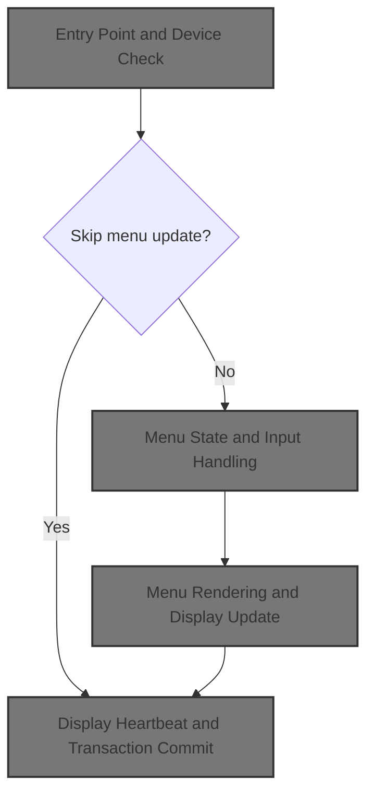
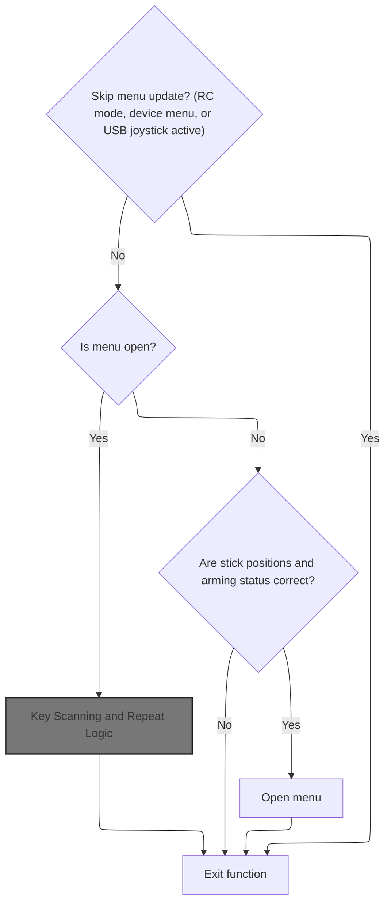
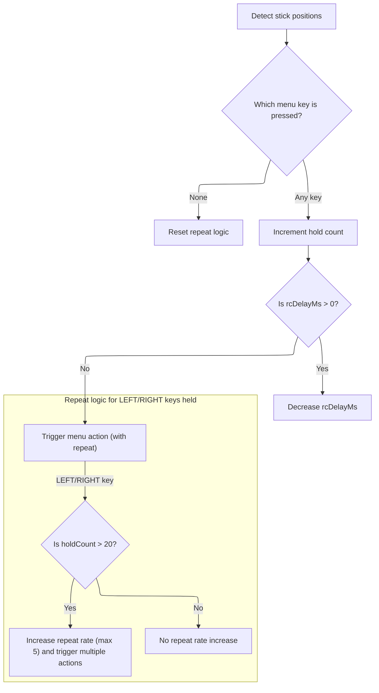
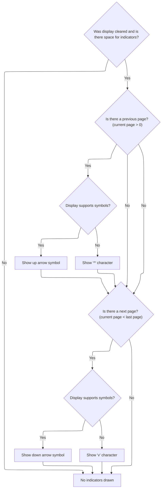

This document describes the flow for managing the interactive on-screen menu, enabling users to navigate and edit settings using keys or stick inputs. The system processes user actions and updates the display to reflect changes, including dynamic values and navigation indicators.



# Entry Point and Device Check

<SwmSnippet path="/src/main/cms/cms.c" line="1524">

---

<SwmToken path="src/main/cms/cms.c" pos="1524:2:2" line-data="void cmsHandler(timeUs_t currentTimeUs)">`cmsHandler`</SwmToken> only calls <SwmToken path="src/main/cms/cms.c" pos="1527:1:1" line-data="        cmsUpdate(currentTimeUs);">`cmsUpdate`</SwmToken> if there are CMS devices, skipping unnecessary work otherwise.

```c
void cmsHandler(timeUs_t currentTimeUs)
{
    if (cmsDeviceCount > 0) {
        cmsUpdate(currentTimeUs);
    }
}
```

---

</SwmSnippet>

# Menu State and Input Handling



<SwmSnippet path="/src/main/cms/cms.c" line="1475">

---

In <SwmToken path="src/main/cms/cms.c" pos="1475:4:4" line-data="static void cmsUpdate(uint32_t currentTimeUs)">`cmsUpdate`</SwmToken>, we bail out early if the system is in a state where menu updates shouldn't happen (like RC paralysis, RC device menu, or USB joystick active). If the menu isn't open, we check for a specific stick combo to open it. Once the menu is open, we start a display transaction and call <SwmToken path="src/main/cms/cms.c" pos="1504:5:5" line-data="        rcDelayMs = cmsScanKeys(currentTimeMs, lastCalledMs, rcDelayMs);">`cmsScanKeys`</SwmToken> to process input and update timing.

```c
static void cmsUpdate(uint32_t currentTimeUs)
{
    if (IS_RC_MODE_ACTIVE(BOXPARALYZE)
#ifdef USE_RCDEVICE
        || rcdeviceInMenu
#endif
#ifdef USE_USB_CDC_HID
        || cdcDeviceIsMayBeActive() // If this target is used as a joystick, we should leave here.
#endif
       ) {
        return;
    }

    static int16_t rcDelayMs = BUTTON_TIME;

    static uint32_t lastCalledMs = 0;
    static uint32_t lastCmsHeartBeatMs = 0;

    const uint32_t currentTimeMs = currentTimeUs / 1000;

    if (!cmsInMenu) {
        // Detect menu invocation
        if (IS_MID(THROTTLE) && IS_LO(YAW) && IS_HI(PITCH) && !ARMING_FLAG(ARMED) && !IS_RC_MODE_ACTIVE(BOXSTICKCOMMANDDISABLE)) {
            cmsMenuOpen();
            rcDelayMs = BUTTON_PAUSE;    // Tends to overshoot if BUTTON_TIME
        }
    } else {
        displayBeginTransaction(pCurrentDisplay, DISPLAY_TRANSACTION_OPT_RESET_DRAWING);

        rcDelayMs = cmsScanKeys(currentTimeMs, lastCalledMs, rcDelayMs);

```

---

</SwmSnippet>

## Key Scanning and Repeat Logic

<SwmSnippet path="/src/main/cms/cms.c" line="1389">

---

In <SwmToken path="src/main/cms/cms.c" pos="1389:4:4" line-data="static uint16_t cmsScanKeys(timeMs_t currentTimeMs, timeMs_t lastCalledMs, int16_t rcDelayMs)">`cmsScanKeys`</SwmToken>, we check if there's an external key event. If so, we immediately process it with <SwmToken path="src/main/cms/cms.c" pos="1402:5:5" line-data="        rcDelayMs = cmsHandleKey(pCurrentDisplay, externKey);">`cmsHandleKey`</SwmToken> to update the menu state. Static variables track key hold and repeat for later logic.

```c
static uint16_t cmsScanKeys(timeMs_t currentTimeMs, timeMs_t lastCalledMs, int16_t rcDelayMs)
{
    static int holdCount = 1;
    static int repeatCount = 1;
    static int repeatBase = 0;

    //
    // Scan 'key' first
    //

    cms_key_e key = CMS_KEY_NONE;

    if (externKey != CMS_KEY_NONE) {
        rcDelayMs = cmsHandleKey(pCurrentDisplay, externKey);
```

---

</SwmSnippet>

### Menu Navigation and Key Handling

```mermaid
%%{init: {"flowchart": {"defaultRenderer": "elk"}} }%%
flowchart TD
    node1["User presses a key"]
    click node1 openCode "src/main/cms/cms.c:1051:1055"
    node1 --> node2{"Is a menu open?"}
    click node2 openCode "src/main/cms/cms.c:1055:1057"
    node2 -->|"No"| node22["Ignore key"]
    click node22 openCode "src/main/cms/cms.c:1056:1057"
    node2 -->|"Yes"| node3{"Which key?"}
    click node3 openCode "src/main/cms/cms.c:1059:1370"
    node3 -->|"Menu"| node4["Open menu"]
    click node4 openCode "src/main/cms/cms.c:1059:1062"
    node4 --> node25["Return"]
    click node25 openCode "src/main/cms/cms.c:1369:1370"
    node3 -->|"Escape"| node5{"Editing?"}
    click node5 openCode "src/main/cms/cms.c:1064:1071"
    node5 -->|"Yes"| node6["Stop editing"]
    click node6 openCode "src/main/cms/cms.c:1066:1067"
    node6 --> node25
    node5 -->|"No"| node7["Go back in menu"]
    click node7 openCode "src/main/cms/cms.c:1068:1069"
    node7 --> node25
    node3 -->|"Save"| node8["Save and exit menu"]
    click node8 openCode "src/main/cms/cms.c:1073:1078"
    node8 --> node25
    node3 -->|"Down"| node9{"Editing?"}
    click node9 openCode "src/main/cms/cms.c:1080:1087"
    node9 -->|"No"| node10{"At bottom of page?"}
    click node10 openCode "src/main/cms/cms.c:1081:1086"
    node10 -->|"No"| node11["Move cursor down"]
    click node11 openCode "src/main/cms/cms.c:1082:1083"
    node11 --> node25
    node10 -->|"Yes"| node12["Next page, cursor to top"]
    click node12 openCode "src/main/cms/cms.c:1084:1086"
    node12 --> node25
    node3 -->|"Up"| node13{"Editing?"}
    click node13 openCode "src/main/cms/cms.c:1089:1101"
    node13 -->|"No"| node14["Move cursor up"]
    click node14 openCode "src/main/cms/cms.c:1090:1091"
    node14 --> loop1
    subgraph loop1["Skip non-selectable entries"]
      node15{"Is current row skippable and above 0?"}
      click node15 openCode "src/main/cms/cms.c:1093:1095"
      node15 -->|"Yes"| node16["Move cursor up"]
      click node16 openCode "src/main/cms/cms.c:1094:1095"
      node16 --> node15
      node15 -->|"No"| node17{"At top or label?"}
      click node17 openCode "src/main/cms/cms.c:1096:1100"
      node17 -->|"Yes"| node18["Previous page, cursor to bottom"]
      click node18 openCode "src/main/cms/cms.c:1098:1100"
      node18 --> node25
      node17 -->|"No"| node19["Stay"]
      click node19 openCode "src/main/cms/cms.c:1101:1101"
      node19 --> node25
    end
    node3 -->|"Other keys"| node20["Handle menu entry (edit value, call function, etc.)"]
    click node20 openCode "src/main/cms/cms.c:1107:1368"
    node20 --> node21{"Reboot required?"}
    click node21 openCode "src/main/cms/cms.c:1124:1351"
    node21 -->|"Yes"| node23["Flag reboot required"]
    click node23 openCode "src/main/cms/cms.c:1125:1351"
    node23 --> node25
    node21 -->|"No"| node25

classDef HeadingStyle fill:#777777,stroke:#333,stroke-width:2px;

%% Swimm:
%% %%{init: {"flowchart": {"defaultRenderer": "elk"}} }%%
%% flowchart TD
%%     node1["User presses a key"]
%%     click node1 openCode "<SwmPath>[src/…/cms/cms.c](src/main/cms/cms.c)</SwmPath>:1051:1055"
%%     node1 --> node2{"Is a menu open?"}
%%     click node2 openCode "<SwmPath>[src/…/cms/cms.c](src/main/cms/cms.c)</SwmPath>:1055:1057"
%%     node2 -->|"No"| node22["Ignore key"]
%%     click node22 openCode "<SwmPath>[src/…/cms/cms.c](src/main/cms/cms.c)</SwmPath>:1056:1057"
%%     node2 -->|"Yes"| node3{"Which key?"}
%%     click node3 openCode "<SwmPath>[src/…/cms/cms.c](src/main/cms/cms.c)</SwmPath>:1059:1370"
%%     node3 -->|"Menu"| node4["Open menu"]
%%     click node4 openCode "<SwmPath>[src/…/cms/cms.c](src/main/cms/cms.c)</SwmPath>:1059:1062"
%%     node4 --> node25["Return"]
%%     click node25 openCode "<SwmPath>[src/…/cms/cms.c](src/main/cms/cms.c)</SwmPath>:1369:1370"
%%     node3 -->|"Escape"| node5{"Editing?"}
%%     click node5 openCode "<SwmPath>[src/…/cms/cms.c](src/main/cms/cms.c)</SwmPath>:1064:1071"
%%     node5 -->|"Yes"| node6["Stop editing"]
%%     click node6 openCode "<SwmPath>[src/…/cms/cms.c](src/main/cms/cms.c)</SwmPath>:1066:1067"
%%     node6 --> node25
%%     node5 -->|"No"| node7["Go back in menu"]
%%     click node7 openCode "<SwmPath>[src/…/cms/cms.c](src/main/cms/cms.c)</SwmPath>:1068:1069"
%%     node7 --> node25
%%     node3 -->|"Save"| node8["Save and exit menu"]
%%     click node8 openCode "<SwmPath>[src/…/cms/cms.c](src/main/cms/cms.c)</SwmPath>:1073:1078"
%%     node8 --> node25
%%     node3 -->|"Down"| node9{"Editing?"}
%%     click node9 openCode "<SwmPath>[src/…/cms/cms.c](src/main/cms/cms.c)</SwmPath>:1080:1087"
%%     node9 -->|"No"| node10{"At bottom of page?"}
%%     click node10 openCode "<SwmPath>[src/…/cms/cms.c](src/main/cms/cms.c)</SwmPath>:1081:1086"
%%     node10 -->|"No"| node11["Move cursor down"]
%%     click node11 openCode "<SwmPath>[src/…/cms/cms.c](src/main/cms/cms.c)</SwmPath>:1082:1083"
%%     node11 --> node25
%%     node10 -->|"Yes"| node12["Next page, cursor to top"]
%%     click node12 openCode "<SwmPath>[src/…/cms/cms.c](src/main/cms/cms.c)</SwmPath>:1084:1086"
%%     node12 --> node25
%%     node3 -->|"Up"| node13{"Editing?"}
%%     click node13 openCode "<SwmPath>[src/…/cms/cms.c](src/main/cms/cms.c)</SwmPath>:1089:1101"
%%     node13 -->|"No"| node14["Move cursor up"]
%%     click node14 openCode "<SwmPath>[src/…/cms/cms.c](src/main/cms/cms.c)</SwmPath>:1090:1091"
%%     node14 --> loop1
%%     subgraph loop1["Skip non-selectable entries"]
%%       node15{"Is current row skippable and above 0?"}
%%       click node15 openCode "<SwmPath>[src/…/cms/cms.c](src/main/cms/cms.c)</SwmPath>:1093:1095"
%%       node15 -->|"Yes"| node16["Move cursor up"]
%%       click node16 openCode "<SwmPath>[src/…/cms/cms.c](src/main/cms/cms.c)</SwmPath>:1094:1095"
%%       node16 --> node15
%%       node15 -->|"No"| node17{"At top or label?"}
%%       click node17 openCode "<SwmPath>[src/…/cms/cms.c](src/main/cms/cms.c)</SwmPath>:1096:1100"
%%       node17 -->|"Yes"| node18["Previous page, cursor to bottom"]
%%       click node18 openCode "<SwmPath>[src/…/cms/cms.c](src/main/cms/cms.c)</SwmPath>:1098:1100"
%%       node18 --> node25
%%       node17 -->|"No"| node19["Stay"]
%%       click node19 openCode "<SwmPath>[src/…/cms/cms.c](src/main/cms/cms.c)</SwmPath>:1101:1101"
%%       node19 --> node25
%%     end
%%     node3 -->|"Other keys"| node20["Handle menu entry (edit value, call function, etc.)"]
%%     click node20 openCode "<SwmPath>[src/…/cms/cms.c](src/main/cms/cms.c)</SwmPath>:1107:1368"
%%     node20 --> node21{"Reboot required?"}
%%     click node21 openCode "<SwmPath>[src/…/cms/cms.c](src/main/cms/cms.c)</SwmPath>:1124:1351"
%%     node21 -->|"Yes"| node23["Flag reboot required"]
%%     click node23 openCode "<SwmPath>[src/…/cms/cms.c](src/main/cms/cms.c)</SwmPath>:1125:1351"
%%     node23 --> node25
%%     node21 -->|"No"| node25
%% 
%% classDef HeadingStyle fill:#777777,stroke:#333,stroke-width:2px;
```



<SwmSnippet path="/src/main/cms/cms.c" line="1050">

---

In <SwmToken path="src/main/cms/cms.c" pos="1050:4:4" line-data="STATIC_UNIT_TESTED uint16_t cmsHandleKey(displayPort_t *pDisplay, cms_key_e key)">`cmsHandleKey`</SwmToken>, we process key inputs for menu navigation and editing. Keys like MENU, ESC, SAVEMENU, UP, and DOWN are handled with if statements to update the menu state, move the cursor, or trigger actions. The function uses global state to track where we are in the menu and what needs to be updated.

```c
STATIC_UNIT_TESTED uint16_t cmsHandleKey(displayPort_t *pDisplay, cms_key_e key)
{
    uint16_t res = BUTTON_TIME;
    const OSD_Entry *p;

    if (!currentCtx.menu) {
        return res;
    }

    if (key == CMS_KEY_MENU) {
        cmsMenuOpen();
        return BUTTON_PAUSE;
    }

    if (key == CMS_KEY_ESC) {
        if (osdElementEditing) {
            osdElementEditing = false;
        } else {
            cmsMenuBack(pDisplay);
        }
        return BUTTON_PAUSE;
    }

    if (key == CMS_KEY_SAVEMENU && !saveMenuInhibited) {
        osdElementEditing = false;
        cmsMenuChange(pDisplay, getSaveExitMenu());

        return BUTTON_PAUSE;
    }

    if ((key == CMS_KEY_DOWN) && (!osdElementEditing)) {
        if (currentCtx.cursorRow < pageMaxRow) {
            currentCtx.cursorRow++;
        } else {
            cmsPageNext(pDisplay);
            currentCtx.cursorRow = 0;    // Goto top in any case
        }
    }

    if ((key == CMS_KEY_UP) && (!osdElementEditing)) {
        currentCtx.cursorRow--;

        // Skip non-title labels, strings and dynamic read-only entries
        while ((rowIsSkippable(pageTop + currentCtx.cursorRow)) && currentCtx.cursorRow > 0) {
            currentCtx.cursorRow--;
        }
```

---

</SwmSnippet>

<SwmSnippet path="/src/main/cms/cms.c" line="1096">

---

After handling the key input and updating the menu state, <SwmToken path="src/main/cms/cms.c" pos="1050:4:4" line-data="STATIC_UNIT_TESTED uint16_t cmsHandleKey(displayPort_t *pDisplay, cms_key_e key)">`cmsHandleKey`</SwmToken> returns a delay value (<SwmToken path="src/main/cms/cms.c" pos="1052:7:7" line-data="    uint16_t res = BUTTON_TIME;">`BUTTON_TIME`</SwmToken> or <SwmToken path="src/main/cms/cms.c" pos="1113:5:5" line-data="                res = BUTTON_PAUSE;">`BUTTON_PAUSE`</SwmToken>) to control how soon the next key event can be processed. This helps manage input pacing and avoid accidental repeats.

```c
        if (currentCtx.cursorRow == -1 || ((pageTop + currentCtx.cursorRow)->flags & OSD_MENU_ELEMENT_MASK) == OME_Label) {
            // Goto previous page
            cmsPagePrev(pDisplay);
            currentCtx.cursorRow = pageMaxRow;
        }
    }

    if ((key == CMS_KEY_DOWN || key == CMS_KEY_UP) && (!osdElementEditing)) {
        return res;
    }

    p = pageTop + currentCtx.cursorRow;

    switch (p->flags & OSD_MENU_ELEMENT_MASK) {
        case OME_Submenu:
            if (key == CMS_KEY_RIGHT) {
                cmsMenuChange(pDisplay, p->data);
                res = BUTTON_PAUSE;
            }
            break;

        case OME_Funcall:;
            const void *retval;
            if (p->func && key == CMS_KEY_RIGHT) {
                retval = p->func(pDisplay, p->data);
                if (retval == MENU_CHAIN_BACK) {
                    cmsMenuBack(pDisplay);
                }
                if ((p->flags & REBOOT_REQUIRED)) {
                    setRebootRequired();
                }
                res = BUTTON_PAUSE;
            }
            break;

        case OME_OSD_Exit:
            if (p->func && key == CMS_KEY_RIGHT) {
                p->func(pDisplay, p->data);
                res = BUTTON_PAUSE;
            }
            break;

        case OME_Back:
            cmsMenuBack(pDisplay);
            res = BUTTON_PAUSE;
            osdElementEditing = false;
            break;

        case OME_Bool:
            if (p->data) {
                uint8_t *val = p->data;
                const uint8_t previousValue = *val;
                *val = (key == CMS_KEY_RIGHT) ? 1 : 0;
                SET_PRINTVALUE(runtimeEntryFlags[currentCtx.cursorRow]);
                if ((p->flags & REBOOT_REQUIRED) && (*val != previousValue)) {
                    setRebootRequired();
                }
                if (p->func) {
                    p->func(pDisplay, p->data);
                }
            }
            break;

#ifdef USE_OSD
        case OME_VISIBLE:
            if (p->data) {
                uint16_t *val = (uint16_t *)p->data;
                const uint16_t previousValue = *val;
                if ((key == CMS_KEY_RIGHT) && (!osdElementEditing)) {
                    osdElementEditing = true;
                    osdProfileCursor = 1;
                } else if (osdElementEditing) {
#ifdef USE_OSD_PROFILES
                    if (key == CMS_KEY_RIGHT) {
                        if (osdProfileCursor < OSD_PROFILE_COUNT) {
                            osdProfileCursor++;
                        }
                    }
                    if (key == CMS_KEY_LEFT) {
                        if (osdProfileCursor > 1) {
                            osdProfileCursor--;
                        }
                    }
#endif
                    if (key == CMS_KEY_UP) {
                        *val |= OSD_PROFILE_FLAG(osdProfileCursor);
                    }
                    if (key == CMS_KEY_DOWN) {
                        *val &= ~OSD_PROFILE_FLAG(osdProfileCursor);
                    }
                }
                SET_PRINTVALUE(runtimeEntryFlags[currentCtx.cursorRow]);
                if ((p->flags & REBOOT_REQUIRED) && (*val != previousValue)) {
                    setRebootRequired();
                }
            }
            break;
#endif

        case OME_UINT8:
        case OME_FLOAT:
            if (p->data) {
                OSD_UINT8_t *ptr = p->data;
                const uint16_t previousValue = *ptr->val;
                if (key == CMS_KEY_RIGHT) {
                    if (*ptr->val < ptr->max) {
                        *ptr->val += ptr->step;
                    }
                } else {
                    if (*ptr->val > ptr->min) {
                        *ptr->val -= ptr->step;
                    }
                }
                SET_PRINTVALUE(runtimeEntryFlags[currentCtx.cursorRow]);
                if ((p->flags & REBOOT_REQUIRED) && (*ptr->val != previousValue)) {
                    setRebootRequired();
                }
                if (p->func) {
                    p->func(pDisplay, p);
                }
            }
            break;

        case OME_TAB:
            if ((p->flags & OSD_MENU_ELEMENT_MASK) == OME_TAB) {
                OSD_TAB_t *ptr = p->data;
                const uint8_t previousValue = *ptr->val;

                if (key == CMS_KEY_RIGHT) {
                    if (*ptr->val < ptr->max) {
                        *ptr->val += 1;
                    }
                } else {
                    if (*ptr->val > 0) {
                        *ptr->val -= 1;
                    }
                }
                if (p->func) {
                    p->func(pDisplay, p->data);
                }
                SET_PRINTVALUE(runtimeEntryFlags[currentCtx.cursorRow]);
                if ((p->flags & REBOOT_REQUIRED) && (*ptr->val != previousValue)) {
                    setRebootRequired();
                }
            }
            break;

        case OME_INT8:
            if (p->data) {
                OSD_INT8_t *ptr = p->data;
                const int8_t previousValue = *ptr->val;
                if (key == CMS_KEY_RIGHT) {
                    if (*ptr->val < ptr->max) {
                        *ptr->val += ptr->step;
                    }
                } else {
                    if (*ptr->val > ptr->min) {
                        *ptr->val -= ptr->step;
                    }
                }
                SET_PRINTVALUE(runtimeEntryFlags[currentCtx.cursorRow]);
                if ((p->flags & REBOOT_REQUIRED) && (*ptr->val != previousValue)) {
                    setRebootRequired();
                }
                if (p->func) {
                    p->func(pDisplay, p);
                }
            }
            break;

        case OME_UINT16:
            if (p->data) {
                OSD_UINT16_t *ptr = p->data;
                const uint16_t previousValue = *ptr->val;
                if (key == CMS_KEY_RIGHT) {
                    if (*ptr->val < ptr->max) {
                        *ptr->val += ptr->step;
                    }
                } else {
                    if (*ptr->val > ptr->min) {
                        *ptr->val -= ptr->step;
                    }
                }
                SET_PRINTVALUE(runtimeEntryFlags[currentCtx.cursorRow]);
                if ((p->flags & REBOOT_REQUIRED) && (*ptr->val != previousValue)) {
                    setRebootRequired();
                }
                if (p->func) {
                    p->func(pDisplay, p);
                }
            }
            break;

        case OME_INT16:
            if (p->data) {
                OSD_INT16_t *ptr = p->data;
                const int16_t previousValue = *ptr->val;
                if (key == CMS_KEY_RIGHT) {
                    if (*ptr->val < ptr->max) {
                        *ptr->val += ptr->step;
                    }
                } else {
                    if (*ptr->val > ptr->min) {
                        *ptr->val -= ptr->step;
                    }
                }
                SET_PRINTVALUE(runtimeEntryFlags[currentCtx.cursorRow]);
                if ((p->flags & REBOOT_REQUIRED) && (*ptr->val != previousValue)) {
                    setRebootRequired();
                }
                if (p->func) {
                    p->func(pDisplay, p);
                }
            }
            break;

        case OME_UINT32:
            if (p->data) {
                OSD_UINT32_t *ptr = p->data;
                const uint32_t previousValue = *ptr->val;
                if (key == CMS_KEY_RIGHT) {
                    if (*ptr->val < ptr->max) {
                        *ptr->val += ptr->step;
                    }
                } else {
                    if (*ptr->val > ptr->min) {
                        *ptr->val -= ptr->step;
                    }
                }
                SET_PRINTVALUE(runtimeEntryFlags[currentCtx.cursorRow]);
                if ((p->flags & REBOOT_REQUIRED) && (*ptr->val != previousValue)) {
                    setRebootRequired();
                }
                if (p->func) {
                    p->func(pDisplay, p);
                }
            }
            break;

        case OME_INT32:
            if (p->data) {
                OSD_INT32_t *ptr = p->data;
                const int32_t previousValue = *ptr->val;
                if (key == CMS_KEY_RIGHT) {
                    if (*ptr->val < ptr->max) {
                        *ptr->val += ptr->step;
                    }
                } else {
                    if (*ptr->val > ptr->min) {
                        *ptr->val -= ptr->step;
                    }
                }
                SET_PRINTVALUE(runtimeEntryFlags[currentCtx.cursorRow]);
                if ((p->flags & REBOOT_REQUIRED) && (*ptr->val != previousValue)) {
                    setRebootRequired();
                }
                if (p->func) {
                    p->func(pDisplay, p);
                }
            }
            break;

        case OME_String:
            break;

        case OME_Label:
        case OME_END:
            break;

        case OME_MENU:
            // Shouldn't happen
            break;
    }
    return res;
}
```

---

</SwmSnippet>

### Stick Mapping and Key Repeat Acceleration



<SwmSnippet path="/src/main/cms/cms.c" line="1403">

---

After returning from <SwmToken path="src/main/cms/cms.c" pos="1050:4:4" line-data="STATIC_UNIT_TESTED uint16_t cmsHandleKey(displayPort_t *pDisplay, cms_key_e key)">`cmsHandleKey`</SwmToken>, <SwmToken path="src/main/cms/cms.c" pos="1389:4:4" line-data="static uint16_t cmsScanKeys(timeMs_t currentTimeMs, timeMs_t lastCalledMs, int16_t rcDelayMs)">`cmsScanKeys`</SwmToken> checks stick positions to map them to menu keys. If a key is held, it manages repeat timing and, when the delay expires, calls <SwmToken path="src/main/cms/cms.c" pos="1434:5:5" line-data="            rcDelayMs = cmsHandleKeyWithRepeat(pCurrentDisplay, key, repeatCount);">`cmsHandleKeyWithRepeat`</SwmToken> to process the key multiple times if needed. This makes value changes faster when holding LEFT or RIGHT.

```c
        externKey = CMS_KEY_NONE;
    } else {
        if (IS_MID(THROTTLE) && IS_LO(YAW) && IS_HI(PITCH) && !ARMING_FLAG(ARMED)) {
            key = CMS_KEY_MENU;
        } else if (IS_HI(PITCH)) {
            key = CMS_KEY_UP;
        } else if (IS_LO(PITCH)) {
            key = CMS_KEY_DOWN;
        } else if (IS_LO(ROLL)) {
            key = CMS_KEY_LEFT;
        } else if (IS_HI(ROLL)) {
            key = CMS_KEY_RIGHT;
        } else if (IS_LO(YAW)) {
            key = CMS_KEY_ESC;
        } else if (IS_HI(YAW)) {
            key = CMS_KEY_SAVEMENU;
        }

        if (key == CMS_KEY_NONE) {
            // No 'key' pressed, reset repeat control
            holdCount = 1;
            repeatCount = 1;
            repeatBase = 0;
        } else {
            // The 'key' is being pressed; keep counting
            ++holdCount;
        }

        if (rcDelayMs > 0) {
            rcDelayMs -= (currentTimeMs - lastCalledMs);
        } else if (key) {
            rcDelayMs = cmsHandleKeyWithRepeat(pCurrentDisplay, key, repeatCount);

```

---

</SwmSnippet>

<SwmSnippet path="/src/main/cms/cms.c" line="1378">

---

<SwmToken path="src/main/cms/cms.c" pos="1378:4:4" line-data="static uint16_t cmsHandleKeyWithRepeat(displayPort_t *pDisplay, cms_key_e key, int repeatCount)">`cmsHandleKeyWithRepeat`</SwmToken> just loops and calls <SwmToken path="src/main/cms/cms.c" pos="1383:5:5" line-data="        ret = cmsHandleKey(pDisplay, key);">`cmsHandleKey`</SwmToken> as many times as <SwmToken path="src/main/cms/cms.c" pos="1378:19:19" line-data="static uint16_t cmsHandleKeyWithRepeat(displayPort_t *pDisplay, cms_key_e key, int repeatCount)">`repeatCount`</SwmToken> says. This is how we get fast value changes when holding LEFT or RIGHT.

```c
static uint16_t cmsHandleKeyWithRepeat(displayPort_t *pDisplay, cms_key_e key, int repeatCount)
{
    uint16_t ret = 0;

    for (int i = 0 ; i < repeatCount ; i++) {
        ret = cmsHandleKey(pDisplay, key);
    }

    return ret;
}
```

---

</SwmSnippet>

<SwmSnippet path="/src/main/cms/cms.c" line="1436">

---

After returning from <SwmToken path="src/main/cms/cms.c" pos="1378:4:4" line-data="static uint16_t cmsHandleKeyWithRepeat(displayPort_t *pDisplay, cms_key_e key, int repeatCount)">`cmsHandleKeyWithRepeat`</SwmToken>, <SwmToken path="src/main/cms/cms.c" pos="1389:4:4" line-data="static uint16_t cmsScanKeys(timeMs_t currentTimeMs, timeMs_t lastCalledMs, int16_t rcDelayMs)">`cmsScanKeys`</SwmToken> adjusts the repeat delay and count for held keys, especially LEFT/RIGHT, to speed up value changes. The constants for acceleration are just tuned for usability.

```c
            // Key repeat effect is implemented in two phases.
            // First phase is to decrease rcDelayMs reciprocal to hold time.
            // When rcDelayMs reached a certain limit (scheduling interval),
            // repeat rate will not raise anymore, so we call key handler
            // multiple times (repeatCount).
            //
            // XXX Caveat: Most constants are adjusted pragmatically.
            // XXX Rewrite this someday, so it uses actual hold time instead
            // of holdCount, which depends on the scheduling interval.

            if (((key == CMS_KEY_LEFT) || (key == CMS_KEY_RIGHT)) && (holdCount > 20)) {

                // Decrease rcDelayMs reciprocally

                rcDelayMs /= (holdCount - 20);

                // When we reach the scheduling limit,

                if (rcDelayMs <= 50) {

                    // start calling handler multiple times.

                    if (repeatBase == 0) {
                        repeatBase = holdCount;
                    }

                    repeatCount = repeatCount + (holdCount - repeatBase) / 5;

                    if (repeatCount > 5) {
                        repeatCount = 5;
                    }
                }
            }
        }
    }

    return rcDelayMs;
}
```

---

</SwmSnippet>

## Menu Rendering and Display Update

<SwmSnippet path="/src/main/cms/cms.c" line="1506">

---

Back in <SwmToken path="src/main/cms/cms.c" pos="1475:4:4" line-data="static void cmsUpdate(uint32_t currentTimeUs)">`cmsUpdate`</SwmToken>, after handling input with <SwmToken path="src/main/cms/cms.c" pos="1389:4:4" line-data="static uint16_t cmsScanKeys(timeMs_t currentTimeMs, timeMs_t lastCalledMs, int16_t rcDelayMs)">`cmsScanKeys`</SwmToken>, we call <SwmToken path="src/main/cms/cms.c" pos="1506:1:1" line-data="        cmsDrawMenu(pCurrentDisplay, currentTimeUs);">`cmsDrawMenu`</SwmToken> to update the display with any changes from the last input.

```c
        cmsDrawMenu(pCurrentDisplay, currentTimeUs);

```

---

</SwmSnippet>

## Menu Drawing and Dynamic Value Polling

<SwmSnippet path="/src/main/cms/cms.c" line="704">

---

In <SwmToken path="src/main/cms/cms.c" pos="704:4:4" line-data="static void cmsDrawMenu(displayPort_t *pDisplay, uint32_t currentTimeUs)">`cmsDrawMenu`</SwmToken>, we check if the display was cleared or if it's time to poll dynamic values. Based on that, we set flags to redraw labels and values for all or just dynamic entries. We also track available space in the display buffer to avoid overruns.

```c
static void cmsDrawMenu(displayPort_t *pDisplay, uint32_t currentTimeUs)
{
    if (!pageTop || !cmsInMenu) {
        return;
    }

    const bool displayWasCleared = pDisplay->cleared;
    uint8_t i;
    const OSD_Entry *p;
    uint8_t top = smallScreen ? 1 : (pDisplay->rows - pageMaxRow)/2;

    pDisplay->cleared = false;

    // Polled (dynamic) value display denominator.

    bool drawPolled = false;
    static uint32_t lastPolledUs = 0;

    if (currentTimeUs > lastPolledUs + CMS_POLL_INTERVAL_US) {
        drawPolled = true;
        lastPolledUs = currentTimeUs;
    }

    uint32_t room = displayTxBytesFree(pDisplay);

    if (displayWasCleared) {
        for (p = pageTop, i= 0; (p <= pageTop + pageMaxRow); p++, i++) {
            SET_PRINTLABEL(runtimeEntryFlags[i]);
            SET_PRINTVALUE(runtimeEntryFlags[i]);
        }
```

---

</SwmSnippet>

<SwmSnippet path="/src/main/cms/cms.c" line="734">

---

On polling, we only mark dynamic entries for redraw.

```c
    } else if (drawPolled) {
        for (p = pageTop, i = 0; (p <= pageTop + pageMaxRow); p++, i++) {
            if (IS_DYNAMIC(p))
                SET_PRINTVALUE(runtimeEntryFlags[i]);
        }
```

---

</SwmSnippet>

<SwmSnippet path="/src/main/cms/cms.c" line="741">

---

Before drawing the cursor, we skip over any non-interactive rows so the cursor always lands on something the user can actually select or edit.

```c
    // Cursor manipulation

    while (rowIsSkippable(pageTop + currentCtx.cursorRow)) { // skip labels, strings and dynamic read-only entries
        currentCtx.cursorRow++;
    }
```

---

</SwmSnippet>

<SwmSnippet path="/src/main/cms/cms.c" line="748">

---

As we draw each menu entry, we check if there's enough room in the display buffer. We print labels, highlight slider overrides, and call <SwmToken path="src/main/cms/cms.c" pos="801:5:5" line-data="            room -= cmsDrawMenuEntry(pDisplay, p, top + i * linesPerMenuItem, selectedRow, &amp;runtimeEntryFlags[i], &amp;runtimeTableTicker[i]);">`cmsDrawMenuEntry`</SwmToken> for values or tickers, stopping early if space runs out.

```c
    cmsPageDebug();
#endif

    if (pDisplay->cursorRow >= 0 && currentCtx.cursorRow != pDisplay->cursorRow) {
        room -= cmsDisplayWrite(pDisplay, leftMenuColumn, top + pDisplay->cursorRow * linesPerMenuItem, DISPLAYPORT_SEVERITY_NORMAL, " ");
    }

    if (room < 30) {
        return;
    }

    if (pDisplay->cursorRow != currentCtx.cursorRow) {
        room -= cmsDisplayWrite(pDisplay, leftMenuColumn, top + currentCtx.cursorRow * linesPerMenuItem, DISPLAYPORT_SEVERITY_NORMAL, ">");
        pDisplay->cursorRow = currentCtx.cursorRow;
    }

    if (room < 30) {
        return;
    }

    if (currentCtx.menu->onDisplayUpdate) {
        const void *result = currentCtx.menu->onDisplayUpdate(pDisplay, pageTop + currentCtx.cursorRow);
        if (result == MENU_CHAIN_BACK) {
            cmsMenuBack(pDisplay);

            return;
        }
    }

    // Print text labels
    for (i = 0, p = pageTop; (p <= pageTop + pageMaxRow); i++, p++) {
        if (IS_PRINTLABEL(runtimeEntryFlags[i])) {
            uint8_t coloff = leftMenuColumn;
            coloff += ((p->flags & OSD_MENU_ELEMENT_MASK) == OME_Label) ? 0 : 1;
            room -= cmsDisplayWrite(pDisplay, coloff, top + i * linesPerMenuItem, DISPLAYPORT_SEVERITY_NORMAL, p->text);
            CLR_PRINTLABEL(runtimeEntryFlags[i]);
            if (room < 30) {
                return;
            }
        }

        // Highlight values overridden by sliders
        if (rowSliderOverride(p->flags)) {
            displayWriteChar(pDisplay, leftMenuColumn - 1, top + i * linesPerMenuItem, DISPLAYPORT_SEVERITY_NORMAL, 'S');
        }

    // Print values

    // XXX Polled values at latter positions in the list may not be
    // XXX printed if not enough room in the middle of the list.

        if (IS_PRINTVALUE(runtimeEntryFlags[i]) || IS_SCROLLINGTICKER(runtimeEntryFlags[i])) {
            bool selectedRow = i == currentCtx.cursorRow;
            room -= cmsDrawMenuEntry(pDisplay, p, top + i * linesPerMenuItem, selectedRow, &runtimeEntryFlags[i], &runtimeTableTicker[i]);
            if (room < 30) {
                return;
            }
        }
    }

```

---

</SwmSnippet>

### Menu Entry Rendering and Formatting

```mermaid
%%{init: {"flowchart": {"defaultRenderer": "elk"}} }%%
flowchart TD
    node1["Start: Render menu entry"] --> node2{"What type of menu entry?"}
    click node1 openCode "src/main/cms/cms.c:398:620"
    node2 -->|"String"| node3{"Show value? (IS_PRINTVALUE)"}
    click node2 openCode "src/main/cms/cms.c:417:424"
    node3 -->|"Yes"| node4["Display string value"]
    click node3 openCode "src/main/cms/cms.c:419:423"
    node2 -->|"Submenu/Function"| node5{"Show value? (IS_PRINTVALUE)"}
    click node5 openCode "src/main/cms/cms.c:428:445"
    node5 -->|"Yes"| node6["Display submenu/function label"]
    click node6 openCode "src/main/cms/cms.c:429:444"
    node2 -->|"Boolean"| node7{"Show value? (IS_PRINTVALUE)"}
    click node7 openCode "src/main/cms/cms.c:449:458"
    node7 -->|"Yes"| node8{"Is value YES?"}
    click node8 openCode "src/main/cms/cms.c:450:454"
    node8 -->|"Yes"| node9["Display YES"]
    click node9 openCode "src/main/cms/cms.c:451:451"
    node8 -->|"No"| node10["Display NO"]
    click node10 openCode "src/main/cms/cms.c:453:453"
    node2 -->|"Tab"| node11{"Show or scroll value? (IS_PRINTVALUE/IS_SCROLLINGTICKER)"}
    click node11 openCode "src/main/cms/cms.c:462:500"
    node11 -->|"Show"| node12["Display tab text"]
    click node12 openCode "src/main/cms/cms.c:474:482"
    node11 -->|"Scroll"| node13["Advance ticker and display scrolled text"]
    click node13 openCode "src/main/cms/cms.c:483:494"
    node2 -->|"Visibility"| node14{"Show value? (IS_PRINTVALUE)"}
    click node14 openCode "src/main/cms/cms.c:505:525"
    node14 -->|"Yes"| loop1
    subgraph loop1["For each OSD profile"]
        node15{"Visible in profile?"}
        click node15 openCode "src/main/cms/cms.c:509:521"
        node15 -->|"Yes"| node16{"Editing and cursor blink?"}
        click node16 openCode "src/main/cms/cms.c:510:514"
        node16 -->|"Yes"| node17["Display blank"]
        click node17 openCode "src/main/cms/cms.c:511:511"
        node16 -->|"No"| node18["Display X"]
        click node18 openCode "src/main/cms/cms.c:513:513"
        node15 -->|"No"| node19{"Editing and cursor blink?"}
        click node19 openCode "src/main/cms/cms.c:516:520"
        node19 -->|"Yes"| node20["Display blank"]
        click node20 openCode "src/main/cms/cms.c:517:517"
        node19 -->|"No"| node21["Display -"]
        click node21 openCode "src/main/cms/cms.c:519:519"
    end
    node2 -->|"Numeric/Label"| node22{"Show value? (IS_PRINTVALUE)"}
    click node22 openCode "src/main/cms/cms.c:530:597"
    node22 -->|"Yes"| node23["Display numeric or label value"]
    click node23 openCode "src/main/cms/cms.c:532:596"
    node2 -->|"Other/Debug"| node24["Display error/fallback"]
    click node24 openCode "src/main/cms/cms.c:607:616"

classDef HeadingStyle fill:#777777,stroke:#333,stroke-width:2px;

%% Swimm:
%% %%{init: {"flowchart": {"defaultRenderer": "elk"}} }%%
%% flowchart TD
%%     node1["Start: Render menu entry"] --> node2{"What type of menu entry?"}
%%     click node1 openCode "<SwmPath>[src/…/cms/cms.c](src/main/cms/cms.c)</SwmPath>:398:620"
%%     node2 -->|"String"| node3{"Show value? (<SwmToken path="src/main/cms/cms.c" pos="419:4:4" line-data="        if (IS_PRINTVALUE(*flags) &amp;&amp; p-&gt;data) {">`IS_PRINTVALUE`</SwmToken>)"}
%%     click node2 openCode "<SwmPath>[src/…/cms/cms.c](src/main/cms/cms.c)</SwmPath>:417:424"
%%     node3 -->|"Yes"| node4["Display string value"]
%%     click node3 openCode "<SwmPath>[src/…/cms/cms.c](src/main/cms/cms.c)</SwmPath>:419:423"
%%     node2 -->|"Submenu/Function"| node5{"Show value? (<SwmToken path="src/main/cms/cms.c" pos="419:4:4" line-data="        if (IS_PRINTVALUE(*flags) &amp;&amp; p-&gt;data) {">`IS_PRINTVALUE`</SwmToken>)"}
%%     click node5 openCode "<SwmPath>[src/…/cms/cms.c](src/main/cms/cms.c)</SwmPath>:428:445"
%%     node5 -->|"Yes"| node6["Display submenu/function label"]
%%     click node6 openCode "<SwmPath>[src/…/cms/cms.c](src/main/cms/cms.c)</SwmPath>:429:444"
%%     node2 -->|"Boolean"| node7{"Show value? (<SwmToken path="src/main/cms/cms.c" pos="419:4:4" line-data="        if (IS_PRINTVALUE(*flags) &amp;&amp; p-&gt;data) {">`IS_PRINTVALUE`</SwmToken>)"}
%%     click node7 openCode "<SwmPath>[src/…/cms/cms.c](src/main/cms/cms.c)</SwmPath>:449:458"
%%     node7 -->|"Yes"| node8{"Is value YES?"}
%%     click node8 openCode "<SwmPath>[src/…/cms/cms.c](src/main/cms/cms.c)</SwmPath>:450:454"
%%     node8 -->|"Yes"| node9["Display YES"]
%%     click node9 openCode "<SwmPath>[src/…/cms/cms.c](src/main/cms/cms.c)</SwmPath>:451:451"
%%     node8 -->|"No"| node10["Display NO"]
%%     click node10 openCode "<SwmPath>[src/…/cms/cms.c](src/main/cms/cms.c)</SwmPath>:453:453"
%%     node2 -->|"Tab"| node11{"Show or scroll value? (IS_PRINTVALUE/IS_SCROLLINGTICKER)"}
%%     click node11 openCode "<SwmPath>[src/…/cms/cms.c](src/main/cms/cms.c)</SwmPath>:462:500"
%%     node11 -->|"Show"| node12["Display tab text"]
%%     click node12 openCode "<SwmPath>[src/…/cms/cms.c](src/main/cms/cms.c)</SwmPath>:474:482"
%%     node11 -->|"Scroll"| node13["Advance ticker and display scrolled text"]
%%     click node13 openCode "<SwmPath>[src/…/cms/cms.c](src/main/cms/cms.c)</SwmPath>:483:494"
%%     node2 -->|"Visibility"| node14{"Show value? (<SwmToken path="src/main/cms/cms.c" pos="419:4:4" line-data="        if (IS_PRINTVALUE(*flags) &amp;&amp; p-&gt;data) {">`IS_PRINTVALUE`</SwmToken>)"}
%%     click node14 openCode "<SwmPath>[src/…/cms/cms.c](src/main/cms/cms.c)</SwmPath>:505:525"
%%     node14 -->|"Yes"| loop1
%%     subgraph loop1["For each OSD profile"]
%%         node15{"Visible in profile?"}
%%         click node15 openCode "<SwmPath>[src/…/cms/cms.c](src/main/cms/cms.c)</SwmPath>:509:521"
%%         node15 -->|"Yes"| node16{"Editing and cursor blink?"}
%%         click node16 openCode "<SwmPath>[src/…/cms/cms.c](src/main/cms/cms.c)</SwmPath>:510:514"
%%         node16 -->|"Yes"| node17["Display blank"]
%%         click node17 openCode "<SwmPath>[src/…/cms/cms.c](src/main/cms/cms.c)</SwmPath>:511:511"
%%         node16 -->|"No"| node18["Display X"]
%%         click node18 openCode "<SwmPath>[src/…/cms/cms.c](src/main/cms/cms.c)</SwmPath>:513:513"
%%         node15 -->|"No"| node19{"Editing and cursor blink?"}
%%         click node19 openCode "<SwmPath>[src/…/cms/cms.c](src/main/cms/cms.c)</SwmPath>:516:520"
%%         node19 -->|"Yes"| node20["Display blank"]
%%         click node20 openCode "<SwmPath>[src/…/cms/cms.c](src/main/cms/cms.c)</SwmPath>:517:517"
%%         node19 -->|"No"| node21["Display -"]
%%         click node21 openCode "<SwmPath>[src/…/cms/cms.c](src/main/cms/cms.c)</SwmPath>:519:519"
%%     end
%%     node2 -->|"Numeric/Label"| node22{"Show value? (<SwmToken path="src/main/cms/cms.c" pos="419:4:4" line-data="        if (IS_PRINTVALUE(*flags) &amp;&amp; p-&gt;data) {">`IS_PRINTVALUE`</SwmToken>)"}
%%     click node22 openCode "<SwmPath>[src/…/cms/cms.c](src/main/cms/cms.c)</SwmPath>:530:597"
%%     node22 -->|"Yes"| node23["Display numeric or label value"]
%%     click node23 openCode "<SwmPath>[src/…/cms/cms.c](src/main/cms/cms.c)</SwmPath>:532:596"
%%     node2 -->|"Other/Debug"| node24["Display error/fallback"]
%%     click node24 openCode "<SwmPath>[src/…/cms/cms.c](src/main/cms/cms.c)</SwmPath>:607:616"
%% 
%% classDef HeadingStyle fill:#777777,stroke:#333,stroke-width:2px;
```



<SwmSnippet path="/src/main/cms/cms.c" line="398">

---

In <SwmToken path="src/main/cms/cms.c" pos="398:4:4" line-data="static int cmsDrawMenuEntry(displayPort_t *pDisplay, const OSD_Entry *p, uint8_t row, bool selectedRow, uint8_t *flags, cmsTableTicker_t *ticker)">`cmsDrawMenuEntry`</SwmToken>, we switch on the entry type to format and draw each menu value. For long text (like tabs), we use a scrolling ticker. For OSD visibility, we handle cursor blinking. All drawing uses fixed buffer sizes and flags to manage what gets updated.

```c
static int cmsDrawMenuEntry(displayPort_t *pDisplay, const OSD_Entry *p, uint8_t row, bool selectedRow, uint8_t *flags, cmsTableTicker_t *ticker)
{
    #define CMS_DRAW_BUFFER_LEN 12
    #define CMS_TABLE_VALUE_MAX_LEN 30
    #define CMS_NUM_FIELD_LEN 5
    #define CMS_CURSOR_BLINK_DELAY_MS 500

    char buff[CMS_DRAW_BUFFER_LEN +1]; // Make room for null terminator.
    char tableBuff[CMS_TABLE_VALUE_MAX_LEN +1];
    int cnt = 0;

#ifndef USE_OSD
    UNUSED(selectedRow);
#endif

    if (smallScreen) {
        row++;
    }

    switch (p->flags & OSD_MENU_ELEMENT_MASK) {
    case OME_String:
        if (IS_PRINTVALUE(*flags) && p->data) {
            strncpy(buff, p->data, CMS_DRAW_BUFFER_LEN);
            cnt = cmsDrawMenuItemValue(pDisplay, buff, row, CMS_DRAW_BUFFER_LEN);
            CLR_PRINTVALUE(*flags);
        }
        break;

    case OME_Submenu:
    case OME_Funcall:
        if (IS_PRINTVALUE(*flags)) {
            buff[0]= 0x0;

            if ((p->flags & OSD_MENU_ELEMENT_MASK) == OME_Submenu && p->func && *flags & OPTSTRING) {

                // Special case of sub menu entry with optional value display.

                const char *str = p->func(pDisplay, p->data);
                strncpy(buff, str, CMS_DRAW_BUFFER_LEN);
            } else if ((p->flags & OSD_MENU_ELEMENT_MASK) == OME_Funcall && p->data) {
                strncpy(buff, p->data, CMS_DRAW_BUFFER_LEN);
            }
            strncat(buff, ">", CMS_DRAW_BUFFER_LEN);

            row = smallScreen ? row - 1 : row;
            cnt = cmsDrawMenuItemValue(pDisplay, buff, row, strlen(buff));
            CLR_PRINTVALUE(*flags);
        }
        break;

    case OME_Bool:
        if (IS_PRINTVALUE(*flags) && p->data) {
            if (*((uint8_t *)(p->data))) {
              strcpy(buff, "YES");
            } else {
              strcpy(buff, "NO ");
            }

            cnt = cmsDrawMenuItemValue(pDisplay, buff, row, 3);
            CLR_PRINTVALUE(*flags);
        }
        break;

    case OME_TAB:
        if (IS_PRINTVALUE(*flags) || IS_SCROLLINGTICKER(*flags)) {
            bool drawText = false;
            OSD_TAB_t *ptr = p->data;
            const int labelLength = strlen(p->text) + 1; // account for the space between label and display data
            char *str = (char *)ptr->names[*ptr->val];   // lookup table display text
            const int displayLength = strlen(str);

            // Calculate the available space to display the lookup table entry based on the
            // screen size and the length of the label. Always display at least CMS_DRAW_BUFFER_LEN
            // characters to prevent really long labels from overriding the data display.
            const int availableSpace = MAX(CMS_DRAW_BUFFER_LEN, rightMenuColumn - labelLength - leftMenuColumn - 1);

            if (IS_PRINTVALUE(*flags)) {
                drawText = true;
                ticker->state = 0;
                ticker->loopCounter = 0;
                if (displayLength > availableSpace) {  // table entry text is longer than the available space so start the ticker
                    SET_SCROLLINGTICKER(*flags);
                } else {
                    CLR_SCROLLINGTICKER(*flags);
                }
            } else if (IS_SCROLLINGTICKER(*flags)) {
                ticker->loopCounter++;
                const uint8_t loopLimit = (ticker->state == 0 || ticker->state == (displayLength - availableSpace)) ? LOOKUP_TABLE_TICKER_START_CYCLES : LOOKUP_TABLE_TICKER_SCROLL_CYCLES;
                if (ticker->loopCounter >= loopLimit) {
                    ticker->loopCounter = 0;
                    drawText = true;
                    ticker->state++;
                    if (ticker->state > (displayLength - availableSpace)) {
                        ticker->state = 0;
                    }
                }
            }
            if (drawText) {
                strncpy(tableBuff, (char *)(str + ticker->state), CMS_TABLE_VALUE_MAX_LEN);
                cnt = cmsDrawMenuItemValue(pDisplay, tableBuff, row, availableSpace);
            }
            CLR_PRINTVALUE(*flags);
        }
        break;

#ifdef USE_OSD
    case OME_VISIBLE:
        if (IS_PRINTVALUE(*flags) && p->data) {
            uint16_t *val = (uint16_t *)p->data;
            bool cursorBlink = millis() % (2 * CMS_CURSOR_BLINK_DELAY_MS) < CMS_CURSOR_BLINK_DELAY_MS;
            for (unsigned x = 1; x < OSD_PROFILE_COUNT + 1; x++) {
                if (VISIBLE_IN_OSD_PROFILE(*val, x)) {
                    if (osdElementEditing && cursorBlink && selectedRow && (x == osdProfileCursor)) {
                        strcpy(buff + x - 1, " ");
                    } else {
                        strcpy(buff + x - 1, "X");
                    }
                } else {
                    if (osdElementEditing && cursorBlink && selectedRow && (x == osdProfileCursor)) {
                        strcpy(buff + x - 1, " ");
                    } else {
                        strcpy(buff + x - 1, "-");
                    }
                }
            }
```

---

</SwmSnippet>

<SwmSnippet path="/src/main/cms/cms.c" line="523">

---

After drawing the entry, <SwmToken path="src/main/cms/cms.c" pos="398:4:4" line-data="static int cmsDrawMenuEntry(displayPort_t *pDisplay, const OSD_Entry *p, uint8_t row, bool selectedRow, uint8_t *flags, cmsTableTicker_t *ticker)">`cmsDrawMenuEntry`</SwmToken> returns how many bytes it wrote to the display. This helps the caller manage buffer space and know when to stop drawing.

```c
            cnt = cmsDrawMenuItemValue(pDisplay, buff, row, 3);
            CLR_PRINTVALUE(*flags);
        }
        break;
#endif

    case OME_UINT8:
        if (IS_PRINTVALUE(*flags) && p->data) {
            OSD_UINT8_t *ptr = p->data;
            itoa(*ptr->val, buff, 10);
            cnt = cmsDrawMenuItemValue(pDisplay, buff, row, CMS_NUM_FIELD_LEN);
            CLR_PRINTVALUE(*flags);
        }
        break;

    case OME_INT8:
        if (IS_PRINTVALUE(*flags) && p->data) {
            OSD_INT8_t *ptr = p->data;
            itoa(*ptr->val, buff, 10);
            cnt = cmsDrawMenuItemValue(pDisplay, buff, row, CMS_NUM_FIELD_LEN);
            CLR_PRINTVALUE(*flags);
        }
        break;

    case OME_UINT16:
        if (IS_PRINTVALUE(*flags) && p->data) {
            OSD_UINT16_t *ptr = p->data;
            itoa(*ptr->val, buff, 10);
            cnt = cmsDrawMenuItemValue(pDisplay, buff, row, CMS_NUM_FIELD_LEN);
            CLR_PRINTVALUE(*flags);
        }
        break;

    case OME_INT16:
        if (IS_PRINTVALUE(*flags) && p->data) {
            OSD_INT16_t *ptr = p->data;
            itoa(*ptr->val, buff, 10);
            cnt = cmsDrawMenuItemValue(pDisplay, buff, row, CMS_NUM_FIELD_LEN);
            CLR_PRINTVALUE(*flags);
        }
        break;

    case OME_UINT32:
        if (IS_PRINTVALUE(*flags) && p->data) {
            OSD_UINT32_t *ptr = p->data;
            itoa(*ptr->val, buff, 10);
            cnt = cmsDrawMenuItemValue(pDisplay, buff, row, CMS_NUM_FIELD_LEN);
            CLR_PRINTVALUE(*flags);
        }
        break;

    case OME_INT32:
        if (IS_PRINTVALUE(*flags) && p->data) {
            OSD_INT32_t *ptr = p->data;
            itoa(*ptr->val, buff, 10);
            cnt = cmsDrawMenuItemValue(pDisplay, buff, row, CMS_NUM_FIELD_LEN);
            CLR_PRINTVALUE(*flags);
        }
        break;

    case OME_FLOAT:
        if (IS_PRINTVALUE(*flags) && p->data) {
            OSD_FLOAT_t *ptr = p->data;
            cmsFormatFloat(*ptr->val * ptr->multipler, buff);
            cnt = cmsDrawMenuItemValue(pDisplay, buff, row, CMS_NUM_FIELD_LEN);
            CLR_PRINTVALUE(*flags);
        }
        break;

    case OME_Label:
        if (IS_PRINTVALUE(*flags) && p->data) {
            // A label with optional string, immediately following text
            cnt = cmsDisplayWrite(pDisplay, leftMenuColumn + 1 + (uint8_t)strlen(p->text), row, DISPLAYPORT_SEVERITY_NORMAL, p->data);
            CLR_PRINTVALUE(*flags);
        }
        break;

    case OME_OSD_Exit:
    case OME_END:
    case OME_Back:
        break;

    case OME_MENU:
        // Fall through
    default:
#ifdef CMS_MENU_DEBUG
        // Shouldn't happen. Notify creator of this menu content
#ifdef CMS_OSD_RIGHT_ALIGNED_VALUES
        cnt = cmsDisplayWrite(pDisplay, rightMenuColumn - 6, row, DISPLAYPORT_SEVERITY_NORMAL, "BADENT");
#else
        cnt = cmsDisplayWrite(pDisplay, rightMenuColumn, row, DISPLAYPORT_SEVERITY_NORMAL, "BADENT");
#endif
#endif
        break;
    }

    return cnt;
}
```

---

</SwmSnippet>

### Page Navigation Indicators



<SwmSnippet path="/src/main/cms/cms.c" line="808">

---

After returning from <SwmToken path="src/main/cms/cms.c" pos="398:4:4" line-data="static int cmsDrawMenuEntry(displayPort_t *pDisplay, const OSD_Entry *p, uint8_t row, bool selectedRow, uint8_t *flags, cmsTableTicker_t *ticker)">`cmsDrawMenuEntry`</SwmToken>, <SwmToken path="src/main/cms/cms.c" pos="704:4:4" line-data="static void cmsDrawMenu(displayPort_t *pDisplay, uint32_t currentTimeUs)">`cmsDrawMenu`</SwmToken> checks if the display was cleared and if there's space, then draws <SwmToken path="src/main/cms/cms.c" pos="808:7:9" line-data="    // Draw the up/down page indicators if the display has space.">`up/down`</SwmToken> arrows to show if there are more pages above or below. This only happens after a clear to avoid redundant drawing.

```c
    // Draw the up/down page indicators if the display has space.
    // Only draw the symbols when necessary after the screen has been cleared. Otherwise they're static.
    // If the device supports OSD symbols then use the up/down arrows. Otherwise assume it's a
    // simple text device and use the '^' (carat) and 'V' for arrow approximations.
    if (displayWasCleared && leftMenuColumn > 0) {      // make sure there's room to draw the symbol
        if (currentCtx.page > 0) {
            const uint8_t symbol = displaySupportsOsdSymbols(pDisplay) ? SYM_ARROW_SMALL_UP : '^';
            displayWriteChar(pDisplay, leftMenuColumn - 1, top, DISPLAYPORT_SEVERITY_NORMAL, symbol);
        }
         if (currentCtx.page < pageCount - 1) {
            const uint8_t symbol = displaySupportsOsdSymbols(pDisplay) ? SYM_ARROW_SMALL_DOWN : 'v';
            displayWriteChar(pDisplay, leftMenuColumn - 1, top + pageMaxRow, DISPLAYPORT_SEVERITY_NORMAL, symbol);
        }
    }

}
```

---

</SwmSnippet>

## Display Heartbeat and Transaction Commit

<SwmSnippet path="/src/main/cms/cms.c" line="1508">

---

After drawing the menu in <SwmToken path="src/main/cms/cms.c" pos="1475:4:4" line-data="static void cmsUpdate(uint32_t currentTimeUs)">`cmsUpdate`</SwmToken>, we send a heartbeat to keep external displays alive and commit the display transaction. We also update <SwmToken path="src/main/cms/cms.c" pos="1519:13:13" line-data="    // currentTimeMs to be used as lastCalledMs (freezes CMS for a minute or so">`lastCalledMs`</SwmToken> with millis() to avoid freezing if a command takes too long.

```c
        if (currentTimeMs > lastCmsHeartBeatMs + 500) {
            // Heart beat for external CMS display device @ 500msec
            // (Timeout @ 1000msec)
            displayHeartbeat(pCurrentDisplay);
            lastCmsHeartBeatMs = currentTimeMs;
        }

        displayCommitTransaction(pCurrentDisplay);
    }

    // Some key (command), notably flash erase, takes too long to use the
    // currentTimeMs to be used as lastCalledMs (freezes CMS for a minute or so
    // if used).
    lastCalledMs = millis();
}
```

---

</SwmSnippet>

&nbsp;

*This is an auto-generated document by Swimm 🌊 and has not yet been verified by a human*

<SwmMeta version="3.0.0" repo-id="Z2l0aHViJTNBJTNBYy1iZXRhZmxpZ2h0JTNBJTNBcmljYXJkb2xvcGV6Zw==" repo-name="c-betaflight"><sup>Powered by [Swimm](https://app.swimm.io/)</sup></SwmMeta>
