This document outlines the process for setting up IR transponder hardware based on a selected provider and IO tag. The flow validates the hardware selection, applies provider-specific initialization, and configures all necessary hardware resources, including timers, DMA, and PWM output.

# Provider-Specific Transponder Setup

```mermaid
%%{init: {"flowchart": {"defaultRenderer": "elk"}} }%%
flowchart TD
    node1["Start IR transponder initialization"] --> node2{"Is IO tag valid?"}
    click node1 openCode "src/platform/APM32/transponder_ir_io_apm32.c:184:185"
    click node2 openCode "src/platform/APM32/transponder_ir_io_apm32.c:186:188"
    node2 -->|"No"| node3["Return failure"]
    click node3 openCode "src/platform/APM32/transponder_ir_io_apm32.c:187:188"
    node2 -->|"Yes"| node4{"Which provider?"}
    click node4 openCode "src/platform/APM32/transponder_ir_io_apm32.c:190:202"
    node4 -->|"ARCITIMER"| node5["Initialize ARCITIMER transponder"]
    click node5 openCode "src/platform/APM32/transponder_ir_io_apm32.c:192:193"
    node4 -->|"ILAP"| node6["Initialize ILAP transponder"]
    click node6 openCode "src/platform/APM32/transponder_ir_io_apm32.c:195:196"
    node4 -->|"ERLT"| node7["Initialize ERLT transponder"]
    click node7 openCode "src/platform/APM32/transponder_ir_io_apm32.c:198:199"
    node4 -->|"Unknown provider"| node3
    node5 --> node8["Initialize hardware"]
    click node8 openCode "src/platform/APM32/transponder_ir_io_apm32.c:204:205"
    node6 --> node8
    node7 --> node8
    node8 --> node9["Return success"]
    click node9 openCode "src/platform/APM32/transponder_ir_io_apm32.c:206:207"
classDef HeadingStyle fill:#777777,stroke:#333,stroke-width:2px;

%% Swimm:
%% %%{init: {"flowchart": {"defaultRenderer": "elk"}} }%%
%% flowchart TD
%%     node1["Start IR transponder initialization"] --> node2{"Is IO tag valid?"}
%%     click node1 openCode "<SwmPath>[src/…/APM32/transponder_ir_io_apm32.c](src/platform/APM32/transponder_ir_io_apm32.c)</SwmPath>:184:185"
%%     click node2 openCode "<SwmPath>[src/…/APM32/transponder_ir_io_apm32.c](src/platform/APM32/transponder_ir_io_apm32.c)</SwmPath>:186:188"
%%     node2 -->|"No"| node3["Return failure"]
%%     click node3 openCode "<SwmPath>[src/…/APM32/transponder_ir_io_apm32.c](src/platform/APM32/transponder_ir_io_apm32.c)</SwmPath>:187:188"
%%     node2 -->|"Yes"| node4{"Which provider?"}
%%     click node4 openCode "<SwmPath>[src/…/APM32/transponder_ir_io_apm32.c](src/platform/APM32/transponder_ir_io_apm32.c)</SwmPath>:190:202"
%%     node4 -->|"ARCITIMER"| node5["Initialize ARCITIMER transponder"]
%%     click node5 openCode "<SwmPath>[src/…/APM32/transponder_ir_io_apm32.c](src/platform/APM32/transponder_ir_io_apm32.c)</SwmPath>:192:193"
%%     node4 -->|"ILAP"| node6["Initialize ILAP transponder"]
%%     click node6 openCode "<SwmPath>[src/…/APM32/transponder_ir_io_apm32.c](src/platform/APM32/transponder_ir_io_apm32.c)</SwmPath>:195:196"
%%     node4 -->|"ERLT"| node7["Initialize ERLT transponder"]
%%     click node7 openCode "<SwmPath>[src/…/APM32/transponder_ir_io_apm32.c](src/platform/APM32/transponder_ir_io_apm32.c)</SwmPath>:198:199"
%%     node4 -->|"Unknown provider"| node3
%%     node5 --> node8["Initialize hardware"]
%%     click node8 openCode "<SwmPath>[src/…/APM32/transponder_ir_io_apm32.c](src/platform/APM32/transponder_ir_io_apm32.c)</SwmPath>:204:205"
%%     node6 --> node8
%%     node7 --> node8
%%     node8 --> node9["Return success"]
%%     click node9 openCode "<SwmPath>[src/…/APM32/transponder_ir_io_apm32.c](src/platform/APM32/transponder_ir_io_apm32.c)</SwmPath>:206:207"
%% classDef HeadingStyle fill:#777777,stroke:#333,stroke-width:2px;
```



<SwmSnippet path="/src/platform/APM32/transponder_ir_io_apm32.c" line="184">

---

We start the flow in <SwmToken path="src/platform/APM32/transponder_ir_io_apm32.c" pos="184:2:2" line-data="bool transponderIrInit(const ioTag_t ioTag, const transponderProvider_e provider)">`transponderIrInit`</SwmToken>, which checks if the <SwmToken path="src/platform/APM32/transponder_ir_io_apm32.c" pos="184:8:8" line-data="bool transponderIrInit(const ioTag_t ioTag, const transponderProvider_e provider)">`ioTag`</SwmToken> is valid, then picks the right provider-specific initialization for the global transponder object. After that, it calls <SwmToken path="src/platform/APM32/transponder_ir_io_apm32.c" pos="204:1:1" line-data="    transponderIrHardwareInit(ioTag, &amp;transponder);">`transponderIrHardwareInit`</SwmToken> to actually set up the hardware resources for the selected provider and <SwmToken path="src/platform/APM32/transponder_ir_io_apm32.c" pos="184:8:8" line-data="bool transponderIrInit(const ioTag_t ioTag, const transponderProvider_e provider)">`ioTag`</SwmToken>. This separation lets us handle different transponder types in a modular way, and the hardware init step is needed to finish configuring the timer, DMA, and GPIO for IR output.

```c
bool transponderIrInit(const ioTag_t ioTag, const transponderProvider_e provider)
{
    if (!ioTag) {
        return false;
    }

    switch (provider) {
        case TRANSPONDER_ARCITIMER:
            transponderIrInitArcitimer(&transponder);
            break;
        case TRANSPONDER_ILAP:
            transponderIrInitIlap(&transponder);
            break;
        case TRANSPONDER_ERLT:
            transponderIrInitERLT(&transponder);
            break;
        default:
            return false;
    }

    transponderIrHardwareInit(ioTag, &transponder);

    return true;
}
```

---

</SwmSnippet>

# Timer and DMA Resource Allocation

<SwmSnippet path="/src/platform/APM32/transponder_ir_io_apm32.c" line="61">

---

In <SwmToken path="src/platform/APM32/transponder_ir_io_apm32.c" pos="61:2:2" line-data="void transponderIrHardwareInit(ioTag_t ioTag, transponder_t *transponder)">`transponderIrHardwareInit`</SwmToken>, we grab the timer hardware for the given <SwmToken path="src/platform/APM32/transponder_ir_io_apm32.c" pos="61:6:6" line-data="void transponderIrHardwareInit(ioTag_t ioTag, transponder_t *transponder)">`ioTag`</SwmToken>, set up the DMA channel (either from a spec or directly from the timer), and configure the timer's prescaler and period using values from the transponder struct. We also prep the GPIO for alternate function and link the DMA to the timer. Next, we call <SwmToken path="src/platform/APM32/transponder_ir_io_apm32.c" pos="147:4:4" line-data="    if (DAL_DMA_Init(TmrHandle.hdma[dmaIndex]) != DAL_OK) {">`DAL_DMA_Init`</SwmToken> to actually initialize the DMA stream with these settings, which is required before we can use DMA for IR output.

```c
void transponderIrHardwareInit(ioTag_t ioTag, transponder_t *transponder)
{
    if (!ioTag) {
        return;
    }

    const timerHardware_t *timerHardware = timerAllocate(ioTag, OWNER_TRANSPONDER, 0);
    TMR_TypeDef *timer = timerHardware->tim;
    timerChannel = timerHardware->channel;
    output = timerHardware->output;
    alternateFunction = timerHardware->alternateFunction;

#if defined(USE_DMA_SPEC)
    const dmaChannelSpec_t *dmaSpec = dmaGetChannelSpecByTimer(timerHardware);

    if (dmaSpec == NULL) {
        return;
    }

    dmaResource_t *dmaRef = dmaSpec->ref;
    uint32_t dmaChannel = dmaSpec->channel;
#else
    dmaResource_t *dmaRef = timerHardware->dmaRef;
    uint32_t dmaChannel = timerHardware->dmaChannel;
#endif

    dmaIdentifier_e dmaIdentifier = dmaGetIdentifier(dmaRef);
    if (dmaRef == NULL || !dmaAllocate(dmaIdentifier, OWNER_TRANSPONDER, 0)) {
        return;
    }

    /* Time base configuration */

    TmrHandle.Instance = timer;

    uint16_t prescaler = timerGetPrescalerByDesiredMhz(timer, transponder->timer_hz);
    uint16_t period = timerGetPeriodByPrescaler(timer, prescaler, transponder->timer_carrier_hz);

    transponder->bitToggleOne = period / 2;

    TmrHandle.Init.Prescaler = prescaler;
    TmrHandle.Init.Period = period; // 800kHz
    TmrHandle.Init.ClockDivision = TMR_CLOCKDIVISION_DIV1;
    TmrHandle.Init.CounterMode = TMR_COUNTERMODE_UP;
    if (DAL_TMR_PWM_Init(&TmrHandle) != DAL_OK) {
        /* Initialization Error */
        return;
    }

    /* IO configuration */

    static DMA_HandleTypeDef hdma_tim;

    transponderIO = IOGetByTag(ioTag);
    IOInit(transponderIO, OWNER_TRANSPONDER, 0);
    IOConfigGPIOAF(transponderIO, IO_CONFIG(GPIO_MODE_AF_PP, GPIO_SPEED_FREQ_VERY_HIGH, GPIO_PULLDOWN), timerHardware->alternateFunction);

    __DAL_RCM_DMA1_CLK_ENABLE();
    __DAL_RCM_DMA2_CLK_ENABLE();

    /* Set the parameters to be configured */
    hdma_tim.Init.Channel = dmaChannel;
    hdma_tim.Init.Direction = DMA_MEMORY_TO_PERIPH;
    hdma_tim.Init.PeriphInc = DMA_PINC_DISABLE;
    hdma_tim.Init.MemInc = DMA_MINC_ENABLE;
    hdma_tim.Init.PeriphDataAlignment = DMA_PDATAALIGN_WORD;
    hdma_tim.Init.MemDataAlignment = DMA_MDATAALIGN_WORD;
    hdma_tim.Init.Mode = DMA_NORMAL;
    hdma_tim.Init.Priority = DMA_PRIORITY_HIGH;
    hdma_tim.Init.FIFOMode = DMA_FIFOMODE_DISABLE;
    hdma_tim.Init.FIFOThreshold = DMA_FIFO_THRESHOLD_FULL;
    hdma_tim.Init.MemBurst = DMA_MBURST_SINGLE;
    hdma_tim.Init.PeriphBurst = DMA_PBURST_SINGLE;

    /* Set hdma_tim instance */
    hdma_tim.Instance = (DMA_ARCH_TYPE *)dmaRef;

    uint16_t dmaIndex = timerDmaIndex(timerChannel);

    /* Link hdma_tim to hdma[x] (channelx) */
    __DAL_LINKDMA(&TmrHandle, hdma[dmaIndex], hdma_tim);

    dmaEnable(dmaIdentifier);
    dmaSetHandler(dmaIdentifier, TRANSPONDER_DMA_IRQHandler, NVIC_PRIO_TRANSPONDER_DMA, dmaIndex);

    /* Initialize TIMx DMA handle */
    if (DAL_DMA_Init(TmrHandle.hdma[dmaIndex]) != DAL_OK) {
        /* Initialization Error */
        return;
    }

```

---

</SwmSnippet>

## DMA Stream Disable and Validation

```mermaid
%%{init: {"flowchart": {"defaultRenderer": "elk"}} }%%
flowchart TD
  node1["Start DMA initialization"] --> node2{"Is DMA handle provided?"}
  click node1 openCode "lib/main/APM32F4/Libraries/APM32F4xx_DAL_Driver/Source/apm32f4xx_dal_dma.c:195:201"
  node2 -->|"No"| node3["Return error"]
  click node2 openCode "lib/main/APM32F4/Libraries/APM32F4xx_DAL_Driver/Source/apm32f4xx_dal_dma.c:202:205"
  click node3 openCode "lib/main/APM32F4/Libraries/APM32F4xx_DAL_Driver/Source/apm32f4xx_dal_dma.c:204:205"
  node2 -->|"Yes"| node4["Validate configuration parameters"]
  click node4 openCode "lib/main/APM32F4/Libraries/APM32F4xx_DAL_Driver/Source/apm32f4xx_dal_dma.c:207:217"
  node4 --> node5{"Is FIFO mode enabled?"}
  click node5 openCode "lib/main/APM32F4/Libraries/APM32F4xx_DAL_Driver/Source/apm32f4xx_dal_dma.c:220:221"
  node5 -->|"No"| node6["Configure DMA stream"]
  click node6 openCode "lib/main/APM32F4/Libraries/APM32F4xx_DAL_Driver/Source/apm32f4xx_dal_dma.c:227:275"
  node5 -->|"Yes"| node7["Validate FIFO parameters and compatibility"]
  click node7 openCode "lib/main/APM32F4/Libraries/APM32F4xx_DAL_Driver/Source/apm32f4xx_dal_dma.c:222:307"
  node7 -->|"Valid"| node6
  node7 -->|"Parameter error"| node12["Return parameter error"]
  click node12 openCode "lib/main/APM32F4/Libraries/APM32F4xx_DAL_Driver/Source/apm32f4xx_dal_dma.c:298:305"
  node6 --> node8{"Is DMA stream disabled before config?"}
  click node8 openCode "lib/main/APM32F4/Libraries/APM32F4xx_DAL_Driver/Source/apm32f4xx_dal_dma.c:237:250"
  node8 -->|"No (Timeout)"| node9["Return timeout error"]
  click node9 openCode "lib/main/APM32F4/Libraries/APM32F4xx_DAL_Driver/Source/apm32f4xx_dal_dma.c:241:249"
  node8 -->|"Yes"| node10["Set DMA state to ready and clear errors"]
  click node10 openCode "lib/main/APM32F4/Libraries/APM32F4xx_DAL_Driver/Source/apm32f4xx_dal_dma.c:312:323"
  node10 --> node11["Return success"]
  click node11 openCode "lib/main/APM32F4/Libraries/APM32F4xx_DAL_Driver/Source/apm32f4xx_dal_dma.c:325:326"
classDef HeadingStyle fill:#777777,stroke:#333,stroke-width:2px;

%% Swimm:
%% %%{init: {"flowchart": {"defaultRenderer": "elk"}} }%%
%% flowchart TD
%%   node1["Start DMA initialization"] --> node2{"Is DMA handle provided?"}
%%   click node1 openCode "<SwmPath>[lib/…/Source/apm32f4xx_dal_dma.c](lib/main/APM32F4/Libraries/APM32F4xx_DAL_Driver/Source/apm32f4xx_dal_dma.c)</SwmPath>:195:201"
%%   node2 -->|"No"| node3["Return error"]
%%   click node2 openCode "<SwmPath>[lib/…/Source/apm32f4xx_dal_dma.c](lib/main/APM32F4/Libraries/APM32F4xx_DAL_Driver/Source/apm32f4xx_dal_dma.c)</SwmPath>:202:205"
%%   click node3 openCode "<SwmPath>[lib/…/Source/apm32f4xx_dal_dma.c](lib/main/APM32F4/Libraries/APM32F4xx_DAL_Driver/Source/apm32f4xx_dal_dma.c)</SwmPath>:204:205"
%%   node2 -->|"Yes"| node4["Validate configuration parameters"]
%%   click node4 openCode "<SwmPath>[lib/…/Source/apm32f4xx_dal_dma.c](lib/main/APM32F4/Libraries/APM32F4xx_DAL_Driver/Source/apm32f4xx_dal_dma.c)</SwmPath>:207:217"
%%   node4 --> node5{"Is FIFO mode enabled?"}
%%   click node5 openCode "<SwmPath>[lib/…/Source/apm32f4xx_dal_dma.c](lib/main/APM32F4/Libraries/APM32F4xx_DAL_Driver/Source/apm32f4xx_dal_dma.c)</SwmPath>:220:221"
%%   node5 -->|"No"| node6["Configure DMA stream"]
%%   click node6 openCode "<SwmPath>[lib/…/Source/apm32f4xx_dal_dma.c](lib/main/APM32F4/Libraries/APM32F4xx_DAL_Driver/Source/apm32f4xx_dal_dma.c)</SwmPath>:227:275"
%%   node5 -->|"Yes"| node7["Validate FIFO parameters and compatibility"]
%%   click node7 openCode "<SwmPath>[lib/…/Source/apm32f4xx_dal_dma.c](lib/main/APM32F4/Libraries/APM32F4xx_DAL_Driver/Source/apm32f4xx_dal_dma.c)</SwmPath>:222:307"
%%   node7 -->|"Valid"| node6
%%   node7 -->|"Parameter error"| node12["Return parameter error"]
%%   click node12 openCode "<SwmPath>[lib/…/Source/apm32f4xx_dal_dma.c](lib/main/APM32F4/Libraries/APM32F4xx_DAL_Driver/Source/apm32f4xx_dal_dma.c)</SwmPath>:298:305"
%%   node6 --> node8{"Is DMA stream disabled before config?"}
%%   click node8 openCode "<SwmPath>[lib/…/Source/apm32f4xx_dal_dma.c](lib/main/APM32F4/Libraries/APM32F4xx_DAL_Driver/Source/apm32f4xx_dal_dma.c)</SwmPath>:237:250"
%%   node8 -->|"No (Timeout)"| node9["Return timeout error"]
%%   click node9 openCode "<SwmPath>[lib/…/Source/apm32f4xx_dal_dma.c](lib/main/APM32F4/Libraries/APM32F4xx_DAL_Driver/Source/apm32f4xx_dal_dma.c)</SwmPath>:241:249"
%%   node8 -->|"Yes"| node10["Set DMA state to ready and clear errors"]
%%   click node10 openCode "<SwmPath>[lib/…/Source/apm32f4xx_dal_dma.c](lib/main/APM32F4/Libraries/APM32F4xx_DAL_Driver/Source/apm32f4xx_dal_dma.c)</SwmPath>:312:323"
%%   node10 --> node11["Return success"]
%%   click node11 openCode "<SwmPath>[lib/…/Source/apm32f4xx_dal_dma.c](lib/main/APM32F4/Libraries/APM32F4xx_DAL_Driver/Source/apm32f4xx_dal_dma.c)</SwmPath>:325:326"
%% classDef HeadingStyle fill:#777777,stroke:#333,stroke-width:2px;
```



<SwmSnippet path="/lib/main/APM32F4/Libraries/APM32F4xx_DAL_Driver/Source/apm32f4xx_dal_dma.c" line="195">

---

In <SwmToken path="lib/main/APM32F4/Libraries/APM32F4xx_DAL_Driver/Source/apm32f4xx_dal_dma.c" pos="195:2:2" line-data="DAL_StatusTypeDef DAL_DMA_Init(DMA_HandleTypeDef *hdma)">`DAL_DMA_Init`</SwmToken>, we check that the DMA handle is valid, then disable the DMA stream and wait (with a timeout) for the hardware to confirm it's actually off. This is needed before we can safely reconfigure the DMA registers for the new transfer.

```c
DAL_StatusTypeDef DAL_DMA_Init(DMA_HandleTypeDef *hdma)
{
  uint32_t tmp = 0U;
  uint32_t tickstart = DAL_GetTick();
  DMA_Base_Registers *regs;

  /* Check the DMA peripheral state */
  if(hdma == NULL)
  {
    return DAL_ERROR;
  }

  /* Check the parameters */
  ASSERT_PARAM(IS_DMA_STREAM_ALL_INSTANCE(hdma->Instance));
  ASSERT_PARAM(IS_DMA_CHANNEL(hdma->Init.Channel));
  ASSERT_PARAM(IS_DMA_DIRECTION(hdma->Init.Direction));
  ASSERT_PARAM(IS_DMA_PERIPHERAL_INC_STATE(hdma->Init.PeriphInc));
  ASSERT_PARAM(IS_DMA_MEMORY_INC_STATE(hdma->Init.MemInc));
  ASSERT_PARAM(IS_DMA_PERIPHERAL_DATA_SIZE(hdma->Init.PeriphDataAlignment));
  ASSERT_PARAM(IS_DMA_MEMORY_DATA_SIZE(hdma->Init.MemDataAlignment));
  ASSERT_PARAM(IS_DMA_MODE(hdma->Init.Mode));
  ASSERT_PARAM(IS_DMA_PRIORITY(hdma->Init.Priority));
  ASSERT_PARAM(IS_DMA_FIFO_MODE_STATE(hdma->Init.FIFOMode));
  /* Check the memory burst, peripheral burst and FIFO threshold parameters only
     when FIFO mode is enabled */
  if(hdma->Init.FIFOMode != DMA_FIFOMODE_DISABLE)
  {
    ASSERT_PARAM(IS_DMA_FIFO_THRESHOLD(hdma->Init.FIFOThreshold));
    ASSERT_PARAM(IS_DMA_MEMORY_BURST(hdma->Init.MemBurst));
    ASSERT_PARAM(IS_DMA_PERIPHERAL_BURST(hdma->Init.PeriphBurst));
  }

  /* Change DMA peripheral state */
  hdma->State = DAL_DMA_STATE_BUSY;

  /* Allocate lock resource */
  __DAL_UNLOCK(hdma);
  
  /* Disable the peripheral */
  __DAL_DMA_DISABLE(hdma);
  
  /* Check if the DMA Stream is effectively disabled */
  while((hdma->Instance->SCFG & DMA_SCFGx_EN) != RESET)
  {
    /* Check for the Timeout */
    if((DAL_GetTick() - tickstart ) > DAL_TIMEOUT_DMA_ABORT)
    {
      /* Update error code */
      hdma->ErrorCode = DAL_DMA_ERROR_TIMEOUT;
      
      /* Change the DMA state */
      hdma->State = DAL_DMA_STATE_TIMEOUT;
      
      return DAL_TIMEOUT;
    }
  }
```

---

</SwmSnippet>

<SwmSnippet path="/lib/main/APM32F4/Libraries/APM32F4xx_DAL_Driver/Source/apm32f4xx_dal_dma.c" line="252">

---

After making sure the DMA stream is off, we clear out the config bits in SCFG and FCTRL, then set them up with the new parameters from the DMA handle. If FIFO mode is on, we also check that the FIFO threshold and burst size are compatible. We then clear any pending interrupts and mark the DMA as ready.

```c
  /* Get the SCFG register value */
  tmp = hdma->Instance->SCFG;

  /* Clear CHSEL, MBCFG, PBCFG, PRILCFG, MEMSIZECFG, PERSIZECFG, MEMIM, PERIM, CIRCMEN, DIRCFG, CTARG and DBM bits */
  tmp &= ((uint32_t)~(DMA_SCFGx_CHSEL | DMA_SCFGx_MBCFG | DMA_SCFGx_PBCFG | \
                      DMA_SCFGx_PRILCFG    | DMA_SCFGx_MEMSIZECFG  | DMA_SCFGx_PERSIZECFG  | \
                      DMA_SCFGx_MEMIM  | DMA_SCFGx_PERIM   | DMA_SCFGx_CIRCMEN   | \
                      DMA_SCFGx_DIRCFG   | DMA_SCFGx_CTARG     | DMA_SCFGx_DBM));

  /* Prepare the DMA Stream configuration */
  tmp |=  hdma->Init.Channel             | hdma->Init.Direction        |
          hdma->Init.PeriphInc           | hdma->Init.MemInc           |
          hdma->Init.PeriphDataAlignment | hdma->Init.MemDataAlignment |
          hdma->Init.Mode                | hdma->Init.Priority;

  /* the Memory burst and peripheral burst are not used when the FIFO is disabled */
  if(hdma->Init.FIFOMode == DMA_FIFOMODE_ENABLE)
  {
    /* Get memory burst and peripheral burst */
    tmp |=  hdma->Init.MemBurst | hdma->Init.PeriphBurst;
  }
  
  /* Write to DMA Stream SCFG register */
  hdma->Instance->SCFG = tmp;  

  /* Get the FCTRL register value */
  tmp = hdma->Instance->FCTRL;

  /* Clear Direct mode and FIFO threshold bits */
  tmp &= (uint32_t)~(DMA_FCTRLx_DMDEN | DMA_FCTRLx_FTHSEL);

  /* Prepare the DMA Stream FIFO configuration */
  tmp |= hdma->Init.FIFOMode;

  /* The FIFO threshold is not used when the FIFO mode is disabled */
  if(hdma->Init.FIFOMode == DMA_FIFOMODE_ENABLE)
  {
    /* Get the FIFO threshold */
    tmp |= hdma->Init.FIFOThreshold;
    
    /* Check compatibility between FIFO threshold level and size of the memory burst */
    /* for INCR4, INCR8, INCR16 bursts */
    if (hdma->Init.MemBurst != DMA_MBURST_SINGLE)
    {
      if (DMA_CheckFifoParam(hdma) != DAL_OK)
      {
        /* Update error code */
        hdma->ErrorCode = DAL_DMA_ERROR_PARAM;
        
        /* Change the DMA state */
        hdma->State = DAL_DMA_STATE_READY;
        
        return DAL_ERROR; 
      }
    }
  }
  
  /* Write to DMA Stream FCTRL */
  hdma->Instance->FCTRL = tmp;

  /* Initialize StreamBaseAddress and StreamIndex parameters to be used to calculate
     DMA steam Base Address needed by DAL_DMA_IRQHandler() and DAL_DMA_PollForTransfer() */
  regs = (DMA_Base_Registers *)DMA_CalcBaseAndBitshift(hdma);
  
  /* Clear all interrupt flags */
  regs->IFCR = 0x3FU << hdma->StreamIndex;

  /* Initialize the error code */
  hdma->ErrorCode = DAL_DMA_ERROR_NONE;
                                                                                     
  /* Initialize the DMA state */
  hdma->State = DAL_DMA_STATE_READY;

  return DAL_OK;
}
```

---

</SwmSnippet>

## PWM Output Channel Setup

```mermaid
%%{init: {"flowchart": {"defaultRenderer": "elk"}} }%%
flowchart TD
    node1["Configure IR transponder hardware for PWM output"]
    click node1 openCode "src/platform/APM32/transponder_ir_io_apm32.c:152:163"
    node1 --> node2{"Was configuration successful?"}
    click node2 openCode "src/platform/APM32/transponder_ir_io_apm32.c:164:167"
    node2 -->|"No"| node9["End (Not initialized)"]
    click node9 openCode "src/platform/APM32/transponder_ir_io_apm32.c:166:167"
    node2 -->|"Yes"| node3{"Is output mode N-channel?"}
    click node3 openCode "src/platform/APM32/transponder_ir_io_apm32.c:169:174"
    node3 -->|"Yes"| node4["Start N-channel PWM output"]
    click node4 openCode "src/platform/APM32/transponder_ir_io_apm32.c:170:173"
    node3 -->|"No"| node5["Start normal PWM output"]
    click node5 openCode "src/platform/APM32/transponder_ir_io_apm32.c:175:178"
    node4 --> node6{"Did PWM start successfully?"}
    click node6 openCode "src/platform/APM32/transponder_ir_io_apm32.c:171:172"
    node5 --> node6
    node6 -->|"No"| node9
    node6 -->|"Yes"| node8["Set transponderInitialised = true"]
    click node8 openCode "src/platform/APM32/transponder_ir_io_apm32.c:181:181"
    node8 --> node10["End (Initialized)"]
    click node10 openCode "src/platform/APM32/transponder_ir_io_apm32.c:182:182"

classDef HeadingStyle fill:#777777,stroke:#333,stroke-width:2px;

%% Swimm:
%% %%{init: {"flowchart": {"defaultRenderer": "elk"}} }%%
%% flowchart TD
%%     node1["Configure IR transponder hardware for PWM output"]
%%     click node1 openCode "<SwmPath>[src/…/APM32/transponder_ir_io_apm32.c](src/platform/APM32/transponder_ir_io_apm32.c)</SwmPath>:152:163"
%%     node1 --> node2{"Was configuration successful?"}
%%     click node2 openCode "<SwmPath>[src/…/APM32/transponder_ir_io_apm32.c](src/platform/APM32/transponder_ir_io_apm32.c)</SwmPath>:164:167"
%%     node2 -->|"No"| node9["End (Not initialized)"]
%%     click node9 openCode "<SwmPath>[src/…/APM32/transponder_ir_io_apm32.c](src/platform/APM32/transponder_ir_io_apm32.c)</SwmPath>:166:167"
%%     node2 -->|"Yes"| node3{"Is output mode N-channel?"}
%%     click node3 openCode "<SwmPath>[src/…/APM32/transponder_ir_io_apm32.c](src/platform/APM32/transponder_ir_io_apm32.c)</SwmPath>:169:174"
%%     node3 -->|"Yes"| node4["Start N-channel PWM output"]
%%     click node4 openCode "<SwmPath>[src/…/APM32/transponder_ir_io_apm32.c](src/platform/APM32/transponder_ir_io_apm32.c)</SwmPath>:170:173"
%%     node3 -->|"No"| node5["Start normal PWM output"]
%%     click node5 openCode "<SwmPath>[src/…/APM32/transponder_ir_io_apm32.c](src/platform/APM32/transponder_ir_io_apm32.c)</SwmPath>:175:178"
%%     node4 --> node6{"Did PWM start successfully?"}
%%     click node6 openCode "<SwmPath>[src/…/APM32/transponder_ir_io_apm32.c](src/platform/APM32/transponder_ir_io_apm32.c)</SwmPath>:171:172"
%%     node5 --> node6
%%     node6 -->|"No"| node9
%%     node6 -->|"Yes"| node8["Set <SwmToken path="src/platform/APM32/transponder_ir_io_apm32.c" pos="181:1:1" line-data="    transponderInitialised = true;">`transponderInitialised`</SwmToken> = true"]
%%     click node8 openCode "<SwmPath>[src/…/APM32/transponder_ir_io_apm32.c](src/platform/APM32/transponder_ir_io_apm32.c)</SwmPath>:181:181"
%%     node8 --> node10["End (Initialized)"]
%%     click node10 openCode "<SwmPath>[src/…/APM32/transponder_ir_io_apm32.c](src/platform/APM32/transponder_ir_io_apm32.c)</SwmPath>:182:182"
%% 
%% classDef HeadingStyle fill:#777777,stroke:#333,stroke-width:2px;
```



<SwmSnippet path="/src/platform/APM32/transponder_ir_io_apm32.c" line="152">

---

Now that we've returned from the DMA driver init, back in <SwmToken path="src/platform/APM32/transponder_ir_io_apm32.c" pos="61:2:2" line-data="void transponderIrHardwareInit(ioTag_t ioTag, transponder_t *transponder)">`transponderIrHardwareInit`</SwmToken> we set up the PWM output channel with the right mode and polarity, then start PWM generation on either the normal or complementary channel depending on the hardware flags. Finally, we mark the transponder as initialized.

```c
    RCC_ClockCmd(timerRCC(timer), ENABLE);

    /* PWM1 Mode configuration: Channel1 */
    TMR_OC_InitTypeDef  TMR_OCInitStructure;

    TMR_OCInitStructure.OCMode = TMR_OCMODE_PWM1;
    TMR_OCInitStructure.OCIdleState = TMR_OCIDLESTATE_RESET;
    TMR_OCInitStructure.OCPolarity = (timerHardware->output & TIMER_OUTPUT_INVERTED) ? TMR_OCPOLARITY_LOW : TMR_OCPOLARITY_HIGH;
    TMR_OCInitStructure.OCNIdleState = TMR_OCNIDLESTATE_RESET;
    TMR_OCInitStructure.OCNPolarity = (timerHardware->output & TIMER_OUTPUT_INVERTED) ? TMR_OCNPOLARITY_LOW : TMR_OCNPOLARITY_HIGH;
    TMR_OCInitStructure.Pulse = 0;
    TMR_OCInitStructure.OCFastMode = TMR_OCFAST_DISABLE;
    if (DAL_TMR_PWM_ConfigChannel(&TmrHandle, &TMR_OCInitStructure, timerChannel) != DAL_OK) {
        /* Configuration Error */
        return;
    }

    if (timerHardware->output & TIMER_OUTPUT_N_CHANNEL) {
        if (DAL_TMREx_PWMN_Start(&TmrHandle, timerChannel) != DAL_OK) {
            /* Starting PWM generation Error */
            return;
        }
    } else {
        if (DAL_TMR_PWM_Start(&TmrHandle, timerChannel) != DAL_OK) {
            /* Starting PWM generation Error */
            return;
        }
    }

    transponderInitialised = true;
}
```

---

</SwmSnippet>

&nbsp;

*This is an auto-generated document by Swimm 🌊 and has not yet been verified by a human*

<SwmMeta version="3.0.0" repo-id="Z2l0aHViJTNBJTNBYy1iZXRhZmxpZ2h0JTNBJTNBcmljYXJkb2xvcGV6Zw==" repo-name="c-betaflight"><sup>Powered by [Swimm](https://app.swimm.io/)</sup></SwmMeta>
