This document describes how the LED strip is updated to visually represent the flight controller's current status. The process takes the controller's state and configuration as input, applies the relevant LED profile, and updates the LED strip hardware to display the appropriate colors and patterns. Updates are scheduled to ensure smooth transitions and timely feedback.

# Scheduling and State Handling for LED Updates

<SwmSnippet path="/src/main/io/ledstrip.c" line="1472">

---

In <SwmToken path="src/main/io/ledstrip.c" pos="1472:2:2" line-data="void ledStripUpdate(timeUs_t currentTimeUs)">`ledStripUpdate`</SwmToken>, we check if the LED strip should be enabled, then call <SwmToken path="src/main/io/ledstrip.c" pos="1508:5:5" line-data="                    ledProfileSequence = applyStatusProfile(currentTimeUs);">`applyStatusProfile`</SwmToken> to process the current LED profile before updating the <SwmToken path="src/main/io/ledstrip.c" pos="1480:37:37" line-data="        // The LED task rate is considered to be the rate at which updates are sent to the LEDs as a consequence">`LEDs`</SwmToken>. Static variables keep track of where we are in the update cycle.

```c
void ledStripUpdate(timeUs_t currentTimeUs)
{
    static uint16_t ledStateDurationFractionUs[2] = { 0 };
    static bool applyProfile = true;
    static timeUs_t updateStartTimeUs = 0;
    bool ledCurrentState = applyProfile;

    if (updateStartTimeUs != 0) {
        // The LED task rate is considered to be the rate at which updates are sent to the LEDs as a consequence
        // of the layer timers firing
        schedulerIgnoreTaskExecRate();
    }

    if (!isWS2811LedStripReady()) {
        // Call schedulerIgnoreTaskExecTime() unless data is being processed
        schedulerIgnoreTaskExecTime();
        return;
    }

    if (ledStripEnabled && IS_RC_MODE_ACTIVE(BOXLEDLOW)) {
        ledStripDisable();
    } else if (!IS_RC_MODE_ACTIVE(BOXLEDLOW)) {
        ledStripEnable();
    }

    if (ledStripEnabled) {
        if (applyProfile) {
            ledProfileSequence_t ledProfileSequence = LED_PROFILE_SLOW;

            if (updateStartTimeUs == 0) {
                updateStartTimeUs = currentTimeUs;
            }

            switch (ledStripConfig()->ledstrip_profile) {
#ifdef USE_LED_STRIP_STATUS_MODE
                case LED_PROFILE_STATUS: {
                    ledProfileSequence = applyStatusProfile(currentTimeUs);
                    break;
                }
#endif
                case LED_PROFILE_RACE:
```

---

</SwmSnippet>

## Status Profile and Fixed Layer Processing

```mermaid
%%{init: {"flowchart": {"defaultRenderer": "elk"}} }%%
flowchart TD
    node1["Start LED status profile update"]
    click node1 openCode "src/main/io/ledstrip.c:1220:1226"
    node1 --> node2{"Is any LED timer active?"}
    click node2 openCode "src/main/io/ledstrip.c:1227:1244"
    subgraph loop1["For each LED timer"]
        node2 -->|"No"| node3["Check and activate timers for layers"]
        click node3 openCode "src/main/io/ledstrip.c:1230:1244"
        node3 --> node4
    end
    node2 -->|"Yes"| node4{"Have fixed layers been applied?"}
    click node4 openCode "src/main/io/ledstrip.c:1251:1254"
    node4 -->|"No"| node5["Apply fixed LED layers"]
    click node5 openCode "src/main/io/ledstrip.c:1252:1253"
    node4 -->|"Yes"| node6["Proceed to layer updates"]
    node5 --> node6
    subgraph loop2["For each LED layer"]
        node6 --> node7{"Should update this layer now?"}
        click node7 openCode "src/main/io/ledstrip.c:1256:1260"
        node7 -->|"Yes"| node8["Update LED layer"]
        click node8 openCode "src/main/io/ledstrip.c:1259:1260"
        node8 --> node9{"Has update taken too long?"}
        click node9 openCode "src/main/io/ledstrip.c:1260:1263"
        node9 -->|"Yes"| node10["Return LED_PROFILE_FAST"]
        click node10 openCode "src/main/io/ledstrip.c:1263:1264"
        node9 -->|"No"| node11["Continue updating layers"]
        node7 -->|"No"| node11
        node11 --> node6
    end
    node6 --> node12["Reset state for next cycle"]
    click node12 openCode "src/main/io/ledstrip.c:1267:1270"
    node12 --> node13["Return LED_PROFILE_ADVANCE"]
    click node13 openCode "src/main/io/ledstrip.c:1272:1273"

classDef HeadingStyle fill:#777777,stroke:#333,stroke-width:2px;

%% Swimm:
%% %%{init: {"flowchart": {"defaultRenderer": "elk"}} }%%
%% flowchart TD
%%     node1["Start LED status profile update"]
%%     click node1 openCode "<SwmPath>[src/…/io/ledstrip.c](src/main/io/ledstrip.c)</SwmPath>:1220:1226"
%%     node1 --> node2{"Is any LED timer active?"}
%%     click node2 openCode "<SwmPath>[src/…/io/ledstrip.c](src/main/io/ledstrip.c)</SwmPath>:1227:1244"
%%     subgraph loop1["For each LED timer"]
%%         node2 -->|"No"| node3["Check and activate timers for layers"]
%%         click node3 openCode "<SwmPath>[src/…/io/ledstrip.c](src/main/io/ledstrip.c)</SwmPath>:1230:1244"
%%         node3 --> node4
%%     end
%%     node2 -->|"Yes"| node4{"Have fixed layers been applied?"}
%%     click node4 openCode "<SwmPath>[src/…/io/ledstrip.c](src/main/io/ledstrip.c)</SwmPath>:1251:1254"
%%     node4 -->|"No"| node5["Apply fixed LED layers"]
%%     click node5 openCode "<SwmPath>[src/…/io/ledstrip.c](src/main/io/ledstrip.c)</SwmPath>:1252:1253"
%%     node4 -->|"Yes"| node6["Proceed to layer updates"]
%%     node5 --> node6
%%     subgraph loop2["For each LED layer"]
%%         node6 --> node7{"Should update this layer now?"}
%%         click node7 openCode "<SwmPath>[src/…/io/ledstrip.c](src/main/io/ledstrip.c)</SwmPath>:1256:1260"
%%         node7 -->|"Yes"| node8["Update LED layer"]
%%         click node8 openCode "<SwmPath>[src/…/io/ledstrip.c](src/main/io/ledstrip.c)</SwmPath>:1259:1260"
%%         node8 --> node9{"Has update taken too long?"}
%%         click node9 openCode "<SwmPath>[src/…/io/ledstrip.c](src/main/io/ledstrip.c)</SwmPath>:1260:1263"
%%         node9 -->|"Yes"| node10["Return <SwmToken path="src/main/io/ledstrip.c" pos="1263:3:3" line-data="            return LED_PROFILE_FAST;">`LED_PROFILE_FAST`</SwmToken>"]
%%         click node10 openCode "<SwmPath>[src/…/io/ledstrip.c](src/main/io/ledstrip.c)</SwmPath>:1263:1264"
%%         node9 -->|"No"| node11["Continue updating layers"]
%%         node7 -->|"No"| node11
%%         node11 --> node6
%%     end
%%     node6 --> node12["Reset state for next cycle"]
%%     click node12 openCode "<SwmPath>[src/…/io/ledstrip.c](src/main/io/ledstrip.c)</SwmPath>:1267:1270"
%%     node12 --> node13["Return <SwmToken path="src/main/io/ledstrip.c" pos="1272:3:3" line-data="    return LED_PROFILE_ADVANCE;">`LED_PROFILE_ADVANCE`</SwmToken>"]
%%     click node13 openCode "<SwmPath>[src/…/io/ledstrip.c](src/main/io/ledstrip.c)</SwmPath>:1272:1273"
%% 
%% classDef HeadingStyle fill:#777777,stroke:#333,stroke-width:2px;
```



<SwmSnippet path="/src/main/io/ledstrip.c" line="1220">

---

In <SwmToken path="src/main/io/ledstrip.c" pos="1220:4:4" line-data="static ledProfileSequence_t applyStatusProfile(timeUs_t now)">`applyStatusProfile`</SwmToken>, we use static variables to keep track of which timers are active and which fixed layers have been applied. We loop through all timers, skip disabled ones, and use time comparisons to decide if a timer needs updating. The bitmask lets us mark which timers are ready, so we can process them incrementally without blocking.

```c
static ledProfileSequence_t applyStatusProfile(timeUs_t now)
{
    static timId_e timId = 0;
    static uint32_t timActive = 0;
    static bool fixedLayersApplied = false;
    timeUs_t startTime = micros();

    if (!timActive) {
        // apply all layers; triggered timed functions has to update timers
        // test all led timers, setting corresponding bits
        for (timId_e timId = 0; timId < timTimerCount; timId++) {
            if (!(disabledTimerMask & (1 << timId))) {
                // sanitize timer value, so that it can be safely incremented. Handles inital timerVal value.
                const timeDelta_t delta = cmpTimeUs(now, timerVal[timId]);
                // max delay is limited to 5s
                if (delta > MAX_TIMER_DELAY) {
                    // Restart the interval on this timer; catches start condition following initialisation
                    timerVal[timId] = now;
                }

                if (delta >= 0) {
                    timActive |= 1 << timId;
                }
            }
        }
```

---

</SwmSnippet>

<SwmSnippet path="/src/main/io/ledstrip.c" line="1251">

---

Here we check if fixed layers have been applied for this update cycle. If not, we call <SwmToken path="src/main/io/ledstrip.c" pos="1252:1:1" line-data="        applyLedFixedLayers();">`applyLedFixedLayers`</SwmToken> and set the flag, making sure static/background LED states are set before any timer-based updates.

```c
    if (!fixedLayersApplied) {
        applyLedFixedLayers();
        fixedLayersApplied = true;
    }

```

---

</SwmSnippet>

<SwmSnippet path="/src/main/io/ledstrip.c" line="554">

---

<SwmToken path="src/main/io/ledstrip.c" pos="554:4:4" line-data="static void applyLedFixedLayers(void)">`applyLedFixedLayers`</SwmToken> loops through each LED, figures out its function, and sets its color based on flight controller state, config, and overlays. It handles color blending for throttle overlays and builds bar graphs for battery and GPS. All the logic for mapping controller state to LED color happens here.

```c
static void applyLedFixedLayers(void)
{
    uint8_t ledBarCounters[LED_BAR_COUNT] = {0};

    for (int ledIndex = 0; ledIndex < ledCounts.count; ledIndex++) {
        const ledConfig_t *ledConfig = &ledStripStatusModeConfig()->ledConfigs[ledIndex];
        hsvColor_t color = *getSC(LED_SCOLOR_BACKGROUND);

        int fn = ledGetFunction(ledConfig);
        int hOffset = HSV_HUE_MAX + 1;

        switch (fn) {
        case LED_FUNCTION_COLOR:
            color = ledStripStatusModeConfig()->colors[ledGetColor(ledConfig)];

            hsvColor_t nextColor = ledStripStatusModeConfig()->colors[(ledGetColor(ledConfig) + 1 + LED_CONFIGURABLE_COLOR_COUNT) % LED_CONFIGURABLE_COLOR_COUNT];
            hsvColor_t previousColor = ledStripStatusModeConfig()->colors[(ledGetColor(ledConfig) - 1 + LED_CONFIGURABLE_COLOR_COUNT) % LED_CONFIGURABLE_COLOR_COUNT];

            if (ledGetOverlayBit(ledConfig, LED_OVERLAY_THROTTLE)) {   //smooth fade with selected Aux channel of all HSV values from previousColor through color to nextColor
                const int auxInput = rcData[ledStripStatusModeConfig()->ledstrip_aux_channel];
                int centerPWM = (PWM_RANGE_MIN + PWM_RANGE_MAX) / 2;
                if (auxInput < centerPWM) {
                    color.h = scaleRange(auxInput, PWM_RANGE_MIN, centerPWM, previousColor.h, color.h);
                    color.s = scaleRange(auxInput, PWM_RANGE_MIN, centerPWM, previousColor.s, color.s);
                    color.v = scaleRange(auxInput, PWM_RANGE_MIN, centerPWM, previousColor.v, color.v);
                } else {
                    color.h = scaleRange(auxInput, centerPWM, PWM_RANGE_MAX, color.h, nextColor.h);
                    color.s = scaleRange(auxInput, centerPWM, PWM_RANGE_MAX, color.s, nextColor.s);
                    color.v = scaleRange(auxInput, centerPWM, PWM_RANGE_MAX, color.v, nextColor.v);
                }
            }

            break;

        case LED_FUNCTION_FLIGHT_MODE:
            for (unsigned i = 0; i < ARRAYLEN(flightModeToLed); i++)
                if (!flightModeToLed[i].flightMode || FLIGHT_MODE(flightModeToLed[i].flightMode)) {
                    const hsvColor_t *directionalColor = getDirectionalModeColor(ledIndex, &ledStripStatusModeConfig()->modeColors[flightModeToLed[i].ledMode]);
                    if (directionalColor) {
                        color = *directionalColor;
                    }

                    break; // stop on first match
                }
            break;

        case LED_FUNCTION_ARM_STATE:
            color = ARMING_FLAG(ARMED) ? *getSC(LED_SCOLOR_ARMED) : *getSC(LED_SCOLOR_DISARMED);
            break;

        case LED_FUNCTION_BATTERY:
        case LED_FUNCTION_BATTERY_BAR:
            color = HSV(RED);
            hOffset += MAX(scaleRange(calculateBatteryPercentageRemaining(), 0, 100, -30, 120), 0);
            break;

#ifdef USE_GPS
        case LED_FUNCTION_GPS_BAR:
            {
                uint8_t minSats = 8;
#ifdef USE_GPS_RESCUE
                minSats = gpsRescueConfig()->minSats;
#endif
                if (gpsSol.numSat == 0 || !sensors(SENSOR_GPS)) {
                    color = HSV(RED);
                } else {
                    if (gpsSol.numSat >= minSats) {
                        color = HSV(GREEN);
                    } else {
                        color = HSV(RED);
                        hOffset += MAX(scaleRange(gpsSol.numSat, 0, minSats, -30, 120), 0);
                    }
                }
                break;
            }
#endif

#if defined(USE_BARO) || defined(USE_GPS)
        case LED_FUNCTION_ALTITUDE:
            color = ledStripStatusModeConfig()->colors[ledGetColor(ledConfig)];
            hOffset += MAX(scaleRange(getEstimatedAltitudeCm(), 0, 500, -30, 120), 0);
            break;
#endif

        case LED_FUNCTION_RSSI:
            color = HSV(RED);
            hOffset += MAX(scaleRange(getRssiPercent(), 0, 100, -30, 120), 0);
            break;

        default:
            break;
        }

        if ((fn != LED_FUNCTION_COLOR) && ledGetOverlayBit(ledConfig, LED_OVERLAY_THROTTLE)) {
            const int auxInput = rcData[ledStripStatusModeConfig()->ledstrip_aux_channel];
            hOffset += scaleRange(auxInput, PWM_RANGE_MIN, PWM_RANGE_MAX, 0, HSV_HUE_MAX + 1);
        }
        color.h = (color.h + hOffset) % (HSV_HUE_MAX + 1);

        switch (fn) {
#ifdef USE_GPS
            case LED_FUNCTION_GPS_BAR:
                if (ledBarCounters[LED_BAR_GPS] < gpsSol.numSat || ledBarCounters[LED_BAR_GPS] == 0) {
                    ledBarCounters[LED_BAR_GPS]++;
                    setLedHsv(ledIndex, &color);
                } else {
                    setLedHsv(ledIndex, getSC(LED_SCOLOR_BACKGROUND));
                }
                break;
#endif
            case LED_FUNCTION_BATTERY_BAR:
                if (ledBarCounters[LED_BAR_BATTERY] < (calculateBatteryPercentageRemaining() * ledBarStates[LED_BAR_BATTERY]) / 100 || ledBarCounters[LED_BAR_BATTERY] == 0) {
                    ledBarCounters[LED_BAR_BATTERY]++;
                    setLedHsv(ledIndex, &color);
                } else {
                    setLedHsv(ledIndex, getSC(LED_SCOLOR_BACKGROUND));
                }
                break;

            default:
                setLedHsv(ledIndex, &color);
                break;
        }
    }
```

---

</SwmSnippet>

<SwmSnippet path="/src/main/io/ledstrip.c" line="1256">

---

After <SwmToken path="src/main/io/ledstrip.c" pos="554:4:4" line-data="static void applyLedFixedLayers(void)">`applyLedFixedLayers`</SwmToken>, <SwmToken path="src/main/io/ledstrip.c" pos="1220:4:4" line-data="static ledProfileSequence_t applyStatusProfile(timeUs_t now)">`applyStatusProfile`</SwmToken> processes each active layer, but returns early if it takes too long, so updates are spread over multiple calls.

```c
    for (; timId < ARRAYLEN(layerTable); timId++) {
        timeUs_t *timer = &timerVal[timId];
        bool updateNow = timActive & (1 << timId);
        (*layerTable[timId])(updateNow, timer);
        if (cmpTimeUs(micros(), startTime) > LED_TARGET_UPDATE_US) {
            // Come back and complete this quickly
            timId++;
            return LED_PROFILE_FAST;
        }
    }
```

---

</SwmSnippet>

<SwmSnippet path="/src/main/io/ledstrip.c" line="1267">

---

ApplyStatusProfile returns <SwmToken path="src/main/io/ledstrip.c" pos="1263:3:3" line-data="            return LED_PROFILE_FAST;">`LED_PROFILE_FAST`</SwmToken> if it needs more time, or <SwmToken path="src/main/io/ledstrip.c" pos="1272:3:3" line-data="    return LED_PROFILE_ADVANCE;">`LED_PROFILE_ADVANCE`</SwmToken> if it's finished all layers.

```c
    // Reset state for next iteration
    timActive = 0;
    fixedLayersApplied = false;
    timId = 0;

    return LED_PROFILE_ADVANCE;
}
```

---

</SwmSnippet>

## Profile Completion, DMA Update, and Task Rescheduling

```mermaid
%%{init: {"flowchart": {"defaultRenderer": "elk"}} }%%
flowchart TD
  node1["Start LED strip update cycle"]
  click node1 openCode "src/main/io/ledstrip.c:1513:1565"
  node1 --> node2{"Apply new profile?"}
  click node2 openCode "src/main/io/ledstrip.c:1513:1527"
  node2 -->|"Yes"| node3{"Profile sequence: SLOW or ADVANCE?"}
  click node3 openCode "src/main/io/ledstrip.c:1522:1527"
  node3 -->|"SLOW"| node4["Wait for timer, reschedule slow update"]
  click node4 openCode "src/main/io/ledstrip.c:1522:1527"
  node3 -->|"ADVANCE"| node5["Advance profile, reschedule fast update"]
  click node5 openCode "src/main/io/ledstrip.c:1528:1542"
  node3 -->|"Other"| node6["Continue profile, reschedule fast update"]
  click node6 openCode "src/main/io/ledstrip.c:1528:1542"
  node2 -->|"No"| node7{"LED update success?"}
  click node7 openCode "src/main/io/ledstrip.c:1546:1563"
  node7 -->|"Yes"| node8["Prepare for next profile, reschedule next period"]
  click node8 openCode "src/main/io/ledstrip.c:1548:1561"
  node7 -->|"No"| node9["Set multipass update flag"]
  click node9 openCode "src/main/io/ledstrip.c:1562:1563"
  node4 --> node10["Update timing stats and schedule next state time"]
  node5 --> node10
  node6 --> node10
  node8 --> node10
  node9 --> node10
  node10["Update timing stats and schedule next state time"]
  click node10 openCode "src/main/io/ledstrip.c:1567:1578"
classDef HeadingStyle fill:#777777,stroke:#333,stroke-width:2px;

%% Swimm:
%% %%{init: {"flowchart": {"defaultRenderer": "elk"}} }%%
%% flowchart TD
%%   node1["Start LED strip update cycle"]
%%   click node1 openCode "<SwmPath>[src/…/io/ledstrip.c](src/main/io/ledstrip.c)</SwmPath>:1513:1565"
%%   node1 --> node2{"Apply new profile?"}
%%   click node2 openCode "<SwmPath>[src/…/io/ledstrip.c](src/main/io/ledstrip.c)</SwmPath>:1513:1527"
%%   node2 -->|"Yes"| node3{"Profile sequence: SLOW or ADVANCE?"}
%%   click node3 openCode "<SwmPath>[src/…/io/ledstrip.c](src/main/io/ledstrip.c)</SwmPath>:1522:1527"
%%   node3 -->|"SLOW"| node4["Wait for timer, reschedule slow update"]
%%   click node4 openCode "<SwmPath>[src/…/io/ledstrip.c](src/main/io/ledstrip.c)</SwmPath>:1522:1527"
%%   node3 -->|"ADVANCE"| node5["Advance profile, reschedule fast update"]
%%   click node5 openCode "<SwmPath>[src/…/io/ledstrip.c](src/main/io/ledstrip.c)</SwmPath>:1528:1542"
%%   node3 -->|"Other"| node6["Continue profile, reschedule fast update"]
%%   click node6 openCode "<SwmPath>[src/…/io/ledstrip.c](src/main/io/ledstrip.c)</SwmPath>:1528:1542"
%%   node2 -->|"No"| node7{"LED update success?"}
%%   click node7 openCode "<SwmPath>[src/…/io/ledstrip.c](src/main/io/ledstrip.c)</SwmPath>:1546:1563"
%%   node7 -->|"Yes"| node8["Prepare for next profile, reschedule next period"]
%%   click node8 openCode "<SwmPath>[src/…/io/ledstrip.c](src/main/io/ledstrip.c)</SwmPath>:1548:1561"
%%   node7 -->|"No"| node9["Set multipass update flag"]
%%   click node9 openCode "<SwmPath>[src/…/io/ledstrip.c](src/main/io/ledstrip.c)</SwmPath>:1562:1563"
%%   node4 --> node10["Update timing stats and schedule next state time"]
%%   node5 --> node10
%%   node6 --> node10
%%   node8 --> node10
%%   node9 --> node10
%%   node10["Update timing stats and schedule next state time"]
%%   click node10 openCode "<SwmPath>[src/…/io/ledstrip.c](src/main/io/ledstrip.c)</SwmPath>:1567:1578"
%% classDef HeadingStyle fill:#777777,stroke:#333,stroke-width:2px;
```



<SwmSnippet path="/src/main/io/ledstrip.c" line="1513">

---

After returning from <SwmToken path="src/main/io/ledstrip.c" pos="1220:4:4" line-data="static ledProfileSequence_t applyStatusProfile(timeUs_t now)">`applyStatusProfile`</SwmToken>, <SwmToken path="src/main/io/ledstrip.c" pos="1472:2:2" line-data="void ledStripUpdate(timeUs_t currentTimeUs)">`ledStripUpdate`</SwmToken> checks the result to decide if it should keep applying the profile or move on to updating the DMA buffer. It uses multipass flags to track if more work is needed in either phase, and reschedules itself at different rates depending on the state. Execution time is tracked and used to set the next scheduler time, keeping updates smooth and avoiding CPU spikes.

```c
                case LED_PROFILE_BEACON: {
                    ledProfileSequence = applySimpleProfile(currentTimeUs);
                    break;
                }

                default:
                    break;
            }

            if (ledProfileSequence == LED_PROFILE_SLOW) {
                // No timer was ready so no work was done
                schedulerIgnoreTaskExecTime();
                // Reschedule waiting for a timer to trigger a LED state change
                rescheduleTask(TASK_SELF, TASK_PERIOD_HZ(TASK_LEDSTRIP_RATE_WAIT_HZ));
            } else {
                static bool multipassProfile = false;
                if (ledProfileSequence == LED_PROFILE_ADVANCE) {
                    // The state leading to advancing from applying the profile layers to updating the DMA buffer is always short
                    if (multipassProfile) {
                        schedulerIgnoreTaskExecTime();
                        multipassProfile = false;
                    }
                    // The profile is now fully applied
                    applyProfile = false;
                } else {
                    multipassProfile = true;
                }
                // Reschedule for a fast period to update the DMA buffer
                rescheduleTask(TASK_SELF, TASK_PERIOD_HZ(TASK_LEDSTRIP_RATE_FAST_HZ));
            }
        } else {
            static bool multipassUpdate = false;
            // Profile is applied, so now update the LEDs
            if (ws2811UpdateStrip(ledStripConfig()->ledstrip_brightness)) {
                // Final pass updating the DMA buffer is always short
                if (multipassUpdate) {
                    schedulerIgnoreTaskExecTime();
                    multipassUpdate = false;
                }

                applyProfile = true;

                timeDelta_t lastUpdateDurationUs = cmpTimeUs(currentTimeUs, updateStartTimeUs);

                lastUpdateDurationUs %= TASK_PERIOD_HZ(TASK_LEDSTRIP_RATE_HZ);
                rescheduleTask(TASK_SELF, cmpTimeUs(TASK_PERIOD_HZ(TASK_LEDSTRIP_RATE_HZ), lastUpdateDurationUs));

                updateStartTimeUs = 0;
            } else {
                multipassUpdate = true;
            }
        }
    }

    if (!schedulerGetIgnoreTaskExecTime()) {
        executeTimeUs = micros() - currentTimeUs;
        if (executeTimeUs > (ledStateDurationFractionUs[ledCurrentState] >> LED_EXEC_TIME_SHIFT)) {
            ledStateDurationFractionUs[ledCurrentState] = executeTimeUs << LED_EXEC_TIME_SHIFT;
        } else if (ledStateDurationFractionUs[ledCurrentState] > 0) {
            // Slowly decay the max time
            ledStateDurationFractionUs[ledCurrentState]--;
        }
    }

    schedulerSetNextStateTime((ledStateDurationFractionUs[applyProfile] >> LED_EXEC_TIME_SHIFT) + LED_TASK_MARGIN);
}
```

---

</SwmSnippet>

&nbsp;

*This is an auto-generated document by Swimm 🌊 and has not yet been verified by a human*

<SwmMeta version="3.0.0" repo-id="Z2l0aHViJTNBJTNBYy1iZXRhZmxpZ2h0JTNBJTNBcmljYXJkb2xvcGV6Zw==" repo-name="c-betaflight"><sup>Powered by [Swimm](https://app.swimm.io/)</sup></SwmMeta>
