This document describes how configuration data is loaded from storage, validated, and applied to the system. The process updates the system with the new configuration and returns a status indicating success or failure.

# Loading and Applying Configuration from Storage

<SwmSnippet path="/src/main/config/config.c" line="678">

---

In <SwmToken path="src/main/config/config.c" pos="678:2:2" line-data="bool readEEPROM(void)">`readEEPROM`</SwmToken>, we block RX input, load and validate config, then call <SwmToken path="src/main/config/config.c" pos="689:1:1" line-data="    activateConfig();">`activateConfig`</SwmToken> to apply the new settings before letting RX resume.

```c
bool readEEPROM(void)
{
    suspendRxSignal();

    // Sanity check, read flash
    bool success = loadEEPROM();

    featureInit();

    validateAndFixConfig();

    activateConfig();

```

---

</SwmSnippet>

## Applying Validated Configuration Profiles

<SwmSnippet path="/src/main/config/config.c" line="153">

---

In <SwmToken path="src/main/config/config.c" pos="153:4:4" line-data="static void activateConfig(void)">`activateConfig`</SwmToken>, we prep the profiles and RC logic, then call <SwmToken path="src/main/config/config.c" pos="162:1:1" line-data="    pidInit(currentPidProfile);">`pidInit`</SwmToken> to set up the flight controller's PID parameters.

```c
static void activateConfig(void)
{
    loadPidProfile();
    loadControlRateProfile();

    initRcProcessing();

    activeAdjustmentRangeReset();

    pidInit(currentPidProfile);

```

---

</SwmSnippet>

### Initializing Flight Control Parameters

See <SwmLink doc-title="PID Controller Initialization Flow">[PID Controller Initialization Flow](/.swm/pid-controller-initialization-flow.wd8ckl7m.sw.md)</SwmLink>

### Finalizing System State After PID Setup

```mermaid
%%{init: {"flowchart": {"defaultRenderer": "elk"}} }%%
flowchart TD
    node1["Initialize remote control inputs"]
    click node1 openCode "src/main/config/config.c:164:164"
    node1 --> node2["Reset failsafe system"]
    click node2 openCode "src/main/config/config.c:166:166"
    node2 --> node3{"Accelerometer enabled?"}
    click node3 openCode "src/main/config/config.c:167:170"
    node3 -->|"Yes"| node4["Apply accelerometer calibration and filters"]
    click node4 openCode "src/main/config/config.c:168:169"
    node3 -->|"No"| node5["Configure IMU with throttle correction (angle & value)"]
    node4 --> node5
    node5["Configure IMU with throttle correction (angle & value)"]
    click node5 openCode "src/main/config/config.c:172:172"
    node5 --> node6{"LED strip status mode enabled?"}
    click node6 openCode "src/main/config/config.c:174:176"
    node6 -->|"Yes"| node7["Update LED configuration"]
    click node7 openCode "src/main/config/config.c:175:175"
    node6 -->|"No"| node8["Initialize active control boxes"]
    node7 --> node8
    node8["Initialize active control boxes"]
    click node8 openCode "src/main/config/config.c:178:178"
    node8 --> node9["Configuration active"]
    click node9 openCode "src/main/config/config.c:179:179"
classDef HeadingStyle fill:#777777,stroke:#333,stroke-width:2px;

%% Swimm:
%% %%{init: {"flowchart": {"defaultRenderer": "elk"}} }%%
%% flowchart TD
%%     node1["Initialize remote control inputs"]
%%     click node1 openCode "<SwmPath>[src/…/config/config.c](src/main/config/config.c)</SwmPath>:164:164"
%%     node1 --> node2["Reset failsafe system"]
%%     click node2 openCode "<SwmPath>[src/…/config/config.c](src/main/config/config.c)</SwmPath>:166:166"
%%     node2 --> node3{"Accelerometer enabled?"}
%%     click node3 openCode "<SwmPath>[src/…/config/config.c](src/main/config/config.c)</SwmPath>:167:170"
%%     node3 -->|"Yes"| node4["Apply accelerometer calibration and filters"]
%%     click node4 openCode "<SwmPath>[src/…/config/config.c](src/main/config/config.c)</SwmPath>:168:169"
%%     node3 -->|"No"| node5["Configure IMU with throttle correction (angle & value)"]
%%     node4 --> node5
%%     node5["Configure IMU with throttle correction (angle & value)"]
%%     click node5 openCode "<SwmPath>[src/…/config/config.c](src/main/config/config.c)</SwmPath>:172:172"
%%     node5 --> node6{"LED strip status mode enabled?"}
%%     click node6 openCode "<SwmPath>[src/…/config/config.c](src/main/config/config.c)</SwmPath>:174:176"
%%     node6 -->|"Yes"| node7["Update LED configuration"]
%%     click node7 openCode "<SwmPath>[src/…/config/config.c](src/main/config/config.c)</SwmPath>:175:175"
%%     node6 -->|"No"| node8["Initialize active control boxes"]
%%     node7 --> node8
%%     node8["Initialize active control boxes"]
%%     click node8 openCode "<SwmPath>[src/…/config/config.c](src/main/config/config.c)</SwmPath>:178:178"
%%     node8 --> node9["Configuration active"]
%%     click node9 openCode "<SwmPath>[src/…/config/config.c](src/main/config/config.c)</SwmPath>:179:179"
%% classDef HeadingStyle fill:#777777,stroke:#333,stroke-width:2px;
```



<SwmSnippet path="/src/main/config/config.c" line="164">

---

After <SwmToken path="src/main/config/config.c" pos="162:1:1" line-data="    pidInit(currentPidProfile);">`pidInit`</SwmToken>, <SwmToken path="src/main/config/config.c" pos="153:4:4" line-data="static void activateConfig(void)">`activateConfig`</SwmToken> finishes by syncing RC controls, sensors, and other subsystems to the new config.

```c
    rcControlsInit();

    failsafeReset();
#ifdef USE_ACC
    setAccelerationTrims(&accelerometerConfigMutable()->accZero);
    accInitFilters();
#endif

    imuConfigure(throttleCorrectionConfig()->throttle_correction_angle, throttleCorrectionConfig()->throttle_correction_value);

#if defined(USE_LED_STRIP_STATUS_MODE)
    reevaluateLedConfig();
#endif

    initActiveBoxIds();
}
```

---

</SwmSnippet>

## Restoring Input and Returning Status

<SwmSnippet path="/src/main/config/config.c" line="691">

---

After returning from <SwmToken path="src/main/config/config.c" pos="153:4:4" line-data="static void activateConfig(void)">`activateConfig`</SwmToken> in <SwmToken path="src/main/config/config.c" pos="678:2:2" line-data="bool readEEPROM(void)">`readEEPROM`</SwmToken>, we resume the RX signal to allow input again, now that the new configuration is active. The function then returns the success status from the EEPROM read, signaling whether the process completed without errors.

```c
    resumeRxSignal();

    return success;
}
```

---

</SwmSnippet>

&nbsp;

*This is an auto-generated document by Swimm 🌊 and has not yet been verified by a human*

<SwmMeta version="3.0.0" repo-id="Z2l0aHViJTNBJTNBYy1iZXRhZmxpZ2h0JTNBJTNBcmljYXJkb2xvcGV6Zw==" repo-name="c-betaflight"><sup>Powered by [Swimm](https://app.swimm.io/)</sup></SwmMeta>
