This document describes the process of detecting and initializing a magnetometer sensor for use in a flight controller. The flow verifies the presence and identity of the sensor before configuring it for operation, ensuring only supported devices are set up for accurate orientation and navigation.

# Detecting and Initializing the Magnetometer

<SwmSnippet path="/src/main/drivers/compass/compass_ak8963.c" line="437">

---

In <SwmToken path="src/main/drivers/compass/compass_ak8963.c" pos="437:2:2" line-data="bool ak8963Detect(magDev_t *mag)">`ak8963Detect`</SwmToken>, we start by making sure the bus address is set if we're on <SwmToken path="src/main/drivers/compass/compass_ak8963.c" pos="117:27:27" line-data="    ak8963SpiWriteRegisterDelay(dev, MPU_RA_I2C_SLV0_ADDR, slaveDev-&gt;busType_u.mpuSlave.address | READ_FLAG); // set I2C slave address for read">`I2C`</SwmToken> or MPU_SLAVE and it's not already set. Then we initialize the bus, issue a soft reset to the device, and wait 4 ms for it to settle. Next, we read the device ID register to check if the device is actually an <SwmToken path="src/main/drivers/compass/compass_ak8963.c" pos="452:29:29" line-data="    bool ack = ak8963ReadRegisterBuffer(dev, AK8963_MAG_REG_WIA, &amp;sig, 1);               // check for AK8963">`AK8963`</SwmToken>. We need to call <SwmToken path="src/main/drivers/compass/compass_ak8963.c" pos="452:7:7" line-data="    bool ack = ak8963ReadRegisterBuffer(dev, AK8963_MAG_REG_WIA, &amp;sig, 1);               // check for AK8963">`ak8963ReadRegisterBuffer`</SwmToken> here to fetch the device ID, which is the only way to confirm we're talking to the right hardware before setting up the function pointers for further operations.

```c
bool ak8963Detect(magDev_t *mag)
{
    uint8_t sig = 0;

    extDevice_t *dev = &mag->dev;

    if ((dev->bus->busType == BUS_TYPE_I2C || dev->bus->busType == BUS_TYPE_MPU_SLAVE) && dev->busType_u.mpuSlave.address == 0) {
        dev->busType_u.mpuSlave.address = AK8963_MAG_I2C_ADDRESS;
    }

    ak8963BusInit(dev);

    ak8963WriteRegister(dev, AK8963_MAG_REG_CNTL2, CNTL2_SOFT_RESET);                    // reset MAG
    delay(4);

    bool ack = ak8963ReadRegisterBuffer(dev, AK8963_MAG_REG_WIA, &sig, 1);               // check for AK8963

```

---

</SwmSnippet>

## Reading Registers via Bus or Slave Bridge

```mermaid
%%{init: {"flowchart": {"defaultRenderer": "elk"}} }%%
flowchart TD
    node1["Request to read sensor register data (specify register address and length)"] --> node2{"Is device bus type MPU slave?"}
    click node1 openCode "src/main/drivers/compass/compass_ak8963.c:265:273"
    node2 -->|"Yes"| node3["Read data using slave method"]
    click node2 openCode "src/main/drivers/compass/compass_ak8963.c:268:270"
    click node3 openCode "src/main/drivers/compass/compass_ak8963.c:269:269"
    node2 -->|"No"| node4["Read data using standard method"]
    click node4 openCode "src/main/drivers/compass/compass_ak8963.c:272:272"
    node3 --> node5["Return read result"]
    node4 --> node5
    click node5 openCode "src/main/drivers/compass/compass_ak8963.c:269:273"

classDef HeadingStyle fill:#777777,stroke:#333,stroke-width:2px;

%% Swimm:
%% %%{init: {"flowchart": {"defaultRenderer": "elk"}} }%%
%% flowchart TD
%%     node1["Request to read sensor register data (specify register address and length)"] --> node2{"Is device bus type MPU slave?"}
%%     click node1 openCode "<SwmPath>[src/…/compass/compass_ak8963.c](src/main/drivers/compass/compass_ak8963.c)</SwmPath>:265:273"
%%     node2 -->|"Yes"| node3["Read data using slave method"]
%%     click node2 openCode "<SwmPath>[src/…/compass/compass_ak8963.c](src/main/drivers/compass/compass_ak8963.c)</SwmPath>:268:270"
%%     click node3 openCode "<SwmPath>[src/…/compass/compass_ak8963.c](src/main/drivers/compass/compass_ak8963.c)</SwmPath>:269:269"
%%     node2 -->|"No"| node4["Read data using standard method"]
%%     click node4 openCode "<SwmPath>[src/…/compass/compass_ak8963.c](src/main/drivers/compass/compass_ak8963.c)</SwmPath>:272:272"
%%     node3 --> node5["Return read result"]
%%     node4 --> node5
%%     click node5 openCode "<SwmPath>[src/…/compass/compass_ak8963.c](src/main/drivers/compass/compass_ak8963.c)</SwmPath>:269:273"
%% 
%% classDef HeadingStyle fill:#777777,stroke:#333,stroke-width:2px;
```



<SwmSnippet path="/src/main/drivers/compass/compass_ak8963.c" line="265">

---

<SwmToken path="src/main/drivers/compass/compass_ak8963.c" pos="265:4:4" line-data="static bool ak8963ReadRegisterBuffer(const extDevice_t *dev, uint8_t reg, uint8_t *buf, uint8_t len)">`ak8963ReadRegisterBuffer`</SwmToken> decides how to read from the device based on compile-time flags and the bus type. If the device is on an MPU slave bus, it uses <SwmToken path="src/main/drivers/compass/compass_ak8963.c" pos="269:3:3" line-data="        return ak8963SlaveReadRegisterBuffer(dev, reg, buf, len);">`ak8963SlaveReadRegisterBuffer`</SwmToken> to go through the bridge; otherwise, it just calls the regular bus read. This lets the same code work for different hardware setups.

```c
static bool ak8963ReadRegisterBuffer(const extDevice_t *dev, uint8_t reg, uint8_t *buf, uint8_t len)
{
#if defined(USE_MAG_AK8963) && (defined(USE_GYRO_SPI_MPU6500) || defined(USE_GYRO_SPI_MPU9250))
    if (dev->bus->busType == BUS_TYPE_MPU_SLAVE) {
        return ak8963SlaveReadRegisterBuffer(dev, reg, buf, len);
    }
#endif
    return busReadRegisterBuffer(dev, reg, buf, len);
}
```

---

</SwmSnippet>

<SwmSnippet path="/src/main/drivers/compass/compass_ak8963.c" line="113">

---

<SwmToken path="src/main/drivers/compass/compass_ak8963.c" pos="113:4:4" line-data="static bool ak8963SlaveReadRegisterBuffer(const extDevice_t *slaveDev, uint8_t reg, uint8_t *buf, uint8_t len)">`ak8963SlaveReadRegisterBuffer`</SwmToken> sets up the MPU to read from the <SwmToken path="src/main/drivers/compass/compass_ak8963.c" pos="452:29:29" line-data="    bool ack = ak8963ReadRegisterBuffer(dev, AK8963_MAG_REG_WIA, &amp;sig, 1);               // check for AK8963">`AK8963`</SwmToken> by configuring the slave address, register, and read length (capped at 15 bytes). It waits 4 ms for the data to be ready, disables interrupts to avoid issues during the SPI read, grabs the data, and then re-enables interrupts. This is all about safely bridging the read through the MPU.

```c
static bool ak8963SlaveReadRegisterBuffer(const extDevice_t *slaveDev, uint8_t reg, uint8_t *buf, uint8_t len)
{
    extDevice_t *dev = slaveDev->bus->busType_u.mpuSlave.master;

    ak8963SpiWriteRegisterDelay(dev, MPU_RA_I2C_SLV0_ADDR, slaveDev->busType_u.mpuSlave.address | READ_FLAG); // set I2C slave address for read
    ak8963SpiWriteRegisterDelay(dev, MPU_RA_I2C_SLV0_REG, reg);                             // set I2C slave register
    ak8963SpiWriteRegisterDelay(dev, MPU_RA_I2C_SLV0_CTRL, (len & 0x0F) | I2C_SLV0_EN);     // read number of bytes
    delay(4);
    __disable_irq();
    bool ack = spiReadRegMskBufRB(dev, MPU_RA_EXT_SENS_DATA_00, buf, len);            // read I2C
    __enable_irq();
    return ack;
}
```

---

</SwmSnippet>

## Finalizing Device Detection and Setup

<SwmSnippet path="/src/main/drivers/compass/compass_ak8963.c" line="454">

---

Back in <SwmToken path="src/main/drivers/compass/compass_ak8963.c" pos="437:2:2" line-data="bool ak8963Detect(magDev_t *mag)">`ak8963Detect`</SwmToken>, after reading the device ID, we check if it matches what we expect. If it does, we hook up the init and read handlers for the magnetometer and return true. If not, we clean up by deinitializing the bus and return false. This makes sure only real, working devices get set up for use.

```c
    if (ack && sig == AK8963_DEVICE_ID) // 0x48 / 01001000 / 'H'
    {
        mag->init = ak8963Init;
        mag->read = ak8963Read;

        return true;
    }

    ak8963BusDeInit(dev);

    return false;
}
```

---

</SwmSnippet>

&nbsp;

*This is an auto-generated document by Swimm 🌊 and has not yet been verified by a human*

<SwmMeta version="3.0.0" repo-id="Z2l0aHViJTNBJTNBYy1iZXRhZmxpZ2h0JTNBJTNBcmljYXJkb2xvcGV6Zw==" repo-name="c-betaflight"><sup>Powered by [Swimm](https://app.swimm.io/)</sup></SwmMeta>
