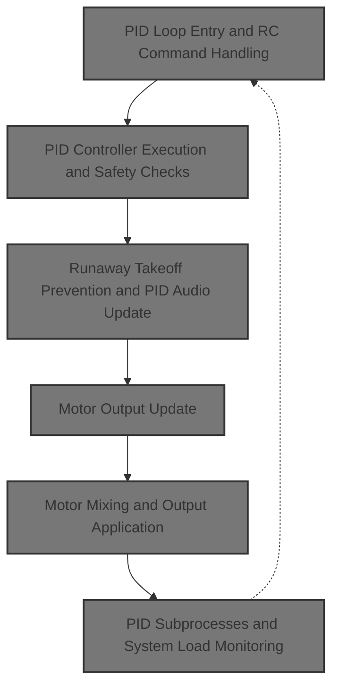
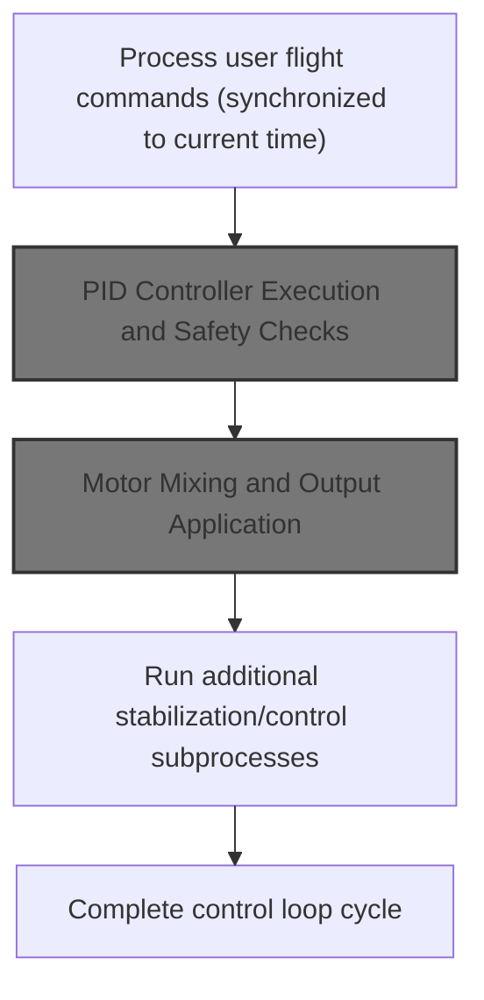
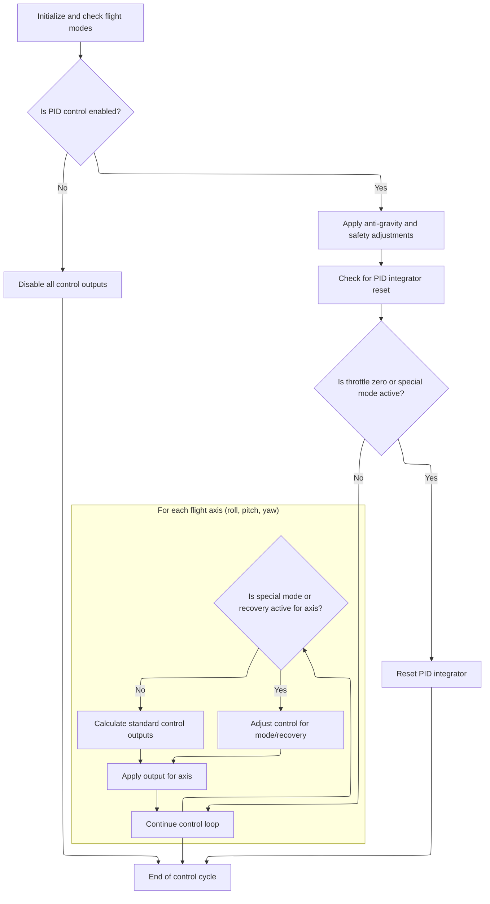
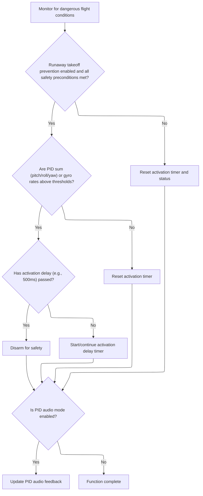
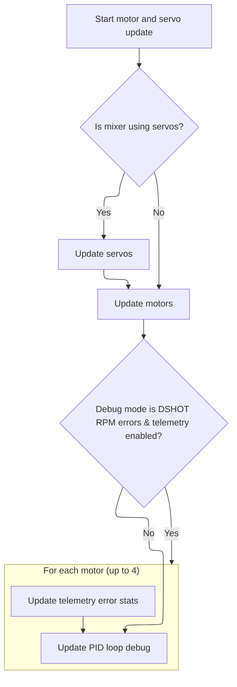

This document outlines the main control loop that continuously transforms user flight commands and sensor data into precise motor and servo outputs, ensuring stable and responsive flight.



# PID Loop Entry and RC Command Handling



<SwmSnippet path="/src/main/fc/core.c" line="1363">

---

We start by updating RC commands, then run the PID controller to process those inputs.

```c
FAST_CODE void taskMainPidLoop(timeUs_t currentTimeUs)
{

#if defined(SIMULATOR_BUILD) && defined(SIMULATOR_GYROPID_SYNC)
    if (lockMainPID() != 0) return;
#endif

    // DEBUG_PIDLOOP, timings for:
    // 0 - gyroUpdate()
    // 1 - subTaskPidController()
    // 2 - subTaskMotorUpdate()
    // 3 - subTaskPidSubprocesses()
    DEBUG_SET(DEBUG_PIDLOOP, 0, micros() - currentTimeUs);

    subTaskRcCommand(currentTimeUs);
    subTaskPidController(currentTimeUs);
```

---

</SwmSnippet>

## PID Controller Execution and Safety Checks

<SwmSnippet path="/src/main/fc/core.c" line="1175">

---

In <SwmToken path="src/main/fc/core.c" pos="1175:6:6" line-data="static FAST_CODE_NOINLINE void subTaskPidController(timeUs_t currentTimeUs)">`subTaskPidController`</SwmToken>, we call the PID controller for the active profile using a function pointer, letting us switch algorithms at runtime. This step is needed before any safety or audio logic, since those depend on the latest PID outputs.

```c
static FAST_CODE_NOINLINE void subTaskPidController(timeUs_t currentTimeUs)
{
    uint32_t startTime = 0;
    if (debugMode == DEBUG_PIDLOOP) {startTime = micros();}
    // PID - note this is function pointer set by setPIDController()
    pidController(currentPidProfile, currentTimeUs);
```

---

</SwmSnippet>

### Advanced PID Calculation and Flight Mode Adaptation



<SwmSnippet path="/src/main/flight/pid.c" line="1113">

---

In <SwmToken path="src/main/flight/pid.c" pos="1113:4:4" line-data="void FAST_CODE pidController(const pidProfile_t *pidProfile, timeUs_t currentTimeUs)">`pidController`</SwmToken>, we set up all the state and feature flags, then branch logic based on flight mode and enabled features. This lets us adjust PID calculations and safety checks for each scenario, not just run a basic PID loop.

```c
void FAST_CODE pidController(const pidProfile_t *pidProfile, timeUs_t currentTimeUs)
{
    static float previousGyroRateDterm[XYZ_AXIS_COUNT];
    static float previousRawGyroRateDterm[XYZ_AXIS_COUNT];

    calculateSpaValues(pidProfile);

#ifdef USE_YAW_SPIN_RECOVERY
    const bool yawSpinActive = gyroYawSpinDetected();
#endif

    const bool launchControlActive = isLaunchControlActive();

#if defined(USE_ACC)
    static timeUs_t levelModeStartTimeUs = 0;
    static bool prevExternalAngleRequest = false;
    const rollAndPitchTrims_t *angleTrim = &accelerometerConfig()->accelerometerTrims;
    float horizonLevelStrength = 0.0f;

    const bool isExternalAngleModeRequest = FLIGHT_MODE(GPS_RESCUE_MODE)
#ifdef USE_ALTITUDE_HOLD
                || FLIGHT_MODE(ALT_HOLD_MODE) // todo - check if this is needed
#endif
#ifdef USE_POSITION_HOLD
                || FLIGHT_MODE(POS_HOLD_MODE)
#endif
                ;
    levelMode_e levelMode;
    if (FLIGHT_MODE(ANGLE_MODE | HORIZON_MODE | GPS_RESCUE_MODE)) {
        if (pidRuntime.levelRaceMode && !isExternalAngleModeRequest) {
            levelMode = LEVEL_MODE_R;
        } else {
            levelMode = LEVEL_MODE_RP;
        }

        // Keep track of when we entered a self-level mode so that we can
        // add a guard time before crash recovery can activate.
        // Also reset the guard time whenever GPS Rescue is activated.
        if ((levelModeStartTimeUs == 0) || (isExternalAngleModeRequest && !prevExternalAngleRequest)) {
            levelModeStartTimeUs = currentTimeUs;
        }

        // Calc horizonLevelStrength if needed
        if (FLIGHT_MODE(HORIZON_MODE)) {
            horizonLevelStrength = calcHorizonLevelStrength();
        }
    } else {
        levelMode = LEVEL_MODE_OFF;
        levelModeStartTimeUs = 0;
    }

    prevExternalAngleRequest = isExternalAngleModeRequest;
#else
    UNUSED(pidProfile);
    UNUSED(currentTimeUs);
#endif

    // Anti Gravity
    if (pidRuntime.antiGravityEnabled) {
        pidRuntime.antiGravityThrottleD *= pidRuntime.antiGravityGain;
        // used later to increase pTerm
        pidRuntime.itermAccelerator = pidRuntime.antiGravityThrottleD * ANTIGRAVITY_KI;
    } else {
        pidRuntime.antiGravityThrottleD = 0.0f;
        pidRuntime.itermAccelerator = 0.0f;
    }
    DEBUG_SET(DEBUG_ANTI_GRAVITY, 2, lrintf((1 + (pidRuntime.itermAccelerator / pidRuntime.pidCoefficient[FD_PITCH].Ki)) * 1000));
    // amount of antigravity added relative to user's pitch iTerm coefficient
    // used later to increase iTerm

    // Precalculate gyro delta for D-term here, this allows loop unrolling
    float gyroRateDterm[XYZ_AXIS_COUNT];
    for (int axis = FD_ROLL; axis <= FD_YAW; ++axis) {
        gyroRateDterm[axis] = gyro.gyroADCf[axis];

        // Log the unfiltered D for ROLL and PITCH
        if (debugMode == DEBUG_D_LPF && axis != FD_YAW) {
            const float delta = (previousRawGyroRateDterm[axis] - gyroRateDterm[axis]) * pidRuntime.pidFrequency / D_LPF_RAW_SCALE;
            previousRawGyroRateDterm[axis] = gyroRateDterm[axis];
            DEBUG_SET(DEBUG_D_LPF, axis, lrintf(delta)); // debug d_lpf 2 and 3 used for pre-TPA D
        }

        gyroRateDterm[axis] = pidRuntime.dtermNotchApplyFn((filter_t *) &pidRuntime.dtermNotch[axis], gyroRateDterm[axis]);
        gyroRateDterm[axis] = pidRuntime.dtermLowpassApplyFn((filter_t *) &pidRuntime.dtermLowpass[axis], gyroRateDterm[axis]);
        gyroRateDterm[axis] = pidRuntime.dtermLowpass2ApplyFn((filter_t *) &pidRuntime.dtermLowpass2[axis], gyroRateDterm[axis]);
    }
```

---

</SwmSnippet>

<SwmSnippet path="/src/main/flight/pid.c" line="1203">

---

Here we run the main PID calculations for each axis, applying modifiers like anti-gravity, feedforward, <SwmToken path="src/main/flight/pid.c" pos="1399:36:38" line-data="        pidRuntime.previousPidSetpoint[axis] = currentPidSetpoint; // this is the value sent to blackbox, and used for D-max setpoint">`D-max`</SwmToken>, and SPA. These tweaks help the controller handle aggressive flight and keep things stable.

```c
    rpmFilterUpdate();
#endif

    if (pidRuntime.useEzDisarm) {
        disarmOnImpact();
    }

#ifdef USE_CHIRP

    static int chirpAxis = 0;
    static bool shouldChirpAxisToggle = false;

    float chirp = 0.0f;
    float sinarg = 0.0f;
    if (FLIGHT_MODE(CHIRP_MODE)) {
        shouldChirpAxisToggle = true;  // advance chirp axis on next !CHIRP_MODE
        // update chirp signal
        if (chirpUpdate(&pidRuntime.chirp)) {
            chirp = pidRuntime.chirp.exc;
            sinarg = pidRuntime.chirp.sinarg;
        }
    } else {
        if (shouldChirpAxisToggle) {
            // toggle chirp signal logic and increment to next axis for next run
            shouldChirpAxisToggle = false;
            chirpAxis = (++chirpAxis > FD_YAW) ? 0 : chirpAxis;
            // reset chirp signal generator
            chirpReset(&pidRuntime.chirp);
        }
    }

    // input / excitation shaping
    float chirpFiltered  = phaseCompApply(&pidRuntime.chirpFilter, chirp);

    // ToDo: check if this can be reconstructed offline for rotating filter and if so, remove the debug
    // fit (0...2*pi) into int16_t (-32768 to 32767)
    DEBUG_SET(DEBUG_CHIRP, 0, lrintf(5.0e3f * sinarg));

#endif // USE_CHIRP

    // ----------PID controller----------
    for (flight_dynamics_index_t axis = FD_ROLL; axis <= FD_YAW; ++axis) {

#ifdef USE_CHIRP
        float currentChirp = 0.0f;
        if(axis == chirpAxis){
            currentChirp = pidRuntime.chirpAmplitude[axis] * chirpFiltered;
        }
#endif // USE_CHIRP

        float currentPidSetpoint = getSetpointRate(axis);
        if (pidRuntime.maxVelocity[axis]) {
            currentPidSetpoint = accelerationLimit(axis, currentPidSetpoint);
        }
        // Yaw control is GYRO based, direct sticks control is applied to rate PID
        // When Race Mode is active PITCH control is also GYRO based in level or horizon mode
#if defined(USE_ACC)
        pidRuntime.axisInAngleMode[axis] = false;
        if (axis < FD_YAW) {
            if (levelMode == LEVEL_MODE_RP || (levelMode == LEVEL_MODE_R && axis == FD_ROLL)) {
                pidRuntime.axisInAngleMode[axis] = true;
                currentPidSetpoint = pidLevel(axis, pidProfile, angleTrim, currentPidSetpoint, horizonLevelStrength);
            }
        } else { // yaw axis only
            if (levelMode == LEVEL_MODE_RP) {
                // if earth referencing is requested, attenuate yaw axis setpoint when pitched or rolled
                // and send yawSetpoint to Angle code to modulate pitch and roll
                // code cost is 107 cycles when earthRef enabled, 20 otherwise, nearly all in cos_approx
                const float earthRefGain = FLIGHT_MODE(GPS_RESCUE_MODE) ? 1.0f : pidRuntime.angleEarthRef;
                if (earthRefGain) {
                    pidRuntime.angleYawSetpoint = currentPidSetpoint;
                    float maxAngleTargetAbs = earthRefGain * fmaxf( fabsf(pidRuntime.angleTarget[FD_ROLL]), fabsf(pidRuntime.angleTarget[FD_PITCH]) );
                    maxAngleTargetAbs *= (FLIGHT_MODE(HORIZON_MODE)) ? horizonLevelStrength : 1.0f;
                    // reduce compensation whenever Horizon uses less levelling
                    currentPidSetpoint *= cos_approx(DEGREES_TO_RADIANS(maxAngleTargetAbs));
                    DEBUG_SET(DEBUG_ANGLE_TARGET, 2, currentPidSetpoint); // yaw setpoint after attenuation
                }
            }
        }
#endif

        const float currentPidSetpointBeforeWingAdjust = currentPidSetpoint;
        currentPidSetpoint = wingAdjustSetpoint(currentPidSetpoint, axis);

#ifdef USE_ACRO_TRAINER
        if ((axis != FD_YAW) && pidRuntime.acroTrainerActive && !pidRuntime.inCrashRecoveryMode && !launchControlActive) {
            currentPidSetpoint = applyAcroTrainer(axis, angleTrim, currentPidSetpoint);
        }
#endif // USE_ACRO_TRAINER

#ifdef USE_LAUNCH_CONTROL
        if (launchControlActive) {
#if defined(USE_ACC)
            currentPidSetpoint = applyLaunchControl(axis, angleTrim);
#else
            currentPidSetpoint = applyLaunchControl(axis, NULL);
#endif
        }
#endif

        // Handle yaw spin recovery - zero the setpoint on yaw to aid in recovery
        // It's not necessary to zero the set points for R/P because the PIDs will be zeroed below
#ifdef USE_YAW_SPIN_RECOVERY
        if ((axis == FD_YAW) && yawSpinActive) {
            currentPidSetpoint = 0.0f;
        }
#endif // USE_YAW_SPIN_RECOVERY

        // -----calculate error rate
        const float gyroRate = gyro.gyroADCf[axis]; // Process variable from gyro output in deg/sec
#ifdef USE_CHIRP
        currentPidSetpoint += currentChirp;
#endif // USE_CHIRP
        float errorRate = currentPidSetpoint - gyroRate; // r - y
#if defined(USE_ACC)
        handleCrashRecovery(
            pidProfile->crash_recovery, angleTrim, axis, currentTimeUs, gyroRate,
            &currentPidSetpoint, &errorRate);
#endif

        const float previousIterm = pidData[axis].I;
        float itermErrorRate = errorRate;

#ifdef USE_ABSOLUTE_CONTROL
        const float uncorrectedSetpoint = currentPidSetpoint;
#endif

#if defined(USE_ITERM_RELAX)
        if (!launchControlActive && !pidRuntime.inCrashRecoveryMode) {
            applyItermRelax(axis, previousIterm, gyroRate, &itermErrorRate, &currentPidSetpoint);
            errorRate = currentPidSetpoint - gyroRate;
        }
#endif
#ifdef USE_ABSOLUTE_CONTROL
        const float setpointCorrection = currentPidSetpoint - uncorrectedSetpoint;
#endif

        // --------low-level gyro-based PID based on 2DOF PID controller. ----------

        // -----calculate P component
        pidData[axis].P = pidRuntime.pidCoefficient[axis].Kp * errorRate * getTpaFactor(pidProfile, axis, TERM_P);
        if (axis == FD_YAW) {
            pidData[axis].P = pidRuntime.ptermYawLowpassApplyFn((filter_t *) &pidRuntime.ptermYawLowpass, pidData[axis].P);
        }

        // -----calculate I component
        float Ki = pidRuntime.pidCoefficient[axis].Ki;
        float itermLimit = pidRuntime.itermLimit; // windup fraction of pidSumLimit

#ifdef USE_LAUNCH_CONTROL
        // if launch control is active override the iterm gains and apply iterm windup protection to all axes
        if (launchControlActive) {
            Ki = pidRuntime.launchControlKi;
        } else
#endif
        {
            // yaw iTerm has it's own limit based on pidSumLimitYaw
            if (axis == FD_YAW) {
                itermLimit = pidRuntime.itermLimitYaw; // windup fraction of pidSumLimitYaw
                // note that this is a stronger limit than previously
                pidRuntime.itermAccelerator = 0.0f; // no antigravity on yaw iTerm
            }
        }

        float iTermChange = (Ki + pidRuntime.itermAccelerator) * pidRuntime.dT * itermErrorRate;
#ifdef USE_WING
        if (pidProfile->spa_mode[axis] != SPA_MODE_OFF) {
            // slowing down I-term change, or even making it zero if setpoint is high enough
            iTermChange *= pidRuntime.spa[axis];
        }
#endif // USE_WING

        pidData[axis].I = constrainf(previousIterm + iTermChange, -itermLimit, itermLimit);

        // -----calculate D component

        float pidSetpointDelta = 0;

#if defined(USE_FEEDFORWARD) && defined(USE_ACC)
        if (FLIGHT_MODE(ANGLE_MODE) && pidRuntime.axisInAngleMode[axis]) {
            // this axis is fully under self-levelling control
            // it will already have stick based feedforward applied in the input to their angle setpoint
            // a simple setpoint Delta can be used to for PID feedforward element for motor lag on these axes
            // however RC steps come in, via angle setpoint
            // and setpoint RC smoothing must have a cutoff half normal to remove those steps completely
            // the RC stepping does not come in via the feedforward, which is very well smoothed already
            // if uncommented, and the forcing to zero is removed, the two following lines will restore PID feedforward to angle mode axes
            // but for now let's see how we go without it (which was the case before 4.5 anyway)
//            pidSetpointDelta = currentPidSetpoint - pidRuntime.previousPidSetpoint[axis];
//            pidSetpointDelta *= pidRuntime.pidFrequency * pidRuntime.angleFeedforwardGain;
            pidSetpointDelta = 0.0f;
        } else {
            // the axis is operating as a normal acro axis, so use normal feedforard from rc.c
            pidSetpointDelta = getFeedforward(axis);
        }
#endif
        pidRuntime.previousPidSetpoint[axis] = currentPidSetpoint; // this is the value sent to blackbox, and used for D-max setpoint

        // disable D if launch control is active
        if ((pidRuntime.pidCoefficient[axis].Kd > 0) && !launchControlActive) {
            // Divide rate change by dT to get differential (ie dr/dt).
            // dT is fixed and calculated from the target PID loop time
            // This is done to avoid DTerm spikes that occur with dynamically
            // calculated deltaT whenever another task causes the PID
            // loop execution to be delayed.
            const float delta = - (gyroRateDterm[axis] - previousGyroRateDterm[axis]) * pidRuntime.pidFrequency;
            float preTpaD = pidRuntime.pidCoefficient[axis].Kd * delta;

#if defined(USE_ACC)
            if (cmpTimeUs(currentTimeUs, levelModeStartTimeUs) > CRASH_RECOVERY_DETECTION_DELAY_US) {
                detectAndSetCrashRecovery(pidProfile->crash_recovery, axis, currentTimeUs, delta, errorRate);
            }
#endif

#ifdef USE_D_MAX
            float dMaxMultiplier = 1.0f;
            if (pidRuntime.dMaxPercent[axis] > 1.0f) {
                float dMaxGyroFactor = pt2FilterApply(&pidRuntime.dMaxRange[axis], delta);
                dMaxGyroFactor = fabsf(dMaxGyroFactor) * pidRuntime.dMaxGyroGain;
                const float dMaxSetpointFactor = fabsf(pidSetpointDelta) * pidRuntime.dMaxSetpointGain;
                const float dMaxBoost = fmaxf(dMaxGyroFactor, dMaxSetpointFactor);
                // dMaxBoost starts at zero, and by 1.0 we get Dmax, but it can exceed 1.
                dMaxMultiplier += (pidRuntime.dMaxPercent[axis] - 1.0f) * dMaxBoost;
                dMaxMultiplier = pt2FilterApply(&pidRuntime.dMaxLowpass[axis], dMaxMultiplier);
                // limit the gain to the fraction that DMax is greater than Min
                dMaxMultiplier = MIN(dMaxMultiplier, pidRuntime.dMaxPercent[axis]);
                if (debugMode == DEBUG_D_MAX && axis == gyro.gyroDebugAxis) {
                    DEBUG_SET(DEBUG_D_MAX, 0, lrintf(dMaxGyroFactor * 100));
                    DEBUG_SET(DEBUG_D_MAX, 1, lrintf(dMaxSetpointFactor * 100));
                    DEBUG_SET(DEBUG_D_MAX, 2, lrintf(pidRuntime.pidCoefficient[axis].Kd * dMaxMultiplier * 10 / DTERM_SCALE)); // effective Kd after Dmax boost
                    DEBUG_SET(DEBUG_D_MAX, 3, lrintf(dMaxMultiplier * 100));
                }
            }

            // Apply the gain that increases D towards Dmax
            preTpaD *= dMaxMultiplier;
#endif

            pidData[axis].D = preTpaD * getTpaFactor(pidProfile, axis, TERM_D);

            // Log the value of D pre application of TPA
            if (axis != FD_YAW) {
                DEBUG_SET(DEBUG_D_LPF, axis - FD_ROLL + 2, lrintf(preTpaD * D_LPF_PRE_TPA_SCALE));
            }
        } else {
            pidData[axis].D = 0;
            if (axis != FD_YAW) {
                DEBUG_SET(DEBUG_D_LPF, axis - FD_ROLL + 2, 0);
            }
        }

        previousGyroRateDterm[axis] = gyroRateDterm[axis];

        // -----calculate feedforward component

#ifdef USE_ABSOLUTE_CONTROL
        // include abs control correction in feedforward
        pidSetpointDelta += setpointCorrection - pidRuntime.oldSetpointCorrection[axis];
        pidRuntime.oldSetpointCorrection[axis] = setpointCorrection;
#endif
        // no feedforward in launch control
        const float feedforwardGain = launchControlActive ? 0.0f : pidRuntime.pidCoefficient[axis].Kf;
        pidData[axis].F = feedforwardGain * pidSetpointDelta;

#ifdef USE_YAW_SPIN_RECOVERY
        if (yawSpinActive) {
            pidData[axis].I = 0;  // in yaw spin always disable I
            if (axis <= FD_PITCH)  {
                // zero PIDs on pitch and roll leaving yaw P to correct spin
                pidData[axis].P = 0;
                pidData[axis].D = 0;
                pidData[axis].F = 0;
                pidData[axis].S = 0;
            }
        }
#endif // USE_YAW_SPIN_RECOVERY

#ifdef USE_LAUNCH_CONTROL
        // Disable P/I appropriately based on the launch control mode
        if (launchControlActive) {
            // if not using FULL mode then disable I accumulation on yaw as
            // yaw has a tendency to windup. Otherwise limit yaw iterm accumulation.
            const int launchControlYawItermLimit = (pidRuntime.launchControlMode == LAUNCH_CONTROL_MODE_FULL) ? LAUNCH_CONTROL_YAW_ITERM_LIMIT : 0;
            pidData[FD_YAW].I = constrainf(pidData[FD_YAW].I, -launchControlYawItermLimit, launchControlYawItermLimit);

            // for pitch-only mode we disable everything except pitch P/I
            if (pidRuntime.launchControlMode == LAUNCH_CONTROL_MODE_PITCHONLY) {
                pidData[FD_ROLL].P = 0;
                pidData[FD_ROLL].I = 0;
                pidData[FD_YAW].P = 0;
                // don't let I go negative (pitch backwards) as front motors are limited in the mixer
                pidData[FD_PITCH].I = MAX(0.0f, pidData[FD_PITCH].I);
            }
        }
#endif

        // Add P boost from antiGravity when sticks are close to zero
        if (axis != FD_YAW) {
            float agSetpointAttenuator = fabsf(currentPidSetpoint) / 50.0f;
            agSetpointAttenuator = MAX(agSetpointAttenuator, 1.0f);
            // attenuate effect if turning more than 50 deg/s, half at 100 deg/s
            const float antiGravityPBoost = 1.0f + (pidRuntime.antiGravityThrottleD / agSetpointAttenuator) * pidRuntime.antiGravityPGain;
            pidData[axis].P *= antiGravityPBoost;
            if (axis == FD_PITCH) {
                DEBUG_SET(DEBUG_ANTI_GRAVITY, 3, lrintf(antiGravityPBoost * 1000));
            }
        }

        pidData[axis].S = getSterm(axis, pidProfile, currentPidSetpointBeforeWingAdjust);
        applySpa(axis, pidProfile);

        // calculating the PID sum
        const float pidSum = pidData[axis].P + pidData[axis].I + pidData[axis].D + pidData[axis].F + pidData[axis].S;
#ifdef USE_INTEGRATED_YAW_CONTROL
        if (axis == FD_YAW && pidRuntime.useIntegratedYaw) {
            pidData[axis].Sum += pidSum * pidRuntime.dT * 100.0f;
            pidData[axis].Sum -= pidData[axis].Sum * pidRuntime.integratedYawRelax / 100000.0f * pidRuntime.dT / 0.000125f;
        } else
#endif
        {
            pidData[axis].Sum = pidSum;
        }
    }
```

---

</SwmSnippet>

<SwmSnippet path="/src/main/flight/pid.c" line="1528">

---

Here we check for conditions that require disabling PID control, like passthru mode or gyro overflow, and zero out all PID terms if needed. This prevents the controller from sending unwanted outputs.

```c
    // When PASSTHRU_MODE is active - reset all PIDs to zero so the aircraft won't snap out of control
    // because of accumulated PIDs once PASSTHRU_MODE gets disabled.
    bool isFixedWingAndPassthru = isFixedWing() && FLIGHT_MODE(PASSTHRU_MODE);
#endif // USE_WING
    // Disable PID control if at zero throttle or if gyro overflow detected
    // This may look very innefficient, but it is done on purpose to always show real CPU usage as in flight
    if (!pidRuntime.pidStabilisationEnabled
        || gyroOverflowDetected()
#ifdef USE_WING
        || isFixedWingAndPassthru
#endif
        ) {
        for (int axis = FD_ROLL; axis <= FD_YAW; ++axis) {
            pidData[axis].P = 0;
            pidData[axis].I = 0;
            pidData[axis].D = 0;
            pidData[axis].F = 0;
            pidData[axis].S = 0;

            pidData[axis].Sum = 0;
        }
```

---

</SwmSnippet>

<SwmSnippet path="/src/main/flight/pid.c" line="1549">

---

Finally, the PID controller updates the global PID data for each axis, with all terms calculated and safety resets applied if needed. No explicit return value, just updated state.

```c
    } else if (pidRuntime.zeroThrottleItermReset) {
        pidResetIterm();
    }
}
```

---

</SwmSnippet>

### Runaway Takeoff Prevention and PID Audio Update



<SwmSnippet path="/src/main/fc/core.c" line="1181">

---

Back in <SwmToken path="src/main/fc/core.c" pos="1175:6:6" line-data="static FAST_CODE_NOINLINE void subTaskPidController(timeUs_t currentTimeUs)">`subTaskPidController`</SwmToken>, after running the PID controller, we check for runaway takeoff by monitoring PID sums and gyro rates. If they're too high for long enough, we disarm for safety. PID audio feedback is also updated if the mode is active.

```c
    DEBUG_SET(DEBUG_PIDLOOP, 1, micros() - startTime);

#ifdef USE_RUNAWAY_TAKEOFF
    // Check to see if runaway takeoff detection is active (anti-taz), the pidSum is over the threshold,
    // and gyro rate for any axis is above the limit for at least the activate delay period.
    // If so, disarm for safety
    if (ARMING_FLAG(ARMED)
        && !isFixedWing()
        && pidConfig()->runaway_takeoff_prevention
        && !runawayTakeoffCheckDisabled
        && !crashFlipModeActive
        && !runawayTakeoffTemporarilyDisabled
        && !FLIGHT_MODE(GPS_RESCUE_MODE)   // disable Runaway Takeoff triggering if GPS Rescue is active
        // check that motors are running
        && (!featureIsEnabled(FEATURE_MOTOR_STOP) || isAirmodeEnabled() || (calculateThrottleStatus() != THROTTLE_LOW))) {

        if (((fabsf(pidData[FD_PITCH].Sum) >= RUNAWAY_TAKEOFF_PIDSUM_THRESHOLD)
            || (fabsf(pidData[FD_ROLL].Sum) >= RUNAWAY_TAKEOFF_PIDSUM_THRESHOLD)
            || (fabsf(pidData[FD_YAW].Sum) >= RUNAWAY_TAKEOFF_PIDSUM_THRESHOLD))
            && ((gyroAbsRateDps(FD_PITCH) > RUNAWAY_TAKEOFF_GYRO_LIMIT_RP)
                || (gyroAbsRateDps(FD_ROLL) > RUNAWAY_TAKEOFF_GYRO_LIMIT_RP)
                || (gyroAbsRateDps(FD_YAW) > RUNAWAY_TAKEOFF_GYRO_LIMIT_YAW))) {

            if (runawayTakeoffTriggerUs == 0) {
                runawayTakeoffTriggerUs = currentTimeUs + RUNAWAY_TAKEOFF_ACTIVATE_DELAY;
            } else if (currentTimeUs > runawayTakeoffTriggerUs) {
                setArmingDisabled(ARMING_DISABLED_RUNAWAY_TAKEOFF);
                disarm(DISARM_REASON_RUNAWAY_TAKEOFF);
            }
        } else {
            runawayTakeoffTriggerUs = 0;
        }
        DEBUG_SET(DEBUG_RUNAWAY_TAKEOFF, DEBUG_RUNAWAY_TAKEOFF_ENABLED_STATE, DEBUG_RUNAWAY_TAKEOFF_TRUE);
        DEBUG_SET(DEBUG_RUNAWAY_TAKEOFF, DEBUG_RUNAWAY_TAKEOFF_ACTIVATING_DELAY, runawayTakeoffTriggerUs == 0 ? DEBUG_RUNAWAY_TAKEOFF_FALSE : DEBUG_RUNAWAY_TAKEOFF_TRUE);
    } else {
        runawayTakeoffTriggerUs = 0;
        DEBUG_SET(DEBUG_RUNAWAY_TAKEOFF, DEBUG_RUNAWAY_TAKEOFF_ENABLED_STATE, DEBUG_RUNAWAY_TAKEOFF_FALSE);
        DEBUG_SET(DEBUG_RUNAWAY_TAKEOFF, DEBUG_RUNAWAY_TAKEOFF_ACTIVATING_DELAY, DEBUG_RUNAWAY_TAKEOFF_FALSE);
    }
#endif

#ifdef USE_PID_AUDIO
    if (isModeActivationConditionPresent(BOXPIDAUDIO)) {
        pidAudioUpdate();
    }
#endif
}
```

---

</SwmSnippet>

## Motor Output Update

<SwmSnippet path="/src/main/fc/core.c" line="1379">

---

In <SwmToken path="src/main/fc/core.c" pos="1363:4:4" line-data="FAST_CODE void taskMainPidLoop(timeUs_t currentTimeUs)">`taskMainPidLoop`</SwmToken>, after running the PID controller and safety checks, we update motor outputs so the latest control decisions are sent to the actuators without delay.

```c
    subTaskMotorUpdate(currentTimeUs);
```

---

</SwmSnippet>

## Motor Mixing and Output Application

<SwmSnippet path="/src/main/fc/core.c" line="1267">

---

In <SwmToken path="src/main/fc/core.c" pos="1267:6:6" line-data="static FAST_CODE void subTaskMotorUpdate(timeUs_t currentTimeUs)">`subTaskMotorUpdate`</SwmToken>, we start by running <SwmToken path="src/main/fc/core.c" pos="1281:1:1" line-data="    mixTable(currentTimeUs);">`mixTable`</SwmToken> to calculate motor outputs from the latest control data, then handle servo mixing and telemetry as needed before writing outputs to the hardware.

```c
static FAST_CODE void subTaskMotorUpdate(timeUs_t currentTimeUs)
{
    uint32_t startTime = 0;
    if (debugMode == DEBUG_CYCLETIME) {
        startTime = micros();
        static uint32_t previousMotorUpdateTime;
        const uint32_t currentDeltaTime = startTime - previousMotorUpdateTime;
        debug[2] = currentDeltaTime;
        debug[3] = currentDeltaTime - targetPidLooptime;
        previousMotorUpdateTime = startTime;
    } else if (debugMode == DEBUG_PIDLOOP) {
        startTime = micros();
    }

    mixTable(currentTimeUs);

#ifdef USE_SERVOS
```

---

</SwmSnippet>

### Motor Output Calculation and Mixer Adjustments

```mermaid
%%{init: {"flowchart": {"defaultRenderer": "elk"}} }%%
flowchart TD
    node1["Start motor mixing process"]
    click node1 openCode "src/main/flight/mixer.c:680:681"
    node1 --> node2{"Is crash flip mode active?"}
    click node2 openCode "src/main/flight/mixer.c:688:690"
    node2 -->|"Yes"| node3["Skip mixing and exit"]
    click node3 openCode "src/main/flight/mixer.c:689:690"
    node2 -->|"No"| node4["Calculate throttle and motor endpoints"]
    click node4 openCode "src/main/flight/mixer.c:686:686"
    node4 --> node5{"Is special flight mode active?"}
    click node5 openCode "src/main/flight/mixer.c:684:813"
    node5 -->|"Launch Control"| node6["Override throttle for launch"]
    click node6 openCode "src/main/flight/mixer.c:796:798"
    node5 -->|"Yaw Spin Recovery"| node7["Override throttle for yaw recovery"]
    click node7 openCode "src/main/flight/mixer.c:788:790"
    node5 -->|"Altitude Hold/GPS Rescue"| node8["Override throttle for autopilot"]
    click node8 openCode "src/main/flight/mixer.c:803:813"
    node5 -->|"None"| node9["Use calculated throttle"]
    click node9 openCode "src/main/flight/mixer.c:684:813"
    node6 --> node10["Begin motor mixing"]
    node7 --> node10
    node8 --> node10
    node9 --> node10
    click node10 openCode "src/main/flight/mixer.c:770:782"
    subgraph loop1["For each motor"]
        node10 --> node11["Calculate mix for motor"]
        click node11 openCode "src/main/flight/mixer.c:771:782"
        node11 -->|"Next motor"| node10
    end
    node10 --> node12{"Which mixer type?"}
    click node12 openCode "src/main/flight/mixer.c:819:833"
    node12 -->|"Legacy"| node13["Apply legacy mixer adjustment"]
    click node13 openCode "src/main/flight/mixer.c:821:822"
    node12 -->|"Linear/Dynamic"| node14["Apply linear mixer adjustment"]
    click node14 openCode "src/main/flight/mixer.c:825:826"
    node12 -->|"EZLanding"| node15["Apply EZLanding mixer adjustment"]
    click node15 openCode "src/main/flight/mixer.c:828:829"
    node12 -->|"Other"| node13
    node13 --> node16{"Should motors be stopped for safety?"}
    node14 --> node16
    node15 --> node16
    click node16 openCode "src/main/flight/mixer.c:835:840"
    node16 -->|"Yes"| node17["Stop motors"]
    click node17 openCode "src/main/flight/mixer.c:841:842"
    node16 -->|"No"| node18["Apply mix to motors"]
    click node18 openCode "src/main/flight/mixer.c:844:845"
classDef HeadingStyle fill:#777777,stroke:#333,stroke-width:2px;

%% Swimm:
%% %%{init: {"flowchart": {"defaultRenderer": "elk"}} }%%
%% flowchart TD
%%     node1["Start motor mixing process"]
%%     click node1 openCode "<SwmPath>[src/…/flight/mixer.c](src/main/flight/mixer.c)</SwmPath>:680:681"
%%     node1 --> node2{"Is crash flip mode active?"}
%%     click node2 openCode "<SwmPath>[src/…/flight/mixer.c](src/main/flight/mixer.c)</SwmPath>:688:690"
%%     node2 -->|"Yes"| node3["Skip mixing and exit"]
%%     click node3 openCode "<SwmPath>[src/…/flight/mixer.c](src/main/flight/mixer.c)</SwmPath>:689:690"
%%     node2 -->|"No"| node4["Calculate throttle and motor endpoints"]
%%     click node4 openCode "<SwmPath>[src/…/flight/mixer.c](src/main/flight/mixer.c)</SwmPath>:686:686"
%%     node4 --> node5{"Is special flight mode active?"}
%%     click node5 openCode "<SwmPath>[src/…/flight/mixer.c](src/main/flight/mixer.c)</SwmPath>:684:813"
%%     node5 -->|"Launch Control"| node6["Override throttle for launch"]
%%     click node6 openCode "<SwmPath>[src/…/flight/mixer.c](src/main/flight/mixer.c)</SwmPath>:796:798"
%%     node5 -->|"Yaw Spin Recovery"| node7["Override throttle for yaw recovery"]
%%     click node7 openCode "<SwmPath>[src/…/flight/mixer.c](src/main/flight/mixer.c)</SwmPath>:788:790"
%%     node5 -->|"Altitude Hold/GPS Rescue"| node8["Override throttle for autopilot"]
%%     click node8 openCode "<SwmPath>[src/…/flight/mixer.c](src/main/flight/mixer.c)</SwmPath>:803:813"
%%     node5 -->|"None"| node9["Use calculated throttle"]
%%     click node9 openCode "<SwmPath>[src/…/flight/mixer.c](src/main/flight/mixer.c)</SwmPath>:684:813"
%%     node6 --> node10["Begin motor mixing"]
%%     node7 --> node10
%%     node8 --> node10
%%     node9 --> node10
%%     click node10 openCode "<SwmPath>[src/…/flight/mixer.c](src/main/flight/mixer.c)</SwmPath>:770:782"
%%     subgraph loop1["For each motor"]
%%         node10 --> node11["Calculate mix for motor"]
%%         click node11 openCode "<SwmPath>[src/…/flight/mixer.c](src/main/flight/mixer.c)</SwmPath>:771:782"
%%         node11 -->|"Next motor"| node10
%%     end
%%     node10 --> node12{"Which mixer type?"}
%%     click node12 openCode "<SwmPath>[src/…/flight/mixer.c](src/main/flight/mixer.c)</SwmPath>:819:833"
%%     node12 -->|"Legacy"| node13["Apply legacy mixer adjustment"]
%%     click node13 openCode "<SwmPath>[src/…/flight/mixer.c](src/main/flight/mixer.c)</SwmPath>:821:822"
%%     node12 -->|"Linear/Dynamic"| node14["Apply linear mixer adjustment"]
%%     click node14 openCode "<SwmPath>[src/…/flight/mixer.c](src/main/flight/mixer.c)</SwmPath>:825:826"
%%     node12 -->|"EZLanding"| node15["Apply EZLanding mixer adjustment"]
%%     click node15 openCode "<SwmPath>[src/…/flight/mixer.c](src/main/flight/mixer.c)</SwmPath>:828:829"
%%     node12 -->|"Other"| node13
%%     node13 --> node16{"Should motors be stopped for safety?"}
%%     node14 --> node16
%%     node15 --> node16
%%     click node16 openCode "<SwmPath>[src/…/flight/mixer.c](src/main/flight/mixer.c)</SwmPath>:835:840"
%%     node16 -->|"Yes"| node17["Stop motors"]
%%     click node17 openCode "<SwmPath>[src/…/flight/mixer.c](src/main/flight/mixer.c)</SwmPath>:841:842"
%%     node16 -->|"No"| node18["Apply mix to motors"]
%%     click node18 openCode "<SwmPath>[src/…/flight/mixer.c](src/main/flight/mixer.c)</SwmPath>:844:845"
%% classDef HeadingStyle fill:#777777,stroke:#333,stroke-width:2px;
```



<SwmSnippet path="/src/main/flight/mixer.c" line="680">

---

In <SwmToken path="src/main/flight/mixer.c" pos="680:4:4" line-data="FAST_CODE_NOINLINE void mixTable(timeUs_t currentTimeUs)">`mixTable`</SwmToken>, we check flight modes and safety flags, then calculate motor outputs using the right mixer and PID limits. We adjust throttle and apply all relevant modifiers before mixing outputs for each motor.

```c
FAST_CODE_NOINLINE void mixTable(timeUs_t currentTimeUs)
{
    const bool launchControlActive = isLaunchControlActive();
    const bool airmodeEnabled = isAirmodeEnabled() || launchControlActive;

    // Find min and max throttle based on conditions. Throttle has to be known before mixing
    calculateThrottleAndCurrentMotorEndpoints(currentTimeUs);

    if (applyCrashFlipModeToMotors()) {
        return; // if crash flip mode has been applied to the motors, mixing is done
    }

    motorMixer_t * activeMixer = &mixerRuntime.currentMixer[0];
#ifdef USE_LAUNCH_CONTROL
    if (launchControlActive && (currentPidProfile->launchControlMode == LAUNCH_CONTROL_MODE_PITCHONLY)) {
        activeMixer = &mixerRuntime.launchControlMixer[0];
    }
#endif

    // Calculate and Limit the PID sum
    const float scaledAxisPidRoll =
        constrainf(pidData[FD_ROLL].Sum, -currentPidProfile->pidSumLimit, currentPidProfile->pidSumLimit) / PID_MIXER_SCALING;
    const float scaledAxisPidPitch =
        constrainf(pidData[FD_PITCH].Sum, -currentPidProfile->pidSumLimit, currentPidProfile->pidSumLimit) / PID_MIXER_SCALING;

    uint16_t yawPidSumLimit = currentPidProfile->pidSumLimitYaw;

#ifdef USE_YAW_SPIN_RECOVERY
    const bool yawSpinDetected = gyroYawSpinDetected();
    if (yawSpinDetected) {
        yawPidSumLimit = PIDSUM_LIMIT_MAX;   // Set to the maximum limit during yaw spin recovery to prevent limiting motor authority
    }
#endif // USE_YAW_SPIN_RECOVERY

    float scaledAxisPidYaw =
        constrainf(pidData[FD_YAW].Sum, -yawPidSumLimit, yawPidSumLimit) / PID_MIXER_SCALING;

    if (!mixerConfig()->yaw_motors_reversed) {
        scaledAxisPidYaw = -scaledAxisPidYaw;
    }

    // Apply the throttle_limit_percent to scale or limit the throttle based on throttle_limit_type
    if (currentControlRateProfile->throttle_limit_type != THROTTLE_LIMIT_TYPE_OFF) {
        throttle = applyThrottleLimit(throttle);
    }

    // use scaled throttle, without dynamic idle throttle offset, as the input to antigravity
    pidUpdateAntiGravityThrottleFilter(throttle);

    // and for TPA
    pidUpdateTpaFactor(throttle);

#ifdef USE_DYN_LPF
    // keep the changes to dynamic lowpass clean, without unnecessary dynamic changes
    updateDynLpfCutoffs(currentTimeUs, throttle);
#endif

    // apply throttle boost when throttle moves quickly
#if defined(USE_THROTTLE_BOOST)
    if (throttleBoost > 0.0f) {
        const float throttleHpf = throttle - pt1FilterApply(&throttleLpf, throttle);
        throttle = constrainf(throttle + throttleBoost * throttleHpf, 0.0f, 1.0f);
    }
#endif

    // send throttle value to blackbox, including scaling and throttle boost, but not TL compensation, dyn idle or airmode
    mixerThrottle = throttle;

#ifdef USE_DYN_IDLE
    // Set min throttle offset of 1% when stick is at zero and dynamic idle is active
    if (mixerRuntime.dynIdleMinRps > 0.0f) {
        throttle = MAX(throttle, 0.01f);
    }
#endif

#ifdef USE_THRUST_LINEARIZATION
    // reduce throttle to offset additional motor output
    throttle = pidCompensateThrustLinearization(throttle);
#endif

#ifdef USE_RPM_LIMIT
    if (RPM_LIMIT_ACTIVE && useDshotTelemetry && ARMING_FLAG(ARMED)) {
        applyRpmLimiter(&mixerRuntime);
    }
#endif

    // Find roll/pitch/yaw desired output
    // ??? Where is the optimal location for this code?
    float motorMix[MAX_SUPPORTED_MOTORS];
    float motorMixMax = 0, motorMixMin = 0;
    for (int i = 0; i < mixerRuntime.motorCount; i++) {
        float mix =
            scaledAxisPidRoll  * activeMixer[i].roll +
            scaledAxisPidPitch * activeMixer[i].pitch +
            scaledAxisPidYaw   * activeMixer[i].yaw;

        if (mix > motorMixMax) {
            motorMixMax = mix;
        } else if (mix < motorMixMin) {
            motorMixMin = mix;
        }
        motorMix[i] = mix;
    }
```

---

</SwmSnippet>

<SwmSnippet path="/src/main/flight/mixer.c" line="784">

---

Finally, <SwmToken path="src/main/fc/core.c" pos="1281:1:1" line-data="    mixTable(currentTimeUs);">`mixTable`</SwmToken> updates the motor outputs in global state, applying all mode and safety adjustments. No explicit return value, just updated outputs.

```c
    //  The following fixed throttle values will not be shown in the blackbox log
#ifdef USE_YAW_SPIN_RECOVERY
    // 50% throttle provides the maximum authority for yaw recovery when airmode is not active.
    // When airmode is active the throttle setting doesn't impact recovery authority.
    if (yawSpinDetected && !airmodeEnabled) {
        throttle = 0.5f;
    }
#endif // USE_YAW_SPIN_RECOVERY

#ifdef USE_LAUNCH_CONTROL
    // While launch control is active keep the throttle at minimum.
    // Once the pilot triggers the launch throttle control will be reactivated.
    if (launchControlActive) {
        throttle = 0.0f;
    }
#endif

#ifdef USE_ALTITUDE_HOLD
    // Throttle value to be used during altitude hold mode (and failsafe landing mode)
    if (FLIGHT_MODE(ALT_HOLD_MODE)) {
        throttle = getAutopilotThrottle();
    }
#endif

#ifdef USE_GPS_RESCUE
    // If gps rescue is active then override the throttle. This prevents things
    // like throttle boost or throttle limit from negatively affecting the throttle.
    if (FLIGHT_MODE(GPS_RESCUE_MODE)) {
        throttle = getAutopilotThrottle();
    }
#endif

    motorMixRange = motorMixMax - motorMixMin;

    // note that here airmodeEnabled is true also when Launch Control is active
    switch (mixerConfig()->mixer_type) {
    case MIXER_LEGACY:
        applyMixerAdjustment(motorMix, motorMixMin, motorMixMax, airmodeEnabled);
        break;
    case MIXER_LINEAR:
    case MIXER_DYNAMIC:
        applyMixerAdjustmentLinear(motorMix, airmodeEnabled);
        break;
    case MIXER_EZLANDING:
        applyMixerAdjustmentEzLand(motorMix, motorMixMin, motorMixMax);
        break;
    default:
        applyMixerAdjustment(motorMix, motorMixMin, motorMixMax, airmodeEnabled);
        break;
    }

    if (featureIsEnabled(FEATURE_MOTOR_STOP)
        && ARMING_FLAG(ARMED)
        && !mixerRuntime.feature3dEnabled
        && !airmodeEnabled
        && !FLIGHT_MODE(GPS_RESCUE_MODE | ALT_HOLD_MODE | POS_HOLD_MODE)   // disable motor_stop while GPS Rescue / Alt Hold / Pos Hold is active
        && (rcData[THROTTLE] < rxConfig()->mincheck)) {
        applyMotorStop();
    } else {
        // Apply the mix to motor endpoints
        applyMixToMotors(motorMix, activeMixer);
    }
}
```

---

</SwmSnippet>

### Servo Output, Motor Write, and Telemetry Debug



<SwmSnippet path="/src/main/fc/core.c" line="1284">

---

Finally, <SwmToken path="src/main/fc/core.c" pos="1267:6:6" line-data="static FAST_CODE void subTaskMotorUpdate(timeUs_t currentTimeUs)">`subTaskMotorUpdate`</SwmToken> updates motor and servo outputs, records debug timing, and telemetry if needed. No explicit return value, just updated hardware and debug state.

```c
    // motor outputs are used as sources for servo mixing, so motors must be calculated using mixTable() before servos.
    if (isMixerUsingServos()) {
        writeServos();
    }
#endif

    writeMotors();

#ifdef USE_DSHOT_TELEMETRY_STATS
    if (debugMode == DEBUG_DSHOT_RPM_ERRORS && useDshotTelemetry) {
        const uint8_t motorCount = MIN(getMotorCount(), 4);
        for (uint8_t i = 0; i < motorCount; i++) {
            debug[i] = getDshotTelemetryMotorInvalidPercent(i);
        }
```

---

</SwmSnippet>

<SwmSnippet path="/src/main/fc/core.c" line="1301">

---

Finally, <SwmToken path="src/main/fc/core.c" pos="1267:6:6" line-data="static FAST_CODE void subTaskMotorUpdate(timeUs_t currentTimeUs)">`subTaskMotorUpdate`</SwmToken> updates motor and servo outputs, records debug timing, and telemetry if needed. No explicit return value, just updated hardware and debug state.

```c
    DEBUG_SET(DEBUG_PIDLOOP, 2, micros() - startTime);
}
```

---

</SwmSnippet>

## PID Subprocesses and System Load Monitoring

<SwmSnippet path="/src/main/fc/core.c" line="1380">

---

In <SwmToken path="src/main/fc/core.c" pos="1363:4:4" line-data="FAST_CODE void taskMainPidLoop(timeUs_t currentTimeUs)">`taskMainPidLoop`</SwmToken>, after updating motors, we run PID subprocesses and record system load and timing for diagnostics. This keeps extra tasks separate from the main control loop.

```c
    subTaskPidSubprocesses(currentTimeUs);

    DEBUG_SET(DEBUG_CYCLETIME, 0, getTaskDeltaTimeUs(TASK_SELF));
    DEBUG_SET(DEBUG_CYCLETIME, 1, getAverageSystemLoadPercent());
}
```

---

</SwmSnippet>

&nbsp;

*This is an auto-generated document by Swimm 🌊 and has not yet been verified by a human*

<SwmMeta version="3.0.0" repo-id="Z2l0aHViJTNBJTNBYy1iZXRhZmxpZ2h0JTNBJTNBcmljYXJkb2xvcGV6Zw==" repo-name="c-betaflight"><sup>Powered by [Swimm](https://app.swimm.io/)</sup></SwmMeta>
