This document outlines how users interact with configuration variables through the command-line interface. Users can display all current settings, update specific variables, or query the value of a variable. The flow also supports switching between different profiles. Input is a user command, and output is either the display of settings, confirmation of changes, or the value of a queried variable.

# Setting CLI Variables

```mermaid
%%{init: {"flowchart": {"defaultRenderer": "elk"}} }%%
flowchart TD
    node1{"Is command empty or '*'?"}
    click node1 openCode "src/main/cli/cli.c:4465:4474"
    node1 -->|"Yes"| node2["Display all current settings"]
    click node2 openCode "src/main/cli/cli.c:4466:4473"
    subgraph loop1["For each setting"]
        node2 --> node3["Show setting name and value"]
        click node3 openCode "src/main/cli/cli.c:4469:4472"
        node3 --> node2
    end
    node2 --> node4["End"]
    node1 -->|"No"| node5{"Does command contain '='?"}
    click node5 openCode "src/main/cli/cli.c:4474:4662"
    node5 -->|"Yes"| node6{"Is setting name valid?"}
    click node6 openCode "src/main/cli/cli.c:4483:4487"
    node6 -->|"Yes"| node7{"What is value type?"}
    click node7 openCode "src/main/cli/cli.c:4492:4651"
    node7 -->|"Number"| node8{"Is value within allowed range?"}
    click node8 openCode "src/main/cli/cli.c:4494:4520"
    node8 -->|"Yes"| node9["Update setting and confirm"]
    click node9 openCode "src/main/cli/cli.c:4653:4656"
    node8 -->|"No"| node10["Show error and valid range"]
    click node10 openCode "src/main/cli/cli.c:4657:4659"
    node7 -->|"Lookup/Bitset"| node11["Find matching value in lookup table"]
    click node11 openCode "src/main/cli/cli.c:4524:4543"
    subgraph loop2["For each value in lookup table"]
        node11 --> node12{"Is value matched?"}
        click node12 openCode "src/main/cli/cli.c:4534:4542"
        node12 -->|"Yes"| node9
        node12 -->|"No"| node11
    end
    node7 -->|"Array"| node13["Set each array element"]
    click node13 openCode "src/main/cli/cli.c:4548:4622"
    subgraph loop3["For each array element"]
        node13 --> node14["Update array element"]
        click node14 openCode "src/main/cli/cli.c:4553:4622"
        node14 --> node13
    end
    node13 --> node9
    node7 -->|"String"| node15{"Is string updatable and within length limits?"}
    click node15 openCode "src/main/cli/cli.c:4629:4646"
    node15 -->|"Yes"| node9
    node15 -->|"No"| node16["Show string error"]
    click node16 openCode "src/main/cli/cli.c:4647:4648"
    node16 --> node4
    node9 --> node4
    node10 --> node4
    node6 -->|"No"| node17["Show error: Invalid name"]
    click node17 openCode "src/main/cli/cli.c:4485:4486"
    node17 --> node4
    node5 -->|"No"| node18["Show matching variable value"]
    click node18 openCode "src/main/cli/cli.c:4664:4665"
    node18 --> node4
    node4["End"]
classDef HeadingStyle fill:#777777,stroke:#333,stroke-width:2px;

%% Swimm:
%% %%{init: {"flowchart": {"defaultRenderer": "elk"}} }%%
%% flowchart TD
%%     node1{"Is command empty or '*'?"}
%%     click node1 openCode "<SwmPath>[src/…/cli/cli.c](src/main/cli/cli.c)</SwmPath>:4465:4474"
%%     node1 -->|"Yes"| node2["Display all current settings"]
%%     click node2 openCode "<SwmPath>[src/…/cli/cli.c](src/main/cli/cli.c)</SwmPath>:4466:4473"
%%     subgraph loop1["For each setting"]
%%         node2 --> node3["Show setting name and value"]
%%         click node3 openCode "<SwmPath>[src/…/cli/cli.c](src/main/cli/cli.c)</SwmPath>:4469:4472"
%%         node3 --> node2
%%     end
%%     node2 --> node4["End"]
%%     node1 -->|"No"| node5{"Does command contain '='?"}
%%     click node5 openCode "<SwmPath>[src/…/cli/cli.c](src/main/cli/cli.c)</SwmPath>:4474:4662"
%%     node5 -->|"Yes"| node6{"Is setting name valid?"}
%%     click node6 openCode "<SwmPath>[src/…/cli/cli.c](src/main/cli/cli.c)</SwmPath>:4483:4487"
%%     node6 -->|"Yes"| node7{"What is value type?"}
%%     click node7 openCode "<SwmPath>[src/…/cli/cli.c](src/main/cli/cli.c)</SwmPath>:4492:4651"
%%     node7 -->|"Number"| node8{"Is value within allowed range?"}
%%     click node8 openCode "<SwmPath>[src/…/cli/cli.c](src/main/cli/cli.c)</SwmPath>:4494:4520"
%%     node8 -->|"Yes"| node9["Update setting and confirm"]
%%     click node9 openCode "<SwmPath>[src/…/cli/cli.c](src/main/cli/cli.c)</SwmPath>:4653:4656"
%%     node8 -->|"No"| node10["Show error and valid range"]
%%     click node10 openCode "<SwmPath>[src/…/cli/cli.c](src/main/cli/cli.c)</SwmPath>:4657:4659"
%%     node7 -->|"Lookup/Bitset"| node11["Find matching value in lookup table"]
%%     click node11 openCode "<SwmPath>[src/…/cli/cli.c](src/main/cli/cli.c)</SwmPath>:4524:4543"
%%     subgraph loop2["For each value in lookup table"]
%%         node11 --> node12{"Is value matched?"}
%%         click node12 openCode "<SwmPath>[src/…/cli/cli.c](src/main/cli/cli.c)</SwmPath>:4534:4542"
%%         node12 -->|"Yes"| node9
%%         node12 -->|"No"| node11
%%     end
%%     node7 -->|"Array"| node13["Set each array element"]
%%     click node13 openCode "<SwmPath>[src/…/cli/cli.c](src/main/cli/cli.c)</SwmPath>:4548:4622"
%%     subgraph loop3["For each array element"]
%%         node13 --> node14["Update array element"]
%%         click node14 openCode "<SwmPath>[src/…/cli/cli.c](src/main/cli/cli.c)</SwmPath>:4553:4622"
%%         node14 --> node13
%%     end
%%     node13 --> node9
%%     node7 -->|"String"| node15{"Is string updatable and within length limits?"}
%%     click node15 openCode "<SwmPath>[src/…/cli/cli.c](src/main/cli/cli.c)</SwmPath>:4629:4646"
%%     node15 -->|"Yes"| node9
%%     node15 -->|"No"| node16["Show string error"]
%%     click node16 openCode "<SwmPath>[src/…/cli/cli.c](src/main/cli/cli.c)</SwmPath>:4647:4648"
%%     node16 --> node4
%%     node9 --> node4
%%     node10 --> node4
%%     node6 -->|"No"| node17["Show error: Invalid name"]
%%     click node17 openCode "<SwmPath>[src/…/cli/cli.c](src/main/cli/cli.c)</SwmPath>:4485:4486"
%%     node17 --> node4
%%     node5 -->|"No"| node18["Show matching variable value"]
%%     click node18 openCode "<SwmPath>[src/…/cli/cli.c](src/main/cli/cli.c)</SwmPath>:4664:4665"
%%     node18 --> node4
%%     node4["End"]
%% classDef HeadingStyle fill:#777777,stroke:#333,stroke-width:2px;
```



<SwmSnippet path="/src/main/cli/cli.c" line="4460">

---

In <SwmToken path="src/main/cli/cli.c" pos="4460:4:4" line-data="STATIC_UNIT_TESTED void cliSet(const char *cmdName, char *cmdline)">`cliSet`</SwmToken>, we start by checking if the command line is empty or just a '*'. If so, it prints out all current CLI variable settings by iterating over the value table and printing each variable's name and value. This is a quick way to dump all settings for review or export. If the input isn't empty or '*', the function moves on to parsing and setting variables based on the input.

```c
STATIC_UNIT_TESTED void cliSet(const char *cmdName, char *cmdline)
{
    const uint32_t len = strlen(cmdline);
    char *eqptr;

    if (len == 0 || (len == 1 && cmdline[0] == '*')) {
        cliPrintLine("Current settings: ");

        for (uint32_t i = 0; i < valueTableEntryCount; i++) {
            const clivalue_t *val = &valueTable[i];
            cliPrintf("%s = ", valueTable[i].name);
            cliPrintVar(cmdName, val, len); // when len is 1 (when * is passed as argument), it will print min/max values as well, for gui
            cliPrintLinefeed();
        }
```

---

</SwmSnippet>

<SwmSnippet path="/src/main/cli/cli.c" line="4474">

---

After handling the print-all case, this section checks if the input contains '='. If so, it extracts the variable name and value, finds the variable in the value table, and then uses a switch on the variable's mode to parse and validate the value. It covers direct, lookup, and bitset modes here, setting the value if valid and providing feedback if not.

```c
    } else if ((eqptr = strstr(cmdline, "=")) != NULL) {
        // has equals

        uint8_t variableNameLength = getWordLength(cmdline, eqptr);

        // skip the '=' and any ' ' characters
        eqptr++;
        eqptr = skipSpace(eqptr);

        const uint16_t index = cliGetSettingIndex(cmdline, variableNameLength);
        if (index >= valueTableEntryCount) {
            cliPrintErrorLinef(cmdName, ERROR_INVALID_NAME, cmdline);
            return;
        }
        const clivalue_t *val = &valueTable[index];

        bool valueChanged = false;
        int16_t value  = 0;
        switch (val->type & VALUE_MODE_MASK) {
        case MODE_DIRECT: {
                if ((val->type & VALUE_TYPE_MASK) == VAR_UINT32) {
                    uint32_t value = strtoul(eqptr, NULL, 10);

                    if (value <= val->config.u32Max) {
                        cliSetVar(val, value);
                        valueChanged = true;
                    }
                } else if ((val->type & VALUE_TYPE_MASK) == VAR_INT32) {
                    int32_t value = strtol(eqptr, NULL, 10);

                    // INT32s are limited to being symmetric, so we test both bounds with the same magnitude
                    if (value <= val->config.d32Max && value >= -val->config.d32Max) {
                        cliSetVar(val, value);
                        valueChanged = true;
                    }
                } else {
                    int value = atoi(eqptr);

                    int min;
                    int max;
                    getMinMax(val, &min, &max);

                    if (value >= min && value <= max) {
                        cliSetVar(val, value);
                        valueChanged = true;
                    }
                }
            }

            break;
        case MODE_LOOKUP:
        case MODE_BITSET: {
                int tableIndex;
                if ((val->type & VALUE_MODE_MASK) == MODE_BITSET) {
                    tableIndex = TABLE_OFF_ON;
                } else {
                    tableIndex = val->config.lookup.tableIndex;
                }
                const lookupTableEntry_t *tableEntry = &lookupTables[tableIndex];
                bool matched = false;
                for (uint32_t tableValueIndex = 0; tableValueIndex < tableEntry->valueCount && !matched; tableValueIndex++) {
                    matched = tableEntry->values[tableValueIndex] && strcasecmp(tableEntry->values[tableValueIndex], eqptr) == 0;

                    if (matched) {
                        value = tableValueIndex;

                        cliSetVar(val, value);
                        valueChanged = true;
                    }
                }
```

---

</SwmSnippet>

<SwmSnippet path="/src/main/cli/cli.c" line="4548">

---

Next up, if the variable is an array, this section splits the input by commas and assigns each value to the corresponding array element, handling different numeric types. It loops through the array length and sets each element accordingly.

```c
        case MODE_ARRAY: {
                const uint8_t arrayLength = val->config.array.length;
                char *valPtr = eqptr;

                int i = 0;
                while (i < arrayLength && valPtr != NULL) {
                    // skip spaces
                    valPtr = skipSpace(valPtr);

                    // process substring starting at valPtr
                    // note: no need to copy substrings for atoi()
                    //       it stops at the first character that cannot be converted...
                    switch (val->type & VALUE_TYPE_MASK) {
                    default:
                    case VAR_UINT8:
                        {
                            // fetch data pointer
                            uint8_t *data = (uint8_t *)cliGetValuePointer(val) + i;
                            // store value
                            *data = (uint8_t)atoi((const char*) valPtr);
                        }

                        break;
                    case VAR_INT8:
                        {
                            // fetch data pointer
                            int8_t *data = (int8_t *)cliGetValuePointer(val) + i;
                            // store value
                            *data = (int8_t)atoi((const char*) valPtr);
                        }

                        break;
                    case VAR_UINT16:
                        {
                            // fetch data pointer
                            uint16_t *data = (uint16_t *)cliGetValuePointer(val) + i;
                            // store value
                            *data = (uint16_t)atoi((const char*) valPtr);
                        }

                        break;
                    case VAR_INT16:
                        {
                            // fetch data pointer
                            int16_t *data = (int16_t *)cliGetValuePointer(val) + i;
                            // store value
                            *data = (int16_t)atoi((const char*) valPtr);
                        }

                        break;
                    case VAR_UINT32:
                        {
                            // fetch data pointer
                            uint32_t *data = (uint32_t *)cliGetValuePointer(val) + i;
                            // store value
                            *data = (uint32_t)strtoul((const char*) valPtr, NULL, 10);
                        }

                        break;
                    case VAR_INT32:
                        {
                            // fetch data pointer
                            int32_t *data = (int32_t *)cliGetValuePointer(val) + i;
                            // store value
                            *data = (int32_t)strtol((const char*) valPtr, NULL, 10);
                        }

                        break;
                    }

                    // find next comma (or end of string)
                    valPtr = strchr(valPtr, ',') + 1;

                    i++;
                }
```

---

</SwmSnippet>

<SwmSnippet path="/src/main/cli/cli.c" line="4625">

---

Finally, after handling direct, lookup, bitset, and array modes, this section deals with string variables—checking length and update permissions before setting. If the input didn't match any set operation (no '='), it falls through to <SwmToken path="src/main/cli/cli.c" pos="4664:1:1" line-data="        cliGet(cmdName, cmdline);">`cliGet`</SwmToken>, which handles queries for variable values instead of setting them.

```c
            // mark as changed
            valueChanged = true;

            break;
        case MODE_STRING: {
                char *valPtr = eqptr;
                valPtr = skipSpace(valPtr);

                const unsigned int len = strlen(valPtr);
                const uint8_t min = val->config.string.minlength;
                const uint8_t max = val->config.string.maxlength;
                const bool updatable = ((val->config.string.flags & STRING_FLAGS_WRITEONCE) == 0 ||
                                        strlen((char *)cliGetValuePointer(val)) == 0 ||
                                        strncmp(valPtr, (char *)cliGetValuePointer(val), len) == 0);

                if (updatable && len > 0 && len <= max) {
                    memset((char *)cliGetValuePointer(val), 0, max);
                    if (len >= min && strncmp(valPtr, emptyName, len)) {
                        memcpy((char *)cliGetValuePointer(val), valPtr, len);
                    }
                    valueChanged = true;
                } else {
                    cliPrintErrorLinef(cmdName, "STRING MUST BE 1-%d CHARACTERS OR '-' FOR EMPTY", max);
                }
            }
            break;
        }

        if (valueChanged) {
            cliPrintf("%s set to ", val->name);
            cliPrintVar(cmdName, val, 0);
        } else {
            cliPrintErrorLinef(cmdName, "INVALID VALUE");
            cliPrintVarRange(val);
        }

        return;
    } else {
        // no equals, check for matching variables.
        cliGet(cmdName, cmdline);
    }
}
```

---

</SwmSnippet>

# Querying CLI Variables

```mermaid
%%{init: {"flowchart": {"defaultRenderer": "elk"}} }%%
flowchart TD
    node1["User requests configuration value"] --> node2["Switching PID Profiles"]
    click node1 openCode "src/main/cli/cli.c:4389:4398"
    
    node2 --> node3{"Were any matches found?"}
    click node3 openCode "src/main/cli/cli.c:4433:4435"
    node3 -->|"No"| node4["Show error message"]
    click node4 openCode "src/main/cli/cli.c:4434:4435"
    node3 -->|"Yes"| node5["Finish"]
    click node5 openCode "src/main/cli/cli.c:4436:4436"

classDef HeadingStyle fill:#777777,stroke:#333,stroke-width:2px;
click node2 goToHeading "Switching PID Profiles"
node2:::HeadingStyle

%% Swimm:
%% %%{init: {"flowchart": {"defaultRenderer": "elk"}} }%%
%% flowchart TD
%%     node1["User requests configuration value"] --> node2["Switching PID Profiles"]
%%     click node1 openCode "<SwmPath>[src/…/cli/cli.c](src/main/cli/cli.c)</SwmPath>:4389:4398"
%%     
%%     node2 --> node3{"Were any matches found?"}
%%     click node3 openCode "<SwmPath>[src/…/cli/cli.c](src/main/cli/cli.c)</SwmPath>:4433:4435"
%%     node3 -->|"No"| node4["Show error message"]
%%     click node4 openCode "<SwmPath>[src/…/cli/cli.c](src/main/cli/cli.c)</SwmPath>:4434:4435"
%%     node3 -->|"Yes"| node5["Finish"]
%%     click node5 openCode "<SwmPath>[src/…/cli/cli.c](src/main/cli/cli.c)</SwmPath>:4436:4436"
%% 
%% classDef HeadingStyle fill:#777777,stroke:#333,stroke-width:2px;
%% click node2 goToHeading "Switching PID Profiles"
%% node2:::HeadingStyle
```



<SwmSnippet path="/src/main/cli/cli.c" line="4389">

---

This part searches for matching variables, prints them, and calls <SwmToken path="src/main/cli/cli.c" pos="4410:1:1" line-data="                cliProfile(cmdName, &quot;&quot;);">`cliProfile`</SwmToken> or <SwmToken path="src/main/cli/cli.c" pos="4414:1:1" line-data="                cliRateProfile(cmdName, &quot;&quot;);">`cliRateProfile`</SwmToken> for profile-related entries.

```c
STATIC_UNIT_TESTED void cliGet(const char *cmdName, char *cmdline)
{
    const clivalue_t *val;
    int matchedCommands = 0;

    pidProfileIndexToUse = getCurrentPidProfileIndex();
    rateProfileIndexToUse = getCurrentControlRateProfileIndex();

    backupAndResetConfigs();

    for (uint32_t i = 0; i < valueTableEntryCount; i++) {
        if (strcasestr(valueTable[i].name, cmdline)) {
            val = &valueTable[i];
            if (matchedCommands > 0) {
                cliPrintLinefeed();
            }
            cliPrintf("%s = ", valueTable[i].name);
            cliPrintVar(cmdName, val, 0);
            cliPrintLinefeed();
            switch (val->type & VALUE_SECTION_MASK) {
            case PROFILE_VALUE:
                cliProfile(cmdName, "");

                break;
```

---

</SwmSnippet>

## Switching PID Profiles

```mermaid
%%{init: {"flowchart": {"defaultRenderer": "elk"}} }%%
flowchart TD
  node1{"Did user provide a profile number?"}
  click node1 openCode "src/main/cli/cli.c:4146:4147"
  node1 -->|"No"| node2["Show current profile index"]
  click node2 openCode "src/main/cli/cli.c:4147:4148"
  node1 -->|"Yes"| node3{"Is profile number within 0 to PID_PROFILE_COUNT-1?"}
  click node3 openCode "src/main/cli/cli.c:4151:4152"
  node3 -->|"Yes"| node4["Change to requested profile and show new profile index"]
  click node4 openCode "src/main/config/config.c:780:795"
  node3 -->|"No"| node5["Show error: Profile outside allowed range"]
  click node5 openCode "src/main/cli/cli.c:4155:4156"
classDef HeadingStyle fill:#777777,stroke:#333,stroke-width:2px;

%% Swimm:
%% %%{init: {"flowchart": {"defaultRenderer": "elk"}} }%%
%% flowchart TD
%%   node1{"Did user provide a profile number?"}
%%   click node1 openCode "<SwmPath>[src/…/cli/cli.c](src/main/cli/cli.c)</SwmPath>:4146:4147"
%%   node1 -->|"No"| node2["Show current profile index"]
%%   click node2 openCode "<SwmPath>[src/…/cli/cli.c](src/main/cli/cli.c)</SwmPath>:4147:4148"
%%   node1 -->|"Yes"| node3{"Is profile number within 0 to PID_PROFILE_COUNT-1?"}
%%   click node3 openCode "<SwmPath>[src/…/cli/cli.c](src/main/cli/cli.c)</SwmPath>:4151:4152"
%%   node3 -->|"Yes"| node4["Change to requested profile and show new profile index"]
%%   click node4 openCode "<SwmPath>[src/…/config/config.c](src/main/config/config.c)</SwmPath>:780:795"
%%   node3 -->|"No"| node5["Show error: Profile outside allowed range"]
%%   click node5 openCode "<SwmPath>[src/…/cli/cli.c](src/main/cli/cli.c)</SwmPath>:4155:4156"
%% classDef HeadingStyle fill:#777777,stroke:#333,stroke-width:2px;
```



<SwmSnippet path="/src/main/cli/cli.c" line="4144">

---

<SwmToken path="src/main/cli/cli.c" pos="4144:4:4" line-data="static void cliProfile(const char *cmdName, char *cmdline)">`cliProfile`</SwmToken> checks if the input is empty—if so, it prints the current profile. If not, it parses the input as a profile index, validates it, and calls <SwmToken path="src/main/cli/cli.c" pos="4152:1:1" line-data="            changePidProfile(i);">`changePidProfile`</SwmToken> to switch profiles. After switching, it calls itself again to print the new profile, so the user sees the result right away.

```c
static void cliProfile(const char *cmdName, char *cmdline)
{
    if (isEmpty(cmdline)) {
        cliPrintLinef("profile %d", getPidProfileIndexToUse());
        return;
    } else {
        const int i = atoi(cmdline);
        if (i >= 0 && i < PID_PROFILE_COUNT) {
            changePidProfile(i);
            cliProfile(cmdName, "");
        } else {
            cliPrintErrorLinef(cmdName, "PROFILE OUTSIDE OF [0..%d]", PID_PROFILE_COUNT - 1);
        }
    }
}
```

---

</SwmSnippet>

<SwmSnippet path="/src/main/config/config.c" line="780">

---

<SwmToken path="src/main/config/config.c" pos="780:2:2" line-data="void changePidProfile(uint8_t pidProfileIndex)">`changePidProfile`</SwmToken> first tells the scheduler to ignore timing issues, then checks the profile index is valid. If so, it updates the config, loads the new profile, re-initializes the PID controller, ESC endpoints, and mixer profile, and finally beeps to confirm the change.

```c
void changePidProfile(uint8_t pidProfileIndex)
{
    // The config switch will cause a big enough delay in the current task to upset the scheduler
    schedulerIgnoreTaskExecTime();

    if (pidProfileIndex < PID_PROFILE_COUNT) {
        systemConfigMutable()->pidProfileIndex = pidProfileIndex;
        loadPidProfile();

        pidInit(currentPidProfile);
        initEscEndpoints();
        mixerInitProfile();
    }

    beeperConfirmationBeeps(pidProfileIndex + 1);
}
```

---

</SwmSnippet>

## Finishing Variable Query

```mermaid
%%{init: {"flowchart": {"defaultRenderer": "elk"}} }%%
flowchart TD
    node1["Display configuration value, range, and default for command"]
    click node1 openCode "src/main/cli/cli.c:4413:4424"
    node1 --> node2["Restore configuration and set profile indices"]
    click node2 openCode "src/main/cli/cli.c:4428:4431"
    node2 --> node3{"Was any command matched?"}
    click node3 openCode "src/main/cli/cli.c:4433:4435"
    node3 -->|"Yes"| node4["End"]
    click node4 openCode "src/main/cli/cli.c:4436:4436"
    node3 -->|"No"| node5["Display error for invalid command name"]
    click node5 openCode "src/main/cli/cli.c:4434:4435"

classDef HeadingStyle fill:#777777,stroke:#333,stroke-width:2px;

%% Swimm:
%% %%{init: {"flowchart": {"defaultRenderer": "elk"}} }%%
%% flowchart TD
%%     node1["Display configuration value, range, and default for command"]
%%     click node1 openCode "<SwmPath>[src/…/cli/cli.c](src/main/cli/cli.c)</SwmPath>:4413:4424"
%%     node1 --> node2["Restore configuration and set profile indices"]
%%     click node2 openCode "<SwmPath>[src/…/cli/cli.c](src/main/cli/cli.c)</SwmPath>:4428:4431"
%%     node2 --> node3{"Was any command matched?"}
%%     click node3 openCode "<SwmPath>[src/…/cli/cli.c](src/main/cli/cli.c)</SwmPath>:4433:4435"
%%     node3 -->|"Yes"| node4["End"]
%%     click node4 openCode "<SwmPath>[src/…/cli/cli.c](src/main/cli/cli.c)</SwmPath>:4436:4436"
%%     node3 -->|"No"| node5["Display error for invalid command name"]
%%     click node5 openCode "<SwmPath>[src/…/cli/cli.c](src/main/cli/cli.c)</SwmPath>:4434:4435"
%% 
%% classDef HeadingStyle fill:#777777,stroke:#333,stroke-width:2px;
```



<SwmSnippet path="/src/main/cli/cli.c" line="4413">

---

Back in <SwmToken path="src/main/cli/cli.c" pos="4389:4:4" line-data="STATIC_UNIT_TESTED void cliGet(const char *cmdName, char *cmdline)">`cliGet`</SwmToken> after returning from <SwmToken path="src/main/cli/cli.c" pos="4144:4:4" line-data="static void cliProfile(const char *cmdName, char *cmdline)">`cliProfile`</SwmToken> or <SwmToken path="src/main/cli/cli.c" pos="4414:1:1" line-data="                cliRateProfile(cmdName, &quot;&quot;);">`cliRateProfile`</SwmToken>, we print the variable's range and default, increment the match count, and after the loop, restore configs and reset profile indices. If nothing matched, we print an error. This keeps the system state clean after the query.

```c
            case PROFILE_RATE_VALUE:
                cliRateProfile(cmdName, "");

                break;
            default:

                break;
            }
            cliPrintVarRange(val);
            cliPrintVarDefault(cmdName, val);

            matchedCommands++;
        }
    }

    restoreConfigs(0);

    pidProfileIndexToUse = CURRENT_PROFILE_INDEX;
    rateProfileIndexToUse = CURRENT_PROFILE_INDEX;

    if (!matchedCommands) {
        cliPrintErrorLinef(cmdName, ERROR_INVALID_NAME, cmdline);
    }
}
```

---

</SwmSnippet>

&nbsp;

*This is an auto-generated document by Swimm 🌊 and has not yet been verified by a human*

<SwmMeta version="3.0.0" repo-id="Z2l0aHViJTNBJTNBYy1iZXRhZmxpZ2h0JTNBJTNBcmljYXJkb2xvcGV6Zw==" repo-name="c-betaflight"><sup>Powered by [Swimm](https://app.swimm.io/)</sup></SwmMeta>
