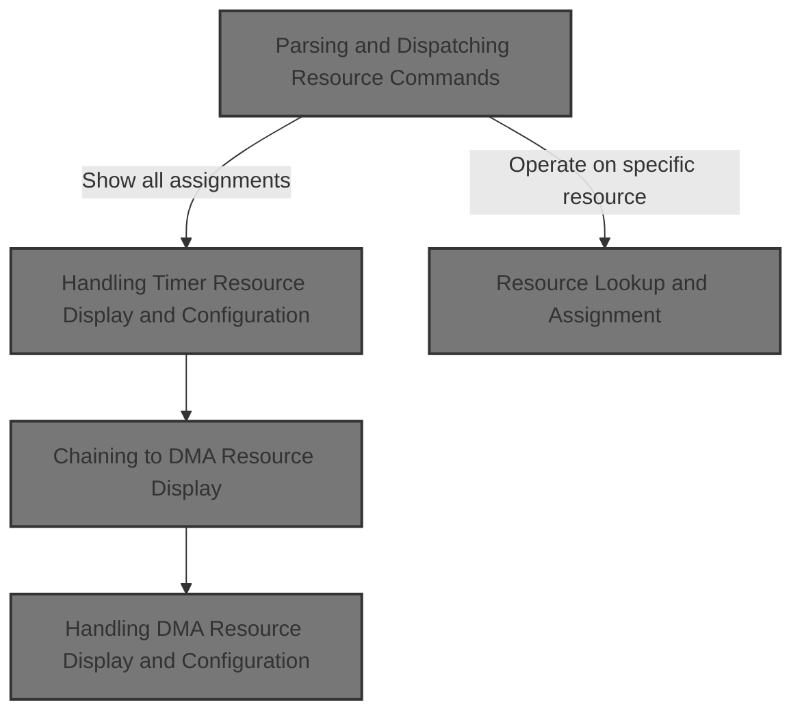
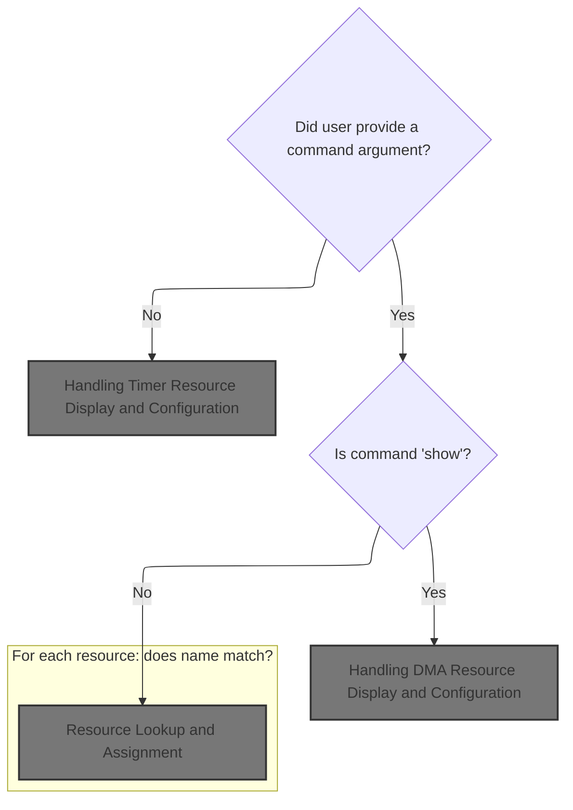

This document outlines how users can manage hardware resource assignments through a command-line interface. Users can view, list, or modify assignments for IO, timer, and DMA resources, supporting flexible hardware configuration.



# Parsing and Dispatching Resource Commands



<SwmSnippet path="/src/main/cli/cli.c" line="6081">

---

In <SwmToken path="src/main/cli/cli.c" pos="6081:4:4" line-data="static void cliResource(const char *cmdName, char *cmdline)">`cliResource`</SwmToken>, we start by tokenizing the command line to figure out what the user wants—either to show all resources, show IO assignments, or operate on a specific resource. The function branches early: if no command is given, it dumps all resources; if 'show' is given, it prints IO assignments and possibly timers/DMA if requested. Otherwise, it prepares to look up and possibly modify a specific resource, using repository-specific tables and helper functions to validate and process the request.

```c
static void cliResource(const char *cmdName, char *cmdline)
{
    char *pch = NULL;
    char *saveptr;

    pch = strtok_r(cmdline, " ", &saveptr);
    if (!pch) {
        printResource(DUMP_MASTER | HIDE_UNUSED, NULL);

        return;
    } else if (strcasecmp(pch, "show") == 0) {
#ifdef MINIMAL_CLI
        cliPrintLine("IO");
#else
        cliPrintLine("Currently active IO resource assignments:\r\n(reboot to update)");
        cliRepeat('-', 20);
#endif
        for (int i = 0; i < DEFIO_IO_USED_COUNT; i++) {
            const char* owner;
            owner = getOwnerName(ioRecs[i].owner);

            cliPrintf("%c%02d: %s", IO_GPIOPortIdx(ioRecs + i) + 'A', IO_GPIOPinIdx(ioRecs + i), owner);
            if (ioRecs[i].index > 0) {
                cliPrintf(" %d", ioRecs[i].index);
            }
            cliPrintLinefeed();
        }
```

---

</SwmSnippet>

<SwmSnippet path="/src/main/cli/cli.c" line="6109">

---

After printing IO resource assignments, if the user asked for 'all', we call <SwmToken path="src/main/cli/cli.c" pos="6112:1:1" line-data="            cliTimer(cmdName, &quot;show&quot;);">`cliTimer`</SwmToken> to also show timer mappings. This extends the output to cover more hardware resource types, not just IO.

```c
        pch = strtok_r(NULL, " ", &saveptr);
        if (strcasecmp(pch, "all") == 0) {
#if defined(USE_TIMER_MGMT)
            cliTimer(cmdName, "show");
#endif
#if defined(USE_DMA)
```

---

</SwmSnippet>

## Handling Timer Resource Display and Configuration

```mermaid
%%{init: {"flowchart": {"defaultRenderer": "elk"}} }%%
flowchart TD
    node1{"Is command empty?"}
    click node1 openCode "src/main/cli/cli.c:5957:5961"
    node1 -->|"Yes"| node2["Show all timer info"]
    click node2 openCode "src/main/cli/cli.c:5958:5961"
    node1 -->|"No"| node3{"Is command 'list'?"}
    click node3 openCode "src/main/cli/cli.c:5961:5965"
    node3 -->|"Yes"| node4["Show not implemented"]
    click node4 openCode "src/main/cli/cli.c:5962:5965"
    node3 -->|"No"| node5{"Is command 'map'?"}
    click node5 openCode "src/main/cli/cli.c:5965:5970"
    node5 -->|"Yes"| node6["Show timer map"]
    click node6 openCode "src/main/cli/cli.c:5967:5970"
    node5 -->|"No"| node7{"Is command 'show'?"}
    click node7 openCode "src/main/cli/cli.c:5971:5975"
    node7 -->|"Yes"| node8["Show timers"]
    click node8 openCode "src/main/cli/cli.c:5972:5975"
    node7 -->|"No"| node9{"Is pin valid?"}
    click node9 openCode "src/main/cli/cli.c:5982:5986"
    node9 -->|"No"| node10["Show parse error"]
    click node10 openCode "src/main/cli/cli.c:5983:5986"
    node9 -->|"Yes"| node11{"Is pin used on board?"}
    click node11 openCode "src/main/cli/cli.c:5986:5990"
    node11 -->|"No"| node12["Show pin not used error"]
    click node12 openCode "src/main/cli/cli.c:5987:5990"
    node11 -->|"Yes"| node13["Find or allocate timer mapping"]
    click node13 openCode "src/main/cli/cli.c:5995:6007"
    subgraph loop1["For each timer pin mapping, find match or empty slot"]
      node13
    end
    node13 --> node14{"Is there a second argument?"}
    click node14 openCode "src/main/cli/cli.c:6015:6016"
    node14 -->|"No"| node15["Show timer details"]
    click node15 openCode "src/main/cli/cli.c:6073:6076"
    node14 -->|"Yes"| node16{"Is second argument 'list'?"}
    click node16 openCode "src/main/cli/cli.c:6018:6028"
    node16 -->|"Yes"| node17["Output available timer options"]
    click node17 openCode "src/main/cli/cli.c:6021:6028"
    subgraph loop2["For each available timer option for the pin, output details"]
      node17
    end
    node17 -->|"Done listing"| node15
    node16 -->|"No"| node18{"Is second argument 'af'?"}
    click node18 openCode "src/main/cli/cli.c:6031:6041"
    node18 -->|"Yes"| node19["Find matching alternate function"]
    click node19 openCode "src/main/cli/cli.c:6035:6041"
    subgraph loop3["For each available timer option for the pin, find matching alternate function"]
      node19
    end
    node19 -->|"Found"| node20["Update timer configuration"]
    click node20 openCode "src/main/cli/cli.c:6054:6071"
    node18 -->|"Other"| node20
    node20 --> node21{"Is timer config changed?"}
    click node21 openCode "src/main/cli/cli.c:6065:6069"
    node21 -->|"No"| node22["Show no change"]
    click node22 openCode "src/main/cli/cli.c:6066:6067"
    node21 -->|"Yes"| node23["Show changed config"]
    click node23 openCode "src/main/cli/cli.c:6068:6069"
    node22 --> node24
    node23 --> node24
    node15 --> node24
    node12 --> node24
    node10 --> node24
    node8 --> node24
    node6 --> node24
    node4 --> node24
    node2 --> node24

classDef HeadingStyle fill:#777777,stroke:#333,stroke-width:2px;

%% Swimm:
%% %%{init: {"flowchart": {"defaultRenderer": "elk"}} }%%
%% flowchart TD
%%     node1{"Is command empty?"}
%%     click node1 openCode "<SwmPath>[src/…/cli/cli.c](src/main/cli/cli.c)</SwmPath>:5957:5961"
%%     node1 -->|"Yes"| node2["Show all timer info"]
%%     click node2 openCode "<SwmPath>[src/…/cli/cli.c](src/main/cli/cli.c)</SwmPath>:5958:5961"
%%     node1 -->|"No"| node3{"Is command 'list'?"}
%%     click node3 openCode "<SwmPath>[src/…/cli/cli.c](src/main/cli/cli.c)</SwmPath>:5961:5965"
%%     node3 -->|"Yes"| node4["Show not implemented"]
%%     click node4 openCode "<SwmPath>[src/…/cli/cli.c](src/main/cli/cli.c)</SwmPath>:5962:5965"
%%     node3 -->|"No"| node5{"Is command 'map'?"}
%%     click node5 openCode "<SwmPath>[src/…/cli/cli.c](src/main/cli/cli.c)</SwmPath>:5965:5970"
%%     node5 -->|"Yes"| node6["Show timer map"]
%%     click node6 openCode "<SwmPath>[src/…/cli/cli.c](src/main/cli/cli.c)</SwmPath>:5967:5970"
%%     node5 -->|"No"| node7{"Is command 'show'?"}
%%     click node7 openCode "<SwmPath>[src/…/cli/cli.c](src/main/cli/cli.c)</SwmPath>:5971:5975"
%%     node7 -->|"Yes"| node8["Show timers"]
%%     click node8 openCode "<SwmPath>[src/…/cli/cli.c](src/main/cli/cli.c)</SwmPath>:5972:5975"
%%     node7 -->|"No"| node9{"Is pin valid?"}
%%     click node9 openCode "<SwmPath>[src/…/cli/cli.c](src/main/cli/cli.c)</SwmPath>:5982:5986"
%%     node9 -->|"No"| node10["Show parse error"]
%%     click node10 openCode "<SwmPath>[src/…/cli/cli.c](src/main/cli/cli.c)</SwmPath>:5983:5986"
%%     node9 -->|"Yes"| node11{"Is pin used on board?"}
%%     click node11 openCode "<SwmPath>[src/…/cli/cli.c](src/main/cli/cli.c)</SwmPath>:5986:5990"
%%     node11 -->|"No"| node12["Show pin not used error"]
%%     click node12 openCode "<SwmPath>[src/…/cli/cli.c](src/main/cli/cli.c)</SwmPath>:5987:5990"
%%     node11 -->|"Yes"| node13["Find or allocate timer mapping"]
%%     click node13 openCode "<SwmPath>[src/…/cli/cli.c](src/main/cli/cli.c)</SwmPath>:5995:6007"
%%     subgraph loop1["For each timer pin mapping, find match or empty slot"]
%%       node13
%%     end
%%     node13 --> node14{"Is there a second argument?"}
%%     click node14 openCode "<SwmPath>[src/…/cli/cli.c](src/main/cli/cli.c)</SwmPath>:6015:6016"
%%     node14 -->|"No"| node15["Show timer details"]
%%     click node15 openCode "<SwmPath>[src/…/cli/cli.c](src/main/cli/cli.c)</SwmPath>:6073:6076"
%%     node14 -->|"Yes"| node16{"Is second argument 'list'?"}
%%     click node16 openCode "<SwmPath>[src/…/cli/cli.c](src/main/cli/cli.c)</SwmPath>:6018:6028"
%%     node16 -->|"Yes"| node17["Output available timer options"]
%%     click node17 openCode "<SwmPath>[src/…/cli/cli.c](src/main/cli/cli.c)</SwmPath>:6021:6028"
%%     subgraph loop2["For each available timer option for the pin, output details"]
%%       node17
%%     end
%%     node17 -->|"Done listing"| node15
%%     node16 -->|"No"| node18{"Is second argument 'af'?"}
%%     click node18 openCode "<SwmPath>[src/…/cli/cli.c](src/main/cli/cli.c)</SwmPath>:6031:6041"
%%     node18 -->|"Yes"| node19["Find matching alternate function"]
%%     click node19 openCode "<SwmPath>[src/…/cli/cli.c](src/main/cli/cli.c)</SwmPath>:6035:6041"
%%     subgraph loop3["For each available timer option for the pin, find matching alternate function"]
%%       node19
%%     end
%%     node19 -->|"Found"| node20["Update timer configuration"]
%%     click node20 openCode "<SwmPath>[src/…/cli/cli.c](src/main/cli/cli.c)</SwmPath>:6054:6071"
%%     node18 -->|"Other"| node20
%%     node20 --> node21{"Is timer config changed?"}
%%     click node21 openCode "<SwmPath>[src/…/cli/cli.c](src/main/cli/cli.c)</SwmPath>:6065:6069"
%%     node21 -->|"No"| node22["Show no change"]
%%     click node22 openCode "<SwmPath>[src/…/cli/cli.c](src/main/cli/cli.c)</SwmPath>:6066:6067"
%%     node21 -->|"Yes"| node23["Show changed config"]
%%     click node23 openCode "<SwmPath>[src/…/cli/cli.c](src/main/cli/cli.c)</SwmPath>:6068:6069"
%%     node22 --> node24
%%     node23 --> node24
%%     node15 --> node24
%%     node12 --> node24
%%     node10 --> node24
%%     node8 --> node24
%%     node6 --> node24
%%     node4 --> node24
%%     node2 --> node24
%% 
%% classDef HeadingStyle fill:#777777,stroke:#333,stroke-width:2px;
```



<SwmSnippet path="/src/main/cli/cli.c" line="5953">

---

In <SwmToken path="src/main/cli/cli.c" pos="5953:4:4" line-data="static void cliTimer(const char *cmdName, char *cmdline)">`cliTimer`</SwmToken>, we check the subcommand. If it's 'show', we call <SwmToken path="src/main/cli/cli.c" pos="5972:1:1" line-data="        showTimers();">`showTimers`</SwmToken> to print out all timer assignments. This is how timer resource usage gets displayed to the user.

```c
static void cliTimer(const char *cmdName, char *cmdline)
{
    int len = strlen(cmdline);

    if (len == 0) {
        printTimer(DUMP_MASTER, NULL);

        return;
    } else if (strncasecmp(cmdline, "list", len) == 0) {
        cliPrintErrorLinef(cmdName, "NOT IMPLEMENTED YET");

        return;
#ifdef USE_TIMER_MAP_PRINT
    } else if (strncasecmp(cmdline, "map", len) == 0) {
        showTimerMap();

        return;
#endif
    } else if (strncasecmp(cmdline, "show", len) == 0) {
        showTimers();

        return;
    }

```

---

</SwmSnippet>

<SwmSnippet path="/src/main/cli/cli.c" line="5914">

---

ShowTimers loops through all timers using <SwmToken path="src/main/cli/cli.c" pos="5926:18:18" line-data="    for (int i = 0; (timerNumber = timerGetNumberByIndex(i)); i++) {">`timerGetNumberByIndex`</SwmToken> until it returns 0. For each timer, it checks all channels, prints details for those in use (including owner and index), and marks timers as 'FREE' if no channels are assigned. Output formatting uses repository-specific conventions for channel names and owner info.

```c
static void showTimers(void)
{
    cliPrintLinefeed();

#ifdef MINIMAL_CLI
    cliPrintLine("Timers:");
#else
    cliPrintLine("Currently active Timers:");
    cliRepeat('-', 23);
#endif

    int8_t timerNumber;
    for (int i = 0; (timerNumber = timerGetNumberByIndex(i)); i++) {
        cliPrintf("TIM%d:", timerNumber);
        bool timerUsed = false;
        for (unsigned timerIndex = 0; timerIndex < CC_CHANNELS_PER_TIMER; timerIndex++) {
            const timerHardware_t *timer = timerGetAllocatedByNumberAndChannel(timerNumber, CC_CHANNEL_FROM_INDEX(timerIndex));
            const resourceOwner_t *timerOwner = timerGetOwner(timer);
            if (timerOwner->owner) {
                if (!timerUsed) {
                    timerUsed = true;

                    cliPrintLinefeed();
                }

                if (timerOwner->index > 0) {
                    cliPrintLinef("    CH%d%s: %s %d", timerIndex + 1, timer->output & TIMER_OUTPUT_N_CHANNEL ? "N" : " ", getOwnerName(timerOwner->owner), timerOwner->index);
                } else {
                    cliPrintLinef("    CH%d%s: %s", timerIndex + 1, timer->output & TIMER_OUTPUT_N_CHANNEL ? "N" : " ", getOwnerName(timerOwner->owner));
                }
            }
        }

        if (!timerUsed) {
            cliPrintLine(" FREE");
        }
    }
```

---

</SwmSnippet>

<SwmSnippet path="/src/main/cli/cli.c" line="5977">

---

Back in <SwmToken path="src/main/cli/cli.c" pos="5953:4:4" line-data="static void cliTimer(const char *cmdName, char *cmdline)">`cliTimer`</SwmToken> after <SwmToken path="src/main/cli/cli.c" pos="5914:4:4" line-data="static void showTimers(void)">`showTimers`</SwmToken>, we move on to parsing further arguments for timer pin mapping. The function expects cmdline to be mutable since <SwmToken path="src/main/cli/cli.c" pos="5981:5:5" line-data="    pch = strtok_r(cmdline, &quot; &quot;, &amp;saveptr);">`strtok_r`</SwmToken> will modify it. It looks up or allocates a timer slot for the given pin, using repository-specific logic to manage timer configuration slots.

```c
    char *pch = NULL;
    char *saveptr;

    ioTag_t ioTag = IO_TAG_NONE;
    pch = strtok_r(cmdline, " ", &saveptr);
    if (!pch || !strToPin(pch, &ioTag)) {
        cliShowParseError(cmdName);

        return;
    } else if (!IOGetByTag(ioTag)) {
        cliPrintErrorLinef(cmdName, "PIN NOT USED ON BOARD.");

        return;
    }

    int timerIOIndex = TIMER_INDEX_UNDEFINED;
    bool isExistingTimerOpt = false;
    /* find existing entry, or go for next available */
    for (unsigned i = 0; i < MAX_TIMER_PINMAP_COUNT; i++) {
        if (timerIOConfig(i)->ioTag == ioTag) {
            timerIOIndex = i;
            isExistingTimerOpt = true;

            break;
        }

        /* first available empty slot */
        if (timerIOIndex < 0 && timerIOConfig(i)->ioTag == IO_TAG_NONE) {
            timerIOIndex = i;
        }
    }
```

---

</SwmSnippet>

<SwmSnippet path="/src/main/cli/cli.c" line="6015">

---

After finding the timer slot, <SwmToken path="src/main/cli/cli.c" pos="5953:4:4" line-data="static void cliTimer(const char *cmdName, char *cmdline)">`cliTimer`</SwmToken> checks for a subcommand like 'list'. If present, it prints all alternate function options for the pin, letting the user see possible timer mappings before making changes.

```c
    pch = strtok_r(NULL, " ", &saveptr);
    if (pch) {
        int timerIndex = TIMER_INDEX_UNDEFINED;
        if (strcasecmp(pch, "list") == 0) {
            /* output the list of available options */
            const timerHardware_t *timer;
            for (unsigned index = 0; (timer = timerGetByTagAndIndex(ioTag, index + 1)); index++) {
                cliPrintLinef("# AF%d: TIM%d CH%d%s",
                    timer->alternateFunction,
                    timerGetTIMNumber(timer->tim),
                    CC_INDEX_FROM_CHANNEL(timer->channel) + 1,
                    timer->output & TIMER_OUTPUT_N_CHANNEL ? "N" : ""
                );
            }
```

---

</SwmSnippet>

<SwmSnippet path="/src/main/cli/cli.c" line="6031">

---

If the user specifies an alternate function like 'af3', <SwmToken path="src/main/cli/cli.c" pos="5953:4:4" line-data="static void cliTimer(const char *cmdName, char *cmdline)">`cliTimer`</SwmToken> searches for a timer mapping with that AF and selects it for the pin if available.

```c
        } else if (strncasecmp(pch, "af", 2) == 0) {
            unsigned alternateFunction = atoi(&pch[2]);

            const timerHardware_t *timer;
            for (unsigned index = 0; (timer = timerGetByTagAndIndex(ioTag, index + 1)); index++) {
                if (timer->alternateFunction == alternateFunction) {
                    timerIndex = index;

                    break;
                }
            }
```

---

</SwmSnippet>

<SwmSnippet path="/src/main/cli/cli.c" line="6054">

---

At the end of <SwmToken path="src/main/cli/cli.c" pos="5953:4:4" line-data="static void cliTimer(const char *cmdName, char *cmdline)">`cliTimer`</SwmToken>, after parsing and validating the requested timer mapping, the function updates the configuration if needed and prints whether the mapping changed or stayed the same. If no option is given, it just prints the current mapping details.

```c
        int oldTimerIndex = isExistingTimerOpt ? timerIOConfig(timerIOIndex)->index - 1 : -1;
        timerIOConfigMutable(timerIOIndex)->ioTag = timerIndex == TIMER_INDEX_UNDEFINED ? IO_TAG_NONE : ioTag;
        timerIOConfigMutable(timerIOIndex)->index = timerIndex + 1;
        timerIOConfigMutable(timerIOIndex)->dmaopt = DMA_OPT_UNUSED;

        char optvalString[DMA_OPT_STRING_BUFSIZE];
        alternateFunctionToString(ioTag, timerIndex, optvalString);

        char orgvalString[DMA_OPT_STRING_BUFSIZE];
        alternateFunctionToString(ioTag, oldTimerIndex, orgvalString);

        if (timerIndex == oldTimerIndex) {
            cliPrintLinef("# timer %c%02d: no change: %s", IO_GPIOPortIdxByTag(ioTag) + 'A', IO_GPIOPinIdxByTag(ioTag), orgvalString);
        } else {
            cliPrintLinef("# timer %c%02d: changed from %s to %s", IO_GPIOPortIdxByTag(ioTag) + 'A', IO_GPIOPinIdxByTag(ioTag), orgvalString, optvalString);
        }

        return;
    } else {
        printTimerDetails(ioTag, timerIOConfig(timerIOIndex)->index, false, DUMP_MASTER, cliDumpPrintLinef);

        return;
    }
}
```

---

</SwmSnippet>

## Chaining to DMA Resource Display

<SwmSnippet path="/src/main/cli/cli.c" line="6115">

---

Back in <SwmToken path="src/main/cli/cli.c" pos="6081:4:4" line-data="static void cliResource(const char *cmdName, char *cmdline)">`cliResource`</SwmToken> after <SwmToken path="src/main/cli/cli.c" pos="5953:4:4" line-data="static void cliTimer(const char *cmdName, char *cmdline)">`cliTimer`</SwmToken>, if DMA is enabled, we call <SwmToken path="src/main/cli/cli.c" pos="6115:1:1" line-data="            cliDma(cmdName, &quot;show&quot;);">`cliDma`</SwmToken> to add DMA resource assignments to the output, rounding out the resource overview.

```c
            cliDma(cmdName, "show");
#endif
        }

        return;
    }

```

---

</SwmSnippet>

## Handling DMA Resource Display and Configuration

<SwmSnippet path="/src/main/cli/cli.c" line="5770">

---

In <SwmToken path="src/main/cli/cli.c" pos="5770:4:4" line-data="static void cliDma(const char *cmdName, char* cmdline)">`cliDma`</SwmToken>, if the user gives a subcommand that's not 'show', we call <SwmToken path="src/main/cli/cli.c" pos="5780:1:1" line-data="    cliDmaopt(cmdName, cmdline);">`cliDmaopt`</SwmToken> to handle more detailed DMA option commands, like setting or listing options for peripherals or pins.

```c
static void cliDma(const char *cmdName, char* cmdline)
{
    int len = strlen(cmdline);
    if (len && strncasecmp(cmdline, "show", len) == 0) {
        showDma();

        return;
    }

#if defined(USE_DMA_SPEC)
    cliDmaopt(cmdName, cmdline);
#else
```

---

</SwmSnippet>

### Parsing and Modifying DMA Options

```mermaid
%%{init: {"flowchart": {"defaultRenderer": "elk"}} }%%
flowchart TD
    node1["User enters DMA command"] --> node2{"Peripheral/pin specified?"}
    click node1 openCode "src/main/cli/cli.c:5619:5625"
    node2 -->|"No"| node3["Show all DMA options"]
    click node2 openCode "src/main/cli/cli.c:5626:5630"
    click node3 openCode "src/main/cli/cli.c:5627:5630"
    node2 -->|"Yes"| node4{"Is command 'list'?"}
    click node4 openCode "src/main/cli/cli.c:5631:5634"
    node4 -->|"Yes"| node5["Show 'not implemented' error"]
    click node5 openCode "src/main/cli/cli.c:5631:5634"
    node4 -->|"No"| node6["Identify peripheral or pin"]
    click node6 openCode "src/main/cli/cli.c:5636:5641"
    subgraph loop1["Search for matching peripheral"]
        node6 --> node7{"Peripheral found?"}
        click node7 openCode "src/main/cli/cli.c:5637:5641"
    end
    node7 -->|"Yes"| node8["Get index and current DMA setting"]
    click node8 openCode "src/main/cli/cli.c:5648:5675"
    node7 -->|"No"| node9["Validate pin and get current setting"]
    click node9 openCode "src/main/cli/cli.c:5677:5689"
    node8 --> node10{"Command option provided?"}
    click node10 openCode "src/main/cli/cli.c:5692:5694"
    node10 -->|"No"| node11["Show peripheral DMA details"]
    click node11 openCode "src/main/cli/cli.c:5695:5696"
    node10 -->|"Yes"| node12{"Is command 'list'?"}
    click node12 openCode "src/main/cli/cli.c:5704:5714"
    subgraph loop2["List possible DMA options"]
        node12 -->|"Yes"| node13["List all DMA options for peripheral/pin"]
        click node13 openCode "src/main/cli/cli.c:5708:5714"
    end
    node12 -->|"No"| node14{"Is new value valid?"}
    click node14 openCode "src/main/cli/cli.c:5720:5737"
    node14 -->|"No"| node15["Show error"]
    click node15 openCode "src/main/cli/cli.c:5727:5736"
    node14 -->|"Yes"| node16{"Is new value different?"}
    click node16 openCode "src/main/cli/cli.c:5746:5764"
    node16 -->|"Yes"| node17["Update DMA option and show change"]
    click node17 openCode "src/main/cli/cli.c:5747:5757"
    node16 -->|"No"| node18["Show 'no change'"]
    click node18 openCode "src/main/cli/cli.c:5759:5764"
classDef HeadingStyle fill:#777777,stroke:#333,stroke-width:2px;

%% Swimm:
%% %%{init: {"flowchart": {"defaultRenderer": "elk"}} }%%
%% flowchart TD
%%     node1["User enters DMA command"] --> node2{"Peripheral/pin specified?"}
%%     click node1 openCode "<SwmPath>[src/…/cli/cli.c](src/main/cli/cli.c)</SwmPath>:5619:5625"
%%     node2 -->|"No"| node3["Show all DMA options"]
%%     click node2 openCode "<SwmPath>[src/…/cli/cli.c](src/main/cli/cli.c)</SwmPath>:5626:5630"
%%     click node3 openCode "<SwmPath>[src/…/cli/cli.c](src/main/cli/cli.c)</SwmPath>:5627:5630"
%%     node2 -->|"Yes"| node4{"Is command 'list'?"}
%%     click node4 openCode "<SwmPath>[src/…/cli/cli.c](src/main/cli/cli.c)</SwmPath>:5631:5634"
%%     node4 -->|"Yes"| node5["Show 'not implemented' error"]
%%     click node5 openCode "<SwmPath>[src/…/cli/cli.c](src/main/cli/cli.c)</SwmPath>:5631:5634"
%%     node4 -->|"No"| node6["Identify peripheral or pin"]
%%     click node6 openCode "<SwmPath>[src/…/cli/cli.c](src/main/cli/cli.c)</SwmPath>:5636:5641"
%%     subgraph loop1["Search for matching peripheral"]
%%         node6 --> node7{"Peripheral found?"}
%%         click node7 openCode "<SwmPath>[src/…/cli/cli.c](src/main/cli/cli.c)</SwmPath>:5637:5641"
%%     end
%%     node7 -->|"Yes"| node8["Get index and current DMA setting"]
%%     click node8 openCode "<SwmPath>[src/…/cli/cli.c](src/main/cli/cli.c)</SwmPath>:5648:5675"
%%     node7 -->|"No"| node9["Validate pin and get current setting"]
%%     click node9 openCode "<SwmPath>[src/…/cli/cli.c](src/main/cli/cli.c)</SwmPath>:5677:5689"
%%     node8 --> node10{"Command option provided?"}
%%     click node10 openCode "<SwmPath>[src/…/cli/cli.c](src/main/cli/cli.c)</SwmPath>:5692:5694"
%%     node10 -->|"No"| node11["Show peripheral DMA details"]
%%     click node11 openCode "<SwmPath>[src/…/cli/cli.c](src/main/cli/cli.c)</SwmPath>:5695:5696"
%%     node10 -->|"Yes"| node12{"Is command 'list'?"}
%%     click node12 openCode "<SwmPath>[src/…/cli/cli.c](src/main/cli/cli.c)</SwmPath>:5704:5714"
%%     subgraph loop2["List possible DMA options"]
%%         node12 -->|"Yes"| node13["List all DMA options for peripheral/pin"]
%%         click node13 openCode "<SwmPath>[src/…/cli/cli.c](src/main/cli/cli.c)</SwmPath>:5708:5714"
%%     end
%%     node12 -->|"No"| node14{"Is new value valid?"}
%%     click node14 openCode "<SwmPath>[src/…/cli/cli.c](src/main/cli/cli.c)</SwmPath>:5720:5737"
%%     node14 -->|"No"| node15["Show error"]
%%     click node15 openCode "<SwmPath>[src/…/cli/cli.c](src/main/cli/cli.c)</SwmPath>:5727:5736"
%%     node14 -->|"Yes"| node16{"Is new value different?"}
%%     click node16 openCode "<SwmPath>[src/…/cli/cli.c](src/main/cli/cli.c)</SwmPath>:5746:5764"
%%     node16 -->|"Yes"| node17["Update DMA option and show change"]
%%     click node17 openCode "<SwmPath>[src/…/cli/cli.c](src/main/cli/cli.c)</SwmPath>:5747:5757"
%%     node16 -->|"No"| node18["Show 'no change'"]
%%     click node18 openCode "<SwmPath>[src/…/cli/cli.c](src/main/cli/cli.c)</SwmPath>:5759:5764"
%% classDef HeadingStyle fill:#777777,stroke:#333,stroke-width:2px;
```



<SwmSnippet path="/src/main/cli/cli.c" line="5619">

---

In <SwmToken path="src/main/cli/cli.c" pos="5619:4:4" line-data="static void cliDmaopt(const char *cmdName, char *cmdline)">`cliDmaopt`</SwmToken>, we parse the first token to see if it's a known device or 'pin'. Depending on that, we either look up the device in <SwmToken path="src/main/cli/cli.c" pos="5637:19:19" line-data="    for (unsigned i = 0; i &lt; ARRAYLEN(dmaoptEntryTable); i++) {">`dmaoptEntryTable`</SwmToken> or parse the pin string. Then we figure out the config address or DMA option for that target, using repository-specific structures and pointer math.

```c
static void cliDmaopt(const char *cmdName, char *cmdline)
{
    char *pch = NULL;
    char *saveptr;

    // Peripheral name or command option
    pch = strtok_r(cmdline, " ", &saveptr);
    if (!pch) {
        printDmaopt(DUMP_MASTER | HIDE_UNUSED, NULL);

        return;
    } else if (strcasecmp(pch, "list") == 0) {
        cliPrintErrorLinef(cmdName, "NOT IMPLEMENTED YET");

        return;
    }

    dmaoptEntry_t *entry = NULL;
    for (unsigned i = 0; i < ARRAYLEN(dmaoptEntryTable); i++) {
        if (strcasecmp(pch, dmaoptEntryTable[i].device) == 0) {
            entry = &dmaoptEntryTable[i];
        }
    }
```

---

</SwmSnippet>

<SwmSnippet path="/src/main/cli/cli.c" line="5648">

---

After parsing the device or pin, <SwmToken path="src/main/cli/cli.c" pos="5619:4:4" line-data="static void cliDmaopt(const char *cmdName, char *cmdline)">`cliDmaopt`</SwmToken> checks for a second parameter. If it's missing, it prints the current DMA option details. If it's 'list', it enumerates and prints all possible DMA options for the target.

```c
    // Index
    dmaoptValue_t orgval = DMA_OPT_UNUSED;

    int index = 0;
    dmaoptValue_t *optaddr = NULL;

    ioTag_t ioTag = IO_TAG_NONE;
#if defined(USE_TIMER_MGMT)
    timerIOConfig_t *timerIoConfig = NULL;
#endif
    const timerHardware_t *timer = NULL;
    pch = strtok_r(NULL, " ", &saveptr);
    if (entry) {
        index = displayNumberToDmaOptIndex(entry, pch ? atoi(pch) : -1);
        if (index == -1) {
            cliPrintErrorLinef(cmdName, "BAD INDEX: '%s'", pch ? pch : "");
            return;
        }

        const pgRegistry_t* pg = pgFind(entry->pgn);
        const void *currentConfig;
        if (isWritingConfigToCopy()) {
            currentConfig = pg->copy;
        } else {
            currentConfig = pg->address;
        }
        optaddr = (dmaoptValue_t *)((uint8_t *)currentConfig + entry->stride * index + entry->offset);
        orgval = *optaddr;
    } else {
        // It's a pin
        if (!pch || !(strToPin(pch, &ioTag) && IOGetByTag(ioTag))) {
            cliPrintErrorLinef(cmdName, "INVALID PIN: '%s'", pch ? pch : "");

            return;
        }

        orgval = dmaoptByTag(ioTag);
#if defined(USE_TIMER_MGMT)
        timerIoConfig = timerIoConfigByTag(ioTag);
#endif
        timer = timerGetConfiguredByTag(ioTag);
    }

    // opt or list
    pch = strtok_r(NULL, " ", &saveptr);
    if (!pch) {
        if (entry) {
            printPeripheralDmaoptDetails(entry, index, *optaddr, true, DUMP_MASTER, cliDumpPrintLinef);
        }
#if defined(USE_TIMER_MGMT)
        else {
            printTimerDmaoptDetails(ioTag, timer, orgval, true, DUMP_MASTER, cliDumpPrintLinef);
        }
#endif

        return;
    } else if (strcasecmp(pch, "list") == 0) {
        // Show possible opts
        const dmaChannelSpec_t *dmaChannelSpec;
        if (entry) {
            for (int opt = 0; (dmaChannelSpec = dmaGetChannelSpecByPeripheral(entry->peripheral, index, opt)); opt++) {
                cliPrintLinef("# %d: " DMASPEC_FORMAT_STRING, opt, DMA_CODE_CONTROLLER(dmaChannelSpec->code), DMA_CODE_STREAM(dmaChannelSpec->code), DMA_CODE_CHANNEL(dmaChannelSpec->code));
            }
```

---

</SwmSnippet>

<SwmSnippet path="/src/main/cli/cli.c" line="5712">

---

If the target is a timer pin, <SwmToken path="src/main/cli/cli.c" pos="5619:4:4" line-data="static void cliDmaopt(const char *cmdName, char *cmdline)">`cliDmaopt`</SwmToken> loops through all possible DMA options for that timer/channel and prints each one, so the user can see what's available.

```c
            for (int opt = 0; (dmaChannelSpec = dmaGetChannelSpecByTimerValue(timer->tim, timer->channel, opt)); opt++) {
                cliPrintLinef("# %d: " DMASPEC_FORMAT_STRING, opt, DMA_CODE_CONTROLLER(dmaChannelSpec->code), DMA_CODE_STREAM(dmaChannelSpec->code), DMA_CODE_CHANNEL(dmaChannelSpec->code));
            }
```

---

</SwmSnippet>

<SwmSnippet path="/src/main/cli/cli.c" line="5718">

---

At the end of <SwmToken path="src/main/cli/cli.c" pos="5619:4:4" line-data="static void cliDmaopt(const char *cmdName, char *cmdline)">`cliDmaopt`</SwmToken>, after parsing and validating the requested DMA option, the function updates the config if needed and prints whether the value changed or stayed the same. If no option is given, it just prints the current details.

```c
    } else if (pch) {
        int optval;
        if (strcasecmp(pch, "none") == 0) {
            optval = DMA_OPT_UNUSED;
        } else {
            optval = atoi(pch);

            if (entry) {
                if (!dmaGetChannelSpecByPeripheral(entry->peripheral, index, optval)) {
                    cliPrintErrorLinef(cmdName, "INVALID DMA OPTION FOR %s %d: '%s'", entry->device, getDmaOptDisplayNumber(entry, index), pch);

                    return;
                }
            } else {
                if (!dmaGetChannelSpecByTimerValue(timer->tim, timer->channel, optval)) {
                    cliPrintErrorLinef(cmdName, "INVALID DMA OPTION FOR PIN %c%02d: '%s'", IO_GPIOPortIdxByTag(ioTag) + 'A', IO_GPIOPinIdxByTag(ioTag), pch);

                    return;
                }
            }
        }

        char optvalString[DMA_OPT_STRING_BUFSIZE];
        optToString(optval, optvalString);

        char orgvalString[DMA_OPT_STRING_BUFSIZE];
        optToString(orgval, orgvalString);

        if (optval != orgval) {
            if (entry) {
                *optaddr = optval;

                cliPrintLinef("# dma %s %d: changed from %s to %s", entry->device, getDmaOptDisplayNumber(entry, index), orgvalString, optvalString);
            } else {
#if defined(USE_TIMER_MGMT)
                timerIoConfig->dmaopt = optval;
#endif

                cliPrintLinef("# dma pin %c%02d: changed from %s to %s", IO_GPIOPortIdxByTag(ioTag) + 'A', IO_GPIOPinIdxByTag(ioTag), orgvalString, optvalString);
            }
        } else {
            if (entry) {
                cliPrintLinef("# dma %s %d: no change: %s", entry->device, getDmaOptDisplayNumber(entry, index), orgvalString);
            } else {
                cliPrintLinef("# dma %c%02d: no change: %s", IO_GPIOPortIdxByTag(ioTag) + 'A', IO_GPIOPinIdxByTag(ioTag),orgvalString);
            }
        }
    }
}
```

---

</SwmSnippet>

### Fallback to DMA Resource Display

<SwmSnippet path="/src/main/cli/cli.c" line="5782">

---

Back in <SwmToken path="src/main/cli/cli.c" pos="5770:4:4" line-data="static void cliDma(const char *cmdName, char* cmdline)">`cliDma`</SwmToken> after <SwmToken path="src/main/cli/cli.c" pos="5619:4:4" line-data="static void cliDmaopt(const char *cmdName, char *cmdline)">`cliDmaopt`</SwmToken>, if nothing else matched, we just call <SwmToken path="src/main/cli/cli.c" pos="5784:1:1" line-data="    showDma();">`showDma`</SwmToken> to print current DMA assignments as a fallback.

```c
    UNUSED(cmdName);
    // the only option is show, so make that the default behaviour
    showDma();
#endif
}
```

---

</SwmSnippet>

## Resource Lookup and Assignment

```mermaid
%%{init: {"flowchart": {"defaultRenderer": "elk"}} }%%
flowchart TD
    node1["Start: User provides resource name, optional index, optional pin value"]
    click node1 openCode "src/main/cli/cli.c:6122:6123"
    subgraph loop1["For each resource in table"]
        node1 --> node2{"Does resource name match?"}
        click node2 openCode "src/main/cli/cli.c:6123:6132"
        node2 -->|"Yes"| node3{"Is index required and valid?"}
        node2 -->|"No, at end of table"| node14["Show invalid resource name error and exit"]
        click node14 openCode "src/main/cli/cli.c:6125:6126"
    end
    node3 -->|"No"| node8["Show index error and exit"]
    click node3 openCode "src/main/cli/cli.c:6138:6142"
    click node8 openCode "src/main/cli/cli.c:6140:6141"
    node3 -->|"Yes"| node4{"Is pin value provided?"}
    click node4 openCode "src/main/cli/cli.c:6150:6178"
    node4 -->|"No"| node9["Show current resource assignment"]
    click node9 openCode "src/main/cli/cli.c:6179:6185"
    node4 -->|"Yes"| node5{"Is pin value valid?"}
    click node5 openCode "src/main/cli/cli.c:6152:6175"
    node5 -->|"No"| node10["Show pin parse error"]
    click node10 openCode "src/main/cli/cli.c:6176:6177"
    node5 -->|"Yes"| node6{"Is pin value zero (free)?"}
    click node6 openCode "src/main/cli/cli.c:6153:6161"
    node6 -->|"Yes"| node11["Free resource and show freed message"]
    click node11 openCode "src/main/cli/cli.c:6154:6160"
    node6 -->|"No"| node7{"Does pin correspond to real hardware?"}
    click node7 openCode "src/main/cli/cli.c:6162:6171"
    node7 -->|"No"| node12["Show hardware error"]
    click node12 openCode "src/main/cli/cli.c:6172:6173"
    node7 -->|"Yes"| node13["Assign resource and show success message"]
    click node13 openCode "src/main/cli/cli.c:6164:6170"

classDef HeadingStyle fill:#777777,stroke:#333,stroke-width:2px;

%% Swimm:
%% %%{init: {"flowchart": {"defaultRenderer": "elk"}} }%%
%% flowchart TD
%%     node1["Start: User provides resource name, optional index, optional pin value"]
%%     click node1 openCode "<SwmPath>[src/…/cli/cli.c](src/main/cli/cli.c)</SwmPath>:6122:6123"
%%     subgraph loop1["For each resource in table"]
%%         node1 --> node2{"Does resource name match?"}
%%         click node2 openCode "<SwmPath>[src/…/cli/cli.c](src/main/cli/cli.c)</SwmPath>:6123:6132"
%%         node2 -->|"Yes"| node3{"Is index required and valid?"}
%%         node2 -->|"No, at end of table"| node14["Show invalid resource name error and exit"]
%%         click node14 openCode "<SwmPath>[src/…/cli/cli.c](src/main/cli/cli.c)</SwmPath>:6125:6126"
%%     end
%%     node3 -->|"No"| node8["Show index error and exit"]
%%     click node3 openCode "<SwmPath>[src/…/cli/cli.c](src/main/cli/cli.c)</SwmPath>:6138:6142"
%%     click node8 openCode "<SwmPath>[src/…/cli/cli.c](src/main/cli/cli.c)</SwmPath>:6140:6141"
%%     node3 -->|"Yes"| node4{"Is pin value provided?"}
%%     click node4 openCode "<SwmPath>[src/…/cli/cli.c](src/main/cli/cli.c)</SwmPath>:6150:6178"
%%     node4 -->|"No"| node9["Show current resource assignment"]
%%     click node9 openCode "<SwmPath>[src/…/cli/cli.c](src/main/cli/cli.c)</SwmPath>:6179:6185"
%%     node4 -->|"Yes"| node5{"Is pin value valid?"}
%%     click node5 openCode "<SwmPath>[src/…/cli/cli.c](src/main/cli/cli.c)</SwmPath>:6152:6175"
%%     node5 -->|"No"| node10["Show pin parse error"]
%%     click node10 openCode "<SwmPath>[src/…/cli/cli.c](src/main/cli/cli.c)</SwmPath>:6176:6177"
%%     node5 -->|"Yes"| node6{"Is pin value zero (free)?"}
%%     click node6 openCode "<SwmPath>[src/…/cli/cli.c](src/main/cli/cli.c)</SwmPath>:6153:6161"
%%     node6 -->|"Yes"| node11["Free resource and show freed message"]
%%     click node11 openCode "<SwmPath>[src/…/cli/cli.c](src/main/cli/cli.c)</SwmPath>:6154:6160"
%%     node6 -->|"No"| node7{"Does pin correspond to real hardware?"}
%%     click node7 openCode "<SwmPath>[src/…/cli/cli.c](src/main/cli/cli.c)</SwmPath>:6162:6171"
%%     node7 -->|"No"| node12["Show hardware error"]
%%     click node12 openCode "<SwmPath>[src/…/cli/cli.c](src/main/cli/cli.c)</SwmPath>:6172:6173"
%%     node7 -->|"Yes"| node13["Assign resource and show success message"]
%%     click node13 openCode "<SwmPath>[src/…/cli/cli.c](src/main/cli/cli.c)</SwmPath>:6164:6170"
%% 
%% classDef HeadingStyle fill:#777777,stroke:#333,stroke-width:2px;
```



<SwmSnippet path="/src/main/cli/cli.c" line="6122">

---

Back in <SwmToken path="src/main/cli/cli.c" pos="6081:4:4" line-data="static void cliResource(const char *cmdName, char *cmdline)">`cliResource`</SwmToken> after <SwmToken path="src/main/cli/cli.c" pos="5770:4:4" line-data="static void cliDma(const char *cmdName, char* cmdline)">`cliDma`</SwmToken>, we loop through <SwmToken path="src/main/cli/cli.c" pos="6124:10:10" line-data="        if (resourceIndex &gt;= ARRAYLEN(resourceTable)) {">`resourceTable`</SwmToken> to find the resource the user named. If it's not found, we print an error and bail out.

```c
    unsigned resourceIndex = 0;
    for (; ; resourceIndex++) {
        if (resourceIndex >= ARRAYLEN(resourceTable)) {
            cliPrintErrorLinef(cmdName, "INVALID RESOURCE NAME: '%s'", pch);
            return;
        }

        const char *resourceName = getOwnerName(resourceTable[resourceIndex].owner);
        if (strcasecmp(pch, resourceName) == 0) {
            break;
        }
    }
```

---

</SwmSnippet>

<SwmSnippet path="/src/main/cli/cli.c" line="6135">

---

At the end of <SwmToken path="src/main/cli/cli.c" pos="6081:4:4" line-data="static void cliResource(const char *cmdName, char *cmdline)">`cliResource`</SwmToken>, after parsing the resource name and index, we either free, set, or print the current assignment for the resource. The function validates input, updates the resource if needed, and prints a message for each action or error.

```c
    pch = strtok_r(NULL, " ", &saveptr);
    int index = pch ? atoi(pch) : 0;

    if (resourceTable[resourceIndex].maxIndex > 0 || index > 0) {
        if (index <= 0 || index > RESOURCE_VALUE_MAX_INDEX(resourceTable[resourceIndex].maxIndex)) {
            cliShowArgumentRangeError(cmdName, "INDEX", 1, RESOURCE_VALUE_MAX_INDEX(resourceTable[resourceIndex].maxIndex));
            return;
        }
        index -= 1;

        pch = strtok_r(NULL, " ", &saveptr);
    }

    ioTag_t *resourceTag = getIoTag(resourceTable[resourceIndex], index);

    if (pch && strlen(pch) > 0) {
        ioTag_t tag;
        if (strToPin(pch, &tag)) {
            if (!tag) {
                *resourceTag = tag;
#ifdef MINIMAL_CLI
                cliPrintLine("Freed");
#else
                cliPrintLine("Resource is freed");
#endif
                return;
            } else {
                ioRec_t *rec = IO_Rec(IOGetByTag(tag));
                if (rec) {
                    *resourceTag = tag;
                    resourceCheck(resourceIndex, index, tag);
#ifdef MINIMAL_CLI
                    cliPrintLinef(" %c%02d set", IO_GPIOPortIdx(rec) + 'A', IO_GPIOPinIdx(rec));
#else
                    cliPrintLinef("\r\nResource is set to %c%02d", IO_GPIOPortIdx(rec) + 'A', IO_GPIOPinIdx(rec));
#endif
                } else {
                    cliShowParseError(cmdName);
                }
            }
        } else {
            cliPrintErrorLinef(cmdName, "Failed to parse '%s' as pin", pch);
        }
    } else {
        ioTag_t tag = *resourceTag;
        char ioName[5];
        if (tag) {
            tfp_sprintf(ioName, "%c%02d", IO_GPIOPortIdxByTag(tag) + 'A', IO_GPIOPinIdxByTag(tag));
        }
        cliPrintLinef("# resource %s %d %s", getOwnerName(resourceTable[resourceIndex].owner), RESOURCE_INDEX(index), tag ? ioName : "NONE");
    }
}
```

---

</SwmSnippet>

&nbsp;

*This is an auto-generated document by Swimm 🌊 and has not yet been verified by a human*

<SwmMeta version="3.0.0" repo-id="Z2l0aHViJTNBJTNBYy1iZXRhZmxpZ2h0JTNBJTNBcmljYXJkb2xvcGV6Zw==" repo-name="c-betaflight"><sup>Powered by [Swimm](https://app.swimm.io/)</sup></SwmMeta>
