This document explains how users can manage LED strip settings through command-line commands. Users can view the current configuration or update a specific LED's configuration by providing the appropriate input. The flow receives command-line input and either displays the current configuration or updates it accordingly.

# Handling LED Strip CLI Commands

```mermaid
%%{init: {"flowchart": {"defaultRenderer": "elk"}} }%%
flowchart TD
    node1{"Is command line empty?"}
    click node1 openCode "src/main/cli/cli.c:2013:2013"
    node1 -->|"Yes"| node2["Show current LED configuration"]
    click node2 openCode "src/main/cli/cli.c:2014:2014"
    node1 -->|"No"| node3{"Is LED index (0 to LED_STRIP_MAX_LENGTH-1) valid?"}
    click node3 openCode "src/main/cli/cli.c:2018:2018"
    node3 -->|"No"| node4["Show LED index range error"]
    click node4 openCode "src/main/cli/cli.c:2027:2028"
    node3 -->|"Yes"| node5{"Is LED configuration valid?"}
    click node5 openCode "src/main/cli/cli.c:2020:2020"
    node5 -->|"No"| node6["Show configuration parse error"]
    click node6 openCode "src/main/cli/cli.c:2024:2025"
    node5 -->|"Yes"| node7["Show updated LED configuration"]
    click node7 openCode "src/main/cli/cli.c:2021:2023"

classDef HeadingStyle fill:#777777,stroke:#333,stroke-width:2px;

%% Swimm:
%% %%{init: {"flowchart": {"defaultRenderer": "elk"}} }%%
%% flowchart TD
%%     node1{"Is command line empty?"}
%%     click node1 openCode "<SwmPath>[src/…/cli/cli.c](src/main/cli/cli.c)</SwmPath>:2013:2013"
%%     node1 -->|"Yes"| node2["Show current LED configuration"]
%%     click node2 openCode "<SwmPath>[src/…/cli/cli.c](src/main/cli/cli.c)</SwmPath>:2014:2014"
%%     node1 -->|"No"| node3{"Is LED index (0 to LED_STRIP_MAX_LENGTH-1) valid?"}
%%     click node3 openCode "<SwmPath>[src/…/cli/cli.c](src/main/cli/cli.c)</SwmPath>:2018:2018"
%%     node3 -->|"No"| node4["Show LED index range error"]
%%     click node4 openCode "<SwmPath>[src/…/cli/cli.c](src/main/cli/cli.c)</SwmPath>:2027:2028"
%%     node3 -->|"Yes"| node5{"Is LED configuration valid?"}
%%     click node5 openCode "<SwmPath>[src/…/cli/cli.c](src/main/cli/cli.c)</SwmPath>:2020:2020"
%%     node5 -->|"No"| node6["Show configuration parse error"]
%%     click node6 openCode "<SwmPath>[src/…/cli/cli.c](src/main/cli/cli.c)</SwmPath>:2024:2025"
%%     node5 -->|"Yes"| node7["Show updated LED configuration"]
%%     click node7 openCode "<SwmPath>[src/…/cli/cli.c](src/main/cli/cli.c)</SwmPath>:2021:2023"
%% 
%% classDef HeadingStyle fill:#777777,stroke:#333,stroke-width:2px;
```



<SwmSnippet path="/src/main/cli/cli.c" line="2006">

---

CliLed kicks off the flow by handling CLI commands for LED strips. It checks if the input is empty to decide whether to print the current config or update it. If updating, it parses the index and config string, validates them, and calls the LED config parser next. This call is needed to actually interpret and apply the new config to the hardware data structure.

```c
static void cliLed(const char *cmdName, char *cmdline)
{
    const char *format = "led %u %s";
    char ledConfigBuffer[20];
    int i;
    const char *ptr;

    if (isEmpty(cmdline)) {
        printLed(DUMP_MASTER, ledStripStatusModeConfig()->ledConfigs, NULL, NULL);
    } else {
        ptr = cmdline;
        i = atoi(ptr);
        if (i >= 0 && i < LED_STRIP_MAX_LENGTH) {
            ptr = nextArg(cmdline);
            if (parseLedStripConfig(i, ptr)) {
                generateLedConfig((ledConfig_t *)&ledStripStatusModeConfig()->ledConfigs[i], ledConfigBuffer, sizeof(ledConfigBuffer));
                cliDumpPrintLinef(0, false, format, i, ledConfigBuffer);
            } else {
                cliShowParseError(cmdName);
            }
        } else {
            cliShowArgumentRangeError(cmdName, "INDEX", 0, LED_STRIP_MAX_LENGTH - 1);
        }
    }
}
```

---

</SwmSnippet>

# Parsing and Applying LED Config Data

```mermaid
%%{init: {"flowchart": {"defaultRenderer": "elk"}} }%%
flowchart TD
    node1{"Is LED index within allowed range?"}
    click node1 openCode "src/main/io/ledstrip.c:383:384"
    node1 -->|"No"| node2["Return failure"]
    click node2 openCode "src/main/io/ledstrip.c:384:384"
    node1 -->|"Yes"| node3["Parse configuration fields"]
    click node3 openCode "src/main/io/ledstrip.c:404:459"
    subgraph loop1["For each field: X, Y, directions, functions, overlays, color"]
        node3 --> node4["Extract and interpret field"]
        click node4 openCode "src/main/io/ledstrip.c:404:459"
        node4 --> node5{"Is field directions/functions/overlays?"}
        node5 -->|"Yes"| node6["For each character, update directions/functions/overlays"]
        click node6 openCode "src/main/io/ledstrip.c:426:450"
        node5 -->|"No"| node7{"Is field color and value invalid?"}
        node7 -->|"Yes"| node8["Set color to default"]
        click node8 openCode "src/main/io/ledstrip.c:454:455"
        node7 -->|"No"| node9["Store value"]
        click node9 openCode "src/main/io/ledstrip.c:420:424"
        node6 --> node10["Next field"]
        node8 --> node10
        node9 --> node10
        node10 --> node3
    end
    node3 --> node11["Update LED configuration"]
    click node11 openCode "src/main/io/ledstrip.c:461:461"
    node11 --> node12["Reevaluate LED configuration"]
    click node12 openCode "src/main/io/ledstrip.c:463:463"
    node12 --> node13["Return success"]
    click node13 openCode "src/main/io/ledstrip.c:465:466"
classDef HeadingStyle fill:#777777,stroke:#333,stroke-width:2px;

%% Swimm:
%% %%{init: {"flowchart": {"defaultRenderer": "elk"}} }%%
%% flowchart TD
%%     node1{"Is LED index within allowed range?"}
%%     click node1 openCode "<SwmPath>[src/…/io/ledstrip.c](src/main/io/ledstrip.c)</SwmPath>:383:384"
%%     node1 -->|"No"| node2["Return failure"]
%%     click node2 openCode "<SwmPath>[src/…/io/ledstrip.c](src/main/io/ledstrip.c)</SwmPath>:384:384"
%%     node1 -->|"Yes"| node3["Parse configuration fields"]
%%     click node3 openCode "<SwmPath>[src/…/io/ledstrip.c](src/main/io/ledstrip.c)</SwmPath>:404:459"
%%     subgraph loop1["For each field: X, Y, directions, functions, overlays, color"]
%%         node3 --> node4["Extract and interpret field"]
%%         click node4 openCode "<SwmPath>[src/…/io/ledstrip.c](src/main/io/ledstrip.c)</SwmPath>:404:459"
%%         node4 --> node5{"Is field directions/functions/overlays?"}
%%         node5 -->|"Yes"| node6["For each character, update directions/functions/overlays"]
%%         click node6 openCode "<SwmPath>[src/…/io/ledstrip.c](src/main/io/ledstrip.c)</SwmPath>:426:450"
%%         node5 -->|"No"| node7{"Is field color and value invalid?"}
%%         node7 -->|"Yes"| node8["Set color to default"]
%%         click node8 openCode "<SwmPath>[src/…/io/ledstrip.c](src/main/io/ledstrip.c)</SwmPath>:454:455"
%%         node7 -->|"No"| node9["Store value"]
%%         click node9 openCode "<SwmPath>[src/…/io/ledstrip.c](src/main/io/ledstrip.c)</SwmPath>:420:424"
%%         node6 --> node10["Next field"]
%%         node8 --> node10
%%         node9 --> node10
%%         node10 --> node3
%%     end
%%     node3 --> node11["Update LED configuration"]
%%     click node11 openCode "<SwmPath>[src/…/io/ledstrip.c](src/main/io/ledstrip.c)</SwmPath>:461:461"
%%     node11 --> node12["Reevaluate LED configuration"]
%%     click node12 openCode "<SwmPath>[src/…/io/ledstrip.c](src/main/io/ledstrip.c)</SwmPath>:463:463"
%%     node12 --> node13["Return success"]
%%     click node13 openCode "<SwmPath>[src/…/io/ledstrip.c](src/main/io/ledstrip.c)</SwmPath>:465:466"
%% classDef HeadingStyle fill:#777777,stroke:#333,stroke-width:2px;
```



<SwmSnippet path="/src/main/io/ledstrip.c" line="381">

---

In <SwmToken path="src/main/io/ledstrip.c" pos="381:2:2" line-data="bool parseLedStripConfig(int ledIndex, const char *config)">`parseLedStripConfig`</SwmToken>, we break down the config string using a state machine and chunk separators to extract and validate each field for the LED config. This step is needed to map the CLI input into the hardware-specific config structure, using repo-specific constants and code tables.

```c
bool parseLedStripConfig(int ledIndex, const char *config)
{
    if (ledIndex >= LED_STRIP_MAX_LENGTH)
        return false;

    enum parseState_e {
        X_COORDINATE,
        Y_COORDINATE,
        DIRECTIONS,
        FUNCTIONS,
        RING_COLORS,
        PARSE_STATE_COUNT
    };
    static const char chunkSeparators[PARSE_STATE_COUNT] = {',', ':', ':', ':', '\0'};

    ledConfig_t *ledConfig = &ledStripStatusModeConfigMutable()->ledConfigs[ledIndex];
    memset(ledConfig, 0, sizeof(ledConfig_t));

    int x = 0, y = 0, color = 0;   // initialize to prevent warnings
    int baseFunction = 0;
    int overlay_flags = 0;
    int direction_flags = 0;

    for (enum parseState_e parseState = 0; parseState < PARSE_STATE_COUNT; parseState++) {
        char chunk[CHUNK_BUFFER_SIZE];
        {
            char chunkSeparator = chunkSeparators[parseState];
            int chunkIndex = 0;
            while (*config  && *config != chunkSeparator && chunkIndex < (CHUNK_BUFFER_SIZE - 1)) {
                chunk[chunkIndex++] = *config++;
            }
            chunk[chunkIndex++] = 0; // zero-terminate chunk
            if (*config != chunkSeparator) {
                return false;
            }
            config++;   // skip separator
        }
        switch (parseState) {
            case X_COORDINATE:
                x = atoi(chunk);
                break;
            case Y_COORDINATE:
                y = atoi(chunk);
                break;
            case DIRECTIONS:
                for (char *ch = chunk; *ch; ch++) {
                    for (ledDirectionId_e dir = 0; dir < LED_DIRECTION_COUNT; dir++) {
                        if (directionCodes[dir] == *ch) {
                            direction_flags |= LED_FLAG_DIRECTION(dir);
                            break;
                        }
                    }
                }
                break;
            case FUNCTIONS:
                for (char *ch = chunk; *ch; ch++) {
                    for (ledBaseFunctionId_e fn = 0; fn < LED_BASEFUNCTION_COUNT; fn++) {
                        if (baseFunctionCodes[fn] == *ch) {
                            baseFunction = fn;
                            break;
                        }
                    }

                    for (ledOverlayId_e ol = 0; ol < LED_OVERLAY_COUNT; ol++) {
                        if (overlayCodes[ol] == *ch) {
                            overlay_flags |= LED_FLAG_OVERLAY(ol);
                            break;
                        }
                    }
                }
                break;
            case RING_COLORS:
                color = atoi(chunk);
                if (color >= LED_CONFIGURABLE_COLOR_COUNT)
                    color = 0;
                break;
            case PARSE_STATE_COUNT:; // prevent warning
        }
    }
```

---

</SwmSnippet>

<SwmSnippet path="/src/main/io/ledstrip.c" line="461">

---

After parsing, we use <SwmToken path="src/main/io/ledstrip.c" pos="461:6:6" line-data="    *ledConfig = DEFINE_LED(x, y, color, direction_flags, baseFunction, overlay_flags);">`DEFINE_LED`</SwmToken> to build the config struct and call <SwmToken path="src/main/io/ledstrip.c" pos="463:1:1" line-data="    reevaluateLedConfig();">`reevaluateLedConfig`</SwmToken> to apply changes. The function returns true if everything succeeded, or false if any parsing step failed.

```c
    *ledConfig = DEFINE_LED(x, y, color, direction_flags, baseFunction, overlay_flags);

    reevaluateLedConfig();

    return true;
}
```

---

</SwmSnippet>

&nbsp;

*This is an auto-generated document by Swimm 🌊 and has not yet been verified by a human*

<SwmMeta version="3.0.0" repo-id="Z2l0aHViJTNBJTNBYy1iZXRhZmxpZ2h0JTNBJTNBcmljYXJkb2xvcGV6Zw==" repo-name="c-betaflight"><sup>Powered by [Swimm](https://app.swimm.io/)</sup></SwmMeta>
