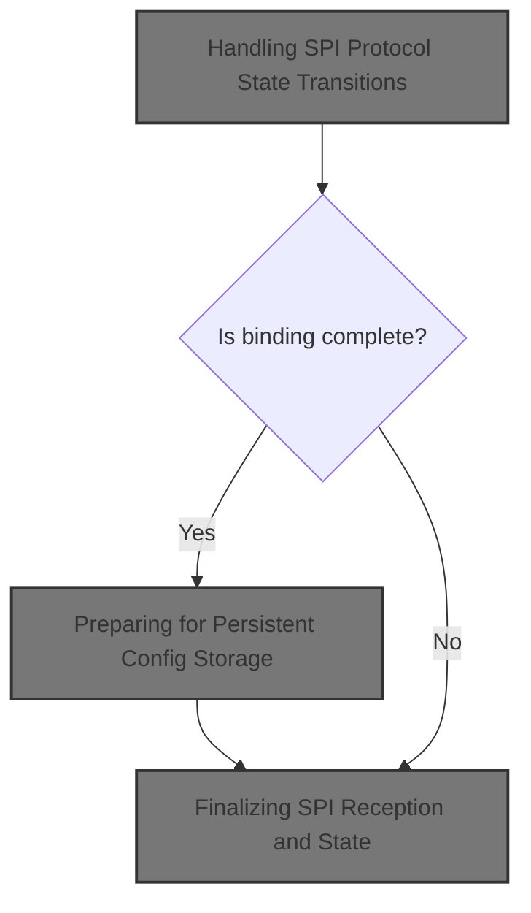

This document describes how the system manages radio receiver state and configuration during SPI communication. When a data packet is received, the system processes protocol state transitions, handles binding and configuration storage if needed, and updates the protocol state and result.



# Handling SPI Protocol State Transitions

```mermaid
%%{init: {"flowchart": {"defaultRenderer": "elk"}} }%%
flowchart TD
    node1["Process receiver binding and tuning phases"]
    click node1 openCode "src/main/rx/cc2500_redpine.c:192:246"
    node1 --> node2{"Is binding complete?"}
    click node2 openCode "src/main/rx/cc2500_redpine.c:247:257"
    node2 -->|"Yes"| node3{"Is autoBind enabled?"}
    click node3 openCode "src/main/rx/cc2500_redpine.c:248:256"
    node3 -->|"No"| node4["Preparing for Persistent Config Storage"]
    
    node3 -->|"Yes"| subgraph loop1["Indicate binding success with LED"]
        loopNode1["Toggle LED and delay"]
        click loopNode1 openCode "src/main/rx/cc2500_redpine.c:252:255"
    end
    node2 -->|"No"| node5["Handle packet in current state"]
    click node5 openCode "src/main/rx/cc2500_redpine.c:263:265"

classDef HeadingStyle fill:#777777,stroke:#333,stroke-width:2px;
click node4 goToHeading "Preparing for Persistent Config Storage"
node4:::HeadingStyle

%% Swimm:
%% %%{init: {"flowchart": {"defaultRenderer": "elk"}} }%%
%% flowchart TD
%%     node1["Process receiver binding and tuning phases"]
%%     click node1 openCode "<SwmPath>[src/…/rx/cc2500_redpine.c](src/main/rx/cc2500_redpine.c)</SwmPath>:192:246"
%%     node1 --> node2{"Is binding complete?"}
%%     click node2 openCode "<SwmPath>[src/…/rx/cc2500_redpine.c](src/main/rx/cc2500_redpine.c)</SwmPath>:247:257"
%%     node2 -->|"Yes"| node3{"Is <SwmToken path="src/main/rx/cc2500_redpine.c" pos="206:15:15" line-data="            if (rxSpiCheckBindRequested(true) || rxCc2500SpiConfig()-&gt;autoBind) {">`autoBind`</SwmToken> enabled?"}
%%     click node3 openCode "<SwmPath>[src/…/rx/cc2500_redpine.c](src/main/rx/cc2500_redpine.c)</SwmPath>:248:256"
%%     node3 -->|"No"| node4["Preparing for Persistent Config Storage"]
%%     
%%     node3 -->|"Yes"| subgraph loop1["Indicate binding success with LED"]
%%         loopNode1["Toggle LED and delay"]
%%         click loopNode1 openCode "<SwmPath>[src/…/rx/cc2500_redpine.c](src/main/rx/cc2500_redpine.c)</SwmPath>:252:255"
%%     end
%%     node2 -->|"No"| node5["Handle packet in current state"]
%%     click node5 openCode "<SwmPath>[src/…/rx/cc2500_redpine.c](src/main/rx/cc2500_redpine.c)</SwmPath>:263:265"
%% 
%% classDef HeadingStyle fill:#777777,stroke:#333,stroke-width:2px;
%% click node4 goToHeading "Preparing for Persistent Config Storage"
%% node4:::HeadingStyle
```

<SwmSnippet path="/src/main/rx/cc2500_redpine.c" line="192">

---

In <SwmToken path="src/main/rx/cc2500_redpine.c" pos="192:2:2" line-data="rx_spi_received_e redpineSpiDataReceived(uint8_t *packet)">`redpineSpiDataReceived`</SwmToken>, we kick off the SPI protocol handling by switching on <SwmToken path="src/main/rx/cc2500_redpine.c" pos="196:4:4" line-data="    switch (protocolState) {">`protocolState`</SwmToken>. Each case manages a specific phase: initialization waits for a delay, binding checks for requests or <SwmToken path="src/main/rx/cc2500_redpine.c" pos="206:15:15" line-data="            if (rxSpiCheckBindRequested(true) || rxCc2500SpiConfig()-&gt;autoBind) {">`autoBind`</SwmToken>, and tuning phases run tuning functions and retry if the bind offset range is too narrow. Hardware interactions like toggling LEDs and sending radio strobes are triggered at key points. The packet pointer is assumed to be valid and is passed to tuning and packet handling functions throughout.

```c
rx_spi_received_e redpineSpiDataReceived(uint8_t *packet)
{
    rx_spi_received_e ret = RX_SPI_RECEIVED_NONE;

    switch (protocolState) {
        case STATE_INIT:
            if ((millis() - start_time) > 10) {
                initialise();

                protocolState = STATE_BIND;
            }

            break;
        case STATE_BIND:
            if (rxSpiCheckBindRequested(true) || rxCc2500SpiConfig()->autoBind) {
                redpineFast = true;
                initialise();
                rxSpiLedOn();
                initBindTuneRx();

                protocolState = STATE_BIND_TUNING1;
            } else {
                protocolState = STATE_STARTING;
            }

            break;
        case STATE_BIND_TUNING1:
            if (tuneRx1(packet)) {
                protocolState = STATE_BIND_TUNING2;
            }
            break;
        case STATE_BIND_TUNING2:
            if (tuneRx2(packet)) {
                protocolState = STATE_BIND_TUNING3;
            }
            break;
        case STATE_BIND_TUNING3:
            if (tuneRx3(packet)) {
                if (((int16_t)bindOffset_max - (int16_t)bindOffset_min) <= 10) {
                    initBindTuneRx();
                    protocolState = STATE_BIND_TUNING1;  // retry
                } else {
                    rxCc2500SpiConfigMutable()->bindOffset = ((int16_t)bindOffset_max + (int16_t)bindOffset_min) / 2;
                    protocolState = STATE_BIND_COMPLETE;
                    cc2500Strobe(CC2500_SIDLE);

                    for (uint8_t i = 0; i < REDPINE_HOP_CHANNELS; i++) {
                        if (rxCc2500SpiConfigMutable()->bindHopData[i] == 0) {
                            protocolState = STATE_BIND_TUNING1;  // retry
                            break;
                        }
                    }
```

---

</SwmSnippet>

<SwmSnippet path="/src/main/rx/cc2500_redpine.c" line="247">

---

Here we handle the completion of binding. If <SwmToken path="src/main/rx/cc2500_redpine.c" pos="248:9:9" line-data="            if (!rxCc2500SpiConfig()-&gt;autoBind) {">`autoBind`</SwmToken> is off, we write the configuration to EEPROM to persist changes. If <SwmToken path="src/main/rx/cc2500_redpine.c" pos="248:9:9" line-data="            if (!rxCc2500SpiConfig()-&gt;autoBind) {">`autoBind`</SwmToken> is on, we skip the write and toggle the LED as a visual indicator. This step is where we jump to the config logic to handle persistent storage.

```c
        case STATE_BIND_COMPLETE:
            if (!rxCc2500SpiConfig()->autoBind) {
                writeEEPROM();
            } else {
                uint8_t ctr = 80;
                while (ctr--) {
                    rxSpiLedToggle();
                    delay(50);
                }
            }

```

---

</SwmSnippet>

## Preparing for Persistent Config Storage

<SwmSnippet path="/src/main/config/config.c" line="708">

---

<SwmToken path="src/main/config/config.c" pos="708:2:2" line-data="void writeEEPROM(void)">`writeEEPROM`</SwmToken> preps for config storage by stopping the RX SPI timer if needed, marking the config as configured, and then delegating the actual write to another function. This keeps hardware and state in sync before persisting data.

```c
void writeEEPROM(void)
{
#ifdef USE_RX_SPI
    rxSpiStop(); // some rx spi protocols use hardware timer, which needs to be stopped before writing to eeprom
#endif
    systemConfigMutable()->configurationState = CONFIGURATION_STATE_CONFIGURED;

    writeUnmodifiedConfigToEEPROM();
}
```

---

</SwmSnippet>

## Validating and Suspending Before EEPROM Write

<SwmSnippet path="/src/main/config/config.c" line="696">

---

This part checks config validity, pauses RX signal handling, and marks the write as active before handing off to the EEPROM write routine.

```c
void writeUnmodifiedConfigToEEPROM(void)
{
    validateAndFixConfig();

    suspendRxSignal();
    eepromWriteInProgress = true;
    writeConfigToEEPROM();
```

---

</SwmSnippet>

### Retrying and Syncing EEPROM Writes

```mermaid
%%{init: {"flowchart": {"defaultRenderer": "elk"}} }%%
flowchart TD
    node1["Start saving configuration"]
    click node1 openCode "src/main/config/config_eeprom.c:505:506"
    subgraph loop1["Up to 3 attempts to save configuration"]
        node1 --> node2["Try to write and validate configuration"]
        click node2 openCode "src/main/config/config_eeprom.c:509:522"
        node2 --> node3{"Was save and validation successful?"}
        click node3 openCode "src/main/config/config_eeprom.c:510:511"
        node3 -->|"No"| node2
        node3 -->|"Yes"| node4{"Is external flash or SD card used?"}
        click node4 openCode "src/main/config/config_eeprom.c:513:520"
        node4 -->|"External flash"| node5["Load configuration from external flash"]
        click node5 openCode "src/main/config/config_eeprom.c:515:516"
        node4 -->|"SD card"| node6["Load configuration from SD card"]
        click node6 openCode "src/main/config/config_eeprom.c:519:520"
        node4 -->|"Neither"| node7["Configuration saved successfully"]
        click node7 openCode "src/main/config/config_eeprom.c:511:522"
    end
    loop1 --> node8{"Did any attempt succeed?"}
    click node8 openCode "src/main/config/config_eeprom.c:509:522"
    node8 -->|"No"| node9["Trigger failure mode"]
    click node9 openCode "src/main/config/config_eeprom.c:528:530"
    node8 -->|"Yes"| node10["End"]
    click node10 openCode "src/main/config/config_eeprom.c:511:522"

classDef HeadingStyle fill:#777777,stroke:#333,stroke-width:2px;

%% Swimm:
%% %%{init: {"flowchart": {"defaultRenderer": "elk"}} }%%
%% flowchart TD
%%     node1["Start saving configuration"]
%%     click node1 openCode "<SwmPath>[src/…/config/config_eeprom.c](src/main/config/config_eeprom.c)</SwmPath>:505:506"
%%     subgraph loop1["Up to 3 attempts to save configuration"]
%%         node1 --> node2["Try to write and validate configuration"]
%%         click node2 openCode "<SwmPath>[src/…/config/config_eeprom.c](src/main/config/config_eeprom.c)</SwmPath>:509:522"
%%         node2 --> node3{"Was save and validation successful?"}
%%         click node3 openCode "<SwmPath>[src/…/config/config_eeprom.c](src/main/config/config_eeprom.c)</SwmPath>:510:511"
%%         node3 -->|"No"| node2
%%         node3 -->|"Yes"| node4{"Is external flash or SD card used?"}
%%         click node4 openCode "<SwmPath>[src/…/config/config_eeprom.c](src/main/config/config_eeprom.c)</SwmPath>:513:520"
%%         node4 -->|"External flash"| node5["Load configuration from external flash"]
%%         click node5 openCode "<SwmPath>[src/…/config/config_eeprom.c](src/main/config/config_eeprom.c)</SwmPath>:515:516"
%%         node4 -->|"SD card"| node6["Load configuration from SD card"]
%%         click node6 openCode "<SwmPath>[src/…/config/config_eeprom.c](src/main/config/config_eeprom.c)</SwmPath>:519:520"
%%         node4 -->|"Neither"| node7["Configuration saved successfully"]
%%         click node7 openCode "<SwmPath>[src/…/config/config_eeprom.c](src/main/config/config_eeprom.c)</SwmPath>:511:522"
%%     end
%%     loop1 --> node8{"Did any attempt succeed?"}
%%     click node8 openCode "<SwmPath>[src/…/config/config_eeprom.c](src/main/config/config_eeprom.c)</SwmPath>:509:522"
%%     node8 -->|"No"| node9["Trigger failure mode"]
%%     click node9 openCode "<SwmPath>[src/…/config/config_eeprom.c](src/main/config/config_eeprom.c)</SwmPath>:528:530"
%%     node8 -->|"Yes"| node10["End"]
%%     click node10 openCode "<SwmPath>[src/…/config/config_eeprom.c](src/main/config/config_eeprom.c)</SwmPath>:511:522"
%% 
%% classDef HeadingStyle fill:#777777,stroke:#333,stroke-width:2px;
```



<SwmSnippet path="/src/main/config/config_eeprom.c" line="505">

---

In <SwmToken path="src/main/config/config_eeprom.c" pos="505:2:2" line-data="void writeConfigToEEPROM(void)">`writeConfigToEEPROM`</SwmToken>, we try up to three times to write config to EEPROM, checking for success each time. If it works, we sync the <SwmToken path="src/main/config/config_eeprom.c" pos="514:17:19" line-data="            // copy it back from flash to the in-memory buffer.">`in-memory`</SwmToken> buffer with external storage if needed. This keeps config persistent and consistent.

```c
void writeConfigToEEPROM(void)
{
    bool success = false;
    // write it
    for (int attempt = 0; attempt < 3 && !success; attempt++) {
        if (writeSettingsToEEPROM() && isEEPROMVersionValid() && isEEPROMStructureValid()) {
            success = true;

#if defined(CONFIG_IN_EXTERNAL_FLASH) || defined(CONFIG_IN_MEMORY_MAPPED_FLASH)
            // copy it back from flash to the in-memory buffer.
            success = loadEEPROMFromExternalFlash();
#endif
#ifdef CONFIG_IN_SDCARD
            // copy it back from flash to the in-memory buffer.
            success = loadEEPROMFromSDCard();
#endif
        }
    }
```

---

</SwmSnippet>

<SwmSnippet path="/src/main/config/config_eeprom.c" line="528">

---

If all EEPROM write attempts fail, we call <SwmToken path="src/main/config/config_eeprom.c" pos="529:1:1" line-data="    failureMode(FAILURE_CONFIG_STORE_FAILURE);">`failureMode`</SwmToken> with a config store failure code, which halts further config operations and flags a critical error.

```c
    // Flash write failed - just die now
    failureMode(FAILURE_CONFIG_STORE_FAILURE);
}
```

---

</SwmSnippet>

### Resuming RX and Clearing Dirty State

<SwmSnippet path="/src/main/config/config.c" line="703">

---

After EEPROM write, we reset flags, resume RX, and clear the dirty state.

```c
    eepromWriteInProgress = false;
    resumeRxSignal();
    configIsDirty = false;
}
```

---

</SwmSnippet>

## Finalizing SPI Reception and State

```mermaid
%%{init: {"flowchart": {"defaultRenderer": "elk"}} }%%
flowchart TD
    node1{"Is the received packet a bind packet?"}
    click node1 openCode "src/main/rx/cc2500_redpine.c:258:262"
    node1 -->|"Yes"| node2["Set protocol state to starting, set result to bind"]
    click node2 openCode "src/main/rx/cc2500_redpine.c:258:261"
    node1 -->|"No"| node3["Handle packet and set result"]
    click node3 openCode "src/main/rx/cc2500_redpine.c:263:265"
    node2 --> node4["Log protocol state"]
    node3 --> node4
    click node4 openCode "src/main/rx/cc2500_redpine.c:267:267"
    node4 --> node5["Return result"]
    click node5 openCode "src/main/rx/cc2500_redpine.c:269:270"

classDef HeadingStyle fill:#777777,stroke:#333,stroke-width:2px;

%% Swimm:
%% %%{init: {"flowchart": {"defaultRenderer": "elk"}} }%%
%% flowchart TD
%%     node1{"Is the received packet a bind packet?"}
%%     click node1 openCode "<SwmPath>[src/…/rx/cc2500_redpine.c](src/main/rx/cc2500_redpine.c)</SwmPath>:258:262"
%%     node1 -->|"Yes"| node2["Set protocol state to starting, set result to bind"]
%%     click node2 openCode "<SwmPath>[src/…/rx/cc2500_redpine.c](src/main/rx/cc2500_redpine.c)</SwmPath>:258:261"
%%     node1 -->|"No"| node3["Handle packet and set result"]
%%     click node3 openCode "<SwmPath>[src/…/rx/cc2500_redpine.c](src/main/rx/cc2500_redpine.c)</SwmPath>:263:265"
%%     node2 --> node4["Log protocol state"]
%%     node3 --> node4
%%     click node4 openCode "<SwmPath>[src/…/rx/cc2500_redpine.c](src/main/rx/cc2500_redpine.c)</SwmPath>:267:267"
%%     node4 --> node5["Return result"]
%%     click node5 openCode "<SwmPath>[src/…/rx/cc2500_redpine.c](src/main/rx/cc2500_redpine.c)</SwmPath>:269:270"
%% 
%% classDef HeadingStyle fill:#777777,stroke:#333,stroke-width:2px;
```



<SwmSnippet path="/src/main/rx/cc2500_redpine.c" line="258">

---

Back in <SwmToken path="src/main/rx/cc2500_redpine.c" pos="192:2:2" line-data="rx_spi_received_e redpineSpiDataReceived(uint8_t *packet)">`redpineSpiDataReceived`</SwmToken>, after coming back from the EEPROM write, we set the return value to indicate binding is done, update the protocol state, and move on to normal packet handling. This wraps up the state machine's binding phase.

```c
            ret = RX_SPI_RECEIVED_BIND;
            protocolState = STATE_STARTING;

            break;
        default:
            ret = redpineHandlePacket(packet, &protocolState);

            break;
    }
    DEBUG_SET(DEBUG_RX_FRSKY_SPI, 3, protocolState);

    return ret;
}
```

---

</SwmSnippet>

&nbsp;

*This is an auto-generated document by Swimm 🌊 and has not yet been verified by a human*

<SwmMeta version="3.0.0" repo-id="Z2l0aHViJTNBJTNBYy1iZXRhZmxpZ2h0JTNBJTNBcmljYXJkb2xvcGV6Zw==" repo-name="c-betaflight"><sup>Powered by [Swimm](https://app.swimm.io/)</sup></SwmMeta>
