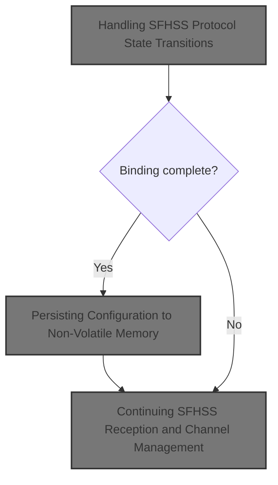

This document outlines how the system manages the SFHSS radio protocol, covering both the initial binding process and ongoing flight data reception. It ensures reliable communication by saving configuration when binding is complete and maintaining synchronization during operation.



# Handling SFHSS Protocol State Transitions

```mermaid
%%{init: {"flowchart": {"defaultRenderer": "elk"}} }%%
flowchart TD
    node1["Start: Receive and interpret packet (protocolState)"] --> node2{"Is receiver binding complete?"}
    click node1 openCode "src/main/rx/cc2500_sfhss.c:308:364"
    node2 -->|"Yes"| node3["Persisting Configuration to Non-Volatile Memory"]
    click node2 openCode "src/main/rx/cc2500_sfhss.c:360:364"
    
    node2 -->|"No"| node4{"Is receiver synchronized and flight data received? (frame_recvd)"}
    click node4 openCode "src/main/rx/cc2500_sfhss.c:365:435"
    node4 -->|"Yes"| node5["Process flight data for control"]
    node4 -->|"No"| node1
    node4 -.->|"Missed packets or sync failed"| node1
classDef HeadingStyle fill:#777777,stroke:#333,stroke-width:2px;
click node3 goToHeading "Persisting Configuration to Non-Volatile Memory"
node3:::HeadingStyle

%% Swimm:
%% %%{init: {"flowchart": {"defaultRenderer": "elk"}} }%%
%% flowchart TD
%%     node1["Start: Receive and interpret packet (<SwmToken path="src/main/rx/cc2500_sfhss.c" pos="317:4:4" line-data="    switch (protocolState) {">`protocolState`</SwmToken>)"] --> node2{"Is receiver binding complete?"}
%%     click node1 openCode "<SwmPath>[src/…/rx/cc2500_sfhss.c](src/main/rx/cc2500_sfhss.c)</SwmPath>:308:364"
%%     node2 -->|"Yes"| node3["Persisting Configuration to Non-Volatile Memory"]
%%     click node2 openCode "<SwmPath>[src/…/rx/cc2500_sfhss.c](src/main/rx/cc2500_sfhss.c)</SwmPath>:360:364"
%%     
%%     node2 -->|"No"| node4{"Is receiver synchronized and flight data received? (<SwmToken path="src/main/rx/cc2500_sfhss.c" pos="312:5:5" line-data="    static uint8_t frame_recvd = 0;">`frame_recvd`</SwmToken>)"}
%%     click node4 openCode "<SwmPath>[src/…/rx/cc2500_sfhss.c](src/main/rx/cc2500_sfhss.c)</SwmPath>:365:435"
%%     node4 -->|"Yes"| node5["Process flight data for control"]
%%     node4 -->|"No"| node1
%%     node4 -.->|"Missed packets or sync failed"| node1
%% classDef HeadingStyle fill:#777777,stroke:#333,stroke-width:2px;
%% click node3 goToHeading "Persisting Configuration to Non-Volatile Memory"
%% node3:::HeadingStyle
```



<SwmSnippet path="/src/main/rx/cc2500_sfhss.c" line="308">

---

In <SwmToken path="src/main/rx/cc2500_sfhss.c" pos="308:2:2" line-data="rx_spi_received_e sfhssSpiDataReceived(uint8_t *packet)">`sfhssSpiDataReceived`</SwmToken>, we kick off the SFHSS protocol state machine. The switch statement handles all protocol phases: initialization, binding, tuning, hunting, and synchronization. Each state transition is triggered by timing checks, packet content, or protocol events. When binding completes, we call <SwmToken path="src/main/rx/cc2500_sfhss.c" pos="361:1:1" line-data="            writeEEPROM();">`writeEEPROM`</SwmToken> to save the binding config, so the receiver remembers the transmitter next time. This is why the next step is to jump into <SwmPath>[src/…/config/config.c](src/main/config/config.c)</SwmPath> for EEPROM handling.

```c
rx_spi_received_e sfhssSpiDataReceived(uint8_t *packet)
{
    static uint16_t dataMissingFrame = 0;
    static timeUs_t nextFrameReceiveStartTime = 0;
    static uint8_t frame_recvd = 0;
    timeUs_t currentPacketReceivedTime;
    rx_spi_received_e ret = RX_SPI_RECEIVED_NONE;

    currentPacketReceivedTime = micros();
    switch (protocolState) {
        case STATE_INIT:
            if ((millis() - start_time) > 10) {
                rxSpiLedOff();
                dataMissingFrame = 0;
                initialise();
                SET_STATE(STATE_BIND);
                DEBUG_SET(DEBUG_RX_SFHSS_SPI, DEBUG_DATA_MISSING_FRAME, dataMissingFrame);
            }
            break;
        case STATE_BIND:
            if (rxSpiCheckBindRequested(true)) {
                rxSpiLedOn();
                initTuneRx();
                SET_STATE(STATE_BIND_TUNING1);
            } else {
                SET_STATE(STATE_HUNT);
                sfhssnextChannel();
                setRssiDirect(0, RSSI_SOURCE_RX_PROTOCOL);
                nextFrameReceiveStartTime = currentPacketReceivedTime + NEXT_CH_TIME_HUNT;
            }
            break;
        case STATE_BIND_TUNING1:
            if (tune1Rx(packet)) {
                SET_STATE(STATE_BIND_TUNING2);
            }
            break;
        case STATE_BIND_TUNING2:
            if (tune2Rx(packet)) {
                SET_STATE(STATE_BIND_TUNING3);
            }
            break;
        case STATE_BIND_TUNING3:
            if (tune3Rx(packet)) {
                if (((int16_t)bindOffset_max - (int16_t)bindOffset_min) <= 2) {
                    initTuneRx();
                    SET_STATE(STATE_BIND_TUNING1);    // retry
                } else {
                    rxCc2500SpiConfigMutable()->bindOffset = ((int16_t)bindOffset_max + (int16_t)bindOffset_min) / 2 ;
                    SET_STATE(STATE_BIND_COMPLETE);
                }
            }
            break;
        case STATE_BIND_COMPLETE:
            writeEEPROM();
            ret = RX_SPI_RECEIVED_BIND;
            SET_STATE(STATE_INIT);
            break;
```

---

</SwmSnippet>

## Persisting Configuration to Non-Volatile Memory

```mermaid
%%{init: {"flowchart": {"defaultRenderer": "elk"}} }%%
flowchart TD
    node1["Start EEPROM write process"]
    click node1 openCode "src/main/config/config.c:708:709"
    node1 --> node2{"Is RX SPI protocol in use?"}
    click node2 openCode "src/main/config/config.c:710:712"
    node2 -->|"Yes"| node3["Stop RX SPI protocol"]
    click node3 openCode "src/main/config/config.c:711:712"
    node2 -->|"No"| node4["Continue"]
    click node4 openCode "src/main/config/config.c:713:713"
    node3 --> node5["Mark configuration as finalized"]
    click node5 openCode "src/main/config/config.c:713:713"
    node4 --> node5
    node5 --> node6["Save configuration to EEPROM"]
    click node6 openCode "src/main/config/config.c:715:715"

classDef HeadingStyle fill:#777777,stroke:#333,stroke-width:2px;

%% Swimm:
%% %%{init: {"flowchart": {"defaultRenderer": "elk"}} }%%
%% flowchart TD
%%     node1["Start EEPROM write process"]
%%     click node1 openCode "<SwmPath>[src/…/config/config.c](src/main/config/config.c)</SwmPath>:708:709"
%%     node1 --> node2{"Is RX SPI protocol in use?"}
%%     click node2 openCode "<SwmPath>[src/…/config/config.c](src/main/config/config.c)</SwmPath>:710:712"
%%     node2 -->|"Yes"| node3["Stop RX SPI protocol"]
%%     click node3 openCode "<SwmPath>[src/…/config/config.c](src/main/config/config.c)</SwmPath>:711:712"
%%     node2 -->|"No"| node4["Continue"]
%%     click node4 openCode "<SwmPath>[src/…/config/config.c](src/main/config/config.c)</SwmPath>:713:713"
%%     node3 --> node5["Mark configuration as finalized"]
%%     click node5 openCode "<SwmPath>[src/…/config/config.c](src/main/config/config.c)</SwmPath>:713:713"
%%     node4 --> node5
%%     node5 --> node6["Save configuration to EEPROM"]
%%     click node6 openCode "<SwmPath>[src/…/config/config.c](src/main/config/config.c)</SwmPath>:715:715"
%% 
%% classDef HeadingStyle fill:#777777,stroke:#333,stroke-width:2px;
```



<SwmSnippet path="/src/main/config/config.c" line="708">

---

This is where we prep for EEPROM write by stopping RX SPI and marking config as configured, then hand off to the next function for the actual write.

```c
void writeEEPROM(void)
{
#ifdef USE_RX_SPI
    rxSpiStop(); // some rx spi protocols use hardware timer, which needs to be stopped before writing to eeprom
#endif
    systemConfigMutable()->configurationState = CONFIGURATION_STATE_CONFIGURED;

    writeUnmodifiedConfigToEEPROM();
}
```

---

</SwmSnippet>

## Validating and Preparing Config for Storage

<SwmSnippet path="/src/main/config/config.c" line="696">

---

This is where we check the config, pause RX, and flag the write before handing off to the EEPROM write routine.

```c
void writeUnmodifiedConfigToEEPROM(void)
{
    validateAndFixConfig();

    suspendRxSignal();
    eepromWriteInProgress = true;
    writeConfigToEEPROM();
```

---

</SwmSnippet>

### Robust EEPROM Write and Verification

```mermaid
%%{init: {"flowchart": {"defaultRenderer": "elk"}} }%%
flowchart TD
    node1["Start saving configuration"]
    click node1 openCode "src/main/config/config_eeprom.c:505:530"
    subgraph loop1["Retry up to 3 times to save configuration"]
        node1 --> node2["Attempt to write and validate configuration"]
        click node2 openCode "src/main/config/config_eeprom.c:509:522"
        node2 --> node3{"Was save and validation successful?"}
        click node3 openCode "src/main/config/config_eeprom.c:510:511"
        node3 -->|"Yes"| node4{"Is configuration stored in external flash or SD card?"}
        click node4 openCode "src/main/config/config_eeprom.c:513:520"
        node3 -->|"No"| node2
        node4 -->|"Yes"| node5["Reload configuration from external storage"]
        click node5 openCode "src/main/config/config_eeprom.c:515:519"
        node4 -->|"No"| node6["Configuration saved successfully"]
        click node6 openCode "src/main/config/config_eeprom.c:511:511"
        node5 --> node6
    end
    node2 -. After 3 failed attempts .-> node7["Trigger failure mode"]
    click node7 openCode "src/main/config/config_eeprom.c:528:530"

classDef HeadingStyle fill:#777777,stroke:#333,stroke-width:2px;

%% Swimm:
%% %%{init: {"flowchart": {"defaultRenderer": "elk"}} }%%
%% flowchart TD
%%     node1["Start saving configuration"]
%%     click node1 openCode "<SwmPath>[src/…/config/config_eeprom.c](src/main/config/config_eeprom.c)</SwmPath>:505:530"
%%     subgraph loop1["Retry up to 3 times to save configuration"]
%%         node1 --> node2["Attempt to write and validate configuration"]
%%         click node2 openCode "<SwmPath>[src/…/config/config_eeprom.c](src/main/config/config_eeprom.c)</SwmPath>:509:522"
%%         node2 --> node3{"Was save and validation successful?"}
%%         click node3 openCode "<SwmPath>[src/…/config/config_eeprom.c](src/main/config/config_eeprom.c)</SwmPath>:510:511"
%%         node3 -->|"Yes"| node4{"Is configuration stored in external flash or SD card?"}
%%         click node4 openCode "<SwmPath>[src/…/config/config_eeprom.c](src/main/config/config_eeprom.c)</SwmPath>:513:520"
%%         node3 -->|"No"| node2
%%         node4 -->|"Yes"| node5["Reload configuration from external storage"]
%%         click node5 openCode "<SwmPath>[src/…/config/config_eeprom.c](src/main/config/config_eeprom.c)</SwmPath>:515:519"
%%         node4 -->|"No"| node6["Configuration saved successfully"]
%%         click node6 openCode "<SwmPath>[src/…/config/config_eeprom.c](src/main/config/config_eeprom.c)</SwmPath>:511:511"
%%         node5 --> node6
%%     end
%%     node2 -. After 3 failed attempts .-> node7["Trigger failure mode"]
%%     click node7 openCode "<SwmPath>[src/…/config/config_eeprom.c](src/main/config/config_eeprom.c)</SwmPath>:528:530"
%% 
%% classDef HeadingStyle fill:#777777,stroke:#333,stroke-width:2px;
```



<SwmSnippet path="/src/main/config/config_eeprom.c" line="505">

---

In <SwmToken path="src/main/config/config_eeprom.c" pos="505:2:2" line-data="void writeConfigToEEPROM(void)">`writeConfigToEEPROM`</SwmToken>, we try up to three times to write the config and verify it. If the config is stored externally or on SD, we copy it back to RAM to keep everything in sync. This makes sure the config is actually saved and matches what’s in memory.

```c
void writeConfigToEEPROM(void)
{
    bool success = false;
    // write it
    for (int attempt = 0; attempt < 3 && !success; attempt++) {
        if (writeSettingsToEEPROM() && isEEPROMVersionValid() && isEEPROMStructureValid()) {
            success = true;

#if defined(CONFIG_IN_EXTERNAL_FLASH) || defined(CONFIG_IN_MEMORY_MAPPED_FLASH)
            // copy it back from flash to the in-memory buffer.
            success = loadEEPROMFromExternalFlash();
#endif
#ifdef CONFIG_IN_SDCARD
            // copy it back from flash to the in-memory buffer.
            success = loadEEPROMFromSDCard();
#endif
        }
    }
```

---

</SwmSnippet>

<SwmSnippet path="/src/main/config/config_eeprom.c" line="528">

---

If all EEPROM write attempts fail, we call <SwmToken path="src/main/config/config_eeprom.c" pos="529:1:1" line-data="    failureMode(FAILURE_CONFIG_STORE_FAILURE);">`failureMode`</SwmToken> with a config store failure code. This puts the system into an error state because saving config is mandatory.

```c
    // Flash write failed - just die now
    failureMode(FAILURE_CONFIG_STORE_FAILURE);
}
```

---

</SwmSnippet>

### Finalizing Config Write and System State

<SwmSnippet path="/src/main/config/config.c" line="703">

---

After EEPROM write, we reset flags, resume RX, and mark config as synced.

```c
    eepromWriteInProgress = false;
    resumeRxSignal();
    configIsDirty = false;
}
```

---

</SwmSnippet>

## Continuing SFHSS Reception and Channel Management

```mermaid
%%{init: {"flowchart": {"defaultRenderer": "elk"}} }%%
flowchart TD
    node1{"Receiver State: HUNT or SYNC?"}
    click node1 openCode "src/main/rx/cc2500_sfhss.c:365:390"
    node1 -->|"HUNT"| node2{"Packet Received and Valid?"}
    click node2 openCode "src/main/rx/cc2500_sfhss.c:366:376"
    node2 -->|"Yes"| node3{"Channels 5-8?"}
    click node3 openCode "src/main/rx/cc2500_sfhss.c:368:375"
    node3 -->|"Yes"| node4["Sync, reset missing packets, set next receive time, transition to SYNC"]
    click node4 openCode "src/main/rx/cc2500_sfhss.c:369:373"
    node3 -->|"No"| node5["Continue hunting"]
    click node5 openCode "src/main/rx/cc2500_sfhss.c:377:378"
    node2 -->|"No"| node6{"Time Elapsed?"}
    click node6 openCode "src/main/rx/cc2500_sfhss.c:378:384"
    node6 -->|"Yes"| node7["Advance channel, update time"]
    click node7 openCode "src/main/rx/cc2500_sfhss.c:383:384"
    node6 -->|"No"| node8{"Bind Requested?"}
    click node8 openCode "src/main/rx/cc2500_sfhss.c:385:387"
    node8 -->|"Yes"| node9["Set state INIT"]
    click node9 openCode "src/main/rx/cc2500_sfhss.c:386:387"
    node8 -->|"No"| node5
    node1 -->|"SYNC"| node10{"Packet Received and Valid?"}
    click node10 openCode "src/main/rx/cc2500_sfhss.c:391:406"
    node10 -->|"Yes"| node11{"Channels 5-8?"}
    click node11 openCode "src/main/rx/cc2500_sfhss.c:394:397"
    node11 -->|"Yes"| node12["Update next receive time, mark channels 5-8 received"]
    click node12 openCode "src/main/rx/cc2500_sfhss.c:395:396"
    node11 -->|"No"| node13["Update next receive time, mark channels 1-4 received"]
    click node13 openCode "src/main/rx/cc2500_sfhss.c:398:400"
    node10 -->|"No"| node14["Continue sync"]
    click node14 openCode "src/main/rx/cc2500_sfhss.c:407:408"
    node10 -->|"Yes"| node15{"Failsafe Packet?"}
    click node15 openCode "src/main/rx/cc2500_sfhss.c:402:403"
    node15 -->|"Yes"| node16["Return: No data"]
    click node16 openCode "src/main/rx/cc2500_sfhss.c:403:404"
    node15 -->|"No"| node17["Return: Data received"]
    click node17 openCode "src/main/rx/cc2500_sfhss.c:405:406"
    node1 -->|"SYNC"| node18{"Time Elapsed?"}
    click node18 openCode "src/main/rx/cc2500_sfhss.c:408:427"
    node18 -->|"Yes"| node19{"All frames received?"}
    click node19 openCode "src/main/rx/cc2500_sfhss.c:410:427"
    node19 -->|"No"| node20{"Too many missing packets?"}
    click node20 openCode "src/main/rx/cc2500_sfhss.c:414:420"
    node20 -->|"Yes"| node21["Set state HUNT, next channel, reset RSSI, update time"]
    click node21 openCode "src/main/rx/cc2500_sfhss.c:415:418"
    node20 -->|"No"| node22["Switch antenna if needed, next channel"]
    click node22 openCode "src/main/rx/cc2500_sfhss.c:422:428"
    node19 -->|"Yes"| node22
    node18 -->|"No"| node23{"Bind Requested?"}
    click node23 openCode "src/main/rx/cc2500_sfhss.c:429:431"
    node23 -->|"Yes"| node24["Set state INIT"]
    click node24 openCode "src/main/rx/cc2500_sfhss.c:430:431"
    node23 -->|"No"| node14

classDef HeadingStyle fill:#777777,stroke:#333,stroke-width:2px;

%% Swimm:
%% %%{init: {"flowchart": {"defaultRenderer": "elk"}} }%%
%% flowchart TD
%%     node1{"Receiver State: HUNT or SYNC?"}
%%     click node1 openCode "<SwmPath>[src/…/rx/cc2500_sfhss.c](src/main/rx/cc2500_sfhss.c)</SwmPath>:365:390"
%%     node1 -->|"HUNT"| node2{"Packet Received and Valid?"}
%%     click node2 openCode "<SwmPath>[src/…/rx/cc2500_sfhss.c](src/main/rx/cc2500_sfhss.c)</SwmPath>:366:376"
%%     node2 -->|"Yes"| node3{"Channels <SwmToken path="src/main/rx/cc2500_sfhss.c" pos="368:20:22" line-data="                    if (GET_COMMAND(packet) &amp; 0x8) {       /* ch=5-8 */">`5-8`</SwmToken>?"}
%%     click node3 openCode "<SwmPath>[src/…/rx/cc2500_sfhss.c](src/main/rx/cc2500_sfhss.c)</SwmPath>:368:375"
%%     node3 -->|"Yes"| node4["Sync, reset missing packets, set next receive time, transition to SYNC"]
%%     click node4 openCode "<SwmPath>[src/…/rx/cc2500_sfhss.c](src/main/rx/cc2500_sfhss.c)</SwmPath>:369:373"
%%     node3 -->|"No"| node5["Continue hunting"]
%%     click node5 openCode "<SwmPath>[src/…/rx/cc2500_sfhss.c](src/main/rx/cc2500_sfhss.c)</SwmPath>:377:378"
%%     node2 -->|"No"| node6{"Time Elapsed?"}
%%     click node6 openCode "<SwmPath>[src/…/rx/cc2500_sfhss.c](src/main/rx/cc2500_sfhss.c)</SwmPath>:378:384"
%%     node6 -->|"Yes"| node7["Advance channel, update time"]
%%     click node7 openCode "<SwmPath>[src/…/rx/cc2500_sfhss.c](src/main/rx/cc2500_sfhss.c)</SwmPath>:383:384"
%%     node6 -->|"No"| node8{"Bind Requested?"}
%%     click node8 openCode "<SwmPath>[src/…/rx/cc2500_sfhss.c](src/main/rx/cc2500_sfhss.c)</SwmPath>:385:387"
%%     node8 -->|"Yes"| node9["Set state INIT"]
%%     click node9 openCode "<SwmPath>[src/…/rx/cc2500_sfhss.c](src/main/rx/cc2500_sfhss.c)</SwmPath>:386:387"
%%     node8 -->|"No"| node5
%%     node1 -->|"SYNC"| node10{"Packet Received and Valid?"}
%%     click node10 openCode "<SwmPath>[src/…/rx/cc2500_sfhss.c](src/main/rx/cc2500_sfhss.c)</SwmPath>:391:406"
%%     node10 -->|"Yes"| node11{"Channels <SwmToken path="src/main/rx/cc2500_sfhss.c" pos="368:20:22" line-data="                    if (GET_COMMAND(packet) &amp; 0x8) {       /* ch=5-8 */">`5-8`</SwmToken>?"}
%%     click node11 openCode "<SwmPath>[src/…/rx/cc2500_sfhss.c](src/main/rx/cc2500_sfhss.c)</SwmPath>:394:397"
%%     node11 -->|"Yes"| node12["Update next receive time, mark channels <SwmToken path="src/main/rx/cc2500_sfhss.c" pos="368:20:22" line-data="                    if (GET_COMMAND(packet) &amp; 0x8) {       /* ch=5-8 */">`5-8`</SwmToken> received"]
%%     click node12 openCode "<SwmPath>[src/…/rx/cc2500_sfhss.c](src/main/rx/cc2500_sfhss.c)</SwmPath>:395:396"
%%     node11 -->|"No"| node13["Update next receive time, mark channels 1-4 received"]
%%     click node13 openCode "<SwmPath>[src/…/rx/cc2500_sfhss.c](src/main/rx/cc2500_sfhss.c)</SwmPath>:398:400"
%%     node10 -->|"No"| node14["Continue sync"]
%%     click node14 openCode "<SwmPath>[src/…/rx/cc2500_sfhss.c](src/main/rx/cc2500_sfhss.c)</SwmPath>:407:408"
%%     node10 -->|"Yes"| node15{"Failsafe Packet?"}
%%     click node15 openCode "<SwmPath>[src/…/rx/cc2500_sfhss.c](src/main/rx/cc2500_sfhss.c)</SwmPath>:402:403"
%%     node15 -->|"Yes"| node16["Return: No data"]
%%     click node16 openCode "<SwmPath>[src/…/rx/cc2500_sfhss.c](src/main/rx/cc2500_sfhss.c)</SwmPath>:403:404"
%%     node15 -->|"No"| node17["Return: Data received"]
%%     click node17 openCode "<SwmPath>[src/…/rx/cc2500_sfhss.c](src/main/rx/cc2500_sfhss.c)</SwmPath>:405:406"
%%     node1 -->|"SYNC"| node18{"Time Elapsed?"}
%%     click node18 openCode "<SwmPath>[src/…/rx/cc2500_sfhss.c](src/main/rx/cc2500_sfhss.c)</SwmPath>:408:427"
%%     node18 -->|"Yes"| node19{"All frames received?"}
%%     click node19 openCode "<SwmPath>[src/…/rx/cc2500_sfhss.c](src/main/rx/cc2500_sfhss.c)</SwmPath>:410:427"
%%     node19 -->|"No"| node20{"Too many missing packets?"}
%%     click node20 openCode "<SwmPath>[src/…/rx/cc2500_sfhss.c](src/main/rx/cc2500_sfhss.c)</SwmPath>:414:420"
%%     node20 -->|"Yes"| node21["Set state HUNT, next channel, reset RSSI, update time"]
%%     click node21 openCode "<SwmPath>[src/…/rx/cc2500_sfhss.c](src/main/rx/cc2500_sfhss.c)</SwmPath>:415:418"
%%     node20 -->|"No"| node22["Switch antenna if needed, next channel"]
%%     click node22 openCode "<SwmPath>[src/…/rx/cc2500_sfhss.c](src/main/rx/cc2500_sfhss.c)</SwmPath>:422:428"
%%     node19 -->|"Yes"| node22
%%     node18 -->|"No"| node23{"Bind Requested?"}
%%     click node23 openCode "<SwmPath>[src/…/rx/cc2500_sfhss.c](src/main/rx/cc2500_sfhss.c)</SwmPath>:429:431"
%%     node23 -->|"Yes"| node24["Set state INIT"]
%%     click node24 openCode "<SwmPath>[src/…/rx/cc2500_sfhss.c](src/main/rx/cc2500_sfhss.c)</SwmPath>:430:431"
%%     node23 -->|"No"| node14
%% 
%% classDef HeadingStyle fill:#777777,stroke:#333,stroke-width:2px;
```



<SwmSnippet path="/src/main/rx/cc2500_sfhss.c" line="365">

---

After returning from <SwmPath>[src/…/config/config.c](src/main/config/config.c)</SwmPath> in <SwmToken path="src/main/rx/cc2500_sfhss.c" pos="308:2:2" line-data="rx_spi_received_e sfhssSpiDataReceived(uint8_t *packet)">`sfhssSpiDataReceived`</SwmToken>, the state machine keeps running, handling packet reception, channel switching, and sync. It uses timing and packet parsing to decide when to hop channels, reset flags, or return data, and hardware calls to manage the radio and LEDs.

```c
        case STATE_HUNT:
            if (sfhssRecv(packet)) {
                if (sfhssPacketParse(packet, true)) {
                    if (GET_COMMAND(packet) & 0x8) {       /* ch=5-8 */
                        missingPackets = 0;
                        rxSpiLedOn();
                        frame_recvd = 0x3;
                        SET_STATE(STATE_SYNC);
                        nextFrameReceiveStartTime = currentPacketReceivedTime + NEXT_CH_TIME_SYNC2;
                        return RX_SPI_RECEIVED_NONE;
                    }
                }
                cc2500Strobe(CC2500_SRX);
            } else if (cmpTimeUs(currentPacketReceivedTime, nextFrameReceiveStartTime) > 0) {
                rxSpiLedBlink(500);
#if defined(USE_RX_CC2500_SPI_PA_LNA) && defined(USE_RX_CC2500_SPI_DIVERSITY) // SE4311 chip
                cc2500switchAntennae();
#endif
                sfhssnextChannel();
                nextFrameReceiveStartTime += NEXT_CH_TIME_HUNT;
            } else if (rxSpiCheckBindRequested(false)) {
                SET_STATE(STATE_INIT);
                break;
            }
            break;
        case STATE_SYNC:
            if (sfhssRecv(packet)) {
                if (sfhssPacketParse(packet, true)) {
                    missingPackets = 0;
                    if ( GET_COMMAND(packet) & 0x8 ) {
                        nextFrameReceiveStartTime = currentPacketReceivedTime + NEXT_CH_TIME_SYNC2;
                        frame_recvd |= 0x2;     /* ch5-8 */
                    } else {
                        nextFrameReceiveStartTime = currentPacketReceivedTime + NEXT_CH_TIME_SYNC1;
                        cc2500Strobe(CC2500_SRX);
                        frame_recvd |= 0x1;     /* ch1-4 */
                    }
                    if (GET_COMMAND(packet) & 0x4) {
                        return RX_SPI_RECEIVED_NONE; /* failsafe data */
                    }
                    return RX_SPI_RECEIVED_DATA;
                }
                cc2500Strobe(CC2500_SRX);
            } else if (cmpTimeUs(currentPacketReceivedTime, nextFrameReceiveStartTime) > 0) {
                nextFrameReceiveStartTime += NEXT_CH_TIME_SYNC0;
                if (frame_recvd != 0x3) {
                    DEBUG_SET(DEBUG_RX_SFHSS_SPI, DEBUG_DATA_MISSING_FRAME, ++dataMissingFrame);
                }
                if (frame_recvd == 0) {
                    if (++missingPackets > MAX_MISSING_PKT) {
                        SET_STATE(STATE_HUNT);
                        sfhssnextChannel();
                        setRssiDirect(0, RSSI_SOURCE_RX_PROTOCOL);
                        nextFrameReceiveStartTime = currentPacketReceivedTime + NEXT_CH_TIME_HUNT;
                        break;
                    }
#if defined(USE_RX_CC2500_SPI_PA_LNA) && defined(USE_RX_CC2500_SPI_DIVERSITY) // SE4311 chip
                    if (missingPackets >= 2) {
                        cc2500switchAntennae();
                    }
#endif
                }
                frame_recvd = 0;
                sfhssnextChannel();
            } else if (rxSpiCheckBindRequested(false)) {
                SET_STATE(STATE_INIT);
                break;
            }
            break;
    }

    return ret;
}
```

---

</SwmSnippet>

&nbsp;

*This is an auto-generated document by Swimm 🌊 and has not yet been verified by a human*

<SwmMeta version="3.0.0" repo-id="Z2l0aHViJTNBJTNBYy1iZXRhZmxpZ2h0JTNBJTNBcmljYXJkb2xvcGV6Zw==" repo-name="c-betaflight"><sup>Powered by [Swimm](https://app.swimm.io/)</sup></SwmMeta>
