This document describes the process of initializing and enabling motors for operation. The flow iterates through each available motor, configuring and enabling only those that are successfully set up. This ensures the system is ready for flight with properly configured hardware.

# Motor Initialization Entry Point

```mermaid
%%{init: {"flowchart": {"defaultRenderer": "elk"}} }%%
flowchart TD
    node1["Prepare motor timing for operation"]
    click node1 openCode "src/platform/AT32/dshot_bitbang.c:652:652"
    node1 --> node2["Begin motor setup"]
    click node2 openCode "src/platform/AT32/dshot_bitbang.c:654:661"
    subgraph loop1["For each motor (up to supported and actual count)"]
        node2 --> node3{"Is motor configured successfully?"}
        click node3 openCode "src/platform/AT32/dshot_bitbang.c:656:657"
        node3 -->|"Yes"| node4["Enable motor for flight"]
        click node4 openCode "src/platform/AT32/dshot_bitbang.c:660:661"
        node4 --> node3
        node3 -->|"No"| node5["Stop motor initialization"]
        click node5 openCode "src/platform/AT32/dshot_bitbang.c:657:658"
    end
    node3 -->|"All motors processed"| node6["All motors initialized"]
    click node6 openCode "src/platform/AT32/dshot_bitbang.c:662:662"

classDef HeadingStyle fill:#777777,stroke:#333,stroke-width:2px;

%% Swimm:
%% %%{init: {"flowchart": {"defaultRenderer": "elk"}} }%%
%% flowchart TD
%%     node1["Prepare motor timing for operation"]
%%     click node1 openCode "<SwmPath>[src/…/AT32/dshot_bitbang.c](src/platform/AT32/dshot_bitbang.c)</SwmPath>:652:652"
%%     node1 --> node2["Begin motor setup"]
%%     click node2 openCode "<SwmPath>[src/…/AT32/dshot_bitbang.c](src/platform/AT32/dshot_bitbang.c)</SwmPath>:654:661"
%%     subgraph loop1["For each motor (up to supported and actual count)"]
%%         node2 --> node3{"Is motor configured successfully?"}
%%         click node3 openCode "<SwmPath>[src/…/AT32/dshot_bitbang.c](src/platform/AT32/dshot_bitbang.c)</SwmPath>:656:657"
%%         node3 -->|"Yes"| node4["Enable motor for flight"]
%%         click node4 openCode "<SwmPath>[src/…/AT32/dshot_bitbang.c](src/platform/AT32/dshot_bitbang.c)</SwmPath>:660:661"
%%         node4 --> node3
%%         node3 -->|"No"| node5["Stop motor initialization"]
%%         click node5 openCode "<SwmPath>[src/…/AT32/dshot_bitbang.c](src/platform/AT32/dshot_bitbang.c)</SwmPath>:657:658"
%%     end
%%     node3 -->|"All motors processed"| node6["All motors initialized"]
%%     click node6 openCode "<SwmPath>[src/…/AT32/dshot_bitbang.c](src/platform/AT32/dshot_bitbang.c)</SwmPath>:662:662"
%% 
%% classDef HeadingStyle fill:#777777,stroke:#333,stroke-width:2px;
```



<SwmSnippet path="/src/platform/AT32/dshot_bitbang.c" line="650">

---

BbPostInit kicks off the motor setup by finding the pacer timer and then iterating through each motor. For each motor, it calls <SwmToken path="src/platform/AT32/dshot_bitbang.c" pos="656:5:5" line-data="        if (!bbMotorConfig(bbMotors[motorIndex].io, motorIndex, motorProtocol, bbMotors[motorIndex].output)) {">`bbMotorConfig`</SwmToken> to handle the hardware and DMA setup. If <SwmToken path="src/platform/AT32/dshot_bitbang.c" pos="656:5:5" line-data="        if (!bbMotorConfig(bbMotors[motorIndex].io, motorIndex, motorProtocol, bbMotors[motorIndex].output)) {">`bbMotorConfig`</SwmToken> fails, we bail out immediately, so only properly configured motors get enabled.

```c
static void bbPostInit(void)
{
    bbFindPacerTimer();

    for (int motorIndex = 0; motorIndex < MAX_SUPPORTED_MOTORS && motorIndex < dshotMotorCount; motorIndex++) {

        if (!bbMotorConfig(bbMotors[motorIndex].io, motorIndex, motorProtocol, bbMotors[motorIndex].output)) {
            return;
        }

        bbMotors[motorIndex].enabled = true;
    }
}
```

---

</SwmSnippet>

# Motor Port and DMA Configuration

```mermaid
%%{init: {"flowchart": {"defaultRenderer": "elk"}} }%%
flowchart TD
    node1["Begin motor configuration"] --> node2{"Is port group available for motor?"}
    click node1 openCode "src/platform/AT32/dshot_bitbang.c:373:374"
    node2 -->|"No"| node3["Create and initialize port group"]
    click node2 openCode "src/platform/AT32/dshot_bitbang.c:380:384"
    node2 -->|"Yes"| node4["Continue configuration with existing port group"]
    click node4 openCode "src/platform/AT32/dshot_bitbang.c:378:379"
    node3 --> node5{"Is DMA allocation successful?"}
    click node3 openCode "src/platform/AT32/dshot_bitbang.c:399:401"
    node4 --> node5
    node5 -->|"No"| node6["Return failure"]
    click node6 openCode "src/platform/AT32/dshot_bitbang.c:400:401"
    node5 -->|"Yes"| node7["Configure motor (GPIO, buffers, protocol, telemetry)"]
    click node7 openCode "src/platform/AT32/dshot_bitbang.c:403:443"
    node7 --> node8{"Enable DSHOT telemetry?"}
    click node8 openCode "src/platform/AT32/dshot_bitbang.c:433:440"
    node8 -->|"Yes"| node9["Configure output buffer for telemetry"]
    click node9 openCode "src/platform/AT32/dshot_bitbang.c:435:436"
    node8 -->|"No"| node10["Configure output buffer without telemetry"]
    click node10 openCode "src/platform/AT32/dshot_bitbang.c:439:440"
    node9 --> node11["Finalize motor configuration"]
    node10 --> node11
    click node11 openCode "src/platform/AT32/dshot_bitbang.c:442:446"
    node11 --> node12["Return success"]
    click node12 openCode "src/platform/AT32/dshot_bitbang.c:446:447"

classDef HeadingStyle fill:#777777,stroke:#333,stroke-width:2px;

%% Swimm:
%% %%{init: {"flowchart": {"defaultRenderer": "elk"}} }%%
%% flowchart TD
%%     node1["Begin motor configuration"] --> node2{"Is port group available for motor?"}
%%     click node1 openCode "<SwmPath>[src/…/AT32/dshot_bitbang.c](src/platform/AT32/dshot_bitbang.c)</SwmPath>:373:374"
%%     node2 -->|"No"| node3["Create and initialize port group"]
%%     click node2 openCode "<SwmPath>[src/…/AT32/dshot_bitbang.c](src/platform/AT32/dshot_bitbang.c)</SwmPath>:380:384"
%%     node2 -->|"Yes"| node4["Continue configuration with existing port group"]
%%     click node4 openCode "<SwmPath>[src/…/AT32/dshot_bitbang.c](src/platform/AT32/dshot_bitbang.c)</SwmPath>:378:379"
%%     node3 --> node5{"Is DMA allocation successful?"}
%%     click node3 openCode "<SwmPath>[src/…/AT32/dshot_bitbang.c](src/platform/AT32/dshot_bitbang.c)</SwmPath>:399:401"
%%     node4 --> node5
%%     node5 -->|"No"| node6["Return failure"]
%%     click node6 openCode "<SwmPath>[src/…/AT32/dshot_bitbang.c](src/platform/AT32/dshot_bitbang.c)</SwmPath>:400:401"
%%     node5 -->|"Yes"| node7["Configure motor (GPIO, buffers, protocol, telemetry)"]
%%     click node7 openCode "<SwmPath>[src/…/AT32/dshot_bitbang.c](src/platform/AT32/dshot_bitbang.c)</SwmPath>:403:443"
%%     node7 --> node8{"Enable DSHOT telemetry?"}
%%     click node8 openCode "<SwmPath>[src/…/AT32/dshot_bitbang.c](src/platform/AT32/dshot_bitbang.c)</SwmPath>:433:440"
%%     node8 -->|"Yes"| node9["Configure output buffer for telemetry"]
%%     click node9 openCode "<SwmPath>[src/…/AT32/dshot_bitbang.c](src/platform/AT32/dshot_bitbang.c)</SwmPath>:435:436"
%%     node8 -->|"No"| node10["Configure output buffer without telemetry"]
%%     click node10 openCode "<SwmPath>[src/…/AT32/dshot_bitbang.c](src/platform/AT32/dshot_bitbang.c)</SwmPath>:439:440"
%%     node9 --> node11["Finalize motor configuration"]
%%     node10 --> node11
%%     click node11 openCode "<SwmPath>[src/…/AT32/dshot_bitbang.c](src/platform/AT32/dshot_bitbang.c)</SwmPath>:442:446"
%%     node11 --> node12["Return success"]
%%     click node12 openCode "<SwmPath>[src/…/AT32/dshot_bitbang.c](src/platform/AT32/dshot_bitbang.c)</SwmPath>:446:447"
%% 
%% classDef HeadingStyle fill:#777777,stroke:#333,stroke-width:2px;
```



<SwmSnippet path="/src/platform/AT32/dshot_bitbang.c" line="373">

---

In <SwmToken path="src/platform/AT32/dshot_bitbang.c" pos="373:4:4" line-data="static bool bbMotorConfig(IO_t io, uint8_t motorIndex, motorProtocolTypes_e pwmProtocolType, uint8_t output)">`bbMotorConfig`</SwmToken>, we grab the pin and port indices, check if a motor port exists, and allocate one if needed. We set up DMA channels and buffers for both output and input, then initialize the timer and DMA. Next, we call <SwmToken path="src/platform/AT32/dshot_bitbang.c" pos="413:1:1" line-data="        bbTimerChannelInit(bbPort);">`bbTimerChannelInit`</SwmToken> to configure the timer channel for PWM output, which is needed for correct signal generation.

```c
static bool bbMotorConfig(IO_t io, uint8_t motorIndex, motorProtocolTypes_e pwmProtocolType, uint8_t output)
{
    int pinIndex = IO_GPIOPinIdx(io);
    int portIndex = IO_GPIOPortIdx(io);

    bbPort_t *bbPort = bbFindMotorPort(portIndex);

    if (!bbPort) {

        // New port group

        bbPort = bbAllocateMotorPort(portIndex);

        if (bbPort) {
            const timerHardware_t *timhw = bbPort->timhw;

#ifdef USE_DMA_SPEC
            const dmaChannelSpec_t *dmaChannelSpec = dmaGetChannelSpecByTimerValue(timhw->tim, timhw->channel, dmaGetOptionByTimer(timhw));
            bbPort->dmaResource = dmaChannelSpec->ref;
            bbPort->dmaChannel = dmaChannelSpec->dmaMuxId;
#else
            bbPort->dmaResource = timhw->dmaRef;
            bbPort->dmaChannel = timhw->dmaChannel;
#endif
        }

        if (!bbPort || !dmaAllocate(dmaGetIdentifier(bbPort->dmaResource), bbPort->resourceOwner.owner, bbPort->resourceOwner.index)) {
            return false;
        }

        bbPort->gpio = IO_GPIO(io);

        bbPort->portOutputCount = MOTOR_DSHOT_BUF_LENGTH;
        bbPort->portOutputBuffer = &bbOutputBuffer[(bbPort - bbPorts) * MOTOR_DSHOT_BUF_CACHE_ALIGN_LENGTH];

        bbPort->portInputCount = DSHOT_BB_PORT_IP_BUF_LENGTH;
        bbPort->portInputBuffer = &bbInputBuffer[(bbPort - bbPorts) * DSHOT_BB_PORT_IP_BUF_CACHE_ALIGN_LENGTH];

        bbTimebaseSetup(bbPort, pwmProtocolType);
        bbTIM_TimeBaseInit(bbPort, bbPort->outputARR);
        bbTimerChannelInit(bbPort);

        bbSetupDma(bbPort);
        bbDMAPreconfigure(bbPort, DSHOT_BITBANG_DIRECTION_OUTPUT);
        bbDMAPreconfigure(bbPort, DSHOT_BITBANG_DIRECTION_INPUT);

        bbDMA_ITConfig(bbPort);
    }

```

---

</SwmSnippet>

<SwmSnippet path="/src/platform/AT32/dshot_bitbang_stdperiph.c" line="79">

---

BbTimerChannelInit sets up the timer channel for PWM output using repository-specific constants for mode and polarity. It sets the pulse width to 10 to avoid invalid monitor output, and if debugging is enabled, it configures the GPIO for alternate function and enables PWM outputs for monitoring. Finally, it enables the timer channel.

```c
void bbTimerChannelInit(bbPort_t *bbPort)
{
    const timerHardware_t *timhw = bbPort->timhw;

    TIM_OCInitTypeDef TIM_OCStruct;

    TIM_OCStructInit(&TIM_OCStruct);

    TIM_OCStruct.oc_mode = TMR_OUTPUT_CONTROL_PWM_MODE_A;
    TIM_OCStruct.oc_idle_state = TRUE;
    TIM_OCStruct.oc_output_state = TRUE;
    TIM_OCStruct.oc_polarity = TMR_OUTPUT_ACTIVE_LOW;

    // TIM_OCStruct.TIM_Pulse = 10; // Duty doesn't matter, but too value small would make monitor output invalid

    tmr_channel_value_set(timhw->tim, TIM_CH_TO_SELCHANNEL(timhw->channel), 10);

    TIM_Cmd(timhw->tim, FALSE);

    timerOCInit(timhw->tim, timhw->channel, &TIM_OCStruct);

    tmr_channel_enable(timhw->tim, TIM_CH_TO_SELCHANNEL(timhw->channel), TRUE);

    timerOCPreloadConfig(timhw->tim, timhw->channel, TRUE);

#ifdef DEBUG_MONITOR_PACER
    if (timhw->tag) {
        IO_t io = IOGetByTag(timhw->tag);
        IOConfigGPIOAF(io, IOCFG_AF_PP, timhw->alternateFunction);
        IOInit(io, OWNER_DSHOT_BITBANG, 0);
        TIM_CtrlPWMOutputs(timhw->tim, TRUE);
    }
#endif

    // Enable and keep it running

    TIM_Cmd(timhw->tim, TRUE);
}
```

---

</SwmSnippet>

<SwmSnippet path="/src/platform/AT32/dshot_bitbang.c" line="422">

---

Back in <SwmToken path="src/platform/AT32/dshot_bitbang.c" pos="373:4:4" line-data="static bool bbMotorConfig(IO_t io, uint8_t motorIndex, motorProtocolTypes_e pwmProtocolType, uint8_t output)">`bbMotorConfig`</SwmToken> after timer channel setup, we finish configuring the motor by setting up its GPIO, initializing the output buffer (inverted or non-inverted depending on telemetry), switching the port to output mode, and marking the motor as configured. This makes the motor ready for control.

```c
    bbMotors[motorIndex].pinIndex = pinIndex;
    bbMotors[motorIndex].io = io;
    bbMotors[motorIndex].output = output;
    bbMotors[motorIndex].bbPort = bbPort;

    IOInit(io, OWNER_MOTOR, RESOURCE_INDEX(motorIndex));

    // Setup GPIO_MODER and GPIO_ODR register manipulation values

    bbGpioSetup(&bbMotors[motorIndex]);

#ifdef USE_DSHOT_TELEMETRY
    if (useDshotTelemetry) {
        bbOutputDataInit(bbPort->portOutputBuffer, (1 << pinIndex), DSHOT_BITBANG_INVERTED);
    } else
#endif
    {
        bbOutputDataInit(bbPort->portOutputBuffer, (1 << pinIndex), DSHOT_BITBANG_NONINVERTED);
    }

    bbSwitchToOutput(bbPort);

    bbMotors[motorIndex].configured = true;

    return true;
}
```

---

</SwmSnippet>

&nbsp;

*This is an auto-generated document by Swimm 🌊 and has not yet been verified by a human*

<SwmMeta version="3.0.0" repo-id="Z2l0aHViJTNBJTNBYy1iZXRhZmxpZ2h0JTNBJTNBcmljYXJkb2xvcGV6Zw==" repo-name="c-betaflight"><sup>Powered by [Swimm](https://app.swimm.io/)</sup></SwmMeta>
