This document outlines how the system prepares each supported motor for operation by allocating hardware resources and enabling them. The process ensures that only properly configured motors are enabled, supporting reliable motor control.

# Motor Output Initialization and Hardware Resource Allocation

```mermaid
%%{init: {"flowchart": {"defaultRenderer": "elk"}} }%%
flowchart TD
    node1["Start motor initialization"]
    click node1 openCode "src/platform/STM32/dshot_bitbang.c:689:690"
    node1 --> node2["Setup pacer timer"]
    click node2 openCode "src/platform/STM32/dshot_bitbang.c:691:691"
    node2 --> node3["Begin motor configuration loop"]
    click node3 openCode "src/platform/STM32/dshot_bitbang.c:693:700"
    subgraph loop1["For each motor (up to MAX_SUPPORTED_MOTORS and dshotMotorCount)"]
        node3 --> node4{"Is motor configured successfully?"}
        click node4 openCode "src/platform/STM32/dshot_bitbang.c:695:696"
        node4 -->|"Yes"| node5["Enable motor"]
        click node5 openCode "src/platform/STM32/dshot_bitbang.c:699:699"
        node5 --> node3
        node4 -->|"No"| node6["Stop initialization"]
        click node6 openCode "src/platform/STM32/dshot_bitbang.c:696:697"
    end
    node3 --> node7["All motors enabled, initialization complete"]
    click node7 openCode "src/platform/STM32/dshot_bitbang.c:701:701"

classDef HeadingStyle fill:#777777,stroke:#333,stroke-width:2px;

%% Swimm:
%% %%{init: {"flowchart": {"defaultRenderer": "elk"}} }%%
%% flowchart TD
%%     node1["Start motor initialization"]
%%     click node1 openCode "<SwmPath>[src/…/STM32/dshot_bitbang.c](src/platform/STM32/dshot_bitbang.c)</SwmPath>:689:690"
%%     node1 --> node2["Setup pacer timer"]
%%     click node2 openCode "<SwmPath>[src/…/STM32/dshot_bitbang.c](src/platform/STM32/dshot_bitbang.c)</SwmPath>:691:691"
%%     node2 --> node3["Begin motor configuration loop"]
%%     click node3 openCode "<SwmPath>[src/…/STM32/dshot_bitbang.c](src/platform/STM32/dshot_bitbang.c)</SwmPath>:693:700"
%%     subgraph loop1["For each motor (up to <SwmToken path="src/platform/STM32/dshot_bitbang.c" pos="693:17:17" line-data="    for (int motorIndex = 0; motorIndex &lt; MAX_SUPPORTED_MOTORS &amp;&amp; motorIndex &lt; dshotMotorCount; motorIndex++) {">`MAX_SUPPORTED_MOTORS`</SwmToken> and <SwmToken path="src/platform/STM32/dshot_bitbang.c" pos="693:25:25" line-data="    for (int motorIndex = 0; motorIndex &lt; MAX_SUPPORTED_MOTORS &amp;&amp; motorIndex &lt; dshotMotorCount; motorIndex++) {">`dshotMotorCount`</SwmToken>)"]
%%         node3 --> node4{"Is motor configured successfully?"}
%%         click node4 openCode "<SwmPath>[src/…/STM32/dshot_bitbang.c](src/platform/STM32/dshot_bitbang.c)</SwmPath>:695:696"
%%         node4 -->|"Yes"| node5["Enable motor"]
%%         click node5 openCode "<SwmPath>[src/…/STM32/dshot_bitbang.c](src/platform/STM32/dshot_bitbang.c)</SwmPath>:699:699"
%%         node5 --> node3
%%         node4 -->|"No"| node6["Stop initialization"]
%%         click node6 openCode "<SwmPath>[src/…/STM32/dshot_bitbang.c](src/platform/STM32/dshot_bitbang.c)</SwmPath>:696:697"
%%     end
%%     node3 --> node7["All motors enabled, initialization complete"]
%%     click node7 openCode "<SwmPath>[src/…/STM32/dshot_bitbang.c](src/platform/STM32/dshot_bitbang.c)</SwmPath>:701:701"
%% 
%% classDef HeadingStyle fill:#777777,stroke:#333,stroke-width:2px;
```



<SwmSnippet path="/src/platform/STM32/dshot_bitbang.c" line="689">

---

BbPostInit kicks off the motor setup by finding the pacer timer, then iterates through each supported motor and calls <SwmToken path="src/platform/STM32/dshot_bitbang.c" pos="695:5:5" line-data="        if (!bbMotorConfig(bbMotors[motorIndex].io, motorIndex, motorProtocol, bbMotors[motorIndex].output)) {">`bbMotorConfig`</SwmToken> to set up hardware resources for each one. If any motor fails to configure, the function exits early, so only properly initialized motors get enabled.

```c
static void bbPostInit(void)
{
    bbFindPacerTimer();

    for (int motorIndex = 0; motorIndex < MAX_SUPPORTED_MOTORS && motorIndex < dshotMotorCount; motorIndex++) {

        if (!bbMotorConfig(bbMotors[motorIndex].io, motorIndex, motorProtocol, bbMotors[motorIndex].output)) {
            return;
        }

        bbMotors[motorIndex].enabled = true;
    }
}
```

---

</SwmSnippet>

<SwmSnippet path="/src/platform/STM32/dshot_bitbang.c" line="416">

---

BbMotorConfig handles the actual hardware setup for each motor. It checks if the IO pin is valid, finds or allocates the motor port, sets up DMA channels and timers, and initializes buffers. It also configures the motor's data structures and sets up output data with or without telemetry inversion, depending on compile-time flags. If any hardware allocation fails, it returns false.

```c
static bool bbMotorConfig(IO_t io, uint8_t motorIndex, motorProtocolTypes_e pwmProtocolType, uint8_t output)
{
    // Return if no GPIO is specified
    if (!io) {
        return false;
    }

    int pinIndex = IO_GPIOPinIdx(io);
    int portIndex = IO_GPIOPortIdx(io);

    bbPort_t *bbPort = bbFindMotorPort(portIndex);

    if (!bbPort) {

        // New port group

        bbPort = bbAllocateMotorPort(portIndex);

        if (bbPort) {
            const timerHardware_t *timhw = bbPort->timhw;

#ifdef USE_DMA_SPEC
            const dmaChannelSpec_t *dmaChannelSpec = dmaGetChannelSpecByTimerValue(timhw->tim, timhw->channel, dmaGetOptionByTimer(timhw));
            bbPort->dmaResource = dmaChannelSpec->ref;
            bbPort->dmaChannel = dmaChannelSpec->channel;
#else
            bbPort->dmaResource = timhw->dmaRef;
            bbPort->dmaChannel = timhw->dmaChannel;
#endif
        }

        if (!bbPort || !dmaAllocate(dmaGetIdentifier(bbPort->dmaResource), bbPort->resourceOwner.owner, bbPort->resourceOwner.index)) {
            return false;
        }

        bbPort->gpio = IO_GPIO(io);

        bbPort->portOutputCount = MOTOR_DSHOT_BUF_LENGTH;
        bbPort->portOutputBuffer = &bbOutputBuffer[(bbPort - bbPorts) * MOTOR_DSHOT_BUF_CACHE_ALIGN_LENGTH];

        bbPort->portInputCount = DSHOT_BB_PORT_IP_BUF_LENGTH;
        bbPort->portInputBuffer = &bbInputBuffer[(bbPort - bbPorts) * DSHOT_BB_PORT_IP_BUF_CACHE_ALIGN_LENGTH];

        bbTimebaseSetup(bbPort, pwmProtocolType);
        bbTIM_TimeBaseInit(bbPort, bbPort->outputARR);
        bbTimerChannelInit(bbPort);

        bbSetupDma(bbPort);
        bbDMAPreconfigure(bbPort, DSHOT_BITBANG_DIRECTION_OUTPUT);
        bbDMAPreconfigure(bbPort, DSHOT_BITBANG_DIRECTION_INPUT);

        bbDMA_ITConfig(bbPort);
    }

    bbMotors[motorIndex].pinIndex = pinIndex;
    bbMotors[motorIndex].io = io;
    bbMotors[motorIndex].output = output;
    bbMotors[motorIndex].bbPort = bbPort;

    IOInit(io, OWNER_MOTOR, RESOURCE_INDEX(motorIndex));

    // Setup GPIO_MODER and GPIO_ODR register manipulation values

    bbGpioSetup(&bbMotors[motorIndex]);

#ifdef USE_DSHOT_TELEMETRY
    if (useDshotTelemetry) {
        bbOutputDataInit(bbPort->portOutputBuffer, (1 << pinIndex), DSHOT_BITBANG_INVERTED);
    } else
#endif
    {
        bbOutputDataInit(bbPort->portOutputBuffer, (1 << pinIndex), DSHOT_BITBANG_NONINVERTED);
    }

    bbSwitchToOutput(bbPort);

    bbMotors[motorIndex].configured = true;

    return true;
}
```

---

</SwmSnippet>

&nbsp;

*This is an auto-generated document by Swimm 🌊 and has not yet been verified by a human*

<SwmMeta version="3.0.0" repo-id="Z2l0aHViJTNBJTNBYy1iZXRhZmxpZ2h0JTNBJTNBcmljYXJkb2xvcGV6Zw==" repo-name="c-betaflight"><sup>Powered by [Swimm](https://app.swimm.io/)</sup></SwmMeta>
