This document describes how motor outputs are prepared for flight control based on the provided configuration and protocol. The flow ensures that each motor is set up with the correct hardware and timing, resulting in enabled and configured motor outputs.

# Motor Output Setup and Timer Allocation

<SwmSnippet path="/src/platform/APM32/pwm_output_apm32.c" line="156">

---

In <SwmToken path="src/platform/APM32/pwm_output_apm32.c" pos="156:2:2" line-data="bool motorPwmDevInit(motorDevice_t *device, const motorDevConfig_t *motorConfig, uint16_t idlePulse)">`motorPwmDevInit`</SwmToken>, we start by setting up protocol-specific timing parameters (<SwmToken path="src/platform/APM32/pwm_output_apm32.c" pos="168:3:3" line-data="    float sMin = 0;">`sMin`</SwmToken>, <SwmToken path="src/platform/APM32/pwm_output_apm32.c" pos="169:3:3" line-data="    float sLen = 0;">`sLen`</SwmToken>) and configuring continuous update and <SwmToken path="src/platform/APM32/pwm_output_apm32.c" pos="156:20:20" line-data="bool motorPwmDevInit(motorDevice_t *device, const motorDevConfig_t *motorConfig, uint16_t idlePulse)">`idlePulse`</SwmToken> for protocols like BRUSHED and PWM. We allocate timers and IO pins for each motor, making sure each output is mapped to hardware that can generate the right PWM signals. The function also calculates the PWM frequency, prescaler, period, and scaling factors to match the protocol's timing. We need to call <SwmToken path="src/platform/APM32/pwm_output_apm32.c" pos="233:1:1" line-data="        pwmOutConfig(&amp;pwmMotors[motorIndex].channel, timerHardware, hz, period, idlePulse, motorConfig-&gt;motorInversion);">`pwmOutConfig`</SwmToken> next to actually configure the timer hardware with these calculated values and finish setting up the PWM output for each motor.

```c
bool motorPwmDevInit(motorDevice_t *device, const motorDevConfig_t *motorConfig, uint16_t idlePulse)
{
    memset(pwmMotors, 0, sizeof(pwmMotors));

    if (!device || !motorConfig) {
        return false;
    }

    pwmMotorCount = device->count;
    device->vTable = &motorPwmVTable;

    useContinuousUpdate = motorConfig->useContinuousUpdate;
    float sMin = 0;
    float sLen = 0;
    switch (motorConfig->motorProtocol) {
    default:
    case MOTOR_PROTOCOL_ONESHOT125:
        sMin = 125e-6f;
        sLen = 125e-6f;
        break;
    case MOTOR_PROTOCOL_ONESHOT42:
        sMin = 42e-6f;
        sLen = 42e-6f;
        break;
    case MOTOR_PROTOCOL_MULTISHOT:
        sMin = 5e-6f;
        sLen = 20e-6f;
        break;
    case MOTOR_PROTOCOL_BRUSHED:
        sMin = 0;
        useContinuousUpdate = true;
        idlePulse = 0;
        break;
    case MOTOR_PROTOCOL_PWM :
        sMin = 1e-3f;
        sLen = 1e-3f;
        useContinuousUpdate = true;
        idlePulse = 0;
        break;
    }

    for (int motorIndex = 0; motorIndex < MAX_SUPPORTED_MOTORS && motorIndex < pwmMotorCount; motorIndex++) {
        const unsigned reorderedMotorIndex = motorConfig->motorOutputReordering[motorIndex];
        const ioTag_t tag = motorConfig->ioTags[reorderedMotorIndex];
        const timerHardware_t *timerHardware = timerAllocate(tag, OWNER_MOTOR, RESOURCE_INDEX(reorderedMotorIndex));

        if (timerHardware == NULL) {
            /* not enough motors initialised for the mixer or a break in the motors */
            device->vTable = NULL;
            pwmMotorCount = 0;
            /* TODO: block arming and add reason system cannot arm */
            return false;
        }

        pwmMotors[motorIndex].io = IOGetByTag(tag);
        IOInit(pwmMotors[motorIndex].io, OWNER_MOTOR, RESOURCE_INDEX(reorderedMotorIndex));

        IOConfigGPIOAF(pwmMotors[motorIndex].io, IOCFG_AF_PP, timerHardware->alternateFunction);

        /* standard PWM outputs */
        // margin of safety is 4 periods when unsynced
        const unsigned pwmRateHz = useContinuousUpdate ? motorConfig->motorPwmRate : ceilf(1 / ((sMin + sLen) * 4));

        const uint32_t clock = timerClock(timerHardware->tim);
        /* used to find the desired timer frequency for max resolution */
        const unsigned prescaler = ((clock / pwmRateHz) + 0xffff) / 0x10000; /* rounding up */
        const uint32_t hz = clock / prescaler;
        const unsigned period = useContinuousUpdate ? hz / pwmRateHz : 0xffff;

        /*
            if brushed then it is the entire length of the period.
            TODO: this can be moved back to periodMin and periodLen
            once mixer outputs a 0..1 float value.
        */
        pwmMotors[motorIndex].pulseScale = ((motorConfig->motorProtocol == MOTOR_PROTOCOL_BRUSHED) ? period : (sLen * hz)) / 1000.0f;
        pwmMotors[motorIndex].pulseOffset = (sMin * hz) - (pwmMotors[motorIndex].pulseScale * 1000);

        pwmOutConfig(&pwmMotors[motorIndex].channel, timerHardware, hz, period, idlePulse, motorConfig->motorInversion);

```

---

</SwmSnippet>

## Timer Hardware Configuration and PWM Channel Setup

```mermaid
%%{init: {"flowchart": {"defaultRenderer": "elk"}} }%%
flowchart TD
    node1["Start PWM output configuration"] --> node2{"Is timer handle available?"}
    click node1 openCode "src/platform/APM32/pwm_output_apm32.c:61:62"
    click node2 openCode "src/platform/APM32/pwm_output_apm32.c:63:66"
    node2 -->|"No"| node3["Exit: Cannot configure PWM"]
    click node3 openCode "src/platform/APM32/pwm_output_apm32.c:65:66"
    node2 -->|"Yes"| node4["Configure timer base with frequency and period"]
    click node4 openCode "src/platform/APM32/pwm_output_apm32.c:68:68"
    node4 --> node5["Configure output channel with value and inversion"]
    click node5 openCode "src/platform/APM32/pwm_output_apm32.c:69:73"
    node5 --> node6{"Is output mode N channel?"}
    click node6 openCode "src/platform/APM32/pwm_output_apm32.c:75:75"
    node6 -->|"Yes"| node7["Start N channel PWM output"]
    click node7 openCode "src/platform/APM32/pwm_output_apm32.c:76:77"
    node6 -->|"No"| node8["Start standard PWM output"]
    click node8 openCode "src/platform/APM32/pwm_output_apm32.c:78:79"
    node7 --> node9["Start timer base"]
    node8 --> node9
    click node9 openCode "src/platform/APM32/pwm_output_apm32.c:80:80"
    node9 --> node10["Set channel configuration and reset output value"]
    click node10 openCode "src/platform/APM32/pwm_output_apm32.c:82:86"

classDef HeadingStyle fill:#777777,stroke:#333,stroke-width:2px;

%% Swimm:
%% %%{init: {"flowchart": {"defaultRenderer": "elk"}} }%%
%% flowchart TD
%%     node1["Start PWM output configuration"] --> node2{"Is timer handle available?"}
%%     click node1 openCode "<SwmPath>[src/…/APM32/pwm_output_apm32.c](src/platform/APM32/pwm_output_apm32.c)</SwmPath>:61:62"
%%     click node2 openCode "<SwmPath>[src/…/APM32/pwm_output_apm32.c](src/platform/APM32/pwm_output_apm32.c)</SwmPath>:63:66"
%%     node2 -->|"No"| node3["Exit: Cannot configure PWM"]
%%     click node3 openCode "<SwmPath>[src/…/APM32/pwm_output_apm32.c](src/platform/APM32/pwm_output_apm32.c)</SwmPath>:65:66"
%%     node2 -->|"Yes"| node4["Configure timer base with frequency and period"]
%%     click node4 openCode "<SwmPath>[src/…/APM32/pwm_output_apm32.c](src/platform/APM32/pwm_output_apm32.c)</SwmPath>:68:68"
%%     node4 --> node5["Configure output channel with value and inversion"]
%%     click node5 openCode "<SwmPath>[src/…/APM32/pwm_output_apm32.c](src/platform/APM32/pwm_output_apm32.c)</SwmPath>:69:73"
%%     node5 --> node6{"Is output mode N channel?"}
%%     click node6 openCode "<SwmPath>[src/…/APM32/pwm_output_apm32.c](src/platform/APM32/pwm_output_apm32.c)</SwmPath>:75:75"
%%     node6 -->|"Yes"| node7["Start N channel PWM output"]
%%     click node7 openCode "<SwmPath>[src/…/APM32/pwm_output_apm32.c](src/platform/APM32/pwm_output_apm32.c)</SwmPath>:76:77"
%%     node6 -->|"No"| node8["Start standard PWM output"]
%%     click node8 openCode "<SwmPath>[src/…/APM32/pwm_output_apm32.c](src/platform/APM32/pwm_output_apm32.c)</SwmPath>:78:79"
%%     node7 --> node9["Start timer base"]
%%     node8 --> node9
%%     click node9 openCode "<SwmPath>[src/…/APM32/pwm_output_apm32.c](src/platform/APM32/pwm_output_apm32.c)</SwmPath>:80:80"
%%     node9 --> node10["Set channel configuration and reset output value"]
%%     click node10 openCode "<SwmPath>[src/…/APM32/pwm_output_apm32.c](src/platform/APM32/pwm_output_apm32.c)</SwmPath>:82:86"
%% 
%% classDef HeadingStyle fill:#777777,stroke:#333,stroke-width:2px;
```



<SwmSnippet path="/src/platform/APM32/pwm_output_apm32.c" line="61">

---

In <SwmToken path="src/platform/APM32/pwm_output_apm32.c" pos="61:2:2" line-data="void pwmOutConfig(timerChannel_t *channel, const timerHardware_t *timerHardware, uint32_t hz, uint16_t period, uint16_t value, uint8_t inversion)">`pwmOutConfig`</SwmToken>, we grab the timer handle and make sure it's valid, then call <SwmToken path="src/platform/APM32/pwm_output_apm32.c" pos="68:1:1" line-data="    configTimeBase(timerHardware-&gt;tim, period, hz);">`configTimeBase`</SwmToken> to set up the timer's period and frequency. This step is needed before we can configure the PWM output, since the timer needs to be running with the right timing parameters.

```c
void pwmOutConfig(timerChannel_t *channel, const timerHardware_t *timerHardware, uint32_t hz, uint16_t period, uint16_t value, uint8_t inversion)
{
    TMR_HandleTypeDef* Handle = timerFindTimerHandle(timerHardware->tim);
    if (Handle == NULL) {
        return;
    }

    configTimeBase(timerHardware->tim, period, hz);
```

---

</SwmSnippet>

<SwmSnippet path="/src/platform/APM32/timer_apm32.c" line="358">

---

<SwmToken path="src/platform/APM32/timer_apm32.c" pos="358:2:2" line-data="void configTimeBase(TMR_TypeDef *tim, uint16_t period, uint32_t hz)">`configTimeBase`</SwmToken> avoids redundant setup, configures timer timing, and handles clock source and sync for specific timers.

```c
void configTimeBase(TMR_TypeDef *tim, uint16_t period, uint32_t hz)
{
    TMR_HandleTypeDef* handle = timerFindTimerHandle(tim);
    if (handle == NULL) {
        return;
    }

    if (handle->Instance == tim) {
        // already configured
        return;
    }

    handle->Instance = tim;

    handle->Init.Period = (period - 1) & 0xffff; // AKA TIMx_ARR
    handle->Init.Prescaler = (timerClock(tim) / hz) - 1;

    handle->Init.ClockDivision = TMR_CLOCKDIVISION_DIV1;
    handle->Init.CounterMode = TMR_COUNTERMODE_UP;
    handle->Init.RepetitionCounter = 0x0000;

    DAL_TMR_Base_Init(handle);
    if (tim == TMR1 || tim == TMR2 || tim == TMR3 || tim == TMR4 || tim == TMR5 || tim == TMR8 || tim == TMR9) {
        TMR_ClockConfigTypeDef sClockSourceConfig;
        memset(&sClockSourceConfig, 0, sizeof(sClockSourceConfig));
        sClockSourceConfig.ClockSource = TMR_CLOCKSOURCE_INTERNAL;
        if (DAL_TMR_ConfigClockSource(handle, &sClockSourceConfig) != DAL_OK) {
            return;
        }
    }
    if (tim == TMR1 || tim == TMR2 || tim == TMR3 || tim == TMR4 || tim == TMR5 || tim == TMR8) {
        TMR_MasterConfigTypeDef sMasterConfig;
        memset(&sMasterConfig, 0, sizeof(sMasterConfig));
        sMasterConfig.MasterSlaveMode = TMR_MASTERSLAVEMODE_DISABLE;
        if (DAL_TMREx_MasterConfigSynchronization(handle, &sMasterConfig) != DAL_OK) {
            return;
        }
    }
}
```

---

</SwmSnippet>

<SwmSnippet path="/src/platform/APM32/pwm_output_apm32.c" line="69">

---

Back in <SwmToken path="src/platform/APM32/pwm_output_apm32.c" pos="61:2:2" line-data="void pwmOutConfig(timerChannel_t *channel, const timerHardware_t *timerHardware, uint32_t hz, uint16_t period, uint16_t value, uint8_t inversion)">`pwmOutConfig`</SwmToken>, after returning from timer setup, we configure the PWM output channel, start the appropriate PWM channel (normal or complementary), and link the timer and CCR register to the channel struct for later use.

```c
    pwmOCConfig(timerHardware->tim,
        timerHardware->channel,
        value,
        inversion ? timerHardware->output ^ TIMER_OUTPUT_INVERTED : timerHardware->output
        );

    if (timerHardware->output & TIMER_OUTPUT_N_CHANNEL) {
        DAL_TMREx_PWMN_Start(Handle, timerHardware->channel);
    } else {
        DAL_TMR_PWM_Start(Handle, timerHardware->channel);
    }
    DAL_TMR_Base_Start(Handle);

    channel->ccr = timerChCCR(timerHardware);

    channel->tim = timerHardware->tim;

    *channel->ccr = 0;
}
```

---

</SwmSnippet>

## Timer Sharing and Channel Enablement

```mermaid
%%{init: {"flowchart": {"defaultRenderer": "elk"}} }%%
flowchart TD
    node1["Start motor initialization"]
    click node1 openCode "src/platform/APM32/pwm_output_apm32.c:235:235"
    
    subgraph loop1["For each previously configured motor"]
        node1 --> node2{"Does this motor use the same timer?"}
        click node2 openCode "src/platform/APM32/pwm_output_apm32.c:236:238"
        node2 -->|"Yes"| node3["Mark timer as already used"]
        click node3 openCode "src/platform/APM32/pwm_output_apm32.c:238:239"
        node3 --> node5["Exit loop"]
        node2 -->|"No"| node4["Check next motor"]
        click node4 openCode "src/platform/APM32/pwm_output_apm32.c:236:241"
        node4 --> node2
    end
    node5 --> node6{"Was timer already used?"}
    click node6 openCode "src/platform/APM32/pwm_output_apm32.c:242:242"
    node6 -->|"Yes"| node7["Do not force timer overflow"]
    click node7 openCode "src/platform/APM32/pwm_output_apm32.c:242:242"
    node6 -->|"No"| node8["Force timer overflow"]
    click node8 openCode "src/platform/APM32/pwm_output_apm32.c:242:242"
    node7 --> node9["Enable motor"]
    click node9 openCode "src/platform/APM32/pwm_output_apm32.c:243:243"
    node8 --> node9
    node9 --> node10["Finish initialization"]
    click node10 openCode "src/platform/APM32/pwm_output_apm32.c:246:247"

classDef HeadingStyle fill:#777777,stroke:#333,stroke-width:2px;

%% Swimm:
%% %%{init: {"flowchart": {"defaultRenderer": "elk"}} }%%
%% flowchart TD
%%     node1["Start motor initialization"]
%%     click node1 openCode "<SwmPath>[src/…/APM32/pwm_output_apm32.c](src/platform/APM32/pwm_output_apm32.c)</SwmPath>:235:235"
%%     
%%     subgraph loop1["For each previously configured motor"]
%%         node1 --> node2{"Does this motor use the same timer?"}
%%         click node2 openCode "<SwmPath>[src/…/APM32/pwm_output_apm32.c](src/platform/APM32/pwm_output_apm32.c)</SwmPath>:236:238"
%%         node2 -->|"Yes"| node3["Mark timer as already used"]
%%         click node3 openCode "<SwmPath>[src/…/APM32/pwm_output_apm32.c](src/platform/APM32/pwm_output_apm32.c)</SwmPath>:238:239"
%%         node3 --> node5["Exit loop"]
%%         node2 -->|"No"| node4["Check next motor"]
%%         click node4 openCode "<SwmPath>[src/…/APM32/pwm_output_apm32.c](src/platform/APM32/pwm_output_apm32.c)</SwmPath>:236:241"
%%         node4 --> node2
%%     end
%%     node5 --> node6{"Was timer already used?"}
%%     click node6 openCode "<SwmPath>[src/…/APM32/pwm_output_apm32.c](src/platform/APM32/pwm_output_apm32.c)</SwmPath>:242:242"
%%     node6 -->|"Yes"| node7["Do not force timer overflow"]
%%     click node7 openCode "<SwmPath>[src/…/APM32/pwm_output_apm32.c](src/platform/APM32/pwm_output_apm32.c)</SwmPath>:242:242"
%%     node6 -->|"No"| node8["Force timer overflow"]
%%     click node8 openCode "<SwmPath>[src/…/APM32/pwm_output_apm32.c](src/platform/APM32/pwm_output_apm32.c)</SwmPath>:242:242"
%%     node7 --> node9["Enable motor"]
%%     click node9 openCode "<SwmPath>[src/…/APM32/pwm_output_apm32.c](src/platform/APM32/pwm_output_apm32.c)</SwmPath>:243:243"
%%     node8 --> node9
%%     node9 --> node10["Finish initialization"]
%%     click node10 openCode "<SwmPath>[src/…/APM32/pwm_output_apm32.c](src/platform/APM32/pwm_output_apm32.c)</SwmPath>:246:247"
%% 
%% classDef HeadingStyle fill:#777777,stroke:#333,stroke-width:2px;
```



<SwmSnippet path="/src/platform/APM32/pwm_output_apm32.c" line="235">

---

After returning from <SwmToken path="src/platform/APM32/pwm_output_apm32.c" pos="61:2:2" line-data="void pwmOutConfig(timerChannel_t *channel, const timerHardware_t *timerHardware, uint32_t hz, uint16_t period, uint16_t value, uint8_t inversion)">`pwmOutConfig`</SwmToken> in <SwmToken path="src/platform/APM32/pwm_output_apm32.c" pos="156:2:2" line-data="bool motorPwmDevInit(motorDevice_t *device, const motorDevConfig_t *motorConfig, uint16_t idlePulse)">`motorPwmDevInit`</SwmToken>, we check if the timer for the current motor is already used by another motor. If not, we set <SwmToken path="src/platform/APM32/pwm_output_apm32.c" pos="242:6:6" line-data="        pwmMotors[motorIndex].forceOverflow = !timerAlreadyUsed;">`forceOverflow`</SwmToken> to true, which controls whether the timer update event is forced for this channel.

```c
        bool timerAlreadyUsed = false;
        for (int i = 0; i < motorIndex; i++) {
            if (pwmMotors[i].channel.tim == pwmMotors[motorIndex].channel.tim) {
                timerAlreadyUsed = true;
                break;
            }
        }
```

---

</SwmSnippet>

<SwmSnippet path="/src/platform/APM32/pwm_output_apm32.c" line="242">

---

Finally, <SwmToken path="src/platform/APM32/pwm_output_apm32.c" pos="156:2:2" line-data="bool motorPwmDevInit(motorDevice_t *device, const motorDevConfig_t *motorConfig, uint16_t idlePulse)">`motorPwmDevInit`</SwmToken> returns true if all motor outputs are configured and enabled without errors.

```c
        pwmMotors[motorIndex].forceOverflow = !timerAlreadyUsed;
        pwmMotors[motorIndex].enabled = true;
    }

    return true;
}
```

---

</SwmSnippet>

&nbsp;

*This is an auto-generated document by Swimm 🌊 and has not yet been verified by a human*

<SwmMeta version="3.0.0" repo-id="Z2l0aHViJTNBJTNBYy1iZXRhZmxpZ2h0JTNBJTNBcmljYXJkb2xvcGV6Zw==" repo-name="c-betaflight"><sup>Powered by [Swimm](https://app.swimm.io/)</sup></SwmMeta>
