This document outlines the flow for initializing and configuring the PID controller in a flight control system. The process takes a PID profile and configuration parameters as input and produces a fully configured PID controller ready for flight. Main steps include filter setup, coefficient configuration, and feature initialization.

# PID Initialization Entry Point

```mermaid
%%{init: {"flowchart": {"defaultRenderer": "elk"}} }%%
flowchart TD
    node1["Begin PID initialization (using PID profile and target looptime)"] --> node2["PID Coefficient Scaling and Limits"]
    click node1 openCode "src/main/flight/pid_init.c:379:382"
    
    node2 --> node3{"Are advanced features enabled?"}
    click node3 openCode "src/main/flight/pid_init.c:384:385"
    node3 -->|"RPM filter enabled"| node4["Initialize RPM filter"]
    click node4 openCode "src/main/flight/pid_init.c:385:386"
    node3 -->|"Advanced TPA enabled"| node5["Initialize TPA curve"]
    click node5 openCode "src/main/flight/pid_init.c:388:389"

classDef HeadingStyle fill:#777777,stroke:#333,stroke-width:2px;
click node2 goToHeading "PID Filter Setup"
node2:::HeadingStyle
click node2 goToHeading "PID Coefficient Scaling and Limits"
node2:::HeadingStyle

%% Swimm:
%% %%{init: {"flowchart": {"defaultRenderer": "elk"}} }%%
%% flowchart TD
%%     node1["Begin PID initialization (using PID profile and target looptime)"] --> node2["PID Coefficient Scaling and Limits"]
%%     click node1 openCode "<SwmPath>[src/…/flight/pid_init.c](src/main/flight/pid_init.c)</SwmPath>:379:382"
%%     
%%     node2 --> node3{"Are advanced features enabled?"}
%%     click node3 openCode "<SwmPath>[src/…/flight/pid_init.c](src/main/flight/pid_init.c)</SwmPath>:384:385"
%%     node3 -->|"RPM filter enabled"| node4["Initialize RPM filter"]
%%     click node4 openCode "<SwmPath>[src/…/flight/pid_init.c](src/main/flight/pid_init.c)</SwmPath>:385:386"
%%     node3 -->|"Advanced TPA enabled"| node5["Initialize TPA curve"]
%%     click node5 openCode "<SwmPath>[src/…/flight/pid_init.c](src/main/flight/pid_init.c)</SwmPath>:388:389"
%% 
%% classDef HeadingStyle fill:#777777,stroke:#333,stroke-width:2px;
%% click node2 goToHeading "PID Filter Setup"
%% node2:::HeadingStyle
%% click node2 goToHeading "PID Coefficient Scaling and Limits"
%% node2:::HeadingStyle
```



<SwmSnippet path="/src/main/flight/pid_init.c" line="379">

---

In <SwmToken path="src/main/flight/pid_init.c" pos="379:2:2" line-data="void pidInit(const pidProfile_t *pidProfile)">`pidInit`</SwmToken>, we start by setting the PID looptime, which is needed before initializing any filters. Next, we call <SwmToken path="src/main/flight/pid_init.c" pos="382:1:1" line-data="    pidInitFilters(pidProfile);">`pidInitFilters`</SwmToken> to set up all the filter function pointers and parameters based on the profile and the just-set looptime. Without this, the filters would be uninitialized or use wrong timing.

```c
void pidInit(const pidProfile_t *pidProfile)
{
    pidSetTargetLooptime(gyro.targetLooptime); // Initialize pid looptime
    pidInitFilters(pidProfile);
```

---

</SwmSnippet>

## PID Filter Setup

```mermaid
%%{init: {"flowchart": {"defaultRenderer": "elk"}} }%%
flowchart TD
    node1{"Is PID loop time set?"}
    click node1 openCode "src/main/flight/pid_init.c:135:142"
    node1 -->|"No"| node2["Disable all PID filters"]
    click node2 openCode "src/main/flight/pid_init.c:137:141"
    node1 -->|"Yes"| node3["Configure PID filters based on user profile"]
    click node3 openCode "src/main/flight/pid_init.c:144:332"
    subgraph loop1["For each axis (roll, pitch, yaw)"]
        node3 --> node4{"Enable D-term notch filter?"}
        click node4 openCode "src/main/flight/pid_init.c:147:155"
        node4 -->|"Yes"| node5["Initialize D-term notch filter"]
        click node5 openCode "src/main/flight/pid_init.c:158:162"
        node4 -->|"No"| node6["Disable D-term notch filter"]
        click node6 openCode "src/main/flight/pid_init.c:164:165"
        node5 --> node7{"Which D-term lowpass filter type?"}
        click node7 openCode "src/main/flight/pid_init.c:177:213"
        node7 -->|"PT1"| node8["Initialize PT1 lowpass filter"]
        click node8 openCode "src/main/flight/pid_init.c:179:182"
        node7 -->|PT2| node9["Initialize PT2 lowpass filter"]
        click node9 openCode "src/main/flight/pid_init.c:200:202"
        node7 -->|"PT3"| node10["Initialize PT3 lowpass filter"]
        click node10 openCode "src/main/flight/pid_init.c:205:208"
        node7 -->|"Biquad"| node11["Initialize Biquad lowpass filter"]
        click node11 openCode "src/main/flight/pid_init.c:191:193"
        node7 -->|"None"| node12["Disable D-term lowpass filter"]
        click node12 openCode "src/main/flight/pid_init.c:211:212"
        node8 --> node13{"Enable second D-term lowpass filter?"}
        node9 --> node13
        node10 --> node13
        node11 --> node13
        node12 --> node13
        click node13 openCode "src/main/flight/pid_init.c:219:255"
        node13 -->|"Yes"| node14["Initialize second D-term lowpass filter"]
        click node14 openCode "src/main/flight/pid_init.c:223:232"
        node13 -->|"No"| node15["Disable second D-term lowpass filter"]
        click node15 openCode "src/main/flight/pid_init.c:254:255"
        node14 --> node16{"Enable yaw lowpass filter?"}
        node15 --> node16
        click node16 openCode "src/main/flight/pid_init.c:257:262"
        node16 -->|"Yes"| node17["Initialize yaw lowpass filter"]
        click node17 openCode "src/main/flight/pid_init.c:260:261"
        node16 -->|"No"| node18["Disable yaw lowpass filter"]
        click node18 openCode "src/main/flight/pid_init.c:258:259"
        node18 --> node19["Initialize dMax filters"]
        node17 --> node19
        node19["Initialize dMax filters"]
        click node19 openCode "src/main/flight/pid_init.c:289:292"
    end
    node3 --> node20{"Enable throttle boost or I-term relax?"}
    click node20 openCode "src/main/flight/pid_init.c:264:272"
    node20 -->|"Yes"| node21["Initialize throttle/I-term filters"]
    click node21 openCode "src/main/flight/pid_init.c:265:272"
    node20 -->|"No"| node22["Skip throttle/I-term filters"]
    click node22 openCode "src/main/flight/pid_init.c:273:273"
    node3 --> node23{"Enable attitude/angle feedforward filters?"}
    click node23 openCode "src/main/flight/pid_init.c:302:316"
    node23 -->|"Yes"| node24["Initialize attitude/angle filters"]
    click node24 openCode "src/main/flight/pid_init.c:313:316"
    node23 -->|"No"| node25["Skip attitude/angle filters"]
    click node25 openCode "src/main/flight/pid_init.c:317:317"
    node3 --> node26{"Enable chirp or wing filters?"}
    click node26 openCode "src/main/flight/pid_init.c:320:332"
    node26 -->|"Yes"| node27["Initialize chirp/wing filters"]
    click node27 openCode "src/main/flight/pid_init.c:324:332"
    node26 -->|"No"| node28["Skip chirp/wing filters"]
    click node28 openCode "src/main/flight/pid_init.c:333:333"
    node3 --> node29["Initialize anti-gravity and other special filters"]
    click node29 openCode "src/main/flight/pid_init.c:328:332"

classDef HeadingStyle fill:#777777,stroke:#333,stroke-width:2px;

%% Swimm:
%% %%{init: {"flowchart": {"defaultRenderer": "elk"}} }%%
%% flowchart TD
%%     node1{"Is PID loop time set?"}
%%     click node1 openCode "<SwmPath>[src/…/flight/pid_init.c](src/main/flight/pid_init.c)</SwmPath>:135:142"
%%     node1 -->|"No"| node2["Disable all PID filters"]
%%     click node2 openCode "<SwmPath>[src/…/flight/pid_init.c](src/main/flight/pid_init.c)</SwmPath>:137:141"
%%     node1 -->|"Yes"| node3["Configure PID filters based on user profile"]
%%     click node3 openCode "<SwmPath>[src/…/flight/pid_init.c](src/main/flight/pid_init.c)</SwmPath>:144:332"
%%     subgraph loop1["For each axis (roll, pitch, yaw)"]
%%         node3 --> node4{"Enable D-term notch filter?"}
%%         click node4 openCode "<SwmPath>[src/…/flight/pid_init.c](src/main/flight/pid_init.c)</SwmPath>:147:155"
%%         node4 -->|"Yes"| node5["Initialize D-term notch filter"]
%%         click node5 openCode "<SwmPath>[src/…/flight/pid_init.c](src/main/flight/pid_init.c)</SwmPath>:158:162"
%%         node4 -->|"No"| node6["Disable D-term notch filter"]
%%         click node6 openCode "<SwmPath>[src/…/flight/pid_init.c](src/main/flight/pid_init.c)</SwmPath>:164:165"
%%         node5 --> node7{"Which D-term lowpass filter type?"}
%%         click node7 openCode "<SwmPath>[src/…/flight/pid_init.c](src/main/flight/pid_init.c)</SwmPath>:177:213"
%%         node7 -->|"PT1"| node8["Initialize PT1 lowpass filter"]
%%         click node8 openCode "<SwmPath>[src/…/flight/pid_init.c](src/main/flight/pid_init.c)</SwmPath>:179:182"
%%         node7 -->|<SwmToken path="src/main/flight/pid_init.c" pos="53:9:9" line-data="#define D_MAX_RANGE_HZ 85    // PT2 lowpass input cutoff to peak D around propwash frequencies">`PT2`</SwmToken>| node9["Initialize <SwmToken path="src/main/flight/pid_init.c" pos="53:9:9" line-data="#define D_MAX_RANGE_HZ 85    // PT2 lowpass input cutoff to peak D around propwash frequencies">`PT2`</SwmToken> lowpass filter"]
%%         click node9 openCode "<SwmPath>[src/…/flight/pid_init.c](src/main/flight/pid_init.c)</SwmPath>:200:202"
%%         node7 -->|"PT3"| node10["Initialize PT3 lowpass filter"]
%%         click node10 openCode "<SwmPath>[src/…/flight/pid_init.c](src/main/flight/pid_init.c)</SwmPath>:205:208"
%%         node7 -->|"Biquad"| node11["Initialize Biquad lowpass filter"]
%%         click node11 openCode "<SwmPath>[src/…/flight/pid_init.c](src/main/flight/pid_init.c)</SwmPath>:191:193"
%%         node7 -->|"None"| node12["Disable D-term lowpass filter"]
%%         click node12 openCode "<SwmPath>[src/…/flight/pid_init.c](src/main/flight/pid_init.c)</SwmPath>:211:212"
%%         node8 --> node13{"Enable second D-term lowpass filter?"}
%%         node9 --> node13
%%         node10 --> node13
%%         node11 --> node13
%%         node12 --> node13
%%         click node13 openCode "<SwmPath>[src/…/flight/pid_init.c](src/main/flight/pid_init.c)</SwmPath>:219:255"
%%         node13 -->|"Yes"| node14["Initialize second D-term lowpass filter"]
%%         click node14 openCode "<SwmPath>[src/…/flight/pid_init.c](src/main/flight/pid_init.c)</SwmPath>:223:232"
%%         node13 -->|"No"| node15["Disable second D-term lowpass filter"]
%%         click node15 openCode "<SwmPath>[src/…/flight/pid_init.c](src/main/flight/pid_init.c)</SwmPath>:254:255"
%%         node14 --> node16{"Enable yaw lowpass filter?"}
%%         node15 --> node16
%%         click node16 openCode "<SwmPath>[src/…/flight/pid_init.c](src/main/flight/pid_init.c)</SwmPath>:257:262"
%%         node16 -->|"Yes"| node17["Initialize yaw lowpass filter"]
%%         click node17 openCode "<SwmPath>[src/…/flight/pid_init.c](src/main/flight/pid_init.c)</SwmPath>:260:261"
%%         node16 -->|"No"| node18["Disable yaw lowpass filter"]
%%         click node18 openCode "<SwmPath>[src/…/flight/pid_init.c](src/main/flight/pid_init.c)</SwmPath>:258:259"
%%         node18 --> node19["Initialize <SwmToken path="src/main/flight/pid_init.c" pos="531:5:5" line-data="        const uint8_t dMax = pidProfile-&gt;d_max[axis];">`dMax`</SwmToken> filters"]
%%         node17 --> node19
%%         node19["Initialize <SwmToken path="src/main/flight/pid_init.c" pos="531:5:5" line-data="        const uint8_t dMax = pidProfile-&gt;d_max[axis];">`dMax`</SwmToken> filters"]
%%         click node19 openCode "<SwmPath>[src/…/flight/pid_init.c](src/main/flight/pid_init.c)</SwmPath>:289:292"
%%     end
%%     node3 --> node20{"Enable throttle boost or I-term relax?"}
%%     click node20 openCode "<SwmPath>[src/…/flight/pid_init.c](src/main/flight/pid_init.c)</SwmPath>:264:272"
%%     node20 -->|"Yes"| node21["Initialize throttle/I-term filters"]
%%     click node21 openCode "<SwmPath>[src/…/flight/pid_init.c](src/main/flight/pid_init.c)</SwmPath>:265:272"
%%     node20 -->|"No"| node22["Skip throttle/I-term filters"]
%%     click node22 openCode "<SwmPath>[src/…/flight/pid_init.c](src/main/flight/pid_init.c)</SwmPath>:273:273"
%%     node3 --> node23{"Enable attitude/angle feedforward filters?"}
%%     click node23 openCode "<SwmPath>[src/…/flight/pid_init.c](src/main/flight/pid_init.c)</SwmPath>:302:316"
%%     node23 -->|"Yes"| node24["Initialize attitude/angle filters"]
%%     click node24 openCode "<SwmPath>[src/…/flight/pid_init.c](src/main/flight/pid_init.c)</SwmPath>:313:316"
%%     node23 -->|"No"| node25["Skip attitude/angle filters"]
%%     click node25 openCode "<SwmPath>[src/…/flight/pid_init.c](src/main/flight/pid_init.c)</SwmPath>:317:317"
%%     node3 --> node26{"Enable chirp or wing filters?"}
%%     click node26 openCode "<SwmPath>[src/…/flight/pid_init.c](src/main/flight/pid_init.c)</SwmPath>:320:332"
%%     node26 -->|"Yes"| node27["Initialize chirp/wing filters"]
%%     click node27 openCode "<SwmPath>[src/…/flight/pid_init.c](src/main/flight/pid_init.c)</SwmPath>:324:332"
%%     node26 -->|"No"| node28["Skip chirp/wing filters"]
%%     click node28 openCode "<SwmPath>[src/…/flight/pid_init.c](src/main/flight/pid_init.c)</SwmPath>:333:333"
%%     node3 --> node29["Initialize <SwmToken path="src/main/flight/pid_init.c" pos="453:7:9" line-data="    // Calculate the anti-gravity value that will trigger the OSD display when its strength exceeds 25% of max.">`anti-gravity`</SwmToken> and other special filters"]
%%     click node29 openCode "<SwmPath>[src/…/flight/pid_init.c](src/main/flight/pid_init.c)</SwmPath>:328:332"
%% 
%% classDef HeadingStyle fill:#777777,stroke:#333,stroke-width:2px;
```



<SwmSnippet path="/src/main/flight/pid_init.c" line="131">

---

In <SwmToken path="src/main/flight/pid_init.c" pos="131:2:2" line-data="void pidInitFilters(const pidProfile_t *pidProfile)">`pidInitFilters`</SwmToken>, we check if the target PID looptime is set. If not, all filter function pointers are nulled and we bail out. Otherwise, we calculate the Nyquist frequency, set up the D-term notch filter if needed, and start configuring the first D-term lowpass filter based on the profile and compile-time options. This is where all the filter logic branches out depending on the profile and build flags.

```c
void pidInitFilters(const pidProfile_t *pidProfile)
{
    STATIC_ASSERT(FD_YAW == 2, FD_YAW_incorrect); // ensure yaw axis is 2

    if (targetPidLooptime == 0) {
        // no looptime set, so set all the filters to null
        pidRuntime.dtermNotchApplyFn = nullFilterApply;
        pidRuntime.dtermLowpassApplyFn = nullFilterApply;
        pidRuntime.dtermLowpass2ApplyFn = nullFilterApply;
        pidRuntime.ptermYawLowpassApplyFn = nullFilterApply;
        return;
    }

    const uint32_t pidFrequencyNyquist = pidRuntime.pidFrequency / 2; // No rounding needed

    uint16_t dTermNotchHz;
    if (pidProfile->dterm_notch_hz <= pidFrequencyNyquist) {
        dTermNotchHz = pidProfile->dterm_notch_hz;
    } else {
        if (pidProfile->dterm_notch_cutoff < pidFrequencyNyquist) {
            dTermNotchHz = pidFrequencyNyquist;
        } else {
            dTermNotchHz = 0;
        }
    }

    if (dTermNotchHz != 0 && pidProfile->dterm_notch_cutoff != 0) {
        pidRuntime.dtermNotchApplyFn = (filterApplyFnPtr)biquadFilterApply;
        const float notchQ = filterGetNotchQ(dTermNotchHz, pidProfile->dterm_notch_cutoff);
        for (int axis = FD_ROLL; axis <= FD_YAW; axis++) {
            biquadFilterInit(&pidRuntime.dtermNotch[axis], dTermNotchHz, targetPidLooptime, notchQ, FILTER_NOTCH, 1.0f);
        }
```

---

</SwmSnippet>

<SwmSnippet path="/src/main/flight/pid_init.c" line="164">

---

After the notch filter setup, we handle the case where the notch isn't needed by nulling the function pointer. Then we move on to selecting the initial frequency for the first D-term lowpass filter, possibly using a dynamic value if enabled.

```c
        pidRuntime.dtermNotchApplyFn = nullFilterApply;
    }

    //1st Dterm Lowpass Filter
    uint16_t dterm_lpf1_init_hz = pidProfile->dterm_lpf1_static_hz;

#ifdef USE_DYN_LPF
    if (pidProfile->dterm_lpf1_dyn_min_hz) {
        dterm_lpf1_init_hz = pidProfile->dterm_lpf1_dyn_min_hz;
    }
#endif

    if (dterm_lpf1_init_hz > 0) {
        switch (pidProfile->dterm_lpf1_type) {
        case FILTER_PT1:
            pidRuntime.dtermLowpassApplyFn = (filterApplyFnPtr)pt1FilterApply;
            for (int axis = FD_ROLL; axis <= FD_YAW; axis++) {
                pt1FilterInit(&pidRuntime.dtermLowpass[axis].pt1Filter, pt1FilterGain(dterm_lpf1_init_hz, pidRuntime.dT));
            }
```

---

</SwmSnippet>

<SwmSnippet path="/src/main/flight/pid_init.c" line="184">

---

Here we handle the PT1 and biquad cases for the first D-term lowpass filter. We set the function pointer and initialize the filter for each axis, using the selected type and frequency.

```c
        case FILTER_BIQUAD:
            if (pidProfile->dterm_lpf1_static_hz < pidFrequencyNyquist) {
#ifdef USE_DYN_LPF
                pidRuntime.dtermLowpassApplyFn = (filterApplyFnPtr)biquadFilterApplyDF1;
#else
                pidRuntime.dtermLowpassApplyFn = (filterApplyFnPtr)biquadFilterApply;
#endif
                for (int axis = FD_ROLL; axis <= FD_YAW; axis++) {
                    biquadFilterInitLPF(&pidRuntime.dtermLowpass[axis].biquadFilter, dterm_lpf1_init_hz, targetPidLooptime);
                }
```

---

</SwmSnippet>

<SwmSnippet path="/src/main/flight/pid_init.c" line="195">

---

After handling PT1 and biquad, we cover <SwmToken path="src/main/flight/pid_init.c" pos="53:9:9" line-data="#define D_MAX_RANGE_HZ 85    // PT2 lowpass input cutoff to peak D around propwash frequencies">`PT2`</SwmToken> and PT3 filter types for the first D-term lowpass. Each type sets its function pointer and initializes the filter for all axes.

```c
                pidRuntime.dtermLowpassApplyFn = nullFilterApply;
            }
            break;
        case FILTER_PT2:
            pidRuntime.dtermLowpassApplyFn = (filterApplyFnPtr)pt2FilterApply;
            for (int axis = FD_ROLL; axis <= FD_YAW; axis++) {
                pt2FilterInit(&pidRuntime.dtermLowpass[axis].pt2Filter, pt2FilterGain(dterm_lpf1_init_hz, pidRuntime.dT));
            }
```

---

</SwmSnippet>

<SwmSnippet path="/src/main/flight/pid_init.c" line="204">

---

For any unsupported filter type or zero frequency, we set the function pointer to <SwmToken path="src/main/flight/pid_init.c" pos="137:7:7" line-data="        pidRuntime.dtermNotchApplyFn = nullFilterApply;">`nullFilterApply`</SwmToken> so no filtering is done.

```c
        case FILTER_PT3:
            pidRuntime.dtermLowpassApplyFn = (filterApplyFnPtr)pt3FilterApply;
            for (int axis = FD_ROLL; axis <= FD_YAW; axis++) {
                pt3FilterInit(&pidRuntime.dtermLowpass[axis].pt3Filter, pt3FilterGain(dterm_lpf1_init_hz, pidRuntime.dT));
            }
```

---

</SwmSnippet>

<SwmSnippet path="/src/main/flight/pid_init.c" line="210">

---

Now we move on to the second D-term lowpass filter. If it's enabled in the profile, we set up the filter type and initialize it for each axis, just like the first one.

```c
        default:
            pidRuntime.dtermLowpassApplyFn = nullFilterApply;
            break;
        }
    } else {
        pidRuntime.dtermLowpassApplyFn = nullFilterApply;
    }

    //2nd Dterm Lowpass Filter
    if (pidProfile->dterm_lpf2_static_hz > 0) {
        switch (pidProfile->dterm_lpf2_type) {
        case FILTER_PT1:
            pidRuntime.dtermLowpass2ApplyFn = (filterApplyFnPtr)pt1FilterApply;
            for (int axis = FD_ROLL; axis <= FD_YAW; axis++) {
                pt1FilterInit(&pidRuntime.dtermLowpass2[axis].pt1Filter, pt1FilterGain(pidProfile->dterm_lpf2_static_hz, pidRuntime.dT));
            }
```

---

</SwmSnippet>

<SwmSnippet path="/src/main/flight/pid_init.c" line="227">

---

Here we handle the PT1 and biquad cases for the second D-term lowpass filter, setting up the function pointer and initializing per axis, just like before.

```c
        case FILTER_BIQUAD:
            if (pidProfile->dterm_lpf2_static_hz < pidFrequencyNyquist) {
                pidRuntime.dtermLowpass2ApplyFn = (filterApplyFnPtr)biquadFilterApply;
                for (int axis = FD_ROLL; axis <= FD_YAW; axis++) {
                    biquadFilterInitLPF(&pidRuntime.dtermLowpass2[axis].biquadFilter, pidProfile->dterm_lpf2_static_hz, targetPidLooptime);
                }
```

---

</SwmSnippet>

<SwmSnippet path="/src/main/flight/pid_init.c" line="234">

---

After PT1 and biquad, we handle <SwmToken path="src/main/flight/pid_init.c" pos="53:9:9" line-data="#define D_MAX_RANGE_HZ 85    // PT2 lowpass input cutoff to peak D around propwash frequencies">`PT2`</SwmToken> and PT3 for the second D-term lowpass, initializing as needed for each axis.

```c
                pidRuntime.dtermLowpassApplyFn = nullFilterApply;
            }
            break;
        case FILTER_PT2:
            pidRuntime.dtermLowpass2ApplyFn = (filterApplyFnPtr)pt2FilterApply;
            for (int axis = FD_ROLL; axis <= FD_YAW; axis++) {
                pt2FilterInit(&pidRuntime.dtermLowpass2[axis].pt2Filter, pt2FilterGain(pidProfile->dterm_lpf2_static_hz, pidRuntime.dT));
            }
```

---

</SwmSnippet>

<SwmSnippet path="/src/main/flight/pid_init.c" line="243">

---

For any unsupported type or zero frequency on the second D-term lowpass, we just null the function pointer to skip filtering.

```c
        case FILTER_PT3:
            pidRuntime.dtermLowpass2ApplyFn = (filterApplyFnPtr)pt3FilterApply;
            for (int axis = FD_ROLL; axis <= FD_YAW; axis++) {
                pt3FilterInit(&pidRuntime.dtermLowpass2[axis].pt3Filter, pt3FilterGain(pidProfile->dterm_lpf2_static_hz, pidRuntime.dT));
            }
```

---

</SwmSnippet>

<SwmSnippet path="/src/main/flight/pid_init.c" line="249">

---

After the D-term filters, we set up the yaw lowpass filter. If the frequency is zero, we skip it; otherwise, we initialize a PT1 filter for yaw.

```c
        default:
            pidRuntime.dtermLowpass2ApplyFn = nullFilterApply;
            break;
        }
    } else {
        pidRuntime.dtermLowpass2ApplyFn = nullFilterApply;
    }

    if (pidProfile->yaw_lowpass_hz == 0) {
        pidRuntime.ptermYawLowpassApplyFn = nullFilterApply;
    } else {
        pidRuntime.ptermYawLowpassApplyFn = (filterApplyFnPtr)pt1FilterApply;
        pt1FilterInit(&pidRuntime.ptermYawLowpass, pt1FilterGain(pidProfile->yaw_lowpass_hz, pidRuntime.dT));
    }

#if defined(USE_THROTTLE_BOOST)
    pt1FilterInit(&throttleLpf, pt1FilterGain(pidProfile->throttle_boost_cutoff, pidRuntime.dT));
#endif

#if defined(USE_ITERM_RELAX)
    if (pidRuntime.itermRelax) {
        for (int i = 0; i < XYZ_AXIS_COUNT; i++) {
            pt1FilterInit(&pidRuntime.windupLpf[i], pt1FilterGain(pidRuntime.itermRelaxCutoff, pidRuntime.dT));
        }
```

---

</SwmSnippet>

<SwmSnippet path="/src/main/flight/pid_init.c" line="277">

---

If <SwmToken path="src/main/flight/pid_init.c" pos="277:6:6" line-data="    if (pidRuntime.itermRelax) {">`itermRelax`</SwmToken> is enabled, we initialize windup and ac filters for each axis. This only happens if the feature is active.

```c
    if (pidRuntime.itermRelax) {
        for (int i = 0; i < XYZ_AXIS_COUNT; i++) {
            pt1FilterInit(&pidRuntime.acLpf[i], pt1FilterGain(pidRuntime.acCutoff, pidRuntime.dT));
        }
```

---

</SwmSnippet>

<SwmSnippet path="/src/main/flight/pid_init.c" line="285">

---

We always initialize the <SwmToken path="src/main/flight/pid_init.c" pos="531:5:5" line-data="        const uint8_t dMax = pidProfile-&gt;d_max[axis];">`dMax`</SwmToken> filters for all axes, so they work even if <SwmToken path="src/main/flight/pid_init.c" pos="285:21:21" line-data="    // Initialize the filters for all axis even if the d_max[axis] value is 0">`d_max`</SwmToken> is changed in flight.

```c
    // Initialize the filters for all axis even if the d_max[axis] value is 0
    // Otherwise if the pidProfile->d_max_xxx parameters are ever added to
    // in-flight adjustments and transition from 0 to > 0 in flight the feature
    // won't work because the filter wasn't initialized.
    for (int axis = FD_ROLL; axis <= FD_YAW; axis++) {
        pt2FilterInit(&pidRuntime.dMaxRange[axis], pt2FilterGain(D_MAX_RANGE_HZ, pidRuntime.dT));
        pt2FilterInit(&pidRuntime.dMaxLowpass[axis], pt2FilterGain(D_MAX_LOWPASS_HZ, pidRuntime.dT));
     }
```

---

</SwmSnippet>

<SwmSnippet path="/src/main/flight/pid_init.c" line="296">

---

If transient throttle limit is enabled, we set up two airmode throttle LPFs with fixed frequencies.

```c
    if (pidProfile->transient_throttle_limit) {
        pt1FilterInit(&pidRuntime.airmodeThrottleLpf1, pt1FilterGain(7.0f, pidRuntime.dT));
        pt1FilterInit(&pidRuntime.airmodeThrottleLpf2, pt1FilterGain(20.0f, pidRuntime.dT));
    }
#endif

#ifdef USE_ACC
    const float k = pt3FilterGain(ATTITUDE_CUTOFF_HZ, pidRuntime.dT);
    const float angleCutoffHz = 1000.0f / (2.0f * M_PIf * pidProfile->angle_feedforward_smoothing_ms); // default of 80ms -> 2.0Hz, 160ms -> 1.0Hz, approximately
    const float k2 = pt3FilterGain(angleCutoffHz, pidRuntime.dT);
    pidRuntime.horizonDelayMs = pidProfile->horizon_delay_ms;
    if (pidRuntime.horizonDelayMs) {
        const float horizonSmoothingHz = 1e3f / (2.0f * M_PIf * pidProfile->horizon_delay_ms); // default of 500ms means 0.318Hz
        const float kHorizon = pt1FilterGain(horizonSmoothingHz, pidRuntime.dT);
        pt1FilterInit(&pidRuntime.horizonSmoothingPt1, kHorizon);
    }

    for (int axis = 0; axis < 2; axis++) {  // ROLL and PITCH only
        pt3FilterInit(&pidRuntime.attitudeFilter[axis], k);
        pt3FilterInit(&pidRuntime.angleFeedforwardPt3[axis], k2);
    }
```

---

</SwmSnippet>

<SwmSnippet path="/src/main/flight/pid_init.c" line="317">

---

After all the filter setup, we finish by initializing any remaining feature-specific filters (chirp, <SwmToken path="src/main/flight/pid_init.c" pos="453:7:9" line-data="    // Calculate the anti-gravity value that will trigger the OSD display when its strength exceeds 25% of max.">`anti-gravity`</SwmToken>, wing, etc.) if those features are enabled. The function doesn't return anything, but <SwmToken path="src/main/flight/pid_init.c" pos="317:1:1" line-data="    pidRuntime.angleYawSetpoint = 0.0f;">`pidRuntime`</SwmToken> is now fully configured for all enabled features.

```c
    pidRuntime.angleYawSetpoint = 0.0f;
#endif

#ifdef USE_CHIRP
    const float alpha = pidRuntime.chirpLeadFreqHz / pidRuntime.chirpLagFreqHz;
    const float centerFreqHz = pidRuntime.chirpLagFreqHz * sqrtf(alpha);
    const float centerPhaseDeg = asinf( (1.0f - alpha) / (1.0f + alpha) ) / RAD;
    phaseCompInit(&pidRuntime.chirpFilter, centerFreqHz, centerPhaseDeg, targetPidLooptime);
    chirpInit(&pidRuntime.chirp, pidRuntime.chirpFrequencyStartHz, pidRuntime.chirpFrequencyEndHz, pidRuntime.chirpTimeSeconds, targetPidLooptime);
#endif

    pt2FilterInit(&pidRuntime.antiGravityLpf, pt2FilterGain(pidProfile->anti_gravity_cutoff_hz, pidRuntime.dT));
#ifdef USE_WING
    for (int axis = 0; axis < XYZ_AXIS_COUNT; axis++) {
        pidRuntime.spa[axis] = 1.0f; // 1.0 = no PID attenuation in runtime. 0 - full attenuation (no PIDs)
    }
```

---

</SwmSnippet>

## PID Coefficient and Feature Configuration

<SwmSnippet path="/src/main/flight/pid_init.c" line="383">

---

After filters, <SwmToken path="src/main/flight/pid_init.c" pos="379:2:2" line-data="void pidInit(const pidProfile_t *pidProfile)">`pidInit`</SwmToken> calls <SwmToken path="src/main/flight/pid_init.c" pos="383:1:1" line-data="    pidInitConfig(pidProfile);">`pidInitConfig`</SwmToken> to set up all the coefficients and runtime values.

```c
    pidInitConfig(pidProfile);
#ifdef USE_RPM_FILTER
```

---

</SwmSnippet>

## PID Coefficient Scaling and Limits

```mermaid
%%{init: {"flowchart": {"defaultRenderer": "elk"}} }%%
flowchart TD
    node1["Start PID configuration"]
    click node1 openCode "src/main/flight/pid_init.c:392:393"
    subgraph loop1["For each flight axis (roll, pitch, yaw)"]
        node1 --> node2["Set PID coefficients (Kp, Ki, Kd, Kf)"]
        click node2 openCode "src/main/flight/pid_init.c:394:399"
        node2 --> node3{"Is axis YAW?"}
        click node3 openCode "src/main/flight/pid_init.c:404:404"
        node3 -->|"Yes"| node4["Apply special scaling to yaw integral gain"]
        click node4 openCode "src/main/flight/pid_init.c:404:404"
        node3 -->|"No"| node5["Continue"]
    end
    node4 --> node6["Configure stabilization gains and limits"]
    click node6 openCode "src/main/flight/pid_init.c:406:447"
    node5 --> node6
    node6 --> node7["Configure advanced features if enabled"]
    click node7 openCode "src/main/flight/pid_init.c:448:469"
    subgraph loop2["For each axis (D max configuration)"]
        node7 --> node8["Calculate D max percent"]
        click node8 openCode "src/main/flight/pid_init.c:530:538"
    end
    node8 --> node9{"Is dynamic filter enabled?"}
    click node9 openCode "src/main/flight/pid_init.c:483:501"
    node9 -->|"Yes"| node10{"Select filter type"}
    click node10 openCode "src/main/flight/pid_init.c:484:500"
    node10 -->|"PT1"| node11["Set PT1 filter"]
    click node11 openCode "src/main/flight/pid_init.c:486:487"
    node10 -->|"BIQUAD"| node12["Set BIQUAD filter"]
    click node12 openCode "src/main/flight/pid_init.c:488:489"
    node10 -->|PT2| node13["Set PT2 filter"]
    click node13 openCode "src/main/flight/pid_init.c:491:492"
    node10 -->|"PT3"| node14["Set PT3 filter"]
    click node14 openCode "src/main/flight/pid_init.c:494:495"
    node10 -->|"Other"| node15["Set no filter"]
    click node15 openCode "src/main/flight/pid_init.c:498:499"
    node9 -->|"No"| node15
    node15 --> node16{"Is landing disarm threshold enabled?"}
    click node16 openCode "src/main/flight/pid_init.c:581:581"
    node16 -->|"Yes"| node17["Configure landing disarm threshold"]
    click node17 openCode "src/main/flight/pid_init.c:582:582"
    node16 -->|"No"| node18["Skip landing disarm threshold"]
    click node18 openCode "src/main/flight/pid_init.c:583:583"
    node17 --> node19["Finish configuration"]
    click node19 openCode "src/main/flight/pid_init.c:587:587"
    node18 --> node19
classDef HeadingStyle fill:#777777,stroke:#333,stroke-width:2px;

%% Swimm:
%% %%{init: {"flowchart": {"defaultRenderer": "elk"}} }%%
%% flowchart TD
%%     node1["Start PID configuration"]
%%     click node1 openCode "<SwmPath>[src/…/flight/pid_init.c](src/main/flight/pid_init.c)</SwmPath>:392:393"
%%     subgraph loop1["For each flight axis (roll, pitch, yaw)"]
%%         node1 --> node2["Set PID coefficients (Kp, Ki, Kd, Kf)"]
%%         click node2 openCode "<SwmPath>[src/…/flight/pid_init.c](src/main/flight/pid_init.c)</SwmPath>:394:399"
%%         node2 --> node3{"Is axis YAW?"}
%%         click node3 openCode "<SwmPath>[src/…/flight/pid_init.c](src/main/flight/pid_init.c)</SwmPath>:404:404"
%%         node3 -->|"Yes"| node4["Apply special scaling to yaw integral gain"]
%%         click node4 openCode "<SwmPath>[src/…/flight/pid_init.c](src/main/flight/pid_init.c)</SwmPath>:404:404"
%%         node3 -->|"No"| node5["Continue"]
%%     end
%%     node4 --> node6["Configure stabilization gains and limits"]
%%     click node6 openCode "<SwmPath>[src/…/flight/pid_init.c](src/main/flight/pid_init.c)</SwmPath>:406:447"
%%     node5 --> node6
%%     node6 --> node7["Configure advanced features if enabled"]
%%     click node7 openCode "<SwmPath>[src/…/flight/pid_init.c](src/main/flight/pid_init.c)</SwmPath>:448:469"
%%     subgraph loop2["For each axis (D max configuration)"]
%%         node7 --> node8["Calculate D max percent"]
%%         click node8 openCode "<SwmPath>[src/…/flight/pid_init.c](src/main/flight/pid_init.c)</SwmPath>:530:538"
%%     end
%%     node8 --> node9{"Is dynamic filter enabled?"}
%%     click node9 openCode "<SwmPath>[src/…/flight/pid_init.c](src/main/flight/pid_init.c)</SwmPath>:483:501"
%%     node9 -->|"Yes"| node10{"Select filter type"}
%%     click node10 openCode "<SwmPath>[src/…/flight/pid_init.c](src/main/flight/pid_init.c)</SwmPath>:484:500"
%%     node10 -->|"PT1"| node11["Set PT1 filter"]
%%     click node11 openCode "<SwmPath>[src/…/flight/pid_init.c](src/main/flight/pid_init.c)</SwmPath>:486:487"
%%     node10 -->|"BIQUAD"| node12["Set BIQUAD filter"]
%%     click node12 openCode "<SwmPath>[src/…/flight/pid_init.c](src/main/flight/pid_init.c)</SwmPath>:488:489"
%%     node10 -->|<SwmToken path="src/main/flight/pid_init.c" pos="53:9:9" line-data="#define D_MAX_RANGE_HZ 85    // PT2 lowpass input cutoff to peak D around propwash frequencies">`PT2`</SwmToken>| node13["Set <SwmToken path="src/main/flight/pid_init.c" pos="53:9:9" line-data="#define D_MAX_RANGE_HZ 85    // PT2 lowpass input cutoff to peak D around propwash frequencies">`PT2`</SwmToken> filter"]
%%     click node13 openCode "<SwmPath>[src/…/flight/pid_init.c](src/main/flight/pid_init.c)</SwmPath>:491:492"
%%     node10 -->|"PT3"| node14["Set PT3 filter"]
%%     click node14 openCode "<SwmPath>[src/…/flight/pid_init.c](src/main/flight/pid_init.c)</SwmPath>:494:495"
%%     node10 -->|"Other"| node15["Set no filter"]
%%     click node15 openCode "<SwmPath>[src/…/flight/pid_init.c](src/main/flight/pid_init.c)</SwmPath>:498:499"
%%     node9 -->|"No"| node15
%%     node15 --> node16{"Is landing disarm threshold enabled?"}
%%     click node16 openCode "<SwmPath>[src/…/flight/pid_init.c](src/main/flight/pid_init.c)</SwmPath>:581:581"
%%     node16 -->|"Yes"| node17["Configure landing disarm threshold"]
%%     click node17 openCode "<SwmPath>[src/…/flight/pid_init.c](src/main/flight/pid_init.c)</SwmPath>:582:582"
%%     node16 -->|"No"| node18["Skip landing disarm threshold"]
%%     click node18 openCode "<SwmPath>[src/…/flight/pid_init.c](src/main/flight/pid_init.c)</SwmPath>:583:583"
%%     node17 --> node19["Finish configuration"]
%%     click node19 openCode "<SwmPath>[src/…/flight/pid_init.c](src/main/flight/pid_init.c)</SwmPath>:587:587"
%%     node18 --> node19
%% classDef HeadingStyle fill:#777777,stroke:#333,stroke-width:2px;
```



<SwmSnippet path="/src/main/flight/pid_init.c" line="392">

---

We scale all the PID coefficients from the profile for internal use.

```c
void pidInitConfig(const pidProfile_t *pidProfile)
{
    for (int axis = FD_ROLL; axis <= FD_YAW; axis++) {
        pidRuntime.pidCoefficient[axis].Kp = PTERM_SCALE * pidProfile->pid[axis].P;
        pidRuntime.pidCoefficient[axis].Ki = ITERM_SCALE * pidProfile->pid[axis].I;
        pidRuntime.pidCoefficient[axis].Kd = DTERM_SCALE * pidProfile->pid[axis].D;
        pidRuntime.pidCoefficient[axis].Kf = FEEDFORWARD_SCALE * (pidProfile->pid[axis].F * 0.01f);
    }
```

---

</SwmSnippet>

<SwmSnippet path="/src/main/flight/pid_init.c" line="404">

---

We handle yaw Ki, angle/horizon gains, crash recovery, iterm limits, and <SwmToken path="src/main/flight/pid_init.c" pos="453:7:9" line-data="    // Calculate the anti-gravity value that will trigger the OSD display when its strength exceeds 25% of max.">`anti-gravity`</SwmToken> OSD cutoff here.

```c
        pidRuntime.pidCoefficient[FD_YAW].Ki *= 2.5f;
    }
    pidRuntime.angleGain = pidProfile->pid[PID_LEVEL].P / 10.0f;
    pidRuntime.angleFeedforwardGain = pidProfile->pid[PID_LEVEL].F / 100.0f;
#ifdef USE_ACC
    pidRuntime.angleEarthRef = pidProfile->angle_earth_ref / 100.0f;
#endif
    pidRuntime.horizonGain = MIN(pidProfile->pid[PID_LEVEL].I / 100.0f, 1.0f);
    pidRuntime.horizonIgnoreSticks = (pidProfile->horizon_ignore_sticks) ? 1.0f : 0.0f;

    pidRuntime.horizonLimitSticks = pidProfile->pid[PID_LEVEL].D / 100.0f;
    pidRuntime.horizonLimitSticksInv = (pidProfile->pid[PID_LEVEL].D) ? 1.0f / pidRuntime.horizonLimitSticks : 1.0f;
    pidRuntime.horizonLimitDegrees = (float)pidProfile->horizon_limit_degrees;
    pidRuntime.horizonLimitDegreesInv = (pidProfile->horizon_limit_degrees) ? 1.0f / pidRuntime.horizonLimitDegrees : 1.0f;
#ifdef USE_ACC
    pidRuntime.horizonDelayMs = pidProfile->horizon_delay_ms;
#endif

#ifdef USE_CHIRP
    pidRuntime.chirpLagFreqHz = pidProfile->chirp_lag_freq_hz;
    pidRuntime.chirpLeadFreqHz = pidProfile->chirp_lead_freq_hz;
    pidRuntime.chirpAmplitude[FD_ROLL] = pidProfile->chirp_amplitude_roll;
    pidRuntime.chirpAmplitude[FD_PITCH] = pidProfile->chirp_amplitude_pitch;
    pidRuntime.chirpAmplitude[FD_YAW]= pidProfile->chirp_amplitude_yaw;
    pidRuntime.chirpFrequencyStartHz = pidProfile->chirp_frequency_start_deci_hz / 10.0f;
    pidRuntime.chirpFrequencyEndHz = pidProfile->chirp_frequency_end_deci_hz / 10.0f;
    pidRuntime.chirpTimeSeconds = pidProfile->chirp_time_seconds;
#endif

    pidRuntime.maxVelocity[FD_ROLL] = pidRuntime.maxVelocity[FD_PITCH] = pidProfile->rateAccelLimit * 100 * pidRuntime.dT;
    pidRuntime.maxVelocity[FD_YAW] = pidProfile->yawRateAccelLimit * 100 * pidRuntime.dT;
    pidRuntime.antiGravityGain = pidProfile->anti_gravity_gain;
    pidRuntime.crashTimeLimitUs = pidProfile->crash_time * 1000;
    pidRuntime.crashTimeDelayUs = pidProfile->crash_delay * 1000;
    pidRuntime.crashRecoveryAngleDeciDegrees = pidProfile->crash_recovery_angle * 10;
    pidRuntime.crashRecoveryRate = pidProfile->crash_recovery_rate;
    pidRuntime.crashGyroThreshold = pidProfile->crash_gthreshold; // error in deg/s
    pidRuntime.crashDtermThreshold = pidProfile->crash_dthreshold * 1000.0f; // gyro delta in deg/s/s * 1000 to match original 2017 intent
    pidRuntime.crashSetpointThreshold = pidProfile->crash_setpoint_threshold;
    pidRuntime.crashLimitYaw = pidProfile->crash_limit_yaw;

    pidRuntime.itermLimit = 0.01f * pidProfile->itermWindup * pidProfile->pidSumLimit;
    pidRuntime.itermLimitYaw = 0.01f * pidProfile->itermWindup * pidProfile->pidSumLimitYaw;

#if defined(USE_THROTTLE_BOOST)
    throttleBoost = pidProfile->throttle_boost * 0.1f;
#endif
    pidRuntime.itermRotation = pidProfile->iterm_rotation;

    // Calculate the anti-gravity value that will trigger the OSD display when its strength exceeds 25% of max.
    // This gives a useful indication of AG activity without excessive display.
    pidRuntime.antiGravityOsdCutoff = (pidRuntime.antiGravityGain / 10.0f) * 0.25f;
    pidRuntime.antiGravityPGain = ((float)(pidProfile->anti_gravity_p_gain) / 100.0f) * ANTIGRAVITY_KP;

#if defined(USE_ITERM_RELAX)
    pidRuntime.itermRelax = pidProfile->iterm_relax;
    pidRuntime.itermRelaxType = pidProfile->iterm_relax_type;
    pidRuntime.itermRelaxCutoff = pidProfile->iterm_relax_cutoff;
#endif

#ifdef USE_ACRO_TRAINER
    pidRuntime.acroTrainerAngleLimit = pidProfile->acro_trainer_angle_limit;
    pidRuntime.acroTrainerLookaheadTime = (float)pidProfile->acro_trainer_lookahead_ms / 1000.0f;
    pidRuntime.acroTrainerDebugAxis = pidProfile->acro_trainer_debug_axis;
    pidRuntime.acroTrainerGain = (float)pidProfile->acro_trainer_gain / 10.0f;
#endif // USE_ACRO_TRAINER

#if defined(USE_ABSOLUTE_CONTROL)
    pidRuntime.acGain = (float)pidProfile->abs_control_gain;
    pidRuntime.acLimit = (float)pidProfile->abs_control_limit;
    pidRuntime.acErrorLimit = (float)pidProfile->abs_control_error_limit;
    pidRuntime.acCutoff = (float)pidProfile->abs_control_cutoff;
    for (int axis = FD_ROLL; axis <= FD_YAW; axis++) {
        float iCorrection = -pidRuntime.acGain * PTERM_SCALE / ITERM_SCALE * pidRuntime.pidCoefficient[axis].Kp;
        pidRuntime.pidCoefficient[axis].Ki = MAX(0.0f, pidRuntime.pidCoefficient[axis].Ki + iCorrection);
    }
```

---

</SwmSnippet>

<SwmSnippet path="/src/main/flight/pid_init.c" line="483">

---

Here we set up dynamic D term scaling: for each axis, we calculate <SwmToken path="src/main/flight/pid_init.c" pos="533:3:3" line-data="            pidRuntime.dMaxPercent[axis] = (float) dMax / pidProfile-&gt;pid[axis].D;">`dMaxPercent`</SwmToken> based on the profile, and set up the gains for gyro and setpoint using Betaflight-specific factors.

```c
    if (pidProfile->dterm_lpf1_dyn_min_hz > 0) {
        switch (pidProfile->dterm_lpf1_type) {
        case FILTER_PT1:
            pidRuntime.dynLpfFilter = DYN_LPF_PT1;
            break;
        case FILTER_BIQUAD:
            pidRuntime.dynLpfFilter = DYN_LPF_BIQUAD;
            break;
        case FILTER_PT2:
            pidRuntime.dynLpfFilter = DYN_LPF_PT2;
            break;
        case FILTER_PT3:
            pidRuntime.dynLpfFilter = DYN_LPF_PT3;
            break;
        default:
            pidRuntime.dynLpfFilter = DYN_LPF_NONE;
            break;
        }
    } else {
        pidRuntime.dynLpfFilter = DYN_LPF_NONE;
    }
    pidRuntime.dynLpfMin = pidProfile->dterm_lpf1_dyn_min_hz;
    pidRuntime.dynLpfMax = pidProfile->dterm_lpf1_dyn_max_hz;
    pidRuntime.dynLpfCurveExpo = pidProfile->dterm_lpf1_dyn_expo;
#endif

#ifdef USE_LAUNCH_CONTROL
    pidRuntime.launchControlMode = pidProfile->launchControlMode;
    if (sensors(SENSOR_ACC)) {
        pidRuntime.launchControlAngleLimit = pidProfile->launchControlAngleLimit;
    } else {
        pidRuntime.launchControlAngleLimit = 0;
    }
    pidRuntime.launchControlKi = ITERM_SCALE * pidProfile->launchControlGain;
#endif

#ifdef USE_INTEGRATED_YAW_CONTROL
    pidRuntime.useIntegratedYaw = pidProfile->use_integrated_yaw;
    pidRuntime.integratedYawRelax = pidProfile->integrated_yaw_relax;
#endif

#ifdef USE_THRUST_LINEARIZATION
    pidRuntime.thrustLinearization = pidProfile->thrustLinearization / 100.0f;
    pidRuntime.throttleCompensateAmount = pidRuntime.thrustLinearization - 0.5f * sq(pidRuntime.thrustLinearization);
#endif

#ifdef USE_D_MAX
    for (int axis = FD_ROLL; axis <= FD_YAW; ++axis) {
        const uint8_t dMax = pidProfile->d_max[axis];
        if ((pidProfile->pid[axis].D > 0) && dMax > pidProfile->pid[axis].D) {
            pidRuntime.dMaxPercent[axis] = (float) dMax / pidProfile->pid[axis].D;
            // fraction that Dmax is higher than D, eg if D is 8 and Dmax is 10, Dmax is 1.25 times bigger
        } else {
            pidRuntime.dMaxPercent[axis] = 1.0f;
        }
    }
```

---

</SwmSnippet>

<SwmSnippet path="/src/main/flight/pid_init.c" line="539">

---

All coefficients, smoothing, TPA, and feature params are set up in <SwmToken path="src/main/flight/pid_init.c" pos="540:1:1" line-data="    pidRuntime.dMaxGyroGain = D_MAX_GYRO_GAIN_FACTOR * pidProfile-&gt;d_max_gain * dmaxLpfInv;">`pidRuntime`</SwmToken>.

```c
    const float dmaxLpfInv = 1.0f / D_MAX_LOWPASS_HZ; // lowpass included inversely in gain since stronger lowpass decreases peak effect
    pidRuntime.dMaxGyroGain = D_MAX_GYRO_GAIN_FACTOR * pidProfile->d_max_gain * dmaxLpfInv;
    pidRuntime.dMaxSetpointGain = D_MAX_SETPOINT_GAIN_FACTOR * pidProfile->d_max_advance * dmaxLpfInv;
#endif

#if defined(USE_AIRMODE_LPF)
    pidRuntime.airmodeThrottleOffsetLimit = pidProfile->transient_throttle_limit / 100.0f;
#endif

#ifdef USE_FEEDFORWARD
    pidRuntime.feedforwardTransition = pidProfile->feedforward_transition / 100.0f;
    pidRuntime.feedforwardTransitionInv = (pidProfile->feedforward_transition == 0) ? 0.0f : 100.0f / pidProfile->feedforward_transition;
    pidRuntime.feedforwardAveraging = pidProfile->feedforward_averaging;
    // feedforward_smooth_factor effect previously would change based on packet looprate
    // normalizing to 250hz packet rate as that is the most commonly used ELRS packet rate
    float scaledSmoothFactor = 0.01f * pidProfile->feedforward_smooth_factor;
    float rxDt = 1.0f / 250.0f;
    float feedforwardSmoothingTau = (rxDt * scaledSmoothFactor) / (1.0f - scaledSmoothFactor);
    pidRuntime.feedforwardSmoothFactor = feedforwardSmoothingTau;
    pidRuntime.feedforwardJitterFactor = pidProfile->feedforward_jitter_factor;
    pidRuntime.feedforwardJitterFactorInv = 1.0f / (1.0f + pidProfile->feedforward_jitter_factor);
    pidRuntime.feedforwardBoostFactor = 0.001f * pidProfile->feedforward_boost;
    pidRuntime.feedforwardMaxRateLimit = pidProfile->feedforward_max_rate_limit;
    pidRuntime.feedforwardInterpolate = !(rxRuntimeState.serialrxProvider == SERIALRX_CRSF);
    pidRuntime.feedforwardYawHoldTime = 0.001f * pidProfile->feedforward_yaw_hold_time; // input time constant in milliseconds, converted to seconds
    pidRuntime.feedforwardYawHoldGain = pidProfile->feedforward_yaw_hold_gain;
    // normalise/maintain boost when time constant is small, 1.5x at 50ms, 2x at 25ms, almost 3x at 10ms
    if (pidProfile->feedforward_yaw_hold_time < 100) {
        pidRuntime.feedforwardYawHoldGain *= 150.0f / (float)(pidProfile->feedforward_yaw_hold_time + 50);
    }
#endif

    pidRuntime.levelRaceMode = pidProfile->level_race_mode;
    pidRuntime.tpaBreakpoint = constrainf((pidProfile->tpa_breakpoint - PWM_RANGE_MIN) / 1000.0f, 0.0f, 0.99f);
    // default of 1350 returns 0.35. range limited to 0 to 0.99
    pidRuntime.tpaMultiplier = (pidProfile->tpa_rate / 100.0f) / (1.0f - pidRuntime.tpaBreakpoint);
    // it is assumed that tpaLowBreakpoint is always less than or equal to tpaBreakpoint
    pidRuntime.tpaLowBreakpoint = constrainf((pidProfile->tpa_low_breakpoint - PWM_RANGE_MIN) / 1000.0f, 0.01f, 1.0f);
    pidRuntime.tpaLowBreakpoint = MIN(pidRuntime.tpaLowBreakpoint, pidRuntime.tpaBreakpoint);
    pidRuntime.tpaLowMultiplier = pidProfile->tpa_low_rate / (100.0f * pidRuntime.tpaLowBreakpoint);
    pidRuntime.tpaLowAlways = pidProfile->tpa_low_always;

    pidRuntime.useEzDisarm = pidProfile->landing_disarm_threshold > 0;
    pidRuntime.landingDisarmThreshold = pidProfile->landing_disarm_threshold * 10.0f;

#ifdef USE_WING
    tpaSpeedInit(pidProfile);
#endif
}
```

---

</SwmSnippet>

## Final Feature Initializations

```mermaid
%%{init: {"flowchart": {"defaultRenderer": "elk"}} }%%
flowchart TD
    node1["Start PID initialization"]
    node1 --> node2{"Is RPM filter enabled?"}
    click node1 openCode "src/main/flight/pid_init.c:385:390"
    node2 -->|"Yes"| node3["Initialize RPM filter (uses RPM filter config, gyro loop time)"]
    click node2 openCode "src/main/flight/pid_init.c:385:386"
    click node3 openCode "src/main/flight/pid_init.c:385:386"
    node1 --> node4{"Is advanced TPA enabled?"}
    click node4 openCode "src/main/flight/pid_init.c:387:389"
    node4 -->|"Yes"| node5["Initialize advanced TPA curve (uses PID profile)"]
    click node5 openCode "src/main/flight/pid_init.c:388:389"
    node2 -->|"No"| node6["Continue"]
    node4 -->|"No"| node6
    node3 --> node6
    node5 --> node6
    node6["Finish PID initialization"]
    click node6 openCode "src/main/flight/pid_init.c:390:390"

classDef HeadingStyle fill:#777777,stroke:#333,stroke-width:2px;

%% Swimm:
%% %%{init: {"flowchart": {"defaultRenderer": "elk"}} }%%
%% flowchart TD
%%     node1["Start PID initialization"]
%%     node1 --> node2{"Is RPM filter enabled?"}
%%     click node1 openCode "<SwmPath>[src/…/flight/pid_init.c](src/main/flight/pid_init.c)</SwmPath>:385:390"
%%     node2 -->|"Yes"| node3["Initialize RPM filter (uses RPM filter config, gyro loop time)"]
%%     click node2 openCode "<SwmPath>[src/…/flight/pid_init.c](src/main/flight/pid_init.c)</SwmPath>:385:386"
%%     click node3 openCode "<SwmPath>[src/…/flight/pid_init.c](src/main/flight/pid_init.c)</SwmPath>:385:386"
%%     node1 --> node4{"Is advanced TPA enabled?"}
%%     click node4 openCode "<SwmPath>[src/…/flight/pid_init.c](src/main/flight/pid_init.c)</SwmPath>:387:389"
%%     node4 -->|"Yes"| node5["Initialize advanced TPA curve (uses PID profile)"]
%%     click node5 openCode "<SwmPath>[src/…/flight/pid_init.c](src/main/flight/pid_init.c)</SwmPath>:388:389"
%%     node2 -->|"No"| node6["Continue"]
%%     node4 -->|"No"| node6
%%     node3 --> node6
%%     node5 --> node6
%%     node6["Finish PID initialization"]
%%     click node6 openCode "<SwmPath>[src/…/flight/pid_init.c](src/main/flight/pid_init.c)</SwmPath>:390:390"
%% 
%% classDef HeadingStyle fill:#777777,stroke:#333,stroke-width:2px;
```



<SwmSnippet path="/src/main/flight/pid_init.c" line="385">

---

At the end of <SwmToken path="src/main/flight/pid_init.c" pos="379:2:2" line-data="void pidInit(const pidProfile_t *pidProfile)">`pidInit`</SwmToken>, we set up rpm filtering and advanced TPA if enabled.

```c
    rpmFilterInit(rpmFilterConfig(), gyro.targetLooptime);
#endif
#ifdef USE_ADVANCED_TPA
    tpaCurveInit(pidProfile);
#endif
}
```

---

</SwmSnippet>

&nbsp;

*This is an auto-generated document by Swimm 🌊 and has not yet been verified by a human*

<SwmMeta version="3.0.0" repo-id="Z2l0aHViJTNBJTNBYy1iZXRhZmxpZ2h0JTNBJTNBcmljYXJkb2xvcGV6Zw==" repo-name="c-betaflight"><sup>Powered by [Swimm](https://app.swimm.io/)</sup></SwmMeta>
