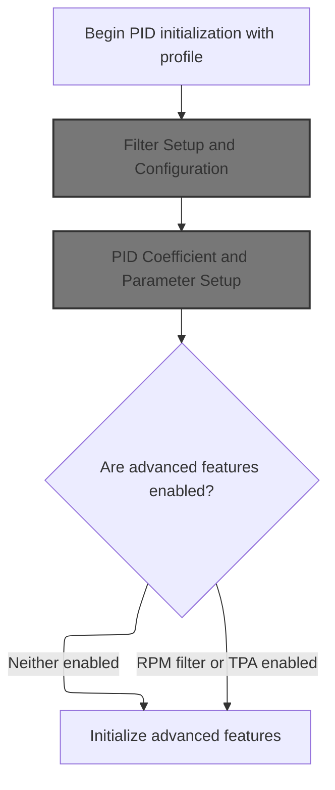
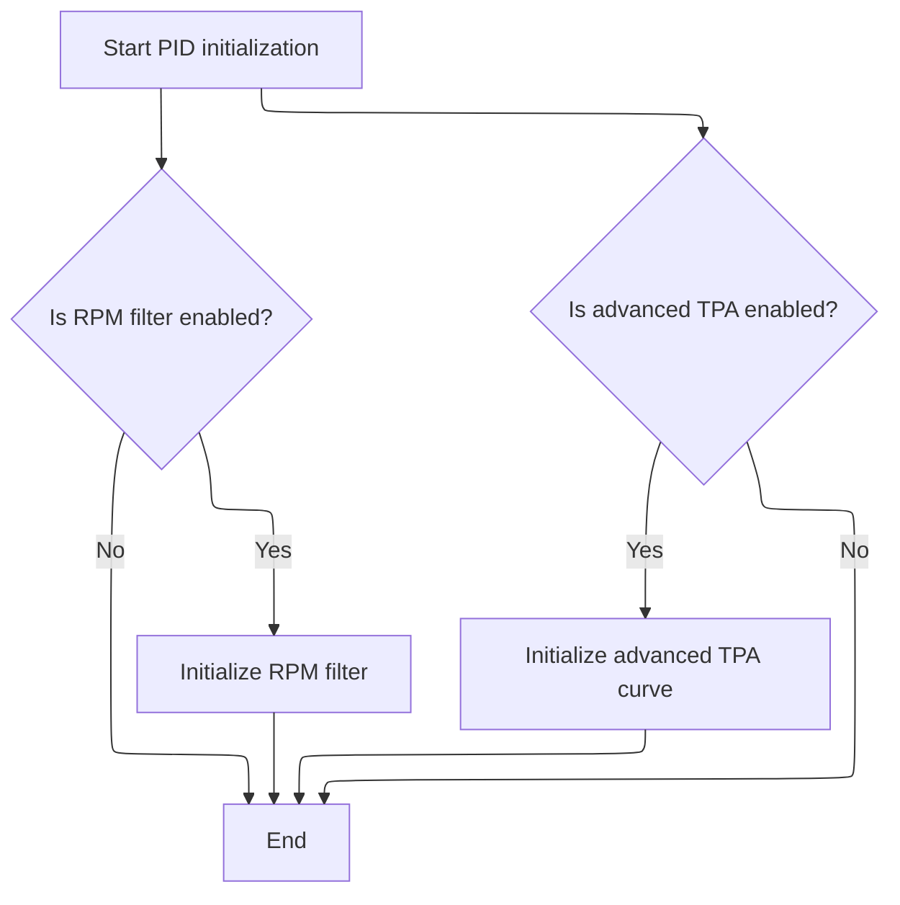

This document outlines the process of initializing the PID controller for flight control. The flow takes a PID profile and system configuration as input, sets up filters, configures runtime parameters, and applies PID coefficients for each axis. The result is a fully configured PID controller ready for stable and responsive flight.

# Where is this flow used?

This flow is used multiple times in the codebase as represented in the following diagram:

(Note - these are only some of the entry points of this flow)

```mermaid
graph TD;
      d1df77f46edb7ba53fd1ee9f5e3e3e09bf41c126efa00f803e7ef27ba6822187(src/…/rx/crsf.c::handleCrsfTelemetry) --> 2a9eead2fa4dea1b5997a908cb617060894d63839fe10f344d6d08e413c0d658(src/…/rx/crsf.c::handleCrsfMspFrameBuffer)

2a9eead2fa4dea1b5997a908cb617060894d63839fe10f344d6d08e413c0d658(src/…/rx/crsf.c::handleCrsfMspFrameBuffer) --> 30c2306f6823485ed1f046818e4de289d218223f54ae9106480a788a633085ef(src/…/telemetry/msp_shared.c::handleMspFrame)

30c2306f6823485ed1f046818e4de289d218223f54ae9106480a788a633085ef(src/…/telemetry/msp_shared.c::handleMspFrame) --> 0c88024691769d2e76583e5fc5086307cc549a145b35c9c7aac50d07ffdef4cf(src/…/telemetry/msp_shared.c::processMspPacket)

0c88024691769d2e76583e5fc5086307cc549a145b35c9c7aac50d07ffdef4cf(src/…/telemetry/msp_shared.c::processMspPacket) --> 1d52e29d7b0ff26f6b35db1ac28fe1e0b61ad8cec8f2d4435ecabdeef3569e47(src/…/msp/msp.c::mspFcProcessCommand)

1d52e29d7b0ff26f6b35db1ac28fe1e0b61ad8cec8f2d4435ecabdeef3569e47(src/…/msp/msp.c::mspFcProcessCommand) --> f6536d47de5289ca6fb3f6c9404b9df639768b9ac8b450d2a76111839ce7c49f(src/…/msp/msp.c::mspCommonProcessInCommand)

1d52e29d7b0ff26f6b35db1ac28fe1e0b61ad8cec8f2d4435ecabdeef3569e47(src/…/msp/msp.c::mspFcProcessCommand) --> 2082f5a72ade5ba0b490a833df92491168b5d150e8d17969aa63eb8f23a919f7(src/…/msp/msp.c::mspFcProcessOutCommandWithArg)

f6536d47de5289ca6fb3f6c9404b9df639768b9ac8b450d2a76111839ce7c49f(src/…/msp/msp.c::mspCommonProcessInCommand) --> f887bdb16c413173f1f8e5dddcac782fd5f9e5de8b04fefeb4463c7a5e91dcf4(src/…/msp/msp.c::mspProcessInCommand)

f887bdb16c413173f1f8e5dddcac782fd5f9e5de8b04fefeb4463c7a5e91dcf4(src/…/msp/msp.c::mspProcessInCommand) --> 0689c57b0f75213f7377f2e5bdd0c8f0779d1e2a33ba7786d9426613bd863277(src/…/msp/msp.c::writeReadEeprom)

f887bdb16c413173f1f8e5dddcac782fd5f9e5de8b04fefeb4463c7a5e91dcf4(src/…/msp/msp.c::mspProcessInCommand) --> f2885153aeafb1fbf9dc36906c93a8fcf2923c683930e655a5caac8d02f202d9(src/…/config/config.c::changePidProfile)

0689c57b0f75213f7377f2e5bdd0c8f0779d1e2a33ba7786d9426613bd863277(src/…/msp/msp.c::writeReadEeprom) --> f2d3ff35ccf2365fa58d6ff7c2d69c1420854715ab5bf32540acdaab5aa54b53(src/…/config/config.c::readEEPROM)

f2d3ff35ccf2365fa58d6ff7c2d69c1420854715ab5bf32540acdaab5aa54b53(src/…/config/config.c::readEEPROM) --> b27a48a30b9bcd9222228b804bda593c49b83abf23d44689332910f56e74cacd(src/…/config/config.c::activateConfig)

b27a48a30b9bcd9222228b804bda593c49b83abf23d44689332910f56e74cacd(src/…/config/config.c::activateConfig) --> 6d0bff0514a1ff6e50876112e157efe7690f18cc680af5006b163466598a1a76(src/…/flight/pid_init.c::pidInit):::mainFlowStyle

f2885153aeafb1fbf9dc36906c93a8fcf2923c683930e655a5caac8d02f202d9(src/…/config/config.c::changePidProfile) --> 6d0bff0514a1ff6e50876112e157efe7690f18cc680af5006b163466598a1a76(src/…/flight/pid_init.c::pidInit):::mainFlowStyle

2082f5a72ade5ba0b490a833df92491168b5d150e8d17969aa63eb8f23a919f7(src/…/msp/msp.c::mspFcProcessOutCommandWithArg) --> 1d52e29d7b0ff26f6b35db1ac28fe1e0b61ad8cec8f2d4435ecabdeef3569e47(src/…/msp/msp.c::mspFcProcessCommand)

032d2f74c9df1239f5bf90d41b5084bf50abac82291ebe50753310120c344bf8(src/…/fc/init.c::init) --> 69775828b40598b3ab409d4de4ddc3c8c773b193b57adb29a9adad6110a8e389(src/…/rx/spektrum.c::spektrumBind)

032d2f74c9df1239f5bf90d41b5084bf50abac82291ebe50753310120c344bf8(src/…/fc/init.c::init) --> f2d3ff35ccf2365fa58d6ff7c2d69c1420854715ab5bf32540acdaab5aa54b53(src/…/config/config.c::readEEPROM)

032d2f74c9df1239f5bf90d41b5084bf50abac82291ebe50753310120c344bf8(src/…/fc/init.c::init) --> 6d0bff0514a1ff6e50876112e157efe7690f18cc680af5006b163466598a1a76(src/…/flight/pid_init.c::pidInit):::mainFlowStyle

69775828b40598b3ab409d4de4ddc3c8c773b193b57adb29a9adad6110a8e389(src/…/rx/spektrum.c::spektrumBind) --> 332cac31580c6f6c05fae27eda5b545e51a506cdc2cde153b73695c971e49964(src/…/config/config.c::saveConfigAndNotify)

332cac31580c6f6c05fae27eda5b545e51a506cdc2cde153b73695c971e49964(src/…/config/config.c::saveConfigAndNotify) --> f2d3ff35ccf2365fa58d6ff7c2d69c1420854715ab5bf32540acdaab5aa54b53(src/…/config/config.c::readEEPROM)

e53e2bdf2382c26611cd00f901e2cc9f4362831479614e4dd3ef9213daf13804(src/…/rx/ghst.c::ghstProcessFrame) --> 30c2306f6823485ed1f046818e4de289d218223f54ae9106480a788a633085ef(src/…/telemetry/msp_shared.c::handleMspFrame)

97918e046f19f4acb4087bf85f8a4b60e247d7a6f0d460979ddf62030aa96ea2(src/…/fc/tasks.c::taskUpdateRxMain) --> 0d07a2605be6723b1ede709f1116bf3dc1a8df96cda7e53c5811eaf2b762766f(src/…/fc/core.c::processRxModes)

0d07a2605be6723b1ede709f1116bf3dc1a8df96cda7e53c5811eaf2b762766f(src/…/fc/core.c::processRxModes) --> ab48974b8207cb78ac2cb5c1ae6c8ff954d3b0b8c084ac0ae11e5a882cba6a6e(src/…/fc/rc_controls.c::processRcStickPositions)

0d07a2605be6723b1ede709f1116bf3dc1a8df96cda7e53c5811eaf2b762766f(src/…/fc/core.c::processRxModes) --> 0ac3e4adb2e6186307f91d2cbc7d0b0cb42d0a022ac6d07128143f4ef85c64b9(src/…/io/vtx_control.c::handleVTXControlButton)

ab48974b8207cb78ac2cb5c1ae6c8ff954d3b0b8c084ac0ae11e5a882cba6a6e(src/…/fc/rc_controls.c::processRcStickPositions) --> 332cac31580c6f6c05fae27eda5b545e51a506cdc2cde153b73695c971e49964(src/…/config/config.c::saveConfigAndNotify)

ab48974b8207cb78ac2cb5c1ae6c8ff954d3b0b8c084ac0ae11e5a882cba6a6e(src/…/fc/rc_controls.c::processRcStickPositions) --> f2885153aeafb1fbf9dc36906c93a8fcf2923c683930e655a5caac8d02f202d9(src/…/config/config.c::changePidProfile)

0ac3e4adb2e6186307f91d2cbc7d0b0cb42d0a022ac6d07128143f4ef85c64b9(src/…/io/vtx_control.c::handleVTXControlButton) --> 332cac31580c6f6c05fae27eda5b545e51a506cdc2cde153b73695c971e49964(src/…/config/config.c::saveConfigAndNotify)

ac696f8eb3a2676d424d052ef58f672907eb495255f639a351bb79f832df7635(src/…/cli/cli.c::cliDump) --> 477262cc8a7c8410ccbbd6345086712be03bd88f506ec28817cfc02a4e9dcca3(src/…/cli/cli.c::printConfig)

477262cc8a7c8410ccbbd6345086712be03bd88f506ec28817cfc02a4e9dcca3(src/…/cli/cli.c::printConfig) --> e0286009f292e759938336a7486f392e47c8980fea1dcbe1e416125a68ac3495(src/…/cli/cli.c::cliDumpPidProfile)

477262cc8a7c8410ccbbd6345086712be03bd88f506ec28817cfc02a4e9dcca3(src/…/cli/cli.c::printConfig) --> f1462c05074a1f5c0ee8f476e48d9bb25c9683d2b8d1a8810a3d98ec3d0823e1(src/…/cli/cli.c::cliProfile)

e0286009f292e759938336a7486f392e47c8980fea1dcbe1e416125a68ac3495(src/…/cli/cli.c::cliDumpPidProfile) --> f1462c05074a1f5c0ee8f476e48d9bb25c9683d2b8d1a8810a3d98ec3d0823e1(src/…/cli/cli.c::cliProfile)

f1462c05074a1f5c0ee8f476e48d9bb25c9683d2b8d1a8810a3d98ec3d0823e1(src/…/cli/cli.c::cliProfile) --> f2885153aeafb1fbf9dc36906c93a8fcf2923c683930e655a5caac8d02f202d9(src/…/config/config.c::changePidProfile)

f1462c05074a1f5c0ee8f476e48d9bb25c9683d2b8d1a8810a3d98ec3d0823e1(src/…/cli/cli.c::cliProfile) --> f1462c05074a1f5c0ee8f476e48d9bb25c9683d2b8d1a8810a3d98ec3d0823e1(src/…/cli/cli.c::cliProfile)


classDef mainFlowStyle color:#000000,fill:#7CB9F4
classDef rootsStyle color:#000000,fill:#00FFF4
classDef Style1 color:#000000,fill:#00FFAA
classDef Style2 color:#000000,fill:#FFFF00
classDef Style3 color:#000000,fill:#AA7CB9

%% Swimm:
%% graph TD;
%%       d1df77f46edb7ba53fd1ee9f5e3e3e09bf41c126efa00f803e7ef27ba6822187(<SwmPath>[src/…/rx/crsf.c](src/main/rx/crsf.c)</SwmPath>::handleCrsfTelemetry) --> 2a9eead2fa4dea1b5997a908cb617060894d63839fe10f344d6d08e413c0d658(<SwmPath>[src/…/rx/crsf.c](src/main/rx/crsf.c)</SwmPath>::handleCrsfMspFrameBuffer)
%% 
%% 2a9eead2fa4dea1b5997a908cb617060894d63839fe10f344d6d08e413c0d658(<SwmPath>[src/…/rx/crsf.c](src/main/rx/crsf.c)</SwmPath>::handleCrsfMspFrameBuffer) --> 30c2306f6823485ed1f046818e4de289d218223f54ae9106480a788a633085ef(<SwmPath>[src/…/telemetry/msp_shared.c](src/main/telemetry/msp_shared.c)</SwmPath>::handleMspFrame)
%% 
%% 30c2306f6823485ed1f046818e4de289d218223f54ae9106480a788a633085ef(<SwmPath>[src/…/telemetry/msp_shared.c](src/main/telemetry/msp_shared.c)</SwmPath>::handleMspFrame) --> 0c88024691769d2e76583e5fc5086307cc549a145b35c9c7aac50d07ffdef4cf(<SwmPath>[src/…/telemetry/msp_shared.c](src/main/telemetry/msp_shared.c)</SwmPath>::processMspPacket)
%% 
%% 0c88024691769d2e76583e5fc5086307cc549a145b35c9c7aac50d07ffdef4cf(<SwmPath>[src/…/telemetry/msp_shared.c](src/main/telemetry/msp_shared.c)</SwmPath>::processMspPacket) --> 1d52e29d7b0ff26f6b35db1ac28fe1e0b61ad8cec8f2d4435ecabdeef3569e47(<SwmPath>[src/…/msp/msp.c](src/main/msp/msp.c)</SwmPath>::mspFcProcessCommand)
%% 
%% 1d52e29d7b0ff26f6b35db1ac28fe1e0b61ad8cec8f2d4435ecabdeef3569e47(<SwmPath>[src/…/msp/msp.c](src/main/msp/msp.c)</SwmPath>::mspFcProcessCommand) --> f6536d47de5289ca6fb3f6c9404b9df639768b9ac8b450d2a76111839ce7c49f(<SwmPath>[src/…/msp/msp.c](src/main/msp/msp.c)</SwmPath>::mspCommonProcessInCommand)
%% 
%% 1d52e29d7b0ff26f6b35db1ac28fe1e0b61ad8cec8f2d4435ecabdeef3569e47(<SwmPath>[src/…/msp/msp.c](src/main/msp/msp.c)</SwmPath>::mspFcProcessCommand) --> 2082f5a72ade5ba0b490a833df92491168b5d150e8d17969aa63eb8f23a919f7(<SwmPath>[src/…/msp/msp.c](src/main/msp/msp.c)</SwmPath>::mspFcProcessOutCommandWithArg)
%% 
%% f6536d47de5289ca6fb3f6c9404b9df639768b9ac8b450d2a76111839ce7c49f(<SwmPath>[src/…/msp/msp.c](src/main/msp/msp.c)</SwmPath>::mspCommonProcessInCommand) --> f887bdb16c413173f1f8e5dddcac782fd5f9e5de8b04fefeb4463c7a5e91dcf4(<SwmPath>[src/…/msp/msp.c](src/main/msp/msp.c)</SwmPath>::mspProcessInCommand)
%% 
%% f887bdb16c413173f1f8e5dddcac782fd5f9e5de8b04fefeb4463c7a5e91dcf4(<SwmPath>[src/…/msp/msp.c](src/main/msp/msp.c)</SwmPath>::mspProcessInCommand) --> 0689c57b0f75213f7377f2e5bdd0c8f0779d1e2a33ba7786d9426613bd863277(<SwmPath>[src/…/msp/msp.c](src/main/msp/msp.c)</SwmPath>::writeReadEeprom)
%% 
%% f887bdb16c413173f1f8e5dddcac782fd5f9e5de8b04fefeb4463c7a5e91dcf4(<SwmPath>[src/…/msp/msp.c](src/main/msp/msp.c)</SwmPath>::mspProcessInCommand) --> f2885153aeafb1fbf9dc36906c93a8fcf2923c683930e655a5caac8d02f202d9(<SwmPath>[src/…/config/config.c](src/main/config/config.c)</SwmPath>::changePidProfile)
%% 
%% 0689c57b0f75213f7377f2e5bdd0c8f0779d1e2a33ba7786d9426613bd863277(<SwmPath>[src/…/msp/msp.c](src/main/msp/msp.c)</SwmPath>::writeReadEeprom) --> f2d3ff35ccf2365fa58d6ff7c2d69c1420854715ab5bf32540acdaab5aa54b53(<SwmPath>[src/…/config/config.c](src/main/config/config.c)</SwmPath>::readEEPROM)
%% 
%% f2d3ff35ccf2365fa58d6ff7c2d69c1420854715ab5bf32540acdaab5aa54b53(<SwmPath>[src/…/config/config.c](src/main/config/config.c)</SwmPath>::readEEPROM) --> b27a48a30b9bcd9222228b804bda593c49b83abf23d44689332910f56e74cacd(<SwmPath>[src/…/config/config.c](src/main/config/config.c)</SwmPath>::activateConfig)
%% 
%% b27a48a30b9bcd9222228b804bda593c49b83abf23d44689332910f56e74cacd(<SwmPath>[src/…/config/config.c](src/main/config/config.c)</SwmPath>::activateConfig) --> 6d0bff0514a1ff6e50876112e157efe7690f18cc680af5006b163466598a1a76(<SwmPath>[src/…/flight/pid_init.c](src/main/flight/pid_init.c)</SwmPath>::<SwmToken path="src/main/flight/pid_init.c" pos="379:2:2" line-data="void pidInit(const pidProfile_t *pidProfile)">`pidInit`</SwmToken>):::mainFlowStyle
%% 
%% f2885153aeafb1fbf9dc36906c93a8fcf2923c683930e655a5caac8d02f202d9(<SwmPath>[src/…/config/config.c](src/main/config/config.c)</SwmPath>::changePidProfile) --> 6d0bff0514a1ff6e50876112e157efe7690f18cc680af5006b163466598a1a76(<SwmPath>[src/…/flight/pid_init.c](src/main/flight/pid_init.c)</SwmPath>::<SwmToken path="src/main/flight/pid_init.c" pos="379:2:2" line-data="void pidInit(const pidProfile_t *pidProfile)">`pidInit`</SwmToken>):::mainFlowStyle
%% 
%% 2082f5a72ade5ba0b490a833df92491168b5d150e8d17969aa63eb8f23a919f7(<SwmPath>[src/…/msp/msp.c](src/main/msp/msp.c)</SwmPath>::mspFcProcessOutCommandWithArg) --> 1d52e29d7b0ff26f6b35db1ac28fe1e0b61ad8cec8f2d4435ecabdeef3569e47(<SwmPath>[src/…/msp/msp.c](src/main/msp/msp.c)</SwmPath>::mspFcProcessCommand)
%% 
%% 032d2f74c9df1239f5bf90d41b5084bf50abac82291ebe50753310120c344bf8(<SwmPath>[src/…/fc/init.c](src/main/fc/init.c)</SwmPath>::init) --> 69775828b40598b3ab409d4de4ddc3c8c773b193b57adb29a9adad6110a8e389(<SwmPath>[src/…/rx/spektrum.c](src/main/rx/spektrum.c)</SwmPath>::spektrumBind)
%% 
%% 032d2f74c9df1239f5bf90d41b5084bf50abac82291ebe50753310120c344bf8(<SwmPath>[src/…/fc/init.c](src/main/fc/init.c)</SwmPath>::init) --> f2d3ff35ccf2365fa58d6ff7c2d69c1420854715ab5bf32540acdaab5aa54b53(<SwmPath>[src/…/config/config.c](src/main/config/config.c)</SwmPath>::readEEPROM)
%% 
%% 032d2f74c9df1239f5bf90d41b5084bf50abac82291ebe50753310120c344bf8(<SwmPath>[src/…/fc/init.c](src/main/fc/init.c)</SwmPath>::init) --> 6d0bff0514a1ff6e50876112e157efe7690f18cc680af5006b163466598a1a76(<SwmPath>[src/…/flight/pid_init.c](src/main/flight/pid_init.c)</SwmPath>::<SwmToken path="src/main/flight/pid_init.c" pos="379:2:2" line-data="void pidInit(const pidProfile_t *pidProfile)">`pidInit`</SwmToken>):::mainFlowStyle
%% 
%% 69775828b40598b3ab409d4de4ddc3c8c773b193b57adb29a9adad6110a8e389(<SwmPath>[src/…/rx/spektrum.c](src/main/rx/spektrum.c)</SwmPath>::spektrumBind) --> 332cac31580c6f6c05fae27eda5b545e51a506cdc2cde153b73695c971e49964(<SwmPath>[src/…/config/config.c](src/main/config/config.c)</SwmPath>::saveConfigAndNotify)
%% 
%% 332cac31580c6f6c05fae27eda5b545e51a506cdc2cde153b73695c971e49964(<SwmPath>[src/…/config/config.c](src/main/config/config.c)</SwmPath>::saveConfigAndNotify) --> f2d3ff35ccf2365fa58d6ff7c2d69c1420854715ab5bf32540acdaab5aa54b53(<SwmPath>[src/…/config/config.c](src/main/config/config.c)</SwmPath>::readEEPROM)
%% 
%% e53e2bdf2382c26611cd00f901e2cc9f4362831479614e4dd3ef9213daf13804(<SwmPath>[src/…/rx/ghst.c](src/main/rx/ghst.c)</SwmPath>::ghstProcessFrame) --> 30c2306f6823485ed1f046818e4de289d218223f54ae9106480a788a633085ef(<SwmPath>[src/…/telemetry/msp_shared.c](src/main/telemetry/msp_shared.c)</SwmPath>::handleMspFrame)
%% 
%% 97918e046f19f4acb4087bf85f8a4b60e247d7a6f0d460979ddf62030aa96ea2(<SwmPath>[src/…/fc/tasks.c](src/main/fc/tasks.c)</SwmPath>::taskUpdateRxMain) --> 0d07a2605be6723b1ede709f1116bf3dc1a8df96cda7e53c5811eaf2b762766f(<SwmPath>[src/…/fc/core.c](src/main/fc/core.c)</SwmPath>::processRxModes)
%% 
%% 0d07a2605be6723b1ede709f1116bf3dc1a8df96cda7e53c5811eaf2b762766f(<SwmPath>[src/…/fc/core.c](src/main/fc/core.c)</SwmPath>::processRxModes) --> ab48974b8207cb78ac2cb5c1ae6c8ff954d3b0b8c084ac0ae11e5a882cba6a6e(<SwmPath>[src/…/fc/rc_controls.c](src/main/fc/rc_controls.c)</SwmPath>::processRcStickPositions)
%% 
%% 0d07a2605be6723b1ede709f1116bf3dc1a8df96cda7e53c5811eaf2b762766f(<SwmPath>[src/…/fc/core.c](src/main/fc/core.c)</SwmPath>::processRxModes) --> 0ac3e4adb2e6186307f91d2cbc7d0b0cb42d0a022ac6d07128143f4ef85c64b9(<SwmPath>[src/…/io/vtx_control.c](src/main/io/vtx_control.c)</SwmPath>::handleVTXControlButton)
%% 
%% ab48974b8207cb78ac2cb5c1ae6c8ff954d3b0b8c084ac0ae11e5a882cba6a6e(<SwmPath>[src/…/fc/rc_controls.c](src/main/fc/rc_controls.c)</SwmPath>::processRcStickPositions) --> 332cac31580c6f6c05fae27eda5b545e51a506cdc2cde153b73695c971e49964(<SwmPath>[src/…/config/config.c](src/main/config/config.c)</SwmPath>::saveConfigAndNotify)
%% 
%% ab48974b8207cb78ac2cb5c1ae6c8ff954d3b0b8c084ac0ae11e5a882cba6a6e(<SwmPath>[src/…/fc/rc_controls.c](src/main/fc/rc_controls.c)</SwmPath>::processRcStickPositions) --> f2885153aeafb1fbf9dc36906c93a8fcf2923c683930e655a5caac8d02f202d9(<SwmPath>[src/…/config/config.c](src/main/config/config.c)</SwmPath>::changePidProfile)
%% 
%% 0ac3e4adb2e6186307f91d2cbc7d0b0cb42d0a022ac6d07128143f4ef85c64b9(<SwmPath>[src/…/io/vtx_control.c](src/main/io/vtx_control.c)</SwmPath>::handleVTXControlButton) --> 332cac31580c6f6c05fae27eda5b545e51a506cdc2cde153b73695c971e49964(<SwmPath>[src/…/config/config.c](src/main/config/config.c)</SwmPath>::saveConfigAndNotify)
%% 
%% ac696f8eb3a2676d424d052ef58f672907eb495255f639a351bb79f832df7635(<SwmPath>[src/…/cli/cli.c](src/main/cli/cli.c)</SwmPath>::cliDump) --> 477262cc8a7c8410ccbbd6345086712be03bd88f506ec28817cfc02a4e9dcca3(<SwmPath>[src/…/cli/cli.c](src/main/cli/cli.c)</SwmPath>::printConfig)
%% 
%% 477262cc8a7c8410ccbbd6345086712be03bd88f506ec28817cfc02a4e9dcca3(<SwmPath>[src/…/cli/cli.c](src/main/cli/cli.c)</SwmPath>::printConfig) --> e0286009f292e759938336a7486f392e47c8980fea1dcbe1e416125a68ac3495(<SwmPath>[src/…/cli/cli.c](src/main/cli/cli.c)</SwmPath>::cliDumpPidProfile)
%% 
%% 477262cc8a7c8410ccbbd6345086712be03bd88f506ec28817cfc02a4e9dcca3(<SwmPath>[src/…/cli/cli.c](src/main/cli/cli.c)</SwmPath>::printConfig) --> f1462c05074a1f5c0ee8f476e48d9bb25c9683d2b8d1a8810a3d98ec3d0823e1(<SwmPath>[src/…/cli/cli.c](src/main/cli/cli.c)</SwmPath>::cliProfile)
%% 
%% e0286009f292e759938336a7486f392e47c8980fea1dcbe1e416125a68ac3495(<SwmPath>[src/…/cli/cli.c](src/main/cli/cli.c)</SwmPath>::cliDumpPidProfile) --> f1462c05074a1f5c0ee8f476e48d9bb25c9683d2b8d1a8810a3d98ec3d0823e1(<SwmPath>[src/…/cli/cli.c](src/main/cli/cli.c)</SwmPath>::cliProfile)
%% 
%% f1462c05074a1f5c0ee8f476e48d9bb25c9683d2b8d1a8810a3d98ec3d0823e1(<SwmPath>[src/…/cli/cli.c](src/main/cli/cli.c)</SwmPath>::cliProfile) --> f2885153aeafb1fbf9dc36906c93a8fcf2923c683930e655a5caac8d02f202d9(<SwmPath>[src/…/config/config.c](src/main/config/config.c)</SwmPath>::changePidProfile)
%% 
%% f1462c05074a1f5c0ee8f476e48d9bb25c9683d2b8d1a8810a3d98ec3d0823e1(<SwmPath>[src/…/cli/cli.c](src/main/cli/cli.c)</SwmPath>::cliProfile) --> f1462c05074a1f5c0ee8f476e48d9bb25c9683d2b8d1a8810a3d98ec3d0823e1(<SwmPath>[src/…/cli/cli.c](src/main/cli/cli.c)</SwmPath>::cliProfile)
%% 
%% 
%% classDef mainFlowStyle color:#000000,fill:#7CB9F4
%% classDef rootsStyle color:#000000,fill:#00FFF4
%% classDef Style1 color:#000000,fill:#00FFAA
%% classDef Style2 color:#000000,fill:#FFFF00
%% classDef Style3 color:#000000,fill:#AA7CB9
```

# PID Initialization Entry Point



<SwmSnippet path="/src/main/flight/pid_init.c" line="379">

---

In <SwmToken path="src/main/flight/pid_init.c" pos="379:2:2" line-data="void pidInit(const pidProfile_t *pidProfile)">`pidInit`</SwmToken>, we start by setting the PID looptime using the globally available <SwmToken path="src/main/flight/pid_init.c" pos="381:3:5" line-data="    pidSetTargetLooptime(gyro.targetLooptime); // Initialize pid looptime">`gyro.targetLooptime`</SwmToken>, which is assumed to be set up before this call. The function also assumes the <SwmToken path="src/main/flight/pid_init.c" pos="379:9:9" line-data="void pidInit(const pidProfile_t *pidProfile)">`pidProfile`</SwmToken> pointer is valid. Right after, it calls <SwmToken path="src/main/flight/pid_init.c" pos="382:1:1" line-data="    pidInitFilters(pidProfile);">`pidInitFilters`</SwmToken> to set up all the necessary filter functions and state, which is needed before any PID calculations can happen.

```c
void pidInit(const pidProfile_t *pidProfile)
{
    pidSetTargetLooptime(gyro.targetLooptime); // Initialize pid looptime
    pidInitFilters(pidProfile);
```

---

</SwmSnippet>

## Filter Setup and Configuration

```mermaid
%%{init: {"flowchart": {"defaultRenderer": "elk"}} }%%
flowchart TD
    node1["Start filter initialization"] --> node2{"Is PID looptime set?"}
    click node1 openCode "src/main/flight/pid_init.c:131:132"
    click node2 openCode "src/main/flight/pid_init.c:135:142"
    node2 -->|"No"| node3["Disable all filters"]
    click node3 openCode "src/main/flight/pid_init.c:137:141"
    node2 -->|"Yes"| node4["Check filter settings"]
    click node4 openCode "src/main/flight/pid_init.c:144:262"
    
    subgraph loop1["For each axis (roll, pitch, yaw): Initialize enabled filters"]
      node4 --> node5{"Is D-term notch filter enabled?"}
      click node5 openCode "src/main/flight/pid_init.c:147:155"
      node5 -->|"Yes"| node6["Initialize D-term notch filter"]
      click node6 openCode "src/main/flight/pid_init.c:158:162"
      node5 -->|"No"| node7["Skip D-term notch filter"]
      click node7 openCode "src/main/flight/pid_init.c:164:165"
      node6 --> node8{"Is D-term lowpass1 enabled?"}
      node7 --> node8
      click node8 openCode "src/main/flight/pid_init.c:176:213"
      node8 -->|"Yes"| node9["Initialize D-term lowpass1"]
      click node9 openCode "src/main/flight/pid_init.c:179:208"
      node8 -->|"No"| node10["Skip D-term lowpass1"]
      click node10 openCode "src/main/flight/pid_init.c:215:216"
      node9 --> node11{"Is D-term lowpass2 enabled?"}
      node10 --> node11
      click node11 openCode "src/main/flight/pid_init.c:219:252"
      node11 -->|"Yes"| node12["Initialize D-term lowpass2"]
      click node12 openCode "src/main/flight/pid_init.c:222:247"
      node11 -->|"No"| node13["Skip D-term lowpass2"]
      click node13 openCode "src/main/flight/pid_init.c:254:255"
      node12 --> node14{"Is yaw lowpass enabled?"}
      node13 --> node14
      click node14 openCode "src/main/flight/pid_init.c:257:262"
      node14 -->|"Yes"| node15["Initialize yaw lowpass"]
      click node15 openCode "src/main/flight/pid_init.c:260:261"
      node14 -->|"No"| node16["Skip yaw lowpass"]
      click node16 openCode "src/main/flight/pid_init.c:258:259"
    end
    node15 --> node17["Initialize optional feature filters"]
    node16 --> node17
    click node17 openCode "src/main/flight/pid_init.c:264:332"
    node17 --> node18["Finish"]
    click node18 openCode "src/main/flight/pid_init.c:332:332"

classDef HeadingStyle fill:#777777,stroke:#333,stroke-width:2px;

%% Swimm:
%% %%{init: {"flowchart": {"defaultRenderer": "elk"}} }%%
%% flowchart TD
%%     node1["Start filter initialization"] --> node2{"Is PID looptime set?"}
%%     click node1 openCode "<SwmPath>[src/…/flight/pid_init.c](src/main/flight/pid_init.c)</SwmPath>:131:132"
%%     click node2 openCode "<SwmPath>[src/…/flight/pid_init.c](src/main/flight/pid_init.c)</SwmPath>:135:142"
%%     node2 -->|"No"| node3["Disable all filters"]
%%     click node3 openCode "<SwmPath>[src/…/flight/pid_init.c](src/main/flight/pid_init.c)</SwmPath>:137:141"
%%     node2 -->|"Yes"| node4["Check filter settings"]
%%     click node4 openCode "<SwmPath>[src/…/flight/pid_init.c](src/main/flight/pid_init.c)</SwmPath>:144:262"
%%     
%%     subgraph loop1["For each axis (roll, pitch, yaw): Initialize enabled filters"]
%%       node4 --> node5{"Is D-term notch filter enabled?"}
%%       click node5 openCode "<SwmPath>[src/…/flight/pid_init.c](src/main/flight/pid_init.c)</SwmPath>:147:155"
%%       node5 -->|"Yes"| node6["Initialize D-term notch filter"]
%%       click node6 openCode "<SwmPath>[src/…/flight/pid_init.c](src/main/flight/pid_init.c)</SwmPath>:158:162"
%%       node5 -->|"No"| node7["Skip D-term notch filter"]
%%       click node7 openCode "<SwmPath>[src/…/flight/pid_init.c](src/main/flight/pid_init.c)</SwmPath>:164:165"
%%       node6 --> node8{"Is D-term lowpass1 enabled?"}
%%       node7 --> node8
%%       click node8 openCode "<SwmPath>[src/…/flight/pid_init.c](src/main/flight/pid_init.c)</SwmPath>:176:213"
%%       node8 -->|"Yes"| node9["Initialize D-term lowpass1"]
%%       click node9 openCode "<SwmPath>[src/…/flight/pid_init.c](src/main/flight/pid_init.c)</SwmPath>:179:208"
%%       node8 -->|"No"| node10["Skip D-term lowpass1"]
%%       click node10 openCode "<SwmPath>[src/…/flight/pid_init.c](src/main/flight/pid_init.c)</SwmPath>:215:216"
%%       node9 --> node11{"Is D-term lowpass2 enabled?"}
%%       node10 --> node11
%%       click node11 openCode "<SwmPath>[src/…/flight/pid_init.c](src/main/flight/pid_init.c)</SwmPath>:219:252"
%%       node11 -->|"Yes"| node12["Initialize D-term lowpass2"]
%%       click node12 openCode "<SwmPath>[src/…/flight/pid_init.c](src/main/flight/pid_init.c)</SwmPath>:222:247"
%%       node11 -->|"No"| node13["Skip D-term lowpass2"]
%%       click node13 openCode "<SwmPath>[src/…/flight/pid_init.c](src/main/flight/pid_init.c)</SwmPath>:254:255"
%%       node12 --> node14{"Is yaw lowpass enabled?"}
%%       node13 --> node14
%%       click node14 openCode "<SwmPath>[src/…/flight/pid_init.c](src/main/flight/pid_init.c)</SwmPath>:257:262"
%%       node14 -->|"Yes"| node15["Initialize yaw lowpass"]
%%       click node15 openCode "<SwmPath>[src/…/flight/pid_init.c](src/main/flight/pid_init.c)</SwmPath>:260:261"
%%       node14 -->|"No"| node16["Skip yaw lowpass"]
%%       click node16 openCode "<SwmPath>[src/…/flight/pid_init.c](src/main/flight/pid_init.c)</SwmPath>:258:259"
%%     end
%%     node15 --> node17["Initialize optional feature filters"]
%%     node16 --> node17
%%     click node17 openCode "<SwmPath>[src/…/flight/pid_init.c](src/main/flight/pid_init.c)</SwmPath>:264:332"
%%     node17 --> node18["Finish"]
%%     click node18 openCode "<SwmPath>[src/…/flight/pid_init.c](src/main/flight/pid_init.c)</SwmPath>:332:332"
%% 
%% classDef HeadingStyle fill:#777777,stroke:#333,stroke-width:2px;
```



<SwmSnippet path="/src/main/flight/pid_init.c" line="131">

---

In <SwmToken path="src/main/flight/pid_init.c" pos="131:2:2" line-data="void pidInitFilters(const pidProfile_t *pidProfile)">`pidInitFilters`</SwmToken>, we first check if the PID looptime is set. If not, all filter function pointers are nulled out. Otherwise, we calculate the Nyquist frequency, determine the notch filter frequency, and initialize the notch and lowpass filters for each axis based on the <SwmToken path="src/main/flight/pid_init.c" pos="131:9:9" line-data="void pidInitFilters(const pidProfile_t *pidProfile)">`pidProfile`</SwmToken> and compile-time flags. The function relies on repository-specific constants and expects all global state to be valid.

```c
void pidInitFilters(const pidProfile_t *pidProfile)
{
    STATIC_ASSERT(FD_YAW == 2, FD_YAW_incorrect); // ensure yaw axis is 2

    if (targetPidLooptime == 0) {
        // no looptime set, so set all the filters to null
        pidRuntime.dtermNotchApplyFn = nullFilterApply;
        pidRuntime.dtermLowpassApplyFn = nullFilterApply;
        pidRuntime.dtermLowpass2ApplyFn = nullFilterApply;
        pidRuntime.ptermYawLowpassApplyFn = nullFilterApply;
        return;
    }

    const uint32_t pidFrequencyNyquist = pidRuntime.pidFrequency / 2; // No rounding needed

    uint16_t dTermNotchHz;
    if (pidProfile->dterm_notch_hz <= pidFrequencyNyquist) {
        dTermNotchHz = pidProfile->dterm_notch_hz;
    } else {
        if (pidProfile->dterm_notch_cutoff < pidFrequencyNyquist) {
            dTermNotchHz = pidFrequencyNyquist;
        } else {
            dTermNotchHz = 0;
        }
    }

    if (dTermNotchHz != 0 && pidProfile->dterm_notch_cutoff != 0) {
        pidRuntime.dtermNotchApplyFn = (filterApplyFnPtr)biquadFilterApply;
        const float notchQ = filterGetNotchQ(dTermNotchHz, pidProfile->dterm_notch_cutoff);
        for (int axis = FD_ROLL; axis <= FD_YAW; axis++) {
            biquadFilterInit(&pidRuntime.dtermNotch[axis], dTermNotchHz, targetPidLooptime, notchQ, FILTER_NOTCH, 1.0f);
        }
```

---

</SwmSnippet>

<SwmSnippet path="/src/main/flight/pid_init.c" line="164">

---

After setting up the notch filter (or disabling it), we move on to initializing the first D-term lowpass filter. The filter type and frequency are chosen based on the <SwmToken path="src/main/flight/pid_init.c" pos="168:7:7" line-data="    uint16_t dterm_lpf1_init_hz = pidProfile-&gt;dterm_lpf1_static_hz;">`pidProfile`</SwmToken> and possibly dynamic lowpass settings. Each axis gets its own filter instance.

```c
        pidRuntime.dtermNotchApplyFn = nullFilterApply;
    }

    //1st Dterm Lowpass Filter
    uint16_t dterm_lpf1_init_hz = pidProfile->dterm_lpf1_static_hz;

#ifdef USE_DYN_LPF
    if (pidProfile->dterm_lpf1_dyn_min_hz) {
        dterm_lpf1_init_hz = pidProfile->dterm_lpf1_dyn_min_hz;
    }
#endif

    if (dterm_lpf1_init_hz > 0) {
        switch (pidProfile->dterm_lpf1_type) {
        case FILTER_PT1:
            pidRuntime.dtermLowpassApplyFn = (filterApplyFnPtr)pt1FilterApply;
            for (int axis = FD_ROLL; axis <= FD_YAW; axis++) {
                pt1FilterInit(&pidRuntime.dtermLowpass[axis].pt1Filter, pt1FilterGain(dterm_lpf1_init_hz, pidRuntime.dT));
            }
```

---

</SwmSnippet>

<SwmSnippet path="/src/main/flight/pid_init.c" line="184">

---

This part handles the biquad filter option for the first D-term lowpass. If the frequency is valid, it sets up the filter for each axis; otherwise, it disables the filter by setting the function pointer to null.

```c
        case FILTER_BIQUAD:
            if (pidProfile->dterm_lpf1_static_hz < pidFrequencyNyquist) {
#ifdef USE_DYN_LPF
                pidRuntime.dtermLowpassApplyFn = (filterApplyFnPtr)biquadFilterApplyDF1;
#else
                pidRuntime.dtermLowpassApplyFn = (filterApplyFnPtr)biquadFilterApply;
#endif
                for (int axis = FD_ROLL; axis <= FD_YAW; axis++) {
                    biquadFilterInitLPF(&pidRuntime.dtermLowpass[axis].biquadFilter, dterm_lpf1_init_hz, targetPidLooptime);
                }
```

---

</SwmSnippet>

<SwmSnippet path="/src/main/flight/pid_init.c" line="195">

---

This section covers the <SwmToken path="src/main/flight/pid_init.c" pos="53:9:9" line-data="#define D_MAX_RANGE_HZ 85    // PT2 lowpass input cutoff to peak D around propwash frequencies">`PT2`</SwmToken> filter option for the first D-term lowpass. It sets up the filter for each axis if selected in the profile.

```c
                pidRuntime.dtermLowpassApplyFn = nullFilterApply;
            }
            break;
        case FILTER_PT2:
            pidRuntime.dtermLowpassApplyFn = (filterApplyFnPtr)pt2FilterApply;
            for (int axis = FD_ROLL; axis <= FD_YAW; axis++) {
                pt2FilterInit(&pidRuntime.dtermLowpass[axis].pt2Filter, pt2FilterGain(dterm_lpf1_init_hz, pidRuntime.dT));
            }
```

---

</SwmSnippet>

<SwmSnippet path="/src/main/flight/pid_init.c" line="204">

---

This part sets up the PT3 filter for the first D-term lowpass if that's what's selected in the profile, again for each axis.

```c
        case FILTER_PT3:
            pidRuntime.dtermLowpassApplyFn = (filterApplyFnPtr)pt3FilterApply;
            for (int axis = FD_ROLL; axis <= FD_YAW; axis++) {
                pt3FilterInit(&pidRuntime.dtermLowpass[axis].pt3Filter, pt3FilterGain(dterm_lpf1_init_hz, pidRuntime.dT));
            }
```

---

</SwmSnippet>

<SwmSnippet path="/src/main/flight/pid_init.c" line="210">

---

If the filter type isn't recognized or the frequency is zero, we just disable the first D-term lowpass filter. Then we move on to the second D-term lowpass filter setup.

```c
        default:
            pidRuntime.dtermLowpassApplyFn = nullFilterApply;
            break;
        }
    } else {
        pidRuntime.dtermLowpassApplyFn = nullFilterApply;
    }

    //2nd Dterm Lowpass Filter
    if (pidProfile->dterm_lpf2_static_hz > 0) {
        switch (pidProfile->dterm_lpf2_type) {
        case FILTER_PT1:
            pidRuntime.dtermLowpass2ApplyFn = (filterApplyFnPtr)pt1FilterApply;
            for (int axis = FD_ROLL; axis <= FD_YAW; axis++) {
                pt1FilterInit(&pidRuntime.dtermLowpass2[axis].pt1Filter, pt1FilterGain(pidProfile->dterm_lpf2_static_hz, pidRuntime.dT));
            }
```

---

</SwmSnippet>

<SwmSnippet path="/src/main/flight/pid_init.c" line="227">

---

This block sets up the second D-term lowpass filter, starting with the PT1 type if enabled in the profile, for each axis.

```c
        case FILTER_BIQUAD:
            if (pidProfile->dterm_lpf2_static_hz < pidFrequencyNyquist) {
                pidRuntime.dtermLowpass2ApplyFn = (filterApplyFnPtr)biquadFilterApply;
                for (int axis = FD_ROLL; axis <= FD_YAW; axis++) {
                    biquadFilterInitLPF(&pidRuntime.dtermLowpass2[axis].biquadFilter, pidProfile->dterm_lpf2_static_hz, targetPidLooptime);
                }
```

---

</SwmSnippet>

<SwmSnippet path="/src/main/flight/pid_init.c" line="234">

---

This part handles the biquad filter for the second D-term lowpass. If the frequency is valid, it sets up the filter for each axis; otherwise, it disables the filter.

```c
                pidRuntime.dtermLowpassApplyFn = nullFilterApply;
            }
            break;
        case FILTER_PT2:
            pidRuntime.dtermLowpass2ApplyFn = (filterApplyFnPtr)pt2FilterApply;
            for (int axis = FD_ROLL; axis <= FD_YAW; axis++) {
                pt2FilterInit(&pidRuntime.dtermLowpass2[axis].pt2Filter, pt2FilterGain(pidProfile->dterm_lpf2_static_hz, pidRuntime.dT));
            }
```

---

</SwmSnippet>

<SwmSnippet path="/src/main/flight/pid_init.c" line="243">

---

This section sets up the <SwmToken path="src/main/flight/pid_init.c" pos="53:9:9" line-data="#define D_MAX_RANGE_HZ 85    // PT2 lowpass input cutoff to peak D around propwash frequencies">`PT2`</SwmToken> filter for the second D-term lowpass if that's what's selected in the profile, for each axis.

```c
        case FILTER_PT3:
            pidRuntime.dtermLowpass2ApplyFn = (filterApplyFnPtr)pt3FilterApply;
            for (int axis = FD_ROLL; axis <= FD_YAW; axis++) {
                pt3FilterInit(&pidRuntime.dtermLowpass2[axis].pt3Filter, pt3FilterGain(pidProfile->dterm_lpf2_static_hz, pidRuntime.dT));
            }
```

---

</SwmSnippet>

<SwmSnippet path="/src/main/flight/pid_init.c" line="249">

---

This part sets up the PT3 filter for the second D-term lowpass if that's what's selected in the profile, for each axis.

```c
        default:
            pidRuntime.dtermLowpass2ApplyFn = nullFilterApply;
            break;
        }
    } else {
        pidRuntime.dtermLowpass2ApplyFn = nullFilterApply;
    }

    if (pidProfile->yaw_lowpass_hz == 0) {
        pidRuntime.ptermYawLowpassApplyFn = nullFilterApply;
    } else {
        pidRuntime.ptermYawLowpassApplyFn = (filterApplyFnPtr)pt1FilterApply;
        pt1FilterInit(&pidRuntime.ptermYawLowpass, pt1FilterGain(pidProfile->yaw_lowpass_hz, pidRuntime.dT));
    }

#if defined(USE_THROTTLE_BOOST)
    pt1FilterInit(&throttleLpf, pt1FilterGain(pidProfile->throttle_boost_cutoff, pidRuntime.dT));
#endif

#if defined(USE_ITERM_RELAX)
    if (pidRuntime.itermRelax) {
        for (int i = 0; i < XYZ_AXIS_COUNT; i++) {
            pt1FilterInit(&pidRuntime.windupLpf[i], pt1FilterGain(pidRuntime.itermRelaxCutoff, pidRuntime.dT));
        }
```

---

</SwmSnippet>

<SwmSnippet path="/src/main/flight/pid_init.c" line="277">

---

If <SwmToken path="src/main/flight/pid_init.c" pos="277:6:6" line-data="    if (pidRuntime.itermRelax) {">`itermRelax`</SwmToken> is enabled, we set up additional lowpass filters for windup and <SwmToken path="src/main/flight/pid_init.c" pos="279:6:6" line-data="            pt1FilterInit(&amp;pidRuntime.acLpf[i], pt1FilterGain(pidRuntime.acCutoff, pidRuntime.dT));">`acLpf`</SwmToken> on all axes. This is only done if the feature is active.

```c
    if (pidRuntime.itermRelax) {
        for (int i = 0; i < XYZ_AXIS_COUNT; i++) {
            pt1FilterInit(&pidRuntime.acLpf[i], pt1FilterGain(pidRuntime.acCutoff, pidRuntime.dT));
        }
```

---

</SwmSnippet>

<SwmSnippet path="/src/main/flight/pid_init.c" line="285">

---

We always initialize the <SwmToken path="src/main/flight/pid_init.c" pos="290:6:6" line-data="        pt2FilterInit(&amp;pidRuntime.dMaxRange[axis], pt2FilterGain(D_MAX_RANGE_HZ, pidRuntime.dT));">`dMaxRange`</SwmToken> and <SwmToken path="src/main/flight/pid_init.c" pos="291:6:6" line-data="        pt2FilterInit(&amp;pidRuntime.dMaxLowpass[axis], pt2FilterGain(D_MAX_LOWPASS_HZ, pidRuntime.dT));">`dMaxLowpass`</SwmToken> filters for each axis, even if the <SwmToken path="src/main/flight/pid_init.c" pos="285:21:21" line-data="    // Initialize the filters for all axis even if the d_max[axis] value is 0">`d_max`</SwmToken> parameter is zero. This guarantees the filters are ready if the feature is activated later.

```c
    // Initialize the filters for all axis even if the d_max[axis] value is 0
    // Otherwise if the pidProfile->d_max_xxx parameters are ever added to
    // in-flight adjustments and transition from 0 to > 0 in flight the feature
    // won't work because the filter wasn't initialized.
    for (int axis = FD_ROLL; axis <= FD_YAW; axis++) {
        pt2FilterInit(&pidRuntime.dMaxRange[axis], pt2FilterGain(D_MAX_RANGE_HZ, pidRuntime.dT));
        pt2FilterInit(&pidRuntime.dMaxLowpass[axis], pt2FilterGain(D_MAX_LOWPASS_HZ, pidRuntime.dT));
     }
```

---

</SwmSnippet>

<SwmSnippet path="/src/main/flight/pid_init.c" line="296">

---

If transient throttle limiting is enabled, we set up throttle lowpass filters with fixed frequencies (7Hz and 20Hz). For attitude and angle feedforward, we calculate cutoff frequencies based on profile timing, and set up the filters for roll and pitch axes. These values are picked for their effectiveness in filtering, not just random numbers.

```c
    if (pidProfile->transient_throttle_limit) {
        pt1FilterInit(&pidRuntime.airmodeThrottleLpf1, pt1FilterGain(7.0f, pidRuntime.dT));
        pt1FilterInit(&pidRuntime.airmodeThrottleLpf2, pt1FilterGain(20.0f, pidRuntime.dT));
    }
#endif

#ifdef USE_ACC
    const float k = pt3FilterGain(ATTITUDE_CUTOFF_HZ, pidRuntime.dT);
    const float angleCutoffHz = 1000.0f / (2.0f * M_PIf * pidProfile->angle_feedforward_smoothing_ms); // default of 80ms -> 2.0Hz, 160ms -> 1.0Hz, approximately
    const float k2 = pt3FilterGain(angleCutoffHz, pidRuntime.dT);
    pidRuntime.horizonDelayMs = pidProfile->horizon_delay_ms;
    if (pidRuntime.horizonDelayMs) {
        const float horizonSmoothingHz = 1e3f / (2.0f * M_PIf * pidProfile->horizon_delay_ms); // default of 500ms means 0.318Hz
        const float kHorizon = pt1FilterGain(horizonSmoothingHz, pidRuntime.dT);
        pt1FilterInit(&pidRuntime.horizonSmoothingPt1, kHorizon);
    }

    for (int axis = 0; axis < 2; axis++) {  // ROLL and PITCH only
        pt3FilterInit(&pidRuntime.attitudeFilter[axis], k);
        pt3FilterInit(&pidRuntime.angleFeedforwardPt3[axis], k2);
    }
```

---

</SwmSnippet>

<SwmSnippet path="/src/main/flight/pid_init.c" line="317">

---

After all the filter setup, we finish by initializing any remaining feature-specific filters (like chirp or <SwmToken path="src/main/flight/pid_init.c" pos="453:7:9" line-data="    // Calculate the anti-gravity value that will trigger the OSD display when its strength exceeds 25% of max.">`anti-gravity`</SwmToken>), and set up wing-specific state if needed. The function doesn't return anything; it just leaves the global <SwmToken path="src/main/flight/pid_init.c" pos="317:1:1" line-data="    pidRuntime.angleYawSetpoint = 0.0f;">`pidRuntime`</SwmToken> fully configured based on the profile and enabled features.

```c
    pidRuntime.angleYawSetpoint = 0.0f;
#endif

#ifdef USE_CHIRP
    const float alpha = pidRuntime.chirpLeadFreqHz / pidRuntime.chirpLagFreqHz;
    const float centerFreqHz = pidRuntime.chirpLagFreqHz * sqrtf(alpha);
    const float centerPhaseDeg = asinf( (1.0f - alpha) / (1.0f + alpha) ) / RAD;
    phaseCompInit(&pidRuntime.chirpFilter, centerFreqHz, centerPhaseDeg, targetPidLooptime);
    chirpInit(&pidRuntime.chirp, pidRuntime.chirpFrequencyStartHz, pidRuntime.chirpFrequencyEndHz, pidRuntime.chirpTimeSeconds, targetPidLooptime);
#endif

    pt2FilterInit(&pidRuntime.antiGravityLpf, pt2FilterGain(pidProfile->anti_gravity_cutoff_hz, pidRuntime.dT));
#ifdef USE_WING
    for (int axis = 0; axis < XYZ_AXIS_COUNT; axis++) {
        pidRuntime.spa[axis] = 1.0f; // 1.0 = no PID attenuation in runtime. 0 - full attenuation (no PIDs)
    }
```

---

</SwmSnippet>

## PID Runtime Configuration

<SwmSnippet path="/src/main/flight/pid_init.c" line="383">

---

Back in <SwmToken path="src/main/flight/pid_init.c" pos="379:2:2" line-data="void pidInit(const pidProfile_t *pidProfile)">`pidInit`</SwmToken>, we call <SwmToken path="src/main/flight/pid_init.c" pos="383:1:1" line-data="    pidInitConfig(pidProfile);">`pidInitConfig`</SwmToken> after filters, then handle optional features if enabled.

```c
    pidInitConfig(pidProfile);
#ifdef USE_RPM_FILTER
```

---

</SwmSnippet>

## PID Coefficient and Parameter Setup

```mermaid
%%{init: {"flowchart": {"defaultRenderer": "elk"}} }%%
flowchart TD
    node1["Start PID configuration"]
    click node1 openCode "src/main/flight/pid_init.c:392:393"
    node1 --> subgraph loop1["For each axis (roll, pitch, yaw)"]
        node2["Set PID coefficients (P, I, D, F) from profile"]
        click node2 openCode "src/main/flight/pid_init.c:394:399"
    end
    loop1 --> node3["Apply yaw integral scaling"]
    click node3 openCode "src/main/flight/pid_init.c:404:404"
    node3 --> node4["Set stabilization, horizon, anti-gravity, and crash recovery gains"]
    click node4 openCode "src/main/flight/pid_init.c:406:457"
    node4 --> node5["Set safety and iterm limits"]
    click node5 openCode "src/main/flight/pid_init.c:433:447"
    node5 --> node6{"Is filter enabled in profile?"}
    click node6 openCode "src/main/flight/pid_init.c:483:503"
    node6 -->|"Yes"| node7["Set filter type and parameters"]
    click node7 openCode "src/main/flight/pid_init.c:484:500"
    node6 -->|"No"| node8["Disable filter"]
    click node8 openCode "src/main/flight/pid_init.c:502:503"
    node7 --> subgraph loop2["For each axis (roll, pitch, yaw) if D max enabled"]
        node9["Set D max scaling for axis"]
        click node9 openCode "src/main/flight/pid_init.c:530:538"
    end
    node8 --> node10{"Is launch control enabled?"}
    node7 --> node10
    node10 -->|"Yes"| node11["Configure launch control"]
    click node11 openCode "src/main/flight/pid_init.c:509:517"
    node10 -->|"No"| node12{"Is acro trainer enabled?"}
    node11 --> node12
    node12 -->|"Yes"| node13["Configure acro trainer"]
    click node13 openCode "src/main/flight/pid_init.c:464:469"
    node12 -->|"No"| node14{"Is absolute control enabled?"}
    node13 --> node14
    node14 -->|"Yes"| node15["Configure absolute control and apply corrections per axis"]
    click node15 openCode "src/main/flight/pid_init.c:471:479"
    node14 -->|"No"| node16{"Is feedforward enabled?"}
    node15 --> node16
    node16 -->|"Yes"| node17["Configure feedforward"]
    click node17 openCode "src/main/flight/pid_init.c:548:569"
    node16 -->|"No"| node18["Continue"]
    node17 --> node18
    node18 --> node19["Set TPA and landing disarm thresholds"]
    click node19 openCode "src/main/flight/pid_init.c:571:582"
    node19 --> node20{"Is wing mode enabled?"}
    click node20 openCode "src/main/flight/pid_init.c:584:586"
    node20 -->|"Yes"| node21["Configure wing mode"]
    click node21 openCode "src/main/flight/pid_init.c:585:586"
    node20 -->|"No"| node22["PID configuration complete"]
    node21 --> node22
classDef HeadingStyle fill:#777777,stroke:#333,stroke-width:2px;

%% Swimm:
%% %%{init: {"flowchart": {"defaultRenderer": "elk"}} }%%
%% flowchart TD
%%     node1["Start PID configuration"]
%%     click node1 openCode "<SwmPath>[src/…/flight/pid_init.c](src/main/flight/pid_init.c)</SwmPath>:392:393"
%%     node1 --> subgraph loop1["For each axis (roll, pitch, yaw)"]
%%         node2["Set PID coefficients (P, I, D, F) from profile"]
%%         click node2 openCode "<SwmPath>[src/…/flight/pid_init.c](src/main/flight/pid_init.c)</SwmPath>:394:399"
%%     end
%%     loop1 --> node3["Apply yaw integral scaling"]
%%     click node3 openCode "<SwmPath>[src/…/flight/pid_init.c](src/main/flight/pid_init.c)</SwmPath>:404:404"
%%     node3 --> node4["Set stabilization, horizon, <SwmToken path="src/main/flight/pid_init.c" pos="453:7:9" line-data="    // Calculate the anti-gravity value that will trigger the OSD display when its strength exceeds 25% of max.">`anti-gravity`</SwmToken>, and crash recovery gains"]
%%     click node4 openCode "<SwmPath>[src/…/flight/pid_init.c](src/main/flight/pid_init.c)</SwmPath>:406:457"
%%     node4 --> node5["Set safety and iterm limits"]
%%     click node5 openCode "<SwmPath>[src/…/flight/pid_init.c](src/main/flight/pid_init.c)</SwmPath>:433:447"
%%     node5 --> node6{"Is filter enabled in profile?"}
%%     click node6 openCode "<SwmPath>[src/…/flight/pid_init.c](src/main/flight/pid_init.c)</SwmPath>:483:503"
%%     node6 -->|"Yes"| node7["Set filter type and parameters"]
%%     click node7 openCode "<SwmPath>[src/…/flight/pid_init.c](src/main/flight/pid_init.c)</SwmPath>:484:500"
%%     node6 -->|"No"| node8["Disable filter"]
%%     click node8 openCode "<SwmPath>[src/…/flight/pid_init.c](src/main/flight/pid_init.c)</SwmPath>:502:503"
%%     node7 --> subgraph loop2["For each axis (roll, pitch, yaw) if D max enabled"]
%%         node9["Set D max scaling for axis"]
%%         click node9 openCode "<SwmPath>[src/…/flight/pid_init.c](src/main/flight/pid_init.c)</SwmPath>:530:538"
%%     end
%%     node8 --> node10{"Is launch control enabled?"}
%%     node7 --> node10
%%     node10 -->|"Yes"| node11["Configure launch control"]
%%     click node11 openCode "<SwmPath>[src/…/flight/pid_init.c](src/main/flight/pid_init.c)</SwmPath>:509:517"
%%     node10 -->|"No"| node12{"Is acro trainer enabled?"}
%%     node11 --> node12
%%     node12 -->|"Yes"| node13["Configure acro trainer"]
%%     click node13 openCode "<SwmPath>[src/…/flight/pid_init.c](src/main/flight/pid_init.c)</SwmPath>:464:469"
%%     node12 -->|"No"| node14{"Is absolute control enabled?"}
%%     node13 --> node14
%%     node14 -->|"Yes"| node15["Configure absolute control and apply corrections per axis"]
%%     click node15 openCode "<SwmPath>[src/…/flight/pid_init.c](src/main/flight/pid_init.c)</SwmPath>:471:479"
%%     node14 -->|"No"| node16{"Is feedforward enabled?"}
%%     node15 --> node16
%%     node16 -->|"Yes"| node17["Configure feedforward"]
%%     click node17 openCode "<SwmPath>[src/…/flight/pid_init.c](src/main/flight/pid_init.c)</SwmPath>:548:569"
%%     node16 -->|"No"| node18["Continue"]
%%     node17 --> node18
%%     node18 --> node19["Set TPA and landing disarm thresholds"]
%%     click node19 openCode "<SwmPath>[src/…/flight/pid_init.c](src/main/flight/pid_init.c)</SwmPath>:571:582"
%%     node19 --> node20{"Is wing mode enabled?"}
%%     click node20 openCode "<SwmPath>[src/…/flight/pid_init.c](src/main/flight/pid_init.c)</SwmPath>:584:586"
%%     node20 -->|"Yes"| node21["Configure wing mode"]
%%     click node21 openCode "<SwmPath>[src/…/flight/pid_init.c](src/main/flight/pid_init.c)</SwmPath>:585:586"
%%     node20 -->|"No"| node22["PID configuration complete"]
%%     node21 --> node22
%% classDef HeadingStyle fill:#777777,stroke:#333,stroke-width:2px;
```

<SwmSnippet path="/src/main/flight/pid_init.c" line="392">

---

In <SwmToken path="src/main/flight/pid_init.c" pos="392:2:2" line-data="void pidInitConfig(const pidProfile_t *pidProfile)">`pidInitConfig`</SwmToken>, we set up PID coefficients for each axis, using scaling factors to match Betaflight's internal units.

```c
void pidInitConfig(const pidProfile_t *pidProfile)
{
    for (int axis = FD_ROLL; axis <= FD_YAW; axis++) {
        pidRuntime.pidCoefficient[axis].Kp = PTERM_SCALE * pidProfile->pid[axis].P;
        pidRuntime.pidCoefficient[axis].Ki = ITERM_SCALE * pidProfile->pid[axis].I;
        pidRuntime.pidCoefficient[axis].Kd = DTERM_SCALE * pidProfile->pid[axis].D;
        pidRuntime.pidCoefficient[axis].Kf = FEEDFORWARD_SCALE * (pidProfile->pid[axis].F * 0.01f);
    }
```

---

</SwmSnippet>

<SwmSnippet path="/src/main/flight/pid_init.c" line="404">

---

Here, we handle special cases like scaling YAW Ki, and set up all the other runtime parameters and feature-specific values.

```c
        pidRuntime.pidCoefficient[FD_YAW].Ki *= 2.5f;
    }
    pidRuntime.angleGain = pidProfile->pid[PID_LEVEL].P / 10.0f;
    pidRuntime.angleFeedforwardGain = pidProfile->pid[PID_LEVEL].F / 100.0f;
#ifdef USE_ACC
    pidRuntime.angleEarthRef = pidProfile->angle_earth_ref / 100.0f;
#endif
    pidRuntime.horizonGain = MIN(pidProfile->pid[PID_LEVEL].I / 100.0f, 1.0f);
    pidRuntime.horizonIgnoreSticks = (pidProfile->horizon_ignore_sticks) ? 1.0f : 0.0f;

    pidRuntime.horizonLimitSticks = pidProfile->pid[PID_LEVEL].D / 100.0f;
    pidRuntime.horizonLimitSticksInv = (pidProfile->pid[PID_LEVEL].D) ? 1.0f / pidRuntime.horizonLimitSticks : 1.0f;
    pidRuntime.horizonLimitDegrees = (float)pidProfile->horizon_limit_degrees;
    pidRuntime.horizonLimitDegreesInv = (pidProfile->horizon_limit_degrees) ? 1.0f / pidRuntime.horizonLimitDegrees : 1.0f;
#ifdef USE_ACC
    pidRuntime.horizonDelayMs = pidProfile->horizon_delay_ms;
#endif

#ifdef USE_CHIRP
    pidRuntime.chirpLagFreqHz = pidProfile->chirp_lag_freq_hz;
    pidRuntime.chirpLeadFreqHz = pidProfile->chirp_lead_freq_hz;
    pidRuntime.chirpAmplitude[FD_ROLL] = pidProfile->chirp_amplitude_roll;
    pidRuntime.chirpAmplitude[FD_PITCH] = pidProfile->chirp_amplitude_pitch;
    pidRuntime.chirpAmplitude[FD_YAW]= pidProfile->chirp_amplitude_yaw;
    pidRuntime.chirpFrequencyStartHz = pidProfile->chirp_frequency_start_deci_hz / 10.0f;
    pidRuntime.chirpFrequencyEndHz = pidProfile->chirp_frequency_end_deci_hz / 10.0f;
    pidRuntime.chirpTimeSeconds = pidProfile->chirp_time_seconds;
#endif

    pidRuntime.maxVelocity[FD_ROLL] = pidRuntime.maxVelocity[FD_PITCH] = pidProfile->rateAccelLimit * 100 * pidRuntime.dT;
    pidRuntime.maxVelocity[FD_YAW] = pidProfile->yawRateAccelLimit * 100 * pidRuntime.dT;
    pidRuntime.antiGravityGain = pidProfile->anti_gravity_gain;
    pidRuntime.crashTimeLimitUs = pidProfile->crash_time * 1000;
    pidRuntime.crashTimeDelayUs = pidProfile->crash_delay * 1000;
    pidRuntime.crashRecoveryAngleDeciDegrees = pidProfile->crash_recovery_angle * 10;
    pidRuntime.crashRecoveryRate = pidProfile->crash_recovery_rate;
    pidRuntime.crashGyroThreshold = pidProfile->crash_gthreshold; // error in deg/s
    pidRuntime.crashDtermThreshold = pidProfile->crash_dthreshold * 1000.0f; // gyro delta in deg/s/s * 1000 to match original 2017 intent
    pidRuntime.crashSetpointThreshold = pidProfile->crash_setpoint_threshold;
    pidRuntime.crashLimitYaw = pidProfile->crash_limit_yaw;

    pidRuntime.itermLimit = 0.01f * pidProfile->itermWindup * pidProfile->pidSumLimit;
    pidRuntime.itermLimitYaw = 0.01f * pidProfile->itermWindup * pidProfile->pidSumLimitYaw;

#if defined(USE_THROTTLE_BOOST)
    throttleBoost = pidProfile->throttle_boost * 0.1f;
#endif
    pidRuntime.itermRotation = pidProfile->iterm_rotation;

    // Calculate the anti-gravity value that will trigger the OSD display when its strength exceeds 25% of max.
    // This gives a useful indication of AG activity without excessive display.
    pidRuntime.antiGravityOsdCutoff = (pidRuntime.antiGravityGain / 10.0f) * 0.25f;
    pidRuntime.antiGravityPGain = ((float)(pidProfile->anti_gravity_p_gain) / 100.0f) * ANTIGRAVITY_KP;

#if defined(USE_ITERM_RELAX)
    pidRuntime.itermRelax = pidProfile->iterm_relax;
    pidRuntime.itermRelaxType = pidProfile->iterm_relax_type;
    pidRuntime.itermRelaxCutoff = pidProfile->iterm_relax_cutoff;
#endif

#ifdef USE_ACRO_TRAINER
    pidRuntime.acroTrainerAngleLimit = pidProfile->acro_trainer_angle_limit;
    pidRuntime.acroTrainerLookaheadTime = (float)pidProfile->acro_trainer_lookahead_ms / 1000.0f;
    pidRuntime.acroTrainerDebugAxis = pidProfile->acro_trainer_debug_axis;
    pidRuntime.acroTrainerGain = (float)pidProfile->acro_trainer_gain / 10.0f;
#endif // USE_ACRO_TRAINER

#if defined(USE_ABSOLUTE_CONTROL)
    pidRuntime.acGain = (float)pidProfile->abs_control_gain;
    pidRuntime.acLimit = (float)pidProfile->abs_control_limit;
    pidRuntime.acErrorLimit = (float)pidProfile->abs_control_error_limit;
    pidRuntime.acCutoff = (float)pidProfile->abs_control_cutoff;
    for (int axis = FD_ROLL; axis <= FD_YAW; axis++) {
        float iCorrection = -pidRuntime.acGain * PTERM_SCALE / ITERM_SCALE * pidRuntime.pidCoefficient[axis].Kp;
        pidRuntime.pidCoefficient[axis].Ki = MAX(0.0f, pidRuntime.pidCoefficient[axis].Ki + iCorrection);
    }
```

---

</SwmSnippet>

<SwmSnippet path="/src/main/flight/pid_init.c" line="483">

---

This part sets up the dynamic lowpass filter type and parameters if enabled in the profile, and configures the D_MAX feature for each axis, calculating how much D_MAX can exceed the normal D value and setting the related gains.

```c
    if (pidProfile->dterm_lpf1_dyn_min_hz > 0) {
        switch (pidProfile->dterm_lpf1_type) {
        case FILTER_PT1:
            pidRuntime.dynLpfFilter = DYN_LPF_PT1;
            break;
        case FILTER_BIQUAD:
            pidRuntime.dynLpfFilter = DYN_LPF_BIQUAD;
            break;
        case FILTER_PT2:
            pidRuntime.dynLpfFilter = DYN_LPF_PT2;
            break;
        case FILTER_PT3:
            pidRuntime.dynLpfFilter = DYN_LPF_PT3;
            break;
        default:
            pidRuntime.dynLpfFilter = DYN_LPF_NONE;
            break;
        }
    } else {
        pidRuntime.dynLpfFilter = DYN_LPF_NONE;
    }
    pidRuntime.dynLpfMin = pidProfile->dterm_lpf1_dyn_min_hz;
    pidRuntime.dynLpfMax = pidProfile->dterm_lpf1_dyn_max_hz;
    pidRuntime.dynLpfCurveExpo = pidProfile->dterm_lpf1_dyn_expo;
#endif

#ifdef USE_LAUNCH_CONTROL
    pidRuntime.launchControlMode = pidProfile->launchControlMode;
    if (sensors(SENSOR_ACC)) {
        pidRuntime.launchControlAngleLimit = pidProfile->launchControlAngleLimit;
    } else {
        pidRuntime.launchControlAngleLimit = 0;
    }
    pidRuntime.launchControlKi = ITERM_SCALE * pidProfile->launchControlGain;
#endif

#ifdef USE_INTEGRATED_YAW_CONTROL
    pidRuntime.useIntegratedYaw = pidProfile->use_integrated_yaw;
    pidRuntime.integratedYawRelax = pidProfile->integrated_yaw_relax;
#endif

#ifdef USE_THRUST_LINEARIZATION
    pidRuntime.thrustLinearization = pidProfile->thrustLinearization / 100.0f;
    pidRuntime.throttleCompensateAmount = pidRuntime.thrustLinearization - 0.5f * sq(pidRuntime.thrustLinearization);
#endif

#ifdef USE_D_MAX
    for (int axis = FD_ROLL; axis <= FD_YAW; ++axis) {
        const uint8_t dMax = pidProfile->d_max[axis];
        if ((pidProfile->pid[axis].D > 0) && dMax > pidProfile->pid[axis].D) {
            pidRuntime.dMaxPercent[axis] = (float) dMax / pidProfile->pid[axis].D;
            // fraction that Dmax is higher than D, eg if D is 8 and Dmax is 10, Dmax is 1.25 times bigger
        } else {
            pidRuntime.dMaxPercent[axis] = 1.0f;
        }
    }
```

---

</SwmSnippet>

<SwmSnippet path="/src/main/flight/pid_init.c" line="539">

---

After all the parameter setup, the function leaves the runtime state fully configured for all enabled features. Feedforward smoothing is normalized for a standard receiver rate, and D_MAX, TPA, and other advanced features are set up if enabled. The function doesn't return anything; it just updates the global state.

```c
    const float dmaxLpfInv = 1.0f / D_MAX_LOWPASS_HZ; // lowpass included inversely in gain since stronger lowpass decreases peak effect
    pidRuntime.dMaxGyroGain = D_MAX_GYRO_GAIN_FACTOR * pidProfile->d_max_gain * dmaxLpfInv;
    pidRuntime.dMaxSetpointGain = D_MAX_SETPOINT_GAIN_FACTOR * pidProfile->d_max_advance * dmaxLpfInv;
#endif

#if defined(USE_AIRMODE_LPF)
    pidRuntime.airmodeThrottleOffsetLimit = pidProfile->transient_throttle_limit / 100.0f;
#endif

#ifdef USE_FEEDFORWARD
    pidRuntime.feedforwardTransition = pidProfile->feedforward_transition / 100.0f;
    pidRuntime.feedforwardTransitionInv = (pidProfile->feedforward_transition == 0) ? 0.0f : 100.0f / pidProfile->feedforward_transition;
    pidRuntime.feedforwardAveraging = pidProfile->feedforward_averaging;
    // feedforward_smooth_factor effect previously would change based on packet looprate
    // normalizing to 250hz packet rate as that is the most commonly used ELRS packet rate
    float scaledSmoothFactor = 0.01f * pidProfile->feedforward_smooth_factor;
    float rxDt = 1.0f / 250.0f;
    float feedforwardSmoothingTau = (rxDt * scaledSmoothFactor) / (1.0f - scaledSmoothFactor);
    pidRuntime.feedforwardSmoothFactor = feedforwardSmoothingTau;
    pidRuntime.feedforwardJitterFactor = pidProfile->feedforward_jitter_factor;
    pidRuntime.feedforwardJitterFactorInv = 1.0f / (1.0f + pidProfile->feedforward_jitter_factor);
    pidRuntime.feedforwardBoostFactor = 0.001f * pidProfile->feedforward_boost;
    pidRuntime.feedforwardMaxRateLimit = pidProfile->feedforward_max_rate_limit;
    pidRuntime.feedforwardInterpolate = !(rxRuntimeState.serialrxProvider == SERIALRX_CRSF);
    pidRuntime.feedforwardYawHoldTime = 0.001f * pidProfile->feedforward_yaw_hold_time; // input time constant in milliseconds, converted to seconds
    pidRuntime.feedforwardYawHoldGain = pidProfile->feedforward_yaw_hold_gain;
    // normalise/maintain boost when time constant is small, 1.5x at 50ms, 2x at 25ms, almost 3x at 10ms
    if (pidProfile->feedforward_yaw_hold_time < 100) {
        pidRuntime.feedforwardYawHoldGain *= 150.0f / (float)(pidProfile->feedforward_yaw_hold_time + 50);
    }
#endif

    pidRuntime.levelRaceMode = pidProfile->level_race_mode;
    pidRuntime.tpaBreakpoint = constrainf((pidProfile->tpa_breakpoint - PWM_RANGE_MIN) / 1000.0f, 0.0f, 0.99f);
    // default of 1350 returns 0.35. range limited to 0 to 0.99
    pidRuntime.tpaMultiplier = (pidProfile->tpa_rate / 100.0f) / (1.0f - pidRuntime.tpaBreakpoint);
    // it is assumed that tpaLowBreakpoint is always less than or equal to tpaBreakpoint
    pidRuntime.tpaLowBreakpoint = constrainf((pidProfile->tpa_low_breakpoint - PWM_RANGE_MIN) / 1000.0f, 0.01f, 1.0f);
    pidRuntime.tpaLowBreakpoint = MIN(pidRuntime.tpaLowBreakpoint, pidRuntime.tpaBreakpoint);
    pidRuntime.tpaLowMultiplier = pidProfile->tpa_low_rate / (100.0f * pidRuntime.tpaLowBreakpoint);
    pidRuntime.tpaLowAlways = pidProfile->tpa_low_always;

    pidRuntime.useEzDisarm = pidProfile->landing_disarm_threshold > 0;
    pidRuntime.landingDisarmThreshold = pidProfile->landing_disarm_threshold * 10.0f;

#ifdef USE_WING
    tpaSpeedInit(pidProfile);
#endif
}
```

---

</SwmSnippet>

## Final Feature Initialization



<SwmSnippet path="/src/main/flight/pid_init.c" line="385">

---

Back in <SwmToken path="src/main/flight/pid_init.c" pos="379:2:2" line-data="void pidInit(const pidProfile_t *pidProfile)">`pidInit`</SwmToken>, after all the config is done, we initialize the RPM filter and advanced TPA curve if those features are enabled. These depend on the previous setup being complete and only run if compiled in.

```c
    rpmFilterInit(rpmFilterConfig(), gyro.targetLooptime);
#endif
#ifdef USE_ADVANCED_TPA
    tpaCurveInit(pidProfile);
#endif
}
```

---

</SwmSnippet>

&nbsp;

*This is an auto-generated document by Swimm 🌊 and has not yet been verified by a human*

<SwmMeta version="3.0.0" repo-id="Z2l0aHViJTNBJTNBYy1iZXRhZmxpZ2h0JTNBJTNBcmljYXJkb2xvcGV6Zw==" repo-name="c-betaflight"><sup>Powered by [Swimm](https://app.swimm.io/)</sup></SwmMeta>
