This document outlines how the system prepares the beeper hardware to generate sound using PWM signals. The process configures the timer and IO pin at the desired frequency, ensuring the beeper is ready for sound output but remains silent until needed.

# Setting Up Beeper PWM Output

<SwmSnippet path="/src/platform/common/stm32/pwm_output_beeper.c" line="53">

---

BeeperPwmInit kicks off the PWM setup for the beeper: it grabs a timer and IO pin using repo-specific abstractions, sets up the pin for alternate function, and configures the PWM channel with the requested frequency. It then zeros out the compare register and disables the beeper to keep things quiet until needed. Next, we call into <SwmToken path="src/platform/common/stm32/pwm_output_beeper.c" pos="63:1:1" line-data="        pwmOutConfig(&amp;beeperPwm.channel, timer, PWM_TIMER_1MHZ, PWM_TIMER_1MHZ / freqBeep, (PWM_TIMER_1MHZ / freqBeep) / 2, 0);">`pwmOutConfig`</SwmToken> in <SwmPath>[src/…/APM32/pwm_output_apm32.c](src/platform/APM32/pwm_output_apm32.c)</SwmPath> to actually configure the timer and PWM output hardware for the beeper.

```c
void beeperPwmInit(const ioTag_t tag, uint16_t frequency)
{
    const timerHardware_t *timer = timerAllocate(tag, OWNER_BEEPER, 0);
    IO_t beeperIO = IOGetByTag(tag);

    if (beeperIO && timer) {
        beeperPwm.io = beeperIO;
        IOInit(beeperPwm.io, OWNER_BEEPER, 0);
        IOConfigGPIOAF(beeperPwm.io, IOCFG_AF_PP, timer->alternateFunction);
        freqBeep = frequency;
        pwmOutConfig(&beeperPwm.channel, timer, PWM_TIMER_1MHZ, PWM_TIMER_1MHZ / freqBeep, (PWM_TIMER_1MHZ / freqBeep) / 2, 0);

        *beeperPwm.channel.ccr = 0;
        beeperPwm.enabled = false;
    }
}
```

---

</SwmSnippet>

# Configuring Timer and PWM Channel

```mermaid
%%{init: {"flowchart": {"defaultRenderer": "elk"}} }%%
flowchart TD
  node1["Begin PWM output configuration"] --> node2{"Is timer hardware available?"}
  click node1 openCode "src/platform/APM32/pwm_output_apm32.c:61:62"
  click node2 openCode "src/platform/APM32/pwm_output_apm32.c:63:66"
  node2 -->|"No"| node3["Cannot configure: hardware unavailable"]
  click node3 openCode "src/platform/APM32/pwm_output_apm32.c:65:66"
  node2 -->|"Yes"| node4["Configure timer base (frequency, period)"]
  click node4 openCode "src/platform/APM32/pwm_output_apm32.c:68:68"
  node4 --> node5["Configure PWM output (value, inversion)"]
  click node5 openCode "src/platform/APM32/pwm_output_apm32.c:69:73"
  node5 --> node6{"Is output N-channel?"}
  click node6 openCode "src/platform/APM32/pwm_output_apm32.c:75:79"
  node6 -->|"Yes"| node7["Start PWM N-channel output"]
  click node7 openCode "src/platform/APM32/pwm_output_apm32.c:76:77"
  node6 -->|"No"| node8["Start standard PWM output"]
  click node8 openCode "src/platform/APM32/pwm_output_apm32.c:78:79"
  node7 --> node9["Start timer base"]
  node8 --> node9
  click node9 openCode "src/platform/APM32/pwm_output_apm32.c:80:80"
  node9 --> node10["Finalize channel setup (update references, set output to 0)"]
  click node10 openCode "src/platform/APM32/pwm_output_apm32.c:82:87"
classDef HeadingStyle fill:#777777,stroke:#333,stroke-width:2px;

%% Swimm:
%% %%{init: {"flowchart": {"defaultRenderer": "elk"}} }%%
%% flowchart TD
%%   node1["Begin PWM output configuration"] --> node2{"Is timer hardware available?"}
%%   click node1 openCode "<SwmPath>[src/…/APM32/pwm_output_apm32.c](src/platform/APM32/pwm_output_apm32.c)</SwmPath>:61:62"
%%   click node2 openCode "<SwmPath>[src/…/APM32/pwm_output_apm32.c](src/platform/APM32/pwm_output_apm32.c)</SwmPath>:63:66"
%%   node2 -->|"No"| node3["Cannot configure: hardware unavailable"]
%%   click node3 openCode "<SwmPath>[src/…/APM32/pwm_output_apm32.c](src/platform/APM32/pwm_output_apm32.c)</SwmPath>:65:66"
%%   node2 -->|"Yes"| node4["Configure timer base (frequency, period)"]
%%   click node4 openCode "<SwmPath>[src/…/APM32/pwm_output_apm32.c](src/platform/APM32/pwm_output_apm32.c)</SwmPath>:68:68"
%%   node4 --> node5["Configure PWM output (value, inversion)"]
%%   click node5 openCode "<SwmPath>[src/…/APM32/pwm_output_apm32.c](src/platform/APM32/pwm_output_apm32.c)</SwmPath>:69:73"
%%   node5 --> node6{"Is output N-channel?"}
%%   click node6 openCode "<SwmPath>[src/…/APM32/pwm_output_apm32.c](src/platform/APM32/pwm_output_apm32.c)</SwmPath>:75:79"
%%   node6 -->|"Yes"| node7["Start PWM N-channel output"]
%%   click node7 openCode "<SwmPath>[src/…/APM32/pwm_output_apm32.c](src/platform/APM32/pwm_output_apm32.c)</SwmPath>:76:77"
%%   node6 -->|"No"| node8["Start standard PWM output"]
%%   click node8 openCode "<SwmPath>[src/…/APM32/pwm_output_apm32.c](src/platform/APM32/pwm_output_apm32.c)</SwmPath>:78:79"
%%   node7 --> node9["Start timer base"]
%%   node8 --> node9
%%   click node9 openCode "<SwmPath>[src/…/APM32/pwm_output_apm32.c](src/platform/APM32/pwm_output_apm32.c)</SwmPath>:80:80"
%%   node9 --> node10["Finalize channel setup (update references, set output to 0)"]
%%   click node10 openCode "<SwmPath>[src/…/APM32/pwm_output_apm32.c](src/platform/APM32/pwm_output_apm32.c)</SwmPath>:82:87"
%% classDef HeadingStyle fill:#777777,stroke:#333,stroke-width:2px;
```



<SwmSnippet path="/src/platform/APM32/pwm_output_apm32.c" line="61">

---

PwmOutConfig gets the timer handle and sets up the timer's base timing. Then it calls into <SwmToken path="src/platform/APM32/pwm_output_apm32.c" pos="68:1:1" line-data="    configTimeBase(timerHardware-&gt;tim, period, hz);">`configTimeBase`</SwmToken> to configure the hardware timer for the correct PWM frequency.

```c
void pwmOutConfig(timerChannel_t *channel, const timerHardware_t *timerHardware, uint32_t hz, uint16_t period, uint16_t value, uint8_t inversion)
{
    TMR_HandleTypeDef* Handle = timerFindTimerHandle(timerHardware->tim);
    if (Handle == NULL) {
        return;
    }

    configTimeBase(timerHardware->tim, period, hz);
```

---

</SwmSnippet>

<SwmSnippet path="/src/platform/APM32/timer_apm32.c" line="358">

---

ConfigTimeBase sets up the timer hardware: it skips reconfig if already done, sets the period and prescaler for the desired PWM frequency, and for certain timers, configures the clock source and disables master-slave sync. These hardware-specific steps make sure the timer runs as expected for PWM output.

```c
void configTimeBase(TMR_TypeDef *tim, uint16_t period, uint32_t hz)
{
    TMR_HandleTypeDef* handle = timerFindTimerHandle(tim);
    if (handle == NULL) {
        return;
    }

    if (handle->Instance == tim) {
        // already configured
        return;
    }

    handle->Instance = tim;

    handle->Init.Period = (period - 1) & 0xffff; // AKA TIMx_ARR
    handle->Init.Prescaler = (timerClock(tim) / hz) - 1;

    handle->Init.ClockDivision = TMR_CLOCKDIVISION_DIV1;
    handle->Init.CounterMode = TMR_COUNTERMODE_UP;
    handle->Init.RepetitionCounter = 0x0000;

    DAL_TMR_Base_Init(handle);
    if (tim == TMR1 || tim == TMR2 || tim == TMR3 || tim == TMR4 || tim == TMR5 || tim == TMR8 || tim == TMR9) {
        TMR_ClockConfigTypeDef sClockSourceConfig;
        memset(&sClockSourceConfig, 0, sizeof(sClockSourceConfig));
        sClockSourceConfig.ClockSource = TMR_CLOCKSOURCE_INTERNAL;
        if (DAL_TMR_ConfigClockSource(handle, &sClockSourceConfig) != DAL_OK) {
            return;
        }
    }
    if (tim == TMR1 || tim == TMR2 || tim == TMR3 || tim == TMR4 || tim == TMR5 || tim == TMR8) {
        TMR_MasterConfigTypeDef sMasterConfig;
        memset(&sMasterConfig, 0, sizeof(sMasterConfig));
        sMasterConfig.MasterSlaveMode = TMR_MASTERSLAVEMODE_DISABLE;
        if (DAL_TMREx_MasterConfigSynchronization(handle, &sMasterConfig) != DAL_OK) {
            return;
        }
    }
}
```

---

</SwmSnippet>

<SwmSnippet path="/src/platform/APM32/pwm_output_apm32.c" line="69">

---

After timer setup, <SwmToken path="src/platform/common/stm32/pwm_output_beeper.c" pos="63:1:1" line-data="        pwmOutConfig(&amp;beeperPwm.channel, timer, PWM_TIMER_1MHZ, PWM_TIMER_1MHZ / freqBeep, (PWM_TIMER_1MHZ / freqBeep) / 2, 0);">`pwmOutConfig`</SwmToken> configures the PWM output compare, starts the right output channel, kicks off the timer, and sets up the channel struct for zero duty cycle.

```c
    pwmOCConfig(timerHardware->tim,
        timerHardware->channel,
        value,
        inversion ? timerHardware->output ^ TIMER_OUTPUT_INVERTED : timerHardware->output
        );

    if (timerHardware->output & TIMER_OUTPUT_N_CHANNEL) {
        DAL_TMREx_PWMN_Start(Handle, timerHardware->channel);
    } else {
        DAL_TMR_PWM_Start(Handle, timerHardware->channel);
    }
    DAL_TMR_Base_Start(Handle);

    channel->ccr = timerChCCR(timerHardware);

    channel->tim = timerHardware->tim;

    *channel->ccr = 0;
}
```

---

</SwmSnippet>

&nbsp;

*This is an auto-generated document by Swimm 🌊 and has not yet been verified by a human*

<SwmMeta version="3.0.0" repo-id="Z2l0aHViJTNBJTNBYy1iZXRhZmxpZ2h0JTNBJTNBcmljYXJkb2xvcGV6Zw==" repo-name="c-betaflight"><sup>Powered by [Swimm](https://app.swimm.io/)</sup></SwmMeta>
