```mermaid
%%{init: {"flowchart": {"defaultRenderer": "elk"}} }%%
flowchart TD
    node1["Start I2C device initialization"]
    click node1 openCode "src/platform/STM32/bus_i2c_hal_init.c:193:194"
    node1 --> node2{"Is device valid?"}
    click node2 openCode "src/platform/STM32/bus_i2c_hal_init.c:195:197"
    node2 -->|"No"| node3["Exit"]
    click node3 openCode "src/platform/STM32/bus_i2c_hal_init.c:196:197"
    node2 -->|"Yes"| node4{"Is hardware and IO available?"}
    click node4 openCode "src/platform/STM32/bus_i2c_hal_init.c:205:207"
    node4 -->|"No"| node3
    node4 -->|"Yes"| node5["Configure hardware and IO pins for device and variant"]
    click node5 openCode "src/platform/STM32/bus_i2c_hal_init.c:209:224"
    node5 --> node6["Set up timing (using clock speed) and initialize I2C peripheral"]
    click node6 openCode "src/platform/STM32/bus_i2c_hal_init.c:231:265"
    node6 --> node7["Enable analog filter and interrupts"]
    click node7 openCode "src/platform/STM32/bus_i2c_hal_init.c:268:274"
classDef HeadingStyle fill:#777777,stroke:#333,stroke-width:2px;

%% Swimm:
%% %%{init: {"flowchart": {"defaultRenderer": "elk"}} }%%
%% flowchart TD
%%     node1["Start <SwmToken path="src/platform/STM32/bus_i2c_hal_init.c" pos="229:5:5" line-data="    // Init I2C peripheral">`I2C`</SwmToken> device initialization"]
%%     click node1 openCode "<SwmPath>[src/…/STM32/bus_i2c_hal_init.c](src/platform/STM32/bus_i2c_hal_init.c)</SwmPath>:193:194"
%%     node1 --> node2{"Is device valid?"}
%%     click node2 openCode "<SwmPath>[src/…/STM32/bus_i2c_hal_init.c](src/platform/STM32/bus_i2c_hal_init.c)</SwmPath>:195:197"
%%     node2 -->|"No"| node3["Exit"]
%%     click node3 openCode "<SwmPath>[src/…/STM32/bus_i2c_hal_init.c](src/platform/STM32/bus_i2c_hal_init.c)</SwmPath>:196:197"
%%     node2 -->|"Yes"| node4{"Is hardware and IO available?"}
%%     click node4 openCode "<SwmPath>[src/…/STM32/bus_i2c_hal_init.c](src/platform/STM32/bus_i2c_hal_init.c)</SwmPath>:205:207"
%%     node4 -->|"No"| node3
%%     node4 -->|"Yes"| node5["Configure hardware and IO pins for device and variant"]
%%     click node5 openCode "<SwmPath>[src/…/STM32/bus_i2c_hal_init.c](src/platform/STM32/bus_i2c_hal_init.c)</SwmPath>:209:224"
%%     node5 --> node6["Set up timing (using clock speed) and initialize <SwmToken path="src/platform/STM32/bus_i2c_hal_init.c" pos="229:5:5" line-data="    // Init I2C peripheral">`I2C`</SwmToken> peripheral"]
%%     click node6 openCode "<SwmPath>[src/…/STM32/bus_i2c_hal_init.c](src/platform/STM32/bus_i2c_hal_init.c)</SwmPath>:231:265"
%%     node6 --> node7["Enable analog filter and interrupts"]
%%     click node7 openCode "<SwmPath>[src/…/STM32/bus_i2c_hal_init.c](src/platform/STM32/bus_i2c_hal_init.c)</SwmPath>:268:274"
%% classDef HeadingStyle fill:#777777,stroke:#333,stroke-width:2px;
```

This document outlines the process of preparing <SwmToken path="src/platform/STM32/bus_i2c_hal_init.c" pos="229:5:5" line-data="    // Init I2C peripheral">`I2C`</SwmToken> hardware and pins for device communication. The flow checks device validity and hardware availability, then configures the hardware and IO pins according to the device and hardware variant.

# Setting Up <SwmToken path="src/platform/STM32/bus_i2c_hal_init.c" pos="229:5:5" line-data="    // Init I2C peripheral">`I2C`</SwmToken> Hardware and Pin Configuration



<SwmSnippet path="/src/platform/STM32/bus_i2c_hal_init.c" line="193">

---

In <SwmToken path="src/platform/STM32/bus_i2c_hal_init.c" pos="193:2:2" line-data="void i2cInit(i2cDevice_e device)">`i2cInit`</SwmToken>, we check if the device is valid, grab the hardware and pin info, make sure the pins aren't already in use, and claim them for <SwmToken path="src/platform/STM32/bus_i2c_hal_init.c" pos="229:5:5" line-data="    // Init I2C peripheral">`I2C`</SwmToken>. We enable the peripheral clock and unstick the bus if needed. Next, we need to call into the GPIO configuration logic (<SwmToken path="src/platform/STM32/bus_i2c_hal_init.c" pos="219:1:1" line-data="    IOConfigGPIOAF(scl, pDev-&gt;pullUp ? IOCFG_I2C_PU : IOCFG_I2C, GPIO_AF4_I2C);">`IOConfigGPIOAF`</SwmToken>) to actually set the pins to the right mode and alternate function for <SwmToken path="src/platform/STM32/bus_i2c_hal_init.c" pos="229:5:5" line-data="    // Init I2C peripheral">`I2C`</SwmToken>, since just claiming them isn't enough for hardware to use them as <SwmToken path="src/platform/STM32/bus_i2c_hal_init.c" pos="229:5:5" line-data="    // Init I2C peripheral">`I2C`</SwmToken> lines.

```c
void i2cInit(i2cDevice_e device)
{
    if (device == I2CINVALID) {
        return;
    }

    i2cDevice_t *pDev = &i2cDevice[device];

    const i2cHardware_t *hardware = pDev->hardware;
    const IO_t scl = pDev->scl;
    const IO_t sda = pDev->sda;

    if (!hardware || IOGetOwner(scl) || IOGetOwner(sda)) {
        return;
    }

    IOInit(scl, OWNER_I2C_SCL, RESOURCE_INDEX(device));
    IOInit(sda, OWNER_I2C_SDA, RESOURCE_INDEX(device));

    // Enable RCC
    RCC_ClockCmd(hardware->rcc, ENABLE);

    i2cUnstick(scl, sda);

    // Init pins
#if defined(STM32F7)
    IOConfigGPIOAF(scl, pDev->pullUp ? IOCFG_I2C_PU : IOCFG_I2C, GPIO_AF4_I2C);
    IOConfigGPIOAF(sda, pDev->pullUp ? IOCFG_I2C_PU : IOCFG_I2C, GPIO_AF4_I2C);
#elif defined(STM32H7) || defined(STM32G4)
    IOConfigGPIOAF(scl, pDev->pullUp ? IOCFG_I2C_PU : IOCFG_I2C, pDev->sclAF);
    IOConfigGPIOAF(sda, pDev->pullUp ? IOCFG_I2C_PU : IOCFG_I2C, pDev->sdaAF);
#else
```

---

</SwmSnippet>

<SwmSnippet path="/src/platform/STM32/io_stm32.c" line="199">

---

<SwmToken path="src/platform/STM32/io_stm32.c" pos="199:2:2" line-data="void IOConfigGPIOAF(IO_t io, ioConfig_t cfg, uint8_t af)">`IOConfigGPIOAF`</SwmToken> takes the pin and config bitfield, extracts mode, speed, and pull settings using bit shifts and masks, and sets up the GPIO struct for HAL. It uses repo-specific macros to map the logical IO to the actual port and pin, then calls the HAL init with the alternate function. This is where the pin actually gets set up for <SwmToken path="src/platform/STM32/bus_i2c_hal_init.c" pos="229:5:5" line-data="    // Init I2C peripheral">`I2C`</SwmToken> electrical behavior.

```c
void IOConfigGPIOAF(IO_t io, ioConfig_t cfg, uint8_t af)
{
    if (!io) {
        return;
    }

    rccPeriphTag_t rcc = ioPortDefs[IO_GPIOPortIdx(io)].rcc;
    RCC_ClockCmd(rcc, ENABLE);

    GPIO_InitTypeDef init = {
        .Pin = IO_Pin(io),
        .Mode = (cfg >> 0) & 0x13,
        .Speed = (cfg >> 2) & 0x03,
        .Pull = (cfg >> 5) & 0x03,
        .Alternate = af
    };

    HAL_GPIO_Init(IO_GPIO(io), &init);
}
```

---

</SwmSnippet>

<SwmSnippet path="/src/platform/STM32/bus_i2c_hal_init.c" line="225">

---

Back in <SwmToken path="src/platform/STM32/bus_i2c_hal_init.c" pos="193:2:2" line-data="void i2cInit(i2cDevice_e device)">`i2cInit`</SwmToken>, after setting up the pins with <SwmToken path="src/platform/STM32/bus_i2c_hal_init.c" pos="219:1:1" line-data="    IOConfigGPIOAF(scl, pDev-&gt;pullUp ? IOCFG_I2C_PU : IOCFG_I2C, GPIO_AF4_I2C);">`IOConfigGPIOAF`</SwmToken>, we do any extra pin config if needed, then set up the <SwmToken path="src/platform/STM32/bus_i2c_hal_init.c" pos="229:5:5" line-data="    // Init I2C peripheral">`I2C`</SwmToken> peripheral itself. This includes zeroing the handle, assigning the hardware instance, calculating timing based on the clock, and initializing the peripheral with the HAL. We also enable the analog filter and set up interrupts for <SwmToken path="src/platform/STM32/bus_i2c_hal_init.c" pos="229:5:5" line-data="    // Init I2C peripheral">`I2C`</SwmToken> events and errors.

```c
    IOConfigGPIO(scl, IOCFG_AF_OD);
    IOConfigGPIO(sda, IOCFG_AF_OD);
#endif

    // Init I2C peripheral

    I2C_HandleTypeDef *pHandle = &pDev->handle;

    memset(pHandle, 0, sizeof(*pHandle));

    pHandle->Instance = pDev->hardware->reg;

    // Compute TIMINGR value based on peripheral clock for this device instance

    uint32_t i2cPclk;

#if defined(STM32F7) || defined(STM32G4)
    // F7 Clock source configured in startup/stm32/system_stm32f7xx.c as:
    //   I2C1234 : PCLK1
    // G4 Clock source configured in startup/stm32/system_stm32g4xx.c as:
    //   I2C1234 : PCLK1
    i2cPclk = HAL_RCC_GetPCLK1Freq();
#elif defined(STM32H7)
    // Clock sources configured in startup/stm32/system_stm32h7xx.c as:
    //   I2C123 : D2PCLK1 (rcc_pclk1 for APB1)
    //   I2C4   : D3PCLK1 (rcc_pclk4 for APB4)
    i2cPclk = (pHandle->Instance == I2C4) ? HAL_RCCEx_GetD3PCLK1Freq() : HAL_RCC_GetPCLK1Freq();
#else
#error Unknown MCU type
#endif

    pHandle->Init.Timing = i2cClockTIMINGR(i2cPclk, pDev->clockSpeed, 0);

    pHandle->Init.OwnAddress1 = 0x0;
    pHandle->Init.AddressingMode = I2C_ADDRESSINGMODE_7BIT;
    pHandle->Init.DualAddressMode = I2C_DUALADDRESS_DISABLE;
    pHandle->Init.OwnAddress2 = 0x0;
    pHandle->Init.GeneralCallMode = I2C_GENERALCALL_DISABLE;
    pHandle->Init.NoStretchMode = I2C_NOSTRETCH_DISABLE;

    HAL_I2C_Init(pHandle);

    // Enable the Analog I2C Filter
    HAL_I2CEx_ConfigAnalogFilter(pHandle, I2C_ANALOGFILTER_ENABLE);

    // Setup interrupt handlers
    HAL_NVIC_SetPriority(hardware->er_irq, NVIC_PRIORITY_BASE(NVIC_PRIO_I2C_ER), NVIC_PRIORITY_SUB(NVIC_PRIO_I2C_ER));
    HAL_NVIC_EnableIRQ(hardware->er_irq);
    HAL_NVIC_SetPriority(hardware->ev_irq, NVIC_PRIORITY_BASE(NVIC_PRIO_I2C_EV), NVIC_PRIORITY_SUB(NVIC_PRIO_I2C_EV));
    HAL_NVIC_EnableIRQ(hardware->ev_irq);
}
```

---

</SwmSnippet>

&nbsp;

*This is an auto-generated document by Swimm 🌊 and has not yet been verified by a human*

<SwmMeta version="3.0.0" repo-id="Z2l0aHViJTNBJTNBYy1iZXRhZmxpZ2h0JTNBJTNBcmljYXJkb2xvcGV6Zw==" repo-name="c-betaflight"><sup>Powered by [Swimm](https://app.swimm.io/)</sup></SwmMeta>
