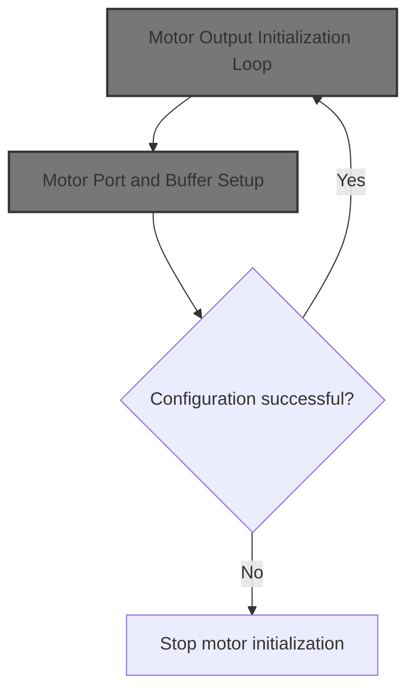

This document describes how all supported motors are prepared for operation by configuring and enabling them for use by the flight controller.



# Motor Output Initialization Loop

<SwmSnippet path="/src/platform/APM32/dshot_bitbang.c" line="657">

---

<SwmToken path="src/platform/APM32/dshot_bitbang.c" pos="657:4:4" line-data="static void bbPostInit(void)">`bbPostInit`</SwmToken> kicks off the motor output setup by finding the pacer timer, then loops through all supported motors. For each motor, it calls <SwmToken path="src/platform/APM32/dshot_bitbang.c" pos="663:5:5" line-data="        if (!bbMotorConfig(bbMotors[motorIndex].io, motorIndex, motorProtocol, bbMotors[motorIndex].output)) {">`bbMotorConfig`</SwmToken> to set up the hardware and buffers. If config fails, it bails out early. Calling <SwmToken path="src/platform/APM32/dshot_bitbang.c" pos="663:5:5" line-data="        if (!bbMotorConfig(bbMotors[motorIndex].io, motorIndex, motorProtocol, bbMotors[motorIndex].output)) {">`bbMotorConfig`</SwmToken> here is necessary to prep each motor's hardware and data structures before marking them as enabled.

```c
static void bbPostInit(void)
{
    bbFindPacerTimer();

    for (int motorIndex = 0; motorIndex < MAX_SUPPORTED_MOTORS && motorIndex < dshotMotorCount; motorIndex++) {

        if (!bbMotorConfig(bbMotors[motorIndex].io, motorIndex, motorProtocol, bbMotors[motorIndex].output)) {
            return;
        }

        bbMotors[motorIndex].enabled = true;
    }
}
```

---

</SwmSnippet>

# Motor Port and Buffer Setup

```mermaid
%%{init: {"flowchart": {"defaultRenderer": "elk"}} }%%
flowchart TD
    node1["Start motor configuration"] --> node2{"Is GPIO specified?"}
    click node1 openCode "src/platform/APM32/dshot_bitbang.c:388:389"
    click node2 openCode "src/platform/APM32/dshot_bitbang.c:391:393"
    node2 -->|"No"| node3["Return failure"]
    click node3 openCode "src/platform/APM32/dshot_bitbang.c:392:392"
    node2 -->|"Yes"| node4["Set up port group and DMA resources"]
    click node4 openCode "src/platform/APM32/dshot_bitbang.c:395:441"
    node4 --> node5{"Is DMA allocation successful?"}
    click node5 openCode "src/platform/APM32/dshot_bitbang.c:419:421"
    node5 -->|"No"| node3
    node5 -->|"Yes"| node6["Assign motor configuration values"]
    click node6 openCode "src/platform/APM32/dshot_bitbang.c:442:445"
    node6 --> node7["Initialize IO and GPIO"]
    click node7 openCode "src/platform/APM32/dshot_bitbang.c:447:451"
    node7 --> node8{"Enable DSHOT telemetry?"}
    click node8 openCode "src/platform/APM32/dshot_bitbang.c:455:458"
    node8 -->|"Yes"| node9["Initialize output data with telemetry"]
    click node9 openCode "src/platform/APM32/dshot_bitbang.c:456:457"
    node8 -->|"No"| node10["Initialize output data without telemetry"]
    click node10 openCode "src/platform/APM32/dshot_bitbang.c:460:461"
    node9 --> node11["Switch port to output"]
    click node11 openCode "src/platform/APM32/dshot_bitbang.c:463:463"
    node10 --> node11
    node11 --> node12["Mark motor as configured"]
    click node12 openCode "src/platform/APM32/dshot_bitbang.c:465:465"
    node12 --> node13["Return success"]
    click node13 openCode "src/platform/APM32/dshot_bitbang.c:467:467"

classDef HeadingStyle fill:#777777,stroke:#333,stroke-width:2px;

%% Swimm:
%% %%{init: {"flowchart": {"defaultRenderer": "elk"}} }%%
%% flowchart TD
%%     node1["Start motor configuration"] --> node2{"Is GPIO specified?"}
%%     click node1 openCode "<SwmPath>[src/…/APM32/dshot_bitbang.c](src/platform/APM32/dshot_bitbang.c)</SwmPath>:388:389"
%%     click node2 openCode "<SwmPath>[src/…/APM32/dshot_bitbang.c](src/platform/APM32/dshot_bitbang.c)</SwmPath>:391:393"
%%     node2 -->|"No"| node3["Return failure"]
%%     click node3 openCode "<SwmPath>[src/…/APM32/dshot_bitbang.c](src/platform/APM32/dshot_bitbang.c)</SwmPath>:392:392"
%%     node2 -->|"Yes"| node4["Set up port group and DMA resources"]
%%     click node4 openCode "<SwmPath>[src/…/APM32/dshot_bitbang.c](src/platform/APM32/dshot_bitbang.c)</SwmPath>:395:441"
%%     node4 --> node5{"Is DMA allocation successful?"}
%%     click node5 openCode "<SwmPath>[src/…/APM32/dshot_bitbang.c](src/platform/APM32/dshot_bitbang.c)</SwmPath>:419:421"
%%     node5 -->|"No"| node3
%%     node5 -->|"Yes"| node6["Assign motor configuration values"]
%%     click node6 openCode "<SwmPath>[src/…/APM32/dshot_bitbang.c](src/platform/APM32/dshot_bitbang.c)</SwmPath>:442:445"
%%     node6 --> node7["Initialize IO and GPIO"]
%%     click node7 openCode "<SwmPath>[src/…/APM32/dshot_bitbang.c](src/platform/APM32/dshot_bitbang.c)</SwmPath>:447:451"
%%     node7 --> node8{"Enable DSHOT telemetry?"}
%%     click node8 openCode "<SwmPath>[src/…/APM32/dshot_bitbang.c](src/platform/APM32/dshot_bitbang.c)</SwmPath>:455:458"
%%     node8 -->|"Yes"| node9["Initialize output data with telemetry"]
%%     click node9 openCode "<SwmPath>[src/…/APM32/dshot_bitbang.c](src/platform/APM32/dshot_bitbang.c)</SwmPath>:456:457"
%%     node8 -->|"No"| node10["Initialize output data without telemetry"]
%%     click node10 openCode "<SwmPath>[src/…/APM32/dshot_bitbang.c](src/platform/APM32/dshot_bitbang.c)</SwmPath>:460:461"
%%     node9 --> node11["Switch port to output"]
%%     click node11 openCode "<SwmPath>[src/…/APM32/dshot_bitbang.c](src/platform/APM32/dshot_bitbang.c)</SwmPath>:463:463"
%%     node10 --> node11
%%     node11 --> node12["Mark motor as configured"]
%%     click node12 openCode "<SwmPath>[src/…/APM32/dshot_bitbang.c](src/platform/APM32/dshot_bitbang.c)</SwmPath>:465:465"
%%     node12 --> node13["Return success"]
%%     click node13 openCode "<SwmPath>[src/…/APM32/dshot_bitbang.c](src/platform/APM32/dshot_bitbang.c)</SwmPath>:467:467"
%% 
%% classDef HeadingStyle fill:#777777,stroke:#333,stroke-width:2px;
```



<SwmSnippet path="/src/platform/APM32/dshot_bitbang.c" line="388">

---

In <SwmToken path="src/platform/APM32/dshot_bitbang.c" pos="388:4:4" line-data="static bool bbMotorConfig(IO_t io, uint8_t motorIndex, motorProtocolTypes_e pwmProtocolType, uint8_t output)">`bbMotorConfig`</SwmToken>, we check if the GPIO is valid, then look up or allocate a motor port for the given pin. If it's a new port, we set up DMA resources, initialize GPIO and timer hardware, and configure DMA for both output and input. We also set up the output and input buffers using Betaflight-specific constants. Finally, we prep the output buffer for telemetry if enabled, otherwise for normal operation. The function assumes the IO and <SwmToken path="src/platform/APM32/dshot_bitbang.c" pos="388:13:13" line-data="static bool bbMotorConfig(IO_t io, uint8_t motorIndex, motorProtocolTypes_e pwmProtocolType, uint8_t output)">`motorIndex`</SwmToken> are valid.

```c
static bool bbMotorConfig(IO_t io, uint8_t motorIndex, motorProtocolTypes_e pwmProtocolType, uint8_t output)
{
    // Return if no GPIO is specified
    if (!io) {
        return false;
    }

    int pinIndex = IO_GPIOPinIdx(io);
    int portIndex = IO_GPIOPortIdx(io);

    bbPort_t *bbPort = bbFindMotorPort(portIndex);

    if (!bbPort) {

        // New port group

        bbPort = bbAllocateMotorPort(portIndex);

        if (bbPort) {
            const timerHardware_t *timhw = bbPort->timhw;

#ifdef USE_DMA_SPEC
            const dmaChannelSpec_t *dmaChannelSpec = dmaGetChannelSpecByTimerValue(timhw->tim, timhw->channel, dmaGetOptionByTimer(timhw));
            bbPort->dmaResource = dmaChannelSpec->ref;
            bbPort->dmaChannel = dmaChannelSpec->channel;
#else
            bbPort->dmaResource = timhw->dmaRef;
            bbPort->dmaChannel = timhw->dmaChannel;
#endif
        }

        if (!bbPort || !dmaAllocate(dmaGetIdentifier(bbPort->dmaResource), bbPort->resourceOwner.owner, bbPort->resourceOwner.index)) {
            return false;
        }

        bbPort->gpio = IO_GPIO(io);

        bbPort->portOutputCount = MOTOR_DSHOT_BUF_LENGTH;
        bbPort->portOutputBuffer = &bbOutputBuffer[(bbPort - bbPorts) * MOTOR_DSHOT_BUF_CACHE_ALIGN_LENGTH];

        bbPort->portInputCount = DSHOT_BB_PORT_IP_BUF_LENGTH;
        bbPort->portInputBuffer = &bbInputBuffer[(bbPort - bbPorts) * DSHOT_BB_PORT_IP_BUF_CACHE_ALIGN_LENGTH];

        bbTimebaseSetup(bbPort, pwmProtocolType);
        bbTIM_TimeBaseInit(bbPort, bbPort->outputARR);
        bbTimerChannelInit(bbPort);

        bbSetupDma(bbPort);
        bbDMAPreconfigure(bbPort, DSHOT_BITBANG_DIRECTION_OUTPUT);
        bbDMAPreconfigure(bbPort, DSHOT_BITBANG_DIRECTION_INPUT);

        bbDMA_ITConfig(bbPort);
    }

    bbMotors[motorIndex].pinIndex = pinIndex;
    bbMotors[motorIndex].io = io;
    bbMotors[motorIndex].output = output;
    bbMotors[motorIndex].bbPort = bbPort;

    IOInit(io, OWNER_MOTOR, RESOURCE_INDEX(motorIndex));

    // Setup GPIO_MODER and GPIO_ODR register manipulation values

    bbGpioSetup(&bbMotors[motorIndex]);

    do {
#ifdef USE_DSHOT_TELEMETRY
    if (useDshotTelemetry) {
        bbOutputDataInit(bbPort->portOutputBuffer, (1 << pinIndex), DSHOT_BITBANG_INVERTED);
        break;
    }
#endif
        bbOutputDataInit(bbPort->portOutputBuffer, (1 << pinIndex), DSHOT_BITBANG_NONINVERTED);
    } while (false);
```

---

</SwmSnippet>

<SwmSnippet path="/src/platform/APM32/dshot_bitbang.c" line="463">

---

After switching the port to output and marking the motor as configured, <SwmToken path="src/platform/APM32/dshot_bitbang.c" pos="388:4:4" line-data="static bool bbMotorConfig(IO_t io, uint8_t motorIndex, motorProtocolTypes_e pwmProtocolType, uint8_t output)">`bbMotorConfig`</SwmToken> returns true to indicate success. If anything failed earlier, it would have returned false.

```c
    bbSwitchToOutput(bbPort);

    bbMotors[motorIndex].configured = true;

    return true;
}
```

---

</SwmSnippet>

&nbsp;

*This is an auto-generated document by Swimm 🌊 and has not yet been verified by a human*

<SwmMeta version="3.0.0" repo-id="Z2l0aHViJTNBJTNBYy1iZXRhZmxpZ2h0JTNBJTNBcmljYXJkb2xvcGV6Zw==" repo-name="c-betaflight"><sup>Powered by [Swimm](https://app.swimm.io/)</sup></SwmMeta>
