This document outlines the process for preparing hardware resources to enable SD card data transfer. The flow configures the SD card interface and DMA controller, ensuring all necessary clocks are enabled, pins are set up for alternate function, and interrupts are registered. The input is a request to initialize SD card data transfer hardware, and the output is a ready-to-use SD card interface with DMA support.

# SDIO and DMA Resource Setup

<SwmSnippet path="/src/platform/STM32/sdio_f4xx.c" line="1534">

---

In <SwmToken path="src/platform/STM32/sdio_f4xx.c" pos="1534:2:2" line-data="bool SD_Initialize_LL(DMA_Stream_TypeDef *dma)">`SD_Initialize_LL`</SwmToken>, we start by checking if the DMA stream is one of the two valid options for SDIO, and allocate it. Then we reset and enable clocks for SDIO, <SwmToken path="src/platform/STM32/sdio_f4xx.c" pos="1550:5:5" line-data="    // Enable DMA2 clocks">`DMA2`</SwmToken>, and the relevant GPIO ports. After that, we grab the IO handles for the SDIO pins, initialize them, and configure them for alternate function mode. The next step is calling <SwmToken path="src/platform/STM32/sdio_f4xx.c" pos="1578:1:1" line-data="    IOConfigGPIOAF(d0, SDIO_DATA, GPIO_AF_SDIO);">`IOConfigGPIOAF`</SwmToken> from <SwmPath>[src/…/STM32/io_stm32.c](src/platform/STM32/io_stm32.c)</SwmPath>, which actually sets the pin mode and alternate function in hardware, so the SDIO peripheral can use them.

```c
bool SD_Initialize_LL(DMA_Stream_TypeDef *dma)
{
    const dmaIdentifier_e dmaIdentifier = dmaGetIdentifier((dmaResource_t *)dmaStream);
    if (!(dma == DMA2_Stream3 || dma == DMA2_Stream6) || !dmaAllocate(dmaIdentifier, OWNER_SDCARD, 0)) {
        return false;
    }

    // Reset SDIO Module
    RCC->APB2RSTR |=  RCC_APB2RSTR_SDIORST;
    delay(1);
    RCC->APB2RSTR &= ~RCC_APB2RSTR_SDIORST;
    delay(1);

    // Enable SDIO clock
    RCC->APB2ENR |= RCC_APB2ENR_SDIOEN;

    // Enable DMA2 clocks
    RCC->AHB1ENR |= RCC_AHB1ENR_DMA2EN;

    //Configure Pins
    RCC->AHB1ENR |= RCC_AHB1ENR_GPIOCEN | RCC_AHB1ENR_GPIODEN;

    uint8_t is4BitWidth = sdioConfig()->use4BitWidth;

    const IO_t d0 = IOGetByTag(IO_TAG(PC8));
    const IO_t d1 = IOGetByTag(IO_TAG(PC9));
    const IO_t d2 = IOGetByTag(IO_TAG(PC10));
    const IO_t d3 = IOGetByTag(IO_TAG(PC11));
    const IO_t clk = IOGetByTag(IO_TAG(PC12));
    const IO_t cmd = IOGetByTag(IO_TAG(PD2));

    IOInit(d0, OWNER_SDCARD, 0);
    if (is4BitWidth) {
        IOInit(d1, OWNER_SDCARD, 0);
        IOInit(d2, OWNER_SDCARD, 0);
        IOInit(d3, OWNER_SDCARD, 0);
    }
    IOInit(clk, OWNER_SDCARD, 0);
    IOInit(cmd, OWNER_SDCARD, 0);

#define SDIO_DATA       IO_CONFIG(GPIO_Mode_AF, GPIO_Speed_100MHz, GPIO_OType_PP, GPIO_PuPd_NOPULL)
#define SDIO_CMD        IO_CONFIG(GPIO_Mode_AF, GPIO_Speed_100MHz, GPIO_OType_PP, GPIO_PuPd_NOPULL)
#define SDIO_CLK        IO_CONFIG(GPIO_Mode_AF, GPIO_Speed_100MHz, GPIO_OType_PP, GPIO_PuPd_NOPULL)

    IOConfigGPIOAF(d0, SDIO_DATA, GPIO_AF_SDIO);
    if (is4BitWidth) {
        IOConfigGPIOAF(d1, SDIO_DATA, GPIO_AF_SDIO);
        IOConfigGPIOAF(d2, SDIO_DATA, GPIO_AF_SDIO);
        IOConfigGPIOAF(d3, SDIO_DATA, GPIO_AF_SDIO);
    }
    IOConfigGPIOAF(clk, SDIO_CLK, GPIO_AF_SDIO);
    IOConfigGPIOAF(cmd, SDIO_CMD, GPIO_AF_SDIO);

```

---

</SwmSnippet>

<SwmSnippet path="/src/platform/STM32/io_stm32.c" line="199">

---

<SwmToken path="src/platform/STM32/io_stm32.c" pos="199:2:2" line-data="void IOConfigGPIOAF(IO_t io, ioConfig_t cfg, uint8_t af)">`IOConfigGPIOAF`</SwmToken> takes care of setting the pin mode, speed, pull, and alternate function for the SDIO pins. It decodes the packed cfg value using bit shifts and masks, then uses repository-specific macros to map the IO handle to the actual hardware port and pin. This is where the pin is actually set up for SDIO operation.

```c
void IOConfigGPIOAF(IO_t io, ioConfig_t cfg, uint8_t af)
{
    if (!io) {
        return;
    }

    rccPeriphTag_t rcc = ioPortDefs[IO_GPIOPortIdx(io)].rcc;
    RCC_ClockCmd(rcc, ENABLE);

    GPIO_InitTypeDef init = {
        .Pin = IO_Pin(io),
        .Mode = (cfg >> 0) & 0x13,
        .Speed = (cfg >> 2) & 0x03,
        .Pull = (cfg >> 5) & 0x03,
        .Alternate = af
    };

    HAL_GPIO_Init(IO_GPIO(io), &init);
}
```

---

</SwmSnippet>

<SwmSnippet path="/src/platform/STM32/sdio_f4xx.c" line="1587">

---

Back in <SwmToken path="src/platform/STM32/sdio_f4xx.c" pos="1534:2:2" line-data="bool SD_Initialize_LL(DMA_Stream_TypeDef *dma)">`SD_Initialize_LL`</SwmToken>, after setting up the pins, we configure the NVIC for SDIO interrupts and prep the DMA stream registers for SDIO transfers. We call <SwmToken path="src/platform/STM32/sdio_f4xx.c" pos="1611:1:1" line-data="    dmaEnable(dmaIdentifier);">`dmaEnable`</SwmToken> next to make sure the DMA controller's clock is actually enabled, so the DMA stream can function.

```c
    // NVIC configuration for SDIO interrupts
    NVIC_InitTypeDef NVIC_InitStructure;
    NVIC_InitStructure.NVIC_IRQChannel = SDIO_IRQn;
    NVIC_InitStructure.NVIC_IRQChannelPreemptionPriority = NVIC_PRIORITY_BASE(1);
    NVIC_InitStructure.NVIC_IRQChannelSubPriority = NVIC_PRIORITY_SUB(0);
    NVIC_InitStructure.NVIC_IRQChannelCmd = ENABLE;
    NVIC_Init(&NVIC_InitStructure);

    dmaStream = dma;
    RCC->AHB1ENR |= RCC_AHB1ENR_DMA2EN;
    // Initialize DMA
    dmaStream->CR = 0; // Reset DMA Stream control register
    dmaStream->PAR  = (uint32_t)&SDIO->FIFO;
    if (dmaStream == DMA2_Stream3) {
        DMA2->LIFCR = IFCR_CLEAR_MASK_STREAM3; // Clear all interrupt flags
    } else {
        DMA2->HIFCR = IFCR_CLEAR_MASK_STREAM6; // Clear all interrupt flags
    }
    dmaStream->CR = (DMA_CHANNEL_4 | DMA_SxCR_PFCTRL | // Prepare the DMA Stream configuration
        DMA_MINC_ENABLE | DMA_PDATAALIGN_WORD | // And write to DMA Stream CR register
        DMA_MDATAALIGN_WORD | DMA_PRIORITY_VERY_HIGH |
        DMA_MBURST_INC4 | DMA_PBURST_INC4 |
        DMA_MEMORY_TO_PERIPH);
    dmaStream->FCR  = (DMA_SxFCR_DMDIS | DMA_SxFCR_FTH); // Configuration FIFO control register
    dmaEnable(dmaIdentifier);
```

---

</SwmSnippet>

## DMA Controller Clock Activation

```mermaid
%%{init: {"flowchart": {"defaultRenderer": "elk"}} }%%
flowchart TD
    node1["Receive DMA identifier"] --> node2{"Which DMA controller?"}
    click node1 openCode "src/platform/STM32/dma_stm32g4xx.c:84:89"
    node2 -->|DMA1| node3["Enable DMA1 clock"]
    click node2 openCode "src/platform/STM32/dma_stm32g4xx.c:77:82"
    node2 -->|DMA2| node4["Enable DMA2 clock"]
    click node3 openCode "src/platform/STM32/dma_stm32g4xx.c:77:82"
    click node4 openCode "src/platform/STM32/dma_stm32g4xx.c:77:82"
    node3 --> node5["Enable DMAMUX"]
    node4 --> node5
    node5["DMA hardware resources enabled for identifier"]
    click node5 openCode "src/platform/STM32/dma_stm32g4xx.c:77:82"
classDef HeadingStyle fill:#777777,stroke:#333,stroke-width:2px;

%% Swimm:
%% %%{init: {"flowchart": {"defaultRenderer": "elk"}} }%%
%% flowchart TD
%%     node1["Receive DMA identifier"] --> node2{"Which DMA controller?"}
%%     click node1 openCode "<SwmPath>[src/…/STM32/dma_stm32g4xx.c](src/platform/STM32/dma_stm32g4xx.c)</SwmPath>:84:89"
%%     node2 -->|<SwmToken path="src/platform/STM32/dma_stm32g4xx.c" pos="79:12:12" line-data="    RCC_ClockCmd(dmaDescriptors[index].dma == DMA1 ?  RCC_AHB1(DMA1) : RCC_AHB1(DMA2), ENABLE);">`DMA1`</SwmToken>| node3["Enable <SwmToken path="src/platform/STM32/dma_stm32g4xx.c" pos="79:12:12" line-data="    RCC_ClockCmd(dmaDescriptors[index].dma == DMA1 ?  RCC_AHB1(DMA1) : RCC_AHB1(DMA2), ENABLE);">`DMA1`</SwmToken> clock"]
%%     click node2 openCode "<SwmPath>[src/…/STM32/dma_stm32g4xx.c](src/platform/STM32/dma_stm32g4xx.c)</SwmPath>:77:82"
%%     node2 -->|<SwmToken path="src/platform/STM32/sdio_f4xx.c" pos="1550:5:5" line-data="    // Enable DMA2 clocks">`DMA2`</SwmToken>| node4["Enable <SwmToken path="src/platform/STM32/sdio_f4xx.c" pos="1550:5:5" line-data="    // Enable DMA2 clocks">`DMA2`</SwmToken> clock"]
%%     click node3 openCode "<SwmPath>[src/…/STM32/dma_stm32g4xx.c](src/platform/STM32/dma_stm32g4xx.c)</SwmPath>:77:82"
%%     click node4 openCode "<SwmPath>[src/…/STM32/dma_stm32g4xx.c](src/platform/STM32/dma_stm32g4xx.c)</SwmPath>:77:82"
%%     node3 --> node5["Enable DMAMUX"]
%%     node4 --> node5
%%     node5["DMA hardware resources enabled for identifier"]
%%     click node5 openCode "<SwmPath>[src/…/STM32/dma_stm32g4xx.c](src/platform/STM32/dma_stm32g4xx.c)</SwmPath>:77:82"
%% classDef HeadingStyle fill:#777777,stroke:#333,stroke-width:2px;
```



<SwmSnippet path="/src/platform/STM32/dma_stm32g4xx.c" line="84">

---

DmaEnable maps the DMA identifier to an index and calls <SwmToken path="src/platform/STM32/dma_stm32g4xx.c" pos="88:1:1" line-data="    enableDmaClock(index);">`enableDmaClock`</SwmToken> to actually turn on the DMA controller's clock. This is needed before any DMA transfer can happen.

```c
void dmaEnable(dmaIdentifier_e identifier)
{
    const int index = DMA_IDENTIFIER_TO_INDEX(identifier);

    enableDmaClock(index);
}
```

---

</SwmSnippet>

<SwmSnippet path="/src/platform/STM32/dma_stm32g4xx.c" line="77">

---

EnableDmaClock figures out which DMA controller (<SwmToken path="src/platform/STM32/dma_stm32g4xx.c" pos="79:12:12" line-data="    RCC_ClockCmd(dmaDescriptors[index].dma == DMA1 ?  RCC_AHB1(DMA1) : RCC_AHB1(DMA2), ENABLE);">`DMA1`</SwmToken> or <SwmToken path="src/platform/STM32/dma_stm32g4xx.c" pos="79:25:25" line-data="    RCC_ClockCmd(dmaDescriptors[index].dma == DMA1 ?  RCC_AHB1(DMA1) : RCC_AHB1(DMA2), ENABLE);">`DMA2`</SwmToken>) to enable based on the descriptor, and always enables <SwmToken path="src/platform/STM32/dma_stm32g4xx.c" pos="81:5:5" line-data="    RCC_ClockCmd(RCC_AHB1(DMAMUX1), ENABLE);">`DMAMUX1`</SwmToken> since it's required for DMA to work on this chip.

```c
static void enableDmaClock(int index)
{
    RCC_ClockCmd(dmaDescriptors[index].dma == DMA1 ?  RCC_AHB1(DMA1) : RCC_AHB1(DMA2), ENABLE);
    // G4 has an independent enable bit for DMAMUX
    RCC_ClockCmd(RCC_AHB1(DMAMUX1), ENABLE);
}
```

---

</SwmSnippet>

## DMA Interrupt Handler Setup

```mermaid
%%{init: {"flowchart": {"defaultRenderer": "elk"}} }%%
flowchart TD
    node1{"Which DMA stream is used for SD card data transfer?"}
    click node1 openCode "src/platform/STM32/sdio_f4xx.c:1612:1612"
    node1 -->|DMA2_Stream3| node2["Configure SD card for DMA2_Stream3"]
    click node2 openCode "src/platform/STM32/sdio_f4xx.c:1613:1614"
    node1 -->|DMA2_Stream6| node3["Configure SD card for DMA2_Stream6"]
    click node3 openCode "src/platform/STM32/sdio_f4xx.c:1615:1616"
    node2 --> node4["SD card ready for data transfer"]
    click node4 openCode "src/platform/STM32/sdio_f4xx.c:1617:1618"
    node3 --> node4
    node4 --> node5["Report successful configuration"]
    click node5 openCode "src/platform/STM32/sdio_f4xx.c:1618:1619"

classDef HeadingStyle fill:#777777,stroke:#333,stroke-width:2px;

%% Swimm:
%% %%{init: {"flowchart": {"defaultRenderer": "elk"}} }%%
%% flowchart TD
%%     node1{"Which DMA stream is used for SD card data transfer?"}
%%     click node1 openCode "<SwmPath>[src/…/STM32/sdio_f4xx.c](src/platform/STM32/sdio_f4xx.c)</SwmPath>:1612:1612"
%%     node1 -->|<SwmToken path="src/platform/STM32/sdio_f4xx.c" pos="1537:10:10" line-data="    if (!(dma == DMA2_Stream3 || dma == DMA2_Stream6) || !dmaAllocate(dmaIdentifier, OWNER_SDCARD, 0)) {">`DMA2_Stream3`</SwmToken>| node2["Configure SD card for <SwmToken path="src/platform/STM32/sdio_f4xx.c" pos="1537:10:10" line-data="    if (!(dma == DMA2_Stream3 || dma == DMA2_Stream6) || !dmaAllocate(dmaIdentifier, OWNER_SDCARD, 0)) {">`DMA2_Stream3`</SwmToken>"]
%%     click node2 openCode "<SwmPath>[src/…/STM32/sdio_f4xx.c](src/platform/STM32/sdio_f4xx.c)</SwmPath>:1613:1614"
%%     node1 -->|<SwmToken path="src/platform/STM32/sdio_f4xx.c" pos="1537:18:18" line-data="    if (!(dma == DMA2_Stream3 || dma == DMA2_Stream6) || !dmaAllocate(dmaIdentifier, OWNER_SDCARD, 0)) {">`DMA2_Stream6`</SwmToken>| node3["Configure SD card for <SwmToken path="src/platform/STM32/sdio_f4xx.c" pos="1537:18:18" line-data="    if (!(dma == DMA2_Stream3 || dma == DMA2_Stream6) || !dmaAllocate(dmaIdentifier, OWNER_SDCARD, 0)) {">`DMA2_Stream6`</SwmToken>"]
%%     click node3 openCode "<SwmPath>[src/…/STM32/sdio_f4xx.c](src/platform/STM32/sdio_f4xx.c)</SwmPath>:1615:1616"
%%     node2 --> node4["SD card ready for data transfer"]
%%     click node4 openCode "<SwmPath>[src/…/STM32/sdio_f4xx.c](src/platform/STM32/sdio_f4xx.c)</SwmPath>:1617:1618"
%%     node3 --> node4
%%     node4 --> node5["Report successful configuration"]
%%     click node5 openCode "<SwmPath>[src/…/STM32/sdio_f4xx.c](src/platform/STM32/sdio_f4xx.c)</SwmPath>:1618:1619"
%% 
%% classDef HeadingStyle fill:#777777,stroke:#333,stroke-width:2px;
```



<SwmSnippet path="/src/platform/STM32/sdio_f4xx.c" line="1612">

---

Back in <SwmToken path="src/platform/STM32/sdio_f4xx.c" pos="1534:2:2" line-data="bool SD_Initialize_LL(DMA_Stream_TypeDef *dma)">`SD_Initialize_LL`</SwmToken>, after enabling the DMA controller, we set up the interrupt handler for the DMA stream. We call <SwmToken path="src/platform/STM32/sdio_f4xx.c" pos="1613:1:1" line-data="        dmaSetHandler(dmaIdentifier, SDIO_DMA_ST3_IRQHandler, 1, 0);">`dmaSetHandler`</SwmToken> next to register the right callback for the DMA stream, depending on which one is used.

```c
    if (dmaStream == DMA2_Stream3) {
        dmaSetHandler(dmaIdentifier, SDIO_DMA_ST3_IRQHandler, 1, 0);
    } else {
        dmaSetHandler(dmaIdentifier, SDIO_DMA_ST6_IRQHandler, 1, 0);
    }

    return true;
}
```

---

</SwmSnippet>

# DMA Interrupt Registration

```mermaid
%%{init: {"flowchart": {"defaultRenderer": "elk"}} }%%
flowchart TD
    node1["Select DMA channel/stream to configure (DMA identifier)"] --> node2["Enable DMA clock for selected channel"]
    click node1 openCode "src/platform/STM32/dma_stm32g4xx.c:93:94"
    node2 --> node3["Assign callback handler and user parameter for DMA events"]
    click node2 openCode "src/platform/STM32/dma_stm32g4xx.c:95:95"
    node3 --> node4["Set interrupt priority for DMA events"]
    click node3 openCode "src/platform/STM32/dma_stm32g4xx.c:96:97"
    node4 --> node5["Enable DMA interrupt for selected channel"]
    click node4 openCode "src/platform/STM32/dma_stm32g4xx.c:99:99"
    click node5 openCode "src/platform/STM32/dma_stm32g4xx.c:100:100"

classDef HeadingStyle fill:#777777,stroke:#333,stroke-width:2px;

%% Swimm:
%% %%{init: {"flowchart": {"defaultRenderer": "elk"}} }%%
%% flowchart TD
%%     node1["Select DMA channel/stream to configure (DMA identifier)"] --> node2["Enable DMA clock for selected channel"]
%%     click node1 openCode "<SwmPath>[src/…/STM32/dma_stm32g4xx.c](src/platform/STM32/dma_stm32g4xx.c)</SwmPath>:93:94"
%%     node2 --> node3["Assign callback handler and user parameter for DMA events"]
%%     click node2 openCode "<SwmPath>[src/…/STM32/dma_stm32g4xx.c](src/platform/STM32/dma_stm32g4xx.c)</SwmPath>:95:95"
%%     node3 --> node4["Set interrupt priority for DMA events"]
%%     click node3 openCode "<SwmPath>[src/…/STM32/dma_stm32g4xx.c](src/platform/STM32/dma_stm32g4xx.c)</SwmPath>:96:97"
%%     node4 --> node5["Enable DMA interrupt for selected channel"]
%%     click node4 openCode "<SwmPath>[src/…/STM32/dma_stm32g4xx.c](src/platform/STM32/dma_stm32g4xx.c)</SwmPath>:99:99"
%%     click node5 openCode "<SwmPath>[src/…/STM32/dma_stm32g4xx.c](src/platform/STM32/dma_stm32g4xx.c)</SwmPath>:100:100"
%% 
%% classDef HeadingStyle fill:#777777,stroke:#333,stroke-width:2px;
```



<SwmSnippet path="/src/platform/STM32/dma_stm32g4xx.c" line="91">

---

In <SwmToken path="src/platform/STM32/dma_stm32g4xx.c" pos="91:2:2" line-data="void dmaSetHandler(dmaIdentifier_e identifier, dmaCallbackHandlerFuncPtr callback, uint32_t priority, uint32_t userParam)">`dmaSetHandler`</SwmToken>, we map the DMA identifier to an index and make sure the DMA clock is enabled before setting up the interrupt handler. This guarantees the hardware is ready for interrupt configuration.

```c
void dmaSetHandler(dmaIdentifier_e identifier, dmaCallbackHandlerFuncPtr callback, uint32_t priority, uint32_t userParam)
{
    const int index = DMA_IDENTIFIER_TO_INDEX(identifier);

    enableDmaClock(index);
```

---

</SwmSnippet>

<SwmSnippet path="/src/platform/STM32/dma_stm32g4xx.c" line="96">

---

After returning from <SwmToken path="src/platform/STM32/sdio_f4xx.c" pos="1613:1:1" line-data="        dmaSetHandler(dmaIdentifier, SDIO_DMA_ST3_IRQHandler, 1, 0);">`dmaSetHandler`</SwmToken>, we store the callback and <SwmToken path="src/platform/STM32/dma_stm32g4xx.c" pos="97:6:6" line-data="    dmaDescriptors[index].userParam = userParam;">`userParam`</SwmToken> in the descriptor, then set up the NVIC priority and enable the IRQ for the DMA stream. This makes sure the right handler is called when a DMA interrupt fires.

```c
    dmaDescriptors[index].irqHandlerCallback = callback;
    dmaDescriptors[index].userParam = userParam;

    HAL_NVIC_SetPriority(dmaDescriptors[index].irqN, NVIC_PRIORITY_BASE(priority), NVIC_PRIORITY_SUB(priority));
    HAL_NVIC_EnableIRQ(dmaDescriptors[index].irqN);
}
```

---

</SwmSnippet>

&nbsp;

*This is an auto-generated document by Swimm 🌊 and has not yet been verified by a human*

<SwmMeta version="3.0.0" repo-id="Z2l0aHViJTNBJTNBYy1iZXRhZmxpZ2h0JTNBJTNBcmljYXJkb2xvcGV6Zw==" repo-name="c-betaflight"><sup>Powered by [Swimm](https://app.swimm.io/)</sup></SwmMeta>
