This document describes how the SD card is prepared for use by the flight controller. Initialization is performed once per boot, and the result is reused for subsequent requests. The process includes hardware and protocol setup, followed by configuration for optimal data transfer.

# Initialization Entry Point

<SwmSnippet path="/src/platform/STM32/sdio_f7xx.c" line="1661">

---

<SwmToken path="src/platform/STM32/sdio_f7xx.c" pos="1661:2:2" line-data="SD_Error_t SD_Init(void)">`SD_Init`</SwmToken> is the entry point for SD card initialization. It makes sure we only try to initialize the SD card once per boot by using static variables. After the first attempt, it always returns the cached result. Next, it calls <SwmToken path="src/platform/STM32/sdio_f7xx.c" pos="1672:5:5" line-data="    result = SD_DoInit();">`SD_DoInit`</SwmToken> to actually perform the hardware and protocol setup for the SD card.

```c
SD_Error_t SD_Init(void)
{
    static bool sdInitAttempted = false;
    static SD_Error_t result = SD_ERROR;

    if (sdInitAttempted) {
        return result;
    }

    sdInitAttempted = true;

    result = SD_DoInit();

    return result;
}
```

---

</SwmSnippet>

# Hardware and Protocol Setup

```mermaid
%%{init: {"flowchart": {"defaultRenderer": "elk"}} }%%
flowchart TD
    node1["Start SD card initialization"]
    click node1 openCode "src/platform/STM32/sdio_f7xx.c:1616:1619"
    node1 --> node2["Power on SD card"]
    click node2 openCode "src/platform/STM32/sdio_f7xx.c:1625:1628"
    node2 --> node3{"Power on successful?"}
    click node3 openCode "src/platform/STM32/sdio_f7xx.c:1626:1628"
    node3 -->|"No"| node8["Return error"]
    click node8 openCode "src/platform/STM32/sdio_f7xx.c:1627:1628"
    node3 -->|"Yes"| node4["Initialize SD card and set idle state"]
    click node4 openCode "src/platform/STM32/sdio_f7xx.c:1631:1634"
    node4 --> node5{"Initialization successful?"}
    click node5 openCode "src/platform/STM32/sdio_f7xx.c:1632:1634"
    node5 -->|"No"| node8
    node5 -->|"Yes"| node6["Read card information"]
    click node6 openCode "src/platform/STM32/sdio_f7xx.c:1637:1640"
    node6 --> node7{"Card info read successfully?"}
    click node7 openCode "src/platform/STM32/sdio_f7xx.c:1638:1640"
    node7 -->|"No"| node8
    node7 -->|"Yes"| node9["Select card"]
    click node9 openCode "src/platform/STM32/sdio_f7xx.c:1643:1645"
    node9 --> node10{"Bus width: 4-bit?"}
    click node10 openCode "src/platform/STM32/sdio_f7xx.c:1651:1655"
    node10 -->|"Yes"| node11["Configure 4-bit bus"]
    click node11 openCode "src/platform/STM32/sdio_f7xx.c:1652:1653"
    node10 -->|"No"| node12["Configure 1-bit bus"]
    click node12 openCode "src/platform/STM32/sdio_f7xx.c:1654:1655"
    node11 --> node13["Return result"]
    click node13 openCode "src/platform/STM32/sdio_f7xx.c:1658:1659"
    node12 --> node13
    node8 --> node13
classDef HeadingStyle fill:#777777,stroke:#333,stroke-width:2px;

%% Swimm:
%% %%{init: {"flowchart": {"defaultRenderer": "elk"}} }%%
%% flowchart TD
%%     node1["Start SD card initialization"]
%%     click node1 openCode "<SwmPath>[src/…/STM32/sdio_f7xx.c](src/platform/STM32/sdio_f7xx.c)</SwmPath>:1616:1619"
%%     node1 --> node2["Power on SD card"]
%%     click node2 openCode "<SwmPath>[src/…/STM32/sdio_f7xx.c](src/platform/STM32/sdio_f7xx.c)</SwmPath>:1625:1628"
%%     node2 --> node3{"Power on successful?"}
%%     click node3 openCode "<SwmPath>[src/…/STM32/sdio_f7xx.c](src/platform/STM32/sdio_f7xx.c)</SwmPath>:1626:1628"
%%     node3 -->|"No"| node8["Return error"]
%%     click node8 openCode "<SwmPath>[src/…/STM32/sdio_f7xx.c](src/platform/STM32/sdio_f7xx.c)</SwmPath>:1627:1628"
%%     node3 -->|"Yes"| node4["Initialize SD card and set idle state"]
%%     click node4 openCode "<SwmPath>[src/…/STM32/sdio_f7xx.c](src/platform/STM32/sdio_f7xx.c)</SwmPath>:1631:1634"
%%     node4 --> node5{"Initialization successful?"}
%%     click node5 openCode "<SwmPath>[src/…/STM32/sdio_f7xx.c](src/platform/STM32/sdio_f7xx.c)</SwmPath>:1632:1634"
%%     node5 -->|"No"| node8
%%     node5 -->|"Yes"| node6["Read card information"]
%%     click node6 openCode "<SwmPath>[src/…/STM32/sdio_f7xx.c](src/platform/STM32/sdio_f7xx.c)</SwmPath>:1637:1640"
%%     node6 --> node7{"Card info read successfully?"}
%%     click node7 openCode "<SwmPath>[src/…/STM32/sdio_f7xx.c](src/platform/STM32/sdio_f7xx.c)</SwmPath>:1638:1640"
%%     node7 -->|"No"| node8
%%     node7 -->|"Yes"| node9["Select card"]
%%     click node9 openCode "<SwmPath>[src/…/STM32/sdio_f7xx.c](src/platform/STM32/sdio_f7xx.c)</SwmPath>:1643:1645"
%%     node9 --> node10{"Bus width: <SwmToken path="src/platform/STM32/sdio_f7xx.c" pos="1021:9:11" line-data="  *            @arg SD_BUS_WIDE_4B: 4-bit data transfer">`4-bit`</SwmToken>?"}
%%     click node10 openCode "<SwmPath>[src/…/STM32/sdio_f7xx.c](src/platform/STM32/sdio_f7xx.c)</SwmPath>:1651:1655"
%%     node10 -->|"Yes"| node11["Configure <SwmToken path="src/platform/STM32/sdio_f7xx.c" pos="1021:9:11" line-data="  *            @arg SD_BUS_WIDE_4B: 4-bit data transfer">`4-bit`</SwmToken> bus"]
%%     click node11 openCode "<SwmPath>[src/…/STM32/sdio_f7xx.c](src/platform/STM32/sdio_f7xx.c)</SwmPath>:1652:1653"
%%     node10 -->|"No"| node12["Configure <SwmToken path="src/platform/STM32/sdio_f7xx.c" pos="1022:9:11" line-data="  *            @arg SD_BUS_WIDE_1B: 1-bit data transfer">`1-bit`</SwmToken> bus"]
%%     click node12 openCode "<SwmPath>[src/…/STM32/sdio_f7xx.c](src/platform/STM32/sdio_f7xx.c)</SwmPath>:1654:1655"
%%     node11 --> node13["Return result"]
%%     click node13 openCode "<SwmPath>[src/…/STM32/sdio_f7xx.c](src/platform/STM32/sdio_f7xx.c)</SwmPath>:1658:1659"
%%     node12 --> node13
%%     node8 --> node13
%% classDef HeadingStyle fill:#777777,stroke:#333,stroke-width:2px;
```



<SwmSnippet path="/src/platform/STM32/sdio_f7xx.c" line="1615">

---

<SwmToken path="src/platform/STM32/sdio_f7xx.c" pos="1615:4:4" line-data="static SD_Error_t SD_DoInit(void)">`SD_DoInit`</SwmToken> does the actual SD card and hardware setup: enabling the clock, setting up the peripheral, powering on the card, initializing it, reading its info, and selecting it. After all that, it configures the bus width with <SwmToken path="src/platform/STM32/sdio_f7xx.c" pos="1652:5:5" line-data="            errorState = SD_WideBusOperationConfig(SD_BUS_WIDE_4B);">`SD_WideBusOperationConfig`</SwmToken> to optimize data transfer, but only if everything else succeeded.

```c
static SD_Error_t SD_DoInit(void)
{
    SD_Error_t errorState;

    __HAL_RCC_SDMMC1_CLK_ENABLE();

    // Initialize SDMMC1 peripheral interface with default configuration for SD card initialization.
    MODIFY_REG(SDMMC1->CLKCR, CLKCR_CLEAR_MASK, (uint32_t) SDMMC_INIT_CLK_DIV);

    // Identify card operating voltage.
    errorState = SD_PowerON();
    if (errorState != SD_OK) {
        return errorState;
    }

    // Initialize the present card and put them in idle state.
    errorState = SD_InitializeCard();
    if (errorState != SD_OK) {
        return errorState;
    }

    // Read CSD/CID MSD registers.
    errorState = SD_GetCardInfo();
    if (errorState != SD_OK) {
        return errorState;
    }

    // Select the Card - Send CMD7 SDMMC_SEL_DESEL_CARD.
    errorState = SD_TransmitCommand((SD_CMD_SEL_DESEL_CARD | SD_CMD_RESPONSE_SHORT), SD_CardRCA, 1);
    // Configure SDMMC1 peripheral interface.
    MODIFY_REG(SDMMC1->CLKCR, CLKCR_CLEAR_MASK, (uint32_t) SDMMC_CLK_DIV);

    // Configure SD Bus width.
    if (errorState == SD_OK)
    {
        // Enable wide operation.
        if (sdioConfig()->use4BitWidth) {
            errorState = SD_WideBusOperationConfig(SD_BUS_WIDE_4B);
        } else {
            errorState = SD_WideBusOperationConfig(SD_BUS_WIDE_1B);
        }
    }

    return errorState;
}
```

---

</SwmSnippet>

<SwmSnippet path="/src/platform/STM32/sdio_f7xx.c" line="1025">

---

<SwmToken path="src/platform/STM32/sdio_f7xx.c" pos="1025:4:4" line-data="static SD_Error_t SD_WideBusOperationConfig(uint32_t WideMode)">`SD_WideBusOperationConfig`</SwmToken> checks if the card supports the requested bus width by reading the SCR register, then uses <SwmToken path="src/platform/STM32/sdio_f7xx.c" pos="1052:5:5" line-data="                        // Send CMD55 APP_CMD with argument as card&#39;s RCA.">`CMD55`</SwmToken> and <SwmToken path="src/platform/STM32/sdio_f7xx.c" pos="1058:5:5" line-data="                            // Send ACMD6 APP_CMD with argument as 2 for wide bus mode">`ACMD6`</SwmToken> to tell the card to switch modes. Finally, it waits for the hardware register to update to the new width before continuing. If the card doesn't support the mode, it bails out early.

```c
static SD_Error_t SD_WideBusOperationConfig(uint32_t WideMode)
{
    SD_Error_t ErrorState = SD_OK;
    uint32_t   Temp;
    uint32_t   SCR[2] = {0, 0};

    if((SD_CardType == SD_STD_CAPACITY_V1_1) || (SD_CardType == SD_STD_CAPACITY_V2_0) ||\
            (SD_CardType == SD_HIGH_CAPACITY))
    {
        if(WideMode == SD_BUS_WIDE_8B)
        {
            ErrorState = SD_UNSUPPORTED_FEATURE;
        }
        else if((WideMode == SD_BUS_WIDE_4B) ||
                (WideMode == SD_BUS_WIDE_1B))
        {
            if((SDMMC1->RESP1 & SD_CARD_LOCKED) != SD_CARD_LOCKED)
            {
                // Get SCR Register
                    ErrorState = SD_FindSCR(SCR);
                if(ErrorState == SD_OK)
                {
                    Temp = (WideMode == SD_BUS_WIDE_4B) ? SD_WIDE_BUS_SUPPORT : SD_SINGLE_BUS_SUPPORT;

                    // If requested card supports wide bus operation
                    if((SCR[1] & Temp) != SD_ALLZERO)
                    {
                        // Send CMD55 APP_CMD with argument as card's RCA.
                            ErrorState = SD_TransmitCommand((SD_CMD_APP_CMD | SD_CMD_RESPONSE_SHORT), SD_CardRCA, 1);
                        if(ErrorState == SD_OK)
                        {
                            Temp = (WideMode == SD_BUS_WIDE_4B) ? 2 : 0;

                            // Send ACMD6 APP_CMD with argument as 2 for wide bus mode
                            ErrorState =  SD_TransmitCommand((SD_CMD_APP_SD_SET_BUSWIDTH | SD_CMD_RESPONSE_SHORT), Temp, 1);
                        }
                    }
                    else
                    {
                        ErrorState = SD_REQUEST_NOT_APPLICABLE;
                    }
                }
            }
            else
            {
                ErrorState = SD_LOCK_UNLOCK_FAILED;
            }
        }
        else
        {
            ErrorState = SD_INVALID_PARAMETER;  // WideMode is not a valid argument
        }

        if(ErrorState == SD_OK)
        {
            // Configure the SDMMC1 peripheral, we need this delay for some reason...
                while ((READ_REG(SDMMC1->CLKCR) & 0x800) != WideMode) {
                        MODIFY_REG(SDMMC1->CLKCR, CLKCR_CLEAR_MASK, (uint32_t) WideMode);
                }
```

---

</SwmSnippet>

&nbsp;

*This is an auto-generated document by Swimm 🌊 and has not yet been verified by a human*

<SwmMeta version="3.0.0" repo-id="Z2l0aHViJTNBJTNBYy1iZXRhZmxpZ2h0JTNBJTNBcmljYXJkb2xvcGV6Zw==" repo-name="c-betaflight"><sup>Powered by [Swimm](https://app.swimm.io/)</sup></SwmMeta>
