This document describes how the system prepares to search for entries in a directory. The process ensures that the search starts from the beginning and that the search state is ready to track entries as they are found. The input is a directory and a search state object, and the output is a search state prepared to begin iterating over directory entries from the start.

# Starting a Directory Search

<SwmSnippet path="/src/main/io/asyncfatfs/asyncfatfs.c" line="2227">

---

In <SwmToken path="src/main/io/asyncfatfs/asyncfatfs.c" pos="2227:2:2" line-data="void afatfs_findFirst(afatfsFilePtr_t directory, afatfsFinder_t *finder)">`afatfs_findFirst`</SwmToken>, we kick off the directory search by resetting the file pointer to the start. This is done so that subsequent operations (like reading entries) begin from the first item in the directory. We call <SwmToken path="src/main/io/asyncfatfs/asyncfatfs.c" pos="2229:1:1" line-data="    afatfs_fseek(directory, 0, AFATFS_SEEK_SET);">`afatfs_fseek`</SwmToken> next to make sure the cursor is at position zero.

```c
void afatfs_findFirst(afatfsFilePtr_t directory, afatfsFinder_t *finder)
{
    afatfs_fseek(directory, 0, AFATFS_SEEK_SET);
```

---

</SwmSnippet>

## Positioning the File Cursor

```mermaid
%%{init: {"flowchart": {"defaultRenderer": "elk"}} }%%
flowchart TD
    node1["Update file size to ensure valid seek"] --> node2{"Reference point for seek?"}
    click node1 openCode "src/main/io/asyncfatfs/asyncfatfs.c:2120:2120"
    node2 -->|"Current position"| node3{"Offset is forward?"}
    click node2 openCode "src/main/io/asyncfatfs/asyncfatfs.c:2122:2145"
    node3 -->|"Yes"| node4["Seek forward from current position (clamped to file size)"]
    click node3 openCode "src/main/io/asyncfatfs/asyncfatfs.c:2124:2126"
    node3 -->|"No"| node5["Convert to absolute position from start"]
    click node5 openCode "src/main/io/asyncfatfs/asyncfatfs.c:2129:2131"
    node2 -->|"End of file"| node6{"Already at desired position?"}
    click node6 openCode "src/main/io/asyncfatfs/asyncfatfs.c:2135:2136"
    node6 -->|"Yes"| node7["Return success"]
    click node7 openCode "src/main/io/asyncfatfs/asyncfatfs.c:2136:2137"
    node6 -->|"No"| node8["Convert to absolute position from start"]
    click node8 openCode "src/main/io/asyncfatfs/asyncfatfs.c:2140:2141"
    node2 -->|"Start of file"| node9["Seek from start"]
    click node9 openCode "src/main/io/asyncfatfs/asyncfatfs.c:2143:2144"
    node4 --> node10["Perform seek (clamped to file size)"]
    click node10 openCode "src/main/io/asyncfatfs/asyncfatfs.c:2126:2126"
    node5 --> node11["Unlock cache and reset position"]
    click node11 openCode "src/main/io/asyncfatfs/asyncfatfs.c:2148:2152"
    node8 --> node11
    node9 --> node11
    node11 --> node12["Perform seek from start (clamped to file size)"]
    click node12 openCode "src/main/io/asyncfatfs/asyncfatfs.c:2155:2155"
    node10 --> node13["Return operation status"]
    click node13 openCode "src/main/io/asyncfatfs/asyncfatfs.c:2126:2126"
    node12 --> node13

classDef HeadingStyle fill:#777777,stroke:#333,stroke-width:2px;

%% Swimm:
%% %%{init: {"flowchart": {"defaultRenderer": "elk"}} }%%
%% flowchart TD
%%     node1["Update file size to ensure valid seek"] --> node2{"Reference point for seek?"}
%%     click node1 openCode "<SwmPath>[src/…/asyncfatfs/asyncfatfs.c](src/main/io/asyncfatfs/asyncfatfs.c)</SwmPath>:2120:2120"
%%     node2 -->|"Current position"| node3{"Offset is forward?"}
%%     click node2 openCode "<SwmPath>[src/…/asyncfatfs/asyncfatfs.c](src/main/io/asyncfatfs/asyncfatfs.c)</SwmPath>:2122:2145"
%%     node3 -->|"Yes"| node4["Seek forward from current position (clamped to file size)"]
%%     click node3 openCode "<SwmPath>[src/…/asyncfatfs/asyncfatfs.c](src/main/io/asyncfatfs/asyncfatfs.c)</SwmPath>:2124:2126"
%%     node3 -->|"No"| node5["Convert to absolute position from start"]
%%     click node5 openCode "<SwmPath>[src/…/asyncfatfs/asyncfatfs.c](src/main/io/asyncfatfs/asyncfatfs.c)</SwmPath>:2129:2131"
%%     node2 -->|"End of file"| node6{"Already at desired position?"}
%%     click node6 openCode "<SwmPath>[src/…/asyncfatfs/asyncfatfs.c](src/main/io/asyncfatfs/asyncfatfs.c)</SwmPath>:2135:2136"
%%     node6 -->|"Yes"| node7["Return success"]
%%     click node7 openCode "<SwmPath>[src/…/asyncfatfs/asyncfatfs.c](src/main/io/asyncfatfs/asyncfatfs.c)</SwmPath>:2136:2137"
%%     node6 -->|"No"| node8["Convert to absolute position from start"]
%%     click node8 openCode "<SwmPath>[src/…/asyncfatfs/asyncfatfs.c](src/main/io/asyncfatfs/asyncfatfs.c)</SwmPath>:2140:2141"
%%     node2 -->|"Start of file"| node9["Seek from start"]
%%     click node9 openCode "<SwmPath>[src/…/asyncfatfs/asyncfatfs.c](src/main/io/asyncfatfs/asyncfatfs.c)</SwmPath>:2143:2144"
%%     node4 --> node10["Perform seek (clamped to file size)"]
%%     click node10 openCode "<SwmPath>[src/…/asyncfatfs/asyncfatfs.c](src/main/io/asyncfatfs/asyncfatfs.c)</SwmPath>:2126:2126"
%%     node5 --> node11["Unlock cache and reset position"]
%%     click node11 openCode "<SwmPath>[src/…/asyncfatfs/asyncfatfs.c](src/main/io/asyncfatfs/asyncfatfs.c)</SwmPath>:2148:2152"
%%     node8 --> node11
%%     node9 --> node11
%%     node11 --> node12["Perform seek from start (clamped to file size)"]
%%     click node12 openCode "<SwmPath>[src/…/asyncfatfs/asyncfatfs.c](src/main/io/asyncfatfs/asyncfatfs.c)</SwmPath>:2155:2155"
%%     node10 --> node13["Return operation status"]
%%     click node13 openCode "<SwmPath>[src/…/asyncfatfs/asyncfatfs.c](src/main/io/asyncfatfs/asyncfatfs.c)</SwmPath>:2126:2126"
%%     node12 --> node13
%% 
%% classDef HeadingStyle fill:#777777,stroke:#333,stroke-width:2px;
```



<SwmSnippet path="/src/main/io/asyncfatfs/asyncfatfs.c" line="2117">

---

<SwmToken path="src/main/io/asyncfatfs/asyncfatfs.c" pos="2117:2:2" line-data="afatfsOperationStatus_e afatfs_fseek(afatfsFilePtr_t file, int32_t offset, afatfsSeek_e whence)">`afatfs_fseek`</SwmToken> handles all the logic for moving the file cursor, including updating the filesize and normalizing the seek type. After prepping the cursor and making sure we don't go out of bounds, it calls <SwmToken path="src/main/io/asyncfatfs/asyncfatfs.c" pos="2126:3:3" line-data="                return afatfs_fseekInternal(file, MIN(file-&gt;cursorOffset + offset, file-&gt;logicalSize), NULL);">`afatfs_fseekInternal`</SwmToken> to actually perform the seek.

```c
afatfsOperationStatus_e afatfs_fseek(afatfsFilePtr_t file, int32_t offset, afatfsSeek_e whence)
{
    // We need an up-to-date logical filesize so we can clamp seeks to the EOF
    afatfs_fileUpdateFilesize(file);

    switch (whence) {
        case AFATFS_SEEK_CUR:
            if (offset >= 0) {
                // Only forwards seeks are supported by this routine:
                return afatfs_fseekInternal(file, MIN(file->cursorOffset + offset, file->logicalSize), NULL);
            }

            // Convert a backwards relative seek into a SEEK_SET. TODO considerable room for improvement if within the same cluster
            offset += file->cursorOffset;
        break;

        case AFATFS_SEEK_END:
            // Are we already at the right position?
            if (file->logicalSize + offset == file->cursorOffset) {
                return AFATFS_OPERATION_SUCCESS;
            }

            // Convert into a SEEK_SET
            offset += file->logicalSize;
        break;

        case AFATFS_SEEK_SET:
        break;
    }

    // Now we have a SEEK_SET with a positive offset. Begin by seeking to the start of the file
    afatfs_fileUnlockCacheSector(file);

    file->cursorPreviousCluster = 0;
    file->cursorCluster = file->firstCluster;
    file->cursorOffset = 0;

    // Then seek forwards by the offset
    return afatfs_fseekInternal(file, MIN((uint32_t) offset, file->logicalSize), NULL);
}
```

---

</SwmSnippet>

## Executing the Seek Operation

<SwmSnippet path="/src/main/io/asyncfatfs/asyncfatfs.c" line="2080">

---

In <SwmToken path="src/main/io/asyncfatfs/asyncfatfs.c" pos="2080:4:4" line-data="static afatfsOperationStatus_e afatfs_fseekInternal(afatfsFilePtr_t file, uint32_t offset, afatfsFileCallback_t callback)">`afatfs_fseekInternal`</SwmToken>, we first check if the seek can be done instantly with <SwmToken path="src/main/io/asyncfatfs/asyncfatfs.c" pos="2083:4:4" line-data="    if (afatfs_fseekAtomic(file, offset)) {">`afatfs_fseekAtomic`</SwmToken>. If that's possible, we skip queuing and handle the move right away.

```c
static afatfsOperationStatus_e afatfs_fseekInternal(afatfsFilePtr_t file, uint32_t offset, afatfsFileCallback_t callback)
{
    // See if we can seek without queuing an operation
    if (afatfs_fseekAtomic(file, offset)) {
```

---

</SwmSnippet>

### Attempting Immediate Cursor Movement

See <SwmLink doc-title="Seeking Within Files">[Seeking Within Files](/.swm/seeking-within-files.pal1bu7i.sw.md)</SwmLink>

### Handling Seek Completion and Queuing

```mermaid
%%{init: {"flowchart": {"defaultRenderer": "elk"}} }%%
flowchart TD
    node1{"Can operation complete immediately?"}
    click node1 openCode "src/main/io/asyncfatfs/asyncfatfs.c:2084:2089"
    node1 -->|"Yes"| node2{"Is callback provided?"}
    click node2 openCode "src/main/io/asyncfatfs/asyncfatfs.c:2084:2086"
    node2 -->|"Yes"| node3["Notify via callback"]
    click node3 openCode "src/main/io/asyncfatfs/asyncfatfs.c:2085:2085"
    node2 -->|"No"| node4["Return success"]
    click node4 openCode "src/main/io/asyncfatfs/asyncfatfs.c:2088:2088"
    node3 --> node4
    node1 -->|"No"| node5{"Is file busy?"}
    click node5 openCode "src/main/io/asyncfatfs/asyncfatfs.c:2091:2092"
    node5 -->|"Yes"| node6["Return failure"]
    click node6 openCode "src/main/io/asyncfatfs/asyncfatfs.c:2092:2092"
    node5 -->|"No"| node7["Queue seek (set callback and offset), return in progress"]
    click node7 openCode "src/main/io/asyncfatfs/asyncfatfs.c:2095:2101"
classDef HeadingStyle fill:#777777,stroke:#333,stroke-width:2px;

%% Swimm:
%% %%{init: {"flowchart": {"defaultRenderer": "elk"}} }%%
%% flowchart TD
%%     node1{"Can operation complete immediately?"}
%%     click node1 openCode "<SwmPath>[src/…/asyncfatfs/asyncfatfs.c](src/main/io/asyncfatfs/asyncfatfs.c)</SwmPath>:2084:2089"
%%     node1 -->|"Yes"| node2{"Is callback provided?"}
%%     click node2 openCode "<SwmPath>[src/…/asyncfatfs/asyncfatfs.c](src/main/io/asyncfatfs/asyncfatfs.c)</SwmPath>:2084:2086"
%%     node2 -->|"Yes"| node3["Notify via callback"]
%%     click node3 openCode "<SwmPath>[src/…/asyncfatfs/asyncfatfs.c](src/main/io/asyncfatfs/asyncfatfs.c)</SwmPath>:2085:2085"
%%     node2 -->|"No"| node4["Return success"]
%%     click node4 openCode "<SwmPath>[src/…/asyncfatfs/asyncfatfs.c](src/main/io/asyncfatfs/asyncfatfs.c)</SwmPath>:2088:2088"
%%     node3 --> node4
%%     node1 -->|"No"| node5{"Is file busy?"}
%%     click node5 openCode "<SwmPath>[src/…/asyncfatfs/asyncfatfs.c](src/main/io/asyncfatfs/asyncfatfs.c)</SwmPath>:2091:2092"
%%     node5 -->|"Yes"| node6["Return failure"]
%%     click node6 openCode "<SwmPath>[src/…/asyncfatfs/asyncfatfs.c](src/main/io/asyncfatfs/asyncfatfs.c)</SwmPath>:2092:2092"
%%     node5 -->|"No"| node7["Queue seek (set callback and offset), return in progress"]
%%     click node7 openCode "<SwmPath>[src/…/asyncfatfs/asyncfatfs.c](src/main/io/asyncfatfs/asyncfatfs.c)</SwmPath>:2095:2101"
%% classDef HeadingStyle fill:#777777,stroke:#333,stroke-width:2px;
```



<SwmSnippet path="/src/main/io/asyncfatfs/asyncfatfs.c" line="2084">

---

Back in <SwmToken path="src/main/io/asyncfatfs/asyncfatfs.c" pos="2080:4:4" line-data="static afatfsOperationStatus_e afatfs_fseekInternal(afatfsFilePtr_t file, uint32_t offset, afatfsFileCallback_t callback)">`afatfs_fseekInternal`</SwmToken>, after trying <SwmToken path="src/main/io/asyncfatfs/asyncfatfs.c" pos="2083:4:4" line-data="    if (afatfs_fseekAtomic(file, offset)) {">`afatfs_fseekAtomic`</SwmToken>, if the atomic move worked, we run the callback and return success. If not, we check if the file is busy and, if it's free, set up the state for an async seek and mark the operation as in progress.

```c
        if (callback) {
            callback(file);
        }

        return AFATFS_OPERATION_SUCCESS;
    } else {
        // Our operation must queue
        if (afatfs_fileIsBusy(file)) {
            return AFATFS_OPERATION_FAILURE;
        }

        afatfsSeek_t *opState = &file->operation.state.seek;

        file->operation.operation = AFATFS_FILE_OPERATION_SEEK;
        opState->callback = callback;
        opState->seekOffset = offset;

        return AFATFS_OPERATION_IN_PROGRESS;
    }
}
```

---

</SwmSnippet>

## Preparing Finder State

<SwmSnippet path="/src/main/io/asyncfatfs/asyncfatfs.c" line="2230">

---

Back in <SwmToken path="src/main/io/asyncfatfs/asyncfatfs.c" pos="2227:2:2" line-data="void afatfs_findFirst(afatfsFilePtr_t directory, afatfsFinder_t *finder)">`afatfs_findFirst`</SwmToken>, after seeking to the start, we set <SwmToken path="src/main/io/asyncfatfs/asyncfatfs.c" pos="2230:3:3" line-data="    finder-&gt;entryIndex = -1;">`entryIndex`</SwmToken> to -1 to indicate that no entries have been found yet. This sets up the finder for its first search.

```c
    finder->entryIndex = -1;
}
```

---

</SwmSnippet>

&nbsp;

*This is an auto-generated document by Swimm 🌊 and has not yet been verified by a human*

<SwmMeta version="3.0.0" repo-id="Z2l0aHViJTNBJTNBYy1iZXRhZmxpZ2h0JTNBJTNBcmljYXJkb2xvcGV6Zw==" repo-name="c-betaflight"><sup>Powered by [Swimm](https://app.swimm.io/)</sup></SwmMeta>
