This document describes how GPS data from multiple providers is processed and integrated into the navigation system. The flow covers selecting the GPS source, updating navigation state, configuring hardware, and providing user feedback.


# Dispatching and Processing Incoming GPS Data


<SwmSnippet path="/src/main/io/gps.c" line="1379">

---

In <SwmToken path="src/main/io/gps.c" pos="1379:2:2" line-data="void gpsUpdate(timeUs_t currentTimeUs)">`gpsUpdate`</SwmToken>, we check the GPS provider and process incoming bytes, passing each to <SwmToken path="src/main/io/gps.c" pos="1405:1:1" line-data="            gpsNewData(serialRead(gpsPort));">`gpsNewData`</SwmToken> so we can parse messages as soon as they're available. This supports multiple protocols and lets us dynamically adjust how often we run the GPS task based on data flow.

```c
void gpsUpdate(timeUs_t currentTimeUs)
{
    static timeDelta_t gpsStateDurationFractionUs[GPS_STATE_COUNT];
    timeDelta_t executeTimeUs;
    gpsState_e gpsCurrentState = gpsData.state;
    gpsData.now = millis();

    switch (gpsConfig()->provider) {
    case GPS_UBLOX:
    case GPS_NMEA:
        if (!gpsPort) {
            break;
        }
        DEBUG_SET(DEBUG_GPS_CONNECTION, 7, serialRxBytesWaiting(gpsPort));
        static uint8_t wait = 0;
        static bool isFast = false;
        while (serialRxBytesWaiting(gpsPort)) {
            wait = 0;
            if (!isFast) {
                rescheduleTask(TASK_SELF, TASK_PERIOD_HZ(TASK_GPS_RATE_FAST));
                isFast = true;
            }
            if (cmpTimeUs(micros(), currentTimeUs) > GPS_RECV_TIME_MAX) {
                break;
            }
            // Add every byte to _buffer, when enough bytes are received, convert data to values
            gpsNewData(serialRead(gpsPort));
        }
```

---

</SwmSnippet>

## Parsing and Validating Incoming GPS Message Bytes

<SwmSnippet path="/src/main/io/gps.c" line="1527">

---

In <SwmToken path="src/main/io/gps.c" pos="1527:4:4" line-data="static void gpsNewData(uint16_t c)">`gpsNewData`</SwmToken>, we check if the incoming byte completes a new GPS frame using <SwmToken path="src/main/io/gps.c" pos="1530:5:5" line-data="    if (!gpsNewFrame(c)) {">`gpsNewFrame`</SwmToken>. If not, we bail out early, so we only process navigation data when a full message is ready. Calling <SwmToken path="src/main/io/gps.c" pos="1530:5:5" line-data="    if (!gpsNewFrame(c)) {">`gpsNewFrame`</SwmToken> next is what actually checks for message completion and triggers further parsing.

```c
static void gpsNewData(uint16_t c)
{
    DEBUG_SET(DEBUG_GPS_CONNECTION, 1, gpsSol.navIntervalMs);
    if (!gpsNewFrame(c)) {
        // no new nav solution data
        return;
    }
```

---

</SwmSnippet>

### Dispatching GPS Frame Parsing by Protocol

```mermaid
%%{init: {"flowchart": {"defaultRenderer": "elk"}} }%%
flowchart TD
    node1["Receive GPS data byte"] --> node2{"Which GPS protocol is configured?"}
    click node1 openCode "src/main/io/gps.c:1557:1574"
    node2 -->|"NMEA"| node3["Parse data using NMEA protocol"]
    click node2 openCode "src/main/io/gps.c:1559:1572"
    node2 -->|"UBLOX"| node4["Parse data using UBLOX protocol"]
    node2 -->|"Other"| node5["Return 'false' (no valid message)"]
    node3 --> node6["Return 'true' or 'false' (valid message or not)"]
    node4 --> node6
    node5 --> node6
    click node3 openCode "src/main/io/gps.c:1562:1564"
    click node4 openCode "src/main/io/gps.c:1567:1569"
    click node5 openCode "src/main/io/gps.c:1570:1572"
    click node6 openCode "src/main/io/gps.c:1573:1574"
classDef HeadingStyle fill:#777777,stroke:#333,stroke-width:2px;

%% Swimm:
%% %%{init: {"flowchart": {"defaultRenderer": "elk"}} }%%
%% flowchart TD
%%     node1["Receive GPS data byte"] --> node2{"Which GPS protocol is configured?"}
%%     click node1 openCode "<SwmPath>[src/…/io/gps.c](src/main/io/gps.c)</SwmPath>:1557:1574"
%%     node2 -->|"NMEA"| node3["Parse data using NMEA protocol"]
%%     click node2 openCode "<SwmPath>[src/…/io/gps.c](src/main/io/gps.c)</SwmPath>:1559:1572"
%%     node2 -->|"UBLOX"| node4["Parse data using UBLOX protocol"]
%%     node2 -->|"Other"| node5["Return 'false' (no valid message)"]
%%     node3 --> node6["Return 'true' or 'false' (valid message or not)"]
%%     node4 --> node6
%%     node5 --> node6
%%     click node3 openCode "<SwmPath>[src/…/io/gps.c](src/main/io/gps.c)</SwmPath>:1562:1564"
%%     click node4 openCode "<SwmPath>[src/…/io/gps.c](src/main/io/gps.c)</SwmPath>:1567:1569"
%%     click node5 openCode "<SwmPath>[src/…/io/gps.c](src/main/io/gps.c)</SwmPath>:1570:1572"
%%     click node6 openCode "<SwmPath>[src/…/io/gps.c](src/main/io/gps.c)</SwmPath>:1573:1574"
%% classDef HeadingStyle fill:#777777,stroke:#333,stroke-width:2px;
```



<SwmSnippet path="/src/main/io/gps.c" line="1557">

---

In <SwmToken path="src/main/io/gps.c" pos="1557:2:2" line-data="bool gpsNewFrame(uint8_t c)">`gpsNewFrame`</SwmToken>, we check which GPS protocol is active and dispatch parsing to the right handler. For NMEA, we call <SwmToken path="src/main/io/gps.c" pos="1562:3:3" line-data="        return gpsNewFrameNMEA(c);">`gpsNewFrameNMEA`</SwmToken> to process the incoming byte stream according to NMEA rules. This lets us support multiple protocols cleanly.

```c
bool gpsNewFrame(uint8_t c)
{
    switch (gpsConfig()->provider) {
    case GPS_NMEA:          // NMEA
#ifdef USE_GPS_NMEA
        return gpsNewFrameNMEA(c);
#endif
        break;
    case GPS_UBLOX:         // UBX binary
#ifdef USE_GPS_UBLOX
```

---

</SwmSnippet>

<SwmSnippet path="/src/main/io/gps.c" line="1863">

---

<SwmToken path="src/main/io/gps.c" pos="1863:4:4" line-data="static bool gpsNewFrameNMEA(char c)">`gpsNewFrameNMEA`</SwmToken> parses the NMEA data stream byte by byte, keeping state with static variables. It identifies sentence types, builds fields, and checks the checksum before updating the GPS solution. Only valid, complete messages trigger updates.

```c
static bool gpsNewFrameNMEA(char c)
{
    static gpsDataNmea_t gps_msg;
    static char string[15];
    static uint8_t param = 0, offset = 0, parity = 0;
    static uint8_t checksum_param, gps_frame = NO_FRAME;
    bool receivedNavMessage = false;

    switch (c) {

    case '$':
        param = 0;
        offset = 0;
        parity = 0;
        break;

    case ',':
    case '*':
        string[offset] = 0;
        if (param == 0) {  // frame identification (5 chars, e.g. "GPGGA", "GNGGA", "GLGGA", ...)
            gps_frame = NO_FRAME;
            if (strcmp(&string[2], "GGA") == 0) {
                gps_frame = FRAME_GGA;
            } else if (strcmp(&string[2], "RMC") == 0) {
                gps_frame = FRAME_RMC;
            } else if (strcmp(&string[2], "GSV") == 0) {
                gps_frame = FRAME_GSV;
            } else if (strcmp(&string[2], "GSA") == 0) {
                gps_frame = FRAME_GSA;
            }
        }

        // parse string and write data into gps_msg
        parseFieldNmea(&gps_msg, string, gps_frame, param);

        param++;
        offset = 0;
        if (c == '*')
            checksum_param = 1;
        else
            parity ^= c;
        break;

    case '\r':
    case '\n':
        if (checksum_param) {   //parity checksum
#ifdef USE_DASHBOARD
            shiftPacketLog();
#endif
            uint8_t checksum = 16 * ((string[0] >= 'A') ? string[0] - 'A' + 10 : string[0] - '0') + ((string[1] >= 'A') ? string[1] - 'A' + 10 : string[1] - '0');
            if (checksum == parity) {
#ifdef USE_DASHBOARD
                *dashboardGpsPacketLogCurrentChar = DASHBOARD_LOG_IGNORED;
                dashboardGpsPacketCount++;
#endif
                receivedNavMessage = writeGpsSolutionNmea(&gpsSol, &gps_msg, gps_frame);  // // write gps_msg into gpsSol
            }
#ifdef USE_DASHBOARD
            else {
                *dashboardGpsPacketLogCurrentChar = DASHBOARD_LOG_ERROR;
            }
#endif
        }
        checksum_param = 0;
        break;

    default:
        if (offset < 15)
            string[offset++] = c;
        if (!checksum_param)
            parity ^= c;
        break;
    }

    return receivedNavMessage;
}
```

---

</SwmSnippet>

<SwmSnippet path="/src/main/io/gps.c" line="1567">

---

Back in <SwmToken path="src/main/io/gps.c" pos="1530:5:5" line-data="    if (!gpsNewFrame(c)) {">`gpsNewFrame`</SwmToken>, we call <SwmToken path="src/main/io/gps.c" pos="1567:3:3" line-data="        return gpsNewFrameUBLOX(c);">`gpsNewFrameUBLOX`</SwmToken> for UBLOX data to handle its binary format, and return false if no valid frame is found.

```c
        return gpsNewFrameUBLOX(c);
#endif
        break;
    default:
        break;
    }
    return false;
}
```

---

</SwmSnippet>

### Parsing UBLOX Binary GPS Frames

See <SwmLink doc-title="Processing GPS Data from UBLOX Modules">[Processing GPS Data from UBLOX Modules](/.swm/processing-gps-data-from-ublox-modules.m24aeoip.sw.md)</SwmLink>

### Updating State and Notifying System on New GPS Data


<SwmSnippet path="/src/main/io/gps.c" line="1534">

---

Back in <SwmToken path="src/main/io/gps.c" pos="1405:1:1" line-data="            gpsNewData(serialRead(gpsPort));">`gpsNewData`</SwmToken>, after getting a valid frame, we update the GPS state and sensor flags if we're actively receiving data. We also toggle the <SwmToken path="src/main/io/gps.c" pos="1540:1:1" line-data="    GPS_update ^= GPS_DIRECT_TICK;">`GPS_update`</SwmToken> flag to signal new data and call <SwmToken path="src/main/io/gps.c" pos="1541:1:1" line-data="    onGpsNewData();">`onGpsNewData`</SwmToken> to notify the rest of the system.

```c
    if (gpsData.state == GPS_STATE_RECEIVING_DATA) {
        DEBUG_SET(DEBUG_GPS_CONNECTION, 3, gpsData.now - gpsData.lastNavMessage); // interval since last Nav data was received
        gpsData.lastNavMessage = gpsData.now;
        sensorsSet(SENSOR_GPS);
        // use the baud rate debug once receiving data
    }
    GPS_update ^= GPS_DIRECT_TICK;
    onGpsNewData();
}
```

---

</SwmSnippet>

## Managing GPS State Transitions and Hardware Configuration


<SwmSnippet path="/src/main/io/gps.c" line="1407">

---

Back in <SwmToken path="src/main/io/gps.c" pos="1379:2:2" line-data="void gpsUpdate(timeUs_t currentTimeUs)">`gpsUpdate`</SwmToken>, we manage provider-specific logic and state transitions, calling <SwmToken path="src/main/io/gps.c" pos="1456:1:1" line-data="        gpsConfigureHardware();">`gpsConfigureHardware`</SwmToken> when hardware setup or recovery is needed.

```c
        if (wait < 1) {
            wait++;
        } else if (wait == 1) {
            wait++;
            // wait one iteration be sure the buffer is empty, then reset to the slower task interval
            isFast = false;
            rescheduleTask(TASK_SELF, TASK_PERIOD_HZ(TASK_GPS_RATE));
        }
        break;

    case GPS_MSP:
        if (GPS_update & GPS_MSP_UPDATE) { // GPS data received via MSP
            if (gpsData.state == GPS_STATE_INITIALIZED) {
                gpsSetState(GPS_STATE_RECEIVING_DATA);
            }

            // Data is available
            DEBUG_SET(DEBUG_GPS_CONNECTION, 3, gpsData.now - gpsData.lastNavMessage); // interval since last Nav data was received
            gpsData.lastNavMessage = gpsData.now;
            sensorsSet(SENSOR_GPS);

            GPS_update ^= GPS_DIRECT_TICK;
            calculateNavInterval();
            onGpsNewData();

            GPS_update &= ~GPS_MSP_UPDATE;
        } else {
            DEBUG_SET(DEBUG_GPS_CONNECTION, 2, gpsData.now - gpsData.lastNavMessage); // time since last Nav data, updated each GPS task interval
            // check for no data/gps timeout/cable disconnection etc
            if (cmp32(gpsData.now, gpsData.lastNavMessage) > GPS_TIMEOUT_MS) {
                gpsSetState(GPS_STATE_LOST_COMMUNICATION);
            }
        }
        break;
#if defined(USE_VIRTUAL_GPS)
    case GPS_VIRTUAL:
        updateVirtualGPS();
        break;
#endif
    }

    switch (gpsData.state) {
    case GPS_STATE_UNKNOWN:
    case GPS_STATE_INITIALIZED:
        break;

    case GPS_STATE_DETECT_BAUD:
    case GPS_STATE_CHANGE_BAUD:
    case GPS_STATE_CONFIGURE:
        gpsConfigureHardware();
        break;

```

---

</SwmSnippet>

## Configuring GPS Hardware Based on Provider


<SwmSnippet path="/src/main/io/gps.c" line="1309">

---

<SwmToken path="src/main/io/gps.c" pos="1309:4:4" line-data="static void gpsConfigureHardware(void)">`gpsConfigureHardware`</SwmToken> picks the right configuration routine based on the GPS provider. For UBLOX, we call <SwmToken path="src/main/io/gps.c" pos="1320:1:1" line-data="        gpsConfigureUblox();">`gpsConfigureUblox`</SwmToken> to run its setup sequence.

```c
static void gpsConfigureHardware(void)
{
    switch (gpsConfig()->provider) {
    case GPS_NMEA:
#ifdef USE_GPS_NMEA
        gpsConfigureNmea();
#endif
        break;

    case GPS_UBLOX:
#ifdef USE_GPS_UBLOX
        gpsConfigureUblox();
#endif
        break;
    default:
        break;
    }
}
```

---

</SwmSnippet>

<SwmSnippet path="/src/main/io/gps.c" line="1038">

---

<SwmToken path="src/main/io/gps.c" pos="1038:4:4" line-data="static void gpsConfigureUblox(void)">`gpsConfigureUblox`</SwmToken> runs a state machine to set up UBLOX modules. It detects baud rate, waits for stabilization, steps through config commands (with ACK/NACK handling), and adapts to module version and user settings. Timing and retries are managed with counters and timeouts.

```c
static void gpsConfigureUblox(void)
{

    // Wait until GPS transmit buffer is empty
    if (!isSerialTransmitBufferEmpty(gpsPort)) {
        return;
    }

    switch (gpsData.state) {
    case GPS_STATE_DETECT_BAUD:

        DEBUG_SET(DEBUG_GPS_CONNECTION, 3, baudRates[gpsInitData[gpsData.tempBaudRateIndex].baudrateIndex] / 100);

        // check to see if there has been a response to the version command
        // initially the FC will be at the user-configured baud rate.
        if (gpsData.platformVersion > UBX_VERSION_UNDEF) {
            // set the GPS module's serial port to the user's intended baud rate
            serialPrint(gpsPort, gpsInitData[gpsData.userBaudRateIndex].ubx);
            // use this baud rate for re-connections
            gpsData.tempBaudRateIndex = gpsData.userBaudRateIndex;
            // we're done here, let's move the the next state
            gpsSetState(GPS_STATE_CHANGE_BAUD);
            return;
        }

        // Send MON-VER messages at GPS_CONFIG_BAUD_CHANGE_INTERVAL for GPS_BAUDRATE_TEST_COUNT times
        static bool messageSent = false;
        static uint8_t messageCounter = 0;
        DEBUG_SET(DEBUG_GPS_CONNECTION, 2, initBaudRateCycleCount * 100 + messageCounter);

        if (messageCounter < GPS_BAUDRATE_TEST_COUNT) {
            if (!messageSent) {
                gpsData.platformVersion = UBX_VERSION_UNDEF;
                ubloxSendClassMessage(CLASS_MON, MSG_MON_VER, 0);
                gpsData.ackState = UBLOX_ACK_IDLE; // ignore ACK for this message
                messageSent = true;
            }
            if (cmp32(gpsData.now, gpsData.state_ts) > GPS_CONFIG_BAUD_CHANGE_INTERVAL) {
                gpsData.state_ts = gpsData.now;
                messageSent = false;
                messageCounter++;
            }
            return;
        }
        messageCounter = 0;
        gpsData.state_ts = gpsData.now;

        // failed to connect at that rate after five attempts
        // try other GPS baudrates, starting at 9600 and moving up
        if (gpsData.tempBaudRateIndex == 0) {
            gpsData.tempBaudRateIndex = ARRAYLEN(gpsInitData) - 1; // slowest baud rate (9600)
        } else {
            gpsData.tempBaudRateIndex--;
        }
        // set the FC baud rate to the new temp baud rate
        serialSetBaudRate(gpsPort, baudRates[gpsInitData[gpsData.tempBaudRateIndex].baudrateIndex]);
        initBaudRateCycleCount++;

        break;

    case GPS_STATE_CHANGE_BAUD:
        // give time for the GPS module's serial port to settle
        // very important for M8 to give the module a lot of time before sending commands
        // M10 only need about 200ms but M8 and below sometimes need as long as 1000ms
        if (cmp32(gpsData.now, gpsData.state_ts) < (3 * GPS_CONFIG_BAUD_CHANGE_INTERVAL)) {
            return;
        }
        // set the FC's serial port to the configured rate
        serialSetBaudRate(gpsPort, baudRates[gpsInitData[gpsData.userBaudRateIndex].baudrateIndex]);
        DEBUG_SET(DEBUG_GPS_CONNECTION, 3, baudRates[gpsInitData[gpsData.userBaudRateIndex].baudrateIndex] / 100);
        // then start sending configuration settings
        gpsSetState(GPS_STATE_CONFIGURE);
        break;

    case GPS_STATE_CONFIGURE:
        // Either use specific config file for GPS or let dynamically upload config
        if (gpsConfig()->autoConfig == GPS_AUTOCONFIG_OFF) {
            gpsSetState(GPS_STATE_RECEIVING_DATA);
            break;
        }

        // Add delay to stabilize the connection
        if (cmp32(gpsData.now, gpsData.state_ts) < 1000) {
            return;
        }

        if (gpsData.ackState == UBLOX_ACK_IDLE) {

            // short delay before between commands, including the first command
            static uint32_t last_state_position_time = 0;
            if (last_state_position_time == 0) {
                    last_state_position_time = gpsData.now;
            }
            if (cmp32(gpsData.now, last_state_position_time) < GPS_CONFIG_CHANGE_INTERVAL) {
                return;
            }
            last_state_position_time = gpsData.now;

            switch (gpsData.state_position) {
            // if a UBX command is sent, ack is supposed to give position++ once the reply happens
            case UBLOX_DETECT_UNIT: // 400 in debug
                if (gpsData.platformVersion == UBX_VERSION_UNDEF) {
                    ubloxSendClassMessage(CLASS_MON, MSG_MON_VER, 0);
                } else {
                    gpsData.state_position++;
                }
                break;
            case UBLOX_SLOW_NAV_RATE: // 401 in debug
                ubloxSetNavRate(1, 1, 1); // throttle nav data rate to one per second, until configured
                break;
                case UBLOX_MSG_DISABLE_NMEA:
                if (gpsData.ubloxM9orAbove) {
                    ubloxDisableNMEAValSet();
                    gpsData.state_position = UBLOX_MSG_RMC; // skip UBX NMEA entries - goes to RMC plus one, or ACQUIRE_MODEL
                } else {
                    gpsData.state_position++;
                }
                break;
            case UBLOX_MSG_VGS: //Disable NMEA Messages
                ubloxSetMessageRate(CLASS_NMEA_STD, MSG_NMEA_VTG, 0); // VGS: Course over ground and Ground speed
                break;
            case UBLOX_MSG_GSV:
                ubloxSetMessageRate(CLASS_NMEA_STD, MSG_NMEA_GSV, 0); // GSV: GNSS Satellites in View
                break;
            case UBLOX_MSG_GLL:
                ubloxSetMessageRate(CLASS_NMEA_STD, MSG_NMEA_GLL, 0); // GLL: Latitude and longitude, with time of position fix and status
                break;
            case UBLOX_MSG_GGA:
                ubloxSetMessageRate(CLASS_NMEA_STD, MSG_NMEA_GGA, 0); // GGA: Global positioning system fix data
                break;
            case UBLOX_MSG_GSA:
                ubloxSetMessageRate(CLASS_NMEA_STD, MSG_NMEA_GSA, 0); // GSA: GNSS DOP and Active Satellites
                break;
            case UBLOX_MSG_RMC:
                ubloxSetMessageRate(CLASS_NMEA_STD, MSG_NMEA_RMC, 0); // RMC: Recommended Minimum data
                break;
            case UBLOX_ACQUIRE_MODEL:
                ubloxSendNAV5Message(gpsConfig()->gps_ublox_acquire_model);
                break;
//                   *** temporarily disabled
//                   case UBLOX_CFG_ANA:
//                      i f (gpsData.ubloxM7orAbove) { // NavX5 support existed in M5 - in theory we could remove that check
//                           ubloxSendNavX5Message();
//                       } else {
//                           gpsData.state_position++;
//                       }
//                       break;
            case UBLOX_SET_SBAS:
                ubloxSetSbas();
                break;
            case UBLOX_SET_PMS:
                if (gpsData.ubloxM8orAbove) {
                    ubloxSendPowerMode();
                } else {
                    gpsData.state_position++;
                }
                break;
            case UBLOX_MSG_NAV_PVT: //Enable NAV-PVT Messages
                if (gpsData.ubloxM9orAbove) {
                    ubloxSetMessageRateValSet(CFG_MSGOUT_UBX_NAV_PVT_UART1, 1);
                } else if (gpsData.ubloxM7orAbove) {
                    ubloxSetMessageRate(CLASS_NAV, MSG_NAV_PVT, 1);
                } else {
                    gpsData.state_position++;
                }
                break;
            // if NAV-PVT is enabled, we don't need the older nav messages
            case UBLOX_MSG_SOL:
                if (gpsData.ubloxM9orAbove) {
                    // SOL is deprecated above M8
                    gpsData.state_position++;
                } else if (gpsData.ubloxM7orAbove) {
                    // use NAV-PVT, so don't use NAV-SOL
                    ubloxSetMessageRate(CLASS_NAV, MSG_NAV_SOL, 0);
                } else {
                    // Only use NAV-SOL below M7
                    ubloxSetMessageRate(CLASS_NAV, MSG_NAV_SOL, 1);
                }
                break;
            case UBLOX_MSG_POSLLH:
                if (gpsData.ubloxM7orAbove) {
                    ubloxSetMessageRate(CLASS_NAV, MSG_NAV_POSLLH, 0);
                } else {
                    ubloxSetMessageRate(CLASS_NAV, MSG_NAV_POSLLH, 1);
                }
                break;
            case UBLOX_MSG_STATUS:
                if (gpsData.ubloxM7orAbove) {
                    ubloxSetMessageRate(CLASS_NAV, MSG_NAV_STATUS, 0);
                } else {
                    ubloxSetMessageRate(CLASS_NAV, MSG_NAV_STATUS, 1);
                }
                break;
            case UBLOX_MSG_VELNED:
                if (gpsData.ubloxM7orAbove) {
                    ubloxSetMessageRate(CLASS_NAV, MSG_NAV_VELNED, 0);
                } else {
                    ubloxSetMessageRate(CLASS_NAV, MSG_NAV_VELNED, 1);
                }
                break;
            case UBLOX_MSG_DOP:
                // nav-pvt has what we need and is available M7 and above
                if (gpsData.ubloxM9orAbove) {
                    ubloxSetMessageRateValSet(CFG_MSGOUT_UBX_NAV_DOP_UART1, 0);
                } else if (gpsData.ubloxM7orAbove) {
                    ubloxSetMessageRate(CLASS_NAV, MSG_NAV_DOP, 0);
                } else {
                    ubloxSetMessageRate(CLASS_NAV, MSG_NAV_DOP, 1);
                }
                break;
            case UBLOX_SAT_INFO:
                // enable by default, turned off when armed and receiving data to reduce in-flight traffic
                setSatInfoMessageRate(5);
                break;
            case UBLOX_SET_NAV_RATE:
                // set the nav solution rate to the user's configured update rate
                gpsData.updateRateHz = gpsConfig()->gps_update_rate_hz;
                ubloxSetNavRate(gpsData.updateRateHz, 1, 1);
                break;
            case UBLOX_MSG_CFG_GNSS:
                if ((gpsConfig()->sbasMode == SBAS_NONE) || (gpsConfig()->gps_ublox_use_galileo)) {
                    ubloxSendPollMessage(MSG_CFG_GNSS); // poll messages wait for ACK
                } else {
                    gpsData.state_position++;
                }
                break;
            case UBLOX_CONFIG_COMPLETE:
                gpsSetState(GPS_STATE_RECEIVING_DATA);
                break;
            // TO DO: (separate PR) add steps that remove I2C or SPI data on ValSet aware units, eg
            // ubloxSetMessageRateValSet(CFG_MSGOUT_UBX_NAV_SAT_I2C, 0);
            // ubloxSetMessageRateValSet(CFG_MSGOUT_UBX_NAV_SAT_SPI, 0);
            default:
                break;
            }
        }

        // check the ackState after changing CONFIG state, or every iteration while not UBLOX_ACK_IDLE
        switch (gpsData.ackState) {
        case UBLOX_ACK_IDLE:
            break;
        case UBLOX_ACK_WAITING:
            if (cmp32(gpsData.now, gpsData.lastMessageSent) > UBLOX_ACK_TIMEOUT_MS){
                // give up, treat it like receiving ack
                gpsData.ackState = UBLOX_ACK_GOT_ACK;
            }
            break;
        case UBLOX_ACK_GOT_ACK:
            // move forward one position, and clear the ack state
            gpsData.state_position++;
            gpsData.ackState = UBLOX_ACK_IDLE;
            break;
        case UBLOX_ACK_GOT_NACK:
            // this is the tricky bit
            // and we absolutely must get the unit type right
            if (gpsData.state_position == UBLOX_DETECT_UNIT) {
                gpsSetState(GPS_STATE_CONFIGURE);
                gpsData.ackState = UBLOX_ACK_IDLE;
            } else {
                // otherwise, for testing: just ignore nacks
                gpsData.state_position++;
                gpsData.ackState = UBLOX_ACK_IDLE;
            }
            break;
        default:
            break;
        }
    }
}
```

---

</SwmSnippet>

## Finalizing GPS State, Timing, and User Feedback


<SwmSnippet path="/src/main/io/gps.c" line="1459">

---

Back in <SwmToken path="src/main/io/gps.c" pos="1379:2:2" line-data="void gpsUpdate(timeUs_t currentTimeUs)">`gpsUpdate`</SwmToken>, after hardware config, we handle state transitions, reset on communication loss, and update flags. We track execution time for each state to balance task scheduling. If the home fix is ready and we're disarmed, we beep once to notify the user.

```c
    case GPS_STATE_LOST_COMMUNICATION:
        gpsData.timeouts++;
        // previously we would attempt a different baud rate here if gps auto-baud was enabled.  that code has been removed.
        gpsSol.numSat = 0;
        DISABLE_STATE(GPS_FIX);
        gpsSetState(GPS_STATE_DETECT_BAUD);
        break;

    case GPS_STATE_RECEIVING_DATA:
#ifdef USE_GPS_UBLOX
        if (gpsConfig()->provider == GPS_UBLOX || gpsConfig()->provider == GPS_NMEA) {      // TODO  Send ublox message to nmea GPS?
            if (gpsConfig()->autoConfig == GPS_AUTOCONFIG_ON) {
                // when we are connected up, and get a 3D fix, enable the 'flight' fix model
                if (!gpsData.ubloxUsingFlightModel && STATE(GPS_FIX)) {
                    gpsData.ubloxUsingFlightModel = true;
                    ubloxSendNAV5Message(gpsConfig()->gps_ublox_flight_model);
                }
            }
        }
#endif
        DEBUG_SET(DEBUG_GPS_CONNECTION, 2, gpsData.now - gpsData.lastNavMessage); // time since last Nav data, updated each GPS task interval
        // check for no data/gps timeout/cable disconnection etc
        if (cmp32(gpsData.now, gpsData.lastNavMessage) > GPS_TIMEOUT_MS) {
            gpsSetState(GPS_STATE_LOST_COMMUNICATION);
        }
        break;
    }

    DEBUG_SET(DEBUG_GPS_CONNECTION, 4, (gpsData.state * 100 + gpsData.state_position));
    DEBUG_SET(DEBUG_GPS_CONNECTION, 6, gpsData.ackState);

    if (sensors(SENSOR_GPS)) {
        updateGpsIndicator(currentTimeUs);
    }

    static bool hasBeeped = false;
    if (!ARMING_FLAG(ARMED)) {
        if (!gpsConfig()->gps_set_home_point_once) {
        // clear the home fix icon between arms if the user configuration is to reset home point between arms
            DISABLE_STATE(GPS_FIX_HOME);
        }
        // while disarmed, beep when requirements for a home fix are met
        // ?? should we also beep if home fix requirements first appear after arming?
        if (!hasBeeped && STATE(GPS_FIX) && gpsSol.numSat >= gpsRescueConfig()->minSats) {
            beeper(BEEPER_READY_BEEP);
            hasBeeped = true;
        }
    }

    DEBUG_SET(DEBUG_GPS_DOP, 0, gpsSol.numSat);
    DEBUG_SET(DEBUG_GPS_DOP, 1, gpsSol.dop.pdop);
    DEBUG_SET(DEBUG_GPS_DOP, 2, gpsSol.dop.hdop);
    DEBUG_SET(DEBUG_GPS_DOP, 3, gpsSol.dop.vdop);

    executeTimeUs = micros() - currentTimeUs;
    if (executeTimeUs > (gpsStateDurationFractionUs[gpsCurrentState] >> GPS_TASK_DECAY_SHIFT)) {
        gpsStateDurationFractionUs[gpsCurrentState] += (2 << GPS_TASK_DECAY_SHIFT);
    } else {
        // Slowly decay the max time
        gpsStateDurationFractionUs[gpsCurrentState]--;
    }
    schedulerSetNextStateTime(gpsStateDurationFractionUs[gpsCurrentState] >> GPS_TASK_DECAY_SHIFT);

    DEBUG_SET(DEBUG_GPS_CONNECTION, 5, executeTimeUs);
//    keeping temporarily, to be used when debugging the scheduler stuff
//    DEBUG_SET(DEBUG_GPS_CONNECTION, 6, (gpsStateDurationFractionUs[gpsCurrentState] >> GPS_TASK_DECAY_SHIFT));
}
```

---

</SwmSnippet>

&nbsp;

*This is an auto-generated document by Swimm 🌊 and has not yet been verified by a human*

<SwmMeta version="3.0.0" repo-id="Z2l0aHViJTNBJTNBYy1iZXRhZmxpZ2h0JTNBJTNBcmljYXJkb2xvcGV6Zw==" repo-name="c-betaflight"><sup>Powered by [Swimm](https://app.swimm.io/)</sup></SwmMeta>
