This document outlines how data from a UBLOX GPS module is processed to update the system's GPS state. Incoming bytes are parsed into complete messages, which are then interpreted to update position, speed, fix status, and satellite information. The system only signals new data when both position and speed have been updated.

# Parsing Incoming UBLOX Bytes

<SwmSnippet path="/src/main/io/gps.c" line="2396">

---

In <SwmToken path="src/main/io/gps.c" pos="2396:4:4" line-data="static bool gpsNewFrameUBLOX(uint8_t data)">`gpsNewFrameUBLOX`</SwmToken>, we process each incoming byte from the GPS, updating the parser state to assemble a complete UBLOX message. Once a full message with valid checksums is received, we call <SwmToken path="src/main/io/gps.c" pos="2502:5:5" line-data="            newPositionDataReceived = UBLOX_parse_gps();     // True only when we have new position data from the parsed message.">`UBLOX_parse_gps`</SwmToken> to actually interpret the message contents and update GPS state. This separation keeps byte-level parsing and message-level handling distinct.

```c
static bool gpsNewFrameUBLOX(uint8_t data)
{
    bool newPositionDataReceived = false;

    switch (ubxFrameParseState) {
    case UBX_PARSE_PREAMBLE_SYNC_1:
        if (PREAMBLE1 == data) {
            // Might be a new UBX message, go on to look for next preamble byte.
            ubxFrameParseState = UBX_PARSE_PREAMBLE_SYNC_2;
            break;
        }
        // Not a new UBX message, stay in this state for the next incoming byte.
        break;
    case UBX_PARSE_PREAMBLE_SYNC_2:
        if (PREAMBLE2 == data) {
            // Matches the two-byte preamble, seems to be a legit message, go on to process the rest of the message.
            ubxFrameParseState = UBX_PARSE_MESSAGE_CLASS;
            break;
        }
        // False start, if this byte is not a preamble 1, restart new message parsing.
        // If this byte is a preamble 1, we might have gotten two in a row, so stay here and look for preamble 2 again.
        if (PREAMBLE1 != data) {
            ubxFrameParseState = UBX_PARSE_PREAMBLE_SYNC_1;
        }
        break;
    case UBX_PARSE_MESSAGE_CLASS:
        ubxRcvMsgChecksumB = ubxRcvMsgChecksumA = data;   // Reset & start the checksum A & B accumulators.
        ubxRcvMsgClass = data;
        ubxFrameParseState = UBX_PARSE_MESSAGE_ID;
        break;
    case UBX_PARSE_MESSAGE_ID:
        ubxRcvMsgChecksumB += (ubxRcvMsgChecksumA += data);   // Accumulate both checksums.
        ubxRcvMsgID = data;
        ubxFrameParseState = UBX_PARSE_PAYLOAD_LENGTH_LSB;
        break;
    case UBX_PARSE_PAYLOAD_LENGTH_LSB:
        ubxRcvMsgChecksumB += (ubxRcvMsgChecksumA += data);
        ubxRcvMsgPayloadLength = data; // Payload length LSB.
        ubxFrameParseState = UBX_PARSE_PAYLOAD_LENGTH_MSB;
        break;
    case UBX_PARSE_PAYLOAD_LENGTH_MSB:
        ubxRcvMsgChecksumB += (ubxRcvMsgChecksumA += data);   // Accumulate both checksums.
        ubxRcvMsgPayloadLength += (uint16_t)(data << 8);   //Payload length MSB.
        if (ubxRcvMsgPayloadLength == 0) {
            // No payload for this message, skip to checksum checking.
            ubxFrameParseState = UBX_PARSE_CHECKSUM_A;
            break;
        }
        if (ubxRcvMsgPayloadLength > UBLOX_MAX_PAYLOAD_SANITY_SIZE) {
            // Payload length is not reasonable, treat as a bad packet, restart new message parsing.
            // Note that we do not parse the rest of the message, better to leave it and look for a new message.
#ifdef USE_DASHBOARD
            logErrorToPacketLog();
#endif
            if (PREAMBLE1 == data) {
                // If this byte is a preamble 1 value, it might be a new message, so look for preamble 2 instead of starting over.
                ubxFrameParseState = UBX_PARSE_PREAMBLE_SYNC_2;
            } else {
                ubxFrameParseState = UBX_PARSE_PREAMBLE_SYNC_1;
            }
            break;
        }
        // Payload length seems legit, go on to receive the payload content.
        ubxFrameParsePayloadCounter = 0;
        ubxFrameParseState = UBX_PARSE_PAYLOAD_CONTENT;
        break;
    case UBX_PARSE_PAYLOAD_CONTENT:
        ubxRcvMsgChecksumB += (ubxRcvMsgChecksumA += data);   // Accumulate both checksums.
        if (ubxFrameParsePayloadCounter < UBLOX_PAYLOAD_SIZE) {
            // Only add bytes to the buffer if we haven't reached the max supported payload size.
            // Note that we still read & checksum every byte so the checksum calculates correctly.
            ubxRcvMsgPayload.rawBytes[ubxFrameParsePayloadCounter] = data;
        }
        if (++ubxFrameParsePayloadCounter >= ubxRcvMsgPayloadLength) {
            // All bytes for payload length processed.
            ubxFrameParseState = UBX_PARSE_CHECKSUM_A;
            break;
        }
        // More payload content left, stay in this state.
        break;
    case UBX_PARSE_CHECKSUM_A:
        if (ubxRcvMsgChecksumA == data) {
            // Checksum A matches, go on to checksum B.
            ubxFrameParseState = UBX_PARSE_CHECKSUM_B;
            break;
        }
        // Bad checksum A, restart new message parsing.
        // Note that we do not parse checksum B, new message processing will handle skipping it if needed.
#ifdef USE_DASHBOARD
        logErrorToPacketLog();
#endif
        if (PREAMBLE1 == data) {
            // If this byte is a preamble 1 value, it might be a new message, so look for preamble 2 instead of starting over.
            ubxFrameParseState = UBX_PARSE_PREAMBLE_SYNC_2;
        } else {
            ubxFrameParseState = UBX_PARSE_PREAMBLE_SYNC_1;
        }
        break;
    case UBX_PARSE_CHECKSUM_B:
        if (ubxRcvMsgChecksumB == data) {
            // Checksum B also matches, successfully received a new full packet!
#ifdef USE_DASHBOARD
            dashboardGpsPacketCount++;  // Packet counter used by dashboard device.
            shiftPacketLog();           // Make space for message handling to add the message type char to the dashboard device packet log.
#endif
            // Handle the parsed message. Note this is a questionable inverted call dependency, but something for a later refactoring.
            newPositionDataReceived = UBLOX_parse_gps();     // True only when we have new position data from the parsed message.
            ubxFrameParseState = UBX_PARSE_PREAMBLE_SYNC_1;  // Restart new message parsing.
            break;
        }
            // Bad checksum B, restart new message parsing.
#ifdef USE_DASHBOARD
        logErrorToPacketLog();
#endif
```

---

</SwmSnippet>

## Interpreting UBLOX Messages and Updating State

```mermaid
%%{init: {"flowchart": {"defaultRenderer": "elk"}} }%%
flowchart TD
    node1["Receive GPS message"] --> node2{"What type of message is received?"}
    click node1 openCode "src/main/io/gps.c:2167:2175"
    click node2 openCode "src/main/io/gps.c:2175:2384"
    node2 -->|"Version info"| node3["Update GPS version and capabilities"]
    click node3 openCode "src/main/io/gps.c:2177:2185"
    node2 -->|"Position/Solution/PVT"| node4["Update position, speed, fix state, accuracy, and satellite count"]
    click node4 openCode "src/main/io/gps.c:2186:2198"
    node2 -->|"Status"| node5{"Is fix valid and 3D?"}
    click node5 openCode "src/main/io/gps.c:2199:2206"
    node5 -->|"Yes"| node6["Keep GPS fix enabled"]
    click node6 openCode "src/main/io/gps.c:2203:2206"
    node5 -->|"No"| node7["Disable GPS fix"]
    click node7 openCode "src/main/io/gps.c:2204:2206"
    node2 -->|"DOP"| node8["Update precision info"]
    click node8 openCode "src/main/io/gps.c:2207:2214"
    node2 -->|"Velocity"| node9["Update speed, ground speed, and course"]
    click node9 openCode "src/main/io/gps.c:2232:2242"
    node2 -->|"SVINFO"| node10["Update satellite info"]
    click node10 openCode "src/main/io/gps.c:2287:2307"
    node2 -->|"SAT"| node11["Update satellite info"]
    click node11 openCode "src/main/io/gps.c:2312:2332"
    node2 -->|"GNSS config"| node12["Update GNSS config"]
    click node12 openCode "src/main/io/gps.c:2343:2369"
    node2 -->|"ACK/NACK"| node13["Update acknowledgment state"]
    click node13 openCode "src/main/io/gps.c:2371:2380"
    subgraph loop1["For each satellite channel"]
        node10 --> node15["Update channel info"]
        click node15 openCode "src/main/io/gps.c:2298:2307"
        node11 --> node15
    end
    subgraph loop2["For each GNSS config block"]
        node12 --> node16["Update config block flags"]
        click node16 openCode "src/main/io/gps.c:2352:2366"
    end
    node3 --> node17{"Are both new position and speed available?"}
    node4 --> node17
    node6 --> node17
    node7 --> node17
    node8 --> node17
    node9 --> node17
    node15 --> node17
    node16 --> node17
    node13 --> node17
    node17{"Are both new position and speed available?"}
    click node17 openCode "src/main/io/gps.c:2389:2391"
    node17 -->|"Yes"| node18["Return true (fresh data)"]
    click node18 openCode "src/main/io/gps.c:2391:2392"
    node17 -->|"No"| node19["Return false"]
    click node19 openCode "src/main/io/gps.c:2393:2394"

classDef HeadingStyle fill:#777777,stroke:#333,stroke-width:2px;

%% Swimm:
%% %%{init: {"flowchart": {"defaultRenderer": "elk"}} }%%
%% flowchart TD
%%     node1["Receive GPS message"] --> node2{"What type of message is received?"}
%%     click node1 openCode "<SwmPath>[src/…/io/gps.c](src/main/io/gps.c)</SwmPath>:2167:2175"
%%     click node2 openCode "<SwmPath>[src/…/io/gps.c](src/main/io/gps.c)</SwmPath>:2175:2384"
%%     node2 -->|"Version info"| node3["Update GPS version and capabilities"]
%%     click node3 openCode "<SwmPath>[src/…/io/gps.c](src/main/io/gps.c)</SwmPath>:2177:2185"
%%     node2 -->|"Position/Solution/PVT"| node4["Update position, speed, fix state, accuracy, and satellite count"]
%%     click node4 openCode "<SwmPath>[src/…/io/gps.c](src/main/io/gps.c)</SwmPath>:2186:2198"
%%     node2 -->|"Status"| node5{"Is fix valid and <SwmToken path="src/main/io/gps.c" pos="632:18:18" line-data="//         payload[0] = 3; // set 2D/3D fix mode to auto, which is the default">`3D`</SwmToken>?"}
%%     click node5 openCode "<SwmPath>[src/…/io/gps.c](src/main/io/gps.c)</SwmPath>:2199:2206"
%%     node5 -->|"Yes"| node6["Keep GPS fix enabled"]
%%     click node6 openCode "<SwmPath>[src/…/io/gps.c](src/main/io/gps.c)</SwmPath>:2203:2206"
%%     node5 -->|"No"| node7["Disable GPS fix"]
%%     click node7 openCode "<SwmPath>[src/…/io/gps.c](src/main/io/gps.c)</SwmPath>:2204:2206"
%%     node2 -->|"DOP"| node8["Update precision info"]
%%     click node8 openCode "<SwmPath>[src/…/io/gps.c](src/main/io/gps.c)</SwmPath>:2207:2214"
%%     node2 -->|"Velocity"| node9["Update speed, ground speed, and course"]
%%     click node9 openCode "<SwmPath>[src/…/io/gps.c](src/main/io/gps.c)</SwmPath>:2232:2242"
%%     node2 -->|"SVINFO"| node10["Update satellite info"]
%%     click node10 openCode "<SwmPath>[src/…/io/gps.c](src/main/io/gps.c)</SwmPath>:2287:2307"
%%     node2 -->|"SAT"| node11["Update satellite info"]
%%     click node11 openCode "<SwmPath>[src/…/io/gps.c](src/main/io/gps.c)</SwmPath>:2312:2332"
%%     node2 -->|"GNSS config"| node12["Update GNSS config"]
%%     click node12 openCode "<SwmPath>[src/…/io/gps.c](src/main/io/gps.c)</SwmPath>:2343:2369"
%%     node2 -->|"ACK/NACK"| node13["Update acknowledgment state"]
%%     click node13 openCode "<SwmPath>[src/…/io/gps.c](src/main/io/gps.c)</SwmPath>:2371:2380"
%%     subgraph loop1["For each satellite channel"]
%%         node10 --> node15["Update channel info"]
%%         click node15 openCode "<SwmPath>[src/…/io/gps.c](src/main/io/gps.c)</SwmPath>:2298:2307"
%%         node11 --> node15
%%     end
%%     subgraph loop2["For each GNSS config block"]
%%         node12 --> node16["Update config block flags"]
%%         click node16 openCode "<SwmPath>[src/…/io/gps.c](src/main/io/gps.c)</SwmPath>:2352:2366"
%%     end
%%     node3 --> node17{"Are both new position and speed available?"}
%%     node4 --> node17
%%     node6 --> node17
%%     node7 --> node17
%%     node8 --> node17
%%     node9 --> node17
%%     node15 --> node17
%%     node16 --> node17
%%     node13 --> node17
%%     node17{"Are both new position and speed available?"}
%%     click node17 openCode "<SwmPath>[src/…/io/gps.c](src/main/io/gps.c)</SwmPath>:2389:2391"
%%     node17 -->|"Yes"| node18["Return true (fresh data)"]
%%     click node18 openCode "<SwmPath>[src/…/io/gps.c](src/main/io/gps.c)</SwmPath>:2391:2392"
%%     node17 -->|"No"| node19["Return false"]
%%     click node19 openCode "<SwmPath>[src/…/io/gps.c](src/main/io/gps.c)</SwmPath>:2393:2394"
%% 
%% classDef HeadingStyle fill:#777777,stroke:#333,stroke-width:2px;
```



<SwmSnippet path="/src/main/io/gps.c" line="2167">

---

In <SwmToken path="src/main/io/gps.c" pos="2167:4:4" line-data="static bool UBLOX_parse_gps(void)">`UBLOX_parse_gps`</SwmToken>, we switch on the message type and update global state for each UBLOX message. This includes setting GPS position, fix status, satellite info, and even configuring GNSS or updating the RTC if needed. The function also adapts to hardware version and logs to the dashboard if enabled. All of this happens as soon as a valid message is parsed.

```c
static bool UBLOX_parse_gps(void)
{
//    lastUbxRcvMsgClass = ubxRcvMsgClass;
//    lastUbxRcvMsgID = ubxRcvMsgID;

#ifdef USE_DASHBOARD
    *dashboardGpsPacketLogCurrentChar = DASHBOARD_LOG_IGNORED;
#endif
    switch (CLSMSG(ubxRcvMsgClass, ubxRcvMsgID)) {

    case CLSMSG(CLASS_MON, MSG_MON_VER):
#ifdef USE_DASHBOARD
        *dashboardGpsPacketLogCurrentChar = DASHBOARD_LOG_UBLOX_MONVER;
#endif
        gpsData.platformVersion = ubloxParseVersion(strtoul(ubxRcvMsgPayload.ubxMonVer.hwVersion, NULL, 16));
        gpsData.ubloxM7orAbove = gpsData.platformVersion >= UBX_VERSION_M7;
        gpsData.ubloxM8orAbove = gpsData.platformVersion >= UBX_VERSION_M8;
        gpsData.ubloxM9orAbove = gpsData.platformVersion >= UBX_VERSION_M9;
        break;
    case CLSMSG(CLASS_NAV, MSG_NAV_POSLLH):
#ifdef USE_DASHBOARD
        *dashboardGpsPacketLogCurrentChar = DASHBOARD_LOG_UBLOX_POSLLH;
#endif
        //i2c_dataset.time                = _buffer.ubxNavPosllh.time;
        gpsSol.llh.lon = ubxRcvMsgPayload.ubxNavPosllh.longitude;
        gpsSol.llh.lat = ubxRcvMsgPayload.ubxNavPosllh.latitude;
        gpsSol.llh.altCm = ubxRcvMsgPayload.ubxNavPosllh.altitudeMslMm / 10;  //alt in cm
        gpsSol.time = ubxRcvMsgPayload.ubxNavPosllh.time;
        calculateNavInterval();
        gpsSetFixState(ubxHaveNewValidFix);
        ubxHaveNewPosition = true;
        break;
    case CLSMSG(CLASS_NAV, MSG_NAV_STATUS):
#ifdef USE_DASHBOARD
        *dashboardGpsPacketLogCurrentChar = DASHBOARD_LOG_UBLOX_STATUS;
#endif
        ubxHaveNewValidFix = (ubxRcvMsgPayload.ubxNavStatus.fix_status & NAV_STATUS_FIX_VALID) && (ubxRcvMsgPayload.ubxNavStatus.fix_type == FIX_3D);
        if (!ubxHaveNewValidFix)
            DISABLE_STATE(GPS_FIX);
        break;
    case CLSMSG(CLASS_NAV, MSG_NAV_DOP):
#ifdef USE_DASHBOARD
        *dashboardGpsPacketLogCurrentChar = DASHBOARD_LOG_UBLOX_DOP;
#endif
        gpsSol.dop.pdop = ubxRcvMsgPayload.ubxNavDop.pdop;
        gpsSol.dop.hdop = ubxRcvMsgPayload.ubxNavDop.hdop;
        gpsSol.dop.vdop = ubxRcvMsgPayload.ubxNavDop.vdop;
        break;
    case CLSMSG(CLASS_NAV, MSG_NAV_SOL):
#ifdef USE_DASHBOARD
        *dashboardGpsPacketLogCurrentChar = DASHBOARD_LOG_UBLOX_SOL;
#endif
        ubxHaveNewValidFix = (ubxRcvMsgPayload.ubxNavSol.fix_status & NAV_STATUS_FIX_VALID) && (ubxRcvMsgPayload.ubxNavSol.fix_type == FIX_3D);
        if (!ubxHaveNewValidFix)
            DISABLE_STATE(GPS_FIX);
        gpsSol.numSat = ubxRcvMsgPayload.ubxNavSol.satellites;
#ifdef USE_RTC_TIME
        //set clock, when gps time is available
        if (!rtcHasTime() && (ubxRcvMsgPayload.ubxNavSol.fix_status & NAV_STATUS_TIME_SECOND_VALID) && (ubxRcvMsgPayload.ubxNavSol.fix_status & NAV_STATUS_TIME_WEEK_VALID)) {
            //calculate rtctime: week number * ms in a week + ms of week + fractions of second + offset to UNIX reference year - 18 leap seconds
            rtcTime_t temp_time = (((int64_t) ubxRcvMsgPayload.ubxNavSol.week) * 7 * 24 * 60 * 60 * 1000) + ubxRcvMsgPayload.ubxNavSol.time + (ubxRcvMsgPayload.ubxNavSol.time_nsec / 1000000) + 315964800000LL - 18000;
            rtcSet(&temp_time);
        }
#endif
        break;
    case CLSMSG(CLASS_NAV, MSG_NAV_VELNED):
#ifdef USE_DASHBOARD
        *dashboardGpsPacketLogCurrentChar = DASHBOARD_LOG_UBLOX_VELNED;
#endif
        gpsSol.speed3d = ubxRcvMsgPayload.ubxNavVelned.speed_3d;       // cm/s
        gpsSol.groundSpeed = ubxRcvMsgPayload.ubxNavVelned.speed_2d;   // cm/s
        gpsSol.groundCourse = (uint16_t) (ubxRcvMsgPayload.ubxNavVelned.heading_2d / 10000);     // Heading 2D deg * 100000 rescaled to deg * 10
        gpsSol.velned.velN = (int16_t)ubxRcvMsgPayload.ubxNavVelned.ned_north; // cm/s
        gpsSol.velned.velE = (int16_t)ubxRcvMsgPayload.ubxNavVelned.ned_east; // cm/s
        gpsSol.velned.velD = (int16_t)ubxRcvMsgPayload.ubxNavVelned.ned_down; // cm/s
        ubxHaveNewSpeed = true;
        break;
    case CLSMSG(CLASS_NAV, MSG_NAV_PVT):
#ifdef USE_DASHBOARD
        *dashboardGpsPacketLogCurrentChar = DASHBOARD_LOG_UBLOX_SOL;
#endif
        ubxHaveNewValidFix = (ubxRcvMsgPayload.ubxNavPvt.flags & NAV_STATUS_FIX_VALID) && (ubxRcvMsgPayload.ubxNavPvt.fixType == FIX_3D);
        gpsSol.time = ubxRcvMsgPayload.ubxNavPvt.time;
        calculateNavInterval();
        gpsSol.llh.lon = ubxRcvMsgPayload.ubxNavPvt.lon;
        gpsSol.llh.lat = ubxRcvMsgPayload.ubxNavPvt.lat;
        gpsSol.llh.altCm = ubxRcvMsgPayload.ubxNavPvt.hMSL / 10;  //alt in cm
        gpsSetFixState(ubxHaveNewValidFix);
        ubxHaveNewPosition = true;
        gpsSol.numSat = ubxRcvMsgPayload.ubxNavPvt.numSV;
        gpsSol.acc.hAcc = ubxRcvMsgPayload.ubxNavPvt.hAcc;
        gpsSol.acc.vAcc = ubxRcvMsgPayload.ubxNavPvt.vAcc;
        gpsSol.acc.sAcc = ubxRcvMsgPayload.ubxNavPvt.sAcc;
        // gSpeed & velD are in mm/s (int32_t), gpsSol.speed3d in cm/s (uint16_t)
        float gs = (float)ubxRcvMsgPayload.ubxNavPvt.gSpeed;
        float vd = (float)ubxRcvMsgPayload.ubxNavPvt.velD;
        gpsSol.speed3d = (uint16_t)(sqrtf(sq(gs) + sq(vd)) * 0.1f);     // mm/s → cm/s
        // Update 2D ground speed (mm/s → cm/s) for NAV-PVT when NAV-VELNED is disabled
        gpsSol.groundSpeed = (uint16_t)(ubxRcvMsgPayload.ubxNavPvt.gSpeed / 10);    // cm/s
        gpsSol.groundCourse = (uint16_t)(ubxRcvMsgPayload.ubxNavPvt.headMot / 10000);     // Heading 2D deg * 100000 rescaled to deg * 10
        gpsSol.dop.pdop = ubxRcvMsgPayload.ubxNavPvt.pDOP;
        gpsSol.velned.velN = (int16_t)(ubxRcvMsgPayload.ubxNavPvt.velN / 10); // cm/s
        gpsSol.velned.velE = (int16_t)(ubxRcvMsgPayload.ubxNavPvt.velE / 10); // cm/s
        gpsSol.velned.velD = (int16_t)(ubxRcvMsgPayload.ubxNavPvt.velD / 10); // cm/s
        ubxHaveNewSpeed = true;
#ifdef USE_RTC_TIME
        //set clock, when gps time is available
        if (!rtcHasTime() && (ubxRcvMsgPayload.ubxNavPvt.valid & NAV_VALID_DATE) && (ubxRcvMsgPayload.ubxNavPvt.valid & NAV_VALID_TIME)) {
            dateTime_t dt;
            dt.year = ubxRcvMsgPayload.ubxNavPvt.year;
            dt.month = ubxRcvMsgPayload.ubxNavPvt.month;
            dt.day = ubxRcvMsgPayload.ubxNavPvt.day;
            dt.hours = ubxRcvMsgPayload.ubxNavPvt.hour;
            dt.minutes = ubxRcvMsgPayload.ubxNavPvt.min;
            dt.seconds = ubxRcvMsgPayload.ubxNavPvt.sec;
            dt.millis = (ubxRcvMsgPayload.ubxNavPvt.nano > 0) ? ubxRcvMsgPayload.ubxNavPvt.nano / 1000000 : 0; // up to 5ms of error
            rtcSetDateTime(&dt);
        }
#endif
        break;
    case CLSMSG(CLASS_NAV, MSG_NAV_SVINFO):
#ifdef USE_DASHBOARD
        *dashboardGpsPacketLogCurrentChar = DASHBOARD_LOG_UBLOX_SVINFO;
#endif
        GPS_numCh = MIN(ubxRcvMsgPayload.ubxNavSvinfo.numCh, GPS_SV_MAXSATS_LEGACY);
        // If we're receiving UBX-NAV-SVINFO messages, we detected a module version M7 or older.
        // We can receive far more sats than we can handle for Configurator, which is the primary consumer for sat info.
        // We're using the max for legacy (16) for our sizing, this smaller sizing triggers Configurator to know it's
        // an M7 or earlier module and to use the older sat list format.
        // We simply ignore any sats above that max, the down side is we may not see sats used for the solution, but
        // the intent in Configurator is to see if sats are being acquired and their strength, so this is not an issue.
        for (unsigned i = 0; i < ARRAYLEN(GPS_svinfo); i++) {
            if (i < GPS_numCh) {
                GPS_svinfo[i].chn = ubxRcvMsgPayload.ubxNavSvinfo.channel[i].chn;
                GPS_svinfo[i].svid = ubxRcvMsgPayload.ubxNavSvinfo.channel[i].svid;
                GPS_svinfo[i].quality = ubxRcvMsgPayload.ubxNavSvinfo.channel[i].quality;
                GPS_svinfo[i].cno = ubxRcvMsgPayload.ubxNavSvinfo.channel[i].cno;
            } else {
                GPS_svinfo[i] = (GPS_svinfo_t){0};
            }
        }
```

---

</SwmSnippet>

<SwmSnippet path="/src/main/io/gps.c" line="2309">

---

Here we process satellite info from UBLOX messages, handling both legacy (SVINFO) and newer (SAT) formats. We fill the satellite info array up to the supported max, and clear out any unused slots. This keeps the rest of the system and the Configurator in sync with the actual satellites tracked by the GPS.

```c
        dashboardGpsNavSvInfoRcvCount++;
#endif
        break;
    case CLSMSG(CLASS_NAV, MSG_NAV_SAT):
#ifdef USE_DASHBOARD
        *dashboardGpsPacketLogCurrentChar = DASHBOARD_LOG_UBLOX_SVINFO; // The display log only shows SVINFO for both SVINFO and SAT.
#endif
        GPS_numCh = MIN(ubxRcvMsgPayload.ubxNavSat.numSvs, GPS_SV_MAXSATS_M8N);
        // If we're receiving UBX-NAV-SAT messages, we detected a module M8 or newer.
        // We can receive far more sats than we can handle for Configurator, which is the primary consumer for sat info.
        // We're using the max for M8 (32) for our sizing, since Configurator only supports a max of 32 sats and we
        // want to limit the payload buffer space used.
        // We simply ignore any sats above that max, the down side is we may not see sats used for the solution, but
        // the intent in Configurator is to see if sats are being acquired and their strength, so this is not an issue.
        for (unsigned i = 0; i < ARRAYLEN(GPS_svinfo); i++) {
            if (i < GPS_numCh) {
                GPS_svinfo[i].chn = ubxRcvMsgPayload.ubxNavSat.svs[i].gnssId;
                GPS_svinfo[i].svid = ubxRcvMsgPayload.ubxNavSat.svs[i].svId;
                GPS_svinfo[i].cno = ubxRcvMsgPayload.ubxNavSat.svs[i].cno;
                GPS_svinfo[i].quality = ubxRcvMsgPayload.ubxNavSat.svs[i].flags;
            } else {
                GPS_svinfo[i] = (GPS_svinfo_t){ .chn = 255 };
            }
        }
```

---

</SwmSnippet>

<SwmSnippet path="/src/main/io/gps.c" line="2334">

---

Here we finalize the satellite info update for <SwmToken path="src/main/io/gps.c" pos="2317:28:28" line-data="        // If we&#39;re receiving UBX-NAV-SAT messages, we detected a module M8 or newer.">`M8`</SwmToken>+ modules by setting the channel count to the new max, which tells the Configurator to use the enhanced format. This keeps the UI and protocol in sync without extra protocol changes.

```c
        // Setting the number of channels higher than GPS_SV_MAXSATS_LEGACY is the only way to tell BF Configurator we're sending the
        // enhanced sat list info without changing the MSP protocol. Also, we're sending the complete list each time even if it's empty, so
        // BF Conf can erase old entries shown on screen when channels are removed from the list.
        // TODO: GPS_numCh = MAX(GPS_numCh, GPS_SV_MAXSATS_LEGACY + 1);
        GPS_numCh = GPS_SV_MAXSATS_M8N;
#ifdef USE_DASHBOARD
        dashboardGpsNavSvInfoRcvCount++;
#endif
        break;
    case CLSMSG(CLASS_CFG, MSG_CFG_GNSS):
        {
            const uint16_t messageSize = 4 + (ubxRcvMsgPayload.ubxCfgGnss.numConfigBlocks * sizeof(ubxConfigblock_t));
            ubxMessage_t tx_buffer;

            // prevent buffer overflow on invalid numConfigBlocks
            const int size = MIN(messageSize, sizeof(tx_buffer.payload));
            memcpy(&tx_buffer.payload, &ubxRcvMsgPayload, size);

            for (int i = 0; i < ubxRcvMsgPayload.ubxCfgGnss.numConfigBlocks; i++) {
                if (ubxRcvMsgPayload.ubxCfgGnss.configblocks[i].gnssId == UBLOX_GNSS_SBAS) {
                    if (gpsConfig()->sbasMode == SBAS_NONE) {
                        tx_buffer.payload.cfg_gnss.configblocks[i].flags &= ~UBLOX_GNSS_ENABLE; // Disable SBAS
                    }
                }

                if (ubxRcvMsgPayload.ubxCfgGnss.configblocks[i].gnssId == UBLOX_GNSS_GALILEO) {
                    if (gpsConfig()->gps_ublox_use_galileo) {
                        tx_buffer.payload.cfg_gnss.configblocks[i].flags |= UBLOX_GNSS_ENABLE; // Enable Galileo
                    } else {
                        tx_buffer.payload.cfg_gnss.configblocks[i].flags &= ~UBLOX_GNSS_ENABLE; // Disable Galileo
                    }
                }
            }
```

---

</SwmSnippet>

<SwmSnippet path="/src/main/io/gps.c" line="2368">

---

<SwmToken path="src/main/io/gps.c" pos="2167:4:4" line-data="static bool UBLOX_parse_gps(void)">`UBLOX_parse_gps`</SwmToken> only returns true when both position and speed are updated, so we don’t use half-baked data.

```c
            ubloxSendConfigMessage(&tx_buffer, MSG_CFG_GNSS, messageSize, false);
        }
        break;
    case CLSMSG(CLASS_ACK, MSG_ACK_ACK):
        if ((gpsData.ackState == UBLOX_ACK_WAITING) && (ubxRcvMsgPayload.ubxAck.msgId == gpsData.ackWaitingMsgId)) {
            gpsData.ackState = UBLOX_ACK_GOT_ACK;
        }
        break;
    case CLSMSG(CLASS_ACK, MSG_ACK_NACK):
        if ((gpsData.ackState == UBLOX_ACK_WAITING) && (ubxRcvMsgPayload.ubxAck.msgId == gpsData.ackWaitingMsgId)) {
            gpsData.ackState = UBLOX_ACK_GOT_NACK;
        }
        break;

    default:
        return false;
    }
#undef CLSMSG

    // we only return true when we get new position and speed data
    // this ensures we don't use stale data
    if (ubxHaveNewPosition && ubxHaveNewSpeed) {
        ubxHaveNewSpeed = ubxHaveNewPosition = false;
        return true;
    }
    return false;
}
```

---

</SwmSnippet>

## Returning New GPS Data Status

<SwmSnippet path="/src/main/io/gps.c" line="2510">

---

Back in <SwmToken path="src/main/io/gps.c" pos="2396:4:4" line-data="static bool gpsNewFrameUBLOX(uint8_t data)">`gpsNewFrameUBLOX`</SwmToken>, we return the result from <SwmToken path="src/main/io/gps.c" pos="2519:13:13" line-data="    // Note this function returns if UBLOX_parse_gps() found new position data, NOT whether this function successfully parsed the frame or not.">`UBLOX_parse_gps`</SwmToken>. This means the function only signals new data when a full, valid position and speed update has been parsed, not just when a frame is processed.

```c
        if (PREAMBLE1 == data) {
            // If this byte is a preamble 1 value, it might be a new message, so look for preamble 2 instead of starting over.
            ubxFrameParseState = UBX_PARSE_PREAMBLE_SYNC_2;
        } else {
            ubxFrameParseState = UBX_PARSE_PREAMBLE_SYNC_1;
        }
        break;
    }

    // Note this function returns if UBLOX_parse_gps() found new position data, NOT whether this function successfully parsed the frame or not.
    return newPositionDataReceived;
}
```

---

</SwmSnippet>

&nbsp;

*This is an auto-generated document by Swimm 🌊 and has not yet been verified by a human*

<SwmMeta version="3.0.0" repo-id="Z2l0aHViJTNBJTNBYy1iZXRhZmxpZ2h0JTNBJTNBcmljYXJkb2xvcGV6Zw==" repo-name="c-betaflight"><sup>Powered by [Swimm](https://app.swimm.io/)</sup></SwmMeta>
